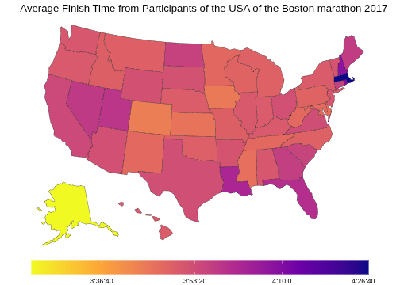
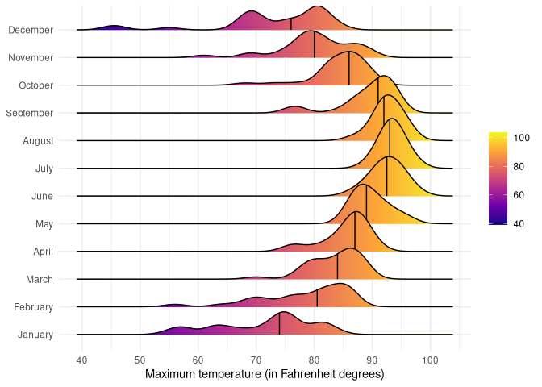

# Data Visualization and Reproducible Research

> Per Sander

The following are the 3 projects created for the data visualization class

## Project 01

In the `project_01/` folder you can find a project about car fuel data. In this project fuel data which contains new cars by year is analyzed with a focus on mpg values. The purpose of this project is to gain experience using ggplot while following principles learned in CAP5735 Data Visualization and Reproducible Research. The key takeaways: MPG has not increased between 1984 and to around 2010 for car models using premium or regular fuel type. At the same time, car models with better fuel economy reaching higher MPG were produced. Around 2010 average mpg for new models started to increase.

Checkout /project-01/Readme.md for more info

**Sample data visualization: (check html file for an interactive version)**

*[Boxplot of mpg of cars by year]*

## Project 02

In this project, I explored data from the Boston marathon 2017. The goal of the project was to explore interactive graphs and spatial visualization. The library ggigraph with geom_sf was used for the graphs. The data included data such as age country of origin and various times.

Find the code, report, and readme in the `project_02/` folder for more info.

**Sample data visualization: (check html file for an interactive version)**

*[graph showing finish time by county]*

## Project 03

In this project, I explored the 2022 data from the FSU Florida Climate Center and the text of the lyrics of the top 100 songs from 2015. The purpose of this project was to explore different types of graphs and to perform a text analysis using bigrams.

Checkout /project-03/Readme.md for more info

**Sample data visualization:**

*[graph showing probability density curve for each month in 2022 from the FSU Climate center data]*

### Moving Forward

In this class, I not only learned how to create a specific graph using ggplot but also how to show data correctly. Data can be encoded using position, size, color, brightness, shape, and angles. However, some of these are easier to read and understand than others. A pie chart in which angles present proportions is much harder to read than a bar graph in which the height of the area represents the proportion. Different color pallets should be used depending on the data and what should be highlighted. A distinction for color is whether the data is discrete or continuous. For continuous a gradient changing from a dark color to a bright color can be used. For discrete distinct colors that appear to have a similar brightness should be used.

But its not only about data encoding. It's also about presenting your data through storytelling and having nice aesthetics. For example: The location of the title should be top left of the graph as our eyes are naturally drawn to that location and bright colors stand out more than darker colors.

The purpose of storytelling is not just presenting data but to communicate to the audience what is important and what they should do because of it. It turns a data visualization from an interesting visualization into a meaningful visualization.

I am looking forward to learning more about storytelling and interactive graphs.