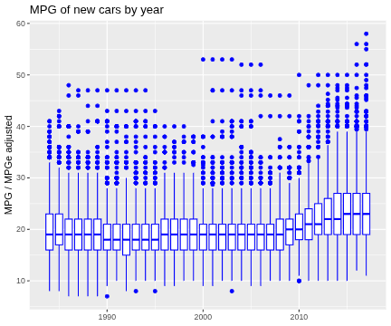
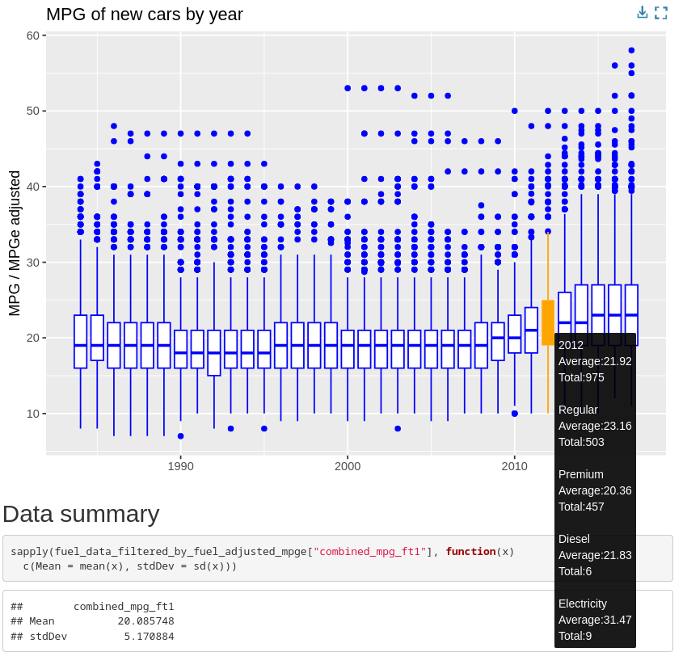

# Data Visualization

> Per Sander.

## Mini-Project 1

In this project fuel_data which contains new cars by year is analyzed with a focus on mpg values. The purpose of this project is to gain experience using ggplot while following principles learned in CAP5735 Data Visualization and Reproducible Research.

The key takeaways: MPG has not increased between 1984 and to around 2010 for car models using premium or regular fuel type. At the same time, car models with better fuel economy reaching higher MPG were produced. Around 2010 average mpg for new models started to increase slightly. While electric vehicles are more efficient, comparing the MPGe value to MPG is misleading and should not be done without the introduction of a more realistic conversion of gallons to kWh.

The report can be found in sander_project_01.html or sander_project_01.md (The md file on github does not display interactive graphs correctly)

### files

- All code for this project is in sander_project_01.Rmd
- The generated report is in sander_project_01.html (Interactive graphs work in this format)
- A github friendly version is also available in sander_project_01.md (However, this version does not support the interactive graphs in github)

### data files

The data files are in:

../data/

Used by this project:

- ../data/fuel.csv

## 1 Interactive Chart

The following interactive boxplot graph was created: *(check out sander_project_01.html for an interactive version)*



When hovering over the boxplots for each year additional information for the data for that year is shown as seen in the image below:



The additonal data shows what influence the type of cars had to the overall population as well as the exact average for the population.

## 2 Accessibility

For accessibility fig.alt text were included for each graph, and colorblind safe colors and pallets were chosen.(viridis turbo used and blue and black colors tested using this tool <https://rgblind.com/color-blindness-simulator>)

The library ggigraph did not seem to include the fig.alt text. The following workaround was used:

``` r
library(htmltools)

browsable(
  tags$div(
    `aria-label` = "fig.alt text here ...",
    role = "img",
    interactive_graph
  )
)
```

This workaround puts the graph into a div container with text for screen readers.

## 3 bad chart redesign

All graphs were slightly reworked but the original graph 2 is still included as a bad example and for before/after comparisons.

### bad example


### reworked graph


The graph before was a scatterplot with the purpose of showing a trend of average mpg from year 1984 to 2017. The graph afterwards is an interactive boxplot graph *(check out sander_project_01.html for an interactive version)*.

The main problem of the original graph was that the trend was visible in the trend line but not in the scatterplot data. The problem was that even though points were slightly opaque, to many points had the same value and stacked on each other hid how many points were at each point. One solution used in other graphs in this project would been to inccrease some jitter in the horizontal spacing of the points. However, for this graph I decided to redesign it as an interactive boxplot. A boxplot visualizes the distribution of a population while also making outliers easily visible. The interactive part of the graph gives some additional information to the population for each year such as the actual average, and what car types within that distribution made up the population.
