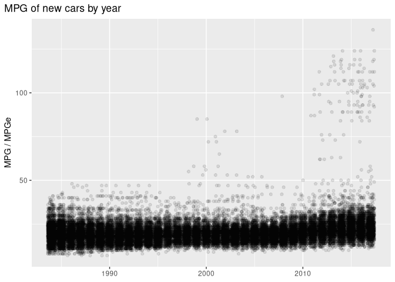
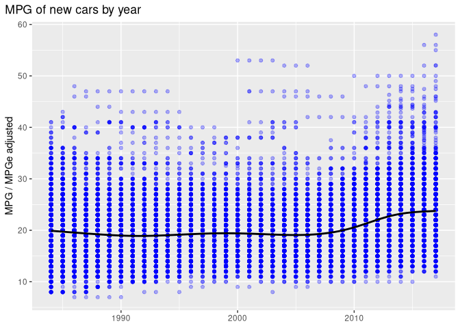
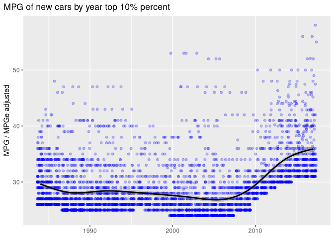
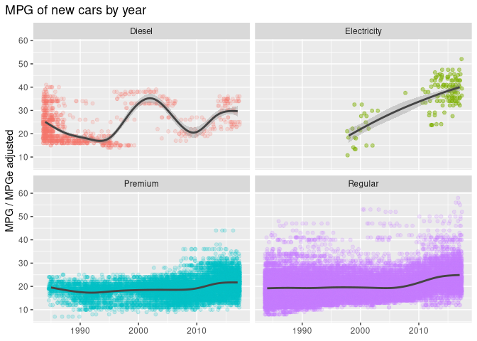
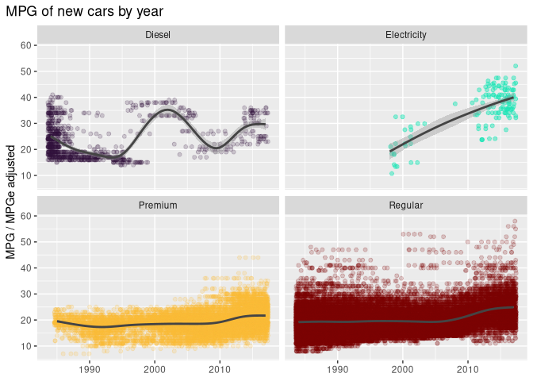

## Legend
[Data Loading, initial filtering, and Graph 1](#data-loading-and-graph1)

[Graph 2](#graph-2)

[Graph 2 reworked](#graph-2-reworked)

[Data Summary](#data-summary)

[Graph 3 top performing cars by mpg](#graph-3-top-performing-cars-by-mpg)

[Graph 4 trend for specific fuel types](#graph-4-trend-for-specific-fuel-types)

[Graph 5 Amount of cars by fuel type](#graph-5-amount-of-cars-by-fuel-type)

[Discussion](#discussion)


## Data Loading and Graph 1

``` r
library(tidyverse)
```

```
## ── Attaching core tidyverse packages ──────────────────────── tidyverse 2.0.0 ──
## ✔ dplyr     1.2.1     ✔ readr     2.2.0
## ✔ forcats   1.0.1     ✔ stringr   1.6.0
## ✔ ggplot2   4.0.3     ✔ tibble    3.3.1
## ✔ lubridate 1.9.5     ✔ tidyr     1.3.2
## ✔ purrr     1.2.2     
## ── Conflicts ────────────────────────────────────────── tidyverse_conflicts() ──
## ✖ dplyr::filter() masks stats::filter()
## ✖ dplyr::lag()    masks stats::lag()
## ℹ Use the conflicted package (<http://conflicted.r-lib.org/>) to force all conflicts to become errors
```

``` r
fuel_csv = "../data/fuel.csv"
fuel_data = read.csv(fuel_csv)
```


``` r
# Filter for fuel type Regular, Premium, Electricity, Diesel,
fuel_data_filtered_by_fuel <- fuel_data %>% filter(fuel_type %in% c("Regular", "Diesel", "Premium", "Electricity"))


graph1 <- ggplot(data = fuel_data_filtered_by_fuel, aes(x = year, y = combined_mpg_ft1)) +
  geom_jitter(height = 0, alpha = 0.1) +
  labs(x = NULL, y = "MPG / MPGe" , title = "MPG of new cars by year") +
  theme(plot.title.position = "plot")
graph1
```

<!-- -->

## Initial Data filtering 
This project focuses on cars with one of these four fuel types: "Regular", "Diesel", "Premium", and "Electricity". Hybrids were also dropped from the data as the hybrid category was not well defined in the data set (Hybrid cars were defined as Regular gas and Electricity or regular gas or electricity, with 4 categories for electric hybrid cars and 2 for gas petroleum hybrid cars). 


Electric vehicles also have an MPG value (MPGe) which is calculated by using the following formula:

**MPGe = EG * MPkwh**

* EG = energy per gallon of regular fuel in kwh (33.7kWh)
* MPkwh = miles per kwh the car can drive (combined score of city and highway driving)


However, the EG measurement of 33.7kWh assumes a perfect conversion of energy stored in a gallon of fuel to electricity. In other words, when comparing traditional gasoline cars to electric vehicles, it would be more appropriate to use an efficiency value from current petroleum powered power plants. (Ideally from using the same type of petroleum fuel, but this is ignored based on the availability of data and because cars of different fuel grade are already being compared.) According to EIA (US Energy information Administration) petroleum based power plants produced 12.9kWh/gallon. ***[source]( https://www.eia.gov/tools/faqs/faq.php?id=667&t=3)*** (This might compare the efficiency of Electric vehicles more accurately to more traditional cars, but it completely ignores that electricity is also generated from other fossil fuel sources and renewable energy sources) Below is the same graph from above with the data adjusted accordingly.


**The adjusted MPGe value is not a standard. It is a derived value I developed for better comparison to more traditional cars. This does not affect overall trends observed as the majority of cars is powered by gasoline** 

## Graph 2

``` r
#Adjusted MPGe value ratio
ratio <- 12.9 / 33.7

fuel_data_filtered_by_fuel_adjusted_mpge <- fuel_data_filtered_by_fuel %>% mutate(
  combined_mpg_ft1 = if_else(
    fuel_type == "Electricity",
    combined_mpg_ft1 * ratio,
    combined_mpg_ft1
  )
)

graph2 <- ggplot(data = fuel_data_filtered_by_fuel_adjusted_mpge, aes(x =
                                                                        year, y = combined_mpg_ft1))
graph2 <- graph2 + geom_point(color = "blue", alpha = 0.3)
graph2 <- graph2 + labs(x = NULL, y = "MPG / MPGe adjusted", title = "MPG of new cars by year")
graph2 <- graph2 + geom_smooth(method = "gam", color = "black")
graph2 <- graph2 + theme(plot.title.position = "plot")

graph2
```

```
## `geom_smooth()` using formula = 'y ~ s(x, bs = "cs")'
```

<!-- -->

## Graph 2 reworked


``` r
library(ggiraph)
library(glue)


placeholder_if_NA <- function(value, fuel_type_value) {
  if_else(is.na(value),
          glue('{fuel_type_value}</br>Average: NA </br>Total: 0'),
          value)
}

fuel_data_filtered_by_fuel_adjusted_mpge_stat_text <-
  fuel_data_filtered_by_fuel_adjusted_mpge %>%
  group_by(year, fuel_type) %>%
  mutate(
    avg_year_fuel = round(mean(combined_mpg_ft1), 2),
    total_year_fuel = n(),
    my_tooltip_fuel =
      glue(
        '{fuel_type}</br>Average:{avg_year_fuel}</br>Total:{total_year_fuel}'
      )
  ) %>%
  ungroup() %>%
  group_by(year) %>%
  mutate(
    avg_year = round(mean(combined_mpg_ft1), 2),
    total_year = n(),
    my_tooltip = glue(
      '{year}</br>Average:{avg_year}</br>Total:{total_year}</br></br>{placeholder_if_NA(my_tooltip_fuel[fuel_type == "Regular"][1], "Regular")}</br></br>{placeholder_if_NA(my_tooltip_fuel[fuel_type == "Premium"][1], "Premium")}</br></br>{placeholder_if_NA(my_tooltip_fuel[fuel_type == "Diesel"][1], "Diesel")}</br></br>{placeholder_if_NA(my_tooltip_fuel[fuel_type == "Electricity"][1], "Electricity")}'
    ),
  ) %>%
  ungroup()


graph2_reworked <- ggplot(data = fuel_data_filtered_by_fuel_adjusted_mpge_stat_text, aes(x =
                                                                                           year, y = combined_mpg_ft1, group = year, )) +
  geom_boxplot_interactive(color = "blue", aes(
    data_id = year,
    tooltip = if_else(is.na(my_tooltip), "", my_tooltip)
  )) +
  labs(x = NULL, y = "MPG / MPGe adjusted", title = "MPG of new cars by year")


girafe(ggobj = graph2_reworked)
```

```{=html}
<div class="girafe html-widget html-fill-item" id="htmlwidget-82f915093e8172463423" style="width:672px;height:480px;"></div>
<script type="application/json" data-for="htmlwidget-82f915093e8172463423">{"x":{"html":"<?xml version=\"1.0\" encoding=\"UTF-8\"?>\n<svg xmlns='http://www.w3.org/2000/svg' xmlns:xlink='http://www.w3.org/1999/xlink' class='ggiraph-svg' role='graphics-document' id='svg_dae1c58306cd2f7b' viewBox='0 0 504 360'>\n <defs id='svg_dae1c58306cd2f7b_defs'>\n  <clipPath id='svg_dae1c58306cd2f7b_c1'>\n   <rect x='0' y='0' width='504' height='360'/>\n  <\/clipPath>\n  <clipPath id='svg_dae1c58306cd2f7b_c2'>\n   <rect x='32.79' y='22.77' width='465.73' height='318.94'/>\n  <\/clipPath>\n <\/defs>\n <g id='svg_dae1c58306cd2f7b_rootg' class='ggiraph-svg-rootg'>\n  <g clip-path='url(#svg_dae1c58306cd2f7b_c1)'>\n   <rect x='0' y='0' width='504' height='360' fill='#FFFFFF' fill-opacity='1' stroke='#FFFFFF' stroke-opacity='1' stroke-width='0.75' stroke-linejoin='round' stroke-linecap='round' class='ggiraph-svg-bg'/>\n   <rect x='0' y='0' width='504' height='360' fill='#FFFFFF' fill-opacity='1' stroke='#FFFFFF' stroke-opacity='1' stroke-width='1.07' stroke-linejoin='round' stroke-linecap='round'/>\n  <\/g>\n  <g clip-path='url(#svg_dae1c58306cd2f7b_c2)'>\n   <rect x='32.79' y='22.77' width='465.73' height='318.94' fill='#EBEBEB' fill-opacity='1' stroke='none'/>\n   <polyline points='32.79,338.58 498.52,338.58' fill='none' stroke='#FFFFFF' stroke-opacity='1' stroke-width='0.53' stroke-linejoin='round' stroke-linecap='butt'/>\n   <polyline points='32.79,281.73 498.52,281.73' fill='none' stroke='#FFFFFF' stroke-opacity='1' stroke-width='0.53' stroke-linejoin='round' stroke-linecap='butt'/>\n   <polyline points='32.79,224.87 498.52,224.87' fill='none' stroke='#FFFFFF' stroke-opacity='1' stroke-width='0.53' stroke-linejoin='round' stroke-linecap='butt'/>\n   <polyline points='32.79,168.02 498.52,168.02' fill='none' stroke='#FFFFFF' stroke-opacity='1' stroke-width='0.53' stroke-linejoin='round' stroke-linecap='butt'/>\n   <polyline points='32.79,111.17 498.52,111.17' fill='none' stroke='#FFFFFF' stroke-opacity='1' stroke-width='0.53' stroke-linejoin='round' stroke-linecap='butt'/>\n   <polyline points='32.79,54.32 498.52,54.32' fill='none' stroke='#FFFFFF' stroke-opacity='1' stroke-width='0.53' stroke-linejoin='round' stroke-linecap='butt'/>\n   <polyline points='71.21,341.71 71.21,22.77' fill='none' stroke='#FFFFFF' stroke-opacity='1' stroke-width='0.53' stroke-linejoin='round' stroke-linecap='butt'/>\n   <polyline points='196.66,341.71 196.66,22.77' fill='none' stroke='#FFFFFF' stroke-opacity='1' stroke-width='0.53' stroke-linejoin='round' stroke-linecap='butt'/>\n   <polyline points='322.11,341.71 322.11,22.77' fill='none' stroke='#FFFFFF' stroke-opacity='1' stroke-width='0.53' stroke-linejoin='round' stroke-linecap='butt'/>\n   <polyline points='447.56,341.71 447.56,22.77' fill='none' stroke='#FFFFFF' stroke-opacity='1' stroke-width='0.53' stroke-linejoin='round' stroke-linecap='butt'/>\n   <polyline points='32.79,310.15 498.52,310.15' fill='none' stroke='#FFFFFF' stroke-opacity='1' stroke-width='1.07' stroke-linejoin='round' stroke-linecap='butt'/>\n   <polyline points='32.79,253.30 498.52,253.30' fill='none' stroke='#FFFFFF' stroke-opacity='1' stroke-width='1.07' stroke-linejoin='round' stroke-linecap='butt'/>\n   <polyline points='32.79,196.45 498.52,196.45' fill='none' stroke='#FFFFFF' stroke-opacity='1' stroke-width='1.07' stroke-linejoin='round' stroke-linecap='butt'/>\n   <polyline points='32.79,139.60 498.52,139.60' fill='none' stroke='#FFFFFF' stroke-opacity='1' stroke-width='1.07' stroke-linejoin='round' stroke-linecap='butt'/>\n   <polyline points='32.79,82.75 498.52,82.75' fill='none' stroke='#FFFFFF' stroke-opacity='1' stroke-width='1.07' stroke-linejoin='round' stroke-linecap='butt'/>\n   <polyline points='32.79,25.89 498.52,25.89' fill='none' stroke='#FFFFFF' stroke-opacity='1' stroke-width='1.07' stroke-linejoin='round' stroke-linecap='butt'/>\n   <polyline points='133.94,341.71 133.94,22.77' fill='none' stroke='#FFFFFF' stroke-opacity='1' stroke-width='1.07' stroke-linejoin='round' stroke-linecap='butt'/>\n   <polyline points='259.38,341.71 259.38,22.77' fill='none' stroke='#FFFFFF' stroke-opacity='1' stroke-width='1.07' stroke-linejoin='round' stroke-linecap='butt'/>\n   <polyline points='384.83,341.71 384.83,22.77' fill='none' stroke='#FFFFFF' stroke-opacity='1' stroke-width='1.07' stroke-linejoin='round' stroke-linecap='butt'/>\n   <circle cx='58.67' cy='162.34' r='1.47pt' fill='#0000FF' fill-opacity='1' stroke='#0000FF' stroke-opacity='1' stroke-width='0.71' stroke-linejoin='round' stroke-linecap='round'/>\n   <circle cx='58.67' cy='162.34' r='1.47pt' fill='#0000FF' fill-opacity='1' stroke='#0000FF' stroke-opacity='1' stroke-width='0.71' stroke-linejoin='round' stroke-linecap='round'/>\n   <circle cx='58.67' cy='173.71' r='1.47pt' fill='#0000FF' fill-opacity='1' stroke='#0000FF' stroke-opacity='1' stroke-width='0.71' stroke-linejoin='round' stroke-linecap='round'/>\n   <circle cx='58.67' cy='145.28' r='1.47pt' fill='#0000FF' fill-opacity='1' stroke='#0000FF' stroke-opacity='1' stroke-width='0.71' stroke-linejoin='round' stroke-linecap='round'/>\n   <circle cx='58.67' cy='173.71' r='1.47pt' fill='#0000FF' fill-opacity='1' stroke='#0000FF' stroke-opacity='1' stroke-width='0.71' stroke-linejoin='round' stroke-linecap='round'/>\n   <circle cx='58.67' cy='173.71' r='1.47pt' fill='#0000FF' fill-opacity='1' stroke='#0000FF' stroke-opacity='1' stroke-width='0.71' stroke-linejoin='round' stroke-linecap='round'/>\n   <circle cx='58.67' cy='173.71' r='1.47pt' fill='#0000FF' fill-opacity='1' stroke='#0000FF' stroke-opacity='1' stroke-width='0.71' stroke-linejoin='round' stroke-linecap='round'/>\n   <circle cx='58.67' cy='173.71' r='1.47pt' fill='#0000FF' fill-opacity='1' stroke='#0000FF' stroke-opacity='1' stroke-width='0.71' stroke-linejoin='round' stroke-linecap='round'/>\n   <circle cx='58.67' cy='173.71' r='1.47pt' fill='#0000FF' fill-opacity='1' stroke='#0000FF' stroke-opacity='1' stroke-width='0.71' stroke-linejoin='round' stroke-linecap='round'/>\n   <circle cx='58.67' cy='173.71' r='1.47pt' fill='#0000FF' fill-opacity='1' stroke='#0000FF' stroke-opacity='1' stroke-width='0.71' stroke-linejoin='round' stroke-linecap='round'/>\n   <circle cx='58.67' cy='168.02' r='1.47pt' fill='#0000FF' fill-opacity='1' stroke='#0000FF' stroke-opacity='1' stroke-width='0.71' stroke-linejoin='round' stroke-linecap='round'/>\n   <circle cx='58.67' cy='133.91' r='1.47pt' fill='#0000FF' fill-opacity='1' stroke='#0000FF' stroke-opacity='1' stroke-width='0.71' stroke-linejoin='round' stroke-linecap='round'/>\n   <circle cx='58.67' cy='145.28' r='1.47pt' fill='#0000FF' fill-opacity='1' stroke='#0000FF' stroke-opacity='1' stroke-width='0.71' stroke-linejoin='round' stroke-linecap='round'/>\n   <circle cx='58.67' cy='168.02' r='1.47pt' fill='#0000FF' fill-opacity='1' stroke='#0000FF' stroke-opacity='1' stroke-width='0.71' stroke-linejoin='round' stroke-linecap='round'/>\n   <circle cx='58.67' cy='145.28' r='1.47pt' fill='#0000FF' fill-opacity='1' stroke='#0000FF' stroke-opacity='1' stroke-width='0.71' stroke-linejoin='round' stroke-linecap='round'/>\n   <circle cx='58.67' cy='173.71' r='1.47pt' fill='#0000FF' fill-opacity='1' stroke='#0000FF' stroke-opacity='1' stroke-width='0.71' stroke-linejoin='round' stroke-linecap='round'/>\n   <circle cx='58.67' cy='173.71' r='1.47pt' fill='#0000FF' fill-opacity='1' stroke='#0000FF' stroke-opacity='1' stroke-width='0.71' stroke-linejoin='round' stroke-linecap='round'/>\n   <circle cx='58.67' cy='173.71' r='1.47pt' fill='#0000FF' fill-opacity='1' stroke='#0000FF' stroke-opacity='1' stroke-width='0.71' stroke-linejoin='round' stroke-linecap='round'/>\n   <circle cx='58.67' cy='173.71' r='1.47pt' fill='#0000FF' fill-opacity='1' stroke='#0000FF' stroke-opacity='1' stroke-width='0.71' stroke-linejoin='round' stroke-linecap='round'/>\n   <circle cx='58.67' cy='173.71' r='1.47pt' fill='#0000FF' fill-opacity='1' stroke='#0000FF' stroke-opacity='1' stroke-width='0.71' stroke-linejoin='round' stroke-linecap='round'/>\n   <circle cx='58.67' cy='173.71' r='1.47pt' fill='#0000FF' fill-opacity='1' stroke='#0000FF' stroke-opacity='1' stroke-width='0.71' stroke-linejoin='round' stroke-linecap='round'/>\n   <circle cx='58.67' cy='173.71' r='1.47pt' fill='#0000FF' fill-opacity='1' stroke='#0000FF' stroke-opacity='1' stroke-width='0.71' stroke-linejoin='round' stroke-linecap='round'/>\n   <circle cx='58.67' cy='133.91' r='1.47pt' fill='#0000FF' fill-opacity='1' stroke='#0000FF' stroke-opacity='1' stroke-width='0.71' stroke-linejoin='round' stroke-linecap='round'/>\n   <circle cx='58.67' cy='139.6' r='1.47pt' fill='#0000FF' fill-opacity='1' stroke='#0000FF' stroke-opacity='1' stroke-width='0.71' stroke-linejoin='round' stroke-linecap='round'/>\n   <circle cx='58.67' cy='162.34' r='1.47pt' fill='#0000FF' fill-opacity='1' stroke='#0000FF' stroke-opacity='1' stroke-width='0.71' stroke-linejoin='round' stroke-linecap='round'/>\n   <circle cx='58.67' cy='156.65' r='1.47pt' fill='#0000FF' fill-opacity='1' stroke='#0000FF' stroke-opacity='1' stroke-width='0.71' stroke-linejoin='round' stroke-linecap='round'/>\n   <circle cx='58.67' cy='168.02' r='1.47pt' fill='#0000FF' fill-opacity='1' stroke='#0000FF' stroke-opacity='1' stroke-width='0.71' stroke-linejoin='round' stroke-linecap='round'/>\n   <circle cx='58.67' cy='162.34' r='1.47pt' fill='#0000FF' fill-opacity='1' stroke='#0000FF' stroke-opacity='1' stroke-width='0.71' stroke-linejoin='round' stroke-linecap='round'/>\n   <circle cx='58.67' cy='173.71' r='1.47pt' fill='#0000FF' fill-opacity='1' stroke='#0000FF' stroke-opacity='1' stroke-width='0.71' stroke-linejoin='round' stroke-linecap='round'/>\n   <circle cx='58.67' cy='162.34' r='1.47pt' fill='#0000FF' fill-opacity='1' stroke='#0000FF' stroke-opacity='1' stroke-width='0.71' stroke-linejoin='round' stroke-linecap='round'/>\n   <circle cx='58.67' cy='162.34' r='1.47pt' fill='#0000FF' fill-opacity='1' stroke='#0000FF' stroke-opacity='1' stroke-width='0.71' stroke-linejoin='round' stroke-linecap='round'/>\n   <circle cx='58.67' cy='150.97' r='1.47pt' fill='#0000FF' fill-opacity='1' stroke='#0000FF' stroke-opacity='1' stroke-width='0.71' stroke-linejoin='round' stroke-linecap='round'/>\n   <circle cx='58.67' cy='162.34' r='1.47pt' fill='#0000FF' fill-opacity='1' stroke='#0000FF' stroke-opacity='1' stroke-width='0.71' stroke-linejoin='round' stroke-linecap='round'/>\n   <circle cx='58.67' cy='156.65' r='1.47pt' fill='#0000FF' fill-opacity='1' stroke='#0000FF' stroke-opacity='1' stroke-width='0.71' stroke-linejoin='round' stroke-linecap='round'/>\n   <circle cx='58.67' cy='173.71' r='1.47pt' fill='#0000FF' fill-opacity='1' stroke='#0000FF' stroke-opacity='1' stroke-width='0.71' stroke-linejoin='round' stroke-linecap='round'/>\n   <circle cx='58.67' cy='173.71' r='1.47pt' fill='#0000FF' fill-opacity='1' stroke='#0000FF' stroke-opacity='1' stroke-width='0.71' stroke-linejoin='round' stroke-linecap='round'/>\n   <circle cx='58.67' cy='162.34' r='1.47pt' fill='#0000FF' fill-opacity='1' stroke='#0000FF' stroke-opacity='1' stroke-width='0.71' stroke-linejoin='round' stroke-linecap='round'/>\n   <circle cx='58.67' cy='156.65' r='1.47pt' fill='#0000FF' fill-opacity='1' stroke='#0000FF' stroke-opacity='1' stroke-width='0.71' stroke-linejoin='round' stroke-linecap='round'/>\n   <circle cx='58.67' cy='168.02' r='1.47pt' fill='#0000FF' fill-opacity='1' stroke='#0000FF' stroke-opacity='1' stroke-width='0.71' stroke-linejoin='round' stroke-linecap='round'/>\n   <circle cx='58.67' cy='173.71' r='1.47pt' fill='#0000FF' fill-opacity='1' stroke='#0000FF' stroke-opacity='1' stroke-width='0.71' stroke-linejoin='round' stroke-linecap='round'/>\n   <circle cx='58.67' cy='173.71' r='1.47pt' fill='#0000FF' fill-opacity='1' stroke='#0000FF' stroke-opacity='1' stroke-width='0.71' stroke-linejoin='round' stroke-linecap='round'/>\n   <circle cx='58.67' cy='150.97' r='1.47pt' fill='#0000FF' fill-opacity='1' stroke='#0000FF' stroke-opacity='1' stroke-width='0.71' stroke-linejoin='round' stroke-linecap='round'/>\n   <circle cx='58.67' cy='150.97' r='1.47pt' fill='#0000FF' fill-opacity='1' stroke='#0000FF' stroke-opacity='1' stroke-width='0.71' stroke-linejoin='round' stroke-linecap='round'/>\n   <circle cx='58.67' cy='162.34' r='1.47pt' fill='#0000FF' fill-opacity='1' stroke='#0000FF' stroke-opacity='1' stroke-width='0.71' stroke-linejoin='round' stroke-linecap='round'/>\n   <line id='svg_dae1c58306cd2f7b_e1' x1='58.67' y1='236.25' x2='58.67' y2='179.39' stroke='#0000FF' stroke-opacity='1' stroke-width='1.07' stroke-linejoin='round' stroke-linecap='butt' data-id='1984' title='1984&amp;lt;/br&amp;gt;Average:19.88&amp;lt;/br&amp;gt;Total:1964&amp;lt;/br&amp;gt;&amp;lt;/br&amp;gt;Regular&amp;lt;/br&amp;gt;Average:19.12&amp;lt;/br&amp;gt;Total:1702&amp;lt;/br&amp;gt;&amp;lt;/br&amp;gt;Premium&amp;lt;/br&amp;gt;Average: NA &amp;lt;/br&amp;gt;Total: 0&amp;lt;/br&amp;gt;&amp;lt;/br&amp;gt;Diesel&amp;lt;/br&amp;gt;Average:24.82&amp;lt;/br&amp;gt;Total:262&amp;lt;/br&amp;gt;&amp;lt;/br&amp;gt;Electricity&amp;lt;/br&amp;gt;Average: NA &amp;lt;/br&amp;gt;Total: 0'/>\n   <line id='svg_dae1c58306cd2f7b_e2' x1='58.67' y1='276.04' x2='58.67' y2='321.52' stroke='#0000FF' stroke-opacity='1' stroke-width='1.07' stroke-linejoin='round' stroke-linecap='butt' data-id='1984' title='1984&amp;lt;/br&amp;gt;Average:19.88&amp;lt;/br&amp;gt;Total:1964&amp;lt;/br&amp;gt;&amp;lt;/br&amp;gt;Regular&amp;lt;/br&amp;gt;Average:19.12&amp;lt;/br&amp;gt;Total:1702&amp;lt;/br&amp;gt;&amp;lt;/br&amp;gt;Premium&amp;lt;/br&amp;gt;Average: NA &amp;lt;/br&amp;gt;Total: 0&amp;lt;/br&amp;gt;&amp;lt;/br&amp;gt;Diesel&amp;lt;/br&amp;gt;Average:24.82&amp;lt;/br&amp;gt;Total:262&amp;lt;/br&amp;gt;&amp;lt;/br&amp;gt;Electricity&amp;lt;/br&amp;gt;Average: NA &amp;lt;/br&amp;gt;Total: 0'/>\n   <polygon id='svg_dae1c58306cd2f7b_e3' points='53.96,236.25 53.96,276.04 63.37,276.04 63.37,236.25 53.96,236.25' fill='#FFFFFF' fill-opacity='1' stroke='#0000FF' stroke-opacity='1' stroke-width='1.07' stroke-linejoin='miter' stroke-linecap='butt' data-id='1984' title='1984&amp;lt;/br&amp;gt;Average:19.88&amp;lt;/br&amp;gt;Total:1964&amp;lt;/br&amp;gt;&amp;lt;/br&amp;gt;Regular&amp;lt;/br&amp;gt;Average:19.12&amp;lt;/br&amp;gt;Total:1702&amp;lt;/br&amp;gt;&amp;lt;/br&amp;gt;Premium&amp;lt;/br&amp;gt;Average: NA &amp;lt;/br&amp;gt;Total: 0&amp;lt;/br&amp;gt;&amp;lt;/br&amp;gt;Diesel&amp;lt;/br&amp;gt;Average:24.82&amp;lt;/br&amp;gt;Total:262&amp;lt;/br&amp;gt;&amp;lt;/br&amp;gt;Electricity&amp;lt;/br&amp;gt;Average: NA &amp;lt;/br&amp;gt;Total: 0'/>\n   <line id='svg_dae1c58306cd2f7b_e4' x1='53.96' y1='258.99' x2='63.37' y2='258.99' stroke='#0000FF' stroke-opacity='1' stroke-width='2.13' stroke-linejoin='miter' stroke-linecap='butt' data-id='1984' title='1984&amp;lt;/br&amp;gt;Average:19.88&amp;lt;/br&amp;gt;Total:1964&amp;lt;/br&amp;gt;&amp;lt;/br&amp;gt;Regular&amp;lt;/br&amp;gt;Average:19.12&amp;lt;/br&amp;gt;Total:1702&amp;lt;/br&amp;gt;&amp;lt;/br&amp;gt;Premium&amp;lt;/br&amp;gt;Average: NA &amp;lt;/br&amp;gt;Total: 0&amp;lt;/br&amp;gt;&amp;lt;/br&amp;gt;Diesel&amp;lt;/br&amp;gt;Average:24.82&amp;lt;/br&amp;gt;Total:262&amp;lt;/br&amp;gt;&amp;lt;/br&amp;gt;Electricity&amp;lt;/br&amp;gt;Average: NA &amp;lt;/br&amp;gt;Total: 0'/>\n   <circle cx='71.21' cy='162.34' r='1.47pt' fill='#0000FF' fill-opacity='1' stroke='#0000FF' stroke-opacity='1' stroke-width='0.71' stroke-linejoin='round' stroke-linecap='round'/>\n   <circle cx='71.21' cy='168.02' r='1.47pt' fill='#0000FF' fill-opacity='1' stroke='#0000FF' stroke-opacity='1' stroke-width='0.71' stroke-linejoin='round' stroke-linecap='round'/>\n   <circle cx='71.21' cy='162.34' r='1.47pt' fill='#0000FF' fill-opacity='1' stroke='#0000FF' stroke-opacity='1' stroke-width='0.71' stroke-linejoin='round' stroke-linecap='round'/>\n   <circle cx='71.21' cy='128.23' r='1.47pt' fill='#0000FF' fill-opacity='1' stroke='#0000FF' stroke-opacity='1' stroke-width='0.71' stroke-linejoin='round' stroke-linecap='round'/>\n   <circle cx='71.21' cy='173.71' r='1.47pt' fill='#0000FF' fill-opacity='1' stroke='#0000FF' stroke-opacity='1' stroke-width='0.71' stroke-linejoin='round' stroke-linecap='round'/>\n   <circle cx='71.21' cy='179.39' r='1.47pt' fill='#0000FF' fill-opacity='1' stroke='#0000FF' stroke-opacity='1' stroke-width='0.71' stroke-linejoin='round' stroke-linecap='round'/>\n   <circle cx='71.21' cy='179.39' r='1.47pt' fill='#0000FF' fill-opacity='1' stroke='#0000FF' stroke-opacity='1' stroke-width='0.71' stroke-linejoin='round' stroke-linecap='round'/>\n   <circle cx='71.21' cy='173.71' r='1.47pt' fill='#0000FF' fill-opacity='1' stroke='#0000FF' stroke-opacity='1' stroke-width='0.71' stroke-linejoin='round' stroke-linecap='round'/>\n   <circle cx='71.21' cy='139.6' r='1.47pt' fill='#0000FF' fill-opacity='1' stroke='#0000FF' stroke-opacity='1' stroke-width='0.71' stroke-linejoin='round' stroke-linecap='round'/>\n   <circle cx='71.21' cy='173.71' r='1.47pt' fill='#0000FF' fill-opacity='1' stroke='#0000FF' stroke-opacity='1' stroke-width='0.71' stroke-linejoin='round' stroke-linecap='round'/>\n   <circle cx='71.21' cy='173.71' r='1.47pt' fill='#0000FF' fill-opacity='1' stroke='#0000FF' stroke-opacity='1' stroke-width='0.71' stroke-linejoin='round' stroke-linecap='round'/>\n   <circle cx='71.21' cy='173.71' r='1.47pt' fill='#0000FF' fill-opacity='1' stroke='#0000FF' stroke-opacity='1' stroke-width='0.71' stroke-linejoin='round' stroke-linecap='round'/>\n   <circle cx='71.21' cy='173.71' r='1.47pt' fill='#0000FF' fill-opacity='1' stroke='#0000FF' stroke-opacity='1' stroke-width='0.71' stroke-linejoin='round' stroke-linecap='round'/>\n   <circle cx='71.21' cy='173.71' r='1.47pt' fill='#0000FF' fill-opacity='1' stroke='#0000FF' stroke-opacity='1' stroke-width='0.71' stroke-linejoin='round' stroke-linecap='round'/>\n   <circle cx='71.21' cy='133.91' r='1.47pt' fill='#0000FF' fill-opacity='1' stroke='#0000FF' stroke-opacity='1' stroke-width='0.71' stroke-linejoin='round' stroke-linecap='round'/>\n   <circle cx='71.21' cy='122.54' r='1.47pt' fill='#0000FF' fill-opacity='1' stroke='#0000FF' stroke-opacity='1' stroke-width='0.71' stroke-linejoin='round' stroke-linecap='round'/>\n   <circle cx='71.21' cy='168.02' r='1.47pt' fill='#0000FF' fill-opacity='1' stroke='#0000FF' stroke-opacity='1' stroke-width='0.71' stroke-linejoin='round' stroke-linecap='round'/>\n   <circle cx='71.21' cy='179.39' r='1.47pt' fill='#0000FF' fill-opacity='1' stroke='#0000FF' stroke-opacity='1' stroke-width='0.71' stroke-linejoin='round' stroke-linecap='round'/>\n   <circle cx='71.21' cy='179.39' r='1.47pt' fill='#0000FF' fill-opacity='1' stroke='#0000FF' stroke-opacity='1' stroke-width='0.71' stroke-linejoin='round' stroke-linecap='round'/>\n   <circle cx='71.21' cy='173.71' r='1.47pt' fill='#0000FF' fill-opacity='1' stroke='#0000FF' stroke-opacity='1' stroke-width='0.71' stroke-linejoin='round' stroke-linecap='round'/>\n   <circle cx='71.21' cy='139.6' r='1.47pt' fill='#0000FF' fill-opacity='1' stroke='#0000FF' stroke-opacity='1' stroke-width='0.71' stroke-linejoin='round' stroke-linecap='round'/>\n   <circle cx='71.21' cy='173.71' r='1.47pt' fill='#0000FF' fill-opacity='1' stroke='#0000FF' stroke-opacity='1' stroke-width='0.71' stroke-linejoin='round' stroke-linecap='round'/>\n   <circle cx='71.21' cy='173.71' r='1.47pt' fill='#0000FF' fill-opacity='1' stroke='#0000FF' stroke-opacity='1' stroke-width='0.71' stroke-linejoin='round' stroke-linecap='round'/>\n   <circle cx='71.21' cy='173.71' r='1.47pt' fill='#0000FF' fill-opacity='1' stroke='#0000FF' stroke-opacity='1' stroke-width='0.71' stroke-linejoin='round' stroke-linecap='round'/>\n   <circle cx='71.21' cy='179.39' r='1.47pt' fill='#0000FF' fill-opacity='1' stroke='#0000FF' stroke-opacity='1' stroke-width='0.71' stroke-linejoin='round' stroke-linecap='round'/>\n   <circle cx='71.21' cy='173.71' r='1.47pt' fill='#0000FF' fill-opacity='1' stroke='#0000FF' stroke-opacity='1' stroke-width='0.71' stroke-linejoin='round' stroke-linecap='round'/>\n   <circle cx='71.21' cy='139.6' r='1.47pt' fill='#0000FF' fill-opacity='1' stroke='#0000FF' stroke-opacity='1' stroke-width='0.71' stroke-linejoin='round' stroke-linecap='round'/>\n   <circle cx='71.21' cy='139.6' r='1.47pt' fill='#0000FF' fill-opacity='1' stroke='#0000FF' stroke-opacity='1' stroke-width='0.71' stroke-linejoin='round' stroke-linecap='round'/>\n   <circle cx='71.21' cy='179.39' r='1.47pt' fill='#0000FF' fill-opacity='1' stroke='#0000FF' stroke-opacity='1' stroke-width='0.71' stroke-linejoin='round' stroke-linecap='round'/>\n   <circle cx='71.21' cy='162.34' r='1.47pt' fill='#0000FF' fill-opacity='1' stroke='#0000FF' stroke-opacity='1' stroke-width='0.71' stroke-linejoin='round' stroke-linecap='round'/>\n   <circle cx='71.21' cy='162.34' r='1.47pt' fill='#0000FF' fill-opacity='1' stroke='#0000FF' stroke-opacity='1' stroke-width='0.71' stroke-linejoin='round' stroke-linecap='round'/>\n   <circle cx='71.21' cy='128.23' r='1.47pt' fill='#0000FF' fill-opacity='1' stroke='#0000FF' stroke-opacity='1' stroke-width='0.71' stroke-linejoin='round' stroke-linecap='round'/>\n   <circle cx='71.21' cy='162.34' r='1.47pt' fill='#0000FF' fill-opacity='1' stroke='#0000FF' stroke-opacity='1' stroke-width='0.71' stroke-linejoin='round' stroke-linecap='round'/>\n   <circle cx='71.21' cy='128.23' r='1.47pt' fill='#0000FF' fill-opacity='1' stroke='#0000FF' stroke-opacity='1' stroke-width='0.71' stroke-linejoin='round' stroke-linecap='round'/>\n   <circle cx='71.21' cy='162.34' r='1.47pt' fill='#0000FF' fill-opacity='1' stroke='#0000FF' stroke-opacity='1' stroke-width='0.71' stroke-linejoin='round' stroke-linecap='round'/>\n   <circle cx='71.21' cy='168.02' r='1.47pt' fill='#0000FF' fill-opacity='1' stroke='#0000FF' stroke-opacity='1' stroke-width='0.71' stroke-linejoin='round' stroke-linecap='round'/>\n   <circle cx='71.21' cy='173.71' r='1.47pt' fill='#0000FF' fill-opacity='1' stroke='#0000FF' stroke-opacity='1' stroke-width='0.71' stroke-linejoin='round' stroke-linecap='round'/>\n   <circle cx='71.21' cy='168.02' r='1.47pt' fill='#0000FF' fill-opacity='1' stroke='#0000FF' stroke-opacity='1' stroke-width='0.71' stroke-linejoin='round' stroke-linecap='round'/>\n   <line id='svg_dae1c58306cd2f7b_e5' x1='71.21' y1='236.25' x2='71.21' y2='185.08' stroke='#0000FF' stroke-opacity='1' stroke-width='1.07' stroke-linejoin='round' stroke-linecap='butt' data-id='1985' title='1985&amp;lt;/br&amp;gt;Average:19.81&amp;lt;/br&amp;gt;Total:1701&amp;lt;/br&amp;gt;&amp;lt;/br&amp;gt;Regular&amp;lt;/br&amp;gt;Average:19.38&amp;lt;/br&amp;gt;Total:1442&amp;lt;/br&amp;gt;&amp;lt;/br&amp;gt;Premium&amp;lt;/br&amp;gt;Average:19.55&amp;lt;/br&amp;gt;Total:101&amp;lt;/br&amp;gt;&amp;lt;/br&amp;gt;Diesel&amp;lt;/br&amp;gt;Average:23.85&amp;lt;/br&amp;gt;Total:158&amp;lt;/br&amp;gt;&amp;lt;/br&amp;gt;Electricity&amp;lt;/br&amp;gt;Average: NA &amp;lt;/br&amp;gt;Total: 0'/>\n   <line id='svg_dae1c58306cd2f7b_e6' x1='71.21' y1='270.36' x2='71.21' y2='321.52' stroke='#0000FF' stroke-opacity='1' stroke-width='1.07' stroke-linejoin='round' stroke-linecap='butt' data-id='1985' title='1985&amp;lt;/br&amp;gt;Average:19.81&amp;lt;/br&amp;gt;Total:1701&amp;lt;/br&amp;gt;&amp;lt;/br&amp;gt;Regular&amp;lt;/br&amp;gt;Average:19.38&amp;lt;/br&amp;gt;Total:1442&amp;lt;/br&amp;gt;&amp;lt;/br&amp;gt;Premium&amp;lt;/br&amp;gt;Average:19.55&amp;lt;/br&amp;gt;Total:101&amp;lt;/br&amp;gt;&amp;lt;/br&amp;gt;Diesel&amp;lt;/br&amp;gt;Average:23.85&amp;lt;/br&amp;gt;Total:158&amp;lt;/br&amp;gt;&amp;lt;/br&amp;gt;Electricity&amp;lt;/br&amp;gt;Average: NA &amp;lt;/br&amp;gt;Total: 0'/>\n   <polygon id='svg_dae1c58306cd2f7b_e7' points='66.51,236.25 66.51,270.36 75.92,270.36 75.92,236.25 66.51,236.25' fill='#FFFFFF' fill-opacity='1' stroke='#0000FF' stroke-opacity='1' stroke-width='1.07' stroke-linejoin='miter' stroke-linecap='butt' data-id='1985' title='1985&amp;lt;/br&amp;gt;Average:19.81&amp;lt;/br&amp;gt;Total:1701&amp;lt;/br&amp;gt;&amp;lt;/br&amp;gt;Regular&amp;lt;/br&amp;gt;Average:19.38&amp;lt;/br&amp;gt;Total:1442&amp;lt;/br&amp;gt;&amp;lt;/br&amp;gt;Premium&amp;lt;/br&amp;gt;Average:19.55&amp;lt;/br&amp;gt;Total:101&amp;lt;/br&amp;gt;&amp;lt;/br&amp;gt;Diesel&amp;lt;/br&amp;gt;Average:23.85&amp;lt;/br&amp;gt;Total:158&amp;lt;/br&amp;gt;&amp;lt;/br&amp;gt;Electricity&amp;lt;/br&amp;gt;Average: NA &amp;lt;/br&amp;gt;Total: 0'/>\n   <line id='svg_dae1c58306cd2f7b_e8' x1='66.51' y1='258.99' x2='75.92' y2='258.99' stroke='#0000FF' stroke-opacity='1' stroke-width='2.13' stroke-linejoin='miter' stroke-linecap='butt' data-id='1985' title='1985&amp;lt;/br&amp;gt;Average:19.81&amp;lt;/br&amp;gt;Total:1701&amp;lt;/br&amp;gt;&amp;lt;/br&amp;gt;Regular&amp;lt;/br&amp;gt;Average:19.38&amp;lt;/br&amp;gt;Total:1442&amp;lt;/br&amp;gt;&amp;lt;/br&amp;gt;Premium&amp;lt;/br&amp;gt;Average:19.55&amp;lt;/br&amp;gt;Total:101&amp;lt;/br&amp;gt;&amp;lt;/br&amp;gt;Diesel&amp;lt;/br&amp;gt;Average:23.85&amp;lt;/br&amp;gt;Total:158&amp;lt;/br&amp;gt;&amp;lt;/br&amp;gt;Electricity&amp;lt;/br&amp;gt;Average: NA &amp;lt;/br&amp;gt;Total: 0'/>\n   <circle cx='83.76' cy='162.34' r='1.47pt' fill='#0000FF' fill-opacity='1' stroke='#0000FF' stroke-opacity='1' stroke-width='0.71' stroke-linejoin='round' stroke-linecap='round'/>\n   <circle cx='83.76' cy='173.71' r='1.47pt' fill='#0000FF' fill-opacity='1' stroke='#0000FF' stroke-opacity='1' stroke-width='0.71' stroke-linejoin='round' stroke-linecap='round'/>\n   <circle cx='83.76' cy='168.02' r='1.47pt' fill='#0000FF' fill-opacity='1' stroke='#0000FF' stroke-opacity='1' stroke-width='0.71' stroke-linejoin='round' stroke-linecap='round'/>\n   <circle cx='83.76' cy='139.6' r='1.47pt' fill='#0000FF' fill-opacity='1' stroke='#0000FF' stroke-opacity='1' stroke-width='0.71' stroke-linejoin='round' stroke-linecap='round'/>\n   <circle cx='83.76' cy='94.12' r='1.47pt' fill='#0000FF' fill-opacity='1' stroke='#0000FF' stroke-opacity='1' stroke-width='0.71' stroke-linejoin='round' stroke-linecap='round'/>\n   <circle cx='83.76' cy='162.34' r='1.47pt' fill='#0000FF' fill-opacity='1' stroke='#0000FF' stroke-opacity='1' stroke-width='0.71' stroke-linejoin='round' stroke-linecap='round'/>\n   <circle cx='83.76' cy='139.6' r='1.47pt' fill='#0000FF' fill-opacity='1' stroke='#0000FF' stroke-opacity='1' stroke-width='0.71' stroke-linejoin='round' stroke-linecap='round'/>\n   <circle cx='83.76' cy='179.39' r='1.47pt' fill='#0000FF' fill-opacity='1' stroke='#0000FF' stroke-opacity='1' stroke-width='0.71' stroke-linejoin='round' stroke-linecap='round'/>\n   <circle cx='83.76' cy='173.71' r='1.47pt' fill='#0000FF' fill-opacity='1' stroke='#0000FF' stroke-opacity='1' stroke-width='0.71' stroke-linejoin='round' stroke-linecap='round'/>\n   <circle cx='83.76' cy='150.97' r='1.47pt' fill='#0000FF' fill-opacity='1' stroke='#0000FF' stroke-opacity='1' stroke-width='0.71' stroke-linejoin='round' stroke-linecap='round'/>\n   <circle cx='83.76' cy='173.71' r='1.47pt' fill='#0000FF' fill-opacity='1' stroke='#0000FF' stroke-opacity='1' stroke-width='0.71' stroke-linejoin='round' stroke-linecap='round'/>\n   <circle cx='83.76' cy='173.71' r='1.47pt' fill='#0000FF' fill-opacity='1' stroke='#0000FF' stroke-opacity='1' stroke-width='0.71' stroke-linejoin='round' stroke-linecap='round'/>\n   <circle cx='83.76' cy='173.71' r='1.47pt' fill='#0000FF' fill-opacity='1' stroke='#0000FF' stroke-opacity='1' stroke-width='0.71' stroke-linejoin='round' stroke-linecap='round'/>\n   <circle cx='83.76' cy='105.49' r='1.47pt' fill='#0000FF' fill-opacity='1' stroke='#0000FF' stroke-opacity='1' stroke-width='0.71' stroke-linejoin='round' stroke-linecap='round'/>\n   <circle cx='83.76' cy='139.6' r='1.47pt' fill='#0000FF' fill-opacity='1' stroke='#0000FF' stroke-opacity='1' stroke-width='0.71' stroke-linejoin='round' stroke-linecap='round'/>\n   <circle cx='83.76' cy='173.71' r='1.47pt' fill='#0000FF' fill-opacity='1' stroke='#0000FF' stroke-opacity='1' stroke-width='0.71' stroke-linejoin='round' stroke-linecap='round'/>\n   <circle cx='83.76' cy='185.08' r='1.47pt' fill='#0000FF' fill-opacity='1' stroke='#0000FF' stroke-opacity='1' stroke-width='0.71' stroke-linejoin='round' stroke-linecap='round'/>\n   <circle cx='83.76' cy='185.08' r='1.47pt' fill='#0000FF' fill-opacity='1' stroke='#0000FF' stroke-opacity='1' stroke-width='0.71' stroke-linejoin='round' stroke-linecap='round'/>\n   <circle cx='83.76' cy='173.71' r='1.47pt' fill='#0000FF' fill-opacity='1' stroke='#0000FF' stroke-opacity='1' stroke-width='0.71' stroke-linejoin='round' stroke-linecap='round'/>\n   <circle cx='83.76' cy='173.71' r='1.47pt' fill='#0000FF' fill-opacity='1' stroke='#0000FF' stroke-opacity='1' stroke-width='0.71' stroke-linejoin='round' stroke-linecap='round'/>\n   <circle cx='83.76' cy='173.71' r='1.47pt' fill='#0000FF' fill-opacity='1' stroke='#0000FF' stroke-opacity='1' stroke-width='0.71' stroke-linejoin='round' stroke-linecap='round'/>\n   <circle cx='83.76' cy='179.39' r='1.47pt' fill='#0000FF' fill-opacity='1' stroke='#0000FF' stroke-opacity='1' stroke-width='0.71' stroke-linejoin='round' stroke-linecap='round'/>\n   <circle cx='83.76' cy='139.6' r='1.47pt' fill='#0000FF' fill-opacity='1' stroke='#0000FF' stroke-opacity='1' stroke-width='0.71' stroke-linejoin='round' stroke-linecap='round'/>\n   <circle cx='83.76' cy='179.39' r='1.47pt' fill='#0000FF' fill-opacity='1' stroke='#0000FF' stroke-opacity='1' stroke-width='0.71' stroke-linejoin='round' stroke-linecap='round'/>\n   <circle cx='83.76' cy='162.34' r='1.47pt' fill='#0000FF' fill-opacity='1' stroke='#0000FF' stroke-opacity='1' stroke-width='0.71' stroke-linejoin='round' stroke-linecap='round'/>\n   <circle cx='83.76' cy='139.6' r='1.47pt' fill='#0000FF' fill-opacity='1' stroke='#0000FF' stroke-opacity='1' stroke-width='0.71' stroke-linejoin='round' stroke-linecap='round'/>\n   <circle cx='83.76' cy='168.02' r='1.47pt' fill='#0000FF' fill-opacity='1' stroke='#0000FF' stroke-opacity='1' stroke-width='0.71' stroke-linejoin='round' stroke-linecap='round'/>\n   <circle cx='83.76' cy='139.6' r='1.47pt' fill='#0000FF' fill-opacity='1' stroke='#0000FF' stroke-opacity='1' stroke-width='0.71' stroke-linejoin='round' stroke-linecap='round'/>\n   <circle cx='83.76' cy='173.71' r='1.47pt' fill='#0000FF' fill-opacity='1' stroke='#0000FF' stroke-opacity='1' stroke-width='0.71' stroke-linejoin='round' stroke-linecap='round'/>\n   <circle cx='83.76' cy='179.39' r='1.47pt' fill='#0000FF' fill-opacity='1' stroke='#0000FF' stroke-opacity='1' stroke-width='0.71' stroke-linejoin='round' stroke-linecap='round'/>\n   <circle cx='83.76' cy='185.08' r='1.47pt' fill='#0000FF' fill-opacity='1' stroke='#0000FF' stroke-opacity='1' stroke-width='0.71' stroke-linejoin='round' stroke-linecap='round'/>\n   <circle cx='83.76' cy='168.02' r='1.47pt' fill='#0000FF' fill-opacity='1' stroke='#0000FF' stroke-opacity='1' stroke-width='0.71' stroke-linejoin='round' stroke-linecap='round'/>\n   <circle cx='83.76' cy='173.71' r='1.47pt' fill='#0000FF' fill-opacity='1' stroke='#0000FF' stroke-opacity='1' stroke-width='0.71' stroke-linejoin='round' stroke-linecap='round'/>\n   <circle cx='83.76' cy='168.02' r='1.47pt' fill='#0000FF' fill-opacity='1' stroke='#0000FF' stroke-opacity='1' stroke-width='0.71' stroke-linejoin='round' stroke-linecap='round'/>\n   <line id='svg_dae1c58306cd2f7b_e9' x1='83.76' y1='241.93' x2='83.76' y2='190.76' stroke='#0000FF' stroke-opacity='1' stroke-width='1.07' stroke-linejoin='round' stroke-linecap='butt' data-id='1986' title='1986&amp;lt;/br&amp;gt;Average:19.55&amp;lt;/br&amp;gt;Total:1210&amp;lt;/br&amp;gt;&amp;lt;/br&amp;gt;Regular&amp;lt;/br&amp;gt;Average:19.35&amp;lt;/br&amp;gt;Total:1064&amp;lt;/br&amp;gt;&amp;lt;/br&amp;gt;Premium&amp;lt;/br&amp;gt;Average:18.96&amp;lt;/br&amp;gt;Total:75&amp;lt;/br&amp;gt;&amp;lt;/br&amp;gt;Diesel&amp;lt;/br&amp;gt;Average:23.24&amp;lt;/br&amp;gt;Total:71&amp;lt;/br&amp;gt;&amp;lt;/br&amp;gt;Electricity&amp;lt;/br&amp;gt;Average: NA &amp;lt;/br&amp;gt;Total: 0'/>\n   <line id='svg_dae1c58306cd2f7b_e10' x1='83.76' y1='276.04' x2='83.76' y2='327.21' stroke='#0000FF' stroke-opacity='1' stroke-width='1.07' stroke-linejoin='round' stroke-linecap='butt' data-id='1986' title='1986&amp;lt;/br&amp;gt;Average:19.55&amp;lt;/br&amp;gt;Total:1210&amp;lt;/br&amp;gt;&amp;lt;/br&amp;gt;Regular&amp;lt;/br&amp;gt;Average:19.35&amp;lt;/br&amp;gt;Total:1064&amp;lt;/br&amp;gt;&amp;lt;/br&amp;gt;Premium&amp;lt;/br&amp;gt;Average:18.96&amp;lt;/br&amp;gt;Total:75&amp;lt;/br&amp;gt;&amp;lt;/br&amp;gt;Diesel&amp;lt;/br&amp;gt;Average:23.24&amp;lt;/br&amp;gt;Total:71&amp;lt;/br&amp;gt;&amp;lt;/br&amp;gt;Electricity&amp;lt;/br&amp;gt;Average: NA &amp;lt;/br&amp;gt;Total: 0'/>\n   <polygon id='svg_dae1c58306cd2f7b_e11' points='79.05,241.93 79.05,276.04 88.46,276.04 88.46,241.93 79.05,241.93' fill='#FFFFFF' fill-opacity='1' stroke='#0000FF' stroke-opacity='1' stroke-width='1.07' stroke-linejoin='miter' stroke-linecap='butt' data-id='1986' title='1986&amp;lt;/br&amp;gt;Average:19.55&amp;lt;/br&amp;gt;Total:1210&amp;lt;/br&amp;gt;&amp;lt;/br&amp;gt;Regular&amp;lt;/br&amp;gt;Average:19.35&amp;lt;/br&amp;gt;Total:1064&amp;lt;/br&amp;gt;&amp;lt;/br&amp;gt;Premium&amp;lt;/br&amp;gt;Average:18.96&amp;lt;/br&amp;gt;Total:75&amp;lt;/br&amp;gt;&amp;lt;/br&amp;gt;Diesel&amp;lt;/br&amp;gt;Average:23.24&amp;lt;/br&amp;gt;Total:71&amp;lt;/br&amp;gt;&amp;lt;/br&amp;gt;Electricity&amp;lt;/br&amp;gt;Average: NA &amp;lt;/br&amp;gt;Total: 0'/>\n   <line id='svg_dae1c58306cd2f7b_e12' x1='79.05' y1='258.99' x2='88.46' y2='258.99' stroke='#0000FF' stroke-opacity='1' stroke-width='2.13' stroke-linejoin='miter' stroke-linecap='butt' data-id='1986' title='1986&amp;lt;/br&amp;gt;Average:19.55&amp;lt;/br&amp;gt;Total:1210&amp;lt;/br&amp;gt;&amp;lt;/br&amp;gt;Regular&amp;lt;/br&amp;gt;Average:19.35&amp;lt;/br&amp;gt;Total:1064&amp;lt;/br&amp;gt;&amp;lt;/br&amp;gt;Premium&amp;lt;/br&amp;gt;Average:18.96&amp;lt;/br&amp;gt;Total:75&amp;lt;/br&amp;gt;&amp;lt;/br&amp;gt;Diesel&amp;lt;/br&amp;gt;Average:23.24&amp;lt;/br&amp;gt;Total:71&amp;lt;/br&amp;gt;&amp;lt;/br&amp;gt;Electricity&amp;lt;/br&amp;gt;Average: NA &amp;lt;/br&amp;gt;Total: 0'/>\n   <circle cx='96.3' cy='179.39' r='1.47pt' fill='#0000FF' fill-opacity='1' stroke='#0000FF' stroke-opacity='1' stroke-width='0.71' stroke-linejoin='round' stroke-linecap='round'/>\n   <circle cx='96.3' cy='173.71' r='1.47pt' fill='#0000FF' fill-opacity='1' stroke='#0000FF' stroke-opacity='1' stroke-width='0.71' stroke-linejoin='round' stroke-linecap='round'/>\n   <circle cx='96.3' cy='145.28' r='1.47pt' fill='#0000FF' fill-opacity='1' stroke='#0000FF' stroke-opacity='1' stroke-width='0.71' stroke-linejoin='round' stroke-linecap='round'/>\n   <circle cx='96.3' cy='99.8' r='1.47pt' fill='#0000FF' fill-opacity='1' stroke='#0000FF' stroke-opacity='1' stroke-width='0.71' stroke-linejoin='round' stroke-linecap='round'/>\n   <circle cx='96.3' cy='173.71' r='1.47pt' fill='#0000FF' fill-opacity='1' stroke='#0000FF' stroke-opacity='1' stroke-width='0.71' stroke-linejoin='round' stroke-linecap='round'/>\n   <circle cx='96.3' cy='168.02' r='1.47pt' fill='#0000FF' fill-opacity='1' stroke='#0000FF' stroke-opacity='1' stroke-width='0.71' stroke-linejoin='round' stroke-linecap='round'/>\n   <circle cx='96.3' cy='173.71' r='1.47pt' fill='#0000FF' fill-opacity='1' stroke='#0000FF' stroke-opacity='1' stroke-width='0.71' stroke-linejoin='round' stroke-linecap='round'/>\n   <circle cx='96.3' cy='105.49' r='1.47pt' fill='#0000FF' fill-opacity='1' stroke='#0000FF' stroke-opacity='1' stroke-width='0.71' stroke-linejoin='round' stroke-linecap='round'/>\n   <circle cx='96.3' cy='139.6' r='1.47pt' fill='#0000FF' fill-opacity='1' stroke='#0000FF' stroke-opacity='1' stroke-width='0.71' stroke-linejoin='round' stroke-linecap='round'/>\n   <circle cx='96.3' cy='179.39' r='1.47pt' fill='#0000FF' fill-opacity='1' stroke='#0000FF' stroke-opacity='1' stroke-width='0.71' stroke-linejoin='round' stroke-linecap='round'/>\n   <circle cx='96.3' cy='185.08' r='1.47pt' fill='#0000FF' fill-opacity='1' stroke='#0000FF' stroke-opacity='1' stroke-width='0.71' stroke-linejoin='round' stroke-linecap='round'/>\n   <circle cx='96.3' cy='168.02' r='1.47pt' fill='#0000FF' fill-opacity='1' stroke='#0000FF' stroke-opacity='1' stroke-width='0.71' stroke-linejoin='round' stroke-linecap='round'/>\n   <circle cx='96.3' cy='173.71' r='1.47pt' fill='#0000FF' fill-opacity='1' stroke='#0000FF' stroke-opacity='1' stroke-width='0.71' stroke-linejoin='round' stroke-linecap='round'/>\n   <circle cx='96.3' cy='145.28' r='1.47pt' fill='#0000FF' fill-opacity='1' stroke='#0000FF' stroke-opacity='1' stroke-width='0.71' stroke-linejoin='round' stroke-linecap='round'/>\n   <circle cx='96.3' cy='179.39' r='1.47pt' fill='#0000FF' fill-opacity='1' stroke='#0000FF' stroke-opacity='1' stroke-width='0.71' stroke-linejoin='round' stroke-linecap='round'/>\n   <circle cx='96.3' cy='173.71' r='1.47pt' fill='#0000FF' fill-opacity='1' stroke='#0000FF' stroke-opacity='1' stroke-width='0.71' stroke-linejoin='round' stroke-linecap='round'/>\n   <circle cx='96.3' cy='185.08' r='1.47pt' fill='#0000FF' fill-opacity='1' stroke='#0000FF' stroke-opacity='1' stroke-width='0.71' stroke-linejoin='round' stroke-linecap='round'/>\n   <circle cx='96.3' cy='173.71' r='1.47pt' fill='#0000FF' fill-opacity='1' stroke='#0000FF' stroke-opacity='1' stroke-width='0.71' stroke-linejoin='round' stroke-linecap='round'/>\n   <circle cx='96.3' cy='173.71' r='1.47pt' fill='#0000FF' fill-opacity='1' stroke='#0000FF' stroke-opacity='1' stroke-width='0.71' stroke-linejoin='round' stroke-linecap='round'/>\n   <circle cx='96.3' cy='145.28' r='1.47pt' fill='#0000FF' fill-opacity='1' stroke='#0000FF' stroke-opacity='1' stroke-width='0.71' stroke-linejoin='round' stroke-linecap='round'/>\n   <circle cx='96.3' cy='173.71' r='1.47pt' fill='#0000FF' fill-opacity='1' stroke='#0000FF' stroke-opacity='1' stroke-width='0.71' stroke-linejoin='round' stroke-linecap='round'/>\n   <circle cx='96.3' cy='179.39' r='1.47pt' fill='#0000FF' fill-opacity='1' stroke='#0000FF' stroke-opacity='1' stroke-width='0.71' stroke-linejoin='round' stroke-linecap='round'/>\n   <circle cx='96.3' cy='179.39' r='1.47pt' fill='#0000FF' fill-opacity='1' stroke='#0000FF' stroke-opacity='1' stroke-width='0.71' stroke-linejoin='round' stroke-linecap='round'/>\n   <line id='svg_dae1c58306cd2f7b_e13' x1='96.3' y1='241.93' x2='96.3' y2='190.76' stroke='#0000FF' stroke-opacity='1' stroke-width='1.07' stroke-linejoin='round' stroke-linecap='butt' data-id='1987' title='1987&amp;lt;/br&amp;gt;Average:19.23&amp;lt;/br&amp;gt;Total:1247&amp;lt;/br&amp;gt;&amp;lt;/br&amp;gt;Regular&amp;lt;/br&amp;gt;Average:19.19&amp;lt;/br&amp;gt;Total:1102&amp;lt;/br&amp;gt;&amp;lt;/br&amp;gt;Premium&amp;lt;/br&amp;gt;Average:18.85&amp;lt;/br&amp;gt;Total:89&amp;lt;/br&amp;gt;&amp;lt;/br&amp;gt;Diesel&amp;lt;/br&amp;gt;Average:20.59&amp;lt;/br&amp;gt;Total:56&amp;lt;/br&amp;gt;&amp;lt;/br&amp;gt;Electricity&amp;lt;/br&amp;gt;Average: NA &amp;lt;/br&amp;gt;Total: 0'/>\n   <line id='svg_dae1c58306cd2f7b_e14' x1='96.3' y1='276.04' x2='96.3' y2='327.21' stroke='#0000FF' stroke-opacity='1' stroke-width='1.07' stroke-linejoin='round' stroke-linecap='butt' data-id='1987' title='1987&amp;lt;/br&amp;gt;Average:19.23&amp;lt;/br&amp;gt;Total:1247&amp;lt;/br&amp;gt;&amp;lt;/br&amp;gt;Regular&amp;lt;/br&amp;gt;Average:19.19&amp;lt;/br&amp;gt;Total:1102&amp;lt;/br&amp;gt;&amp;lt;/br&amp;gt;Premium&amp;lt;/br&amp;gt;Average:18.85&amp;lt;/br&amp;gt;Total:89&amp;lt;/br&amp;gt;&amp;lt;/br&amp;gt;Diesel&amp;lt;/br&amp;gt;Average:20.59&amp;lt;/br&amp;gt;Total:56&amp;lt;/br&amp;gt;&amp;lt;/br&amp;gt;Electricity&amp;lt;/br&amp;gt;Average: NA &amp;lt;/br&amp;gt;Total: 0'/>\n   <polygon id='svg_dae1c58306cd2f7b_e15' points='91.60,241.93 91.60,276.04 101.01,276.04 101.01,241.93 91.60,241.93' fill='#FFFFFF' fill-opacity='1' stroke='#0000FF' stroke-opacity='1' stroke-width='1.07' stroke-linejoin='miter' stroke-linecap='butt' data-id='1987' title='1987&amp;lt;/br&amp;gt;Average:19.23&amp;lt;/br&amp;gt;Total:1247&amp;lt;/br&amp;gt;&amp;lt;/br&amp;gt;Regular&amp;lt;/br&amp;gt;Average:19.19&amp;lt;/br&amp;gt;Total:1102&amp;lt;/br&amp;gt;&amp;lt;/br&amp;gt;Premium&amp;lt;/br&amp;gt;Average:18.85&amp;lt;/br&amp;gt;Total:89&amp;lt;/br&amp;gt;&amp;lt;/br&amp;gt;Diesel&amp;lt;/br&amp;gt;Average:20.59&amp;lt;/br&amp;gt;Total:56&amp;lt;/br&amp;gt;&amp;lt;/br&amp;gt;Electricity&amp;lt;/br&amp;gt;Average: NA &amp;lt;/br&amp;gt;Total: 0'/>\n   <line id='svg_dae1c58306cd2f7b_e16' x1='91.6' y1='258.99' x2='101.01' y2='258.99' stroke='#0000FF' stroke-opacity='1' stroke-width='2.13' stroke-linejoin='miter' stroke-linecap='butt' data-id='1987' title='1987&amp;lt;/br&amp;gt;Average:19.23&amp;lt;/br&amp;gt;Total:1247&amp;lt;/br&amp;gt;&amp;lt;/br&amp;gt;Regular&amp;lt;/br&amp;gt;Average:19.19&amp;lt;/br&amp;gt;Total:1102&amp;lt;/br&amp;gt;&amp;lt;/br&amp;gt;Premium&amp;lt;/br&amp;gt;Average:18.85&amp;lt;/br&amp;gt;Total:89&amp;lt;/br&amp;gt;&amp;lt;/br&amp;gt;Diesel&amp;lt;/br&amp;gt;Average:20.59&amp;lt;/br&amp;gt;Total:56&amp;lt;/br&amp;gt;&amp;lt;/br&amp;gt;Electricity&amp;lt;/br&amp;gt;Average: NA &amp;lt;/br&amp;gt;Total: 0'/>\n   <circle cx='108.85' cy='179.39' r='1.47pt' fill='#0000FF' fill-opacity='1' stroke='#0000FF' stroke-opacity='1' stroke-width='0.71' stroke-linejoin='round' stroke-linecap='round'/>\n   <circle cx='108.85' cy='173.71' r='1.47pt' fill='#0000FF' fill-opacity='1' stroke='#0000FF' stroke-opacity='1' stroke-width='0.71' stroke-linejoin='round' stroke-linecap='round'/>\n   <circle cx='108.85' cy='145.28' r='1.47pt' fill='#0000FF' fill-opacity='1' stroke='#0000FF' stroke-opacity='1' stroke-width='0.71' stroke-linejoin='round' stroke-linecap='round'/>\n   <circle cx='108.85' cy='99.8' r='1.47pt' fill='#0000FF' fill-opacity='1' stroke='#0000FF' stroke-opacity='1' stroke-width='0.71' stroke-linejoin='round' stroke-linecap='round'/>\n   <circle cx='108.85' cy='173.71' r='1.47pt' fill='#0000FF' fill-opacity='1' stroke='#0000FF' stroke-opacity='1' stroke-width='0.71' stroke-linejoin='round' stroke-linecap='round'/>\n   <circle cx='108.85' cy='173.71' r='1.47pt' fill='#0000FF' fill-opacity='1' stroke='#0000FF' stroke-opacity='1' stroke-width='0.71' stroke-linejoin='round' stroke-linecap='round'/>\n   <circle cx='108.85' cy='185.08' r='1.47pt' fill='#0000FF' fill-opacity='1' stroke='#0000FF' stroke-opacity='1' stroke-width='0.71' stroke-linejoin='round' stroke-linecap='round'/>\n   <circle cx='108.85' cy='185.08' r='1.47pt' fill='#0000FF' fill-opacity='1' stroke='#0000FF' stroke-opacity='1' stroke-width='0.71' stroke-linejoin='round' stroke-linecap='round'/>\n   <circle cx='108.85' cy='173.71' r='1.47pt' fill='#0000FF' fill-opacity='1' stroke='#0000FF' stroke-opacity='1' stroke-width='0.71' stroke-linejoin='round' stroke-linecap='round'/>\n   <circle cx='108.85' cy='168.02' r='1.47pt' fill='#0000FF' fill-opacity='1' stroke='#0000FF' stroke-opacity='1' stroke-width='0.71' stroke-linejoin='round' stroke-linecap='round'/>\n   <circle cx='108.85' cy='185.08' r='1.47pt' fill='#0000FF' fill-opacity='1' stroke='#0000FF' stroke-opacity='1' stroke-width='0.71' stroke-linejoin='round' stroke-linecap='round'/>\n   <circle cx='108.85' cy='185.08' r='1.47pt' fill='#0000FF' fill-opacity='1' stroke='#0000FF' stroke-opacity='1' stroke-width='0.71' stroke-linejoin='round' stroke-linecap='round'/>\n   <circle cx='108.85' cy='185.08' r='1.47pt' fill='#0000FF' fill-opacity='1' stroke='#0000FF' stroke-opacity='1' stroke-width='0.71' stroke-linejoin='round' stroke-linecap='round'/>\n   <circle cx='108.85' cy='116.86' r='1.47pt' fill='#0000FF' fill-opacity='1' stroke='#0000FF' stroke-opacity='1' stroke-width='0.71' stroke-linejoin='round' stroke-linecap='round'/>\n   <circle cx='108.85' cy='133.91' r='1.47pt' fill='#0000FF' fill-opacity='1' stroke='#0000FF' stroke-opacity='1' stroke-width='0.71' stroke-linejoin='round' stroke-linecap='round'/>\n   <circle cx='108.85' cy='179.39' r='1.47pt' fill='#0000FF' fill-opacity='1' stroke='#0000FF' stroke-opacity='1' stroke-width='0.71' stroke-linejoin='round' stroke-linecap='round'/>\n   <circle cx='108.85' cy='173.71' r='1.47pt' fill='#0000FF' fill-opacity='1' stroke='#0000FF' stroke-opacity='1' stroke-width='0.71' stroke-linejoin='round' stroke-linecap='round'/>\n   <circle cx='108.85' cy='145.28' r='1.47pt' fill='#0000FF' fill-opacity='1' stroke='#0000FF' stroke-opacity='1' stroke-width='0.71' stroke-linejoin='round' stroke-linecap='round'/>\n   <circle cx='108.85' cy='179.39' r='1.47pt' fill='#0000FF' fill-opacity='1' stroke='#0000FF' stroke-opacity='1' stroke-width='0.71' stroke-linejoin='round' stroke-linecap='round'/>\n   <circle cx='108.85' cy='173.71' r='1.47pt' fill='#0000FF' fill-opacity='1' stroke='#0000FF' stroke-opacity='1' stroke-width='0.71' stroke-linejoin='round' stroke-linecap='round'/>\n   <circle cx='108.85' cy='179.39' r='1.47pt' fill='#0000FF' fill-opacity='1' stroke='#0000FF' stroke-opacity='1' stroke-width='0.71' stroke-linejoin='round' stroke-linecap='round'/>\n   <circle cx='108.85' cy='173.71' r='1.47pt' fill='#0000FF' fill-opacity='1' stroke='#0000FF' stroke-opacity='1' stroke-width='0.71' stroke-linejoin='round' stroke-linecap='round'/>\n   <circle cx='108.85' cy='145.28' r='1.47pt' fill='#0000FF' fill-opacity='1' stroke='#0000FF' stroke-opacity='1' stroke-width='0.71' stroke-linejoin='round' stroke-linecap='round'/>\n   <circle cx='108.85' cy='173.71' r='1.47pt' fill='#0000FF' fill-opacity='1' stroke='#0000FF' stroke-opacity='1' stroke-width='0.71' stroke-linejoin='round' stroke-linecap='round'/>\n   <circle cx='108.85' cy='179.39' r='1.47pt' fill='#0000FF' fill-opacity='1' stroke='#0000FF' stroke-opacity='1' stroke-width='0.71' stroke-linejoin='round' stroke-linecap='round'/>\n   <line id='svg_dae1c58306cd2f7b_e17' x1='108.85' y1='241.93' x2='108.85' y2='190.76' stroke='#0000FF' stroke-opacity='1' stroke-width='1.07' stroke-linejoin='round' stroke-linecap='butt' data-id='1988' title='1988&amp;lt;/br&amp;gt;Average:19.33&amp;lt;/br&amp;gt;Total:1130&amp;lt;/br&amp;gt;&amp;lt;/br&amp;gt;Regular&amp;lt;/br&amp;gt;Average:19.49&amp;lt;/br&amp;gt;Total:995&amp;lt;/br&amp;gt;&amp;lt;/br&amp;gt;Premium&amp;lt;/br&amp;gt;Average:18.2&amp;lt;/br&amp;gt;Total:104&amp;lt;/br&amp;gt;&amp;lt;/br&amp;gt;Diesel&amp;lt;/br&amp;gt;Average:17.94&amp;lt;/br&amp;gt;Total:31&amp;lt;/br&amp;gt;&amp;lt;/br&amp;gt;Electricity&amp;lt;/br&amp;gt;Average: NA &amp;lt;/br&amp;gt;Total: 0'/>\n   <line id='svg_dae1c58306cd2f7b_e18' x1='108.85' y1='276.04' x2='108.85' y2='327.21' stroke='#0000FF' stroke-opacity='1' stroke-width='1.07' stroke-linejoin='round' stroke-linecap='butt' data-id='1988' title='1988&amp;lt;/br&amp;gt;Average:19.33&amp;lt;/br&amp;gt;Total:1130&amp;lt;/br&amp;gt;&amp;lt;/br&amp;gt;Regular&amp;lt;/br&amp;gt;Average:19.49&amp;lt;/br&amp;gt;Total:995&amp;lt;/br&amp;gt;&amp;lt;/br&amp;gt;Premium&amp;lt;/br&amp;gt;Average:18.2&amp;lt;/br&amp;gt;Total:104&amp;lt;/br&amp;gt;&amp;lt;/br&amp;gt;Diesel&amp;lt;/br&amp;gt;Average:17.94&amp;lt;/br&amp;gt;Total:31&amp;lt;/br&amp;gt;&amp;lt;/br&amp;gt;Electricity&amp;lt;/br&amp;gt;Average: NA &amp;lt;/br&amp;gt;Total: 0'/>\n   <polygon id='svg_dae1c58306cd2f7b_e19' points='104.14,241.93 104.14,276.04 113.55,276.04 113.55,241.93 104.14,241.93' fill='#FFFFFF' fill-opacity='1' stroke='#0000FF' stroke-opacity='1' stroke-width='1.07' stroke-linejoin='miter' stroke-linecap='butt' data-id='1988' title='1988&amp;lt;/br&amp;gt;Average:19.33&amp;lt;/br&amp;gt;Total:1130&amp;lt;/br&amp;gt;&amp;lt;/br&amp;gt;Regular&amp;lt;/br&amp;gt;Average:19.49&amp;lt;/br&amp;gt;Total:995&amp;lt;/br&amp;gt;&amp;lt;/br&amp;gt;Premium&amp;lt;/br&amp;gt;Average:18.2&amp;lt;/br&amp;gt;Total:104&amp;lt;/br&amp;gt;&amp;lt;/br&amp;gt;Diesel&amp;lt;/br&amp;gt;Average:17.94&amp;lt;/br&amp;gt;Total:31&amp;lt;/br&amp;gt;&amp;lt;/br&amp;gt;Electricity&amp;lt;/br&amp;gt;Average: NA &amp;lt;/br&amp;gt;Total: 0'/>\n   <line id='svg_dae1c58306cd2f7b_e20' x1='104.14' y1='258.99' x2='113.55' y2='258.99' stroke='#0000FF' stroke-opacity='1' stroke-width='2.13' stroke-linejoin='miter' stroke-linecap='butt' data-id='1988' title='1988&amp;lt;/br&amp;gt;Average:19.33&amp;lt;/br&amp;gt;Total:1130&amp;lt;/br&amp;gt;&amp;lt;/br&amp;gt;Regular&amp;lt;/br&amp;gt;Average:19.49&amp;lt;/br&amp;gt;Total:995&amp;lt;/br&amp;gt;&amp;lt;/br&amp;gt;Premium&amp;lt;/br&amp;gt;Average:18.2&amp;lt;/br&amp;gt;Total:104&amp;lt;/br&amp;gt;&amp;lt;/br&amp;gt;Diesel&amp;lt;/br&amp;gt;Average:17.94&amp;lt;/br&amp;gt;Total:31&amp;lt;/br&amp;gt;&amp;lt;/br&amp;gt;Electricity&amp;lt;/br&amp;gt;Average: NA &amp;lt;/br&amp;gt;Total: 0'/>\n   <circle cx='121.39' cy='173.71' r='1.47pt' fill='#0000FF' fill-opacity='1' stroke='#0000FF' stroke-opacity='1' stroke-width='0.71' stroke-linejoin='round' stroke-linecap='round'/>\n   <circle cx='121.39' cy='133.91' r='1.47pt' fill='#0000FF' fill-opacity='1' stroke='#0000FF' stroke-opacity='1' stroke-width='0.71' stroke-linejoin='round' stroke-linecap='round'/>\n   <circle cx='121.39' cy='173.71' r='1.47pt' fill='#0000FF' fill-opacity='1' stroke='#0000FF' stroke-opacity='1' stroke-width='0.71' stroke-linejoin='round' stroke-linecap='round'/>\n   <circle cx='121.39' cy='173.71' r='1.47pt' fill='#0000FF' fill-opacity='1' stroke='#0000FF' stroke-opacity='1' stroke-width='0.71' stroke-linejoin='round' stroke-linecap='round'/>\n   <circle cx='121.39' cy='185.08' r='1.47pt' fill='#0000FF' fill-opacity='1' stroke='#0000FF' stroke-opacity='1' stroke-width='0.71' stroke-linejoin='round' stroke-linecap='round'/>\n   <circle cx='121.39' cy='173.71' r='1.47pt' fill='#0000FF' fill-opacity='1' stroke='#0000FF' stroke-opacity='1' stroke-width='0.71' stroke-linejoin='round' stroke-linecap='round'/>\n   <circle cx='121.39' cy='185.08' r='1.47pt' fill='#0000FF' fill-opacity='1' stroke='#0000FF' stroke-opacity='1' stroke-width='0.71' stroke-linejoin='round' stroke-linecap='round'/>\n   <circle cx='121.39' cy='173.71' r='1.47pt' fill='#0000FF' fill-opacity='1' stroke='#0000FF' stroke-opacity='1' stroke-width='0.71' stroke-linejoin='round' stroke-linecap='round'/>\n   <circle cx='121.39' cy='168.02' r='1.47pt' fill='#0000FF' fill-opacity='1' stroke='#0000FF' stroke-opacity='1' stroke-width='0.71' stroke-linejoin='round' stroke-linecap='round'/>\n   <circle cx='121.39' cy='99.8' r='1.47pt' fill='#0000FF' fill-opacity='1' stroke='#0000FF' stroke-opacity='1' stroke-width='0.71' stroke-linejoin='round' stroke-linecap='round'/>\n   <circle cx='121.39' cy='173.71' r='1.47pt' fill='#0000FF' fill-opacity='1' stroke='#0000FF' stroke-opacity='1' stroke-width='0.71' stroke-linejoin='round' stroke-linecap='round'/>\n   <circle cx='121.39' cy='133.91' r='1.47pt' fill='#0000FF' fill-opacity='1' stroke='#0000FF' stroke-opacity='1' stroke-width='0.71' stroke-linejoin='round' stroke-linecap='round'/>\n   <circle cx='121.39' cy='179.39' r='1.47pt' fill='#0000FF' fill-opacity='1' stroke='#0000FF' stroke-opacity='1' stroke-width='0.71' stroke-linejoin='round' stroke-linecap='round'/>\n   <circle cx='121.39' cy='185.08' r='1.47pt' fill='#0000FF' fill-opacity='1' stroke='#0000FF' stroke-opacity='1' stroke-width='0.71' stroke-linejoin='round' stroke-linecap='round'/>\n   <circle cx='121.39' cy='116.86' r='1.47pt' fill='#0000FF' fill-opacity='1' stroke='#0000FF' stroke-opacity='1' stroke-width='0.71' stroke-linejoin='round' stroke-linecap='round'/>\n   <circle cx='121.39' cy='133.91' r='1.47pt' fill='#0000FF' fill-opacity='1' stroke='#0000FF' stroke-opacity='1' stroke-width='0.71' stroke-linejoin='round' stroke-linecap='round'/>\n   <circle cx='121.39' cy='179.39' r='1.47pt' fill='#0000FF' fill-opacity='1' stroke='#0000FF' stroke-opacity='1' stroke-width='0.71' stroke-linejoin='round' stroke-linecap='round'/>\n   <circle cx='121.39' cy='173.71' r='1.47pt' fill='#0000FF' fill-opacity='1' stroke='#0000FF' stroke-opacity='1' stroke-width='0.71' stroke-linejoin='round' stroke-linecap='round'/>\n   <circle cx='121.39' cy='173.71' r='1.47pt' fill='#0000FF' fill-opacity='1' stroke='#0000FF' stroke-opacity='1' stroke-width='0.71' stroke-linejoin='round' stroke-linecap='round'/>\n   <circle cx='121.39' cy='133.91' r='1.47pt' fill='#0000FF' fill-opacity='1' stroke='#0000FF' stroke-opacity='1' stroke-width='0.71' stroke-linejoin='round' stroke-linecap='round'/>\n   <circle cx='121.39' cy='133.91' r='1.47pt' fill='#0000FF' fill-opacity='1' stroke='#0000FF' stroke-opacity='1' stroke-width='0.71' stroke-linejoin='round' stroke-linecap='round'/>\n   <circle cx='121.39' cy='179.39' r='1.47pt' fill='#0000FF' fill-opacity='1' stroke='#0000FF' stroke-opacity='1' stroke-width='0.71' stroke-linejoin='round' stroke-linecap='round'/>\n   <circle cx='121.39' cy='173.71' r='1.47pt' fill='#0000FF' fill-opacity='1' stroke='#0000FF' stroke-opacity='1' stroke-width='0.71' stroke-linejoin='round' stroke-linecap='round'/>\n   <circle cx='121.39' cy='173.71' r='1.47pt' fill='#0000FF' fill-opacity='1' stroke='#0000FF' stroke-opacity='1' stroke-width='0.71' stroke-linejoin='round' stroke-linecap='round'/>\n   <circle cx='121.39' cy='133.91' r='1.47pt' fill='#0000FF' fill-opacity='1' stroke='#0000FF' stroke-opacity='1' stroke-width='0.71' stroke-linejoin='round' stroke-linecap='round'/>\n   <circle cx='121.39' cy='162.34' r='1.47pt' fill='#0000FF' fill-opacity='1' stroke='#0000FF' stroke-opacity='1' stroke-width='0.71' stroke-linejoin='round' stroke-linecap='round'/>\n   <circle cx='121.39' cy='162.34' r='1.47pt' fill='#0000FF' fill-opacity='1' stroke='#0000FF' stroke-opacity='1' stroke-width='0.71' stroke-linejoin='round' stroke-linecap='round'/>\n   <circle cx='121.39' cy='179.39' r='1.47pt' fill='#0000FF' fill-opacity='1' stroke='#0000FF' stroke-opacity='1' stroke-width='0.71' stroke-linejoin='round' stroke-linecap='round'/>\n   <circle cx='121.39' cy='173.71' r='1.47pt' fill='#0000FF' fill-opacity='1' stroke='#0000FF' stroke-opacity='1' stroke-width='0.71' stroke-linejoin='round' stroke-linecap='round'/>\n   <circle cx='121.39' cy='173.71' r='1.47pt' fill='#0000FF' fill-opacity='1' stroke='#0000FF' stroke-opacity='1' stroke-width='0.71' stroke-linejoin='round' stroke-linecap='round'/>\n   <line id='svg_dae1c58306cd2f7b_e21' x1='121.39' y1='241.93' x2='121.39' y2='190.76' stroke='#0000FF' stroke-opacity='1' stroke-width='1.07' stroke-linejoin='round' stroke-linecap='butt' data-id='1989' title='1989&amp;lt;/br&amp;gt;Average:19.13&amp;lt;/br&amp;gt;Total:1153&amp;lt;/br&amp;gt;&amp;lt;/br&amp;gt;Regular&amp;lt;/br&amp;gt;Average:19.33&amp;lt;/br&amp;gt;Total:978&amp;lt;/br&amp;gt;&amp;lt;/br&amp;gt;Premium&amp;lt;/br&amp;gt;Average:17.85&amp;lt;/br&amp;gt;Total:142&amp;lt;/br&amp;gt;&amp;lt;/br&amp;gt;Diesel&amp;lt;/br&amp;gt;Average:18.58&amp;lt;/br&amp;gt;Total:33&amp;lt;/br&amp;gt;&amp;lt;/br&amp;gt;Electricity&amp;lt;/br&amp;gt;Average: NA &amp;lt;/br&amp;gt;Total: 0'/>\n   <line id='svg_dae1c58306cd2f7b_e22' x1='121.39' y1='276.04' x2='121.39' y2='327.21' stroke='#0000FF' stroke-opacity='1' stroke-width='1.07' stroke-linejoin='round' stroke-linecap='butt' data-id='1989' title='1989&amp;lt;/br&amp;gt;Average:19.13&amp;lt;/br&amp;gt;Total:1153&amp;lt;/br&amp;gt;&amp;lt;/br&amp;gt;Regular&amp;lt;/br&amp;gt;Average:19.33&amp;lt;/br&amp;gt;Total:978&amp;lt;/br&amp;gt;&amp;lt;/br&amp;gt;Premium&amp;lt;/br&amp;gt;Average:17.85&amp;lt;/br&amp;gt;Total:142&amp;lt;/br&amp;gt;&amp;lt;/br&amp;gt;Diesel&amp;lt;/br&amp;gt;Average:18.58&amp;lt;/br&amp;gt;Total:33&amp;lt;/br&amp;gt;&amp;lt;/br&amp;gt;Electricity&amp;lt;/br&amp;gt;Average: NA &amp;lt;/br&amp;gt;Total: 0'/>\n   <polygon id='svg_dae1c58306cd2f7b_e23' points='116.69,241.93 116.69,276.04 126.09,276.04 126.09,241.93 116.69,241.93' fill='#FFFFFF' fill-opacity='1' stroke='#0000FF' stroke-opacity='1' stroke-width='1.07' stroke-linejoin='miter' stroke-linecap='butt' data-id='1989' title='1989&amp;lt;/br&amp;gt;Average:19.13&amp;lt;/br&amp;gt;Total:1153&amp;lt;/br&amp;gt;&amp;lt;/br&amp;gt;Regular&amp;lt;/br&amp;gt;Average:19.33&amp;lt;/br&amp;gt;Total:978&amp;lt;/br&amp;gt;&amp;lt;/br&amp;gt;Premium&amp;lt;/br&amp;gt;Average:17.85&amp;lt;/br&amp;gt;Total:142&amp;lt;/br&amp;gt;&amp;lt;/br&amp;gt;Diesel&amp;lt;/br&amp;gt;Average:18.58&amp;lt;/br&amp;gt;Total:33&amp;lt;/br&amp;gt;&amp;lt;/br&amp;gt;Electricity&amp;lt;/br&amp;gt;Average: NA &amp;lt;/br&amp;gt;Total: 0'/>\n   <line id='svg_dae1c58306cd2f7b_e24' x1='116.69' y1='258.99' x2='126.09' y2='258.99' stroke='#0000FF' stroke-opacity='1' stroke-width='2.13' stroke-linejoin='miter' stroke-linecap='butt' data-id='1989' title='1989&amp;lt;/br&amp;gt;Average:19.13&amp;lt;/br&amp;gt;Total:1153&amp;lt;/br&amp;gt;&amp;lt;/br&amp;gt;Regular&amp;lt;/br&amp;gt;Average:19.33&amp;lt;/br&amp;gt;Total:978&amp;lt;/br&amp;gt;&amp;lt;/br&amp;gt;Premium&amp;lt;/br&amp;gt;Average:17.85&amp;lt;/br&amp;gt;Total:142&amp;lt;/br&amp;gt;&amp;lt;/br&amp;gt;Diesel&amp;lt;/br&amp;gt;Average:18.58&amp;lt;/br&amp;gt;Total:33&amp;lt;/br&amp;gt;&amp;lt;/br&amp;gt;Electricity&amp;lt;/br&amp;gt;Average: NA &amp;lt;/br&amp;gt;Total: 0'/>\n   <circle cx='133.94' cy='179.39' r='1.47pt' fill='#0000FF' fill-opacity='1' stroke='#0000FF' stroke-opacity='1' stroke-width='0.71' stroke-linejoin='round' stroke-linecap='round'/>\n   <circle cx='133.94' cy='133.91' r='1.47pt' fill='#0000FF' fill-opacity='1' stroke='#0000FF' stroke-opacity='1' stroke-width='0.71' stroke-linejoin='round' stroke-linecap='round'/>\n   <circle cx='133.94' cy='173.71' r='1.47pt' fill='#0000FF' fill-opacity='1' stroke='#0000FF' stroke-opacity='1' stroke-width='0.71' stroke-linejoin='round' stroke-linecap='round'/>\n   <circle cx='133.94' cy='173.71' r='1.47pt' fill='#0000FF' fill-opacity='1' stroke='#0000FF' stroke-opacity='1' stroke-width='0.71' stroke-linejoin='round' stroke-linecap='round'/>\n   <circle cx='133.94' cy='185.08' r='1.47pt' fill='#0000FF' fill-opacity='1' stroke='#0000FF' stroke-opacity='1' stroke-width='0.71' stroke-linejoin='round' stroke-linecap='round'/>\n   <circle cx='133.94' cy='202.13' r='1.47pt' fill='#0000FF' fill-opacity='1' stroke='#0000FF' stroke-opacity='1' stroke-width='0.71' stroke-linejoin='round' stroke-linecap='round'/>\n   <circle cx='133.94' cy='185.08' r='1.47pt' fill='#0000FF' fill-opacity='1' stroke='#0000FF' stroke-opacity='1' stroke-width='0.71' stroke-linejoin='round' stroke-linecap='round'/>\n   <circle cx='133.94' cy='179.39' r='1.47pt' fill='#0000FF' fill-opacity='1' stroke='#0000FF' stroke-opacity='1' stroke-width='0.71' stroke-linejoin='round' stroke-linecap='round'/>\n   <circle cx='133.94' cy='179.39' r='1.47pt' fill='#0000FF' fill-opacity='1' stroke='#0000FF' stroke-opacity='1' stroke-width='0.71' stroke-linejoin='round' stroke-linecap='round'/>\n   <circle cx='133.94' cy='133.91' r='1.47pt' fill='#0000FF' fill-opacity='1' stroke='#0000FF' stroke-opacity='1' stroke-width='0.71' stroke-linejoin='round' stroke-linecap='round'/>\n   <circle cx='133.94' cy='179.39' r='1.47pt' fill='#0000FF' fill-opacity='1' stroke='#0000FF' stroke-opacity='1' stroke-width='0.71' stroke-linejoin='round' stroke-linecap='round'/>\n   <circle cx='133.94' cy='139.6' r='1.47pt' fill='#0000FF' fill-opacity='1' stroke='#0000FF' stroke-opacity='1' stroke-width='0.71' stroke-linejoin='round' stroke-linecap='round'/>\n   <circle cx='133.94' cy='196.45' r='1.47pt' fill='#0000FF' fill-opacity='1' stroke='#0000FF' stroke-opacity='1' stroke-width='0.71' stroke-linejoin='round' stroke-linecap='round'/>\n   <circle cx='133.94' cy='156.65' r='1.47pt' fill='#0000FF' fill-opacity='1' stroke='#0000FF' stroke-opacity='1' stroke-width='0.71' stroke-linejoin='round' stroke-linecap='round'/>\n   <circle cx='133.94' cy='99.8' r='1.47pt' fill='#0000FF' fill-opacity='1' stroke='#0000FF' stroke-opacity='1' stroke-width='0.71' stroke-linejoin='round' stroke-linecap='round'/>\n   <circle cx='133.94' cy='202.13' r='1.47pt' fill='#0000FF' fill-opacity='1' stroke='#0000FF' stroke-opacity='1' stroke-width='0.71' stroke-linejoin='round' stroke-linecap='round'/>\n   <circle cx='133.94' cy='196.45' r='1.47pt' fill='#0000FF' fill-opacity='1' stroke='#0000FF' stroke-opacity='1' stroke-width='0.71' stroke-linejoin='round' stroke-linecap='round'/>\n   <circle cx='133.94' cy='202.13' r='1.47pt' fill='#0000FF' fill-opacity='1' stroke='#0000FF' stroke-opacity='1' stroke-width='0.71' stroke-linejoin='round' stroke-linecap='round'/>\n   <circle cx='133.94' cy='202.13' r='1.47pt' fill='#0000FF' fill-opacity='1' stroke='#0000FF' stroke-opacity='1' stroke-width='0.71' stroke-linejoin='round' stroke-linecap='round'/>\n   <circle cx='133.94' cy='122.54' r='1.47pt' fill='#0000FF' fill-opacity='1' stroke='#0000FF' stroke-opacity='1' stroke-width='0.71' stroke-linejoin='round' stroke-linecap='round'/>\n   <circle cx='133.94' cy='145.28' r='1.47pt' fill='#0000FF' fill-opacity='1' stroke='#0000FF' stroke-opacity='1' stroke-width='0.71' stroke-linejoin='round' stroke-linecap='round'/>\n   <circle cx='133.94' cy='202.13' r='1.47pt' fill='#0000FF' fill-opacity='1' stroke='#0000FF' stroke-opacity='1' stroke-width='0.71' stroke-linejoin='round' stroke-linecap='round'/>\n   <circle cx='133.94' cy='196.45' r='1.47pt' fill='#0000FF' fill-opacity='1' stroke='#0000FF' stroke-opacity='1' stroke-width='0.71' stroke-linejoin='round' stroke-linecap='round'/>\n   <circle cx='133.94' cy='327.21' r='1.47pt' fill='#0000FF' fill-opacity='1' stroke='#0000FF' stroke-opacity='1' stroke-width='0.71' stroke-linejoin='round' stroke-linecap='round'/>\n   <circle cx='133.94' cy='202.13' r='1.47pt' fill='#0000FF' fill-opacity='1' stroke='#0000FF' stroke-opacity='1' stroke-width='0.71' stroke-linejoin='round' stroke-linecap='round'/>\n   <circle cx='133.94' cy='202.13' r='1.47pt' fill='#0000FF' fill-opacity='1' stroke='#0000FF' stroke-opacity='1' stroke-width='0.71' stroke-linejoin='round' stroke-linecap='round'/>\n   <circle cx='133.94' cy='179.39' r='1.47pt' fill='#0000FF' fill-opacity='1' stroke='#0000FF' stroke-opacity='1' stroke-width='0.71' stroke-linejoin='round' stroke-linecap='round'/>\n   <circle cx='133.94' cy='133.91' r='1.47pt' fill='#0000FF' fill-opacity='1' stroke='#0000FF' stroke-opacity='1' stroke-width='0.71' stroke-linejoin='round' stroke-linecap='round'/>\n   <circle cx='133.94' cy='196.45' r='1.47pt' fill='#0000FF' fill-opacity='1' stroke='#0000FF' stroke-opacity='1' stroke-width='0.71' stroke-linejoin='round' stroke-linecap='round'/>\n   <circle cx='133.94' cy='173.71' r='1.47pt' fill='#0000FF' fill-opacity='1' stroke='#0000FF' stroke-opacity='1' stroke-width='0.71' stroke-linejoin='round' stroke-linecap='round'/>\n   <circle cx='133.94' cy='196.45' r='1.47pt' fill='#0000FF' fill-opacity='1' stroke='#0000FF' stroke-opacity='1' stroke-width='0.71' stroke-linejoin='round' stroke-linecap='round'/>\n   <circle cx='133.94' cy='196.45' r='1.47pt' fill='#0000FF' fill-opacity='1' stroke='#0000FF' stroke-opacity='1' stroke-width='0.71' stroke-linejoin='round' stroke-linecap='round'/>\n   <circle cx='133.94' cy='196.45' r='1.47pt' fill='#0000FF' fill-opacity='1' stroke='#0000FF' stroke-opacity='1' stroke-width='0.71' stroke-linejoin='round' stroke-linecap='round'/>\n   <circle cx='133.94' cy='179.39' r='1.47pt' fill='#0000FF' fill-opacity='1' stroke='#0000FF' stroke-opacity='1' stroke-width='0.71' stroke-linejoin='round' stroke-linecap='round'/>\n   <circle cx='133.94' cy='133.91' r='1.47pt' fill='#0000FF' fill-opacity='1' stroke='#0000FF' stroke-opacity='1' stroke-width='0.71' stroke-linejoin='round' stroke-linecap='round'/>\n   <circle cx='133.94' cy='162.34' r='1.47pt' fill='#0000FF' fill-opacity='1' stroke='#0000FF' stroke-opacity='1' stroke-width='0.71' stroke-linejoin='round' stroke-linecap='round'/>\n   <circle cx='133.94' cy='202.13' r='1.47pt' fill='#0000FF' fill-opacity='1' stroke='#0000FF' stroke-opacity='1' stroke-width='0.71' stroke-linejoin='round' stroke-linecap='round'/>\n   <circle cx='133.94' cy='173.71' r='1.47pt' fill='#0000FF' fill-opacity='1' stroke='#0000FF' stroke-opacity='1' stroke-width='0.71' stroke-linejoin='round' stroke-linecap='round'/>\n   <line id='svg_dae1c58306cd2f7b_e25' x1='133.94' y1='247.62' x2='133.94' y2='207.82' stroke='#0000FF' stroke-opacity='1' stroke-width='1.07' stroke-linejoin='round' stroke-linecap='butt' data-id='1990' title='1990&amp;lt;/br&amp;gt;Average:19&amp;lt;/br&amp;gt;Total:1078&amp;lt;/br&amp;gt;&amp;lt;/br&amp;gt;Regular&amp;lt;/br&amp;gt;Average:19.25&amp;lt;/br&amp;gt;Total:921&amp;lt;/br&amp;gt;&amp;lt;/br&amp;gt;Premium&amp;lt;/br&amp;gt;Average:17.45&amp;lt;/br&amp;gt;Total:128&amp;lt;/br&amp;gt;&amp;lt;/br&amp;gt;Diesel&amp;lt;/br&amp;gt;Average:17.9&amp;lt;/br&amp;gt;Total:29&amp;lt;/br&amp;gt;&amp;lt;/br&amp;gt;Electricity&amp;lt;/br&amp;gt;Average: NA &amp;lt;/br&amp;gt;Total: 0'/>\n   <line id='svg_dae1c58306cd2f7b_e26' x1='133.94' y1='276.04' x2='133.94' y2='315.84' stroke='#0000FF' stroke-opacity='1' stroke-width='1.07' stroke-linejoin='round' stroke-linecap='butt' data-id='1990' title='1990&amp;lt;/br&amp;gt;Average:19&amp;lt;/br&amp;gt;Total:1078&amp;lt;/br&amp;gt;&amp;lt;/br&amp;gt;Regular&amp;lt;/br&amp;gt;Average:19.25&amp;lt;/br&amp;gt;Total:921&amp;lt;/br&amp;gt;&amp;lt;/br&amp;gt;Premium&amp;lt;/br&amp;gt;Average:17.45&amp;lt;/br&amp;gt;Total:128&amp;lt;/br&amp;gt;&amp;lt;/br&amp;gt;Diesel&amp;lt;/br&amp;gt;Average:17.9&amp;lt;/br&amp;gt;Total:29&amp;lt;/br&amp;gt;&amp;lt;/br&amp;gt;Electricity&amp;lt;/br&amp;gt;Average: NA &amp;lt;/br&amp;gt;Total: 0'/>\n   <polygon id='svg_dae1c58306cd2f7b_e27' points='129.23,247.62 129.23,276.04 138.64,276.04 138.64,247.62 129.23,247.62' fill='#FFFFFF' fill-opacity='1' stroke='#0000FF' stroke-opacity='1' stroke-width='1.07' stroke-linejoin='miter' stroke-linecap='butt' data-id='1990' title='1990&amp;lt;/br&amp;gt;Average:19&amp;lt;/br&amp;gt;Total:1078&amp;lt;/br&amp;gt;&amp;lt;/br&amp;gt;Regular&amp;lt;/br&amp;gt;Average:19.25&amp;lt;/br&amp;gt;Total:921&amp;lt;/br&amp;gt;&amp;lt;/br&amp;gt;Premium&amp;lt;/br&amp;gt;Average:17.45&amp;lt;/br&amp;gt;Total:128&amp;lt;/br&amp;gt;&amp;lt;/br&amp;gt;Diesel&amp;lt;/br&amp;gt;Average:17.9&amp;lt;/br&amp;gt;Total:29&amp;lt;/br&amp;gt;&amp;lt;/br&amp;gt;Electricity&amp;lt;/br&amp;gt;Average: NA &amp;lt;/br&amp;gt;Total: 0'/>\n   <line id='svg_dae1c58306cd2f7b_e28' x1='129.23' y1='264.67' x2='138.64' y2='264.67' stroke='#0000FF' stroke-opacity='1' stroke-width='2.13' stroke-linejoin='miter' stroke-linecap='butt' data-id='1990' title='1990&amp;lt;/br&amp;gt;Average:19&amp;lt;/br&amp;gt;Total:1078&amp;lt;/br&amp;gt;&amp;lt;/br&amp;gt;Regular&amp;lt;/br&amp;gt;Average:19.25&amp;lt;/br&amp;gt;Total:921&amp;lt;/br&amp;gt;&amp;lt;/br&amp;gt;Premium&amp;lt;/br&amp;gt;Average:17.45&amp;lt;/br&amp;gt;Total:128&amp;lt;/br&amp;gt;&amp;lt;/br&amp;gt;Diesel&amp;lt;/br&amp;gt;Average:17.9&amp;lt;/br&amp;gt;Total:29&amp;lt;/br&amp;gt;&amp;lt;/br&amp;gt;Electricity&amp;lt;/br&amp;gt;Average: NA &amp;lt;/br&amp;gt;Total: 0'/>\n   <circle cx='146.48' cy='179.39' r='1.47pt' fill='#0000FF' fill-opacity='1' stroke='#0000FF' stroke-opacity='1' stroke-width='0.71' stroke-linejoin='round' stroke-linecap='round'/>\n   <circle cx='146.48' cy='139.6' r='1.47pt' fill='#0000FF' fill-opacity='1' stroke='#0000FF' stroke-opacity='1' stroke-width='0.71' stroke-linejoin='round' stroke-linecap='round'/>\n   <circle cx='146.48' cy='173.71' r='1.47pt' fill='#0000FF' fill-opacity='1' stroke='#0000FF' stroke-opacity='1' stroke-width='0.71' stroke-linejoin='round' stroke-linecap='round'/>\n   <circle cx='146.48' cy='185.08' r='1.47pt' fill='#0000FF' fill-opacity='1' stroke='#0000FF' stroke-opacity='1' stroke-width='0.71' stroke-linejoin='round' stroke-linecap='round'/>\n   <circle cx='146.48' cy='202.13' r='1.47pt' fill='#0000FF' fill-opacity='1' stroke='#0000FF' stroke-opacity='1' stroke-width='0.71' stroke-linejoin='round' stroke-linecap='round'/>\n   <circle cx='146.48' cy='202.13' r='1.47pt' fill='#0000FF' fill-opacity='1' stroke='#0000FF' stroke-opacity='1' stroke-width='0.71' stroke-linejoin='round' stroke-linecap='round'/>\n   <circle cx='146.48' cy='196.45' r='1.47pt' fill='#0000FF' fill-opacity='1' stroke='#0000FF' stroke-opacity='1' stroke-width='0.71' stroke-linejoin='round' stroke-linecap='round'/>\n   <circle cx='146.48' cy='179.39' r='1.47pt' fill='#0000FF' fill-opacity='1' stroke='#0000FF' stroke-opacity='1' stroke-width='0.71' stroke-linejoin='round' stroke-linecap='round'/>\n   <circle cx='146.48' cy='179.39' r='1.47pt' fill='#0000FF' fill-opacity='1' stroke='#0000FF' stroke-opacity='1' stroke-width='0.71' stroke-linejoin='round' stroke-linecap='round'/>\n   <circle cx='146.48' cy='139.6' r='1.47pt' fill='#0000FF' fill-opacity='1' stroke='#0000FF' stroke-opacity='1' stroke-width='0.71' stroke-linejoin='round' stroke-linecap='round'/>\n   <circle cx='146.48' cy='179.39' r='1.47pt' fill='#0000FF' fill-opacity='1' stroke='#0000FF' stroke-opacity='1' stroke-width='0.71' stroke-linejoin='round' stroke-linecap='round'/>\n   <circle cx='146.48' cy='139.6' r='1.47pt' fill='#0000FF' fill-opacity='1' stroke='#0000FF' stroke-opacity='1' stroke-width='0.71' stroke-linejoin='round' stroke-linecap='round'/>\n   <circle cx='146.48' cy='196.45' r='1.47pt' fill='#0000FF' fill-opacity='1' stroke='#0000FF' stroke-opacity='1' stroke-width='0.71' stroke-linejoin='round' stroke-linecap='round'/>\n   <circle cx='146.48' cy='156.65' r='1.47pt' fill='#0000FF' fill-opacity='1' stroke='#0000FF' stroke-opacity='1' stroke-width='0.71' stroke-linejoin='round' stroke-linecap='round'/>\n   <circle cx='146.48' cy='99.8' r='1.47pt' fill='#0000FF' fill-opacity='1' stroke='#0000FF' stroke-opacity='1' stroke-width='0.71' stroke-linejoin='round' stroke-linecap='round'/>\n   <circle cx='146.48' cy='196.45' r='1.47pt' fill='#0000FF' fill-opacity='1' stroke='#0000FF' stroke-opacity='1' stroke-width='0.71' stroke-linejoin='round' stroke-linecap='round'/>\n   <circle cx='146.48' cy='202.13' r='1.47pt' fill='#0000FF' fill-opacity='1' stroke='#0000FF' stroke-opacity='1' stroke-width='0.71' stroke-linejoin='round' stroke-linecap='round'/>\n   <circle cx='146.48' cy='202.13' r='1.47pt' fill='#0000FF' fill-opacity='1' stroke='#0000FF' stroke-opacity='1' stroke-width='0.71' stroke-linejoin='round' stroke-linecap='round'/>\n   <circle cx='146.48' cy='122.54' r='1.47pt' fill='#0000FF' fill-opacity='1' stroke='#0000FF' stroke-opacity='1' stroke-width='0.71' stroke-linejoin='round' stroke-linecap='round'/>\n   <circle cx='146.48' cy='145.28' r='1.47pt' fill='#0000FF' fill-opacity='1' stroke='#0000FF' stroke-opacity='1' stroke-width='0.71' stroke-linejoin='round' stroke-linecap='round'/>\n   <circle cx='146.48' cy='202.13' r='1.47pt' fill='#0000FF' fill-opacity='1' stroke='#0000FF' stroke-opacity='1' stroke-width='0.71' stroke-linejoin='round' stroke-linecap='round'/>\n   <circle cx='146.48' cy='202.13' r='1.47pt' fill='#0000FF' fill-opacity='1' stroke='#0000FF' stroke-opacity='1' stroke-width='0.71' stroke-linejoin='round' stroke-linecap='round'/>\n   <circle cx='146.48' cy='202.13' r='1.47pt' fill='#0000FF' fill-opacity='1' stroke='#0000FF' stroke-opacity='1' stroke-width='0.71' stroke-linejoin='round' stroke-linecap='round'/>\n   <circle cx='146.48' cy='202.13' r='1.47pt' fill='#0000FF' fill-opacity='1' stroke='#0000FF' stroke-opacity='1' stroke-width='0.71' stroke-linejoin='round' stroke-linecap='round'/>\n   <circle cx='146.48' cy='202.13' r='1.47pt' fill='#0000FF' fill-opacity='1' stroke='#0000FF' stroke-opacity='1' stroke-width='0.71' stroke-linejoin='round' stroke-linecap='round'/>\n   <circle cx='146.48' cy='179.39' r='1.47pt' fill='#0000FF' fill-opacity='1' stroke='#0000FF' stroke-opacity='1' stroke-width='0.71' stroke-linejoin='round' stroke-linecap='round'/>\n   <circle cx='146.48' cy='139.6' r='1.47pt' fill='#0000FF' fill-opacity='1' stroke='#0000FF' stroke-opacity='1' stroke-width='0.71' stroke-linejoin='round' stroke-linecap='round'/>\n   <circle cx='146.48' cy='196.45' r='1.47pt' fill='#0000FF' fill-opacity='1' stroke='#0000FF' stroke-opacity='1' stroke-width='0.71' stroke-linejoin='round' stroke-linecap='round'/>\n   <circle cx='146.48' cy='196.45' r='1.47pt' fill='#0000FF' fill-opacity='1' stroke='#0000FF' stroke-opacity='1' stroke-width='0.71' stroke-linejoin='round' stroke-linecap='round'/>\n   <circle cx='146.48' cy='196.45' r='1.47pt' fill='#0000FF' fill-opacity='1' stroke='#0000FF' stroke-opacity='1' stroke-width='0.71' stroke-linejoin='round' stroke-linecap='round'/>\n   <circle cx='146.48' cy='196.45' r='1.47pt' fill='#0000FF' fill-opacity='1' stroke='#0000FF' stroke-opacity='1' stroke-width='0.71' stroke-linejoin='round' stroke-linecap='round'/>\n   <circle cx='146.48' cy='179.39' r='1.47pt' fill='#0000FF' fill-opacity='1' stroke='#0000FF' stroke-opacity='1' stroke-width='0.71' stroke-linejoin='round' stroke-linecap='round'/>\n   <circle cx='146.48' cy='139.6' r='1.47pt' fill='#0000FF' fill-opacity='1' stroke='#0000FF' stroke-opacity='1' stroke-width='0.71' stroke-linejoin='round' stroke-linecap='round'/>\n   <circle cx='146.48' cy='168.02' r='1.47pt' fill='#0000FF' fill-opacity='1' stroke='#0000FF' stroke-opacity='1' stroke-width='0.71' stroke-linejoin='round' stroke-linecap='round'/>\n   <circle cx='146.48' cy='190.76' r='1.47pt' fill='#0000FF' fill-opacity='1' stroke='#0000FF' stroke-opacity='1' stroke-width='0.71' stroke-linejoin='round' stroke-linecap='round'/>\n   <circle cx='146.48' cy='173.71' r='1.47pt' fill='#0000FF' fill-opacity='1' stroke='#0000FF' stroke-opacity='1' stroke-width='0.71' stroke-linejoin='round' stroke-linecap='round'/>\n   <circle cx='146.48' cy='179.39' r='1.47pt' fill='#0000FF' fill-opacity='1' stroke='#0000FF' stroke-opacity='1' stroke-width='0.71' stroke-linejoin='round' stroke-linecap='round'/>\n   <line id='svg_dae1c58306cd2f7b_e29' x1='146.48' y1='247.62' x2='146.48' y2='207.82' stroke='#0000FF' stroke-opacity='1' stroke-width='1.07' stroke-linejoin='round' stroke-linecap='butt' data-id='1991' title='1991&amp;lt;/br&amp;gt;Average:18.83&amp;lt;/br&amp;gt;Total:1132&amp;lt;/br&amp;gt;&amp;lt;/br&amp;gt;Regular&amp;lt;/br&amp;gt;Average:19.18&amp;lt;/br&amp;gt;Total:895&amp;lt;/br&amp;gt;&amp;lt;/br&amp;gt;Premium&amp;lt;/br&amp;gt;Average:17.3&amp;lt;/br&amp;gt;Total:198&amp;lt;/br&amp;gt;&amp;lt;/br&amp;gt;Diesel&amp;lt;/br&amp;gt;Average:18.49&amp;lt;/br&amp;gt;Total:39&amp;lt;/br&amp;gt;&amp;lt;/br&amp;gt;Electricity&amp;lt;/br&amp;gt;Average: NA &amp;lt;/br&amp;gt;Total: 0'/>\n   <line id='svg_dae1c58306cd2f7b_e30' x1='146.48' y1='276.04' x2='146.48' y2='310.15' stroke='#0000FF' stroke-opacity='1' stroke-width='1.07' stroke-linejoin='round' stroke-linecap='butt' data-id='1991' title='1991&amp;lt;/br&amp;gt;Average:18.83&amp;lt;/br&amp;gt;Total:1132&amp;lt;/br&amp;gt;&amp;lt;/br&amp;gt;Regular&amp;lt;/br&amp;gt;Average:19.18&amp;lt;/br&amp;gt;Total:895&amp;lt;/br&amp;gt;&amp;lt;/br&amp;gt;Premium&amp;lt;/br&amp;gt;Average:17.3&amp;lt;/br&amp;gt;Total:198&amp;lt;/br&amp;gt;&amp;lt;/br&amp;gt;Diesel&amp;lt;/br&amp;gt;Average:18.49&amp;lt;/br&amp;gt;Total:39&amp;lt;/br&amp;gt;&amp;lt;/br&amp;gt;Electricity&amp;lt;/br&amp;gt;Average: NA &amp;lt;/br&amp;gt;Total: 0'/>\n   <polygon id='svg_dae1c58306cd2f7b_e31' points='141.78,247.62 141.78,276.04 151.18,276.04 151.18,247.62 141.78,247.62' fill='#FFFFFF' fill-opacity='1' stroke='#0000FF' stroke-opacity='1' stroke-width='1.07' stroke-linejoin='miter' stroke-linecap='butt' data-id='1991' title='1991&amp;lt;/br&amp;gt;Average:18.83&amp;lt;/br&amp;gt;Total:1132&amp;lt;/br&amp;gt;&amp;lt;/br&amp;gt;Regular&amp;lt;/br&amp;gt;Average:19.18&amp;lt;/br&amp;gt;Total:895&amp;lt;/br&amp;gt;&amp;lt;/br&amp;gt;Premium&amp;lt;/br&amp;gt;Average:17.3&amp;lt;/br&amp;gt;Total:198&amp;lt;/br&amp;gt;&amp;lt;/br&amp;gt;Diesel&amp;lt;/br&amp;gt;Average:18.49&amp;lt;/br&amp;gt;Total:39&amp;lt;/br&amp;gt;&amp;lt;/br&amp;gt;Electricity&amp;lt;/br&amp;gt;Average: NA &amp;lt;/br&amp;gt;Total: 0'/>\n   <line id='svg_dae1c58306cd2f7b_e32' x1='141.78' y1='264.67' x2='151.18' y2='264.67' stroke='#0000FF' stroke-opacity='1' stroke-width='2.13' stroke-linejoin='miter' stroke-linecap='butt' data-id='1991' title='1991&amp;lt;/br&amp;gt;Average:18.83&amp;lt;/br&amp;gt;Total:1132&amp;lt;/br&amp;gt;&amp;lt;/br&amp;gt;Regular&amp;lt;/br&amp;gt;Average:19.18&amp;lt;/br&amp;gt;Total:895&amp;lt;/br&amp;gt;&amp;lt;/br&amp;gt;Premium&amp;lt;/br&amp;gt;Average:17.3&amp;lt;/br&amp;gt;Total:198&amp;lt;/br&amp;gt;&amp;lt;/br&amp;gt;Diesel&amp;lt;/br&amp;gt;Average:18.49&amp;lt;/br&amp;gt;Total:39&amp;lt;/br&amp;gt;&amp;lt;/br&amp;gt;Electricity&amp;lt;/br&amp;gt;Average: NA &amp;lt;/br&amp;gt;Total: 0'/>\n   <circle cx='159.03' cy='179.39' r='1.47pt' fill='#0000FF' fill-opacity='1' stroke='#0000FF' stroke-opacity='1' stroke-width='0.71' stroke-linejoin='round' stroke-linecap='round'/>\n   <circle cx='159.03' cy='139.6' r='1.47pt' fill='#0000FF' fill-opacity='1' stroke='#0000FF' stroke-opacity='1' stroke-width='0.71' stroke-linejoin='round' stroke-linecap='round'/>\n   <circle cx='159.03' cy='173.71' r='1.47pt' fill='#0000FF' fill-opacity='1' stroke='#0000FF' stroke-opacity='1' stroke-width='0.71' stroke-linejoin='round' stroke-linecap='round'/>\n   <circle cx='159.03' cy='185.08' r='1.47pt' fill='#0000FF' fill-opacity='1' stroke='#0000FF' stroke-opacity='1' stroke-width='0.71' stroke-linejoin='round' stroke-linecap='round'/>\n   <circle cx='159.03' cy='179.39' r='1.47pt' fill='#0000FF' fill-opacity='1' stroke='#0000FF' stroke-opacity='1' stroke-width='0.71' stroke-linejoin='round' stroke-linecap='round'/>\n   <circle cx='159.03' cy='179.39' r='1.47pt' fill='#0000FF' fill-opacity='1' stroke='#0000FF' stroke-opacity='1' stroke-width='0.71' stroke-linejoin='round' stroke-linecap='round'/>\n   <circle cx='159.03' cy='139.6' r='1.47pt' fill='#0000FF' fill-opacity='1' stroke='#0000FF' stroke-opacity='1' stroke-width='0.71' stroke-linejoin='round' stroke-linecap='round'/>\n   <circle cx='159.03' cy='179.39' r='1.47pt' fill='#0000FF' fill-opacity='1' stroke='#0000FF' stroke-opacity='1' stroke-width='0.71' stroke-linejoin='round' stroke-linecap='round'/>\n   <circle cx='159.03' cy='139.6' r='1.47pt' fill='#0000FF' fill-opacity='1' stroke='#0000FF' stroke-opacity='1' stroke-width='0.71' stroke-linejoin='round' stroke-linecap='round'/>\n   <circle cx='159.03' cy='156.65' r='1.47pt' fill='#0000FF' fill-opacity='1' stroke='#0000FF' stroke-opacity='1' stroke-width='0.71' stroke-linejoin='round' stroke-linecap='round'/>\n   <circle cx='159.03' cy='99.8' r='1.47pt' fill='#0000FF' fill-opacity='1' stroke='#0000FF' stroke-opacity='1' stroke-width='0.71' stroke-linejoin='round' stroke-linecap='round'/>\n   <circle cx='159.03' cy='150.97' r='1.47pt' fill='#0000FF' fill-opacity='1' stroke='#0000FF' stroke-opacity='1' stroke-width='0.71' stroke-linejoin='round' stroke-linecap='round'/>\n   <circle cx='159.03' cy='156.65' r='1.47pt' fill='#0000FF' fill-opacity='1' stroke='#0000FF' stroke-opacity='1' stroke-width='0.71' stroke-linejoin='round' stroke-linecap='round'/>\n   <circle cx='159.03' cy='185.08' r='1.47pt' fill='#0000FF' fill-opacity='1' stroke='#0000FF' stroke-opacity='1' stroke-width='0.71' stroke-linejoin='round' stroke-linecap='round'/>\n   <circle cx='159.03' cy='122.54' r='1.47pt' fill='#0000FF' fill-opacity='1' stroke='#0000FF' stroke-opacity='1' stroke-width='0.71' stroke-linejoin='round' stroke-linecap='round'/>\n   <circle cx='159.03' cy='139.6' r='1.47pt' fill='#0000FF' fill-opacity='1' stroke='#0000FF' stroke-opacity='1' stroke-width='0.71' stroke-linejoin='round' stroke-linecap='round'/>\n   <circle cx='159.03' cy='179.39' r='1.47pt' fill='#0000FF' fill-opacity='1' stroke='#0000FF' stroke-opacity='1' stroke-width='0.71' stroke-linejoin='round' stroke-linecap='round'/>\n   <circle cx='159.03' cy='139.6' r='1.47pt' fill='#0000FF' fill-opacity='1' stroke='#0000FF' stroke-opacity='1' stroke-width='0.71' stroke-linejoin='round' stroke-linecap='round'/>\n   <circle cx='159.03' cy='179.39' r='1.47pt' fill='#0000FF' fill-opacity='1' stroke='#0000FF' stroke-opacity='1' stroke-width='0.71' stroke-linejoin='round' stroke-linecap='round'/>\n   <circle cx='159.03' cy='139.6' r='1.47pt' fill='#0000FF' fill-opacity='1' stroke='#0000FF' stroke-opacity='1' stroke-width='0.71' stroke-linejoin='round' stroke-linecap='round'/>\n   <circle cx='159.03' cy='168.02' r='1.47pt' fill='#0000FF' fill-opacity='1' stroke='#0000FF' stroke-opacity='1' stroke-width='0.71' stroke-linejoin='round' stroke-linecap='round'/>\n   <circle cx='159.03' cy='179.39' r='1.47pt' fill='#0000FF' fill-opacity='1' stroke='#0000FF' stroke-opacity='1' stroke-width='0.71' stroke-linejoin='round' stroke-linecap='round'/>\n   <line id='svg_dae1c58306cd2f7b_e33' x1='159.03' y1='247.62' x2='159.03' y2='196.45' stroke='#0000FF' stroke-opacity='1' stroke-width='1.07' stroke-linejoin='round' stroke-linecap='butt' data-id='1992' title='1992&amp;lt;/br&amp;gt;Average:18.86&amp;lt;/br&amp;gt;Total:1121&amp;lt;/br&amp;gt;&amp;lt;/br&amp;gt;Regular&amp;lt;/br&amp;gt;Average:19.28&amp;lt;/br&amp;gt;Total:877&amp;lt;/br&amp;gt;&amp;lt;/br&amp;gt;Premium&amp;lt;/br&amp;gt;Average:17.21&amp;lt;/br&amp;gt;Total:221&amp;lt;/br&amp;gt;&amp;lt;/br&amp;gt;Diesel&amp;lt;/br&amp;gt;Average:18.91&amp;lt;/br&amp;gt;Total:23&amp;lt;/br&amp;gt;&amp;lt;/br&amp;gt;Electricity&amp;lt;/br&amp;gt;Average: NA &amp;lt;/br&amp;gt;Total: 0'/>\n   <line id='svg_dae1c58306cd2f7b_e34' x1='159.03' y1='281.73' x2='159.03' y2='321.52' stroke='#0000FF' stroke-opacity='1' stroke-width='1.07' stroke-linejoin='round' stroke-linecap='butt' data-id='1992' title='1992&amp;lt;/br&amp;gt;Average:18.86&amp;lt;/br&amp;gt;Total:1121&amp;lt;/br&amp;gt;&amp;lt;/br&amp;gt;Regular&amp;lt;/br&amp;gt;Average:19.28&amp;lt;/br&amp;gt;Total:877&amp;lt;/br&amp;gt;&amp;lt;/br&amp;gt;Premium&amp;lt;/br&amp;gt;Average:17.21&amp;lt;/br&amp;gt;Total:221&amp;lt;/br&amp;gt;&amp;lt;/br&amp;gt;Diesel&amp;lt;/br&amp;gt;Average:18.91&amp;lt;/br&amp;gt;Total:23&amp;lt;/br&amp;gt;&amp;lt;/br&amp;gt;Electricity&amp;lt;/br&amp;gt;Average: NA &amp;lt;/br&amp;gt;Total: 0'/>\n   <polygon id='svg_dae1c58306cd2f7b_e35' points='154.32,247.62 154.32,281.73 163.73,281.73 163.73,247.62 154.32,247.62' fill='#FFFFFF' fill-opacity='1' stroke='#0000FF' stroke-opacity='1' stroke-width='1.07' stroke-linejoin='miter' stroke-linecap='butt' data-id='1992' title='1992&amp;lt;/br&amp;gt;Average:18.86&amp;lt;/br&amp;gt;Total:1121&amp;lt;/br&amp;gt;&amp;lt;/br&amp;gt;Regular&amp;lt;/br&amp;gt;Average:19.28&amp;lt;/br&amp;gt;Total:877&amp;lt;/br&amp;gt;&amp;lt;/br&amp;gt;Premium&amp;lt;/br&amp;gt;Average:17.21&amp;lt;/br&amp;gt;Total:221&amp;lt;/br&amp;gt;&amp;lt;/br&amp;gt;Diesel&amp;lt;/br&amp;gt;Average:18.91&amp;lt;/br&amp;gt;Total:23&amp;lt;/br&amp;gt;&amp;lt;/br&amp;gt;Electricity&amp;lt;/br&amp;gt;Average: NA &amp;lt;/br&amp;gt;Total: 0'/>\n   <line id='svg_dae1c58306cd2f7b_e36' x1='154.32' y1='264.67' x2='163.73' y2='264.67' stroke='#0000FF' stroke-opacity='1' stroke-width='2.13' stroke-linejoin='miter' stroke-linecap='butt' data-id='1992' title='1992&amp;lt;/br&amp;gt;Average:18.86&amp;lt;/br&amp;gt;Total:1121&amp;lt;/br&amp;gt;&amp;lt;/br&amp;gt;Regular&amp;lt;/br&amp;gt;Average:19.28&amp;lt;/br&amp;gt;Total:877&amp;lt;/br&amp;gt;&amp;lt;/br&amp;gt;Premium&amp;lt;/br&amp;gt;Average:17.21&amp;lt;/br&amp;gt;Total:221&amp;lt;/br&amp;gt;&amp;lt;/br&amp;gt;Diesel&amp;lt;/br&amp;gt;Average:18.91&amp;lt;/br&amp;gt;Total:23&amp;lt;/br&amp;gt;&amp;lt;/br&amp;gt;Electricity&amp;lt;/br&amp;gt;Average: NA &amp;lt;/br&amp;gt;Total: 0'/>\n   <circle cx='171.57' cy='179.39' r='1.47pt' fill='#0000FF' fill-opacity='1' stroke='#0000FF' stroke-opacity='1' stroke-width='0.71' stroke-linejoin='round' stroke-linecap='round'/>\n   <circle cx='171.57' cy='133.91' r='1.47pt' fill='#0000FF' fill-opacity='1' stroke='#0000FF' stroke-opacity='1' stroke-width='0.71' stroke-linejoin='round' stroke-linecap='round'/>\n   <circle cx='171.57' cy='190.76' r='1.47pt' fill='#0000FF' fill-opacity='1' stroke='#0000FF' stroke-opacity='1' stroke-width='0.71' stroke-linejoin='round' stroke-linecap='round'/>\n   <circle cx='171.57' cy='190.76' r='1.47pt' fill='#0000FF' fill-opacity='1' stroke='#0000FF' stroke-opacity='1' stroke-width='0.71' stroke-linejoin='round' stroke-linecap='round'/>\n   <circle cx='171.57' cy='202.13' r='1.47pt' fill='#0000FF' fill-opacity='1' stroke='#0000FF' stroke-opacity='1' stroke-width='0.71' stroke-linejoin='round' stroke-linecap='round'/>\n   <circle cx='171.57' cy='196.45' r='1.47pt' fill='#0000FF' fill-opacity='1' stroke='#0000FF' stroke-opacity='1' stroke-width='0.71' stroke-linejoin='round' stroke-linecap='round'/>\n   <circle cx='171.57' cy='179.39' r='1.47pt' fill='#0000FF' fill-opacity='1' stroke='#0000FF' stroke-opacity='1' stroke-width='0.71' stroke-linejoin='round' stroke-linecap='round'/>\n   <circle cx='171.57' cy='179.39' r='1.47pt' fill='#0000FF' fill-opacity='1' stroke='#0000FF' stroke-opacity='1' stroke-width='0.71' stroke-linejoin='round' stroke-linecap='round'/>\n   <circle cx='171.57' cy='139.6' r='1.47pt' fill='#0000FF' fill-opacity='1' stroke='#0000FF' stroke-opacity='1' stroke-width='0.71' stroke-linejoin='round' stroke-linecap='round'/>\n   <circle cx='171.57' cy='179.39' r='1.47pt' fill='#0000FF' fill-opacity='1' stroke='#0000FF' stroke-opacity='1' stroke-width='0.71' stroke-linejoin='round' stroke-linecap='round'/>\n   <circle cx='171.57' cy='133.91' r='1.47pt' fill='#0000FF' fill-opacity='1' stroke='#0000FF' stroke-opacity='1' stroke-width='0.71' stroke-linejoin='round' stroke-linecap='round'/>\n   <circle cx='171.57' cy='196.45' r='1.47pt' fill='#0000FF' fill-opacity='1' stroke='#0000FF' stroke-opacity='1' stroke-width='0.71' stroke-linejoin='round' stroke-linecap='round'/>\n   <circle cx='171.57' cy='156.65' r='1.47pt' fill='#0000FF' fill-opacity='1' stroke='#0000FF' stroke-opacity='1' stroke-width='0.71' stroke-linejoin='round' stroke-linecap='round'/>\n   <circle cx='171.57' cy='99.8' r='1.47pt' fill='#0000FF' fill-opacity='1' stroke='#0000FF' stroke-opacity='1' stroke-width='0.71' stroke-linejoin='round' stroke-linecap='round'/>\n   <circle cx='171.57' cy='202.13' r='1.47pt' fill='#0000FF' fill-opacity='1' stroke='#0000FF' stroke-opacity='1' stroke-width='0.71' stroke-linejoin='round' stroke-linecap='round'/>\n   <circle cx='171.57' cy='150.97' r='1.47pt' fill='#0000FF' fill-opacity='1' stroke='#0000FF' stroke-opacity='1' stroke-width='0.71' stroke-linejoin='round' stroke-linecap='round'/>\n   <circle cx='171.57' cy='185.08' r='1.47pt' fill='#0000FF' fill-opacity='1' stroke='#0000FF' stroke-opacity='1' stroke-width='0.71' stroke-linejoin='round' stroke-linecap='round'/>\n   <circle cx='171.57' cy='162.34' r='1.47pt' fill='#0000FF' fill-opacity='1' stroke='#0000FF' stroke-opacity='1' stroke-width='0.71' stroke-linejoin='round' stroke-linecap='round'/>\n   <circle cx='171.57' cy='190.76' r='1.47pt' fill='#0000FF' fill-opacity='1' stroke='#0000FF' stroke-opacity='1' stroke-width='0.71' stroke-linejoin='round' stroke-linecap='round'/>\n   <circle cx='171.57' cy='122.54' r='1.47pt' fill='#0000FF' fill-opacity='1' stroke='#0000FF' stroke-opacity='1' stroke-width='0.71' stroke-linejoin='round' stroke-linecap='round'/>\n   <circle cx='171.57' cy='139.6' r='1.47pt' fill='#0000FF' fill-opacity='1' stroke='#0000FF' stroke-opacity='1' stroke-width='0.71' stroke-linejoin='round' stroke-linecap='round'/>\n   <circle cx='171.57' cy='190.76' r='1.47pt' fill='#0000FF' fill-opacity='1' stroke='#0000FF' stroke-opacity='1' stroke-width='0.71' stroke-linejoin='round' stroke-linecap='round'/>\n   <circle cx='171.57' cy='202.13' r='1.47pt' fill='#0000FF' fill-opacity='1' stroke='#0000FF' stroke-opacity='1' stroke-width='0.71' stroke-linejoin='round' stroke-linecap='round'/>\n   <circle cx='171.57' cy='190.76' r='1.47pt' fill='#0000FF' fill-opacity='1' stroke='#0000FF' stroke-opacity='1' stroke-width='0.71' stroke-linejoin='round' stroke-linecap='round'/>\n   <circle cx='171.57' cy='179.39' r='1.47pt' fill='#0000FF' fill-opacity='1' stroke='#0000FF' stroke-opacity='1' stroke-width='0.71' stroke-linejoin='round' stroke-linecap='round'/>\n   <circle cx='171.57' cy='133.91' r='1.47pt' fill='#0000FF' fill-opacity='1' stroke='#0000FF' stroke-opacity='1' stroke-width='0.71' stroke-linejoin='round' stroke-linecap='round'/>\n   <circle cx='171.57' cy='196.45' r='1.47pt' fill='#0000FF' fill-opacity='1' stroke='#0000FF' stroke-opacity='1' stroke-width='0.71' stroke-linejoin='round' stroke-linecap='round'/>\n   <circle cx='171.57' cy='196.45' r='1.47pt' fill='#0000FF' fill-opacity='1' stroke='#0000FF' stroke-opacity='1' stroke-width='0.71' stroke-linejoin='round' stroke-linecap='round'/>\n   <circle cx='171.57' cy='196.45' r='1.47pt' fill='#0000FF' fill-opacity='1' stroke='#0000FF' stroke-opacity='1' stroke-width='0.71' stroke-linejoin='round' stroke-linecap='round'/>\n   <circle cx='171.57' cy='179.39' r='1.47pt' fill='#0000FF' fill-opacity='1' stroke='#0000FF' stroke-opacity='1' stroke-width='0.71' stroke-linejoin='round' stroke-linecap='round'/>\n   <circle cx='171.57' cy='133.91' r='1.47pt' fill='#0000FF' fill-opacity='1' stroke='#0000FF' stroke-opacity='1' stroke-width='0.71' stroke-linejoin='round' stroke-linecap='round'/>\n   <circle cx='171.57' cy='168.02' r='1.47pt' fill='#0000FF' fill-opacity='1' stroke='#0000FF' stroke-opacity='1' stroke-width='0.71' stroke-linejoin='round' stroke-linecap='round'/>\n   <circle cx='171.57' cy='202.13' r='1.47pt' fill='#0000FF' fill-opacity='1' stroke='#0000FF' stroke-opacity='1' stroke-width='0.71' stroke-linejoin='round' stroke-linecap='round'/>\n   <circle cx='171.57' cy='321.52' r='1.47pt' fill='#0000FF' fill-opacity='1' stroke='#0000FF' stroke-opacity='1' stroke-width='0.71' stroke-linejoin='round' stroke-linecap='round'/>\n   <line id='svg_dae1c58306cd2f7b_e37' x1='171.57' y1='247.62' x2='171.57' y2='207.82' stroke='#0000FF' stroke-opacity='1' stroke-width='1.07' stroke-linejoin='round' stroke-linecap='butt' data-id='1993' title='1993&amp;lt;/br&amp;gt;Average:19.11&amp;lt;/br&amp;gt;Total:1092&amp;lt;/br&amp;gt;&amp;lt;/br&amp;gt;Regular&amp;lt;/br&amp;gt;Average:19.56&amp;lt;/br&amp;gt;Total:861&amp;lt;/br&amp;gt;&amp;lt;/br&amp;gt;Premium&amp;lt;/br&amp;gt;Average:17.42&amp;lt;/br&amp;gt;Total:209&amp;lt;/br&amp;gt;&amp;lt;/br&amp;gt;Diesel&amp;lt;/br&amp;gt;Average:17.59&amp;lt;/br&amp;gt;Total:22&amp;lt;/br&amp;gt;&amp;lt;/br&amp;gt;Electricity&amp;lt;/br&amp;gt;Average: NA &amp;lt;/br&amp;gt;Total: 0'/>\n   <line id='svg_dae1c58306cd2f7b_e38' x1='171.57' y1='276.04' x2='171.57' y2='310.15' stroke='#0000FF' stroke-opacity='1' stroke-width='1.07' stroke-linejoin='round' stroke-linecap='butt' data-id='1993' title='1993&amp;lt;/br&amp;gt;Average:19.11&amp;lt;/br&amp;gt;Total:1092&amp;lt;/br&amp;gt;&amp;lt;/br&amp;gt;Regular&amp;lt;/br&amp;gt;Average:19.56&amp;lt;/br&amp;gt;Total:861&amp;lt;/br&amp;gt;&amp;lt;/br&amp;gt;Premium&amp;lt;/br&amp;gt;Average:17.42&amp;lt;/br&amp;gt;Total:209&amp;lt;/br&amp;gt;&amp;lt;/br&amp;gt;Diesel&amp;lt;/br&amp;gt;Average:17.59&amp;lt;/br&amp;gt;Total:22&amp;lt;/br&amp;gt;&amp;lt;/br&amp;gt;Electricity&amp;lt;/br&amp;gt;Average: NA &amp;lt;/br&amp;gt;Total: 0'/>\n   <polygon id='svg_dae1c58306cd2f7b_e39' points='166.87,247.62 166.87,276.04 176.27,276.04 176.27,247.62 166.87,247.62' fill='#FFFFFF' fill-opacity='1' stroke='#0000FF' stroke-opacity='1' stroke-width='1.07' stroke-linejoin='miter' stroke-linecap='butt' data-id='1993' title='1993&amp;lt;/br&amp;gt;Average:19.11&amp;lt;/br&amp;gt;Total:1092&amp;lt;/br&amp;gt;&amp;lt;/br&amp;gt;Regular&amp;lt;/br&amp;gt;Average:19.56&amp;lt;/br&amp;gt;Total:861&amp;lt;/br&amp;gt;&amp;lt;/br&amp;gt;Premium&amp;lt;/br&amp;gt;Average:17.42&amp;lt;/br&amp;gt;Total:209&amp;lt;/br&amp;gt;&amp;lt;/br&amp;gt;Diesel&amp;lt;/br&amp;gt;Average:17.59&amp;lt;/br&amp;gt;Total:22&amp;lt;/br&amp;gt;&amp;lt;/br&amp;gt;Electricity&amp;lt;/br&amp;gt;Average: NA &amp;lt;/br&amp;gt;Total: 0'/>\n   <line id='svg_dae1c58306cd2f7b_e40' x1='166.87' y1='264.67' x2='176.27' y2='264.67' stroke='#0000FF' stroke-opacity='1' stroke-width='2.13' stroke-linejoin='miter' stroke-linecap='butt' data-id='1993' title='1993&amp;lt;/br&amp;gt;Average:19.11&amp;lt;/br&amp;gt;Total:1092&amp;lt;/br&amp;gt;&amp;lt;/br&amp;gt;Regular&amp;lt;/br&amp;gt;Average:19.56&amp;lt;/br&amp;gt;Total:861&amp;lt;/br&amp;gt;&amp;lt;/br&amp;gt;Premium&amp;lt;/br&amp;gt;Average:17.42&amp;lt;/br&amp;gt;Total:209&amp;lt;/br&amp;gt;&amp;lt;/br&amp;gt;Diesel&amp;lt;/br&amp;gt;Average:17.59&amp;lt;/br&amp;gt;Total:22&amp;lt;/br&amp;gt;&amp;lt;/br&amp;gt;Electricity&amp;lt;/br&amp;gt;Average: NA &amp;lt;/br&amp;gt;Total: 0'/>\n   <circle cx='184.11' cy='179.39' r='1.47pt' fill='#0000FF' fill-opacity='1' stroke='#0000FF' stroke-opacity='1' stroke-width='0.71' stroke-linejoin='round' stroke-linecap='round'/>\n   <circle cx='184.11' cy='133.91' r='1.47pt' fill='#0000FF' fill-opacity='1' stroke='#0000FF' stroke-opacity='1' stroke-width='0.71' stroke-linejoin='round' stroke-linecap='round'/>\n   <circle cx='184.11' cy='190.76' r='1.47pt' fill='#0000FF' fill-opacity='1' stroke='#0000FF' stroke-opacity='1' stroke-width='0.71' stroke-linejoin='round' stroke-linecap='round'/>\n   <circle cx='184.11' cy='190.76' r='1.47pt' fill='#0000FF' fill-opacity='1' stroke='#0000FF' stroke-opacity='1' stroke-width='0.71' stroke-linejoin='round' stroke-linecap='round'/>\n   <circle cx='184.11' cy='173.71' r='1.47pt' fill='#0000FF' fill-opacity='1' stroke='#0000FF' stroke-opacity='1' stroke-width='0.71' stroke-linejoin='round' stroke-linecap='round'/>\n   <circle cx='184.11' cy='202.13' r='1.47pt' fill='#0000FF' fill-opacity='1' stroke='#0000FF' stroke-opacity='1' stroke-width='0.71' stroke-linejoin='round' stroke-linecap='round'/>\n   <circle cx='184.11' cy='202.13' r='1.47pt' fill='#0000FF' fill-opacity='1' stroke='#0000FF' stroke-opacity='1' stroke-width='0.71' stroke-linejoin='round' stroke-linecap='round'/>\n   <circle cx='184.11' cy='179.39' r='1.47pt' fill='#0000FF' fill-opacity='1' stroke='#0000FF' stroke-opacity='1' stroke-width='0.71' stroke-linejoin='round' stroke-linecap='round'/>\n   <circle cx='184.11' cy='139.6' r='1.47pt' fill='#0000FF' fill-opacity='1' stroke='#0000FF' stroke-opacity='1' stroke-width='0.71' stroke-linejoin='round' stroke-linecap='round'/>\n   <circle cx='184.11' cy='99.8' r='1.47pt' fill='#0000FF' fill-opacity='1' stroke='#0000FF' stroke-opacity='1' stroke-width='0.71' stroke-linejoin='round' stroke-linecap='round'/>\n   <circle cx='184.11' cy='150.97' r='1.47pt' fill='#0000FF' fill-opacity='1' stroke='#0000FF' stroke-opacity='1' stroke-width='0.71' stroke-linejoin='round' stroke-linecap='round'/>\n   <circle cx='184.11' cy='162.34' r='1.47pt' fill='#0000FF' fill-opacity='1' stroke='#0000FF' stroke-opacity='1' stroke-width='0.71' stroke-linejoin='round' stroke-linecap='round'/>\n   <circle cx='184.11' cy='185.08' r='1.47pt' fill='#0000FF' fill-opacity='1' stroke='#0000FF' stroke-opacity='1' stroke-width='0.71' stroke-linejoin='round' stroke-linecap='round'/>\n   <circle cx='184.11' cy='179.39' r='1.47pt' fill='#0000FF' fill-opacity='1' stroke='#0000FF' stroke-opacity='1' stroke-width='0.71' stroke-linejoin='round' stroke-linecap='round'/>\n   <circle cx='184.11' cy='122.54' r='1.47pt' fill='#0000FF' fill-opacity='1' stroke='#0000FF' stroke-opacity='1' stroke-width='0.71' stroke-linejoin='round' stroke-linecap='round'/>\n   <circle cx='184.11' cy='139.6' r='1.47pt' fill='#0000FF' fill-opacity='1' stroke='#0000FF' stroke-opacity='1' stroke-width='0.71' stroke-linejoin='round' stroke-linecap='round'/>\n   <circle cx='184.11' cy='202.13' r='1.47pt' fill='#0000FF' fill-opacity='1' stroke='#0000FF' stroke-opacity='1' stroke-width='0.71' stroke-linejoin='round' stroke-linecap='round'/>\n   <circle cx='184.11' cy='202.13' r='1.47pt' fill='#0000FF' fill-opacity='1' stroke='#0000FF' stroke-opacity='1' stroke-width='0.71' stroke-linejoin='round' stroke-linecap='round'/>\n   <circle cx='184.11' cy='190.76' r='1.47pt' fill='#0000FF' fill-opacity='1' stroke='#0000FF' stroke-opacity='1' stroke-width='0.71' stroke-linejoin='round' stroke-linecap='round'/>\n   <circle cx='184.11' cy='190.76' r='1.47pt' fill='#0000FF' fill-opacity='1' stroke='#0000FF' stroke-opacity='1' stroke-width='0.71' stroke-linejoin='round' stroke-linecap='round'/>\n   <circle cx='184.11' cy='179.39' r='1.47pt' fill='#0000FF' fill-opacity='1' stroke='#0000FF' stroke-opacity='1' stroke-width='0.71' stroke-linejoin='round' stroke-linecap='round'/>\n   <circle cx='184.11' cy='133.91' r='1.47pt' fill='#0000FF' fill-opacity='1' stroke='#0000FF' stroke-opacity='1' stroke-width='0.71' stroke-linejoin='round' stroke-linecap='round'/>\n   <circle cx='184.11' cy='196.45' r='1.47pt' fill='#0000FF' fill-opacity='1' stroke='#0000FF' stroke-opacity='1' stroke-width='0.71' stroke-linejoin='round' stroke-linecap='round'/>\n   <circle cx='184.11' cy='173.71' r='1.47pt' fill='#0000FF' fill-opacity='1' stroke='#0000FF' stroke-opacity='1' stroke-width='0.71' stroke-linejoin='round' stroke-linecap='round'/>\n   <circle cx='184.11' cy='202.13' r='1.47pt' fill='#0000FF' fill-opacity='1' stroke='#0000FF' stroke-opacity='1' stroke-width='0.71' stroke-linejoin='round' stroke-linecap='round'/>\n   <line id='svg_dae1c58306cd2f7b_e41' x1='184.11' y1='247.62' x2='184.11' y2='207.82' stroke='#0000FF' stroke-opacity='1' stroke-width='1.07' stroke-linejoin='round' stroke-linecap='butt' data-id='1994' title='1994&amp;lt;/br&amp;gt;Average:19.01&amp;lt;/br&amp;gt;Total:981&amp;lt;/br&amp;gt;&amp;lt;/br&amp;gt;Regular&amp;lt;/br&amp;gt;Average:19.47&amp;lt;/br&amp;gt;Total:746&amp;lt;/br&amp;gt;&amp;lt;/br&amp;gt;Premium&amp;lt;/br&amp;gt;Average:17.73&amp;lt;/br&amp;gt;Total:204&amp;lt;/br&amp;gt;&amp;lt;/br&amp;gt;Diesel&amp;lt;/br&amp;gt;Average:16.61&amp;lt;/br&amp;gt;Total:31&amp;lt;/br&amp;gt;&amp;lt;/br&amp;gt;Electricity&amp;lt;/br&amp;gt;Average: NA &amp;lt;/br&amp;gt;Total: 0'/>\n   <line id='svg_dae1c58306cd2f7b_e42' x1='184.11' y1='276.04' x2='184.11' y2='310.15' stroke='#0000FF' stroke-opacity='1' stroke-width='1.07' stroke-linejoin='round' stroke-linecap='butt' data-id='1994' title='1994&amp;lt;/br&amp;gt;Average:19.01&amp;lt;/br&amp;gt;Total:981&amp;lt;/br&amp;gt;&amp;lt;/br&amp;gt;Regular&amp;lt;/br&amp;gt;Average:19.47&amp;lt;/br&amp;gt;Total:746&amp;lt;/br&amp;gt;&amp;lt;/br&amp;gt;Premium&amp;lt;/br&amp;gt;Average:17.73&amp;lt;/br&amp;gt;Total:204&amp;lt;/br&amp;gt;&amp;lt;/br&amp;gt;Diesel&amp;lt;/br&amp;gt;Average:16.61&amp;lt;/br&amp;gt;Total:31&amp;lt;/br&amp;gt;&amp;lt;/br&amp;gt;Electricity&amp;lt;/br&amp;gt;Average: NA &amp;lt;/br&amp;gt;Total: 0'/>\n   <polygon id='svg_dae1c58306cd2f7b_e43' points='179.41,247.62 179.41,276.04 188.82,276.04 188.82,247.62 179.41,247.62' fill='#FFFFFF' fill-opacity='1' stroke='#0000FF' stroke-opacity='1' stroke-width='1.07' stroke-linejoin='miter' stroke-linecap='butt' data-id='1994' title='1994&amp;lt;/br&amp;gt;Average:19.01&amp;lt;/br&amp;gt;Total:981&amp;lt;/br&amp;gt;&amp;lt;/br&amp;gt;Regular&amp;lt;/br&amp;gt;Average:19.47&amp;lt;/br&amp;gt;Total:746&amp;lt;/br&amp;gt;&amp;lt;/br&amp;gt;Premium&amp;lt;/br&amp;gt;Average:17.73&amp;lt;/br&amp;gt;Total:204&amp;lt;/br&amp;gt;&amp;lt;/br&amp;gt;Diesel&amp;lt;/br&amp;gt;Average:16.61&amp;lt;/br&amp;gt;Total:31&amp;lt;/br&amp;gt;&amp;lt;/br&amp;gt;Electricity&amp;lt;/br&amp;gt;Average: NA &amp;lt;/br&amp;gt;Total: 0'/>\n   <line id='svg_dae1c58306cd2f7b_e44' x1='179.41' y1='264.67' x2='188.82' y2='264.67' stroke='#0000FF' stroke-opacity='1' stroke-width='2.13' stroke-linejoin='miter' stroke-linecap='butt' data-id='1994' title='1994&amp;lt;/br&amp;gt;Average:19.01&amp;lt;/br&amp;gt;Total:981&amp;lt;/br&amp;gt;&amp;lt;/br&amp;gt;Regular&amp;lt;/br&amp;gt;Average:19.47&amp;lt;/br&amp;gt;Total:746&amp;lt;/br&amp;gt;&amp;lt;/br&amp;gt;Premium&amp;lt;/br&amp;gt;Average:17.73&amp;lt;/br&amp;gt;Total:204&amp;lt;/br&amp;gt;&amp;lt;/br&amp;gt;Diesel&amp;lt;/br&amp;gt;Average:16.61&amp;lt;/br&amp;gt;Total:31&amp;lt;/br&amp;gt;&amp;lt;/br&amp;gt;Electricity&amp;lt;/br&amp;gt;Average: NA &amp;lt;/br&amp;gt;Total: 0'/>\n   <circle cx='196.66' cy='190.76' r='1.47pt' fill='#0000FF' fill-opacity='1' stroke='#0000FF' stroke-opacity='1' stroke-width='0.71' stroke-linejoin='round' stroke-linecap='round'/>\n   <circle cx='196.66' cy='321.52' r='1.47pt' fill='#0000FF' fill-opacity='1' stroke='#0000FF' stroke-opacity='1' stroke-width='0.71' stroke-linejoin='round' stroke-linecap='round'/>\n   <circle cx='196.66' cy='179.39' r='1.47pt' fill='#0000FF' fill-opacity='1' stroke='#0000FF' stroke-opacity='1' stroke-width='0.71' stroke-linejoin='round' stroke-linecap='round'/>\n   <circle cx='196.66' cy='202.13' r='1.47pt' fill='#0000FF' fill-opacity='1' stroke='#0000FF' stroke-opacity='1' stroke-width='0.71' stroke-linejoin='round' stroke-linecap='round'/>\n   <circle cx='196.66' cy='202.13' r='1.47pt' fill='#0000FF' fill-opacity='1' stroke='#0000FF' stroke-opacity='1' stroke-width='0.71' stroke-linejoin='round' stroke-linecap='round'/>\n   <circle cx='196.66' cy='139.6' r='1.47pt' fill='#0000FF' fill-opacity='1' stroke='#0000FF' stroke-opacity='1' stroke-width='0.71' stroke-linejoin='round' stroke-linecap='round'/>\n   <circle cx='196.66' cy='168.02' r='1.47pt' fill='#0000FF' fill-opacity='1' stroke='#0000FF' stroke-opacity='1' stroke-width='0.71' stroke-linejoin='round' stroke-linecap='round'/>\n   <circle cx='196.66' cy='150.97' r='1.47pt' fill='#0000FF' fill-opacity='1' stroke='#0000FF' stroke-opacity='1' stroke-width='0.71' stroke-linejoin='round' stroke-linecap='round'/>\n   <circle cx='196.66' cy='185.08' r='1.47pt' fill='#0000FF' fill-opacity='1' stroke='#0000FF' stroke-opacity='1' stroke-width='0.71' stroke-linejoin='round' stroke-linecap='round'/>\n   <circle cx='196.66' cy='162.34' r='1.47pt' fill='#0000FF' fill-opacity='1' stroke='#0000FF' stroke-opacity='1' stroke-width='0.71' stroke-linejoin='round' stroke-linecap='round'/>\n   <circle cx='196.66' cy='179.39' r='1.47pt' fill='#0000FF' fill-opacity='1' stroke='#0000FF' stroke-opacity='1' stroke-width='0.71' stroke-linejoin='round' stroke-linecap='round'/>\n   <circle cx='196.66' cy='122.54' r='1.47pt' fill='#0000FF' fill-opacity='1' stroke='#0000FF' stroke-opacity='1' stroke-width='0.71' stroke-linejoin='round' stroke-linecap='round'/>\n   <circle cx='196.66' cy='139.6' r='1.47pt' fill='#0000FF' fill-opacity='1' stroke='#0000FF' stroke-opacity='1' stroke-width='0.71' stroke-linejoin='round' stroke-linecap='round'/>\n   <circle cx='196.66' cy='196.45' r='1.47pt' fill='#0000FF' fill-opacity='1' stroke='#0000FF' stroke-opacity='1' stroke-width='0.71' stroke-linejoin='round' stroke-linecap='round'/>\n   <circle cx='196.66' cy='202.13' r='1.47pt' fill='#0000FF' fill-opacity='1' stroke='#0000FF' stroke-opacity='1' stroke-width='0.71' stroke-linejoin='round' stroke-linecap='round'/>\n   <circle cx='196.66' cy='202.13' r='1.47pt' fill='#0000FF' fill-opacity='1' stroke='#0000FF' stroke-opacity='1' stroke-width='0.71' stroke-linejoin='round' stroke-linecap='round'/>\n   <circle cx='196.66' cy='190.76' r='1.47pt' fill='#0000FF' fill-opacity='1' stroke='#0000FF' stroke-opacity='1' stroke-width='0.71' stroke-linejoin='round' stroke-linecap='round'/>\n   <circle cx='196.66' cy='202.13' r='1.47pt' fill='#0000FF' fill-opacity='1' stroke='#0000FF' stroke-opacity='1' stroke-width='0.71' stroke-linejoin='round' stroke-linecap='round'/>\n   <circle cx='196.66' cy='185.08' r='1.47pt' fill='#0000FF' fill-opacity='1' stroke='#0000FF' stroke-opacity='1' stroke-width='0.71' stroke-linejoin='round' stroke-linecap='round'/>\n   <circle cx='196.66' cy='139.6' r='1.47pt' fill='#0000FF' fill-opacity='1' stroke='#0000FF' stroke-opacity='1' stroke-width='0.71' stroke-linejoin='round' stroke-linecap='round'/>\n   <circle cx='196.66' cy='202.13' r='1.47pt' fill='#0000FF' fill-opacity='1' stroke='#0000FF' stroke-opacity='1' stroke-width='0.71' stroke-linejoin='round' stroke-linecap='round'/>\n   <circle cx='196.66' cy='202.13' r='1.47pt' fill='#0000FF' fill-opacity='1' stroke='#0000FF' stroke-opacity='1' stroke-width='0.71' stroke-linejoin='round' stroke-linecap='round'/>\n   <circle cx='196.66' cy='190.76' r='1.47pt' fill='#0000FF' fill-opacity='1' stroke='#0000FF' stroke-opacity='1' stroke-width='0.71' stroke-linejoin='round' stroke-linecap='round'/>\n   <circle cx='196.66' cy='196.45' r='1.47pt' fill='#0000FF' fill-opacity='1' stroke='#0000FF' stroke-opacity='1' stroke-width='0.71' stroke-linejoin='round' stroke-linecap='round'/>\n   <line id='svg_dae1c58306cd2f7b_e45' x1='196.66' y1='247.62' x2='196.66' y2='207.82' stroke='#0000FF' stroke-opacity='1' stroke-width='1.07' stroke-linejoin='round' stroke-linecap='butt' data-id='1995' title='1995&amp;lt;/br&amp;gt;Average:18.8&amp;lt;/br&amp;gt;Total:966&amp;lt;/br&amp;gt;&amp;lt;/br&amp;gt;Regular&amp;lt;/br&amp;gt;Average:19.27&amp;lt;/br&amp;gt;Total:733&amp;lt;/br&amp;gt;&amp;lt;/br&amp;gt;Premium&amp;lt;/br&amp;gt;Average:17.44&amp;lt;/br&amp;gt;Total:201&amp;lt;/br&amp;gt;&amp;lt;/br&amp;gt;Diesel&amp;lt;/br&amp;gt;Average:16.66&amp;lt;/br&amp;gt;Total:32&amp;lt;/br&amp;gt;&amp;lt;/br&amp;gt;Electricity&amp;lt;/br&amp;gt;Average: NA &amp;lt;/br&amp;gt;Total: 0'/>\n   <line id='svg_dae1c58306cd2f7b_e46' x1='196.66' y1='276.04' x2='196.66' y2='310.15' stroke='#0000FF' stroke-opacity='1' stroke-width='1.07' stroke-linejoin='round' stroke-linecap='butt' data-id='1995' title='1995&amp;lt;/br&amp;gt;Average:18.8&amp;lt;/br&amp;gt;Total:966&amp;lt;/br&amp;gt;&amp;lt;/br&amp;gt;Regular&amp;lt;/br&amp;gt;Average:19.27&amp;lt;/br&amp;gt;Total:733&amp;lt;/br&amp;gt;&amp;lt;/br&amp;gt;Premium&amp;lt;/br&amp;gt;Average:17.44&amp;lt;/br&amp;gt;Total:201&amp;lt;/br&amp;gt;&amp;lt;/br&amp;gt;Diesel&amp;lt;/br&amp;gt;Average:16.66&amp;lt;/br&amp;gt;Total:32&amp;lt;/br&amp;gt;&amp;lt;/br&amp;gt;Electricity&amp;lt;/br&amp;gt;Average: NA &amp;lt;/br&amp;gt;Total: 0'/>\n   <polygon id='svg_dae1c58306cd2f7b_e47' points='191.96,247.62 191.96,276.04 201.36,276.04 201.36,247.62 191.96,247.62' fill='#FFFFFF' fill-opacity='1' stroke='#0000FF' stroke-opacity='1' stroke-width='1.07' stroke-linejoin='miter' stroke-linecap='butt' data-id='1995' title='1995&amp;lt;/br&amp;gt;Average:18.8&amp;lt;/br&amp;gt;Total:966&amp;lt;/br&amp;gt;&amp;lt;/br&amp;gt;Regular&amp;lt;/br&amp;gt;Average:19.27&amp;lt;/br&amp;gt;Total:733&amp;lt;/br&amp;gt;&amp;lt;/br&amp;gt;Premium&amp;lt;/br&amp;gt;Average:17.44&amp;lt;/br&amp;gt;Total:201&amp;lt;/br&amp;gt;&amp;lt;/br&amp;gt;Diesel&amp;lt;/br&amp;gt;Average:16.66&amp;lt;/br&amp;gt;Total:32&amp;lt;/br&amp;gt;&amp;lt;/br&amp;gt;Electricity&amp;lt;/br&amp;gt;Average: NA &amp;lt;/br&amp;gt;Total: 0'/>\n   <line id='svg_dae1c58306cd2f7b_e48' x1='191.96' y1='264.67' x2='201.36' y2='264.67' stroke='#0000FF' stroke-opacity='1' stroke-width='2.13' stroke-linejoin='miter' stroke-linecap='butt' data-id='1995' title='1995&amp;lt;/br&amp;gt;Average:18.8&amp;lt;/br&amp;gt;Total:966&amp;lt;/br&amp;gt;&amp;lt;/br&amp;gt;Regular&amp;lt;/br&amp;gt;Average:19.27&amp;lt;/br&amp;gt;Total:733&amp;lt;/br&amp;gt;&amp;lt;/br&amp;gt;Premium&amp;lt;/br&amp;gt;Average:17.44&amp;lt;/br&amp;gt;Total:201&amp;lt;/br&amp;gt;&amp;lt;/br&amp;gt;Diesel&amp;lt;/br&amp;gt;Average:16.66&amp;lt;/br&amp;gt;Total:32&amp;lt;/br&amp;gt;&amp;lt;/br&amp;gt;Electricity&amp;lt;/br&amp;gt;Average: NA &amp;lt;/br&amp;gt;Total: 0'/>\n   <circle cx='209.2' cy='179.39' r='1.47pt' fill='#0000FF' fill-opacity='1' stroke='#0000FF' stroke-opacity='1' stroke-width='0.71' stroke-linejoin='round' stroke-linecap='round'/>\n   <circle cx='209.2' cy='139.6' r='1.47pt' fill='#0000FF' fill-opacity='1' stroke='#0000FF' stroke-opacity='1' stroke-width='0.71' stroke-linejoin='round' stroke-linecap='round'/>\n   <circle cx='209.2' cy='168.02' r='1.47pt' fill='#0000FF' fill-opacity='1' stroke='#0000FF' stroke-opacity='1' stroke-width='0.71' stroke-linejoin='round' stroke-linecap='round'/>\n   <circle cx='209.2' cy='185.08' r='1.47pt' fill='#0000FF' fill-opacity='1' stroke='#0000FF' stroke-opacity='1' stroke-width='0.71' stroke-linejoin='round' stroke-linecap='round'/>\n   <circle cx='209.2' cy='162.34' r='1.47pt' fill='#0000FF' fill-opacity='1' stroke='#0000FF' stroke-opacity='1' stroke-width='0.71' stroke-linejoin='round' stroke-linecap='round'/>\n   <circle cx='209.2' cy='185.08' r='1.47pt' fill='#0000FF' fill-opacity='1' stroke='#0000FF' stroke-opacity='1' stroke-width='0.71' stroke-linejoin='round' stroke-linecap='round'/>\n   <circle cx='209.2' cy='168.02' r='1.47pt' fill='#0000FF' fill-opacity='1' stroke='#0000FF' stroke-opacity='1' stroke-width='0.71' stroke-linejoin='round' stroke-linecap='round'/>\n   <circle cx='209.2' cy='185.08' r='1.47pt' fill='#0000FF' fill-opacity='1' stroke='#0000FF' stroke-opacity='1' stroke-width='0.71' stroke-linejoin='round' stroke-linecap='round'/>\n   <circle cx='209.2' cy='150.97' r='1.47pt' fill='#0000FF' fill-opacity='1' stroke='#0000FF' stroke-opacity='1' stroke-width='0.71' stroke-linejoin='round' stroke-linecap='round'/>\n   <circle cx='209.2' cy='150.97' r='1.47pt' fill='#0000FF' fill-opacity='1' stroke='#0000FF' stroke-opacity='1' stroke-width='0.71' stroke-linejoin='round' stroke-linecap='round'/>\n   <circle cx='209.2' cy='168.02' r='1.47pt' fill='#0000FF' fill-opacity='1' stroke='#0000FF' stroke-opacity='1' stroke-width='0.71' stroke-linejoin='round' stroke-linecap='round'/>\n   <circle cx='209.2' cy='168.02' r='1.47pt' fill='#0000FF' fill-opacity='1' stroke='#0000FF' stroke-opacity='1' stroke-width='0.71' stroke-linejoin='round' stroke-linecap='round'/>\n   <line id='svg_dae1c58306cd2f7b_e49' x1='209.2' y1='241.93' x2='209.2' y2='190.76' stroke='#0000FF' stroke-opacity='1' stroke-width='1.07' stroke-linejoin='round' stroke-linecap='butt' data-id='1996' title='1996&amp;lt;/br&amp;gt;Average:19.59&amp;lt;/br&amp;gt;Total:772&amp;lt;/br&amp;gt;&amp;lt;/br&amp;gt;Regular&amp;lt;/br&amp;gt;Average:19.81&amp;lt;/br&amp;gt;Total:612&amp;lt;/br&amp;gt;&amp;lt;/br&amp;gt;Premium&amp;lt;/br&amp;gt;Average:18.39&amp;lt;/br&amp;gt;Total:147&amp;lt;/br&amp;gt;&amp;lt;/br&amp;gt;Diesel&amp;lt;/br&amp;gt;Average:22.85&amp;lt;/br&amp;gt;Total:13&amp;lt;/br&amp;gt;&amp;lt;/br&amp;gt;Electricity&amp;lt;/br&amp;gt;Average: NA &amp;lt;/br&amp;gt;Total: 0'/>\n   <line id='svg_dae1c58306cd2f7b_e50' x1='209.2' y1='276.04' x2='209.2' y2='315.84' stroke='#0000FF' stroke-opacity='1' stroke-width='1.07' stroke-linejoin='round' stroke-linecap='butt' data-id='1996' title='1996&amp;lt;/br&amp;gt;Average:19.59&amp;lt;/br&amp;gt;Total:772&amp;lt;/br&amp;gt;&amp;lt;/br&amp;gt;Regular&amp;lt;/br&amp;gt;Average:19.81&amp;lt;/br&amp;gt;Total:612&amp;lt;/br&amp;gt;&amp;lt;/br&amp;gt;Premium&amp;lt;/br&amp;gt;Average:18.39&amp;lt;/br&amp;gt;Total:147&amp;lt;/br&amp;gt;&amp;lt;/br&amp;gt;Diesel&amp;lt;/br&amp;gt;Average:22.85&amp;lt;/br&amp;gt;Total:13&amp;lt;/br&amp;gt;&amp;lt;/br&amp;gt;Electricity&amp;lt;/br&amp;gt;Average: NA &amp;lt;/br&amp;gt;Total: 0'/>\n   <polygon id='svg_dae1c58306cd2f7b_e51' points='204.50,241.93 204.50,276.04 213.91,276.04 213.91,241.93 204.50,241.93' fill='#FFFFFF' fill-opacity='1' stroke='#0000FF' stroke-opacity='1' stroke-width='1.07' stroke-linejoin='miter' stroke-linecap='butt' data-id='1996' title='1996&amp;lt;/br&amp;gt;Average:19.59&amp;lt;/br&amp;gt;Total:772&amp;lt;/br&amp;gt;&amp;lt;/br&amp;gt;Regular&amp;lt;/br&amp;gt;Average:19.81&amp;lt;/br&amp;gt;Total:612&amp;lt;/br&amp;gt;&amp;lt;/br&amp;gt;Premium&amp;lt;/br&amp;gt;Average:18.39&amp;lt;/br&amp;gt;Total:147&amp;lt;/br&amp;gt;&amp;lt;/br&amp;gt;Diesel&amp;lt;/br&amp;gt;Average:22.85&amp;lt;/br&amp;gt;Total:13&amp;lt;/br&amp;gt;&amp;lt;/br&amp;gt;Electricity&amp;lt;/br&amp;gt;Average: NA &amp;lt;/br&amp;gt;Total: 0'/>\n   <line id='svg_dae1c58306cd2f7b_e52' x1='204.5' y1='258.99' x2='213.91' y2='258.99' stroke='#0000FF' stroke-opacity='1' stroke-width='2.13' stroke-linejoin='miter' stroke-linecap='butt' data-id='1996' title='1996&amp;lt;/br&amp;gt;Average:19.59&amp;lt;/br&amp;gt;Total:772&amp;lt;/br&amp;gt;&amp;lt;/br&amp;gt;Regular&amp;lt;/br&amp;gt;Average:19.81&amp;lt;/br&amp;gt;Total:612&amp;lt;/br&amp;gt;&amp;lt;/br&amp;gt;Premium&amp;lt;/br&amp;gt;Average:18.39&amp;lt;/br&amp;gt;Total:147&amp;lt;/br&amp;gt;&amp;lt;/br&amp;gt;Diesel&amp;lt;/br&amp;gt;Average:22.85&amp;lt;/br&amp;gt;Total:13&amp;lt;/br&amp;gt;&amp;lt;/br&amp;gt;Electricity&amp;lt;/br&amp;gt;Average: NA &amp;lt;/br&amp;gt;Total: 0'/>\n   <circle cx='221.75' cy='179.39' r='1.47pt' fill='#0000FF' fill-opacity='1' stroke='#0000FF' stroke-opacity='1' stroke-width='0.71' stroke-linejoin='round' stroke-linecap='round'/>\n   <circle cx='221.75' cy='139.6' r='1.47pt' fill='#0000FF' fill-opacity='1' stroke='#0000FF' stroke-opacity='1' stroke-width='0.71' stroke-linejoin='round' stroke-linecap='round'/>\n   <circle cx='221.75' cy='168.02' r='1.47pt' fill='#0000FF' fill-opacity='1' stroke='#0000FF' stroke-opacity='1' stroke-width='0.71' stroke-linejoin='round' stroke-linecap='round'/>\n   <circle cx='221.75' cy='173.71' r='1.47pt' fill='#0000FF' fill-opacity='1' stroke='#0000FF' stroke-opacity='1' stroke-width='0.71' stroke-linejoin='round' stroke-linecap='round'/>\n   <circle cx='221.75' cy='168.02' r='1.47pt' fill='#0000FF' fill-opacity='1' stroke='#0000FF' stroke-opacity='1' stroke-width='0.71' stroke-linejoin='round' stroke-linecap='round'/>\n   <circle cx='221.75' cy='156.65' r='1.47pt' fill='#0000FF' fill-opacity='1' stroke='#0000FF' stroke-opacity='1' stroke-width='0.71' stroke-linejoin='round' stroke-linecap='round'/>\n   <circle cx='221.75' cy='156.65' r='1.47pt' fill='#0000FF' fill-opacity='1' stroke='#0000FF' stroke-opacity='1' stroke-width='0.71' stroke-linejoin='round' stroke-linecap='round'/>\n   <circle cx='221.75' cy='162.34' r='1.47pt' fill='#0000FF' fill-opacity='1' stroke='#0000FF' stroke-opacity='1' stroke-width='0.71' stroke-linejoin='round' stroke-linecap='round'/>\n   <circle cx='221.75' cy='162.34' r='1.47pt' fill='#0000FF' fill-opacity='1' stroke='#0000FF' stroke-opacity='1' stroke-width='0.71' stroke-linejoin='round' stroke-linecap='round'/>\n   <line id='svg_dae1c58306cd2f7b_e53' x1='221.75' y1='241.93' x2='221.75' y2='190.76' stroke='#0000FF' stroke-opacity='1' stroke-width='1.07' stroke-linejoin='round' stroke-linecap='butt' data-id='1997' title='1997&amp;lt;/br&amp;gt;Average:19.43&amp;lt;/br&amp;gt;Total:761&amp;lt;/br&amp;gt;&amp;lt;/br&amp;gt;Regular&amp;lt;/br&amp;gt;Average:19.66&amp;lt;/br&amp;gt;Total:581&amp;lt;/br&amp;gt;&amp;lt;/br&amp;gt;Premium&amp;lt;/br&amp;gt;Average:18.37&amp;lt;/br&amp;gt;Total:169&amp;lt;/br&amp;gt;&amp;lt;/br&amp;gt;Diesel&amp;lt;/br&amp;gt;Average:23.73&amp;lt;/br&amp;gt;Total:11&amp;lt;/br&amp;gt;&amp;lt;/br&amp;gt;Electricity&amp;lt;/br&amp;gt;Average: NA &amp;lt;/br&amp;gt;Total: 0'/>\n   <line id='svg_dae1c58306cd2f7b_e54' x1='221.75' y1='276.04' x2='221.75' y2='315.84' stroke='#0000FF' stroke-opacity='1' stroke-width='1.07' stroke-linejoin='round' stroke-linecap='butt' data-id='1997' title='1997&amp;lt;/br&amp;gt;Average:19.43&amp;lt;/br&amp;gt;Total:761&amp;lt;/br&amp;gt;&amp;lt;/br&amp;gt;Regular&amp;lt;/br&amp;gt;Average:19.66&amp;lt;/br&amp;gt;Total:581&amp;lt;/br&amp;gt;&amp;lt;/br&amp;gt;Premium&amp;lt;/br&amp;gt;Average:18.37&amp;lt;/br&amp;gt;Total:169&amp;lt;/br&amp;gt;&amp;lt;/br&amp;gt;Diesel&amp;lt;/br&amp;gt;Average:23.73&amp;lt;/br&amp;gt;Total:11&amp;lt;/br&amp;gt;&amp;lt;/br&amp;gt;Electricity&amp;lt;/br&amp;gt;Average: NA &amp;lt;/br&amp;gt;Total: 0'/>\n   <polygon id='svg_dae1c58306cd2f7b_e55' points='217.05,241.93 217.05,276.04 226.45,276.04 226.45,241.93 217.05,241.93' fill='#FFFFFF' fill-opacity='1' stroke='#0000FF' stroke-opacity='1' stroke-width='1.07' stroke-linejoin='miter' stroke-linecap='butt' data-id='1997' title='1997&amp;lt;/br&amp;gt;Average:19.43&amp;lt;/br&amp;gt;Total:761&amp;lt;/br&amp;gt;&amp;lt;/br&amp;gt;Regular&amp;lt;/br&amp;gt;Average:19.66&amp;lt;/br&amp;gt;Total:581&amp;lt;/br&amp;gt;&amp;lt;/br&amp;gt;Premium&amp;lt;/br&amp;gt;Average:18.37&amp;lt;/br&amp;gt;Total:169&amp;lt;/br&amp;gt;&amp;lt;/br&amp;gt;Diesel&amp;lt;/br&amp;gt;Average:23.73&amp;lt;/br&amp;gt;Total:11&amp;lt;/br&amp;gt;&amp;lt;/br&amp;gt;Electricity&amp;lt;/br&amp;gt;Average: NA &amp;lt;/br&amp;gt;Total: 0'/>\n   <line id='svg_dae1c58306cd2f7b_e56' x1='217.05' y1='258.99' x2='226.45' y2='258.99' stroke='#0000FF' stroke-opacity='1' stroke-width='2.13' stroke-linejoin='miter' stroke-linecap='butt' data-id='1997' title='1997&amp;lt;/br&amp;gt;Average:19.43&amp;lt;/br&amp;gt;Total:761&amp;lt;/br&amp;gt;&amp;lt;/br&amp;gt;Regular&amp;lt;/br&amp;gt;Average:19.66&amp;lt;/br&amp;gt;Total:581&amp;lt;/br&amp;gt;&amp;lt;/br&amp;gt;Premium&amp;lt;/br&amp;gt;Average:18.37&amp;lt;/br&amp;gt;Total:169&amp;lt;/br&amp;gt;&amp;lt;/br&amp;gt;Diesel&amp;lt;/br&amp;gt;Average:23.73&amp;lt;/br&amp;gt;Total:11&amp;lt;/br&amp;gt;&amp;lt;/br&amp;gt;Electricity&amp;lt;/br&amp;gt;Average: NA &amp;lt;/br&amp;gt;Total: 0'/>\n   <circle cx='234.29' cy='139.6' r='1.47pt' fill='#0000FF' fill-opacity='1' stroke='#0000FF' stroke-opacity='1' stroke-width='0.71' stroke-linejoin='round' stroke-linecap='round'/>\n   <circle cx='234.29' cy='168.02' r='1.47pt' fill='#0000FF' fill-opacity='1' stroke='#0000FF' stroke-opacity='1' stroke-width='0.71' stroke-linejoin='round' stroke-linecap='round'/>\n   <circle cx='234.29' cy='173.71' r='1.47pt' fill='#0000FF' fill-opacity='1' stroke='#0000FF' stroke-opacity='1' stroke-width='0.71' stroke-linejoin='round' stroke-linecap='round'/>\n   <circle cx='234.29' cy='168.02' r='1.47pt' fill='#0000FF' fill-opacity='1' stroke='#0000FF' stroke-opacity='1' stroke-width='0.71' stroke-linejoin='round' stroke-linecap='round'/>\n   <circle cx='234.29' cy='156.65' r='1.47pt' fill='#0000FF' fill-opacity='1' stroke='#0000FF' stroke-opacity='1' stroke-width='0.71' stroke-linejoin='round' stroke-linecap='round'/>\n   <circle cx='234.29' cy='179.39' r='1.47pt' fill='#0000FF' fill-opacity='1' stroke='#0000FF' stroke-opacity='1' stroke-width='0.71' stroke-linejoin='round' stroke-linecap='round'/>\n   <circle cx='234.29' cy='150.97' r='1.47pt' fill='#0000FF' fill-opacity='1' stroke='#0000FF' stroke-opacity='1' stroke-width='0.71' stroke-linejoin='round' stroke-linecap='round'/>\n   <circle cx='234.29' cy='156.65' r='1.47pt' fill='#0000FF' fill-opacity='1' stroke='#0000FF' stroke-opacity='1' stroke-width='0.71' stroke-linejoin='round' stroke-linecap='round'/>\n   <circle cx='234.29' cy='156.65' r='1.47pt' fill='#0000FF' fill-opacity='1' stroke='#0000FF' stroke-opacity='1' stroke-width='0.71' stroke-linejoin='round' stroke-linecap='round'/>\n   <line id='svg_dae1c58306cd2f7b_e57' x1='234.29' y1='241.93' x2='234.29' y2='190.76' stroke='#0000FF' stroke-opacity='1' stroke-width='1.07' stroke-linejoin='round' stroke-linecap='butt' data-id='1998' title='1998&amp;lt;/br&amp;gt;Average:19.43&amp;lt;/br&amp;gt;Total:809&amp;lt;/br&amp;gt;&amp;lt;/br&amp;gt;Regular&amp;lt;/br&amp;gt;Average:19.63&amp;lt;/br&amp;gt;Total:637&amp;lt;/br&amp;gt;&amp;lt;/br&amp;gt;Premium&amp;lt;/br&amp;gt;Average:18.11&amp;lt;/br&amp;gt;Total:155&amp;lt;/br&amp;gt;&amp;lt;/br&amp;gt;Diesel&amp;lt;/br&amp;gt;Average:25.71&amp;lt;/br&amp;gt;Total:14&amp;lt;/br&amp;gt;&amp;lt;/br&amp;gt;Electricity&amp;lt;/br&amp;gt;Average:16.72&amp;lt;/br&amp;gt;Total:3'/>\n   <line id='svg_dae1c58306cd2f7b_e58' x1='234.29' y1='276.04' x2='234.29' y2='310.15' stroke='#0000FF' stroke-opacity='1' stroke-width='1.07' stroke-linejoin='round' stroke-linecap='butt' data-id='1998' title='1998&amp;lt;/br&amp;gt;Average:19.43&amp;lt;/br&amp;gt;Total:809&amp;lt;/br&amp;gt;&amp;lt;/br&amp;gt;Regular&amp;lt;/br&amp;gt;Average:19.63&amp;lt;/br&amp;gt;Total:637&amp;lt;/br&amp;gt;&amp;lt;/br&amp;gt;Premium&amp;lt;/br&amp;gt;Average:18.11&amp;lt;/br&amp;gt;Total:155&amp;lt;/br&amp;gt;&amp;lt;/br&amp;gt;Diesel&amp;lt;/br&amp;gt;Average:25.71&amp;lt;/br&amp;gt;Total:14&amp;lt;/br&amp;gt;&amp;lt;/br&amp;gt;Electricity&amp;lt;/br&amp;gt;Average:16.72&amp;lt;/br&amp;gt;Total:3'/>\n   <polygon id='svg_dae1c58306cd2f7b_e59' points='229.59,241.93 229.59,276.04 239.00,276.04 239.00,241.93 229.59,241.93' fill='#FFFFFF' fill-opacity='1' stroke='#0000FF' stroke-opacity='1' stroke-width='1.07' stroke-linejoin='miter' stroke-linecap='butt' data-id='1998' title='1998&amp;lt;/br&amp;gt;Average:19.43&amp;lt;/br&amp;gt;Total:809&amp;lt;/br&amp;gt;&amp;lt;/br&amp;gt;Regular&amp;lt;/br&amp;gt;Average:19.63&amp;lt;/br&amp;gt;Total:637&amp;lt;/br&amp;gt;&amp;lt;/br&amp;gt;Premium&amp;lt;/br&amp;gt;Average:18.11&amp;lt;/br&amp;gt;Total:155&amp;lt;/br&amp;gt;&amp;lt;/br&amp;gt;Diesel&amp;lt;/br&amp;gt;Average:25.71&amp;lt;/br&amp;gt;Total:14&amp;lt;/br&amp;gt;&amp;lt;/br&amp;gt;Electricity&amp;lt;/br&amp;gt;Average:16.72&amp;lt;/br&amp;gt;Total:3'/>\n   <line id='svg_dae1c58306cd2f7b_e60' x1='229.59' y1='258.99' x2='239' y2='258.99' stroke='#0000FF' stroke-opacity='1' stroke-width='2.13' stroke-linejoin='miter' stroke-linecap='butt' data-id='1998' title='1998&amp;lt;/br&amp;gt;Average:19.43&amp;lt;/br&amp;gt;Total:809&amp;lt;/br&amp;gt;&amp;lt;/br&amp;gt;Regular&amp;lt;/br&amp;gt;Average:19.63&amp;lt;/br&amp;gt;Total:637&amp;lt;/br&amp;gt;&amp;lt;/br&amp;gt;Premium&amp;lt;/br&amp;gt;Average:18.11&amp;lt;/br&amp;gt;Total:155&amp;lt;/br&amp;gt;&amp;lt;/br&amp;gt;Diesel&amp;lt;/br&amp;gt;Average:25.71&amp;lt;/br&amp;gt;Total:14&amp;lt;/br&amp;gt;&amp;lt;/br&amp;gt;Electricity&amp;lt;/br&amp;gt;Average:16.72&amp;lt;/br&amp;gt;Total:3'/>\n   <circle cx='246.84' cy='156.65' r='1.47pt' fill='#0000FF' fill-opacity='1' stroke='#0000FF' stroke-opacity='1' stroke-width='0.71' stroke-linejoin='round' stroke-linecap='round'/>\n   <circle cx='246.84' cy='168.02' r='1.47pt' fill='#0000FF' fill-opacity='1' stroke='#0000FF' stroke-opacity='1' stroke-width='0.71' stroke-linejoin='round' stroke-linecap='round'/>\n   <circle cx='246.84' cy='182.03' r='1.47pt' fill='#0000FF' fill-opacity='1' stroke='#0000FF' stroke-opacity='1' stroke-width='0.71' stroke-linejoin='round' stroke-linecap='round'/>\n   <circle cx='246.84' cy='179.39' r='1.47pt' fill='#0000FF' fill-opacity='1' stroke='#0000FF' stroke-opacity='1' stroke-width='0.71' stroke-linejoin='round' stroke-linecap='round'/>\n   <circle cx='246.84' cy='168.02' r='1.47pt' fill='#0000FF' fill-opacity='1' stroke='#0000FF' stroke-opacity='1' stroke-width='0.71' stroke-linejoin='round' stroke-linecap='round'/>\n   <circle cx='246.84' cy='156.65' r='1.47pt' fill='#0000FF' fill-opacity='1' stroke='#0000FF' stroke-opacity='1' stroke-width='0.71' stroke-linejoin='round' stroke-linecap='round'/>\n   <circle cx='246.84' cy='179.39' r='1.47pt' fill='#0000FF' fill-opacity='1' stroke='#0000FF' stroke-opacity='1' stroke-width='0.71' stroke-linejoin='round' stroke-linecap='round'/>\n   <circle cx='246.84' cy='150.97' r='1.47pt' fill='#0000FF' fill-opacity='1' stroke='#0000FF' stroke-opacity='1' stroke-width='0.71' stroke-linejoin='round' stroke-linecap='round'/>\n   <circle cx='246.84' cy='179.39' r='1.47pt' fill='#0000FF' fill-opacity='1' stroke='#0000FF' stroke-opacity='1' stroke-width='0.71' stroke-linejoin='round' stroke-linecap='round'/>\n   <circle cx='246.84' cy='150.97' r='1.47pt' fill='#0000FF' fill-opacity='1' stroke='#0000FF' stroke-opacity='1' stroke-width='0.71' stroke-linejoin='round' stroke-linecap='round'/>\n   <circle cx='246.84' cy='179.39' r='1.47pt' fill='#0000FF' fill-opacity='1' stroke='#0000FF' stroke-opacity='1' stroke-width='0.71' stroke-linejoin='round' stroke-linecap='round'/>\n   <circle cx='246.84' cy='150.97' r='1.47pt' fill='#0000FF' fill-opacity='1' stroke='#0000FF' stroke-opacity='1' stroke-width='0.71' stroke-linejoin='round' stroke-linecap='round'/>\n   <line id='svg_dae1c58306cd2f7b_e61' x1='246.84' y1='241.93' x2='246.84' y2='190.76' stroke='#0000FF' stroke-opacity='1' stroke-width='1.07' stroke-linejoin='round' stroke-linecap='butt' data-id='1999' title='1999&amp;lt;/br&amp;gt;Average:19.37&amp;lt;/br&amp;gt;Total:847&amp;lt;/br&amp;gt;&amp;lt;/br&amp;gt;Regular&amp;lt;/br&amp;gt;Average:19.53&amp;lt;/br&amp;gt;Total:656&amp;lt;/br&amp;gt;&amp;lt;/br&amp;gt;Premium&amp;lt;/br&amp;gt;Average:18.16&amp;lt;/br&amp;gt;Total:174&amp;lt;/br&amp;gt;&amp;lt;/br&amp;gt;Diesel&amp;lt;/br&amp;gt;Average:30.6&amp;lt;/br&amp;gt;Total:10&amp;lt;/br&amp;gt;&amp;lt;/br&amp;gt;Electricity&amp;lt;/br&amp;gt;Average:18.87&amp;lt;/br&amp;gt;Total:7'/>\n   <line id='svg_dae1c58306cd2f7b_e62' x1='246.84' y1='276.04' x2='246.84' y2='310.15' stroke='#0000FF' stroke-opacity='1' stroke-width='1.07' stroke-linejoin='round' stroke-linecap='butt' data-id='1999' title='1999&amp;lt;/br&amp;gt;Average:19.37&amp;lt;/br&amp;gt;Total:847&amp;lt;/br&amp;gt;&amp;lt;/br&amp;gt;Regular&amp;lt;/br&amp;gt;Average:19.53&amp;lt;/br&amp;gt;Total:656&amp;lt;/br&amp;gt;&amp;lt;/br&amp;gt;Premium&amp;lt;/br&amp;gt;Average:18.16&amp;lt;/br&amp;gt;Total:174&amp;lt;/br&amp;gt;&amp;lt;/br&amp;gt;Diesel&amp;lt;/br&amp;gt;Average:30.6&amp;lt;/br&amp;gt;Total:10&amp;lt;/br&amp;gt;&amp;lt;/br&amp;gt;Electricity&amp;lt;/br&amp;gt;Average:18.87&amp;lt;/br&amp;gt;Total:7'/>\n   <polygon id='svg_dae1c58306cd2f7b_e63' points='242.13,241.93 242.13,276.04 251.54,276.04 251.54,241.93 242.13,241.93' fill='#FFFFFF' fill-opacity='1' stroke='#0000FF' stroke-opacity='1' stroke-width='1.07' stroke-linejoin='miter' stroke-linecap='butt' data-id='1999' title='1999&amp;lt;/br&amp;gt;Average:19.37&amp;lt;/br&amp;gt;Total:847&amp;lt;/br&amp;gt;&amp;lt;/br&amp;gt;Regular&amp;lt;/br&amp;gt;Average:19.53&amp;lt;/br&amp;gt;Total:656&amp;lt;/br&amp;gt;&amp;lt;/br&amp;gt;Premium&amp;lt;/br&amp;gt;Average:18.16&amp;lt;/br&amp;gt;Total:174&amp;lt;/br&amp;gt;&amp;lt;/br&amp;gt;Diesel&amp;lt;/br&amp;gt;Average:30.6&amp;lt;/br&amp;gt;Total:10&amp;lt;/br&amp;gt;&amp;lt;/br&amp;gt;Electricity&amp;lt;/br&amp;gt;Average:18.87&amp;lt;/br&amp;gt;Total:7'/>\n   <line id='svg_dae1c58306cd2f7b_e64' x1='242.13' y1='258.99' x2='251.54' y2='258.99' stroke='#0000FF' stroke-opacity='1' stroke-width='2.13' stroke-linejoin='miter' stroke-linecap='butt' data-id='1999' title='1999&amp;lt;/br&amp;gt;Average:19.37&amp;lt;/br&amp;gt;Total:847&amp;lt;/br&amp;gt;&amp;lt;/br&amp;gt;Regular&amp;lt;/br&amp;gt;Average:19.53&amp;lt;/br&amp;gt;Total:656&amp;lt;/br&amp;gt;&amp;lt;/br&amp;gt;Premium&amp;lt;/br&amp;gt;Average:18.16&amp;lt;/br&amp;gt;Total:174&amp;lt;/br&amp;gt;&amp;lt;/br&amp;gt;Diesel&amp;lt;/br&amp;gt;Average:30.6&amp;lt;/br&amp;gt;Total:10&amp;lt;/br&amp;gt;&amp;lt;/br&amp;gt;Electricity&amp;lt;/br&amp;gt;Average:18.87&amp;lt;/br&amp;gt;Total:7'/>\n   <circle cx='259.38' cy='162.34' r='1.47pt' fill='#0000FF' fill-opacity='1' stroke='#0000FF' stroke-opacity='1' stroke-width='0.71' stroke-linejoin='round' stroke-linecap='round'/>\n   <circle cx='259.38' cy='173.71' r='1.47pt' fill='#0000FF' fill-opacity='1' stroke='#0000FF' stroke-opacity='1' stroke-width='0.71' stroke-linejoin='round' stroke-linecap='round'/>\n   <circle cx='259.38' cy='196.45' r='1.47pt' fill='#0000FF' fill-opacity='1' stroke='#0000FF' stroke-opacity='1' stroke-width='0.71' stroke-linejoin='round' stroke-linecap='round'/>\n   <circle cx='259.38' cy='196.45' r='1.47pt' fill='#0000FF' fill-opacity='1' stroke='#0000FF' stroke-opacity='1' stroke-width='0.71' stroke-linejoin='round' stroke-linecap='round'/>\n   <circle cx='259.38' cy='190.76' r='1.47pt' fill='#0000FF' fill-opacity='1' stroke='#0000FF' stroke-opacity='1' stroke-width='0.71' stroke-linejoin='round' stroke-linecap='round'/>\n   <circle cx='259.38' cy='179.39' r='1.47pt' fill='#0000FF' fill-opacity='1' stroke='#0000FF' stroke-opacity='1' stroke-width='0.71' stroke-linejoin='round' stroke-linecap='round'/>\n   <circle cx='259.38' cy='65.69' r='1.47pt' fill='#0000FF' fill-opacity='1' stroke='#0000FF' stroke-opacity='1' stroke-width='0.71' stroke-linejoin='round' stroke-linecap='round'/>\n   <circle cx='259.38' cy='190.76' r='1.47pt' fill='#0000FF' fill-opacity='1' stroke='#0000FF' stroke-opacity='1' stroke-width='0.71' stroke-linejoin='round' stroke-linecap='round'/>\n   <circle cx='259.38' cy='182.03' r='1.47pt' fill='#0000FF' fill-opacity='1' stroke='#0000FF' stroke-opacity='1' stroke-width='0.71' stroke-linejoin='round' stroke-linecap='round'/>\n   <circle cx='259.38' cy='202.13' r='1.47pt' fill='#0000FF' fill-opacity='1' stroke='#0000FF' stroke-opacity='1' stroke-width='0.71' stroke-linejoin='round' stroke-linecap='round'/>\n   <circle cx='259.38' cy='202.13' r='1.47pt' fill='#0000FF' fill-opacity='1' stroke='#0000FF' stroke-opacity='1' stroke-width='0.71' stroke-linejoin='round' stroke-linecap='round'/>\n   <circle cx='259.38' cy='202.13' r='1.47pt' fill='#0000FF' fill-opacity='1' stroke='#0000FF' stroke-opacity='1' stroke-width='0.71' stroke-linejoin='round' stroke-linecap='round'/>\n   <circle cx='259.38' cy='173.71' r='1.47pt' fill='#0000FF' fill-opacity='1' stroke='#0000FF' stroke-opacity='1' stroke-width='0.71' stroke-linejoin='round' stroke-linecap='round'/>\n   <circle cx='259.38' cy='196.45' r='1.47pt' fill='#0000FF' fill-opacity='1' stroke='#0000FF' stroke-opacity='1' stroke-width='0.71' stroke-linejoin='round' stroke-linecap='round'/>\n   <circle cx='259.38' cy='196.45' r='1.47pt' fill='#0000FF' fill-opacity='1' stroke='#0000FF' stroke-opacity='1' stroke-width='0.71' stroke-linejoin='round' stroke-linecap='round'/>\n   <circle cx='259.38' cy='185.08' r='1.47pt' fill='#0000FF' fill-opacity='1' stroke='#0000FF' stroke-opacity='1' stroke-width='0.71' stroke-linejoin='round' stroke-linecap='round'/>\n   <circle cx='259.38' cy='179.39' r='1.47pt' fill='#0000FF' fill-opacity='1' stroke='#0000FF' stroke-opacity='1' stroke-width='0.71' stroke-linejoin='round' stroke-linecap='round'/>\n   <circle cx='259.38' cy='150.97' r='1.47pt' fill='#0000FF' fill-opacity='1' stroke='#0000FF' stroke-opacity='1' stroke-width='0.71' stroke-linejoin='round' stroke-linecap='round'/>\n   <circle cx='259.38' cy='179.39' r='1.47pt' fill='#0000FF' fill-opacity='1' stroke='#0000FF' stroke-opacity='1' stroke-width='0.71' stroke-linejoin='round' stroke-linecap='round'/>\n   <circle cx='259.38' cy='150.97' r='1.47pt' fill='#0000FF' fill-opacity='1' stroke='#0000FF' stroke-opacity='1' stroke-width='0.71' stroke-linejoin='round' stroke-linecap='round'/>\n   <circle cx='259.38' cy='179.39' r='1.47pt' fill='#0000FF' fill-opacity='1' stroke='#0000FF' stroke-opacity='1' stroke-width='0.71' stroke-linejoin='round' stroke-linecap='round'/>\n   <circle cx='259.38' cy='150.97' r='1.47pt' fill='#0000FF' fill-opacity='1' stroke='#0000FF' stroke-opacity='1' stroke-width='0.71' stroke-linejoin='round' stroke-linecap='round'/>\n   <line id='svg_dae1c58306cd2f7b_e65' x1='259.38' y1='247.62' x2='259.38' y2='207.82' stroke='#0000FF' stroke-opacity='1' stroke-width='1.07' stroke-linejoin='round' stroke-linecap='butt' data-id='2000' title='2000&amp;lt;/br&amp;gt;Average:19.36&amp;lt;/br&amp;gt;Total:820&amp;lt;/br&amp;gt;&amp;lt;/br&amp;gt;Regular&amp;lt;/br&amp;gt;Average:19.5&amp;lt;/br&amp;gt;Total:576&amp;lt;/br&amp;gt;&amp;lt;/br&amp;gt;Premium&amp;lt;/br&amp;gt;Average:18.5&amp;lt;/br&amp;gt;Total:234&amp;lt;/br&amp;gt;&amp;lt;/br&amp;gt;Diesel&amp;lt;/br&amp;gt;Average:35.5&amp;lt;/br&amp;gt;Total:6&amp;lt;/br&amp;gt;&amp;lt;/br&amp;gt;Electricity&amp;lt;/br&amp;gt;Average:25.93&amp;lt;/br&amp;gt;Total:4'/>\n   <line id='svg_dae1c58306cd2f7b_e66' x1='259.38' y1='276.04' x2='259.38' y2='315.84' stroke='#0000FF' stroke-opacity='1' stroke-width='1.07' stroke-linejoin='round' stroke-linecap='butt' data-id='2000' title='2000&amp;lt;/br&amp;gt;Average:19.36&amp;lt;/br&amp;gt;Total:820&amp;lt;/br&amp;gt;&amp;lt;/br&amp;gt;Regular&amp;lt;/br&amp;gt;Average:19.5&amp;lt;/br&amp;gt;Total:576&amp;lt;/br&amp;gt;&amp;lt;/br&amp;gt;Premium&amp;lt;/br&amp;gt;Average:18.5&amp;lt;/br&amp;gt;Total:234&amp;lt;/br&amp;gt;&amp;lt;/br&amp;gt;Diesel&amp;lt;/br&amp;gt;Average:35.5&amp;lt;/br&amp;gt;Total:6&amp;lt;/br&amp;gt;&amp;lt;/br&amp;gt;Electricity&amp;lt;/br&amp;gt;Average:25.93&amp;lt;/br&amp;gt;Total:4'/>\n   <polygon id='svg_dae1c58306cd2f7b_e67' points='254.68,247.62 254.68,276.04 264.09,276.04 264.09,247.62 254.68,247.62' fill='#FFFFFF' fill-opacity='1' stroke='#0000FF' stroke-opacity='1' stroke-width='1.07' stroke-linejoin='miter' stroke-linecap='butt' data-id='2000' title='2000&amp;lt;/br&amp;gt;Average:19.36&amp;lt;/br&amp;gt;Total:820&amp;lt;/br&amp;gt;&amp;lt;/br&amp;gt;Regular&amp;lt;/br&amp;gt;Average:19.5&amp;lt;/br&amp;gt;Total:576&amp;lt;/br&amp;gt;&amp;lt;/br&amp;gt;Premium&amp;lt;/br&amp;gt;Average:18.5&amp;lt;/br&amp;gt;Total:234&amp;lt;/br&amp;gt;&amp;lt;/br&amp;gt;Diesel&amp;lt;/br&amp;gt;Average:35.5&amp;lt;/br&amp;gt;Total:6&amp;lt;/br&amp;gt;&amp;lt;/br&amp;gt;Electricity&amp;lt;/br&amp;gt;Average:25.93&amp;lt;/br&amp;gt;Total:4'/>\n   <line id='svg_dae1c58306cd2f7b_e68' x1='254.68' y1='258.99' x2='264.09' y2='258.99' stroke='#0000FF' stroke-opacity='1' stroke-width='2.13' stroke-linejoin='miter' stroke-linecap='butt' data-id='2000' title='2000&amp;lt;/br&amp;gt;Average:19.36&amp;lt;/br&amp;gt;Total:820&amp;lt;/br&amp;gt;&amp;lt;/br&amp;gt;Regular&amp;lt;/br&amp;gt;Average:19.5&amp;lt;/br&amp;gt;Total:576&amp;lt;/br&amp;gt;&amp;lt;/br&amp;gt;Premium&amp;lt;/br&amp;gt;Average:18.5&amp;lt;/br&amp;gt;Total:234&amp;lt;/br&amp;gt;&amp;lt;/br&amp;gt;Diesel&amp;lt;/br&amp;gt;Average:35.5&amp;lt;/br&amp;gt;Total:6&amp;lt;/br&amp;gt;&amp;lt;/br&amp;gt;Electricity&amp;lt;/br&amp;gt;Average:25.93&amp;lt;/br&amp;gt;Total:4'/>\n   <circle cx='271.93' cy='196.45' r='1.47pt' fill='#0000FF' fill-opacity='1' stroke='#0000FF' stroke-opacity='1' stroke-width='0.71' stroke-linejoin='round' stroke-linecap='round'/>\n   <circle cx='271.93' cy='190.76' r='1.47pt' fill='#0000FF' fill-opacity='1' stroke='#0000FF' stroke-opacity='1' stroke-width='0.71' stroke-linejoin='round' stroke-linecap='round'/>\n   <circle cx='271.93' cy='202.13' r='1.47pt' fill='#0000FF' fill-opacity='1' stroke='#0000FF' stroke-opacity='1' stroke-width='0.71' stroke-linejoin='round' stroke-linecap='round'/>\n   <circle cx='271.93' cy='202.13' r='1.47pt' fill='#0000FF' fill-opacity='1' stroke='#0000FF' stroke-opacity='1' stroke-width='0.71' stroke-linejoin='round' stroke-linecap='round'/>\n   <circle cx='271.93' cy='190.76' r='1.47pt' fill='#0000FF' fill-opacity='1' stroke='#0000FF' stroke-opacity='1' stroke-width='0.71' stroke-linejoin='round' stroke-linecap='round'/>\n   <circle cx='271.93' cy='196.45' r='1.47pt' fill='#0000FF' fill-opacity='1' stroke='#0000FF' stroke-opacity='1' stroke-width='0.71' stroke-linejoin='round' stroke-linecap='round'/>\n   <circle cx='271.93' cy='185.08' r='1.47pt' fill='#0000FF' fill-opacity='1' stroke='#0000FF' stroke-opacity='1' stroke-width='0.71' stroke-linejoin='round' stroke-linecap='round'/>\n   <circle cx='271.93' cy='173.71' r='1.47pt' fill='#0000FF' fill-opacity='1' stroke='#0000FF' stroke-opacity='1' stroke-width='0.71' stroke-linejoin='round' stroke-linecap='round'/>\n   <circle cx='271.93' cy='99.8' r='1.47pt' fill='#0000FF' fill-opacity='1' stroke='#0000FF' stroke-opacity='1' stroke-width='0.71' stroke-linejoin='round' stroke-linecap='round'/>\n   <circle cx='271.93' cy='99.8' r='1.47pt' fill='#0000FF' fill-opacity='1' stroke='#0000FF' stroke-opacity='1' stroke-width='0.71' stroke-linejoin='round' stroke-linecap='round'/>\n   <circle cx='271.93' cy='65.69' r='1.47pt' fill='#0000FF' fill-opacity='1' stroke='#0000FF' stroke-opacity='1' stroke-width='0.71' stroke-linejoin='round' stroke-linecap='round'/>\n   <circle cx='271.93' cy='196.45' r='1.47pt' fill='#0000FF' fill-opacity='1' stroke='#0000FF' stroke-opacity='1' stroke-width='0.71' stroke-linejoin='round' stroke-linecap='round'/>\n   <circle cx='271.93' cy='203.79' r='1.47pt' fill='#0000FF' fill-opacity='1' stroke='#0000FF' stroke-opacity='1' stroke-width='0.71' stroke-linejoin='round' stroke-linecap='round'/>\n   <circle cx='271.93' cy='202.13' r='1.47pt' fill='#0000FF' fill-opacity='1' stroke='#0000FF' stroke-opacity='1' stroke-width='0.71' stroke-linejoin='round' stroke-linecap='round'/>\n   <circle cx='271.93' cy='202.13' r='1.47pt' fill='#0000FF' fill-opacity='1' stroke='#0000FF' stroke-opacity='1' stroke-width='0.71' stroke-linejoin='round' stroke-linecap='round'/>\n   <circle cx='271.93' cy='202.13' r='1.47pt' fill='#0000FF' fill-opacity='1' stroke='#0000FF' stroke-opacity='1' stroke-width='0.71' stroke-linejoin='round' stroke-linecap='round'/>\n   <circle cx='271.93' cy='173.71' r='1.47pt' fill='#0000FF' fill-opacity='1' stroke='#0000FF' stroke-opacity='1' stroke-width='0.71' stroke-linejoin='round' stroke-linecap='round'/>\n   <circle cx='271.93' cy='196.45' r='1.47pt' fill='#0000FF' fill-opacity='1' stroke='#0000FF' stroke-opacity='1' stroke-width='0.71' stroke-linejoin='round' stroke-linecap='round'/>\n   <circle cx='271.93' cy='190.76' r='1.47pt' fill='#0000FF' fill-opacity='1' stroke='#0000FF' stroke-opacity='1' stroke-width='0.71' stroke-linejoin='round' stroke-linecap='round'/>\n   <circle cx='271.93' cy='196.45' r='1.47pt' fill='#0000FF' fill-opacity='1' stroke='#0000FF' stroke-opacity='1' stroke-width='0.71' stroke-linejoin='round' stroke-linecap='round'/>\n   <circle cx='271.93' cy='185.08' r='1.47pt' fill='#0000FF' fill-opacity='1' stroke='#0000FF' stroke-opacity='1' stroke-width='0.71' stroke-linejoin='round' stroke-linecap='round'/>\n   <circle cx='271.93' cy='133.91' r='1.47pt' fill='#0000FF' fill-opacity='1' stroke='#0000FF' stroke-opacity='1' stroke-width='0.71' stroke-linejoin='round' stroke-linecap='round'/>\n   <circle cx='271.93' cy='179.39' r='1.47pt' fill='#0000FF' fill-opacity='1' stroke='#0000FF' stroke-opacity='1' stroke-width='0.71' stroke-linejoin='round' stroke-linecap='round'/>\n   <circle cx='271.93' cy='150.97' r='1.47pt' fill='#0000FF' fill-opacity='1' stroke='#0000FF' stroke-opacity='1' stroke-width='0.71' stroke-linejoin='round' stroke-linecap='round'/>\n   <circle cx='271.93' cy='179.39' r='1.47pt' fill='#0000FF' fill-opacity='1' stroke='#0000FF' stroke-opacity='1' stroke-width='0.71' stroke-linejoin='round' stroke-linecap='round'/>\n   <circle cx='271.93' cy='150.97' r='1.47pt' fill='#0000FF' fill-opacity='1' stroke='#0000FF' stroke-opacity='1' stroke-width='0.71' stroke-linejoin='round' stroke-linecap='round'/>\n   <circle cx='271.93' cy='179.39' r='1.47pt' fill='#0000FF' fill-opacity='1' stroke='#0000FF' stroke-opacity='1' stroke-width='0.71' stroke-linejoin='round' stroke-linecap='round'/>\n   <circle cx='271.93' cy='150.97' r='1.47pt' fill='#0000FF' fill-opacity='1' stroke='#0000FF' stroke-opacity='1' stroke-width='0.71' stroke-linejoin='round' stroke-linecap='round'/>\n   <line id='svg_dae1c58306cd2f7b_e69' x1='271.93' y1='247.62' x2='271.93' y2='207.82' stroke='#0000FF' stroke-opacity='1' stroke-width='1.07' stroke-linejoin='round' stroke-linecap='butt' data-id='2001' title='2001&amp;lt;/br&amp;gt;Average:19.34&amp;lt;/br&amp;gt;Total:881&amp;lt;/br&amp;gt;&amp;lt;/br&amp;gt;Regular&amp;lt;/br&amp;gt;Average:19.5&amp;lt;/br&amp;gt;Total:598&amp;lt;/br&amp;gt;&amp;lt;/br&amp;gt;Premium&amp;lt;/br&amp;gt;Average:18.56&amp;lt;/br&amp;gt;Total:272&amp;lt;/br&amp;gt;&amp;lt;/br&amp;gt;Diesel&amp;lt;/br&amp;gt;Average:35.5&amp;lt;/br&amp;gt;Total:6&amp;lt;/br&amp;gt;&amp;lt;/br&amp;gt;Electricity&amp;lt;/br&amp;gt;Average:23.66&amp;lt;/br&amp;gt;Total:5'/>\n   <line id='svg_dae1c58306cd2f7b_e70' x1='271.93' y1='276.04' x2='271.93' y2='315.84' stroke='#0000FF' stroke-opacity='1' stroke-width='1.07' stroke-linejoin='round' stroke-linecap='butt' data-id='2001' title='2001&amp;lt;/br&amp;gt;Average:19.34&amp;lt;/br&amp;gt;Total:881&amp;lt;/br&amp;gt;&amp;lt;/br&amp;gt;Regular&amp;lt;/br&amp;gt;Average:19.5&amp;lt;/br&amp;gt;Total:598&amp;lt;/br&amp;gt;&amp;lt;/br&amp;gt;Premium&amp;lt;/br&amp;gt;Average:18.56&amp;lt;/br&amp;gt;Total:272&amp;lt;/br&amp;gt;&amp;lt;/br&amp;gt;Diesel&amp;lt;/br&amp;gt;Average:35.5&amp;lt;/br&amp;gt;Total:6&amp;lt;/br&amp;gt;&amp;lt;/br&amp;gt;Electricity&amp;lt;/br&amp;gt;Average:23.66&amp;lt;/br&amp;gt;Total:5'/>\n   <polygon id='svg_dae1c58306cd2f7b_e71' points='267.22,247.62 267.22,276.04 276.63,276.04 276.63,247.62 267.22,247.62' fill='#FFFFFF' fill-opacity='1' stroke='#0000FF' stroke-opacity='1' stroke-width='1.07' stroke-linejoin='miter' stroke-linecap='butt' data-id='2001' title='2001&amp;lt;/br&amp;gt;Average:19.34&amp;lt;/br&amp;gt;Total:881&amp;lt;/br&amp;gt;&amp;lt;/br&amp;gt;Regular&amp;lt;/br&amp;gt;Average:19.5&amp;lt;/br&amp;gt;Total:598&amp;lt;/br&amp;gt;&amp;lt;/br&amp;gt;Premium&amp;lt;/br&amp;gt;Average:18.56&amp;lt;/br&amp;gt;Total:272&amp;lt;/br&amp;gt;&amp;lt;/br&amp;gt;Diesel&amp;lt;/br&amp;gt;Average:35.5&amp;lt;/br&amp;gt;Total:6&amp;lt;/br&amp;gt;&amp;lt;/br&amp;gt;Electricity&amp;lt;/br&amp;gt;Average:23.66&amp;lt;/br&amp;gt;Total:5'/>\n   <line id='svg_dae1c58306cd2f7b_e72' x1='267.22' y1='258.99' x2='276.63' y2='258.99' stroke='#0000FF' stroke-opacity='1' stroke-width='2.13' stroke-linejoin='miter' stroke-linecap='butt' data-id='2001' title='2001&amp;lt;/br&amp;gt;Average:19.34&amp;lt;/br&amp;gt;Total:881&amp;lt;/br&amp;gt;&amp;lt;/br&amp;gt;Regular&amp;lt;/br&amp;gt;Average:19.5&amp;lt;/br&amp;gt;Total:598&amp;lt;/br&amp;gt;&amp;lt;/br&amp;gt;Premium&amp;lt;/br&amp;gt;Average:18.56&amp;lt;/br&amp;gt;Total:272&amp;lt;/br&amp;gt;&amp;lt;/br&amp;gt;Diesel&amp;lt;/br&amp;gt;Average:35.5&amp;lt;/br&amp;gt;Total:6&amp;lt;/br&amp;gt;&amp;lt;/br&amp;gt;Electricity&amp;lt;/br&amp;gt;Average:23.66&amp;lt;/br&amp;gt;Total:5'/>\n   <circle cx='284.47' cy='196.45' r='1.47pt' fill='#0000FF' fill-opacity='1' stroke='#0000FF' stroke-opacity='1' stroke-width='0.71' stroke-linejoin='round' stroke-linecap='round'/>\n   <circle cx='284.47' cy='190.76' r='1.47pt' fill='#0000FF' fill-opacity='1' stroke='#0000FF' stroke-opacity='1' stroke-width='0.71' stroke-linejoin='round' stroke-linecap='round'/>\n   <circle cx='284.47' cy='196.45' r='1.47pt' fill='#0000FF' fill-opacity='1' stroke='#0000FF' stroke-opacity='1' stroke-width='0.71' stroke-linejoin='round' stroke-linecap='round'/>\n   <circle cx='284.47' cy='202.13' r='1.47pt' fill='#0000FF' fill-opacity='1' stroke='#0000FF' stroke-opacity='1' stroke-width='0.71' stroke-linejoin='round' stroke-linecap='round'/>\n   <circle cx='284.47' cy='190.76' r='1.47pt' fill='#0000FF' fill-opacity='1' stroke='#0000FF' stroke-opacity='1' stroke-width='0.71' stroke-linejoin='round' stroke-linecap='round'/>\n   <circle cx='284.47' cy='196.45' r='1.47pt' fill='#0000FF' fill-opacity='1' stroke='#0000FF' stroke-opacity='1' stroke-width='0.71' stroke-linejoin='round' stroke-linecap='round'/>\n   <circle cx='284.47' cy='185.08' r='1.47pt' fill='#0000FF' fill-opacity='1' stroke='#0000FF' stroke-opacity='1' stroke-width='0.71' stroke-linejoin='round' stroke-linecap='round'/>\n   <circle cx='284.47' cy='173.71' r='1.47pt' fill='#0000FF' fill-opacity='1' stroke='#0000FF' stroke-opacity='1' stroke-width='0.71' stroke-linejoin='round' stroke-linecap='round'/>\n   <circle cx='284.47' cy='99.8' r='1.47pt' fill='#0000FF' fill-opacity='1' stroke='#0000FF' stroke-opacity='1' stroke-width='0.71' stroke-linejoin='round' stroke-linecap='round'/>\n   <circle cx='284.47' cy='65.69' r='1.47pt' fill='#0000FF' fill-opacity='1' stroke='#0000FF' stroke-opacity='1' stroke-width='0.71' stroke-linejoin='round' stroke-linecap='round'/>\n   <circle cx='284.47' cy='196.45' r='1.47pt' fill='#0000FF' fill-opacity='1' stroke='#0000FF' stroke-opacity='1' stroke-width='0.71' stroke-linejoin='round' stroke-linecap='round'/>\n   <circle cx='284.47' cy='202.13' r='1.47pt' fill='#0000FF' fill-opacity='1' stroke='#0000FF' stroke-opacity='1' stroke-width='0.71' stroke-linejoin='round' stroke-linecap='round'/>\n   <circle cx='284.47' cy='202.13' r='1.47pt' fill='#0000FF' fill-opacity='1' stroke='#0000FF' stroke-opacity='1' stroke-width='0.71' stroke-linejoin='round' stroke-linecap='round'/>\n   <circle cx='284.47' cy='196.45' r='1.47pt' fill='#0000FF' fill-opacity='1' stroke='#0000FF' stroke-opacity='1' stroke-width='0.71' stroke-linejoin='round' stroke-linecap='round'/>\n   <circle cx='284.47' cy='190.76' r='1.47pt' fill='#0000FF' fill-opacity='1' stroke='#0000FF' stroke-opacity='1' stroke-width='0.71' stroke-linejoin='round' stroke-linecap='round'/>\n   <circle cx='284.47' cy='196.45' r='1.47pt' fill='#0000FF' fill-opacity='1' stroke='#0000FF' stroke-opacity='1' stroke-width='0.71' stroke-linejoin='round' stroke-linecap='round'/>\n   <circle cx='284.47' cy='185.08' r='1.47pt' fill='#0000FF' fill-opacity='1' stroke='#0000FF' stroke-opacity='1' stroke-width='0.71' stroke-linejoin='round' stroke-linecap='round'/>\n   <circle cx='284.47' cy='133.91' r='1.47pt' fill='#0000FF' fill-opacity='1' stroke='#0000FF' stroke-opacity='1' stroke-width='0.71' stroke-linejoin='round' stroke-linecap='round'/>\n   <circle cx='284.47' cy='197.26' r='1.47pt' fill='#0000FF' fill-opacity='1' stroke='#0000FF' stroke-opacity='1' stroke-width='0.71' stroke-linejoin='round' stroke-linecap='round'/>\n   <circle cx='284.47' cy='179.39' r='1.47pt' fill='#0000FF' fill-opacity='1' stroke='#0000FF' stroke-opacity='1' stroke-width='0.71' stroke-linejoin='round' stroke-linecap='round'/>\n   <circle cx='284.47' cy='150.97' r='1.47pt' fill='#0000FF' fill-opacity='1' stroke='#0000FF' stroke-opacity='1' stroke-width='0.71' stroke-linejoin='round' stroke-linecap='round'/>\n   <circle cx='284.47' cy='179.39' r='1.47pt' fill='#0000FF' fill-opacity='1' stroke='#0000FF' stroke-opacity='1' stroke-width='0.71' stroke-linejoin='round' stroke-linecap='round'/>\n   <circle cx='284.47' cy='150.97' r='1.47pt' fill='#0000FF' fill-opacity='1' stroke='#0000FF' stroke-opacity='1' stroke-width='0.71' stroke-linejoin='round' stroke-linecap='round'/>\n   <circle cx='284.47' cy='179.39' r='1.47pt' fill='#0000FF' fill-opacity='1' stroke='#0000FF' stroke-opacity='1' stroke-width='0.71' stroke-linejoin='round' stroke-linecap='round'/>\n   <circle cx='284.47' cy='145.28' r='1.47pt' fill='#0000FF' fill-opacity='1' stroke='#0000FF' stroke-opacity='1' stroke-width='0.71' stroke-linejoin='round' stroke-linecap='round'/>\n   <circle cx='284.47' cy='179.39' r='1.47pt' fill='#0000FF' fill-opacity='1' stroke='#0000FF' stroke-opacity='1' stroke-width='0.71' stroke-linejoin='round' stroke-linecap='round'/>\n   <circle cx='284.47' cy='150.97' r='1.47pt' fill='#0000FF' fill-opacity='1' stroke='#0000FF' stroke-opacity='1' stroke-width='0.71' stroke-linejoin='round' stroke-linecap='round'/>\n   <line id='svg_dae1c58306cd2f7b_e73' x1='284.47' y1='247.62' x2='284.47' y2='207.82' stroke='#0000FF' stroke-opacity='1' stroke-width='1.07' stroke-linejoin='round' stroke-linecap='butt' data-id='2002' title='2002&amp;lt;/br&amp;gt;Average:19.19&amp;lt;/br&amp;gt;Total:938&amp;lt;/br&amp;gt;&amp;lt;/br&amp;gt;Regular&amp;lt;/br&amp;gt;Average:19.29&amp;lt;/br&amp;gt;Total:628&amp;lt;/br&amp;gt;&amp;lt;/br&amp;gt;Premium&amp;lt;/br&amp;gt;Average:18.52&amp;lt;/br&amp;gt;Total:300&amp;lt;/br&amp;gt;&amp;lt;/br&amp;gt;Diesel&amp;lt;/br&amp;gt;Average:35.62&amp;lt;/br&amp;gt;Total:8&amp;lt;/br&amp;gt;&amp;lt;/br&amp;gt;Electricity&amp;lt;/br&amp;gt;Average:22.39&amp;lt;/br&amp;gt;Total:2'/>\n   <line id='svg_dae1c58306cd2f7b_e74' x1='284.47' y1='276.04' x2='284.47' y2='310.15' stroke='#0000FF' stroke-opacity='1' stroke-width='1.07' stroke-linejoin='round' stroke-linecap='butt' data-id='2002' title='2002&amp;lt;/br&amp;gt;Average:19.19&amp;lt;/br&amp;gt;Total:938&amp;lt;/br&amp;gt;&amp;lt;/br&amp;gt;Regular&amp;lt;/br&amp;gt;Average:19.29&amp;lt;/br&amp;gt;Total:628&amp;lt;/br&amp;gt;&amp;lt;/br&amp;gt;Premium&amp;lt;/br&amp;gt;Average:18.52&amp;lt;/br&amp;gt;Total:300&amp;lt;/br&amp;gt;&amp;lt;/br&amp;gt;Diesel&amp;lt;/br&amp;gt;Average:35.62&amp;lt;/br&amp;gt;Total:8&amp;lt;/br&amp;gt;&amp;lt;/br&amp;gt;Electricity&amp;lt;/br&amp;gt;Average:22.39&amp;lt;/br&amp;gt;Total:2'/>\n   <polygon id='svg_dae1c58306cd2f7b_e75' points='279.77,247.62 279.77,276.04 289.18,276.04 289.18,247.62 279.77,247.62' fill='#FFFFFF' fill-opacity='1' stroke='#0000FF' stroke-opacity='1' stroke-width='1.07' stroke-linejoin='miter' stroke-linecap='butt' data-id='2002' title='2002&amp;lt;/br&amp;gt;Average:19.19&amp;lt;/br&amp;gt;Total:938&amp;lt;/br&amp;gt;&amp;lt;/br&amp;gt;Regular&amp;lt;/br&amp;gt;Average:19.29&amp;lt;/br&amp;gt;Total:628&amp;lt;/br&amp;gt;&amp;lt;/br&amp;gt;Premium&amp;lt;/br&amp;gt;Average:18.52&amp;lt;/br&amp;gt;Total:300&amp;lt;/br&amp;gt;&amp;lt;/br&amp;gt;Diesel&amp;lt;/br&amp;gt;Average:35.62&amp;lt;/br&amp;gt;Total:8&amp;lt;/br&amp;gt;&amp;lt;/br&amp;gt;Electricity&amp;lt;/br&amp;gt;Average:22.39&amp;lt;/br&amp;gt;Total:2'/>\n   <line id='svg_dae1c58306cd2f7b_e76' x1='279.77' y1='258.99' x2='289.18' y2='258.99' stroke='#0000FF' stroke-opacity='1' stroke-width='2.13' stroke-linejoin='miter' stroke-linecap='butt' data-id='2002' title='2002&amp;lt;/br&amp;gt;Average:19.19&amp;lt;/br&amp;gt;Total:938&amp;lt;/br&amp;gt;&amp;lt;/br&amp;gt;Regular&amp;lt;/br&amp;gt;Average:19.29&amp;lt;/br&amp;gt;Total:628&amp;lt;/br&amp;gt;&amp;lt;/br&amp;gt;Premium&amp;lt;/br&amp;gt;Average:18.52&amp;lt;/br&amp;gt;Total:300&amp;lt;/br&amp;gt;&amp;lt;/br&amp;gt;Diesel&amp;lt;/br&amp;gt;Average:35.62&amp;lt;/br&amp;gt;Total:8&amp;lt;/br&amp;gt;&amp;lt;/br&amp;gt;Electricity&amp;lt;/br&amp;gt;Average:22.39&amp;lt;/br&amp;gt;Total:2'/>\n   <circle cx='297.02' cy='321.52' r='1.47pt' fill='#0000FF' fill-opacity='1' stroke='#0000FF' stroke-opacity='1' stroke-width='0.71' stroke-linejoin='round' stroke-linecap='round'/>\n   <circle cx='297.02' cy='185.08' r='1.47pt' fill='#0000FF' fill-opacity='1' stroke='#0000FF' stroke-opacity='1' stroke-width='0.71' stroke-linejoin='round' stroke-linecap='round'/>\n   <circle cx='297.02' cy='202.13' r='1.47pt' fill='#0000FF' fill-opacity='1' stroke='#0000FF' stroke-opacity='1' stroke-width='0.71' stroke-linejoin='round' stroke-linecap='round'/>\n   <circle cx='297.02' cy='202.13' r='1.47pt' fill='#0000FF' fill-opacity='1' stroke='#0000FF' stroke-opacity='1' stroke-width='0.71' stroke-linejoin='round' stroke-linecap='round'/>\n   <circle cx='297.02' cy='196.45' r='1.47pt' fill='#0000FF' fill-opacity='1' stroke='#0000FF' stroke-opacity='1' stroke-width='0.71' stroke-linejoin='round' stroke-linecap='round'/>\n   <circle cx='297.02' cy='173.71' r='1.47pt' fill='#0000FF' fill-opacity='1' stroke='#0000FF' stroke-opacity='1' stroke-width='0.71' stroke-linejoin='round' stroke-linecap='round'/>\n   <circle cx='297.02' cy='196.45' r='1.47pt' fill='#0000FF' fill-opacity='1' stroke='#0000FF' stroke-opacity='1' stroke-width='0.71' stroke-linejoin='round' stroke-linecap='round'/>\n   <circle cx='297.02' cy='133.91' r='1.47pt' fill='#0000FF' fill-opacity='1' stroke='#0000FF' stroke-opacity='1' stroke-width='0.71' stroke-linejoin='round' stroke-linecap='round'/>\n   <circle cx='297.02' cy='139.6' r='1.47pt' fill='#0000FF' fill-opacity='1' stroke='#0000FF' stroke-opacity='1' stroke-width='0.71' stroke-linejoin='round' stroke-linecap='round'/>\n   <circle cx='297.02' cy='133.91' r='1.47pt' fill='#0000FF' fill-opacity='1' stroke='#0000FF' stroke-opacity='1' stroke-width='0.71' stroke-linejoin='round' stroke-linecap='round'/>\n   <circle cx='297.02' cy='139.6' r='1.47pt' fill='#0000FF' fill-opacity='1' stroke='#0000FF' stroke-opacity='1' stroke-width='0.71' stroke-linejoin='round' stroke-linecap='round'/>\n   <circle cx='297.02' cy='99.8' r='1.47pt' fill='#0000FF' fill-opacity='1' stroke='#0000FF' stroke-opacity='1' stroke-width='0.71' stroke-linejoin='round' stroke-linecap='round'/>\n   <circle cx='297.02' cy='65.69' r='1.47pt' fill='#0000FF' fill-opacity='1' stroke='#0000FF' stroke-opacity='1' stroke-width='0.71' stroke-linejoin='round' stroke-linecap='round'/>\n   <circle cx='297.02' cy='190.76' r='1.47pt' fill='#0000FF' fill-opacity='1' stroke='#0000FF' stroke-opacity='1' stroke-width='0.71' stroke-linejoin='round' stroke-linecap='round'/>\n   <circle cx='297.02' cy='190.76' r='1.47pt' fill='#0000FF' fill-opacity='1' stroke='#0000FF' stroke-opacity='1' stroke-width='0.71' stroke-linejoin='round' stroke-linecap='round'/>\n   <circle cx='297.02' cy='179.39' r='1.47pt' fill='#0000FF' fill-opacity='1' stroke='#0000FF' stroke-opacity='1' stroke-width='0.71' stroke-linejoin='round' stroke-linecap='round'/>\n   <circle cx='297.02' cy='133.91' r='1.47pt' fill='#0000FF' fill-opacity='1' stroke='#0000FF' stroke-opacity='1' stroke-width='0.71' stroke-linejoin='round' stroke-linecap='round'/>\n   <circle cx='297.02' cy='197.26' r='1.47pt' fill='#0000FF' fill-opacity='1' stroke='#0000FF' stroke-opacity='1' stroke-width='0.71' stroke-linejoin='round' stroke-linecap='round'/>\n   <circle cx='297.02' cy='179.39' r='1.47pt' fill='#0000FF' fill-opacity='1' stroke='#0000FF' stroke-opacity='1' stroke-width='0.71' stroke-linejoin='round' stroke-linecap='round'/>\n   <circle cx='297.02' cy='150.97' r='1.47pt' fill='#0000FF' fill-opacity='1' stroke='#0000FF' stroke-opacity='1' stroke-width='0.71' stroke-linejoin='round' stroke-linecap='round'/>\n   <circle cx='297.02' cy='179.39' r='1.47pt' fill='#0000FF' fill-opacity='1' stroke='#0000FF' stroke-opacity='1' stroke-width='0.71' stroke-linejoin='round' stroke-linecap='round'/>\n   <circle cx='297.02' cy='150.97' r='1.47pt' fill='#0000FF' fill-opacity='1' stroke='#0000FF' stroke-opacity='1' stroke-width='0.71' stroke-linejoin='round' stroke-linecap='round'/>\n   <circle cx='297.02' cy='179.39' r='1.47pt' fill='#0000FF' fill-opacity='1' stroke='#0000FF' stroke-opacity='1' stroke-width='0.71' stroke-linejoin='round' stroke-linecap='round'/>\n   <circle cx='297.02' cy='145.28' r='1.47pt' fill='#0000FF' fill-opacity='1' stroke='#0000FF' stroke-opacity='1' stroke-width='0.71' stroke-linejoin='round' stroke-linecap='round'/>\n   <circle cx='297.02' cy='179.39' r='1.47pt' fill='#0000FF' fill-opacity='1' stroke='#0000FF' stroke-opacity='1' stroke-width='0.71' stroke-linejoin='round' stroke-linecap='round'/>\n   <circle cx='297.02' cy='150.97' r='1.47pt' fill='#0000FF' fill-opacity='1' stroke='#0000FF' stroke-opacity='1' stroke-width='0.71' stroke-linejoin='round' stroke-linecap='round'/>\n   <line id='svg_dae1c58306cd2f7b_e77' x1='297.02' y1='247.62' x2='297.02' y2='207.82' stroke='#0000FF' stroke-opacity='1' stroke-width='1.07' stroke-linejoin='round' stroke-linecap='butt' data-id='2003' title='2003&amp;lt;/br&amp;gt;Average:19.08&amp;lt;/br&amp;gt;Total:999&amp;lt;/br&amp;gt;&amp;lt;/br&amp;gt;Regular&amp;lt;/br&amp;gt;Average:19.22&amp;lt;/br&amp;gt;Total:629&amp;lt;/br&amp;gt;&amp;lt;/br&amp;gt;Premium&amp;lt;/br&amp;gt;Average:18.43&amp;lt;/br&amp;gt;Total:360&amp;lt;/br&amp;gt;&amp;lt;/br&amp;gt;Diesel&amp;lt;/br&amp;gt;Average:34.11&amp;lt;/br&amp;gt;Total:9&amp;lt;/br&amp;gt;&amp;lt;/br&amp;gt;Electricity&amp;lt;/br&amp;gt;Average:29.86&amp;lt;/br&amp;gt;Total:1'/>\n   <line id='svg_dae1c58306cd2f7b_e78' x1='297.02' y1='276.04' x2='297.02' y2='310.15' stroke='#0000FF' stroke-opacity='1' stroke-width='1.07' stroke-linejoin='round' stroke-linecap='butt' data-id='2003' title='2003&amp;lt;/br&amp;gt;Average:19.08&amp;lt;/br&amp;gt;Total:999&amp;lt;/br&amp;gt;&amp;lt;/br&amp;gt;Regular&amp;lt;/br&amp;gt;Average:19.22&amp;lt;/br&amp;gt;Total:629&amp;lt;/br&amp;gt;&amp;lt;/br&amp;gt;Premium&amp;lt;/br&amp;gt;Average:18.43&amp;lt;/br&amp;gt;Total:360&amp;lt;/br&amp;gt;&amp;lt;/br&amp;gt;Diesel&amp;lt;/br&amp;gt;Average:34.11&amp;lt;/br&amp;gt;Total:9&amp;lt;/br&amp;gt;&amp;lt;/br&amp;gt;Electricity&amp;lt;/br&amp;gt;Average:29.86&amp;lt;/br&amp;gt;Total:1'/>\n   <polygon id='svg_dae1c58306cd2f7b_e79' points='292.31,247.62 292.31,276.04 301.72,276.04 301.72,247.62 292.31,247.62' fill='#FFFFFF' fill-opacity='1' stroke='#0000FF' stroke-opacity='1' stroke-width='1.07' stroke-linejoin='miter' stroke-linecap='butt' data-id='2003' title='2003&amp;lt;/br&amp;gt;Average:19.08&amp;lt;/br&amp;gt;Total:999&amp;lt;/br&amp;gt;&amp;lt;/br&amp;gt;Regular&amp;lt;/br&amp;gt;Average:19.22&amp;lt;/br&amp;gt;Total:629&amp;lt;/br&amp;gt;&amp;lt;/br&amp;gt;Premium&amp;lt;/br&amp;gt;Average:18.43&amp;lt;/br&amp;gt;Total:360&amp;lt;/br&amp;gt;&amp;lt;/br&amp;gt;Diesel&amp;lt;/br&amp;gt;Average:34.11&amp;lt;/br&amp;gt;Total:9&amp;lt;/br&amp;gt;&amp;lt;/br&amp;gt;Electricity&amp;lt;/br&amp;gt;Average:29.86&amp;lt;/br&amp;gt;Total:1'/>\n   <line id='svg_dae1c58306cd2f7b_e80' x1='292.31' y1='258.99' x2='301.72' y2='258.99' stroke='#0000FF' stroke-opacity='1' stroke-width='2.13' stroke-linejoin='miter' stroke-linecap='butt' data-id='2003' title='2003&amp;lt;/br&amp;gt;Average:19.08&amp;lt;/br&amp;gt;Total:999&amp;lt;/br&amp;gt;&amp;lt;/br&amp;gt;Regular&amp;lt;/br&amp;gt;Average:19.22&amp;lt;/br&amp;gt;Total:629&amp;lt;/br&amp;gt;&amp;lt;/br&amp;gt;Premium&amp;lt;/br&amp;gt;Average:18.43&amp;lt;/br&amp;gt;Total:360&amp;lt;/br&amp;gt;&amp;lt;/br&amp;gt;Diesel&amp;lt;/br&amp;gt;Average:34.11&amp;lt;/br&amp;gt;Total:9&amp;lt;/br&amp;gt;&amp;lt;/br&amp;gt;Electricity&amp;lt;/br&amp;gt;Average:29.86&amp;lt;/br&amp;gt;Total:1'/>\n   <circle cx='309.56' cy='185.08' r='1.47pt' fill='#0000FF' fill-opacity='1' stroke='#0000FF' stroke-opacity='1' stroke-width='0.71' stroke-linejoin='round' stroke-linecap='round'/>\n   <circle cx='309.56' cy='202.13' r='1.47pt' fill='#0000FF' fill-opacity='1' stroke='#0000FF' stroke-opacity='1' stroke-width='0.71' stroke-linejoin='round' stroke-linecap='round'/>\n   <circle cx='309.56' cy='196.45' r='1.47pt' fill='#0000FF' fill-opacity='1' stroke='#0000FF' stroke-opacity='1' stroke-width='0.71' stroke-linejoin='round' stroke-linecap='round'/>\n   <circle cx='309.56' cy='196.45' r='1.47pt' fill='#0000FF' fill-opacity='1' stroke='#0000FF' stroke-opacity='1' stroke-width='0.71' stroke-linejoin='round' stroke-linecap='round'/>\n   <circle cx='309.56' cy='196.45' r='1.47pt' fill='#0000FF' fill-opacity='1' stroke='#0000FF' stroke-opacity='1' stroke-width='0.71' stroke-linejoin='round' stroke-linecap='round'/>\n   <circle cx='309.56' cy='173.71' r='1.47pt' fill='#0000FF' fill-opacity='1' stroke='#0000FF' stroke-opacity='1' stroke-width='0.71' stroke-linejoin='round' stroke-linecap='round'/>\n   <circle cx='309.56' cy='139.6' r='1.47pt' fill='#0000FF' fill-opacity='1' stroke='#0000FF' stroke-opacity='1' stroke-width='0.71' stroke-linejoin='round' stroke-linecap='round'/>\n   <circle cx='309.56' cy='133.91' r='1.47pt' fill='#0000FF' fill-opacity='1' stroke='#0000FF' stroke-opacity='1' stroke-width='0.71' stroke-linejoin='round' stroke-linecap='round'/>\n   <circle cx='309.56' cy='139.6' r='1.47pt' fill='#0000FF' fill-opacity='1' stroke='#0000FF' stroke-opacity='1' stroke-width='0.71' stroke-linejoin='round' stroke-linecap='round'/>\n   <circle cx='309.56' cy='133.91' r='1.47pt' fill='#0000FF' fill-opacity='1' stroke='#0000FF' stroke-opacity='1' stroke-width='0.71' stroke-linejoin='round' stroke-linecap='round'/>\n   <circle cx='309.56' cy='99.8' r='1.47pt' fill='#0000FF' fill-opacity='1' stroke='#0000FF' stroke-opacity='1' stroke-width='0.71' stroke-linejoin='round' stroke-linecap='round'/>\n   <circle cx='309.56' cy='71.38' r='1.47pt' fill='#0000FF' fill-opacity='1' stroke='#0000FF' stroke-opacity='1' stroke-width='0.71' stroke-linejoin='round' stroke-linecap='round'/>\n   <circle cx='309.56' cy='196.45' r='1.47pt' fill='#0000FF' fill-opacity='1' stroke='#0000FF' stroke-opacity='1' stroke-width='0.71' stroke-linejoin='round' stroke-linecap='round'/>\n   <circle cx='309.56' cy='196.45' r='1.47pt' fill='#0000FF' fill-opacity='1' stroke='#0000FF' stroke-opacity='1' stroke-width='0.71' stroke-linejoin='round' stroke-linecap='round'/>\n   <circle cx='309.56' cy='202.13' r='1.47pt' fill='#0000FF' fill-opacity='1' stroke='#0000FF' stroke-opacity='1' stroke-width='0.71' stroke-linejoin='round' stroke-linecap='round'/>\n   <circle cx='309.56' cy='190.76' r='1.47pt' fill='#0000FF' fill-opacity='1' stroke='#0000FF' stroke-opacity='1' stroke-width='0.71' stroke-linejoin='round' stroke-linecap='round'/>\n   <circle cx='309.56' cy='190.76' r='1.47pt' fill='#0000FF' fill-opacity='1' stroke='#0000FF' stroke-opacity='1' stroke-width='0.71' stroke-linejoin='round' stroke-linecap='round'/>\n   <circle cx='309.56' cy='179.39' r='1.47pt' fill='#0000FF' fill-opacity='1' stroke='#0000FF' stroke-opacity='1' stroke-width='0.71' stroke-linejoin='round' stroke-linecap='round'/>\n   <circle cx='309.56' cy='105.49' r='1.47pt' fill='#0000FF' fill-opacity='1' stroke='#0000FF' stroke-opacity='1' stroke-width='0.71' stroke-linejoin='round' stroke-linecap='round'/>\n   <circle cx='309.56' cy='185.08' r='1.47pt' fill='#0000FF' fill-opacity='1' stroke='#0000FF' stroke-opacity='1' stroke-width='0.71' stroke-linejoin='round' stroke-linecap='round'/>\n   <circle cx='309.56' cy='162.34' r='1.47pt' fill='#0000FF' fill-opacity='1' stroke='#0000FF' stroke-opacity='1' stroke-width='0.71' stroke-linejoin='round' stroke-linecap='round'/>\n   <circle cx='309.56' cy='185.08' r='1.47pt' fill='#0000FF' fill-opacity='1' stroke='#0000FF' stroke-opacity='1' stroke-width='0.71' stroke-linejoin='round' stroke-linecap='round'/>\n   <circle cx='309.56' cy='162.34' r='1.47pt' fill='#0000FF' fill-opacity='1' stroke='#0000FF' stroke-opacity='1' stroke-width='0.71' stroke-linejoin='round' stroke-linecap='round'/>\n   <circle cx='309.56' cy='185.08' r='1.47pt' fill='#0000FF' fill-opacity='1' stroke='#0000FF' stroke-opacity='1' stroke-width='0.71' stroke-linejoin='round' stroke-linecap='round'/>\n   <circle cx='309.56' cy='168.02' r='1.47pt' fill='#0000FF' fill-opacity='1' stroke='#0000FF' stroke-opacity='1' stroke-width='0.71' stroke-linejoin='round' stroke-linecap='round'/>\n   <circle cx='309.56' cy='179.39' r='1.47pt' fill='#0000FF' fill-opacity='1' stroke='#0000FF' stroke-opacity='1' stroke-width='0.71' stroke-linejoin='round' stroke-linecap='round'/>\n   <circle cx='309.56' cy='162.34' r='1.47pt' fill='#0000FF' fill-opacity='1' stroke='#0000FF' stroke-opacity='1' stroke-width='0.71' stroke-linejoin='round' stroke-linecap='round'/>\n   <line id='svg_dae1c58306cd2f7b_e81' x1='309.56' y1='247.62' x2='309.56' y2='207.82' stroke='#0000FF' stroke-opacity='1' stroke-width='1.07' stroke-linejoin='round' stroke-linecap='butt' data-id='2004' title='2004&amp;lt;/br&amp;gt;Average:19.25&amp;lt;/br&amp;gt;Total:1063&amp;lt;/br&amp;gt;&amp;lt;/br&amp;gt;Regular&amp;lt;/br&amp;gt;Average:19.42&amp;lt;/br&amp;gt;Total:635&amp;lt;/br&amp;gt;&amp;lt;/br&amp;gt;Premium&amp;lt;/br&amp;gt;Average:18.67&amp;lt;/br&amp;gt;Total:417&amp;lt;/br&amp;gt;&amp;lt;/br&amp;gt;Diesel&amp;lt;/br&amp;gt;Average:31.27&amp;lt;/br&amp;gt;Total:11&amp;lt;/br&amp;gt;&amp;lt;/br&amp;gt;Electricity&amp;lt;/br&amp;gt;Average: NA &amp;lt;/br&amp;gt;Total: 0'/>\n   <line id='svg_dae1c58306cd2f7b_e82' x1='309.56' y1='276.04' x2='309.56' y2='310.15' stroke='#0000FF' stroke-opacity='1' stroke-width='1.07' stroke-linejoin='round' stroke-linecap='butt' data-id='2004' title='2004&amp;lt;/br&amp;gt;Average:19.25&amp;lt;/br&amp;gt;Total:1063&amp;lt;/br&amp;gt;&amp;lt;/br&amp;gt;Regular&amp;lt;/br&amp;gt;Average:19.42&amp;lt;/br&amp;gt;Total:635&amp;lt;/br&amp;gt;&amp;lt;/br&amp;gt;Premium&amp;lt;/br&amp;gt;Average:18.67&amp;lt;/br&amp;gt;Total:417&amp;lt;/br&amp;gt;&amp;lt;/br&amp;gt;Diesel&amp;lt;/br&amp;gt;Average:31.27&amp;lt;/br&amp;gt;Total:11&amp;lt;/br&amp;gt;&amp;lt;/br&amp;gt;Electricity&amp;lt;/br&amp;gt;Average: NA &amp;lt;/br&amp;gt;Total: 0'/>\n   <polygon id='svg_dae1c58306cd2f7b_e83' points='304.86,247.62 304.86,276.04 314.27,276.04 314.27,247.62 304.86,247.62' fill='#FFFFFF' fill-opacity='1' stroke='#0000FF' stroke-opacity='1' stroke-width='1.07' stroke-linejoin='miter' stroke-linecap='butt' data-id='2004' title='2004&amp;lt;/br&amp;gt;Average:19.25&amp;lt;/br&amp;gt;Total:1063&amp;lt;/br&amp;gt;&amp;lt;/br&amp;gt;Regular&amp;lt;/br&amp;gt;Average:19.42&amp;lt;/br&amp;gt;Total:635&amp;lt;/br&amp;gt;&amp;lt;/br&amp;gt;Premium&amp;lt;/br&amp;gt;Average:18.67&amp;lt;/br&amp;gt;Total:417&amp;lt;/br&amp;gt;&amp;lt;/br&amp;gt;Diesel&amp;lt;/br&amp;gt;Average:31.27&amp;lt;/br&amp;gt;Total:11&amp;lt;/br&amp;gt;&amp;lt;/br&amp;gt;Electricity&amp;lt;/br&amp;gt;Average: NA &amp;lt;/br&amp;gt;Total: 0'/>\n   <line id='svg_dae1c58306cd2f7b_e84' x1='304.86' y1='258.99' x2='314.27' y2='258.99' stroke='#0000FF' stroke-opacity='1' stroke-width='2.13' stroke-linejoin='miter' stroke-linecap='butt' data-id='2004' title='2004&amp;lt;/br&amp;gt;Average:19.25&amp;lt;/br&amp;gt;Total:1063&amp;lt;/br&amp;gt;&amp;lt;/br&amp;gt;Regular&amp;lt;/br&amp;gt;Average:19.42&amp;lt;/br&amp;gt;Total:635&amp;lt;/br&amp;gt;&amp;lt;/br&amp;gt;Premium&amp;lt;/br&amp;gt;Average:18.67&amp;lt;/br&amp;gt;Total:417&amp;lt;/br&amp;gt;&amp;lt;/br&amp;gt;Diesel&amp;lt;/br&amp;gt;Average:31.27&amp;lt;/br&amp;gt;Total:11&amp;lt;/br&amp;gt;&amp;lt;/br&amp;gt;Electricity&amp;lt;/br&amp;gt;Average: NA &amp;lt;/br&amp;gt;Total: 0'/>\n   <circle cx='322.11' cy='202.13' r='1.47pt' fill='#0000FF' fill-opacity='1' stroke='#0000FF' stroke-opacity='1' stroke-width='0.71' stroke-linejoin='round' stroke-linecap='round'/>\n   <circle cx='322.11' cy='185.08' r='1.47pt' fill='#0000FF' fill-opacity='1' stroke='#0000FF' stroke-opacity='1' stroke-width='0.71' stroke-linejoin='round' stroke-linecap='round'/>\n   <circle cx='322.11' cy='202.13' r='1.47pt' fill='#0000FF' fill-opacity='1' stroke='#0000FF' stroke-opacity='1' stroke-width='0.71' stroke-linejoin='round' stroke-linecap='round'/>\n   <circle cx='322.11' cy='196.45' r='1.47pt' fill='#0000FF' fill-opacity='1' stroke='#0000FF' stroke-opacity='1' stroke-width='0.71' stroke-linejoin='round' stroke-linecap='round'/>\n   <circle cx='322.11' cy='196.45' r='1.47pt' fill='#0000FF' fill-opacity='1' stroke='#0000FF' stroke-opacity='1' stroke-width='0.71' stroke-linejoin='round' stroke-linecap='round'/>\n   <circle cx='322.11' cy='173.71' r='1.47pt' fill='#0000FF' fill-opacity='1' stroke='#0000FF' stroke-opacity='1' stroke-width='0.71' stroke-linejoin='round' stroke-linecap='round'/>\n   <circle cx='322.11' cy='196.45' r='1.47pt' fill='#0000FF' fill-opacity='1' stroke='#0000FF' stroke-opacity='1' stroke-width='0.71' stroke-linejoin='round' stroke-linecap='round'/>\n   <circle cx='322.11' cy='139.6' r='1.47pt' fill='#0000FF' fill-opacity='1' stroke='#0000FF' stroke-opacity='1' stroke-width='0.71' stroke-linejoin='round' stroke-linecap='round'/>\n   <circle cx='322.11' cy='133.91' r='1.47pt' fill='#0000FF' fill-opacity='1' stroke='#0000FF' stroke-opacity='1' stroke-width='0.71' stroke-linejoin='round' stroke-linecap='round'/>\n   <circle cx='322.11' cy='139.6' r='1.47pt' fill='#0000FF' fill-opacity='1' stroke='#0000FF' stroke-opacity='1' stroke-width='0.71' stroke-linejoin='round' stroke-linecap='round'/>\n   <circle cx='322.11' cy='133.91' r='1.47pt' fill='#0000FF' fill-opacity='1' stroke='#0000FF' stroke-opacity='1' stroke-width='0.71' stroke-linejoin='round' stroke-linecap='round'/>\n   <circle cx='322.11' cy='99.8' r='1.47pt' fill='#0000FF' fill-opacity='1' stroke='#0000FF' stroke-opacity='1' stroke-width='0.71' stroke-linejoin='round' stroke-linecap='round'/>\n   <circle cx='322.11' cy='71.38' r='1.47pt' fill='#0000FF' fill-opacity='1' stroke='#0000FF' stroke-opacity='1' stroke-width='0.71' stroke-linejoin='round' stroke-linecap='round'/>\n   <circle cx='322.11' cy='202.13' r='1.47pt' fill='#0000FF' fill-opacity='1' stroke='#0000FF' stroke-opacity='1' stroke-width='0.71' stroke-linejoin='round' stroke-linecap='round'/>\n   <circle cx='322.11' cy='196.45' r='1.47pt' fill='#0000FF' fill-opacity='1' stroke='#0000FF' stroke-opacity='1' stroke-width='0.71' stroke-linejoin='round' stroke-linecap='round'/>\n   <circle cx='322.11' cy='196.45' r='1.47pt' fill='#0000FF' fill-opacity='1' stroke='#0000FF' stroke-opacity='1' stroke-width='0.71' stroke-linejoin='round' stroke-linecap='round'/>\n   <circle cx='322.11' cy='202.13' r='1.47pt' fill='#0000FF' fill-opacity='1' stroke='#0000FF' stroke-opacity='1' stroke-width='0.71' stroke-linejoin='round' stroke-linecap='round'/>\n   <circle cx='322.11' cy='202.13' r='1.47pt' fill='#0000FF' fill-opacity='1' stroke='#0000FF' stroke-opacity='1' stroke-width='0.71' stroke-linejoin='round' stroke-linecap='round'/>\n   <circle cx='322.11' cy='190.76' r='1.47pt' fill='#0000FF' fill-opacity='1' stroke='#0000FF' stroke-opacity='1' stroke-width='0.71' stroke-linejoin='round' stroke-linecap='round'/>\n   <circle cx='322.11' cy='190.76' r='1.47pt' fill='#0000FF' fill-opacity='1' stroke='#0000FF' stroke-opacity='1' stroke-width='0.71' stroke-linejoin='round' stroke-linecap='round'/>\n   <circle cx='322.11' cy='179.39' r='1.47pt' fill='#0000FF' fill-opacity='1' stroke='#0000FF' stroke-opacity='1' stroke-width='0.71' stroke-linejoin='round' stroke-linecap='round'/>\n   <circle cx='322.11' cy='202.13' r='1.47pt' fill='#0000FF' fill-opacity='1' stroke='#0000FF' stroke-opacity='1' stroke-width='0.71' stroke-linejoin='round' stroke-linecap='round'/>\n   <circle cx='322.11' cy='105.49' r='1.47pt' fill='#0000FF' fill-opacity='1' stroke='#0000FF' stroke-opacity='1' stroke-width='0.71' stroke-linejoin='round' stroke-linecap='round'/>\n   <circle cx='322.11' cy='185.08' r='1.47pt' fill='#0000FF' fill-opacity='1' stroke='#0000FF' stroke-opacity='1' stroke-width='0.71' stroke-linejoin='round' stroke-linecap='round'/>\n   <circle cx='322.11' cy='168.02' r='1.47pt' fill='#0000FF' fill-opacity='1' stroke='#0000FF' stroke-opacity='1' stroke-width='0.71' stroke-linejoin='round' stroke-linecap='round'/>\n   <circle cx='322.11' cy='185.08' r='1.47pt' fill='#0000FF' fill-opacity='1' stroke='#0000FF' stroke-opacity='1' stroke-width='0.71' stroke-linejoin='round' stroke-linecap='round'/>\n   <circle cx='322.11' cy='179.39' r='1.47pt' fill='#0000FF' fill-opacity='1' stroke='#0000FF' stroke-opacity='1' stroke-width='0.71' stroke-linejoin='round' stroke-linecap='round'/>\n   <circle cx='322.11' cy='168.02' r='1.47pt' fill='#0000FF' fill-opacity='1' stroke='#0000FF' stroke-opacity='1' stroke-width='0.71' stroke-linejoin='round' stroke-linecap='round'/>\n   <circle cx='322.11' cy='173.71' r='1.47pt' fill='#0000FF' fill-opacity='1' stroke='#0000FF' stroke-opacity='1' stroke-width='0.71' stroke-linejoin='round' stroke-linecap='round'/>\n   <circle cx='322.11' cy='185.08' r='1.47pt' fill='#0000FF' fill-opacity='1' stroke='#0000FF' stroke-opacity='1' stroke-width='0.71' stroke-linejoin='round' stroke-linecap='round'/>\n   <circle cx='322.11' cy='173.71' r='1.47pt' fill='#0000FF' fill-opacity='1' stroke='#0000FF' stroke-opacity='1' stroke-width='0.71' stroke-linejoin='round' stroke-linecap='round'/>\n   <circle cx='322.11' cy='179.39' r='1.47pt' fill='#0000FF' fill-opacity='1' stroke='#0000FF' stroke-opacity='1' stroke-width='0.71' stroke-linejoin='round' stroke-linecap='round'/>\n   <circle cx='322.11' cy='168.02' r='1.47pt' fill='#0000FF' fill-opacity='1' stroke='#0000FF' stroke-opacity='1' stroke-width='0.71' stroke-linejoin='round' stroke-linecap='round'/>\n   <line id='svg_dae1c58306cd2f7b_e85' x1='322.11' y1='247.62' x2='322.11' y2='207.82' stroke='#0000FF' stroke-opacity='1' stroke-width='1.07' stroke-linejoin='round' stroke-linecap='butt' data-id='2005' title='2005&amp;lt;/br&amp;gt;Average:19.33&amp;lt;/br&amp;gt;Total:1117&amp;lt;/br&amp;gt;&amp;lt;/br&amp;gt;Regular&amp;lt;/br&amp;gt;Average:19.65&amp;lt;/br&amp;gt;Total:639&amp;lt;/br&amp;gt;&amp;lt;/br&amp;gt;Premium&amp;lt;/br&amp;gt;Average:18.53&amp;lt;/br&amp;gt;Total:464&amp;lt;/br&amp;gt;&amp;lt;/br&amp;gt;Diesel&amp;lt;/br&amp;gt;Average:31.21&amp;lt;/br&amp;gt;Total:14&amp;lt;/br&amp;gt;&amp;lt;/br&amp;gt;Electricity&amp;lt;/br&amp;gt;Average: NA &amp;lt;/br&amp;gt;Total: 0'/>\n   <line id='svg_dae1c58306cd2f7b_e86' x1='322.11' y1='276.04' x2='322.11' y2='315.84' stroke='#0000FF' stroke-opacity='1' stroke-width='1.07' stroke-linejoin='round' stroke-linecap='butt' data-id='2005' title='2005&amp;lt;/br&amp;gt;Average:19.33&amp;lt;/br&amp;gt;Total:1117&amp;lt;/br&amp;gt;&amp;lt;/br&amp;gt;Regular&amp;lt;/br&amp;gt;Average:19.65&amp;lt;/br&amp;gt;Total:639&amp;lt;/br&amp;gt;&amp;lt;/br&amp;gt;Premium&amp;lt;/br&amp;gt;Average:18.53&amp;lt;/br&amp;gt;Total:464&amp;lt;/br&amp;gt;&amp;lt;/br&amp;gt;Diesel&amp;lt;/br&amp;gt;Average:31.21&amp;lt;/br&amp;gt;Total:14&amp;lt;/br&amp;gt;&amp;lt;/br&amp;gt;Electricity&amp;lt;/br&amp;gt;Average: NA &amp;lt;/br&amp;gt;Total: 0'/>\n   <polygon id='svg_dae1c58306cd2f7b_e87' points='317.40,247.62 317.40,276.04 326.81,276.04 326.81,247.62 317.40,247.62' fill='#FFFFFF' fill-opacity='1' stroke='#0000FF' stroke-opacity='1' stroke-width='1.07' stroke-linejoin='miter' stroke-linecap='butt' data-id='2005' title='2005&amp;lt;/br&amp;gt;Average:19.33&amp;lt;/br&amp;gt;Total:1117&amp;lt;/br&amp;gt;&amp;lt;/br&amp;gt;Regular&amp;lt;/br&amp;gt;Average:19.65&amp;lt;/br&amp;gt;Total:639&amp;lt;/br&amp;gt;&amp;lt;/br&amp;gt;Premium&amp;lt;/br&amp;gt;Average:18.53&amp;lt;/br&amp;gt;Total:464&amp;lt;/br&amp;gt;&amp;lt;/br&amp;gt;Diesel&amp;lt;/br&amp;gt;Average:31.21&amp;lt;/br&amp;gt;Total:14&amp;lt;/br&amp;gt;&amp;lt;/br&amp;gt;Electricity&amp;lt;/br&amp;gt;Average: NA &amp;lt;/br&amp;gt;Total: 0'/>\n   <line id='svg_dae1c58306cd2f7b_e88' x1='317.4' y1='258.99' x2='326.81' y2='258.99' stroke='#0000FF' stroke-opacity='1' stroke-width='2.13' stroke-linejoin='miter' stroke-linecap='butt' data-id='2005' title='2005&amp;lt;/br&amp;gt;Average:19.33&amp;lt;/br&amp;gt;Total:1117&amp;lt;/br&amp;gt;&amp;lt;/br&amp;gt;Regular&amp;lt;/br&amp;gt;Average:19.65&amp;lt;/br&amp;gt;Total:639&amp;lt;/br&amp;gt;&amp;lt;/br&amp;gt;Premium&amp;lt;/br&amp;gt;Average:18.53&amp;lt;/br&amp;gt;Total:464&amp;lt;/br&amp;gt;&amp;lt;/br&amp;gt;Diesel&amp;lt;/br&amp;gt;Average:31.21&amp;lt;/br&amp;gt;Total:14&amp;lt;/br&amp;gt;&amp;lt;/br&amp;gt;Electricity&amp;lt;/br&amp;gt;Average: NA &amp;lt;/br&amp;gt;Total: 0'/>\n   <circle cx='334.65' cy='202.13' r='1.47pt' fill='#0000FF' fill-opacity='1' stroke='#0000FF' stroke-opacity='1' stroke-width='0.71' stroke-linejoin='round' stroke-linecap='round'/>\n   <circle cx='334.65' cy='196.45' r='1.47pt' fill='#0000FF' fill-opacity='1' stroke='#0000FF' stroke-opacity='1' stroke-width='0.71' stroke-linejoin='round' stroke-linecap='round'/>\n   <circle cx='334.65' cy='202.13' r='1.47pt' fill='#0000FF' fill-opacity='1' stroke='#0000FF' stroke-opacity='1' stroke-width='0.71' stroke-linejoin='round' stroke-linecap='round'/>\n   <circle cx='334.65' cy='128.23' r='1.47pt' fill='#0000FF' fill-opacity='1' stroke='#0000FF' stroke-opacity='1' stroke-width='0.71' stroke-linejoin='round' stroke-linecap='round'/>\n   <circle cx='334.65' cy='99.8' r='1.47pt' fill='#0000FF' fill-opacity='1' stroke='#0000FF' stroke-opacity='1' stroke-width='0.71' stroke-linejoin='round' stroke-linecap='round'/>\n   <circle cx='334.65' cy='71.38' r='1.47pt' fill='#0000FF' fill-opacity='1' stroke='#0000FF' stroke-opacity='1' stroke-width='0.71' stroke-linejoin='round' stroke-linecap='round'/>\n   <circle cx='334.65' cy='202.13' r='1.47pt' fill='#0000FF' fill-opacity='1' stroke='#0000FF' stroke-opacity='1' stroke-width='0.71' stroke-linejoin='round' stroke-linecap='round'/>\n   <circle cx='334.65' cy='202.13' r='1.47pt' fill='#0000FF' fill-opacity='1' stroke='#0000FF' stroke-opacity='1' stroke-width='0.71' stroke-linejoin='round' stroke-linecap='round'/>\n   <circle cx='334.65' cy='202.13' r='1.47pt' fill='#0000FF' fill-opacity='1' stroke='#0000FF' stroke-opacity='1' stroke-width='0.71' stroke-linejoin='round' stroke-linecap='round'/>\n   <circle cx='334.65' cy='202.13' r='1.47pt' fill='#0000FF' fill-opacity='1' stroke='#0000FF' stroke-opacity='1' stroke-width='0.71' stroke-linejoin='round' stroke-linecap='round'/>\n   <circle cx='334.65' cy='196.45' r='1.47pt' fill='#0000FF' fill-opacity='1' stroke='#0000FF' stroke-opacity='1' stroke-width='0.71' stroke-linejoin='round' stroke-linecap='round'/>\n   <circle cx='334.65' cy='196.45' r='1.47pt' fill='#0000FF' fill-opacity='1' stroke='#0000FF' stroke-opacity='1' stroke-width='0.71' stroke-linejoin='round' stroke-linecap='round'/>\n   <circle cx='334.65' cy='202.13' r='1.47pt' fill='#0000FF' fill-opacity='1' stroke='#0000FF' stroke-opacity='1' stroke-width='0.71' stroke-linejoin='round' stroke-linecap='round'/>\n   <circle cx='334.65' cy='190.76' r='1.47pt' fill='#0000FF' fill-opacity='1' stroke='#0000FF' stroke-opacity='1' stroke-width='0.71' stroke-linejoin='round' stroke-linecap='round'/>\n   <circle cx='334.65' cy='202.13' r='1.47pt' fill='#0000FF' fill-opacity='1' stroke='#0000FF' stroke-opacity='1' stroke-width='0.71' stroke-linejoin='round' stroke-linecap='round'/>\n   <circle cx='334.65' cy='105.49' r='1.47pt' fill='#0000FF' fill-opacity='1' stroke='#0000FF' stroke-opacity='1' stroke-width='0.71' stroke-linejoin='round' stroke-linecap='round'/>\n   <circle cx='334.65' cy='185.08' r='1.47pt' fill='#0000FF' fill-opacity='1' stroke='#0000FF' stroke-opacity='1' stroke-width='0.71' stroke-linejoin='round' stroke-linecap='round'/>\n   <circle cx='334.65' cy='173.71' r='1.47pt' fill='#0000FF' fill-opacity='1' stroke='#0000FF' stroke-opacity='1' stroke-width='0.71' stroke-linejoin='round' stroke-linecap='round'/>\n   <circle cx='334.65' cy='179.39' r='1.47pt' fill='#0000FF' fill-opacity='1' stroke='#0000FF' stroke-opacity='1' stroke-width='0.71' stroke-linejoin='round' stroke-linecap='round'/>\n   <circle cx='334.65' cy='179.39' r='1.47pt' fill='#0000FF' fill-opacity='1' stroke='#0000FF' stroke-opacity='1' stroke-width='0.71' stroke-linejoin='round' stroke-linecap='round'/>\n   <circle cx='334.65' cy='179.39' r='1.47pt' fill='#0000FF' fill-opacity='1' stroke='#0000FF' stroke-opacity='1' stroke-width='0.71' stroke-linejoin='round' stroke-linecap='round'/>\n   <circle cx='334.65' cy='173.71' r='1.47pt' fill='#0000FF' fill-opacity='1' stroke='#0000FF' stroke-opacity='1' stroke-width='0.71' stroke-linejoin='round' stroke-linecap='round'/>\n   <line id='svg_dae1c58306cd2f7b_e89' x1='334.65' y1='247.62' x2='334.65' y2='207.82' stroke='#0000FF' stroke-opacity='1' stroke-width='1.07' stroke-linejoin='round' stroke-linecap='butt' data-id='2006' title='2006&amp;lt;/br&amp;gt;Average:19.04&amp;lt;/br&amp;gt;Total:1070&amp;lt;/br&amp;gt;&amp;lt;/br&amp;gt;Regular&amp;lt;/br&amp;gt;Average:19.32&amp;lt;/br&amp;gt;Total:621&amp;lt;/br&amp;gt;&amp;lt;/br&amp;gt;Premium&amp;lt;/br&amp;gt;Average:18.43&amp;lt;/br&amp;gt;Total:440&amp;lt;/br&amp;gt;&amp;lt;/br&amp;gt;Diesel&amp;lt;/br&amp;gt;Average:29.33&amp;lt;/br&amp;gt;Total:9&amp;lt;/br&amp;gt;&amp;lt;/br&amp;gt;Electricity&amp;lt;/br&amp;gt;Average: NA &amp;lt;/br&amp;gt;Total: 0'/>\n   <line id='svg_dae1c58306cd2f7b_e90' x1='334.65' y1='276.04' x2='334.65' y2='315.84' stroke='#0000FF' stroke-opacity='1' stroke-width='1.07' stroke-linejoin='round' stroke-linecap='butt' data-id='2006' title='2006&amp;lt;/br&amp;gt;Average:19.04&amp;lt;/br&amp;gt;Total:1070&amp;lt;/br&amp;gt;&amp;lt;/br&amp;gt;Regular&amp;lt;/br&amp;gt;Average:19.32&amp;lt;/br&amp;gt;Total:621&amp;lt;/br&amp;gt;&amp;lt;/br&amp;gt;Premium&amp;lt;/br&amp;gt;Average:18.43&amp;lt;/br&amp;gt;Total:440&amp;lt;/br&amp;gt;&amp;lt;/br&amp;gt;Diesel&amp;lt;/br&amp;gt;Average:29.33&amp;lt;/br&amp;gt;Total:9&amp;lt;/br&amp;gt;&amp;lt;/br&amp;gt;Electricity&amp;lt;/br&amp;gt;Average: NA &amp;lt;/br&amp;gt;Total: 0'/>\n   <polygon id='svg_dae1c58306cd2f7b_e91' points='329.95,247.62 329.95,276.04 339.36,276.04 339.36,247.62 329.95,247.62' fill='#FFFFFF' fill-opacity='1' stroke='#0000FF' stroke-opacity='1' stroke-width='1.07' stroke-linejoin='miter' stroke-linecap='butt' data-id='2006' title='2006&amp;lt;/br&amp;gt;Average:19.04&amp;lt;/br&amp;gt;Total:1070&amp;lt;/br&amp;gt;&amp;lt;/br&amp;gt;Regular&amp;lt;/br&amp;gt;Average:19.32&amp;lt;/br&amp;gt;Total:621&amp;lt;/br&amp;gt;&amp;lt;/br&amp;gt;Premium&amp;lt;/br&amp;gt;Average:18.43&amp;lt;/br&amp;gt;Total:440&amp;lt;/br&amp;gt;&amp;lt;/br&amp;gt;Diesel&amp;lt;/br&amp;gt;Average:29.33&amp;lt;/br&amp;gt;Total:9&amp;lt;/br&amp;gt;&amp;lt;/br&amp;gt;Electricity&amp;lt;/br&amp;gt;Average: NA &amp;lt;/br&amp;gt;Total: 0'/>\n   <line id='svg_dae1c58306cd2f7b_e92' x1='329.95' y1='258.99' x2='339.36' y2='258.99' stroke='#0000FF' stroke-opacity='1' stroke-width='2.13' stroke-linejoin='miter' stroke-linecap='butt' data-id='2006' title='2006&amp;lt;/br&amp;gt;Average:19.04&amp;lt;/br&amp;gt;Total:1070&amp;lt;/br&amp;gt;&amp;lt;/br&amp;gt;Regular&amp;lt;/br&amp;gt;Average:19.32&amp;lt;/br&amp;gt;Total:621&amp;lt;/br&amp;gt;&amp;lt;/br&amp;gt;Premium&amp;lt;/br&amp;gt;Average:18.43&amp;lt;/br&amp;gt;Total:440&amp;lt;/br&amp;gt;&amp;lt;/br&amp;gt;Diesel&amp;lt;/br&amp;gt;Average:29.33&amp;lt;/br&amp;gt;Total:9&amp;lt;/br&amp;gt;&amp;lt;/br&amp;gt;Electricity&amp;lt;/br&amp;gt;Average: NA &amp;lt;/br&amp;gt;Total: 0'/>\n   <circle cx='347.2' cy='196.45' r='1.47pt' fill='#0000FF' fill-opacity='1' stroke='#0000FF' stroke-opacity='1' stroke-width='0.71' stroke-linejoin='round' stroke-linecap='round'/>\n   <circle cx='347.2' cy='202.13' r='1.47pt' fill='#0000FF' fill-opacity='1' stroke='#0000FF' stroke-opacity='1' stroke-width='0.71' stroke-linejoin='round' stroke-linecap='round'/>\n   <circle cx='347.2' cy='202.13' r='1.47pt' fill='#0000FF' fill-opacity='1' stroke='#0000FF' stroke-opacity='1' stroke-width='0.71' stroke-linejoin='round' stroke-linecap='round'/>\n   <circle cx='347.2' cy='128.23' r='1.47pt' fill='#0000FF' fill-opacity='1' stroke='#0000FF' stroke-opacity='1' stroke-width='0.71' stroke-linejoin='round' stroke-linecap='round'/>\n   <circle cx='347.2' cy='202.13' r='1.47pt' fill='#0000FF' fill-opacity='1' stroke='#0000FF' stroke-opacity='1' stroke-width='0.71' stroke-linejoin='round' stroke-linecap='round'/>\n   <circle cx='347.2' cy='196.45' r='1.47pt' fill='#0000FF' fill-opacity='1' stroke='#0000FF' stroke-opacity='1' stroke-width='0.71' stroke-linejoin='round' stroke-linecap='round'/>\n   <circle cx='347.2' cy='190.76' r='1.47pt' fill='#0000FF' fill-opacity='1' stroke='#0000FF' stroke-opacity='1' stroke-width='0.71' stroke-linejoin='round' stroke-linecap='round'/>\n   <circle cx='347.2' cy='202.13' r='1.47pt' fill='#0000FF' fill-opacity='1' stroke='#0000FF' stroke-opacity='1' stroke-width='0.71' stroke-linejoin='round' stroke-linecap='round'/>\n   <circle cx='347.2' cy='202.13' r='1.47pt' fill='#0000FF' fill-opacity='1' stroke='#0000FF' stroke-opacity='1' stroke-width='0.71' stroke-linejoin='round' stroke-linecap='round'/>\n   <circle cx='347.2' cy='202.13' r='1.47pt' fill='#0000FF' fill-opacity='1' stroke='#0000FF' stroke-opacity='1' stroke-width='0.71' stroke-linejoin='round' stroke-linecap='round'/>\n   <circle cx='347.2' cy='202.13' r='1.47pt' fill='#0000FF' fill-opacity='1' stroke='#0000FF' stroke-opacity='1' stroke-width='0.71' stroke-linejoin='round' stroke-linecap='round'/>\n   <circle cx='347.2' cy='190.76' r='1.47pt' fill='#0000FF' fill-opacity='1' stroke='#0000FF' stroke-opacity='1' stroke-width='0.71' stroke-linejoin='round' stroke-linecap='round'/>\n   <circle cx='347.2' cy='173.71' r='1.47pt' fill='#0000FF' fill-opacity='1' stroke='#0000FF' stroke-opacity='1' stroke-width='0.71' stroke-linejoin='round' stroke-linecap='round'/>\n   <circle cx='347.2' cy='202.13' r='1.47pt' fill='#0000FF' fill-opacity='1' stroke='#0000FF' stroke-opacity='1' stroke-width='0.71' stroke-linejoin='round' stroke-linecap='round'/>\n   <circle cx='347.2' cy='173.71' r='1.47pt' fill='#0000FF' fill-opacity='1' stroke='#0000FF' stroke-opacity='1' stroke-width='0.71' stroke-linejoin='round' stroke-linecap='round'/>\n   <circle cx='347.2' cy='202.13' r='1.47pt' fill='#0000FF' fill-opacity='1' stroke='#0000FF' stroke-opacity='1' stroke-width='0.71' stroke-linejoin='round' stroke-linecap='round'/>\n   <circle cx='347.2' cy='190.76' r='1.47pt' fill='#0000FF' fill-opacity='1' stroke='#0000FF' stroke-opacity='1' stroke-width='0.71' stroke-linejoin='round' stroke-linecap='round'/>\n   <circle cx='347.2' cy='202.13' r='1.47pt' fill='#0000FF' fill-opacity='1' stroke='#0000FF' stroke-opacity='1' stroke-width='0.71' stroke-linejoin='round' stroke-linecap='round'/>\n   <circle cx='347.2' cy='105.49' r='1.47pt' fill='#0000FF' fill-opacity='1' stroke='#0000FF' stroke-opacity='1' stroke-width='0.71' stroke-linejoin='round' stroke-linecap='round'/>\n   <circle cx='347.2' cy='190.76' r='1.47pt' fill='#0000FF' fill-opacity='1' stroke='#0000FF' stroke-opacity='1' stroke-width='0.71' stroke-linejoin='round' stroke-linecap='round'/>\n   <circle cx='347.2' cy='185.08' r='1.47pt' fill='#0000FF' fill-opacity='1' stroke='#0000FF' stroke-opacity='1' stroke-width='0.71' stroke-linejoin='round' stroke-linecap='round'/>\n   <line id='svg_dae1c58306cd2f7b_e93' x1='347.2' y1='247.62' x2='347.2' y2='207.82' stroke='#0000FF' stroke-opacity='1' stroke-width='1.07' stroke-linejoin='round' stroke-linecap='butt' data-id='2007' title='2007&amp;lt;/br&amp;gt;Average:19.14&amp;lt;/br&amp;gt;Total:1067&amp;lt;/br&amp;gt;&amp;lt;/br&amp;gt;Regular&amp;lt;/br&amp;gt;Average:19.51&amp;lt;/br&amp;gt;Total:595&amp;lt;/br&amp;gt;&amp;lt;/br&amp;gt;Premium&amp;lt;/br&amp;gt;Average:18.64&amp;lt;/br&amp;gt;Total:465&amp;lt;/br&amp;gt;&amp;lt;/br&amp;gt;Diesel&amp;lt;/br&amp;gt;Average:20.57&amp;lt;/br&amp;gt;Total:7&amp;lt;/br&amp;gt;&amp;lt;/br&amp;gt;Electricity&amp;lt;/br&amp;gt;Average: NA &amp;lt;/br&amp;gt;Total: 0'/>\n   <line id='svg_dae1c58306cd2f7b_e94' x1='347.2' y1='276.04' x2='347.2' y2='310.15' stroke='#0000FF' stroke-opacity='1' stroke-width='1.07' stroke-linejoin='round' stroke-linecap='butt' data-id='2007' title='2007&amp;lt;/br&amp;gt;Average:19.14&amp;lt;/br&amp;gt;Total:1067&amp;lt;/br&amp;gt;&amp;lt;/br&amp;gt;Regular&amp;lt;/br&amp;gt;Average:19.51&amp;lt;/br&amp;gt;Total:595&amp;lt;/br&amp;gt;&amp;lt;/br&amp;gt;Premium&amp;lt;/br&amp;gt;Average:18.64&amp;lt;/br&amp;gt;Total:465&amp;lt;/br&amp;gt;&amp;lt;/br&amp;gt;Diesel&amp;lt;/br&amp;gt;Average:20.57&amp;lt;/br&amp;gt;Total:7&amp;lt;/br&amp;gt;&amp;lt;/br&amp;gt;Electricity&amp;lt;/br&amp;gt;Average: NA &amp;lt;/br&amp;gt;Total: 0'/>\n   <polygon id='svg_dae1c58306cd2f7b_e95' points='342.49,247.62 342.49,276.04 351.90,276.04 351.90,247.62 342.49,247.62' fill='#FFFFFF' fill-opacity='1' stroke='#0000FF' stroke-opacity='1' stroke-width='1.07' stroke-linejoin='miter' stroke-linecap='butt' data-id='2007' title='2007&amp;lt;/br&amp;gt;Average:19.14&amp;lt;/br&amp;gt;Total:1067&amp;lt;/br&amp;gt;&amp;lt;/br&amp;gt;Regular&amp;lt;/br&amp;gt;Average:19.51&amp;lt;/br&amp;gt;Total:595&amp;lt;/br&amp;gt;&amp;lt;/br&amp;gt;Premium&amp;lt;/br&amp;gt;Average:18.64&amp;lt;/br&amp;gt;Total:465&amp;lt;/br&amp;gt;&amp;lt;/br&amp;gt;Diesel&amp;lt;/br&amp;gt;Average:20.57&amp;lt;/br&amp;gt;Total:7&amp;lt;/br&amp;gt;&amp;lt;/br&amp;gt;Electricity&amp;lt;/br&amp;gt;Average: NA &amp;lt;/br&amp;gt;Total: 0'/>\n   <line id='svg_dae1c58306cd2f7b_e96' x1='342.49' y1='258.99' x2='351.9' y2='258.99' stroke='#0000FF' stroke-opacity='1' stroke-width='2.13' stroke-linejoin='miter' stroke-linecap='butt' data-id='2007' title='2007&amp;lt;/br&amp;gt;Average:19.14&amp;lt;/br&amp;gt;Total:1067&amp;lt;/br&amp;gt;&amp;lt;/br&amp;gt;Regular&amp;lt;/br&amp;gt;Average:19.51&amp;lt;/br&amp;gt;Total:595&amp;lt;/br&amp;gt;&amp;lt;/br&amp;gt;Premium&amp;lt;/br&amp;gt;Average:18.64&amp;lt;/br&amp;gt;Total:465&amp;lt;/br&amp;gt;&amp;lt;/br&amp;gt;Diesel&amp;lt;/br&amp;gt;Average:20.57&amp;lt;/br&amp;gt;Total:7&amp;lt;/br&amp;gt;&amp;lt;/br&amp;gt;Electricity&amp;lt;/br&amp;gt;Average: NA &amp;lt;/br&amp;gt;Total: 0'/>\n   <circle cx='359.74' cy='185.08' r='1.47pt' fill='#0000FF' fill-opacity='1' stroke='#0000FF' stroke-opacity='1' stroke-width='0.71' stroke-linejoin='round' stroke-linecap='round'/>\n   <circle cx='359.74' cy='128.23' r='1.47pt' fill='#0000FF' fill-opacity='1' stroke='#0000FF' stroke-opacity='1' stroke-width='0.71' stroke-linejoin='round' stroke-linecap='round'/>\n   <circle cx='359.74' cy='185.08' r='1.47pt' fill='#0000FF' fill-opacity='1' stroke='#0000FF' stroke-opacity='1' stroke-width='0.71' stroke-linejoin='round' stroke-linecap='round'/>\n   <circle cx='359.74' cy='185.08' r='1.47pt' fill='#0000FF' fill-opacity='1' stroke='#0000FF' stroke-opacity='1' stroke-width='0.71' stroke-linejoin='round' stroke-linecap='round'/>\n   <circle cx='359.74' cy='185.08' r='1.47pt' fill='#0000FF' fill-opacity='1' stroke='#0000FF' stroke-opacity='1' stroke-width='0.71' stroke-linejoin='round' stroke-linecap='round'/>\n   <circle cx='359.74' cy='185.08' r='1.47pt' fill='#0000FF' fill-opacity='1' stroke='#0000FF' stroke-opacity='1' stroke-width='0.71' stroke-linejoin='round' stroke-linecap='round'/>\n   <circle cx='359.74' cy='153.73' r='1.47pt' fill='#0000FF' fill-opacity='1' stroke='#0000FF' stroke-opacity='1' stroke-width='0.71' stroke-linejoin='round' stroke-linecap='round'/>\n   <circle cx='359.74' cy='173.71' r='1.47pt' fill='#0000FF' fill-opacity='1' stroke='#0000FF' stroke-opacity='1' stroke-width='0.71' stroke-linejoin='round' stroke-linecap='round'/>\n   <circle cx='359.74' cy='162.34' r='1.47pt' fill='#0000FF' fill-opacity='1' stroke='#0000FF' stroke-opacity='1' stroke-width='0.71' stroke-linejoin='round' stroke-linecap='round'/>\n   <circle cx='359.74' cy='162.34' r='1.47pt' fill='#0000FF' fill-opacity='1' stroke='#0000FF' stroke-opacity='1' stroke-width='0.71' stroke-linejoin='round' stroke-linecap='round'/>\n   <circle cx='359.74' cy='173.71' r='1.47pt' fill='#0000FF' fill-opacity='1' stroke='#0000FF' stroke-opacity='1' stroke-width='0.71' stroke-linejoin='round' stroke-linecap='round'/>\n   <circle cx='359.74' cy='105.49' r='1.47pt' fill='#0000FF' fill-opacity='1' stroke='#0000FF' stroke-opacity='1' stroke-width='0.71' stroke-linejoin='round' stroke-linecap='round'/>\n   <circle cx='359.74' cy='185.08' r='1.47pt' fill='#0000FF' fill-opacity='1' stroke='#0000FF' stroke-opacity='1' stroke-width='0.71' stroke-linejoin='round' stroke-linecap='round'/>\n   <line id='svg_dae1c58306cd2f7b_e97' x1='359.74' y1='241.93' x2='359.74' y2='190.76' stroke='#0000FF' stroke-opacity='1' stroke-width='1.07' stroke-linejoin='round' stroke-linecap='butt' data-id='2008' title='2008&amp;lt;/br&amp;gt;Average:19.39&amp;lt;/br&amp;gt;Total:1125&amp;lt;/br&amp;gt;&amp;lt;/br&amp;gt;Regular&amp;lt;/br&amp;gt;Average:20.06&amp;lt;/br&amp;gt;Total:591&amp;lt;/br&amp;gt;&amp;lt;/br&amp;gt;Premium&amp;lt;/br&amp;gt;Average:18.59&amp;lt;/br&amp;gt;Total:526&amp;lt;/br&amp;gt;&amp;lt;/br&amp;gt;Diesel&amp;lt;/br&amp;gt;Average:20.57&amp;lt;/br&amp;gt;Total:7&amp;lt;/br&amp;gt;&amp;lt;/br&amp;gt;Electricity&amp;lt;/br&amp;gt;Average:37.51&amp;lt;/br&amp;gt;Total:1'/>\n   <line id='svg_dae1c58306cd2f7b_e98' x1='359.74' y1='276.04' x2='359.74' y2='310.15' stroke='#0000FF' stroke-opacity='1' stroke-width='1.07' stroke-linejoin='round' stroke-linecap='butt' data-id='2008' title='2008&amp;lt;/br&amp;gt;Average:19.39&amp;lt;/br&amp;gt;Total:1125&amp;lt;/br&amp;gt;&amp;lt;/br&amp;gt;Regular&amp;lt;/br&amp;gt;Average:20.06&amp;lt;/br&amp;gt;Total:591&amp;lt;/br&amp;gt;&amp;lt;/br&amp;gt;Premium&amp;lt;/br&amp;gt;Average:18.59&amp;lt;/br&amp;gt;Total:526&amp;lt;/br&amp;gt;&amp;lt;/br&amp;gt;Diesel&amp;lt;/br&amp;gt;Average:20.57&amp;lt;/br&amp;gt;Total:7&amp;lt;/br&amp;gt;&amp;lt;/br&amp;gt;Electricity&amp;lt;/br&amp;gt;Average:37.51&amp;lt;/br&amp;gt;Total:1'/>\n   <polygon id='svg_dae1c58306cd2f7b_e99' points='355.04,241.93 355.04,276.04 364.45,276.04 364.45,241.93 355.04,241.93' fill='#FFFFFF' fill-opacity='1' stroke='#0000FF' stroke-opacity='1' stroke-width='1.07' stroke-linejoin='miter' stroke-linecap='butt' data-id='2008' title='2008&amp;lt;/br&amp;gt;Average:19.39&amp;lt;/br&amp;gt;Total:1125&amp;lt;/br&amp;gt;&amp;lt;/br&amp;gt;Regular&amp;lt;/br&amp;gt;Average:20.06&amp;lt;/br&amp;gt;Total:591&amp;lt;/br&amp;gt;&amp;lt;/br&amp;gt;Premium&amp;lt;/br&amp;gt;Average:18.59&amp;lt;/br&amp;gt;Total:526&amp;lt;/br&amp;gt;&amp;lt;/br&amp;gt;Diesel&amp;lt;/br&amp;gt;Average:20.57&amp;lt;/br&amp;gt;Total:7&amp;lt;/br&amp;gt;&amp;lt;/br&amp;gt;Electricity&amp;lt;/br&amp;gt;Average:37.51&amp;lt;/br&amp;gt;Total:1'/>\n   <line id='svg_dae1c58306cd2f7b_e100' x1='355.04' y1='258.99' x2='364.45' y2='258.99' stroke='#0000FF' stroke-opacity='1' stroke-width='2.13' stroke-linejoin='miter' stroke-linecap='butt' data-id='2008' title='2008&amp;lt;/br&amp;gt;Average:19.39&amp;lt;/br&amp;gt;Total:1125&amp;lt;/br&amp;gt;&amp;lt;/br&amp;gt;Regular&amp;lt;/br&amp;gt;Average:20.06&amp;lt;/br&amp;gt;Total:591&amp;lt;/br&amp;gt;&amp;lt;/br&amp;gt;Premium&amp;lt;/br&amp;gt;Average:18.59&amp;lt;/br&amp;gt;Total:526&amp;lt;/br&amp;gt;&amp;lt;/br&amp;gt;Diesel&amp;lt;/br&amp;gt;Average:20.57&amp;lt;/br&amp;gt;Total:7&amp;lt;/br&amp;gt;&amp;lt;/br&amp;gt;Electricity&amp;lt;/br&amp;gt;Average:37.51&amp;lt;/br&amp;gt;Total:1'/>\n   <circle cx='372.29' cy='196.45' r='1.47pt' fill='#0000FF' fill-opacity='1' stroke='#0000FF' stroke-opacity='1' stroke-width='0.71' stroke-linejoin='round' stroke-linecap='round'/>\n   <circle cx='372.29' cy='196.45' r='1.47pt' fill='#0000FF' fill-opacity='1' stroke='#0000FF' stroke-opacity='1' stroke-width='0.71' stroke-linejoin='round' stroke-linecap='round'/>\n   <circle cx='372.29' cy='196.45' r='1.47pt' fill='#0000FF' fill-opacity='1' stroke='#0000FF' stroke-opacity='1' stroke-width='0.71' stroke-linejoin='round' stroke-linecap='round'/>\n   <circle cx='372.29' cy='185.08' r='1.47pt' fill='#0000FF' fill-opacity='1' stroke='#0000FF' stroke-opacity='1' stroke-width='0.71' stroke-linejoin='round' stroke-linecap='round'/>\n   <circle cx='372.29' cy='128.23' r='1.47pt' fill='#0000FF' fill-opacity='1' stroke='#0000FF' stroke-opacity='1' stroke-width='0.71' stroke-linejoin='round' stroke-linecap='round'/>\n   <circle cx='372.29' cy='196.45' r='1.47pt' fill='#0000FF' fill-opacity='1' stroke='#0000FF' stroke-opacity='1' stroke-width='0.71' stroke-linejoin='round' stroke-linecap='round'/>\n   <circle cx='372.29' cy='190.76' r='1.47pt' fill='#0000FF' fill-opacity='1' stroke='#0000FF' stroke-opacity='1' stroke-width='0.71' stroke-linejoin='round' stroke-linecap='round'/>\n   <circle cx='372.29' cy='196.45' r='1.47pt' fill='#0000FF' fill-opacity='1' stroke='#0000FF' stroke-opacity='1' stroke-width='0.71' stroke-linejoin='round' stroke-linecap='round'/>\n   <circle cx='372.29' cy='196.45' r='1.47pt' fill='#0000FF' fill-opacity='1' stroke='#0000FF' stroke-opacity='1' stroke-width='0.71' stroke-linejoin='round' stroke-linecap='round'/>\n   <circle cx='372.29' cy='185.08' r='1.47pt' fill='#0000FF' fill-opacity='1' stroke='#0000FF' stroke-opacity='1' stroke-width='0.71' stroke-linejoin='round' stroke-linecap='round'/>\n   <circle cx='372.29' cy='185.08' r='1.47pt' fill='#0000FF' fill-opacity='1' stroke='#0000FF' stroke-opacity='1' stroke-width='0.71' stroke-linejoin='round' stroke-linecap='round'/>\n   <circle cx='372.29' cy='185.08' r='1.47pt' fill='#0000FF' fill-opacity='1' stroke='#0000FF' stroke-opacity='1' stroke-width='0.71' stroke-linejoin='round' stroke-linecap='round'/>\n   <circle cx='372.29' cy='185.08' r='1.47pt' fill='#0000FF' fill-opacity='1' stroke='#0000FF' stroke-opacity='1' stroke-width='0.71' stroke-linejoin='round' stroke-linecap='round'/>\n   <circle cx='372.29' cy='185.08' r='1.47pt' fill='#0000FF' fill-opacity='1' stroke='#0000FF' stroke-opacity='1' stroke-width='0.71' stroke-linejoin='round' stroke-linecap='round'/>\n   <circle cx='372.29' cy='173.71' r='1.47pt' fill='#0000FF' fill-opacity='1' stroke='#0000FF' stroke-opacity='1' stroke-width='0.71' stroke-linejoin='round' stroke-linecap='round'/>\n   <circle cx='372.29' cy='196.45' r='1.47pt' fill='#0000FF' fill-opacity='1' stroke='#0000FF' stroke-opacity='1' stroke-width='0.71' stroke-linejoin='round' stroke-linecap='round'/>\n   <circle cx='372.29' cy='196.45' r='1.47pt' fill='#0000FF' fill-opacity='1' stroke='#0000FF' stroke-opacity='1' stroke-width='0.71' stroke-linejoin='round' stroke-linecap='round'/>\n   <circle cx='372.29' cy='196.45' r='1.47pt' fill='#0000FF' fill-opacity='1' stroke='#0000FF' stroke-opacity='1' stroke-width='0.71' stroke-linejoin='round' stroke-linecap='round'/>\n   <circle cx='372.29' cy='196.45' r='1.47pt' fill='#0000FF' fill-opacity='1' stroke='#0000FF' stroke-opacity='1' stroke-width='0.71' stroke-linejoin='round' stroke-linecap='round'/>\n   <circle cx='372.29' cy='162.34' r='1.47pt' fill='#0000FF' fill-opacity='1' stroke='#0000FF' stroke-opacity='1' stroke-width='0.71' stroke-linejoin='round' stroke-linecap='round'/>\n   <circle cx='372.29' cy='162.34' r='1.47pt' fill='#0000FF' fill-opacity='1' stroke='#0000FF' stroke-opacity='1' stroke-width='0.71' stroke-linejoin='round' stroke-linecap='round'/>\n   <circle cx='372.29' cy='173.71' r='1.47pt' fill='#0000FF' fill-opacity='1' stroke='#0000FF' stroke-opacity='1' stroke-width='0.71' stroke-linejoin='round' stroke-linecap='round'/>\n   <circle cx='372.29' cy='196.45' r='1.47pt' fill='#0000FF' fill-opacity='1' stroke='#0000FF' stroke-opacity='1' stroke-width='0.71' stroke-linejoin='round' stroke-linecap='round'/>\n   <circle cx='372.29' cy='196.45' r='1.47pt' fill='#0000FF' fill-opacity='1' stroke='#0000FF' stroke-opacity='1' stroke-width='0.71' stroke-linejoin='round' stroke-linecap='round'/>\n   <circle cx='372.29' cy='105.49' r='1.47pt' fill='#0000FF' fill-opacity='1' stroke='#0000FF' stroke-opacity='1' stroke-width='0.71' stroke-linejoin='round' stroke-linecap='round'/>\n   <circle cx='372.29' cy='190.76' r='1.47pt' fill='#0000FF' fill-opacity='1' stroke='#0000FF' stroke-opacity='1' stroke-width='0.71' stroke-linejoin='round' stroke-linecap='round'/>\n   <circle cx='372.29' cy='185.08' r='1.47pt' fill='#0000FF' fill-opacity='1' stroke='#0000FF' stroke-opacity='1' stroke-width='0.71' stroke-linejoin='round' stroke-linecap='round'/>\n   <line id='svg_dae1c58306cd2f7b_e101' x1='372.29' y1='241.93' x2='372.29' y2='202.13' stroke='#0000FF' stroke-opacity='1' stroke-width='1.07' stroke-linejoin='round' stroke-linecap='butt' data-id='2009' title='2009&amp;lt;/br&amp;gt;Average:19.93&amp;lt;/br&amp;gt;Total:1084&amp;lt;/br&amp;gt;&amp;lt;/br&amp;gt;Regular&amp;lt;/br&amp;gt;Average:20.56&amp;lt;/br&amp;gt;Total:665&amp;lt;/br&amp;gt;&amp;lt;/br&amp;gt;Premium&amp;lt;/br&amp;gt;Average:18.88&amp;lt;/br&amp;gt;Total:413&amp;lt;/br&amp;gt;&amp;lt;/br&amp;gt;Diesel&amp;lt;/br&amp;gt;Average:22.33&amp;lt;/br&amp;gt;Total:6&amp;lt;/br&amp;gt;&amp;lt;/br&amp;gt;Electricity&amp;lt;/br&amp;gt;Average: NA &amp;lt;/br&amp;gt;Total: 0'/>\n   <line id='svg_dae1c58306cd2f7b_e102' x1='372.29' y1='270.36' x2='372.29' y2='310.15' stroke='#0000FF' stroke-opacity='1' stroke-width='1.07' stroke-linejoin='round' stroke-linecap='butt' data-id='2009' title='2009&amp;lt;/br&amp;gt;Average:19.93&amp;lt;/br&amp;gt;Total:1084&amp;lt;/br&amp;gt;&amp;lt;/br&amp;gt;Regular&amp;lt;/br&amp;gt;Average:20.56&amp;lt;/br&amp;gt;Total:665&amp;lt;/br&amp;gt;&amp;lt;/br&amp;gt;Premium&amp;lt;/br&amp;gt;Average:18.88&amp;lt;/br&amp;gt;Total:413&amp;lt;/br&amp;gt;&amp;lt;/br&amp;gt;Diesel&amp;lt;/br&amp;gt;Average:22.33&amp;lt;/br&amp;gt;Total:6&amp;lt;/br&amp;gt;&amp;lt;/br&amp;gt;Electricity&amp;lt;/br&amp;gt;Average: NA &amp;lt;/br&amp;gt;Total: 0'/>\n   <polygon id='svg_dae1c58306cd2f7b_e103' points='367.58,241.93 367.58,270.36 376.99,270.36 376.99,241.93 367.58,241.93' fill='#FFFFFF' fill-opacity='1' stroke='#0000FF' stroke-opacity='1' stroke-width='1.07' stroke-linejoin='miter' stroke-linecap='butt' data-id='2009' title='2009&amp;lt;/br&amp;gt;Average:19.93&amp;lt;/br&amp;gt;Total:1084&amp;lt;/br&amp;gt;&amp;lt;/br&amp;gt;Regular&amp;lt;/br&amp;gt;Average:20.56&amp;lt;/br&amp;gt;Total:665&amp;lt;/br&amp;gt;&amp;lt;/br&amp;gt;Premium&amp;lt;/br&amp;gt;Average:18.88&amp;lt;/br&amp;gt;Total:413&amp;lt;/br&amp;gt;&amp;lt;/br&amp;gt;Diesel&amp;lt;/br&amp;gt;Average:22.33&amp;lt;/br&amp;gt;Total:6&amp;lt;/br&amp;gt;&amp;lt;/br&amp;gt;Electricity&amp;lt;/br&amp;gt;Average: NA &amp;lt;/br&amp;gt;Total: 0'/>\n   <line id='svg_dae1c58306cd2f7b_e104' x1='367.58' y1='253.3' x2='376.99' y2='253.3' stroke='#0000FF' stroke-opacity='1' stroke-width='2.13' stroke-linejoin='miter' stroke-linecap='butt' data-id='2009' title='2009&amp;lt;/br&amp;gt;Average:19.93&amp;lt;/br&amp;gt;Total:1084&amp;lt;/br&amp;gt;&amp;lt;/br&amp;gt;Regular&amp;lt;/br&amp;gt;Average:20.56&amp;lt;/br&amp;gt;Total:665&amp;lt;/br&amp;gt;&amp;lt;/br&amp;gt;Premium&amp;lt;/br&amp;gt;Average:18.88&amp;lt;/br&amp;gt;Total:413&amp;lt;/br&amp;gt;&amp;lt;/br&amp;gt;Diesel&amp;lt;/br&amp;gt;Average:22.33&amp;lt;/br&amp;gt;Total:6&amp;lt;/br&amp;gt;&amp;lt;/br&amp;gt;Electricity&amp;lt;/br&amp;gt;Average: NA &amp;lt;/br&amp;gt;Total: 0'/>\n   <circle cx='384.83' cy='310.15' r='1.47pt' fill='#0000FF' fill-opacity='1' stroke='#0000FF' stroke-opacity='1' stroke-width='0.71' stroke-linejoin='round' stroke-linecap='round'/>\n   <circle cx='384.83' cy='185.08' r='1.47pt' fill='#0000FF' fill-opacity='1' stroke='#0000FF' stroke-opacity='1' stroke-width='0.71' stroke-linejoin='round' stroke-linecap='round'/>\n   <circle cx='384.83' cy='145.28' r='1.47pt' fill='#0000FF' fill-opacity='1' stroke='#0000FF' stroke-opacity='1' stroke-width='0.71' stroke-linejoin='round' stroke-linecap='round'/>\n   <circle cx='384.83' cy='128.23' r='1.47pt' fill='#0000FF' fill-opacity='1' stroke='#0000FF' stroke-opacity='1' stroke-width='0.71' stroke-linejoin='round' stroke-linecap='round'/>\n   <circle cx='384.83' cy='190.76' r='1.47pt' fill='#0000FF' fill-opacity='1' stroke='#0000FF' stroke-opacity='1' stroke-width='0.71' stroke-linejoin='round' stroke-linecap='round'/>\n   <circle cx='384.83' cy='133.91' r='1.47pt' fill='#0000FF' fill-opacity='1' stroke='#0000FF' stroke-opacity='1' stroke-width='0.71' stroke-linejoin='round' stroke-linecap='round'/>\n   <circle cx='384.83' cy='133.91' r='1.47pt' fill='#0000FF' fill-opacity='1' stroke='#0000FF' stroke-opacity='1' stroke-width='0.71' stroke-linejoin='round' stroke-linecap='round'/>\n   <circle cx='384.83' cy='190.76' r='1.47pt' fill='#0000FF' fill-opacity='1' stroke='#0000FF' stroke-opacity='1' stroke-width='0.71' stroke-linejoin='round' stroke-linecap='round'/>\n   <circle cx='384.83' cy='190.76' r='1.47pt' fill='#0000FF' fill-opacity='1' stroke='#0000FF' stroke-opacity='1' stroke-width='0.71' stroke-linejoin='round' stroke-linecap='round'/>\n   <circle cx='384.83' cy='310.15' r='1.47pt' fill='#0000FF' fill-opacity='1' stroke='#0000FF' stroke-opacity='1' stroke-width='0.71' stroke-linejoin='round' stroke-linecap='round'/>\n   <circle cx='384.83' cy='310.15' r='1.47pt' fill='#0000FF' fill-opacity='1' stroke='#0000FF' stroke-opacity='1' stroke-width='0.71' stroke-linejoin='round' stroke-linecap='round'/>\n   <circle cx='384.83' cy='168.02' r='1.47pt' fill='#0000FF' fill-opacity='1' stroke='#0000FF' stroke-opacity='1' stroke-width='0.71' stroke-linejoin='round' stroke-linecap='round'/>\n   <circle cx='384.83' cy='185.08' r='1.47pt' fill='#0000FF' fill-opacity='1' stroke='#0000FF' stroke-opacity='1' stroke-width='0.71' stroke-linejoin='round' stroke-linecap='round'/>\n   <circle cx='384.83' cy='185.08' r='1.47pt' fill='#0000FF' fill-opacity='1' stroke='#0000FF' stroke-opacity='1' stroke-width='0.71' stroke-linejoin='round' stroke-linecap='round'/>\n   <circle cx='384.83' cy='145.28' r='1.47pt' fill='#0000FF' fill-opacity='1' stroke='#0000FF' stroke-opacity='1' stroke-width='0.71' stroke-linejoin='round' stroke-linecap='round'/>\n   <circle cx='384.83' cy='190.76' r='1.47pt' fill='#0000FF' fill-opacity='1' stroke='#0000FF' stroke-opacity='1' stroke-width='0.71' stroke-linejoin='round' stroke-linecap='round'/>\n   <circle cx='384.83' cy='185.08' r='1.47pt' fill='#0000FF' fill-opacity='1' stroke='#0000FF' stroke-opacity='1' stroke-width='0.71' stroke-linejoin='round' stroke-linecap='round'/>\n   <circle cx='384.83' cy='190.76' r='1.47pt' fill='#0000FF' fill-opacity='1' stroke='#0000FF' stroke-opacity='1' stroke-width='0.71' stroke-linejoin='round' stroke-linecap='round'/>\n   <circle cx='384.83' cy='173.71' r='1.47pt' fill='#0000FF' fill-opacity='1' stroke='#0000FF' stroke-opacity='1' stroke-width='0.71' stroke-linejoin='round' stroke-linecap='round'/>\n   <circle cx='384.83' cy='162.34' r='1.47pt' fill='#0000FF' fill-opacity='1' stroke='#0000FF' stroke-opacity='1' stroke-width='0.71' stroke-linejoin='round' stroke-linecap='round'/>\n   <circle cx='384.83' cy='162.34' r='1.47pt' fill='#0000FF' fill-opacity='1' stroke='#0000FF' stroke-opacity='1' stroke-width='0.71' stroke-linejoin='round' stroke-linecap='round'/>\n   <circle cx='384.83' cy='173.71' r='1.47pt' fill='#0000FF' fill-opacity='1' stroke='#0000FF' stroke-opacity='1' stroke-width='0.71' stroke-linejoin='round' stroke-linecap='round'/>\n   <circle cx='384.83' cy='82.75' r='1.47pt' fill='#0000FF' fill-opacity='1' stroke='#0000FF' stroke-opacity='1' stroke-width='0.71' stroke-linejoin='round' stroke-linecap='round'/>\n   <circle cx='384.83' cy='190.76' r='1.47pt' fill='#0000FF' fill-opacity='1' stroke='#0000FF' stroke-opacity='1' stroke-width='0.71' stroke-linejoin='round' stroke-linecap='round'/>\n   <circle cx='384.83' cy='185.08' r='1.47pt' fill='#0000FF' fill-opacity='1' stroke='#0000FF' stroke-opacity='1' stroke-width='0.71' stroke-linejoin='round' stroke-linecap='round'/>\n   <line id='svg_dae1c58306cd2f7b_e105' x1='384.83' y1='236.25' x2='384.83' y2='196.45' stroke='#0000FF' stroke-opacity='1' stroke-width='1.07' stroke-linejoin='round' stroke-linecap='butt' data-id='2010' title='2010&amp;lt;/br&amp;gt;Average:20.76&amp;lt;/br&amp;gt;Total:1001&amp;lt;/br&amp;gt;&amp;lt;/br&amp;gt;Regular&amp;lt;/br&amp;gt;Average:21.98&amp;lt;/br&amp;gt;Total:590&amp;lt;/br&amp;gt;&amp;lt;/br&amp;gt;Premium&amp;lt;/br&amp;gt;Average:18.97&amp;lt;/br&amp;gt;Total:406&amp;lt;/br&amp;gt;&amp;lt;/br&amp;gt;Diesel&amp;lt;/br&amp;gt;Average:21.8&amp;lt;/br&amp;gt;Total:5&amp;lt;/br&amp;gt;&amp;lt;/br&amp;gt;Electricity&amp;lt;/br&amp;gt;Average: NA &amp;lt;/br&amp;gt;Total: 0'/>\n   <line id='svg_dae1c58306cd2f7b_e106' x1='384.83' y1='264.67' x2='384.83' y2='304.47' stroke='#0000FF' stroke-opacity='1' stroke-width='1.07' stroke-linejoin='round' stroke-linecap='butt' data-id='2010' title='2010&amp;lt;/br&amp;gt;Average:20.76&amp;lt;/br&amp;gt;Total:1001&amp;lt;/br&amp;gt;&amp;lt;/br&amp;gt;Regular&amp;lt;/br&amp;gt;Average:21.98&amp;lt;/br&amp;gt;Total:590&amp;lt;/br&amp;gt;&amp;lt;/br&amp;gt;Premium&amp;lt;/br&amp;gt;Average:18.97&amp;lt;/br&amp;gt;Total:406&amp;lt;/br&amp;gt;&amp;lt;/br&amp;gt;Diesel&amp;lt;/br&amp;gt;Average:21.8&amp;lt;/br&amp;gt;Total:5&amp;lt;/br&amp;gt;&amp;lt;/br&amp;gt;Electricity&amp;lt;/br&amp;gt;Average: NA &amp;lt;/br&amp;gt;Total: 0'/>\n   <polygon id='svg_dae1c58306cd2f7b_e107' points='380.13,236.25 380.13,264.67 389.54,264.67 389.54,236.25 380.13,236.25' fill='#FFFFFF' fill-opacity='1' stroke='#0000FF' stroke-opacity='1' stroke-width='1.07' stroke-linejoin='miter' stroke-linecap='butt' data-id='2010' title='2010&amp;lt;/br&amp;gt;Average:20.76&amp;lt;/br&amp;gt;Total:1001&amp;lt;/br&amp;gt;&amp;lt;/br&amp;gt;Regular&amp;lt;/br&amp;gt;Average:21.98&amp;lt;/br&amp;gt;Total:590&amp;lt;/br&amp;gt;&amp;lt;/br&amp;gt;Premium&amp;lt;/br&amp;gt;Average:18.97&amp;lt;/br&amp;gt;Total:406&amp;lt;/br&amp;gt;&amp;lt;/br&amp;gt;Diesel&amp;lt;/br&amp;gt;Average:21.8&amp;lt;/br&amp;gt;Total:5&amp;lt;/br&amp;gt;&amp;lt;/br&amp;gt;Electricity&amp;lt;/br&amp;gt;Average: NA &amp;lt;/br&amp;gt;Total: 0'/>\n   <line id='svg_dae1c58306cd2f7b_e108' x1='380.13' y1='253.3' x2='389.54' y2='253.3' stroke='#0000FF' stroke-opacity='1' stroke-width='2.13' stroke-linejoin='miter' stroke-linecap='butt' data-id='2010' title='2010&amp;lt;/br&amp;gt;Average:20.76&amp;lt;/br&amp;gt;Total:1001&amp;lt;/br&amp;gt;&amp;lt;/br&amp;gt;Regular&amp;lt;/br&amp;gt;Average:21.98&amp;lt;/br&amp;gt;Total:590&amp;lt;/br&amp;gt;&amp;lt;/br&amp;gt;Premium&amp;lt;/br&amp;gt;Average:18.97&amp;lt;/br&amp;gt;Total:406&amp;lt;/br&amp;gt;&amp;lt;/br&amp;gt;Diesel&amp;lt;/br&amp;gt;Average:21.8&amp;lt;/br&amp;gt;Total:5&amp;lt;/br&amp;gt;&amp;lt;/br&amp;gt;Electricity&amp;lt;/br&amp;gt;Average: NA &amp;lt;/br&amp;gt;Total: 0'/>\n   <circle cx='397.38' cy='145.03' r='1.47pt' fill='#0000FF' fill-opacity='1' stroke='#0000FF' stroke-opacity='1' stroke-width='0.71' stroke-linejoin='round' stroke-linecap='round'/>\n   <circle cx='397.38' cy='150.97' r='1.47pt' fill='#0000FF' fill-opacity='1' stroke='#0000FF' stroke-opacity='1' stroke-width='0.71' stroke-linejoin='round' stroke-linecap='round'/>\n   <circle cx='397.38' cy='133.91' r='1.47pt' fill='#0000FF' fill-opacity='1' stroke='#0000FF' stroke-opacity='1' stroke-width='0.71' stroke-linejoin='round' stroke-linecap='round'/>\n   <circle cx='397.38' cy='162.34' r='1.47pt' fill='#0000FF' fill-opacity='1' stroke='#0000FF' stroke-opacity='1' stroke-width='0.71' stroke-linejoin='round' stroke-linecap='round'/>\n   <circle cx='397.38' cy='173.71' r='1.47pt' fill='#0000FF' fill-opacity='1' stroke='#0000FF' stroke-opacity='1' stroke-width='0.71' stroke-linejoin='round' stroke-linecap='round'/>\n   <circle cx='397.38' cy='139.6' r='1.47pt' fill='#0000FF' fill-opacity='1' stroke='#0000FF' stroke-opacity='1' stroke-width='0.71' stroke-linejoin='round' stroke-linecap='round'/>\n   <circle cx='397.38' cy='139.6' r='1.47pt' fill='#0000FF' fill-opacity='1' stroke='#0000FF' stroke-opacity='1' stroke-width='0.71' stroke-linejoin='round' stroke-linecap='round'/>\n   <circle cx='397.38' cy='162.34' r='1.47pt' fill='#0000FF' fill-opacity='1' stroke='#0000FF' stroke-opacity='1' stroke-width='0.71' stroke-linejoin='round' stroke-linecap='round'/>\n   <circle cx='397.38' cy='162.34' r='1.47pt' fill='#0000FF' fill-opacity='1' stroke='#0000FF' stroke-opacity='1' stroke-width='0.71' stroke-linejoin='round' stroke-linecap='round'/>\n   <circle cx='397.38' cy='128.23' r='1.47pt' fill='#0000FF' fill-opacity='1' stroke='#0000FF' stroke-opacity='1' stroke-width='0.71' stroke-linejoin='round' stroke-linecap='round'/>\n   <circle cx='397.38' cy='173.71' r='1.47pt' fill='#0000FF' fill-opacity='1' stroke='#0000FF' stroke-opacity='1' stroke-width='0.71' stroke-linejoin='round' stroke-linecap='round'/>\n   <circle cx='397.38' cy='150.97' r='1.47pt' fill='#0000FF' fill-opacity='1' stroke='#0000FF' stroke-opacity='1' stroke-width='0.71' stroke-linejoin='round' stroke-linecap='round'/>\n   <circle cx='397.38' cy='150.97' r='1.47pt' fill='#0000FF' fill-opacity='1' stroke='#0000FF' stroke-opacity='1' stroke-width='0.71' stroke-linejoin='round' stroke-linecap='round'/>\n   <circle cx='397.38' cy='151.56' r='1.47pt' fill='#0000FF' fill-opacity='1' stroke='#0000FF' stroke-opacity='1' stroke-width='0.71' stroke-linejoin='round' stroke-linecap='round'/>\n   <circle cx='397.38' cy='162.34' r='1.47pt' fill='#0000FF' fill-opacity='1' stroke='#0000FF' stroke-opacity='1' stroke-width='0.71' stroke-linejoin='round' stroke-linecap='round'/>\n   <circle cx='397.38' cy='162.34' r='1.47pt' fill='#0000FF' fill-opacity='1' stroke='#0000FF' stroke-opacity='1' stroke-width='0.71' stroke-linejoin='round' stroke-linecap='round'/>\n   <circle cx='397.38' cy='162.34' r='1.47pt' fill='#0000FF' fill-opacity='1' stroke='#0000FF' stroke-opacity='1' stroke-width='0.71' stroke-linejoin='round' stroke-linecap='round'/>\n   <circle cx='397.38' cy='177.67' r='1.47pt' fill='#0000FF' fill-opacity='1' stroke='#0000FF' stroke-opacity='1' stroke-width='0.71' stroke-linejoin='round' stroke-linecap='round'/>\n   <circle cx='397.38' cy='177.67' r='1.47pt' fill='#0000FF' fill-opacity='1' stroke='#0000FF' stroke-opacity='1' stroke-width='0.71' stroke-linejoin='round' stroke-linecap='round'/>\n   <circle cx='397.38' cy='94.12' r='1.47pt' fill='#0000FF' fill-opacity='1' stroke='#0000FF' stroke-opacity='1' stroke-width='0.71' stroke-linejoin='round' stroke-linecap='round'/>\n   <line id='svg_dae1c58306cd2f7b_e109' x1='397.38' y1='230.56' x2='397.38' y2='179.39' stroke='#0000FF' stroke-opacity='1' stroke-width='1.07' stroke-linejoin='round' stroke-linecap='butt' data-id='2011' title='2011&amp;lt;/br&amp;gt;Average:21.27&amp;lt;/br&amp;gt;Total:971&amp;lt;/br&amp;gt;&amp;lt;/br&amp;gt;Regular&amp;lt;/br&amp;gt;Average:22.41&amp;lt;/br&amp;gt;Total:540&amp;lt;/br&amp;gt;&amp;lt;/br&amp;gt;Premium&amp;lt;/br&amp;gt;Average:19.65&amp;lt;/br&amp;gt;Total:420&amp;lt;/br&amp;gt;&amp;lt;/br&amp;gt;Diesel&amp;lt;/br&amp;gt;Average:22.14&amp;lt;/br&amp;gt;Total:7&amp;lt;/br&amp;gt;&amp;lt;/br&amp;gt;Electricity&amp;lt;/br&amp;gt;Average:35.89&amp;lt;/br&amp;gt;Total:4'/>\n   <line id='svg_dae1c58306cd2f7b_e110' x1='397.38' y1='264.67' x2='397.38' y2='310.15' stroke='#0000FF' stroke-opacity='1' stroke-width='1.07' stroke-linejoin='round' stroke-linecap='butt' data-id='2011' title='2011&amp;lt;/br&amp;gt;Average:21.27&amp;lt;/br&amp;gt;Total:971&amp;lt;/br&amp;gt;&amp;lt;/br&amp;gt;Regular&amp;lt;/br&amp;gt;Average:22.41&amp;lt;/br&amp;gt;Total:540&amp;lt;/br&amp;gt;&amp;lt;/br&amp;gt;Premium&amp;lt;/br&amp;gt;Average:19.65&amp;lt;/br&amp;gt;Total:420&amp;lt;/br&amp;gt;&amp;lt;/br&amp;gt;Diesel&amp;lt;/br&amp;gt;Average:22.14&amp;lt;/br&amp;gt;Total:7&amp;lt;/br&amp;gt;&amp;lt;/br&amp;gt;Electricity&amp;lt;/br&amp;gt;Average:35.89&amp;lt;/br&amp;gt;Total:4'/>\n   <polygon id='svg_dae1c58306cd2f7b_e111' points='392.67,230.56 392.67,264.67 402.08,264.67 402.08,230.56 392.67,230.56' fill='#FFFFFF' fill-opacity='1' stroke='#0000FF' stroke-opacity='1' stroke-width='1.07' stroke-linejoin='miter' stroke-linecap='butt' data-id='2011' title='2011&amp;lt;/br&amp;gt;Average:21.27&amp;lt;/br&amp;gt;Total:971&amp;lt;/br&amp;gt;&amp;lt;/br&amp;gt;Regular&amp;lt;/br&amp;gt;Average:22.41&amp;lt;/br&amp;gt;Total:540&amp;lt;/br&amp;gt;&amp;lt;/br&amp;gt;Premium&amp;lt;/br&amp;gt;Average:19.65&amp;lt;/br&amp;gt;Total:420&amp;lt;/br&amp;gt;&amp;lt;/br&amp;gt;Diesel&amp;lt;/br&amp;gt;Average:22.14&amp;lt;/br&amp;gt;Total:7&amp;lt;/br&amp;gt;&amp;lt;/br&amp;gt;Electricity&amp;lt;/br&amp;gt;Average:35.89&amp;lt;/br&amp;gt;Total:4'/>\n   <line id='svg_dae1c58306cd2f7b_e112' x1='392.67' y1='247.62' x2='402.08' y2='247.62' stroke='#0000FF' stroke-opacity='1' stroke-width='2.13' stroke-linejoin='miter' stroke-linecap='butt' data-id='2011' title='2011&amp;lt;/br&amp;gt;Average:21.27&amp;lt;/br&amp;gt;Total:971&amp;lt;/br&amp;gt;&amp;lt;/br&amp;gt;Regular&amp;lt;/br&amp;gt;Average:22.41&amp;lt;/br&amp;gt;Total:540&amp;lt;/br&amp;gt;&amp;lt;/br&amp;gt;Premium&amp;lt;/br&amp;gt;Average:19.65&amp;lt;/br&amp;gt;Total:420&amp;lt;/br&amp;gt;&amp;lt;/br&amp;gt;Diesel&amp;lt;/br&amp;gt;Average:22.14&amp;lt;/br&amp;gt;Total:7&amp;lt;/br&amp;gt;&amp;lt;/br&amp;gt;Electricity&amp;lt;/br&amp;gt;Average:35.89&amp;lt;/br&amp;gt;Total:4'/>\n   <circle cx='409.92' cy='138.5' r='1.47pt' fill='#0000FF' fill-opacity='1' stroke='#0000FF' stroke-opacity='1' stroke-width='0.71' stroke-linejoin='round' stroke-linecap='round'/>\n   <circle cx='409.92' cy='150.97' r='1.47pt' fill='#0000FF' fill-opacity='1' stroke='#0000FF' stroke-opacity='1' stroke-width='0.71' stroke-linejoin='round' stroke-linecap='round'/>\n   <circle cx='409.92' cy='116.86' r='1.47pt' fill='#0000FF' fill-opacity='1' stroke='#0000FF' stroke-opacity='1' stroke-width='0.71' stroke-linejoin='round' stroke-linecap='round'/>\n   <circle cx='409.92' cy='162.34' r='1.47pt' fill='#0000FF' fill-opacity='1' stroke='#0000FF' stroke-opacity='1' stroke-width='0.71' stroke-linejoin='round' stroke-linecap='round'/>\n   <circle cx='409.92' cy='133.91' r='1.47pt' fill='#0000FF' fill-opacity='1' stroke='#0000FF' stroke-opacity='1' stroke-width='0.71' stroke-linejoin='round' stroke-linecap='round'/>\n   <circle cx='409.92' cy='133.91' r='1.47pt' fill='#0000FF' fill-opacity='1' stroke='#0000FF' stroke-opacity='1' stroke-width='0.71' stroke-linejoin='round' stroke-linecap='round'/>\n   <circle cx='409.92' cy='162.34' r='1.47pt' fill='#0000FF' fill-opacity='1' stroke='#0000FF' stroke-opacity='1' stroke-width='0.71' stroke-linejoin='round' stroke-linecap='round'/>\n   <circle cx='409.92' cy='162.34' r='1.47pt' fill='#0000FF' fill-opacity='1' stroke='#0000FF' stroke-opacity='1' stroke-width='0.71' stroke-linejoin='round' stroke-linecap='round'/>\n   <circle cx='409.92' cy='128.23' r='1.47pt' fill='#0000FF' fill-opacity='1' stroke='#0000FF' stroke-opacity='1' stroke-width='0.71' stroke-linejoin='round' stroke-linecap='round'/>\n   <circle cx='409.92' cy='150.97' r='1.47pt' fill='#0000FF' fill-opacity='1' stroke='#0000FF' stroke-opacity='1' stroke-width='0.71' stroke-linejoin='round' stroke-linecap='round'/>\n   <circle cx='409.92' cy='123.27' r='1.47pt' fill='#0000FF' fill-opacity='1' stroke='#0000FF' stroke-opacity='1' stroke-width='0.71' stroke-linejoin='round' stroke-linecap='round'/>\n   <circle cx='409.92' cy='151.56' r='1.47pt' fill='#0000FF' fill-opacity='1' stroke='#0000FF' stroke-opacity='1' stroke-width='0.71' stroke-linejoin='round' stroke-linecap='round'/>\n   <circle cx='409.92' cy='156.65' r='1.47pt' fill='#0000FF' fill-opacity='1' stroke='#0000FF' stroke-opacity='1' stroke-width='0.71' stroke-linejoin='round' stroke-linecap='round'/>\n   <circle cx='409.92' cy='162.34' r='1.47pt' fill='#0000FF' fill-opacity='1' stroke='#0000FF' stroke-opacity='1' stroke-width='0.71' stroke-linejoin='round' stroke-linecap='round'/>\n   <circle cx='409.92' cy='162.34' r='1.47pt' fill='#0000FF' fill-opacity='1' stroke='#0000FF' stroke-opacity='1' stroke-width='0.71' stroke-linejoin='round' stroke-linecap='round'/>\n   <circle cx='409.92' cy='173.32' r='1.47pt' fill='#0000FF' fill-opacity='1' stroke='#0000FF' stroke-opacity='1' stroke-width='0.71' stroke-linejoin='round' stroke-linecap='round'/>\n   <circle cx='409.92' cy='139.6' r='1.47pt' fill='#0000FF' fill-opacity='1' stroke='#0000FF' stroke-opacity='1' stroke-width='0.71' stroke-linejoin='round' stroke-linecap='round'/>\n   <circle cx='409.92' cy='145.28' r='1.47pt' fill='#0000FF' fill-opacity='1' stroke='#0000FF' stroke-opacity='1' stroke-width='0.71' stroke-linejoin='round' stroke-linecap='round'/>\n   <circle cx='409.92' cy='94.12' r='1.47pt' fill='#0000FF' fill-opacity='1' stroke='#0000FF' stroke-opacity='1' stroke-width='0.71' stroke-linejoin='round' stroke-linecap='round'/>\n   <circle cx='409.92' cy='82.75' r='1.47pt' fill='#0000FF' fill-opacity='1' stroke='#0000FF' stroke-opacity='1' stroke-width='0.71' stroke-linejoin='round' stroke-linecap='round'/>\n   <circle cx='409.92' cy='133.91' r='1.47pt' fill='#0000FF' fill-opacity='1' stroke='#0000FF' stroke-opacity='1' stroke-width='0.71' stroke-linejoin='round' stroke-linecap='round'/>\n   <line id='svg_dae1c58306cd2f7b_e113' x1='409.92' y1='224.87' x2='409.92' y2='173.71' stroke='#0000FF' stroke-opacity='1' stroke-width='1.07' stroke-linejoin='round' stroke-linecap='butt' data-id='2012' title='2012&amp;lt;/br&amp;gt;Average:21.92&amp;lt;/br&amp;gt;Total:975&amp;lt;/br&amp;gt;&amp;lt;/br&amp;gt;Regular&amp;lt;/br&amp;gt;Average:23.16&amp;lt;/br&amp;gt;Total:503&amp;lt;/br&amp;gt;&amp;lt;/br&amp;gt;Premium&amp;lt;/br&amp;gt;Average:20.36&amp;lt;/br&amp;gt;Total:457&amp;lt;/br&amp;gt;&amp;lt;/br&amp;gt;Diesel&amp;lt;/br&amp;gt;Average:21.83&amp;lt;/br&amp;gt;Total:6&amp;lt;/br&amp;gt;&amp;lt;/br&amp;gt;Electricity&amp;lt;/br&amp;gt;Average:31.47&amp;lt;/br&amp;gt;Total:9'/>\n   <line id='svg_dae1c58306cd2f7b_e114' x1='409.92' y1='258.99' x2='409.92' y2='310.15' stroke='#0000FF' stroke-opacity='1' stroke-width='1.07' stroke-linejoin='round' stroke-linecap='butt' data-id='2012' title='2012&amp;lt;/br&amp;gt;Average:21.92&amp;lt;/br&amp;gt;Total:975&amp;lt;/br&amp;gt;&amp;lt;/br&amp;gt;Regular&amp;lt;/br&amp;gt;Average:23.16&amp;lt;/br&amp;gt;Total:503&amp;lt;/br&amp;gt;&amp;lt;/br&amp;gt;Premium&amp;lt;/br&amp;gt;Average:20.36&amp;lt;/br&amp;gt;Total:457&amp;lt;/br&amp;gt;&amp;lt;/br&amp;gt;Diesel&amp;lt;/br&amp;gt;Average:21.83&amp;lt;/br&amp;gt;Total:6&amp;lt;/br&amp;gt;&amp;lt;/br&amp;gt;Electricity&amp;lt;/br&amp;gt;Average:31.47&amp;lt;/br&amp;gt;Total:9'/>\n   <polygon id='svg_dae1c58306cd2f7b_e115' points='405.22,224.87 405.22,258.99 414.63,258.99 414.63,224.87 405.22,224.87' fill='#FFFFFF' fill-opacity='1' stroke='#0000FF' stroke-opacity='1' stroke-width='1.07' stroke-linejoin='miter' stroke-linecap='butt' data-id='2012' title='2012&amp;lt;/br&amp;gt;Average:21.92&amp;lt;/br&amp;gt;Total:975&amp;lt;/br&amp;gt;&amp;lt;/br&amp;gt;Regular&amp;lt;/br&amp;gt;Average:23.16&amp;lt;/br&amp;gt;Total:503&amp;lt;/br&amp;gt;&amp;lt;/br&amp;gt;Premium&amp;lt;/br&amp;gt;Average:20.36&amp;lt;/br&amp;gt;Total:457&amp;lt;/br&amp;gt;&amp;lt;/br&amp;gt;Diesel&amp;lt;/br&amp;gt;Average:21.83&amp;lt;/br&amp;gt;Total:6&amp;lt;/br&amp;gt;&amp;lt;/br&amp;gt;Electricity&amp;lt;/br&amp;gt;Average:31.47&amp;lt;/br&amp;gt;Total:9'/>\n   <line id='svg_dae1c58306cd2f7b_e116' x1='405.22' y1='247.62' x2='414.63' y2='247.62' stroke='#0000FF' stroke-opacity='1' stroke-width='2.13' stroke-linejoin='miter' stroke-linecap='butt' data-id='2012' title='2012&amp;lt;/br&amp;gt;Average:21.92&amp;lt;/br&amp;gt;Total:975&amp;lt;/br&amp;gt;&amp;lt;/br&amp;gt;Regular&amp;lt;/br&amp;gt;Average:23.16&amp;lt;/br&amp;gt;Total:503&amp;lt;/br&amp;gt;&amp;lt;/br&amp;gt;Premium&amp;lt;/br&amp;gt;Average:20.36&amp;lt;/br&amp;gt;Total:457&amp;lt;/br&amp;gt;&amp;lt;/br&amp;gt;Diesel&amp;lt;/br&amp;gt;Average:21.83&amp;lt;/br&amp;gt;Total:6&amp;lt;/br&amp;gt;&amp;lt;/br&amp;gt;Electricity&amp;lt;/br&amp;gt;Average:31.47&amp;lt;/br&amp;gt;Total:9'/>\n   <circle cx='422.47' cy='150.97' r='1.47pt' fill='#0000FF' fill-opacity='1' stroke='#0000FF' stroke-opacity='1' stroke-width='0.71' stroke-linejoin='round' stroke-linecap='round'/>\n   <circle cx='422.47' cy='114.56' r='1.47pt' fill='#0000FF' fill-opacity='1' stroke='#0000FF' stroke-opacity='1' stroke-width='0.71' stroke-linejoin='round' stroke-linecap='round'/>\n   <circle cx='422.47' cy='139.6' r='1.47pt' fill='#0000FF' fill-opacity='1' stroke='#0000FF' stroke-opacity='1' stroke-width='0.71' stroke-linejoin='round' stroke-linecap='round'/>\n   <circle cx='422.47' cy='138.5' r='1.47pt' fill='#0000FF' fill-opacity='1' stroke='#0000FF' stroke-opacity='1' stroke-width='0.71' stroke-linejoin='round' stroke-linecap='round'/>\n   <circle cx='422.47' cy='133.91' r='1.47pt' fill='#0000FF' fill-opacity='1' stroke='#0000FF' stroke-opacity='1' stroke-width='0.71' stroke-linejoin='round' stroke-linecap='round'/>\n   <circle cx='422.47' cy='116.86' r='1.47pt' fill='#0000FF' fill-opacity='1' stroke='#0000FF' stroke-opacity='1' stroke-width='0.71' stroke-linejoin='round' stroke-linecap='round'/>\n   <circle cx='422.47' cy='110.21' r='1.47pt' fill='#0000FF' fill-opacity='1' stroke='#0000FF' stroke-opacity='1' stroke-width='0.71' stroke-linejoin='round' stroke-linecap='round'/>\n   <circle cx='422.47' cy='133.91' r='1.47pt' fill='#0000FF' fill-opacity='1' stroke='#0000FF' stroke-opacity='1' stroke-width='0.71' stroke-linejoin='round' stroke-linecap='round'/>\n   <circle cx='422.47' cy='133.91' r='1.47pt' fill='#0000FF' fill-opacity='1' stroke='#0000FF' stroke-opacity='1' stroke-width='0.71' stroke-linejoin='round' stroke-linecap='round'/>\n   <circle cx='422.47' cy='156.65' r='1.47pt' fill='#0000FF' fill-opacity='1' stroke='#0000FF' stroke-opacity='1' stroke-width='0.71' stroke-linejoin='round' stroke-linecap='round'/>\n   <circle cx='422.47' cy='156.65' r='1.47pt' fill='#0000FF' fill-opacity='1' stroke='#0000FF' stroke-opacity='1' stroke-width='0.71' stroke-linejoin='round' stroke-linecap='round'/>\n   <circle cx='422.47' cy='156.65' r='1.47pt' fill='#0000FF' fill-opacity='1' stroke='#0000FF' stroke-opacity='1' stroke-width='0.71' stroke-linejoin='round' stroke-linecap='round'/>\n   <circle cx='422.47' cy='128.23' r='1.47pt' fill='#0000FF' fill-opacity='1' stroke='#0000FF' stroke-opacity='1' stroke-width='0.71' stroke-linejoin='round' stroke-linecap='round'/>\n   <circle cx='422.47' cy='139.6' r='1.47pt' fill='#0000FF' fill-opacity='1' stroke='#0000FF' stroke-opacity='1' stroke-width='0.71' stroke-linejoin='round' stroke-linecap='round'/>\n   <circle cx='422.47' cy='150.97' r='1.47pt' fill='#0000FF' fill-opacity='1' stroke='#0000FF' stroke-opacity='1' stroke-width='0.71' stroke-linejoin='round' stroke-linecap='round'/>\n   <circle cx='422.47' cy='123.27' r='1.47pt' fill='#0000FF' fill-opacity='1' stroke='#0000FF' stroke-opacity='1' stroke-width='0.71' stroke-linejoin='round' stroke-linecap='round'/>\n   <circle cx='422.47' cy='116.74' r='1.47pt' fill='#0000FF' fill-opacity='1' stroke='#0000FF' stroke-opacity='1' stroke-width='0.71' stroke-linejoin='round' stroke-linecap='round'/>\n   <circle cx='422.47' cy='156.65' r='1.47pt' fill='#0000FF' fill-opacity='1' stroke='#0000FF' stroke-opacity='1' stroke-width='0.71' stroke-linejoin='round' stroke-linecap='round'/>\n   <circle cx='422.47' cy='103.68' r='1.47pt' fill='#0000FF' fill-opacity='1' stroke='#0000FF' stroke-opacity='1' stroke-width='0.71' stroke-linejoin='round' stroke-linecap='round'/>\n   <circle cx='422.47' cy='134.15' r='1.47pt' fill='#0000FF' fill-opacity='1' stroke='#0000FF' stroke-opacity='1' stroke-width='0.71' stroke-linejoin='round' stroke-linecap='round'/>\n   <circle cx='422.47' cy='134.15' r='1.47pt' fill='#0000FF' fill-opacity='1' stroke='#0000FF' stroke-opacity='1' stroke-width='0.71' stroke-linejoin='round' stroke-linecap='round'/>\n   <circle cx='422.47' cy='139.6' r='1.47pt' fill='#0000FF' fill-opacity='1' stroke='#0000FF' stroke-opacity='1' stroke-width='0.71' stroke-linejoin='round' stroke-linecap='round'/>\n   <circle cx='422.47' cy='139.6' r='1.47pt' fill='#0000FF' fill-opacity='1' stroke='#0000FF' stroke-opacity='1' stroke-width='0.71' stroke-linejoin='round' stroke-linecap='round'/>\n   <circle cx='422.47' cy='145.28' r='1.47pt' fill='#0000FF' fill-opacity='1' stroke='#0000FF' stroke-opacity='1' stroke-width='0.71' stroke-linejoin='round' stroke-linecap='round'/>\n   <circle cx='422.47' cy='94.12' r='1.47pt' fill='#0000FF' fill-opacity='1' stroke='#0000FF' stroke-opacity='1' stroke-width='0.71' stroke-linejoin='round' stroke-linecap='round'/>\n   <circle cx='422.47' cy='82.75' r='1.47pt' fill='#0000FF' fill-opacity='1' stroke='#0000FF' stroke-opacity='1' stroke-width='0.71' stroke-linejoin='round' stroke-linecap='round'/>\n   <circle cx='422.47' cy='133.91' r='1.47pt' fill='#0000FF' fill-opacity='1' stroke='#0000FF' stroke-opacity='1' stroke-width='0.71' stroke-linejoin='round' stroke-linecap='round'/>\n   <circle cx='422.47' cy='116.86' r='1.47pt' fill='#0000FF' fill-opacity='1' stroke='#0000FF' stroke-opacity='1' stroke-width='0.71' stroke-linejoin='round' stroke-linecap='round'/>\n   <line id='svg_dae1c58306cd2f7b_e117' x1='422.47' y1='219.19' x2='422.47' y2='160.26' stroke='#0000FF' stroke-opacity='1' stroke-width='1.07' stroke-linejoin='round' stroke-linecap='butt' data-id='2013' title='2013&amp;lt;/br&amp;gt;Average:22.99&amp;lt;/br&amp;gt;Total:993&amp;lt;/br&amp;gt;&amp;lt;/br&amp;gt;Regular&amp;lt;/br&amp;gt;Average:24.13&amp;lt;/br&amp;gt;Total:488&amp;lt;/br&amp;gt;&amp;lt;/br&amp;gt;Premium&amp;lt;/br&amp;gt;Average:21.39&amp;lt;/br&amp;gt;Total:485&amp;lt;/br&amp;gt;&amp;lt;/br&amp;gt;Diesel&amp;lt;/br&amp;gt;Average:23.83&amp;lt;/br&amp;gt;Total:6&amp;lt;/br&amp;gt;&amp;lt;/br&amp;gt;Electricity&amp;lt;/br&amp;gt;Average:38.03&amp;lt;/br&amp;gt;Total:14'/>\n   <line id='svg_dae1c58306cd2f7b_e118' x1='422.47' y1='258.99' x2='422.47' y2='310.15' stroke='#0000FF' stroke-opacity='1' stroke-width='1.07' stroke-linejoin='round' stroke-linecap='butt' data-id='2013' title='2013&amp;lt;/br&amp;gt;Average:22.99&amp;lt;/br&amp;gt;Total:993&amp;lt;/br&amp;gt;&amp;lt;/br&amp;gt;Regular&amp;lt;/br&amp;gt;Average:24.13&amp;lt;/br&amp;gt;Total:488&amp;lt;/br&amp;gt;&amp;lt;/br&amp;gt;Premium&amp;lt;/br&amp;gt;Average:21.39&amp;lt;/br&amp;gt;Total:485&amp;lt;/br&amp;gt;&amp;lt;/br&amp;gt;Diesel&amp;lt;/br&amp;gt;Average:23.83&amp;lt;/br&amp;gt;Total:6&amp;lt;/br&amp;gt;&amp;lt;/br&amp;gt;Electricity&amp;lt;/br&amp;gt;Average:38.03&amp;lt;/br&amp;gt;Total:14'/>\n   <polygon id='svg_dae1c58306cd2f7b_e119' points='417.76,219.19 417.76,258.99 427.17,258.99 427.17,219.19 417.76,219.19' fill='#FFFFFF' fill-opacity='1' stroke='#0000FF' stroke-opacity='1' stroke-width='1.07' stroke-linejoin='miter' stroke-linecap='butt' data-id='2013' title='2013&amp;lt;/br&amp;gt;Average:22.99&amp;lt;/br&amp;gt;Total:993&amp;lt;/br&amp;gt;&amp;lt;/br&amp;gt;Regular&amp;lt;/br&amp;gt;Average:24.13&amp;lt;/br&amp;gt;Total:488&amp;lt;/br&amp;gt;&amp;lt;/br&amp;gt;Premium&amp;lt;/br&amp;gt;Average:21.39&amp;lt;/br&amp;gt;Total:485&amp;lt;/br&amp;gt;&amp;lt;/br&amp;gt;Diesel&amp;lt;/br&amp;gt;Average:23.83&amp;lt;/br&amp;gt;Total:6&amp;lt;/br&amp;gt;&amp;lt;/br&amp;gt;Electricity&amp;lt;/br&amp;gt;Average:38.03&amp;lt;/br&amp;gt;Total:14'/>\n   <line id='svg_dae1c58306cd2f7b_e120' x1='417.76' y1='241.93' x2='427.17' y2='241.93' stroke='#0000FF' stroke-opacity='1' stroke-width='2.13' stroke-linejoin='miter' stroke-linecap='butt' data-id='2013' title='2013&amp;lt;/br&amp;gt;Average:22.99&amp;lt;/br&amp;gt;Total:993&amp;lt;/br&amp;gt;&amp;lt;/br&amp;gt;Regular&amp;lt;/br&amp;gt;Average:24.13&amp;lt;/br&amp;gt;Total:488&amp;lt;/br&amp;gt;&amp;lt;/br&amp;gt;Premium&amp;lt;/br&amp;gt;Average:21.39&amp;lt;/br&amp;gt;Total:485&amp;lt;/br&amp;gt;&amp;lt;/br&amp;gt;Diesel&amp;lt;/br&amp;gt;Average:23.83&amp;lt;/br&amp;gt;Total:6&amp;lt;/br&amp;gt;&amp;lt;/br&amp;gt;Electricity&amp;lt;/br&amp;gt;Average:38.03&amp;lt;/br&amp;gt;Total:14'/>\n   <circle cx='435.01' cy='97.15' r='1.47pt' fill='#0000FF' fill-opacity='1' stroke='#0000FF' stroke-opacity='1' stroke-width='0.71' stroke-linejoin='round' stroke-linecap='round'/>\n   <circle cx='435.01' cy='108.03' r='1.47pt' fill='#0000FF' fill-opacity='1' stroke='#0000FF' stroke-opacity='1' stroke-width='0.71' stroke-linejoin='round' stroke-linecap='round'/>\n   <circle cx='435.01' cy='114.56' r='1.47pt' fill='#0000FF' fill-opacity='1' stroke='#0000FF' stroke-opacity='1' stroke-width='0.71' stroke-linejoin='round' stroke-linecap='round'/>\n   <circle cx='435.01' cy='138.5' r='1.47pt' fill='#0000FF' fill-opacity='1' stroke='#0000FF' stroke-opacity='1' stroke-width='0.71' stroke-linejoin='round' stroke-linecap='round'/>\n   <circle cx='435.01' cy='133.91' r='1.47pt' fill='#0000FF' fill-opacity='1' stroke='#0000FF' stroke-opacity='1' stroke-width='0.71' stroke-linejoin='round' stroke-linecap='round'/>\n   <circle cx='435.01' cy='99.8' r='1.47pt' fill='#0000FF' fill-opacity='1' stroke='#0000FF' stroke-opacity='1' stroke-width='0.71' stroke-linejoin='round' stroke-linecap='round'/>\n   <circle cx='435.01' cy='116.86' r='1.47pt' fill='#0000FF' fill-opacity='1' stroke='#0000FF' stroke-opacity='1' stroke-width='0.71' stroke-linejoin='round' stroke-linecap='round'/>\n   <circle cx='435.01' cy='110.21' r='1.47pt' fill='#0000FF' fill-opacity='1' stroke='#0000FF' stroke-opacity='1' stroke-width='0.71' stroke-linejoin='round' stroke-linecap='round'/>\n   <circle cx='435.01' cy='133.91' r='1.47pt' fill='#0000FF' fill-opacity='1' stroke='#0000FF' stroke-opacity='1' stroke-width='0.71' stroke-linejoin='round' stroke-linecap='round'/>\n   <circle cx='435.01' cy='133.91' r='1.47pt' fill='#0000FF' fill-opacity='1' stroke='#0000FF' stroke-opacity='1' stroke-width='0.71' stroke-linejoin='round' stroke-linecap='round'/>\n   <circle cx='435.01' cy='128.23' r='1.47pt' fill='#0000FF' fill-opacity='1' stroke='#0000FF' stroke-opacity='1' stroke-width='0.71' stroke-linejoin='round' stroke-linecap='round'/>\n   <circle cx='435.01' cy='139.6' r='1.47pt' fill='#0000FF' fill-opacity='1' stroke='#0000FF' stroke-opacity='1' stroke-width='0.71' stroke-linejoin='round' stroke-linecap='round'/>\n   <circle cx='435.01' cy='123.27' r='1.47pt' fill='#0000FF' fill-opacity='1' stroke='#0000FF' stroke-opacity='1' stroke-width='0.71' stroke-linejoin='round' stroke-linecap='round'/>\n   <circle cx='435.01' cy='118.91' r='1.47pt' fill='#0000FF' fill-opacity='1' stroke='#0000FF' stroke-opacity='1' stroke-width='0.71' stroke-linejoin='round' stroke-linecap='round'/>\n   <circle cx='435.01' cy='134.15' r='1.47pt' fill='#0000FF' fill-opacity='1' stroke='#0000FF' stroke-opacity='1' stroke-width='0.71' stroke-linejoin='round' stroke-linecap='round'/>\n   <circle cx='435.01' cy='134.15' r='1.47pt' fill='#0000FF' fill-opacity='1' stroke='#0000FF' stroke-opacity='1' stroke-width='0.71' stroke-linejoin='round' stroke-linecap='round'/>\n   <circle cx='435.01' cy='139.6' r='1.47pt' fill='#0000FF' fill-opacity='1' stroke='#0000FF' stroke-opacity='1' stroke-width='0.71' stroke-linejoin='round' stroke-linecap='round'/>\n   <circle cx='435.01' cy='139.6' r='1.47pt' fill='#0000FF' fill-opacity='1' stroke='#0000FF' stroke-opacity='1' stroke-width='0.71' stroke-linejoin='round' stroke-linecap='round'/>\n   <circle cx='435.01' cy='94.12' r='1.47pt' fill='#0000FF' fill-opacity='1' stroke='#0000FF' stroke-opacity='1' stroke-width='0.71' stroke-linejoin='round' stroke-linecap='round'/>\n   <circle cx='435.01' cy='82.75' r='1.47pt' fill='#0000FF' fill-opacity='1' stroke='#0000FF' stroke-opacity='1' stroke-width='0.71' stroke-linejoin='round' stroke-linecap='round'/>\n   <circle cx='435.01' cy='133.91' r='1.47pt' fill='#0000FF' fill-opacity='1' stroke='#0000FF' stroke-opacity='1' stroke-width='0.71' stroke-linejoin='round' stroke-linecap='round'/>\n   <circle cx='435.01' cy='116.86' r='1.47pt' fill='#0000FF' fill-opacity='1' stroke='#0000FF' stroke-opacity='1' stroke-width='0.71' stroke-linejoin='round' stroke-linecap='round'/>\n   <line id='svg_dae1c58306cd2f7b_e121' x1='435.01' y1='213.5' x2='435.01' y2='145.28' stroke='#0000FF' stroke-opacity='1' stroke-width='1.07' stroke-linejoin='round' stroke-linecap='butt' data-id='2014' title='2014&amp;lt;/br&amp;gt;Average:23.2&amp;lt;/br&amp;gt;Total:1037&amp;lt;/br&amp;gt;&amp;lt;/br&amp;gt;Regular&amp;lt;/br&amp;gt;Average:24.53&amp;lt;/br&amp;gt;Total:491&amp;lt;/br&amp;gt;&amp;lt;/br&amp;gt;Premium&amp;lt;/br&amp;gt;Average:21.34&amp;lt;/br&amp;gt;Total:519&amp;lt;/br&amp;gt;&amp;lt;/br&amp;gt;Diesel&amp;lt;/br&amp;gt;Average:29.67&amp;lt;/br&amp;gt;Total:12&amp;lt;/br&amp;gt;&amp;lt;/br&amp;gt;Electricity&amp;lt;/br&amp;gt;Average:38.74&amp;lt;/br&amp;gt;Total:15'/>\n   <line id='svg_dae1c58306cd2f7b_e122' x1='435.01' y1='258.99' x2='435.01' y2='310.15' stroke='#0000FF' stroke-opacity='1' stroke-width='1.07' stroke-linejoin='round' stroke-linecap='butt' data-id='2014' title='2014&amp;lt;/br&amp;gt;Average:23.2&amp;lt;/br&amp;gt;Total:1037&amp;lt;/br&amp;gt;&amp;lt;/br&amp;gt;Regular&amp;lt;/br&amp;gt;Average:24.53&amp;lt;/br&amp;gt;Total:491&amp;lt;/br&amp;gt;&amp;lt;/br&amp;gt;Premium&amp;lt;/br&amp;gt;Average:21.34&amp;lt;/br&amp;gt;Total:519&amp;lt;/br&amp;gt;&amp;lt;/br&amp;gt;Diesel&amp;lt;/br&amp;gt;Average:29.67&amp;lt;/br&amp;gt;Total:12&amp;lt;/br&amp;gt;&amp;lt;/br&amp;gt;Electricity&amp;lt;/br&amp;gt;Average:38.74&amp;lt;/br&amp;gt;Total:15'/>\n   <polygon id='svg_dae1c58306cd2f7b_e123' points='430.31,213.50 430.31,258.99 439.72,258.99 439.72,213.50 430.31,213.50' fill='#FFFFFF' fill-opacity='1' stroke='#0000FF' stroke-opacity='1' stroke-width='1.07' stroke-linejoin='miter' stroke-linecap='butt' data-id='2014' title='2014&amp;lt;/br&amp;gt;Average:23.2&amp;lt;/br&amp;gt;Total:1037&amp;lt;/br&amp;gt;&amp;lt;/br&amp;gt;Regular&amp;lt;/br&amp;gt;Average:24.53&amp;lt;/br&amp;gt;Total:491&amp;lt;/br&amp;gt;&amp;lt;/br&amp;gt;Premium&amp;lt;/br&amp;gt;Average:21.34&amp;lt;/br&amp;gt;Total:519&amp;lt;/br&amp;gt;&amp;lt;/br&amp;gt;Diesel&amp;lt;/br&amp;gt;Average:29.67&amp;lt;/br&amp;gt;Total:12&amp;lt;/br&amp;gt;&amp;lt;/br&amp;gt;Electricity&amp;lt;/br&amp;gt;Average:38.74&amp;lt;/br&amp;gt;Total:15'/>\n   <line id='svg_dae1c58306cd2f7b_e124' x1='430.31' y1='241.93' x2='439.72' y2='241.93' stroke='#0000FF' stroke-opacity='1' stroke-width='2.13' stroke-linejoin='miter' stroke-linecap='butt' data-id='2014' title='2014&amp;lt;/br&amp;gt;Average:23.2&amp;lt;/br&amp;gt;Total:1037&amp;lt;/br&amp;gt;&amp;lt;/br&amp;gt;Regular&amp;lt;/br&amp;gt;Average:24.53&amp;lt;/br&amp;gt;Total:491&amp;lt;/br&amp;gt;&amp;lt;/br&amp;gt;Premium&amp;lt;/br&amp;gt;Average:21.34&amp;lt;/br&amp;gt;Total:519&amp;lt;/br&amp;gt;&amp;lt;/br&amp;gt;Diesel&amp;lt;/br&amp;gt;Average:29.67&amp;lt;/br&amp;gt;Total:12&amp;lt;/br&amp;gt;&amp;lt;/br&amp;gt;Electricity&amp;lt;/br&amp;gt;Average:38.74&amp;lt;/br&amp;gt;Total:15'/>\n   <circle cx='447.56' cy='97.15' r='1.47pt' fill='#0000FF' fill-opacity='1' stroke='#0000FF' stroke-opacity='1' stroke-width='0.71' stroke-linejoin='round' stroke-linecap='round'/>\n   <circle cx='447.56' cy='108.03' r='1.47pt' fill='#0000FF' fill-opacity='1' stroke='#0000FF' stroke-opacity='1' stroke-width='0.71' stroke-linejoin='round' stroke-linecap='round'/>\n   <circle cx='447.56' cy='114.56' r='1.47pt' fill='#0000FF' fill-opacity='1' stroke='#0000FF' stroke-opacity='1' stroke-width='0.71' stroke-linejoin='round' stroke-linecap='round'/>\n   <circle cx='447.56' cy='138.5' r='1.47pt' fill='#0000FF' fill-opacity='1' stroke='#0000FF' stroke-opacity='1' stroke-width='0.71' stroke-linejoin='round' stroke-linecap='round'/>\n   <circle cx='447.56' cy='133.91' r='1.47pt' fill='#0000FF' fill-opacity='1' stroke='#0000FF' stroke-opacity='1' stroke-width='0.71' stroke-linejoin='round' stroke-linecap='round'/>\n   <circle cx='447.56' cy='99.8' r='1.47pt' fill='#0000FF' fill-opacity='1' stroke='#0000FF' stroke-opacity='1' stroke-width='0.71' stroke-linejoin='round' stroke-linecap='round'/>\n   <circle cx='447.56' cy='116.86' r='1.47pt' fill='#0000FF' fill-opacity='1' stroke='#0000FF' stroke-opacity='1' stroke-width='0.71' stroke-linejoin='round' stroke-linecap='round'/>\n   <circle cx='447.56' cy='138.5' r='1.47pt' fill='#0000FF' fill-opacity='1' stroke='#0000FF' stroke-opacity='1' stroke-width='0.71' stroke-linejoin='round' stroke-linecap='round'/>\n   <circle cx='447.56' cy='128.23' r='1.47pt' fill='#0000FF' fill-opacity='1' stroke='#0000FF' stroke-opacity='1' stroke-width='0.71' stroke-linejoin='round' stroke-linecap='round'/>\n   <circle cx='447.56' cy='139.6' r='1.47pt' fill='#0000FF' fill-opacity='1' stroke='#0000FF' stroke-opacity='1' stroke-width='0.71' stroke-linejoin='round' stroke-linecap='round'/>\n   <circle cx='447.56' cy='139.6' r='1.47pt' fill='#0000FF' fill-opacity='1' stroke='#0000FF' stroke-opacity='1' stroke-width='0.71' stroke-linejoin='round' stroke-linecap='round'/>\n   <circle cx='447.56' cy='118.91' r='1.47pt' fill='#0000FF' fill-opacity='1' stroke='#0000FF' stroke-opacity='1' stroke-width='0.71' stroke-linejoin='round' stroke-linecap='round'/>\n   <circle cx='447.56' cy='134.15' r='1.47pt' fill='#0000FF' fill-opacity='1' stroke='#0000FF' stroke-opacity='1' stroke-width='0.71' stroke-linejoin='round' stroke-linecap='round'/>\n   <circle cx='447.56' cy='134.15' r='1.47pt' fill='#0000FF' fill-opacity='1' stroke='#0000FF' stroke-opacity='1' stroke-width='0.71' stroke-linejoin='round' stroke-linecap='round'/>\n   <circle cx='447.56' cy='139.6' r='1.47pt' fill='#0000FF' fill-opacity='1' stroke='#0000FF' stroke-opacity='1' stroke-width='0.71' stroke-linejoin='round' stroke-linecap='round'/>\n   <circle cx='447.56' cy='139.6' r='1.47pt' fill='#0000FF' fill-opacity='1' stroke='#0000FF' stroke-opacity='1' stroke-width='0.71' stroke-linejoin='round' stroke-linecap='round'/>\n   <circle cx='447.56' cy='94.12' r='1.47pt' fill='#0000FF' fill-opacity='1' stroke='#0000FF' stroke-opacity='1' stroke-width='0.71' stroke-linejoin='round' stroke-linecap='round'/>\n   <circle cx='447.56' cy='82.75' r='1.47pt' fill='#0000FF' fill-opacity='1' stroke='#0000FF' stroke-opacity='1' stroke-width='0.71' stroke-linejoin='round' stroke-linecap='round'/>\n   <circle cx='447.56' cy='133.91' r='1.47pt' fill='#0000FF' fill-opacity='1' stroke='#0000FF' stroke-opacity='1' stroke-width='0.71' stroke-linejoin='round' stroke-linecap='round'/>\n   <circle cx='447.56' cy='114.56' r='1.47pt' fill='#0000FF' fill-opacity='1' stroke='#0000FF' stroke-opacity='1' stroke-width='0.71' stroke-linejoin='round' stroke-linecap='round'/>\n   <circle cx='447.56' cy='116.86' r='1.47pt' fill='#0000FF' fill-opacity='1' stroke='#0000FF' stroke-opacity='1' stroke-width='0.71' stroke-linejoin='round' stroke-linecap='round'/>\n   <line id='svg_dae1c58306cd2f7b_e125' x1='447.56' y1='213.5' x2='447.56' y2='145.28' stroke='#0000FF' stroke-opacity='1' stroke-width='1.07' stroke-linejoin='round' stroke-linecap='butt' data-id='2015' title='2015&amp;lt;/br&amp;gt;Average:23.4&amp;lt;/br&amp;gt;Total:1147&amp;lt;/br&amp;gt;&amp;lt;/br&amp;gt;Regular&amp;lt;/br&amp;gt;Average:24.14&amp;lt;/br&amp;gt;Total:546&amp;lt;/br&amp;gt;&amp;lt;/br&amp;gt;Premium&amp;lt;/br&amp;gt;Average:21.74&amp;lt;/br&amp;gt;Total:556&amp;lt;/br&amp;gt;&amp;lt;/br&amp;gt;Diesel&amp;lt;/br&amp;gt;Average:31.93&amp;lt;/br&amp;gt;Total:27&amp;lt;/br&amp;gt;&amp;lt;/br&amp;gt;Electricity&amp;lt;/br&amp;gt;Average:39.49&amp;lt;/br&amp;gt;Total:18'/>\n   <line id='svg_dae1c58306cd2f7b_e126' x1='447.56' y1='258.99' x2='447.56' y2='310.15' stroke='#0000FF' stroke-opacity='1' stroke-width='1.07' stroke-linejoin='round' stroke-linecap='butt' data-id='2015' title='2015&amp;lt;/br&amp;gt;Average:23.4&amp;lt;/br&amp;gt;Total:1147&amp;lt;/br&amp;gt;&amp;lt;/br&amp;gt;Regular&amp;lt;/br&amp;gt;Average:24.14&amp;lt;/br&amp;gt;Total:546&amp;lt;/br&amp;gt;&amp;lt;/br&amp;gt;Premium&amp;lt;/br&amp;gt;Average:21.74&amp;lt;/br&amp;gt;Total:556&amp;lt;/br&amp;gt;&amp;lt;/br&amp;gt;Diesel&amp;lt;/br&amp;gt;Average:31.93&amp;lt;/br&amp;gt;Total:27&amp;lt;/br&amp;gt;&amp;lt;/br&amp;gt;Electricity&amp;lt;/br&amp;gt;Average:39.49&amp;lt;/br&amp;gt;Total:18'/>\n   <polygon id='svg_dae1c58306cd2f7b_e127' points='442.85,213.50 442.85,258.99 452.26,258.99 452.26,213.50 442.85,213.50' fill='#FFFFFF' fill-opacity='1' stroke='#0000FF' stroke-opacity='1' stroke-width='1.07' stroke-linejoin='miter' stroke-linecap='butt' data-id='2015' title='2015&amp;lt;/br&amp;gt;Average:23.4&amp;lt;/br&amp;gt;Total:1147&amp;lt;/br&amp;gt;&amp;lt;/br&amp;gt;Regular&amp;lt;/br&amp;gt;Average:24.14&amp;lt;/br&amp;gt;Total:546&amp;lt;/br&amp;gt;&amp;lt;/br&amp;gt;Premium&amp;lt;/br&amp;gt;Average:21.74&amp;lt;/br&amp;gt;Total:556&amp;lt;/br&amp;gt;&amp;lt;/br&amp;gt;Diesel&amp;lt;/br&amp;gt;Average:31.93&amp;lt;/br&amp;gt;Total:27&amp;lt;/br&amp;gt;&amp;lt;/br&amp;gt;Electricity&amp;lt;/br&amp;gt;Average:39.49&amp;lt;/br&amp;gt;Total:18'/>\n   <line id='svg_dae1c58306cd2f7b_e128' x1='442.85' y1='236.25' x2='452.26' y2='236.25' stroke='#0000FF' stroke-opacity='1' stroke-width='2.13' stroke-linejoin='miter' stroke-linecap='butt' data-id='2015' title='2015&amp;lt;/br&amp;gt;Average:23.4&amp;lt;/br&amp;gt;Total:1147&amp;lt;/br&amp;gt;&amp;lt;/br&amp;gt;Regular&amp;lt;/br&amp;gt;Average:24.14&amp;lt;/br&amp;gt;Total:546&amp;lt;/br&amp;gt;&amp;lt;/br&amp;gt;Premium&amp;lt;/br&amp;gt;Average:21.74&amp;lt;/br&amp;gt;Total:556&amp;lt;/br&amp;gt;&amp;lt;/br&amp;gt;Diesel&amp;lt;/br&amp;gt;Average:31.93&amp;lt;/br&amp;gt;Total:27&amp;lt;/br&amp;gt;&amp;lt;/br&amp;gt;Electricity&amp;lt;/br&amp;gt;Average:39.49&amp;lt;/br&amp;gt;Total:18'/>\n   <circle cx='460.1' cy='97.15' r='1.47pt' fill='#0000FF' fill-opacity='1' stroke='#0000FF' stroke-opacity='1' stroke-width='0.71' stroke-linejoin='round' stroke-linecap='round'/>\n   <circle cx='460.1' cy='105.49' r='1.47pt' fill='#0000FF' fill-opacity='1' stroke='#0000FF' stroke-opacity='1' stroke-width='0.71' stroke-linejoin='round' stroke-linecap='round'/>\n   <circle cx='460.1' cy='108.03' r='1.47pt' fill='#0000FF' fill-opacity='1' stroke='#0000FF' stroke-opacity='1' stroke-width='0.71' stroke-linejoin='round' stroke-linecap='round'/>\n   <circle cx='460.1' cy='123.27' r='1.47pt' fill='#0000FF' fill-opacity='1' stroke='#0000FF' stroke-opacity='1' stroke-width='0.71' stroke-linejoin='round' stroke-linecap='round'/>\n   <circle cx='460.1' cy='138.5' r='1.47pt' fill='#0000FF' fill-opacity='1' stroke='#0000FF' stroke-opacity='1' stroke-width='0.71' stroke-linejoin='round' stroke-linecap='round'/>\n   <circle cx='460.1' cy='133.91' r='1.47pt' fill='#0000FF' fill-opacity='1' stroke='#0000FF' stroke-opacity='1' stroke-width='0.71' stroke-linejoin='round' stroke-linecap='round'/>\n   <circle cx='460.1' cy='139.6' r='1.47pt' fill='#0000FF' fill-opacity='1' stroke='#0000FF' stroke-opacity='1' stroke-width='0.71' stroke-linejoin='round' stroke-linecap='round'/>\n   <circle cx='460.1' cy='133.91' r='1.47pt' fill='#0000FF' fill-opacity='1' stroke='#0000FF' stroke-opacity='1' stroke-width='0.71' stroke-linejoin='round' stroke-linecap='round'/>\n   <circle cx='460.1' cy='138.5' r='1.47pt' fill='#0000FF' fill-opacity='1' stroke='#0000FF' stroke-opacity='1' stroke-width='0.71' stroke-linejoin='round' stroke-linecap='round'/>\n   <circle cx='460.1' cy='128.23' r='1.47pt' fill='#0000FF' fill-opacity='1' stroke='#0000FF' stroke-opacity='1' stroke-width='0.71' stroke-linejoin='round' stroke-linecap='round'/>\n   <circle cx='460.1' cy='139.6' r='1.47pt' fill='#0000FF' fill-opacity='1' stroke='#0000FF' stroke-opacity='1' stroke-width='0.71' stroke-linejoin='round' stroke-linecap='round'/>\n   <circle cx='460.1' cy='139.6' r='1.47pt' fill='#0000FF' fill-opacity='1' stroke='#0000FF' stroke-opacity='1' stroke-width='0.71' stroke-linejoin='round' stroke-linecap='round'/>\n   <circle cx='460.1' cy='123.27' r='1.47pt' fill='#0000FF' fill-opacity='1' stroke='#0000FF' stroke-opacity='1' stroke-width='0.71' stroke-linejoin='round' stroke-linecap='round'/>\n   <circle cx='460.1' cy='118.91' r='1.47pt' fill='#0000FF' fill-opacity='1' stroke='#0000FF' stroke-opacity='1' stroke-width='0.71' stroke-linejoin='round' stroke-linecap='round'/>\n   <circle cx='460.1' cy='123.27' r='1.47pt' fill='#0000FF' fill-opacity='1' stroke='#0000FF' stroke-opacity='1' stroke-width='0.71' stroke-linejoin='round' stroke-linecap='round'/>\n   <circle cx='460.1' cy='134.15' r='1.47pt' fill='#0000FF' fill-opacity='1' stroke='#0000FF' stroke-opacity='1' stroke-width='0.71' stroke-linejoin='round' stroke-linecap='round'/>\n   <circle cx='460.1' cy='134.15' r='1.47pt' fill='#0000FF' fill-opacity='1' stroke='#0000FF' stroke-opacity='1' stroke-width='0.71' stroke-linejoin='round' stroke-linecap='round'/>\n   <circle cx='460.1' cy='140.68' r='1.47pt' fill='#0000FF' fill-opacity='1' stroke='#0000FF' stroke-opacity='1' stroke-width='0.71' stroke-linejoin='round' stroke-linecap='round'/>\n   <circle cx='460.1' cy='142.85' r='1.47pt' fill='#0000FF' fill-opacity='1' stroke='#0000FF' stroke-opacity='1' stroke-width='0.71' stroke-linejoin='round' stroke-linecap='round'/>\n   <circle cx='460.1' cy='142.85' r='1.47pt' fill='#0000FF' fill-opacity='1' stroke='#0000FF' stroke-opacity='1' stroke-width='0.71' stroke-linejoin='round' stroke-linecap='round'/>\n   <circle cx='460.1' cy='139.6' r='1.47pt' fill='#0000FF' fill-opacity='1' stroke='#0000FF' stroke-opacity='1' stroke-width='0.71' stroke-linejoin='round' stroke-linecap='round'/>\n   <circle cx='460.1' cy='139.6' r='1.47pt' fill='#0000FF' fill-opacity='1' stroke='#0000FF' stroke-opacity='1' stroke-width='0.71' stroke-linejoin='round' stroke-linecap='round'/>\n   <circle cx='460.1' cy='71.38' r='1.47pt' fill='#0000FF' fill-opacity='1' stroke='#0000FF' stroke-opacity='1' stroke-width='0.71' stroke-linejoin='round' stroke-linecap='round'/>\n   <circle cx='460.1' cy='82.75' r='1.47pt' fill='#0000FF' fill-opacity='1' stroke='#0000FF' stroke-opacity='1' stroke-width='0.71' stroke-linejoin='round' stroke-linecap='round'/>\n   <circle cx='460.1' cy='48.63' r='1.47pt' fill='#0000FF' fill-opacity='1' stroke='#0000FF' stroke-opacity='1' stroke-width='0.71' stroke-linejoin='round' stroke-linecap='round'/>\n   <circle cx='460.1' cy='133.91' r='1.47pt' fill='#0000FF' fill-opacity='1' stroke='#0000FF' stroke-opacity='1' stroke-width='0.71' stroke-linejoin='round' stroke-linecap='round'/>\n   <circle cx='460.1' cy='114.56' r='1.47pt' fill='#0000FF' fill-opacity='1' stroke='#0000FF' stroke-opacity='1' stroke-width='0.71' stroke-linejoin='round' stroke-linecap='round'/>\n   <circle cx='460.1' cy='116.86' r='1.47pt' fill='#0000FF' fill-opacity='1' stroke='#0000FF' stroke-opacity='1' stroke-width='0.71' stroke-linejoin='round' stroke-linecap='round'/>\n   <line id='svg_dae1c58306cd2f7b_e129' x1='460.1' y1='213.5' x2='460.1' y2='145.28' stroke='#0000FF' stroke-opacity='1' stroke-width='1.07' stroke-linejoin='round' stroke-linecap='butt' data-id='2016' title='2016&amp;lt;/br&amp;gt;Average:23.72&amp;lt;/br&amp;gt;Total:1152&amp;lt;/br&amp;gt;&amp;lt;/br&amp;gt;Regular&amp;lt;/br&amp;gt;Average:24.8&amp;lt;/br&amp;gt;Total:562&amp;lt;/br&amp;gt;&amp;lt;/br&amp;gt;Premium&amp;lt;/br&amp;gt;Average:21.62&amp;lt;/br&amp;gt;Total:541&amp;lt;/br&amp;gt;&amp;lt;/br&amp;gt;Diesel&amp;lt;/br&amp;gt;Average:27.61&amp;lt;/br&amp;gt;Total:18&amp;lt;/br&amp;gt;&amp;lt;/br&amp;gt;Electricity&amp;lt;/br&amp;gt;Average:38.32&amp;lt;/br&amp;gt;Total:31'/>\n   <line id='svg_dae1c58306cd2f7b_e130' x1='460.1' y1='258.99' x2='460.1' y2='298.78' stroke='#0000FF' stroke-opacity='1' stroke-width='1.07' stroke-linejoin='round' stroke-linecap='butt' data-id='2016' title='2016&amp;lt;/br&amp;gt;Average:23.72&amp;lt;/br&amp;gt;Total:1152&amp;lt;/br&amp;gt;&amp;lt;/br&amp;gt;Regular&amp;lt;/br&amp;gt;Average:24.8&amp;lt;/br&amp;gt;Total:562&amp;lt;/br&amp;gt;&amp;lt;/br&amp;gt;Premium&amp;lt;/br&amp;gt;Average:21.62&amp;lt;/br&amp;gt;Total:541&amp;lt;/br&amp;gt;&amp;lt;/br&amp;gt;Diesel&amp;lt;/br&amp;gt;Average:27.61&amp;lt;/br&amp;gt;Total:18&amp;lt;/br&amp;gt;&amp;lt;/br&amp;gt;Electricity&amp;lt;/br&amp;gt;Average:38.32&amp;lt;/br&amp;gt;Total:31'/>\n   <polygon id='svg_dae1c58306cd2f7b_e131' points='455.40,213.50 455.40,258.99 464.81,258.99 464.81,213.50 455.40,213.50' fill='#FFFFFF' fill-opacity='1' stroke='#0000FF' stroke-opacity='1' stroke-width='1.07' stroke-linejoin='miter' stroke-linecap='butt' data-id='2016' title='2016&amp;lt;/br&amp;gt;Average:23.72&amp;lt;/br&amp;gt;Total:1152&amp;lt;/br&amp;gt;&amp;lt;/br&amp;gt;Regular&amp;lt;/br&amp;gt;Average:24.8&amp;lt;/br&amp;gt;Total:562&amp;lt;/br&amp;gt;&amp;lt;/br&amp;gt;Premium&amp;lt;/br&amp;gt;Average:21.62&amp;lt;/br&amp;gt;Total:541&amp;lt;/br&amp;gt;&amp;lt;/br&amp;gt;Diesel&amp;lt;/br&amp;gt;Average:27.61&amp;lt;/br&amp;gt;Total:18&amp;lt;/br&amp;gt;&amp;lt;/br&amp;gt;Electricity&amp;lt;/br&amp;gt;Average:38.32&amp;lt;/br&amp;gt;Total:31'/>\n   <line id='svg_dae1c58306cd2f7b_e132' x1='455.4' y1='236.25' x2='464.81' y2='236.25' stroke='#0000FF' stroke-opacity='1' stroke-width='2.13' stroke-linejoin='miter' stroke-linecap='butt' data-id='2016' title='2016&amp;lt;/br&amp;gt;Average:23.72&amp;lt;/br&amp;gt;Total:1152&amp;lt;/br&amp;gt;&amp;lt;/br&amp;gt;Regular&amp;lt;/br&amp;gt;Average:24.8&amp;lt;/br&amp;gt;Total:562&amp;lt;/br&amp;gt;&amp;lt;/br&amp;gt;Premium&amp;lt;/br&amp;gt;Average:21.62&amp;lt;/br&amp;gt;Total:541&amp;lt;/br&amp;gt;&amp;lt;/br&amp;gt;Diesel&amp;lt;/br&amp;gt;Average:27.61&amp;lt;/br&amp;gt;Total:18&amp;lt;/br&amp;gt;&amp;lt;/br&amp;gt;Electricity&amp;lt;/br&amp;gt;Average:38.32&amp;lt;/br&amp;gt;Total:31'/>\n   <circle cx='472.65' cy='97.15' r='1.47pt' fill='#0000FF' fill-opacity='1' stroke='#0000FF' stroke-opacity='1' stroke-width='0.71' stroke-linejoin='round' stroke-linecap='round'/>\n   <circle cx='472.65' cy='110.21' r='1.47pt' fill='#0000FF' fill-opacity='1' stroke='#0000FF' stroke-opacity='1' stroke-width='0.71' stroke-linejoin='round' stroke-linecap='round'/>\n   <circle cx='472.65' cy='108.03' r='1.47pt' fill='#0000FF' fill-opacity='1' stroke='#0000FF' stroke-opacity='1' stroke-width='0.71' stroke-linejoin='round' stroke-linecap='round'/>\n   <circle cx='472.65' cy='105.49' r='1.47pt' fill='#0000FF' fill-opacity='1' stroke='#0000FF' stroke-opacity='1' stroke-width='0.71' stroke-linejoin='round' stroke-linecap='round'/>\n   <circle cx='472.65' cy='123.27' r='1.47pt' fill='#0000FF' fill-opacity='1' stroke='#0000FF' stroke-opacity='1' stroke-width='0.71' stroke-linejoin='round' stroke-linecap='round'/>\n   <circle cx='472.65' cy='139.6' r='1.47pt' fill='#0000FF' fill-opacity='1' stroke='#0000FF' stroke-opacity='1' stroke-width='0.71' stroke-linejoin='round' stroke-linecap='round'/>\n   <circle cx='472.65' cy='134.15' r='1.47pt' fill='#0000FF' fill-opacity='1' stroke='#0000FF' stroke-opacity='1' stroke-width='0.71' stroke-linejoin='round' stroke-linecap='round'/>\n   <circle cx='472.65' cy='128.23' r='1.47pt' fill='#0000FF' fill-opacity='1' stroke='#0000FF' stroke-opacity='1' stroke-width='0.71' stroke-linejoin='round' stroke-linecap='round'/>\n   <circle cx='472.65' cy='94.12' r='1.47pt' fill='#0000FF' fill-opacity='1' stroke='#0000FF' stroke-opacity='1' stroke-width='0.71' stroke-linejoin='round' stroke-linecap='round'/>\n   <circle cx='472.65' cy='54.32' r='1.47pt' fill='#0000FF' fill-opacity='1' stroke='#0000FF' stroke-opacity='1' stroke-width='0.71' stroke-linejoin='round' stroke-linecap='round'/>\n   <circle cx='472.65' cy='37.26' r='1.47pt' fill='#0000FF' fill-opacity='1' stroke='#0000FF' stroke-opacity='1' stroke-width='0.71' stroke-linejoin='round' stroke-linecap='round'/>\n   <circle cx='472.65' cy='71.04' r='1.47pt' fill='#0000FF' fill-opacity='1' stroke='#0000FF' stroke-opacity='1' stroke-width='0.71' stroke-linejoin='round' stroke-linecap='round'/>\n   <circle cx='472.65' cy='139.6' r='1.47pt' fill='#0000FF' fill-opacity='1' stroke='#0000FF' stroke-opacity='1' stroke-width='0.71' stroke-linejoin='round' stroke-linecap='round'/>\n   <circle cx='472.65' cy='128.23' r='1.47pt' fill='#0000FF' fill-opacity='1' stroke='#0000FF' stroke-opacity='1' stroke-width='0.71' stroke-linejoin='round' stroke-linecap='round'/>\n   <circle cx='472.65' cy='88.43' r='1.47pt' fill='#0000FF' fill-opacity='1' stroke='#0000FF' stroke-opacity='1' stroke-width='0.71' stroke-linejoin='round' stroke-linecap='round'/>\n   <circle cx='472.65' cy='82.75' r='1.47pt' fill='#0000FF' fill-opacity='1' stroke='#0000FF' stroke-opacity='1' stroke-width='0.71' stroke-linejoin='round' stroke-linecap='round'/>\n   <circle cx='472.65' cy='122.54' r='1.47pt' fill='#0000FF' fill-opacity='1' stroke='#0000FF' stroke-opacity='1' stroke-width='0.71' stroke-linejoin='round' stroke-linecap='round'/>\n   <circle cx='472.65' cy='128.23' r='1.47pt' fill='#0000FF' fill-opacity='1' stroke='#0000FF' stroke-opacity='1' stroke-width='0.71' stroke-linejoin='round' stroke-linecap='round'/>\n   <circle cx='472.65' cy='138.5' r='1.47pt' fill='#0000FF' fill-opacity='1' stroke='#0000FF' stroke-opacity='1' stroke-width='0.71' stroke-linejoin='round' stroke-linecap='round'/>\n   <circle cx='472.65' cy='128.23' r='1.47pt' fill='#0000FF' fill-opacity='1' stroke='#0000FF' stroke-opacity='1' stroke-width='0.71' stroke-linejoin='round' stroke-linecap='round'/>\n   <circle cx='472.65' cy='139.6' r='1.47pt' fill='#0000FF' fill-opacity='1' stroke='#0000FF' stroke-opacity='1' stroke-width='0.71' stroke-linejoin='round' stroke-linecap='round'/>\n   <circle cx='472.65' cy='139.6' r='1.47pt' fill='#0000FF' fill-opacity='1' stroke='#0000FF' stroke-opacity='1' stroke-width='0.71' stroke-linejoin='round' stroke-linecap='round'/>\n   <circle cx='472.65' cy='123.27' r='1.47pt' fill='#0000FF' fill-opacity='1' stroke='#0000FF' stroke-opacity='1' stroke-width='0.71' stroke-linejoin='round' stroke-linecap='round'/>\n   <circle cx='472.65' cy='123.27' r='1.47pt' fill='#0000FF' fill-opacity='1' stroke='#0000FF' stroke-opacity='1' stroke-width='0.71' stroke-linejoin='round' stroke-linecap='round'/>\n   <circle cx='472.65' cy='140.68' r='1.47pt' fill='#0000FF' fill-opacity='1' stroke='#0000FF' stroke-opacity='1' stroke-width='0.71' stroke-linejoin='round' stroke-linecap='round'/>\n   <circle cx='472.65' cy='142.85' r='1.47pt' fill='#0000FF' fill-opacity='1' stroke='#0000FF' stroke-opacity='1' stroke-width='0.71' stroke-linejoin='round' stroke-linecap='round'/>\n   <circle cx='472.65' cy='139.6' r='1.47pt' fill='#0000FF' fill-opacity='1' stroke='#0000FF' stroke-opacity='1' stroke-width='0.71' stroke-linejoin='round' stroke-linecap='round'/>\n   <circle cx='472.65' cy='139.6' r='1.47pt' fill='#0000FF' fill-opacity='1' stroke='#0000FF' stroke-opacity='1' stroke-width='0.71' stroke-linejoin='round' stroke-linecap='round'/>\n   <circle cx='472.65' cy='71.38' r='1.47pt' fill='#0000FF' fill-opacity='1' stroke='#0000FF' stroke-opacity='1' stroke-width='0.71' stroke-linejoin='round' stroke-linecap='round'/>\n   <circle cx='472.65' cy='105.49' r='1.47pt' fill='#0000FF' fill-opacity='1' stroke='#0000FF' stroke-opacity='1' stroke-width='0.71' stroke-linejoin='round' stroke-linecap='round'/>\n   <circle cx='472.65' cy='48.63' r='1.47pt' fill='#0000FF' fill-opacity='1' stroke='#0000FF' stroke-opacity='1' stroke-width='0.71' stroke-linejoin='round' stroke-linecap='round'/>\n   <circle cx='472.65' cy='133.91' r='1.47pt' fill='#0000FF' fill-opacity='1' stroke='#0000FF' stroke-opacity='1' stroke-width='0.71' stroke-linejoin='round' stroke-linecap='round'/>\n   <line id='svg_dae1c58306cd2f7b_e133' x1='472.65' y1='213.5' x2='472.65' y2='145.28' stroke='#0000FF' stroke-opacity='1' stroke-width='1.07' stroke-linejoin='round' stroke-linecap='butt' data-id='2017' title='2017&amp;lt;/br&amp;gt;Average:23.7&amp;lt;/br&amp;gt;Total:1134&amp;lt;/br&amp;gt;&amp;lt;/br&amp;gt;Regular&amp;lt;/br&amp;gt;Average:24.95&amp;lt;/br&amp;gt;Total:559&amp;lt;/br&amp;gt;&amp;lt;/br&amp;gt;Premium&amp;lt;/br&amp;gt;Average:21.69&amp;lt;/br&amp;gt;Total:541&amp;lt;/br&amp;gt;&amp;lt;/br&amp;gt;Diesel&amp;lt;/br&amp;gt;Average:29.4&amp;lt;/br&amp;gt;Total:15&amp;lt;/br&amp;gt;&amp;lt;/br&amp;gt;Electricity&amp;lt;/br&amp;gt;Average:39.93&amp;lt;/br&amp;gt;Total:19'/>\n   <line id='svg_dae1c58306cd2f7b_e134' x1='472.65' y1='258.99' x2='472.65' y2='304.47' stroke='#0000FF' stroke-opacity='1' stroke-width='1.07' stroke-linejoin='round' stroke-linecap='butt' data-id='2017' title='2017&amp;lt;/br&amp;gt;Average:23.7&amp;lt;/br&amp;gt;Total:1134&amp;lt;/br&amp;gt;&amp;lt;/br&amp;gt;Regular&amp;lt;/br&amp;gt;Average:24.95&amp;lt;/br&amp;gt;Total:559&amp;lt;/br&amp;gt;&amp;lt;/br&amp;gt;Premium&amp;lt;/br&amp;gt;Average:21.69&amp;lt;/br&amp;gt;Total:541&amp;lt;/br&amp;gt;&amp;lt;/br&amp;gt;Diesel&amp;lt;/br&amp;gt;Average:29.4&amp;lt;/br&amp;gt;Total:15&amp;lt;/br&amp;gt;&amp;lt;/br&amp;gt;Electricity&amp;lt;/br&amp;gt;Average:39.93&amp;lt;/br&amp;gt;Total:19'/>\n   <polygon id='svg_dae1c58306cd2f7b_e135' points='467.94,213.50 467.94,258.99 477.35,258.99 477.35,213.50 467.94,213.50' fill='#FFFFFF' fill-opacity='1' stroke='#0000FF' stroke-opacity='1' stroke-width='1.07' stroke-linejoin='miter' stroke-linecap='butt' data-id='2017' title='2017&amp;lt;/br&amp;gt;Average:23.7&amp;lt;/br&amp;gt;Total:1134&amp;lt;/br&amp;gt;&amp;lt;/br&amp;gt;Regular&amp;lt;/br&amp;gt;Average:24.95&amp;lt;/br&amp;gt;Total:559&amp;lt;/br&amp;gt;&amp;lt;/br&amp;gt;Premium&amp;lt;/br&amp;gt;Average:21.69&amp;lt;/br&amp;gt;Total:541&amp;lt;/br&amp;gt;&amp;lt;/br&amp;gt;Diesel&amp;lt;/br&amp;gt;Average:29.4&amp;lt;/br&amp;gt;Total:15&amp;lt;/br&amp;gt;&amp;lt;/br&amp;gt;Electricity&amp;lt;/br&amp;gt;Average:39.93&amp;lt;/br&amp;gt;Total:19'/>\n   <line id='svg_dae1c58306cd2f7b_e136' x1='467.94' y1='236.25' x2='477.35' y2='236.25' stroke='#0000FF' stroke-opacity='1' stroke-width='2.13' stroke-linejoin='miter' stroke-linecap='butt' data-id='2017' title='2017&amp;lt;/br&amp;gt;Average:23.7&amp;lt;/br&amp;gt;Total:1134&amp;lt;/br&amp;gt;&amp;lt;/br&amp;gt;Regular&amp;lt;/br&amp;gt;Average:24.95&amp;lt;/br&amp;gt;Total:559&amp;lt;/br&amp;gt;&amp;lt;/br&amp;gt;Premium&amp;lt;/br&amp;gt;Average:21.69&amp;lt;/br&amp;gt;Total:541&amp;lt;/br&amp;gt;&amp;lt;/br&amp;gt;Diesel&amp;lt;/br&amp;gt;Average:29.4&amp;lt;/br&amp;gt;Total:15&amp;lt;/br&amp;gt;&amp;lt;/br&amp;gt;Electricity&amp;lt;/br&amp;gt;Average:39.93&amp;lt;/br&amp;gt;Total:19'/>\n  <\/g>\n  <g clip-path='url(#svg_dae1c58306cd2f7b_c1)'>\n   <text x='18.07' y='313.18' font-size='6.6pt' font-family='Liberation Sans' fill='#4D4D4D' fill-opacity='1'>10<\/text>\n   <text x='18.07' y='256.33' font-size='6.6pt' font-family='Liberation Sans' fill='#4D4D4D' fill-opacity='1'>20<\/text>\n   <text x='18.07' y='199.48' font-size='6.6pt' font-family='Liberation Sans' fill='#4D4D4D' fill-opacity='1'>30<\/text>\n   <text x='18.07' y='142.62' font-size='6.6pt' font-family='Liberation Sans' fill='#4D4D4D' fill-opacity='1'>40<\/text>\n   <text x='18.07' y='85.77' font-size='6.6pt' font-family='Liberation Sans' fill='#4D4D4D' fill-opacity='1'>50<\/text>\n   <text x='18.07' y='28.92' font-size='6.6pt' font-family='Liberation Sans' fill='#4D4D4D' fill-opacity='1'>60<\/text>\n   <polyline points='30.05,310.15 32.79,310.15' fill='none' stroke='#333333' stroke-opacity='1' stroke-width='1.07' stroke-linejoin='round' stroke-linecap='butt'/>\n   <polyline points='30.05,253.30 32.79,253.30' fill='none' stroke='#333333' stroke-opacity='1' stroke-width='1.07' stroke-linejoin='round' stroke-linecap='butt'/>\n   <polyline points='30.05,196.45 32.79,196.45' fill='none' stroke='#333333' stroke-opacity='1' stroke-width='1.07' stroke-linejoin='round' stroke-linecap='butt'/>\n   <polyline points='30.05,139.60 32.79,139.60' fill='none' stroke='#333333' stroke-opacity='1' stroke-width='1.07' stroke-linejoin='round' stroke-linecap='butt'/>\n   <polyline points='30.05,82.75 32.79,82.75' fill='none' stroke='#333333' stroke-opacity='1' stroke-width='1.07' stroke-linejoin='round' stroke-linecap='butt'/>\n   <polyline points='30.05,25.89 32.79,25.89' fill='none' stroke='#333333' stroke-opacity='1' stroke-width='1.07' stroke-linejoin='round' stroke-linecap='butt'/>\n   <polyline points='133.94,344.44 133.94,341.71' fill='none' stroke='#333333' stroke-opacity='1' stroke-width='1.07' stroke-linejoin='round' stroke-linecap='butt'/>\n   <polyline points='259.38,344.44 259.38,341.71' fill='none' stroke='#333333' stroke-opacity='1' stroke-width='1.07' stroke-linejoin='round' stroke-linecap='butt'/>\n   <polyline points='384.83,344.44 384.83,341.71' fill='none' stroke='#333333' stroke-opacity='1' stroke-width='1.07' stroke-linejoin='round' stroke-linecap='butt'/>\n   <text x='124.14' y='352.69' font-size='6.6pt' font-family='Liberation Sans' fill='#4D4D4D' fill-opacity='1'>1990<\/text>\n   <text x='249.59' y='352.69' font-size='6.6pt' font-family='Liberation Sans' fill='#4D4D4D' fill-opacity='1'>2000<\/text>\n   <text x='375.04' y='352.69' font-size='6.6pt' font-family='Liberation Sans' fill='#4D4D4D' fill-opacity='1'>2010<\/text>\n   <text transform='translate(13.05,237.28) rotate(-90.00)' font-size='8.25pt' font-family='Liberation Sans'>MPG / MPGe adjusted<\/text>\n   <text x='32.79' y='14.55' font-size='9.9pt' font-family='Liberation Sans'>MPG of new cars by year<\/text>\n  <\/g>\n <\/g>\n<\/svg>","js":null,"uid":"svg_dae1c58306cd2f7b","ratio":1.4,"settings":{"tooltip":{"css":".tooltip_SVGID_ { padding:5px;background:black;color:white;border-radius:2px;text-align:left; ; position:absolute;pointer-events:none;z-index:9999;}","placement":"doc","opacity":0.9,"offx":10,"offy":10,"use_cursor_pos":true,"use_fill":false,"use_stroke":false,"delay_over":200,"delay_out":500},"hover":{"css":".hover_data_SVGID_ { fill:orange;stroke:black;cursor:pointer; }\ntext.hover_data_SVGID_ { stroke:none;fill:orange; }\ncircle.hover_data_SVGID_ { fill:orange;stroke:black; }\nline.hover_data_SVGID_, polyline.hover_data_SVGID_ { fill:none;stroke:orange; }\nrect.hover_data_SVGID_, polygon.hover_data_SVGID_, path.hover_data_SVGID_ { fill:orange;stroke:none; }\nimage.hover_data_SVGID_ { stroke:orange; }","reactive":true,"nearest_distance":null,"linked":false},"hover_inv":{"css":""},"hover_key":{"css":".hover_key_SVGID_ { fill:orange;stroke:black;cursor:pointer; }\ntext.hover_key_SVGID_ { stroke:none;fill:orange; }\ncircle.hover_key_SVGID_ { fill:orange;stroke:black; }\nline.hover_key_SVGID_, polyline.hover_key_SVGID_ { fill:none;stroke:orange; }\nrect.hover_key_SVGID_, polygon.hover_key_SVGID_, path.hover_key_SVGID_ { fill:orange;stroke:none; }\nimage.hover_key_SVGID_ { stroke:orange; }","reactive":true},"hover_theme":{"css":".hover_theme_SVGID_ { fill:orange;stroke:black;cursor:pointer; }\ntext.hover_theme_SVGID_ { stroke:none;fill:orange; }\ncircle.hover_theme_SVGID_ { fill:orange;stroke:black; }\nline.hover_theme_SVGID_, polyline.hover_theme_SVGID_ { fill:none;stroke:orange; }\nrect.hover_theme_SVGID_, polygon.hover_theme_SVGID_, path.hover_theme_SVGID_ { fill:orange;stroke:none; }\nimage.hover_theme_SVGID_ { stroke:orange; }","reactive":true},"select":{"css":".select_data_SVGID_ { fill:red;stroke:black;cursor:pointer; }\ntext.select_data_SVGID_ { stroke:none;fill:red; }\ncircle.select_data_SVGID_ { fill:red;stroke:black; }\nline.select_data_SVGID_, polyline.select_data_SVGID_ { fill:none;stroke:red; }\nrect.select_data_SVGID_, polygon.select_data_SVGID_, path.select_data_SVGID_ { fill:red;stroke:none; }\nimage.select_data_SVGID_ { stroke:red; }","type":"multiple","only_shiny":true,"selected":[],"linked":false},"select_inv":{"css":""},"select_key":{"css":".select_key_SVGID_ { fill:red;stroke:black;cursor:pointer; }\ntext.select_key_SVGID_ { stroke:none;fill:red; }\ncircle.select_key_SVGID_ { fill:red;stroke:black; }\nline.select_key_SVGID_, polyline.select_key_SVGID_ { fill:none;stroke:red; }\nrect.select_key_SVGID_, polygon.select_key_SVGID_, path.select_key_SVGID_ { fill:red;stroke:none; }\nimage.select_key_SVGID_ { stroke:red; }","type":"single","only_shiny":true,"selected":[]},"select_theme":{"css":".select_theme_SVGID_ { fill:red;stroke:black;cursor:pointer; }\ntext.select_theme_SVGID_ { stroke:none;fill:red; }\ncircle.select_theme_SVGID_ { fill:red;stroke:black; }\nline.select_theme_SVGID_, polyline.select_theme_SVGID_ { fill:none;stroke:red; }\nrect.select_theme_SVGID_, polygon.select_theme_SVGID_, path.select_theme_SVGID_ { fill:red;stroke:none; }\nimage.select_theme_SVGID_ { stroke:red; }","type":"single","only_shiny":true,"selected":[]},"zoom":{"min":1,"max":1,"duration":300,"default_on":false},"toolbar":{"position":"topright","pngname":"diagram","tooltips":null,"fixed":false,"hidden":[],"delay_over":200,"delay_out":500},"sizing":{"rescale":true,"width":1}}},"evals":[],"jsHooks":[]}</script>
```

## Data summary


``` r
sapply(fuel_data_filtered_by_fuel_adjusted_mpge["combined_mpg_ft1"], function(x)
  c(Mean = mean(x), stdDev = sd(x)))
```

```
##        combined_mpg_ft1
## Mean          20.085748
## stdDev         5.170884
```

``` r
fuel_data_filtered_by_fuel_adjusted_mpge %>%
  group_by(fuel_type) %>%
  summarise(
    avg_mpg = mean(combined_mpg_ft1),
    std_dev = sd(combined_mpg_ft1),
    car_count = n()
  )
```

```
## # A tibble: 4 × 4
##   fuel_type   avg_mpg std_dev car_count
##   <chr>         <dbl>   <dbl>     <int>
## 1 Diesel         23.4    6.86      1014
## 2 Electricity    35.4    8.52       133
## 3 Premium        19.3    4.06     10133
## 4 Regular        20.2    5.28     25258
```

## Data Analysis

The above graph shows that the overall MPG for cars of the four fuel types has not increased much and even decreased a little until 2008 where it then increased even over its initial decrease. The average mpg started at 19.12mpg in 1988 and stayed around that value until 2008 where it was 19.39mpg. From 2009 to 2017 it increased to 23.7mpg. Important to notice is that while the overall trend line appears relatively stable at first it did change around 2008 and started to increase. The graph below shows the top 10% percent of cars by mpg for each year. While the graph clearly shows that higher MPG were achieved it has the same trend as the graph with all data. 

## Graph 3 top performing cars by mpg


``` r
fuel_data_filtered_by_fuel_adjusted_mpge_top10 <- fuel_data_filtered_by_fuel_adjusted_mpge %>%
  group_by(year) %>%
  filter(combined_mpg_ft1 >= quantile(combined_mpg_ft1, 0.9))


graph2a <- ggplot(data = fuel_data_filtered_by_fuel_adjusted_mpge_top10, aes(x =
                                                                               year, y = combined_mpg_ft1)) +
  geom_jitter(height = 0 ,
              color = "blue",
              alpha = 0.25) +
  labs(x = NULL, y = "MPG / MPGe adjusted", title = "MPG of new cars by year top 10% percent") +
  geom_smooth(method = "gam", color = "black") +
  theme(plot.title.position = "plot")
graph2a
```

```
## `geom_smooth()` using formula = 'y ~ s(x, bs = "cs")'
```

<!-- -->

The next point to explore was whether or not this trend is specific to a specific fuel type or if it is visible for all fuel types. The graph below shows the same data as before but separated by fuel type. Premium and Regular clearly have the same trend line while Diesel and Electric vehicles have a different trend line. For Electric vehicles the first vehicles are from 1998 with the trend line going up from 20 to around 40. Important to notice is also that there were some Electric vehicles around the year 2000 and then the production was stopped until 2007. For Diesel vehicles the trend line has a lot of variation. The MPG trend line first went down till 1994 then went up till 2003 to its highest point of 35mpg then went down until 2008 to then go up again. It's interesting to notice that at the end of the data the trend line is just at 30mpg which is 5 below its highest value of 35 mpg. Furthermore, the amount of new diesel vehicles has declined over the years which might explain why its trend line varies more and why it does not affect the overall trend line.

## Graph 4 trend for specific fuel types


``` r
graph3 <- ggplot(data = fuel_data_filtered_by_fuel_adjusted_mpge, aes(x =
                                                                        year, y = combined_mpg_ft1, color = fuel_type)) +
  geom_jitter(height = 0, aes(alpha = if_else(fuel_type == "Electricity", 0.4, 0.1))) +
  scale_alpha_continuous(limits = c(0, 1)) +
  labs(
    x = NULL,
    y = "MPG / MPGe adjusted",
    title = "MPG of new cars by year",
    color = "Fuel type",
    alpha = NULL
  ) +
  guides(alpha = "none") +
  geom_smooth(method = "gam",
              se = TRUE,
              color = "#444444") +
  facet_wrap(vars(fuel_type)) +
  guides(color = "none") +
  theme(plot.title.position = "plot")
graph3
```

```
## `geom_smooth()` using formula = 'y ~ s(x, bs = "cs")'
```

<!-- -->
The graph below shows the overall amount of vehicles introduced by fuel type each year. This graph shows that most car models use either premium or regular fuel. While electric and diesel cars have very few models each year, electric car models have increased and diesel car models have decreased with years.The majority of car models initially used regular fuel but has decreased and is now about the same as premium fuel models. This shows that the MPG trend is mostly set by premium and regular fuel type models as these are the most common car types.

## Graph 5 Amount of cars by fuel type


``` r
graph4 <- ggplot(data = fuel_data_filtered_by_fuel_adjusted_mpge, aes(x =
                                                                        year)) +
  geom_line(stat = "count", aes(color = fuel_type)) +
  labs(title = "Count of car models by year and fuel type", x = NULL, y =
         NULL) +
  geom_text(
    aes(label = fuel_type, color = fuel_type),
    fontface = "bold",
    vjust = -0.6,
    stat = "count",
    data = filter(
      fuel_data_filtered_by_fuel_adjusted_mpge,
      year == min(year) |
        (year == 1985 &
           fuel_type == "Premium") |
        (year == 1998 & fuel_type == "Electricity")
    )
  ) +
  guides(color = "none") +
  theme(plot.title.position = "plot")
graph4
```

<!-- -->

The key takeaways: MPG has not increased between 1984 to 2008 for car models using premium or regular fuel type. At the same time, car models with better fuel economy reaching higher MPG were produced. Around 2008 average mpg for new models started to increase slightly. While electric vehicles are more efficient, comparing the MPGe value to MPG is misleading and should not be done without the introduction of a more realistic conversion of gallons to kWh in my opinion (my own custom adjusted MPGe assumed an efficiency of gasoline to kWh conversion of 12.9kWh per gallon).

One consideration should be that this averages the mpg values are just based on amount of models produced, there is no weight applied to the actual amount of cars sold or produced. It would be interesting to add that data to check how much buyers cared about the efficiency.


## Discussion

### What were the original charts you planned to create for this assignments?

When I saw the data originally I wanted to compare car size vs mpg over the years. However, that failed as the data includes a lot of data such as engine_displacement and engine_cylinders, and car class, but not car size. I also wanted to create something like a stacked bar chart but decided against for data visualization reasons discussed in this class.

### What story could you tell with your plots?

The majority of cars (Premium and Regular fuel cars) have not improved much over the years in terms of mpg and even had a stable average for mpg for most years in the data.

### How did you apply the principles of data visualizations and design for this assignment?

The first principle I used was to keep the data simple and show only what is important. For example there are lots of different fuel types for cars, but I decided to use the non mixed most common ones and to limit the amount of information each graph includes. The next point was to design graphs in such a way that legends can be kept to a minimum. This was achieved mainly by using a descriptive title which explains the data and then removing unnecessary legends and axis labels. Other methods used involved using a facet_wrap to separate categories into their own graph and to label data on the graph directly. Another principle used was to make the graphs look nice and consistent. For consistency using the same colors for each category was important but already handled as the default colors by ggplot were set to the same group. For aesthetic reasons I used a line graph with 4 separate lines instead of a stacked bar chart to plot overall counts of car models by year. This did not only look nicer but was also easier to interpret. It also allowed me to place labels on the graph itself instead of adding another legend. The last point to make it look nicer was to just focus on some small details that looked wrong such as the color of the trend line or just having the title text at the right position.


