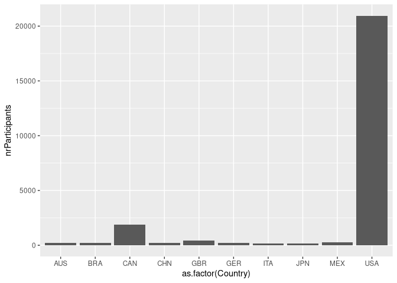
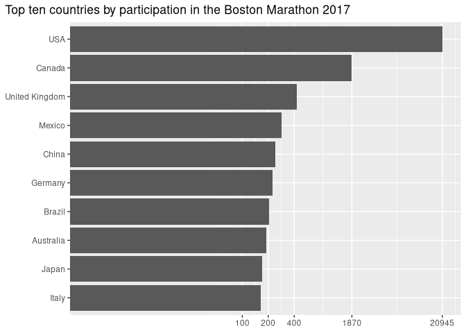

# Data Visualization

> Per Sander.

## Mini-Project 2

In this project, I explored data from the Boston marathon 2017. The goal of the project was to explore interactive graphs and spatial visualization. The library ggigraph with geom_sf was used for the graphs. The data included data such as age country of origin and various times.

The data seems to have a weak trend that counties and countries with lower participation seem to be doing better then counties and countries with high participation. However, these results can be affected by the very low sample size of countries and counties with low participation. Another possible explanation is that as travel becomes more difficult the remaining participants take the marathon more seriously.

### files

- All code for this project is in sander_project_02.Rmd
- The generated report is in sander_project_02.html (Interactive graphs work in this format)
- A github friendly version is also available in sander_project_02.md (However, this version does not support the interactive graphs in github)

### data files

The data files are in:

../data/

Used by this project:

- ../data/marathon_results_2017.csv
- ../data/ne_110m_admin_0_countries/
- ../data/ne_110m_admin_1_states_provinces/

DataSources:

- <https://www.naturalearthdata.com/downloads/110m-cultural-vectors/>

## 1 Interactive Chart

The following interactive boxplot graph was created: *(check out sander_project_01.html for an interactive version)*


When hovering over the boxplots for each year additional information for the data for that year is shown as seen in the image below:


The additonal data shows what influence the type of cars had to the overall population as well as the exact average for the population.

## 2 Accessibility

For accessibility fig.alt text were included for each graph, and colorblind safe colors and pallets were chosen.(viridis magma and viridis was used other graph were testing using this tool <https://rgblind.com/color-blindness-simulator>)

The library ggigraph did not seem to include the fig.alt text. The following workaround was used:

``` r
library(htmltools)

browsable(
  tags$div(
    `aria-label` = "fig.alt text here ...",
    role = "img",
    interactive_graph
  )
)
```

This workaround puts the graph into a div container with text for screen readers.

## 3 bad chart redesign

For this project a bad chart was created on purpose.

### bad example



### reworked graph



The bad graph is hard to read as the value for USA is very large while all other values are comparatively small. Furthermore, some aesthetics like labels and including title can be improved. The axis labels were improved by using Country names instead of a 3 letter country code and x and y was switched to have more space for the country names. The scale was changed into a log arithmetic scale for readability. However, While this can visualize small values better it makes the overall scale less intuitive to read. To address this issue axis markers for specific participation numbers were added.
