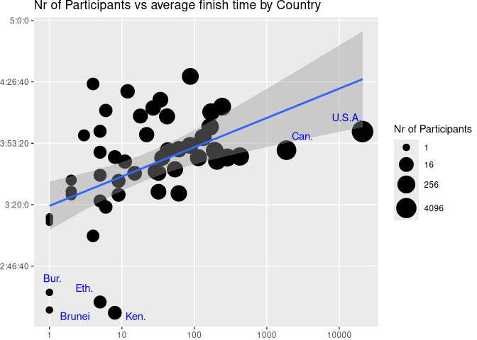
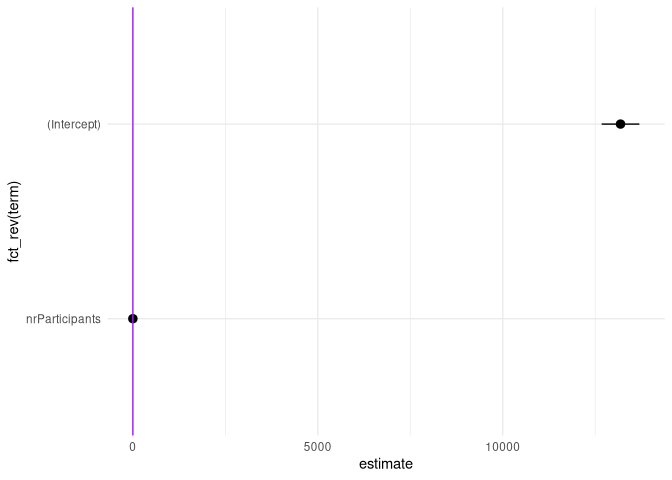

# Data Visualization - Mini-Project 2
## Legend
[Library init and map data loading](#library-init-and-map-data-loading)

[Data Loading and Summary](#data-loading-and-summary)

[Graph 1](#graph-1)

[Graph 2](#graph-2)

[Graph 3](#graph-3)

[Discussion](#discussion)

## Library init and map data loading


``` r
library(tidyverse)
library(ggrepel)
library(plotly)
library(sf)
library(ggiraph) 
library(tigris)
library(data.table)
library(glue)
library(broom)

# Load world shapefile from Natural Earth
# https://www.naturalearthdata.com/downloads/110m-cultural-vectors/
world_shapes <- read_sf("../data/ne_110m_admin_0_countries/ne_110m_admin_0_countries.shp")

# ignore atk
world_shapes <- filter(world_shapes, ISO_A3 != "ATA")


#Repair data: set ISO_A3 for france and sweden (fill with ADM0_A3 value)
world_shapes <- world_shapes %>% 
  mutate(ISO_A3 = if_else(ISO_A3 == -99, ADM0_A3, ISO_A3))

# Load states and provinces data
# https://www.naturalearthdata.com/downloads/110m-cultural-vectors/
us_counties_shapes <- read_sf("../data/ne_110m_admin_1_states_provinces/ne_110m_admin_1_states_provinces.shp")

us_counties_shapes <- shift_geometry(us_counties_shapes, geoid_column = NULL, preserve_area = FALSE, position = c("below", "outside"))
```

## Data Loading and Summary


``` r
marathon_csv = "../data/marathon_results_2017.csv"
marathon_data = read.csv(marathon_csv)

# change data from string to sec

double_sec_to_string <- function(time) {
  glue('{trunc(time/3600)}:{trunc((time %% 3600)/60)}:{trunc(time %% 60)}')
}

string_to_int_sec <-function(timeChar){
  
  timeChars <- strsplit(timeChar, ":")[[1]]
  
  if(length(timeChars) != 3){
    return(NA)
  }
  
  return(as.numeric(timeChars[1]) * 3600 + as.numeric(timeChars[2]) * 60 + as.numeric(timeChars[3]))
}

string_to_int_sec_vec <- Vectorize(string_to_int_sec)

double_sec_to_string_vec <- Vectorize(double_sec_to_string)

marathon_data <- marathon_data %>%
  mutate(Official.Time.sec = string_to_int_sec_vec(Official.Time))

# filtered marathon_data all rows with Country = USA
marathon_data_USA <- marathon_data %>%
  filter(Country == "USA")

# Columns for which to display values
columns <- c("Official.Time.sec", "Age", "Country","State", "City")

sapply(marathon_data[columns], function(x) {
  if(is.numeric(x)){
    c(
      Mean = mean(x, na.rm=TRUE),
      stdDev=sd(x, na.rm=TRUE),
      min=min(x, na.rm=TRUE),
      max=max(x, na.rm=TRUE),
      unique_count=length(unique(x)))
  }else{
    c(
      Mean = NA,
      stdDev=NA,
      min=NA,
      max=NA,
      unique_count=length(unique(x)))
  }  
})
```

```
##              Official.Time.sec      Age Country State City
## Mean                 14283.555 42.58773      NA    NA   NA
## stdDev                2528.883 11.41947      NA    NA   NA
## min                   7777.000 18.00000      NA    NA   NA
## max                  28694.000 84.00000      NA    NA   NA
## unique_count          9269.000 66.00000      91    69 5926
```

``` r
glue("\nTotal entries:{nrow(marathon_data)}")
```

```
## Total entries:26410
```

The marathon data contains data from the participants of the 2017 Boston marathon. The set contains multiple variables such as age, name, state, country, city, and various metrics for the marathon time. One minor problem with the time is that the datatype is a string (HH:MM:SS) and not an easily readable number. As such some data conversion from the string time value to a number was necessary. (total sec = HH*3600 + MM*60 + SS). The above summary shows some stats for time taken in sec, age, and the number of unique Countries, States and Cities participints are from. (For states there are also some foreign states in this metric, there are participants from every us state in the data set). For the analysis below I was interested in any visible overall trends rather then the individual performance. So grouping the data by country or state for US data was necessary. 

## Graph 1


``` r
# data prep 
marathon_data_by_Country <- marathon_data %>%
  group_by(Country) %>%
  summarise(
    nrParticipants = n(),
    Avg_Time_Sec  = mean(Official.Time.sec, na.rm = TRUE),
    SD_Time_Sec   = sd(Official.Time.sec, na.rm = TRUE),
    .groups = "drop"
  ) %>%
  mutate(avg_time_formatted = double_sec_to_string_vec(Avg_Time_Sec))


world_data <- left_join(world_shapes, marathon_data_by_Country, by=join_by(ISO_A3 == Country))

# graph
graph1 <- ggplot() +
  geom_sf_interactive(data=world_data, aes(fill = nrParticipants, data_id = ISO_A3, tooltip=glue('{NAME}<br>Participants: {if_else(is.na(nrParticipants), 0, nrParticipants)}<br>average time: {avg_time_formatted}'))) +
  theme_void() + 
  labs(title = "Participants of the Boston marathon 2017", fill=NULL) + 
  scale_fill_viridis_c(
    trans = "log10",
    limits = c(1, 20945)) + 
  theme(legend.position = "bottom", legend.key.width = unit(3, "cm"))

graph1_interactive <- girafe(ggobj = graph1)

graph1a <- ggplot() +
  geom_sf_interactive(data=world_data, aes(fill = Avg_Time_Sec, data_id = ISO_A3, tooltip=glue('{NAME}<br>Participants: {if_else(is.na(nrParticipants), 0, nrParticipants)}<br>average time: {avg_time_formatted}'))) +
  theme_void() + 
  labs(title = "Average Finish Time of the Boston marathon 2017", fill=NULL) + 
  scale_fill_viridis_c(
    option = "plasma",
    direction = -1,
    trans = "log10",
    labels = double_sec_to_string) + 
  theme(legend.position = "bottom", legend.key.width = unit(3, "cm"))

graph1a_interactive <- girafe(ggobj = graph1a)
```
{.tabset}
-------------------------------------
   
### Participants


```{=html}
<div class="girafe html-widget html-fill-item" id="htmlwidget-b7f30d46d53529ce3e81" style="width:672px;height:480px;"></div>
<script type="application/json" data-for="htmlwidget-b7f30d46d53529ce3e81">{"x":{"html":"<?xml version=\"1.0\" encoding=\"UTF-8\"?>\n<svg xmlns='http://www.w3.org/2000/svg' xmlns:xlink='http://www.w3.org/1999/xlink' class='ggiraph-svg' role='graphics-document' id='svg_1f28cb9589aa50cb' viewBox='0 0 504 360'>\n <defs id='svg_1f28cb9589aa50cb_defs'>\n  <clipPath id='svg_1f28cb9589aa50cb_c1'>\n   <rect x='0' y='0' width='504' height='360'/>\n  <\/clipPath>\n  <clipPath id='svg_1f28cb9589aa50cb_c2'>\n   <rect x='0' y='52.73' width='504' height='254.54'/>\n  <\/clipPath>\n  <clipPath id='svg_1f28cb9589aa50cb_c3'>\n   <rect x='0' y='70.02' width='504' height='200.94'/>\n  <\/clipPath>\n <\/defs>\n <g id='svg_1f28cb9589aa50cb_rootg' class='ggiraph-svg-rootg'>\n  <g clip-path='url(#svg_1f28cb9589aa50cb_c1)'>\n   <rect x='0' y='0' width='504' height='360' fill='#FFFFFF' fill-opacity='1' stroke='#FFFFFF' stroke-opacity='1' stroke-width='0.75' stroke-linejoin='round' stroke-linecap='round' class='ggiraph-svg-bg'/>\n  <\/g>\n  <g clip-path='url(#svg_1f28cb9589aa50cb_c2)'>\n   <rect x='0' y='52.73' width='504' height='254.54' fill='#000000' fill-opacity='0' stroke='none'/>\n  <\/g>\n  <g clip-path='url(#svg_1f28cb9589aa50cb_c3)'>\n   <path id='svg_1f28cb9589aa50cb_e1' d='M 481.090909 209.950814 L 481.090909 210.591076 L 480.281636 210.913955 L 479.468257 211.190332 L 479.305067 210.701178 L 479.941139 210.432045 L 480.344466 210.359989 L 481.090909 209.950814 Z ' fill='#7F7F7F' fill-opacity='1' fill-rule='evenodd' stroke='#000000' stroke-opacity='0.65' stroke-width='0.43' stroke-linejoin='round' stroke-linecap='butt' data-id='FJI' title='Fiji&amp;lt;br&amp;gt;Participants: 0&amp;lt;br&amp;gt;average time: NA'/>\n   <path id='svg_1f28cb9589aa50cb_e2' d='M 478.705271 211.836738 L 479.020945 211.620438 L 479.459349 211.998940 L 479.248904 212.683863 L 478.459749 212.864102 L 477.758222 212.701874 L 477.635505 212.125121 L 478.126562 211.674510 L 478.705271 211.836738 Z ' fill='#7F7F7F' fill-opacity='1' fill-rule='evenodd' stroke='#000000' stroke-opacity='0.65' stroke-width='0.43' stroke-linejoin='round' stroke-linecap='butt' data-id='FJI' title='Fiji&amp;lt;br&amp;gt;Participants: 0&amp;lt;br&amp;gt;average time: NA'/>\n   <path id='svg_1f28cb9589aa50cb_e3' d='M 23.172138 209.890144 L 23.014257 210.520982 L 22.909091 210.591076 L 22.909091 209.950814 L 23.172138 209.890144 Z ' fill='#7F7F7F' fill-opacity='1' fill-rule='evenodd' stroke='#000000' stroke-opacity='0.65' stroke-width='0.43' stroke-linejoin='round' stroke-linecap='butt' data-id='FJI' title='Fiji&amp;lt;br&amp;gt;Participants: 0&amp;lt;br&amp;gt;average time: NA'/>\n   <path id='svg_1f28cb9589aa50cb_e4' d='M 295.150178 190.120384 L 295.365153 190.264444 L 299.980151 192.936774 L 300.066964 193.697779 L 301.893735 195.009106 L 301.306142 196.625461 L 301.381525 197.368863 L 302.196364 197.846799 L 302.234545 198.187863 L 301.884151 198.980050 L 301.957129 199.378714 L 301.873753 200.005354 L 302.318215 200.827660 L 302.844945 202.121119 L 303.312019 202.408004 L 303.312024 202.408007 L 302.299455 203.168554 L 300.907799 203.677949 L 300.144269 203.656420 L 299.690733 204.049916 L 298.804738 204.083730 L 298.472468 204.249541 L 296.943052 203.879891 L 295.985441 203.985979 L 295.629091 202.201925 L 295.197430 201.590206 L 294.941462 201.227466 L 293.693751 200.982751 L 292.971464 200.588900 L 292.162625 200.368114 L 291.655320 200.148429 L 291.123649 199.814484 L 291.123656 199.814486 L 290.436360 198.161602 L 289.698223 197.427047 L 289.443627 196.666190 L 289.570892 195.984036 L 289.341815 194.777199 L 289.868107 194.714766 L 290.329862 194.239547 L 290.825233 193.555398 L 291.139215 193.280881 L 291.127467 192.854551 L 290.853385 192.557182 L 290.779585 192.040647 L 290.779580 192.040614 L 291.146939 191.874569 L 291.220535 191.102798 L 290.715224 190.362617 L 291.161640 190.205060 L 292.556944 190.221864 L 295.150178 190.120384 Z ' fill='#7F7F7F' fill-opacity='1' fill-rule='evenodd' stroke='#000000' stroke-opacity='0.65' stroke-width='0.43' stroke-linejoin='round' stroke-linecap='butt' data-id='TZA' title='Tanzania&amp;lt;br&amp;gt;Participants: 0&amp;lt;br&amp;gt;average time: NA'/>\n   <path id='svg_1f28cb9589aa50cb_e5' d='M 240.971068 152.594899 L 240.971660 152.682718 L 240.947128 152.936857 L 240.943444 154.923802 L 236.766194 154.855200 L 236.807169 158.211742 L 235.614627 158.329490 L 235.303403 159.003239 L 235.544779 160.897653 L 230.560663 160.889451 L 230.282916 161.327025 L 230.337637 160.772719 L 230.359867 160.774787 L 233.226058 160.670020 L 233.378940 160.197331 L 233.900332 159.608047 L 234.320405 157.796674 L 236.089684 156.381117 L 236.688125 154.727284 L 237.085902 154.631228 L 237.500385 153.608911 L 238.571120 153.468047 L 239.031642 153.638399 L 239.609563 153.638399 L 240.019770 153.339927 L 240.806511 153.297661 L 240.777309 152.594899 L 240.971068 152.594899 Z ' fill='#7F7F7F' fill-opacity='1' fill-rule='evenodd' stroke='#000000' stroke-opacity='0.65' stroke-width='0.43' stroke-linejoin='round' stroke-linecap='butt' data-id='ESH' title='W. Sahara&amp;lt;br&amp;gt;Participants: 0&amp;lt;br&amp;gt;average time: NA'/>\n   <path id='svg_1f28cb9589aa50cb_e6' d='M 95.658182 124.596714 L 95.487369 124.593385 L 93.023331 123.305183 L 92.114133 122.738492 L 89.809224 122.195347 L 89.100124 121.034129 L 89.281411 120.228981 L 87.652995 119.670463 L 87.429707 118.612888 L 85.890038 117.660559 L 85.863134 116.984747 L 85.863133 116.984714 L 86.570909 116.352145 L 86.535553 115.524631 L 84.371878 114.689955 L 83.070375 113.193510 L 82.274742 112.252449 L 81.109496 111.661057 L 80.251818 111.123946 L 79.576216 110.445465 L 78.298538 110.870339 L 77.060455 111.603482 L 75.929776 110.741495 L 75.041273 110.167078 L 73.801636 109.803949 L 72.548280 109.765160 L 72.555000 102.296327 L 72.563273 97.427020 L 72.563288 97.427022 L 74.937520 97.743134 L 76.940996 98.374103 L 78.268171 98.494761 L 79.385396 97.947641 L 80.926822 97.537958 L 82.817318 97.698114 L 84.723724 97.122017 L 86.806733 96.795146 L 87.681071 97.338776 L 88.630742 97.032356 L 88.915056 96.414532 L 89.794575 96.554407 L 91.946502 97.730593 L 93.641125 96.841439 L 93.813135 97.836704 L 95.376807 97.621531 L 95.857364 97.238739 L 97.398942 97.314495 L 99.345425 97.865340 L 102.323862 98.346214 L 104.075453 98.568916 L 105.322127 98.484437 L 107.038985 99.149525 L 105.248322 99.800551 L 107.548929 100.081876 L 110.984364 99.927125 L 112.068485 99.697668 L 113.425200 100.484214 L 114.809685 99.820556 L 113.510740 99.263991 L 114.332642 98.814994 L 115.881818 98.754547 L 116.900000 98.623368 L 117.927320 98.936596 L 119.206296 99.649184 L 120.627627 99.544569 L 122.876307 100.136001 L 124.852064 99.927729 L 126.708655 99.959224 L 126.561782 99.142914 L 127.693389 98.913745 L 129.665569 99.358768 L 129.657971 100.599730 L 130.467998 99.553817 L 131.491818 99.589065 L 132.067320 98.270458 L 130.703898 97.461507 L 129.218333 96.931480 L 129.320355 95.481879 L 130.825164 94.529903 L 132.503675 94.740287 L 133.791407 95.319388 L 135.520458 96.798294 L 134.391193 97.442801 L 136.758236 97.708188 L 136.752624 99.049711 L 138.453445 98.021613 L 139.974978 98.865943 L 139.595922 99.838894 L 140.827056 100.723903 L 142.155911 99.775824 L 143.084276 98.643622 L 143.153856 97.203872 L 144.962605 97.304512 L 146.843989 97.497515 L 148.552180 98.148476 L 148.628836 98.799580 L 147.681724 99.498945 L 148.579098 100.201236 L 148.417144 100.839262 L 145.925105 101.756514 L 144.154920 101.958844 L 142.838907 101.563958 L 142.459418 102.222579 L 141.232725 103.328781 L 140.861331 103.902477 L 139.385324 104.790110 L 137.563440 104.877002 L 136.558571 105.431310 L 136.474495 106.283918 L 134.993829 106.448062 L 133.436571 107.511119 L 132.056235 108.988242 L 131.562696 110.022506 L 131.492327 111.546000 L 133.362702 111.764675 L 133.935938 112.993043 L 134.531053 113.988190 L 136.312031 113.728994 L 138.676962 114.296945 L 139.949371 114.795554 L 140.860096 115.415346 L 142.454824 115.776494 L 143.803151 116.329057 L 145.904755 116.404760 L 147.289100 116.531439 L 147.081200 117.667511 L 147.477247 118.986170 L 148.399045 120.454254 L 150.292685 121.699742 L 151.272533 121.272743 L 151.961205 119.924031 L 151.296460 117.852237 L 150.398716 117.161883 L 152.436149 116.547010 L 153.878327 115.627501 L 154.583711 114.713423 L 154.479576 113.836626 L 153.615305 112.722317 L 152.069425 111.735212 L 153.571396 110.360422 L 153.016538 109.172902 L 152.591256 107.124208 L 153.477329 106.821330 L 155.659369 107.178306 L 156.967745 107.305930 L 158.021971 106.961337 L 159.207325 107.405678 L 160.774625 108.166146 L 161.160758 108.675355 L 163.430375 108.774736 L 163.392307 109.876845 L 163.815400 111.534797 L 164.977845 111.739829 L 165.900305 112.512471 L 167.743189 111.784102 L 168.960693 110.336678 L 169.802793 109.726869 L 170.793955 110.898267 L 172.451542 112.571475 L 173.858936 114.145132 L 173.347160 114.968933 L 175.040053 115.708740 L 176.184120 116.458307 L 178.213535 116.797509 L 179.030473 117.215955 L 179.534867 118.325962 L 180.526042 118.500206 L 181.037411 118.994920 L 181.130244 120.468999 L 180.206524 120.962151 L 179.293024 121.422562 L 177.195684 121.888796 L 175.594249 122.966467 L 173.442615 123.179383 L 170.720442 122.903213 L 168.810333 122.893755 L 167.492118 122.984570 L 166.426515 123.925658 L 164.804004 124.507041 L 162.968120 126.243162 L 161.503262 127.454163 L 162.584265 127.238571 L 164.627273 125.514964 L 167.296907 124.422116 L 169.201124 124.291357 L 170.327831 124.934525 L 169.125791 125.815560 L 169.529131 127.229507 L 169.944485 128.219222 L 171.597631 128.874420 L 173.700902 128.684539 L 174.976900 127.209882 L 175.065418 128.161307 L 175.887256 128.636488 L 174.312880 129.495904 L 171.494005 130.276561 L 170.231651 130.807322 L 168.809378 131.752201 L 167.842945 131.655863 L 167.794162 130.545503 L 170.003922 129.460761 L 167.966845 129.503696 L 166.552387 129.663445 L 165.720113 128.921919 L 165.721233 127.133235 L 165.156167 126.754785 L 164.302727 126.977605 L 163.879907 126.632892 L 162.909129 127.622911 L 162.520909 128.643572 L 162.069091 129.240434 L 161.528411 129.443446 L 161.120909 129.509350 L 160.993560 129.833099 L 158.648216 129.834174 L 156.714727 129.843226 L 156.140460 130.084633 L 154.795455 131.029302 L 154.636364 131.131426 L 154.229047 131.642596 L 153.060874 131.642240 L 151.810553 131.647442 L 151.236052 131.855688 L 151.441818 132.113244 L 151.556364 132.513338 L 151.531721 132.646338 L 149.866885 133.298835 L 148.555595 133.505014 L 147.077283 134.205403 L 146.758068 134.205403 L 146.325696 133.998547 L 146.182909 133.811112 L 146.210909 133.674268 L 146.490909 133.215143 L 147.089091 132.493661 L 147.461182 131.718281 L 147.206483 130.578455 L 146.935187 129.387988 L 145.609099 128.772266 L 145.766026 128.539040 L 145.579470 128.378687 L 145.229935 128.378687 L 144.974007 128.170780 L 144.910030 127.860140 L 144.662382 127.995852 L 144.321036 127.955409 L 144.398865 127.825432 L 144.099151 127.696329 L 143.975898 127.351354 L 142.987901 126.931405 L 141.957466 126.494424 L 140.712991 125.987207 L 139.518764 125.511137 L 138.379923 125.882515 L 137.963636 125.895382 L 136.398182 125.554318 L 135.367273 125.724850 L 134.132727 125.318196 L 132.833438 125.109281 L 131.944731 125.028633 L 131.549091 124.806600 L 131.323080 124.086364 L 130.892249 124.092661 L 130.888457 124.596714 L 128.254356 124.595796 L 123.900000 124.596714 L 119.574942 124.596898 L 115.754545 124.596714 L 111.936364 124.596714 L 108.181818 124.596714 L 104.302316 124.596714 L 103.051187 124.596714 L 99.272727 124.596714 L 95.658182 124.596714 Z ' fill='#6DC85E' fill-opacity='1' fill-rule='evenodd' stroke='#000000' stroke-opacity='0.65' stroke-width='0.43' stroke-linejoin='round' stroke-linecap='butt' data-id='CAN' title='Canada&amp;lt;br&amp;gt;Participants: 1870&amp;lt;br&amp;gt;average time: 3:49:34'/>\n   <path id='svg_1f28cb9589aa50cb_e7' d='M 145.098965 106.949531 L 146.044844 106.344418 L 147.792922 106.356893 L 147.765864 106.611090 L 146.276365 107.334645 L 145.377756 107.304356 L 145.098965 106.949531 Z ' fill='#6DC85E' fill-opacity='1' fill-rule='evenodd' stroke='#000000' stroke-opacity='0.65' stroke-width='0.43' stroke-linejoin='round' stroke-linecap='butt' data-id='CAN' title='Canada&amp;lt;br&amp;gt;Participants: 1870&amp;lt;br&amp;gt;average time: 3:49:34'/>\n   <path id='svg_1f28cb9589aa50cb_e8' d='M 150.467121 93.372420 L 149.066784 92.676805 L 149.120510 92.204562 L 149.732472 92.117281 L 152.645261 92.258676 L 154.840000 92.979170 L 154.952759 93.341615 L 153.599806 93.303364 L 152.228783 93.275672 L 150.835679 93.452045 L 150.467121 93.372420 Z ' fill='#6DC85E' fill-opacity='1' fill-rule='evenodd' stroke='#000000' stroke-opacity='0.65' stroke-width='0.43' stroke-linejoin='round' stroke-linecap='butt' data-id='CAN' title='Canada&amp;lt;br&amp;gt;Participants: 1870&amp;lt;br&amp;gt;average time: 3:49:34'/>\n   <path id='svg_1f28cb9589aa50cb_e9' d='M 149.780406 107.431264 L 150.271685 107.037683 L 150.792702 107.066398 L 151.116229 107.335360 L 150.617702 108.024827 L 150.055105 107.913299 L 149.720900 107.521876 L 149.780406 107.431264 Z ' fill='#6DC85E' fill-opacity='1' fill-rule='evenodd' stroke='#000000' stroke-opacity='0.65' stroke-width='0.43' stroke-linejoin='round' stroke-linecap='butt' data-id='CAN' title='Canada&amp;lt;br&amp;gt;Participants: 1870&amp;lt;br&amp;gt;average time: 3:49:34'/>\n   <path id='svg_1f28cb9589aa50cb_e10' d='M 132.856492 90.516539 L 132.163934 91.025054 L 130.316225 90.927303 L 128.773359 90.585243 L 129.450889 89.994670 L 131.280775 89.641290 L 132.391959 90.101369 L 132.856492 90.516539 Z ' fill='#6DC85E' fill-opacity='1' fill-rule='evenodd' stroke='#000000' stroke-opacity='0.65' stroke-width='0.43' stroke-linejoin='round' stroke-linecap='butt' data-id='CAN' title='Canada&amp;lt;br&amp;gt;Participants: 1870&amp;lt;br&amp;gt;average time: 3:49:34'/>\n   <path id='svg_1f28cb9589aa50cb_e11' d='M 132.567269 87.184605 L 131.987408 87.222194 L 129.602258 87.138543 L 129.262885 86.771875 L 131.825811 86.791060 L 132.719165 87.034623 L 132.567269 87.184605 Z ' fill='#6DC85E' fill-opacity='1' fill-rule='evenodd' stroke='#000000' stroke-opacity='0.65' stroke-width='0.43' stroke-linejoin='round' stroke-linecap='butt' data-id='CAN' title='Canada&amp;lt;br&amp;gt;Participants: 1870&amp;lt;br&amp;gt;average time: 3:49:34'/>\n   <path id='svg_1f28cb9589aa50cb_e12' d='M 128.858038 85.550363 L 130.379101 86.006206 L 130.034170 86.480250 L 128.151109 86.750929 L 127.114541 86.446254 L 126.569077 85.954009 L 126.468383 85.411159 L 128.116251 85.463560 L 128.858038 85.550363 Z ' fill='#6DC85E' fill-opacity='1' fill-rule='evenodd' stroke='#000000' stroke-opacity='0.65' stroke-width='0.43' stroke-linejoin='round' stroke-linecap='butt' data-id='CAN' title='Canada&amp;lt;br&amp;gt;Participants: 1870&amp;lt;br&amp;gt;average time: 3:49:34'/>\n   <path id='svg_1f28cb9589aa50cb_e13' d='M 139.808645 91.287463 L 137.753990 91.125787 L 134.371439 90.703127 L 133.931273 89.982875 L 133.776483 89.332446 L 132.498769 88.759736 L 129.865963 88.599518 L 128.390972 88.193262 L 128.869844 87.655022 L 131.492982 87.738334 L 132.905919 88.160181 L 135.411789 88.157266 L 136.510378 88.588740 L 136.220431 89.081425 L 137.680788 89.378203 L 138.489167 89.689894 L 140.205830 89.747582 L 142.062846 89.857467 L 144.085932 89.573095 L 146.677434 89.461447 L 148.745506 89.553707 L 150.108622 90.048427 L 150.393176 90.591140 L 149.599201 90.939844 L 147.701473 91.221674 L 146.072317 91.062202 L 142.421424 91.264211 L 139.808645 91.287463 Z ' fill='#6DC85E' fill-opacity='1' fill-rule='evenodd' stroke='#000000' stroke-opacity='0.65' stroke-width='0.43' stroke-linejoin='round' stroke-linecap='butt' data-id='CAN' title='Canada&amp;lt;br&amp;gt;Participants: 1870&amp;lt;br&amp;gt;average time: 3:49:34'/>\n   <path id='svg_1f28cb9589aa50cb_e14' d='M 110.390708 86.354299 L 112.185243 86.559766 L 111.762079 86.952396 L 109.389393 87.329909 L 107.501827 86.906232 L 108.532344 86.487978 L 110.390708 86.354299 Z ' fill='#6DC85E' fill-opacity='1' fill-rule='evenodd' stroke='#000000' stroke-opacity='0.65' stroke-width='0.43' stroke-linejoin='round' stroke-linecap='butt' data-id='CAN' title='Canada&amp;lt;br&amp;gt;Participants: 1870&amp;lt;br&amp;gt;average time: 3:49:34'/>\n   <path id='svg_1f28cb9589aa50cb_e15' d='M 110.773523 85.499691 L 112.428724 85.765286 L 110.878327 86.021153 L 108.764611 86.019865 L 108.785230 85.832735 L 110.090896 85.439935 L 110.773523 85.499691 Z ' fill='#6DC85E' fill-opacity='1' fill-rule='evenodd' stroke='#000000' stroke-opacity='0.65' stroke-width='0.43' stroke-linejoin='round' stroke-linecap='butt' data-id='CAN' title='Canada&amp;lt;br&amp;gt;Participants: 1870&amp;lt;br&amp;gt;average time: 3:49:34'/>\n   <path id='svg_1f28cb9589aa50cb_e16' d='M 181.236086 121.557210 L 180.556682 122.383720 L 179.714332 123.531140 L 180.545139 123.088007 L 181.399919 123.369126 L 180.953308 123.826528 L 182.082546 124.186111 L 182.669740 123.866455 L 183.938937 124.269898 L 183.545073 125.230595 L 184.435829 125.006249 L 184.598084 125.702334 L 184.993329 126.517760 L 184.457435 127.672196 L 183.881783 127.721004 L 183.044991 127.473373 L 183.321258 126.400148 L 182.966659 126.233456 L 181.489925 127.371148 L 180.730479 127.325594 L 181.629358 126.709263 L 180.408074 126.390522 L 179.040617 126.468885 L 176.570526 126.428822 L 176.375189 126.040395 L 177.167981 125.578552 L 176.614296 125.222189 L 177.683157 124.431980 L 178.998031 122.342708 L 179.787173 121.596087 L 180.891484 121.143972 L 181.482033 121.201457 L 181.236086 121.557210 Z ' fill='#6DC85E' fill-opacity='1' fill-rule='evenodd' stroke='#000000' stroke-opacity='0.65' stroke-width='0.43' stroke-linejoin='round' stroke-linecap='butt' data-id='CAN' title='Canada&amp;lt;br&amp;gt;Participants: 1870&amp;lt;br&amp;gt;average time: 3:49:34'/>\n   <path id='svg_1f28cb9589aa50cb_e17' d='M 145.240294 103.464357 L 146.633993 103.914200 L 148.091983 104.322896 L 148.204712 104.946685 L 149.141540 104.844528 L 150.050153 105.279390 L 148.920520 105.692256 L 146.939955 105.376802 L 146.225167 104.786298 L 144.963106 105.484383 L 143.152030 106.163012 L 142.715022 105.395783 L 140.990203 105.521734 L 142.096488 104.872931 L 142.259235 103.840447 L 142.693285 102.639033 L 143.612881 102.745935 L 143.849028 103.322815 L 144.500348 103.120466 L 145.240294 103.464357 Z ' fill='#6DC85E' fill-opacity='1' fill-rule='evenodd' stroke='#000000' stroke-opacity='0.65' stroke-width='0.43' stroke-linejoin='round' stroke-linecap='butt' data-id='CAN' title='Canada&amp;lt;br&amp;gt;Participants: 1870&amp;lt;br&amp;gt;average time: 3:49:34'/>\n   <path id='svg_1f28cb9589aa50cb_e18' d='M 151.746460 93.963680 L 152.950479 93.442320 L 155.774379 94.106002 L 157.527216 94.731112 L 157.692003 95.303449 L 160.055349 95.006875 L 161.381799 95.842367 L 164.454113 96.360508 L 165.562765 96.889257 L 166.766685 98.116904 L 164.429844 98.728051 L 167.427443 99.584692 L 169.447963 99.872793 L 171.277356 101.078409 L 173.279296 101.165449 L 172.883229 102.086151 L 170.649253 103.609898 L 169.083269 103.049288 L 167.082085 101.787340 L 165.435434 101.951727 L 165.274725 102.703297 L 166.613178 103.465882 L 168.340989 104.069368 L 168.865241 104.417868 L 169.693483 105.716287 L 169.255159 106.659121 L 167.649943 106.303741 L 164.457763 105.253563 L 166.256770 106.383934 L 167.582167 107.176109 L 167.789277 107.634155 L 164.337897 107.110422 L 161.606535 106.348854 L 160.064064 105.709847 L 160.508373 105.339722 L 158.609428 104.665499 L 156.756194 104.029136 L 156.776451 104.409530 L 153.096389 104.618827 L 152.019701 104.168407 L 152.858006 103.202558 L 155.249469 103.179239 L 157.869351 103.011598 L 157.444148 102.543282 L 157.888293 101.888955 L 159.534878 100.611279 L 159.185015 100.031011 L 158.694305 99.581710 L 156.744882 98.945244 L 154.166599 98.499095 L 154.981719 98.167169 L 153.634256 97.351540 L 152.512648 97.276837 L 151.508964 96.830315 L 150.827785 97.217387 L 148.520310 97.386112 L 143.888556 97.092995 L 141.196359 96.708160 L 139.132365 96.510422 L 138.073830 96.049596 L 139.404719 95.451228 L 137.596898 95.445500 L 137.193432 94.117288 L 138.171630 92.944041 L 139.480420 92.408276 L 142.766717 92.059437 L 141.829955 92.907334 L 142.832618 93.724997 L 144.008948 92.667498 L 147.234703 92.128784 L 149.418070 93.485704 L 149.228620 94.344447 L 151.746460 93.963680 Z ' fill='#6DC85E' fill-opacity='1' fill-rule='evenodd' stroke='#000000' stroke-opacity='0.65' stroke-width='0.43' stroke-linejoin='round' stroke-linecap='butt' data-id='CAN' title='Canada&amp;lt;br&amp;gt;Participants: 1870&amp;lt;br&amp;gt;average time: 3:49:34'/>\n   <path id='svg_1f28cb9589aa50cb_e19' d='M 131.722618 91.625117 L 134.374530 91.670874 L 136.805718 91.990021 L 134.904044 93.158151 L 133.386533 93.412967 L 132.021213 94.393390 L 130.569275 94.344481 L 129.775234 93.192214 L 129.794932 92.540056 L 130.459899 91.982565 L 131.722618 91.625117 Z ' fill='#6DC85E' fill-opacity='1' fill-rule='evenodd' stroke='#000000' stroke-opacity='0.65' stroke-width='0.43' stroke-linejoin='round' stroke-linecap='butt' data-id='CAN' title='Canada&amp;lt;br&amp;gt;Participants: 1870&amp;lt;br&amp;gt;average time: 3:49:34'/>\n   <path id='svg_1f28cb9589aa50cb_e20' d='M 95.639187 89.025636 L 95.639186 89.025636 L 97.799500 88.044467 L 100.413169 87.194807 L 102.365288 87.213042 L 104.110890 87.020252 L 103.936238 88.028130 L 102.955936 88.483227 L 101.766748 88.547321 L 99.400869 89.108710 L 97.363643 89.309669 L 95.639187 89.025636 Z ' fill='#6DC85E' fill-opacity='1' fill-rule='evenodd' stroke='#000000' stroke-opacity='0.65' stroke-width='0.43' stroke-linejoin='round' stroke-linecap='butt' data-id='CAN' title='Canada&amp;lt;br&amp;gt;Participants: 1870&amp;lt;br&amp;gt;average time: 3:49:34'/>\n   <path id='svg_1f28cb9589aa50cb_e21' d='M 83.096354 117.985305 L 84.318195 117.880369 L 83.937025 119.369747 L 85.044855 120.424670 L 84.537308 120.422128 L 83.770364 119.822201 L 83.300010 119.218376 L 82.657768 118.809815 L 82.422245 118.233139 L 82.498177 117.814817 L 83.096354 117.985305 Z ' fill='#6DC85E' fill-opacity='1' fill-rule='evenodd' stroke='#000000' stroke-opacity='0.65' stroke-width='0.43' stroke-linejoin='round' stroke-linecap='butt' data-id='CAN' title='Canada&amp;lt;br&amp;gt;Participants: 1870&amp;lt;br&amp;gt;average time: 3:49:34'/>\n   <path id='svg_1f28cb9589aa50cb_e22' d='M 117.737086 84.847533 L 120.235459 85.026257 L 123.677072 85.504911 L 124.650665 86.128937 L 125.146078 86.676226 L 123.067712 86.530040 L 120.972971 86.104702 L 118.139467 86.056030 L 119.368544 85.666315 L 117.829625 85.350285 L 117.737086 84.847533 Z ' fill='#6DC85E' fill-opacity='1' fill-rule='evenodd' stroke='#000000' stroke-opacity='0.65' stroke-width='0.43' stroke-linejoin='round' stroke-linecap='butt' data-id='CAN' title='Canada&amp;lt;br&amp;gt;Participants: 1870&amp;lt;br&amp;gt;average time: 3:49:34'/>\n   <path id='svg_1f28cb9589aa50cb_e23' d='M 94.805453 125.239475 L 94.165412 125.422029 L 92.075438 124.826271 L 91.693643 124.360599 L 90.554540 123.901468 L 90.325463 123.527615 L 89.015390 123.291542 L 88.525075 122.577696 L 88.634746 122.274005 L 89.970897 122.560072 L 90.751817 122.759030 L 91.948173 122.897929 L 92.380907 123.350518 L 93.009931 123.973256 L 94.280443 124.514749 L 94.805453 125.239475 Z ' fill='#6DC85E' fill-opacity='1' fill-rule='evenodd' stroke='#000000' stroke-opacity='0.65' stroke-width='0.43' stroke-linejoin='round' stroke-linecap='butt' data-id='CAN' title='Canada&amp;lt;br&amp;gt;Participants: 1870&amp;lt;br&amp;gt;average time: 3:49:34'/>\n   <path id='svg_1f28cb9589aa50cb_e24' d='M 97.315425 91.213185 L 99.133007 91.485486 L 102.383731 91.558395 L 103.619829 91.938419 L 104.986242 92.490523 L 103.386258 92.821447 L 100.265455 93.743527 L 98.687273 94.661777 L 98.687273 95.234238 L 95.337213 95.866468 L 94.665455 95.291434 L 91.726793 94.597908 L 92.272727 94.042272 L 93.154358 93.084276 L 94.258182 92.221856 L 93.013773 91.418060 L 97.315425 91.213185 Z ' fill='#6DC85E' fill-opacity='1' fill-rule='evenodd' stroke='#000000' stroke-opacity='0.65' stroke-width='0.43' stroke-linejoin='round' stroke-linecap='butt' data-id='CAN' title='Canada&amp;lt;br&amp;gt;Participants: 1870&amp;lt;br&amp;gt;average time: 3:49:34'/>\n   <path id='svg_1f28cb9589aa50cb_e25' d='M 114.775271 89.381159 L 115.908635 89.161698 L 117.242364 89.218655 L 117.466389 89.861286 L 116.691947 90.483387 L 112.381818 90.687068 L 109.170638 91.255123 L 107.235151 91.284888 L 107.072827 90.857219 L 109.716460 90.277135 L 103.966278 90.433329 L 102.186764 90.198821 L 103.923247 88.917430 L 105.121075 88.550340 L 108.702924 88.993107 L 110.963720 89.769881 L 113.187327 89.869550 L 111.367124 88.614683 L 112.533145 88.136734 L 113.847249 88.288705 L 114.276387 88.913954 L 114.775271 89.381159 Z ' fill='#6DC85E' fill-opacity='1' fill-rule='evenodd' stroke='#000000' stroke-opacity='0.65' stroke-width='0.43' stroke-linejoin='round' stroke-linecap='butt' data-id='CAN' title='Canada&amp;lt;br&amp;gt;Participants: 1870&amp;lt;br&amp;gt;average time: 3:49:34'/>\n   <path id='svg_1f28cb9589aa50cb_e26' d='M 116.425795 93.014162 L 117.851415 93.543362 L 118.650204 94.821290 L 119.044851 95.746663 L 121.182256 96.396272 L 123.479007 97.017323 L 123.340904 97.594312 L 121.251251 97.699845 L 122.063085 98.204095 L 121.634240 98.685258 L 119.330909 98.479072 L 117.141818 98.124890 L 115.662222 98.204620 L 113.272727 98.649604 L 110.047447 98.846294 L 107.783200 98.970283 L 107.093687 98.351251 L 105.356364 97.993711 L 104.226258 98.140356 L 102.658182 97.101697 L 103.504889 96.961927 L 105.469484 96.737939 L 107.263660 96.796878 L 108.924964 96.568614 L 106.463636 96.262155 L 103.744022 96.366507 L 101.939345 96.340127 L 101.267880 95.856551 L 104.219678 95.331863 L 102.256407 95.350202 L 100.033831 95.004691 L 101.102056 94.021822 L 101.988193 93.499614 L 105.395704 92.701196 L 106.696329 92.954554 L 106.061022 93.569361 L 108.893247 93.172376 L 110.663140 93.834827 L 112.101373 93.164859 L 113.264404 93.594836 L 114.305736 94.883613 L 114.945104 94.339760 L 114.040958 92.996426 L 115.160882 92.804315 L 116.425795 93.014162 Z ' fill='#6DC85E' fill-opacity='1' fill-rule='evenodd' stroke='#000000' stroke-opacity='0.65' stroke-width='0.43' stroke-linejoin='round' stroke-linecap='butt' data-id='CAN' title='Canada&amp;lt;br&amp;gt;Participants: 1870&amp;lt;br&amp;gt;average time: 3:49:34'/>\n   <path id='svg_1f28cb9589aa50cb_e27' d='M 124.169360 93.499693 L 122.767273 92.641628 L 124.273647 92.006868 L 125.791438 92.282999 L 128.061818 92.116914 L 128.392727 92.497331 L 127.204522 93.126306 L 129.130909 93.691056 L 128.901818 94.871662 L 126.814978 95.379520 L 125.589087 95.269934 L 124.708411 94.768989 L 121.545455 93.756645 L 121.570909 93.336874 L 124.169360 93.499693 Z ' fill='#6DC85E' fill-opacity='1' fill-rule='evenodd' stroke='#000000' stroke-opacity='0.65' stroke-width='0.43' stroke-linejoin='round' stroke-linecap='butt' data-id='CAN' title='Canada&amp;lt;br&amp;gt;Participants: 1870&amp;lt;br&amp;gt;average time: 3:49:34'/>\n   <path id='svg_1f28cb9589aa50cb_e28' d='M 116.327273 92.326799 L 118.032727 92.274328 L 119.000000 92.562921 L 117.880000 93.428699 L 115.894545 92.510449 L 116.327273 92.326799 Z ' fill='#6DC85E' fill-opacity='1' fill-rule='evenodd' stroke='#000000' stroke-opacity='0.65' stroke-width='0.43' stroke-linejoin='round' stroke-linecap='butt' data-id='CAN' title='Canada&amp;lt;br&amp;gt;Participants: 1870&amp;lt;br&amp;gt;average time: 3:49:34'/>\n   <path id='svg_1f28cb9589aa50cb_e29' d='M 126.636364 88.234029 L 127.609255 88.841963 L 127.648926 89.515066 L 127.069091 90.490300 L 124.970695 90.624837 L 123.602615 90.415056 L 123.629011 89.649774 L 121.542795 89.750716 L 121.462065 88.736968 L 122.831253 88.777935 L 124.748285 88.330656 L 126.538376 88.406411 L 126.636364 88.234029 Z ' fill='#6DC85E' fill-opacity='1' fill-rule='evenodd' stroke='#000000' stroke-opacity='0.65' stroke-width='0.43' stroke-linejoin='round' stroke-linecap='butt' data-id='CAN' title='Canada&amp;lt;br&amp;gt;Participants: 1870&amp;lt;br&amp;gt;average time: 3:49:34'/>\n   <path id='svg_1f28cb9589aa50cb_e30' d='M 129.797258 83.141247 L 130.679245 82.741205 L 131.983816 82.649406 L 131.427647 82.348758 L 134.387476 82.281949 L 136.012685 82.982363 L 138.154545 83.263253 L 140.241818 83.511603 L 141.247273 84.377381 L 142.781736 84.801219 L 141.034015 85.191606 L 138.682282 86.178160 L 136.430815 86.272478 L 133.793304 86.104569 L 132.425796 85.569807 L 132.445422 85.093970 L 133.451513 84.744550 L 131.124000 84.754546 L 129.721276 84.318325 L 128.914902 83.724414 L 129.797258 83.141247 Z ' fill='#6DC85E' fill-opacity='1' fill-rule='evenodd' stroke='#000000' stroke-opacity='0.65' stroke-width='0.43' stroke-linejoin='round' stroke-linecap='butt' data-id='CAN' title='Canada&amp;lt;br&amp;gt;Participants: 1870&amp;lt;br&amp;gt;average time: 3:49:34'/>\n   <path id='svg_1f28cb9589aa50cb_e31' d='M 135.434702 81.446473 L 137.327273 81.196302 L 138.813475 81.153656 L 141.310604 80.941016 L 143.181818 80.452161 L 144.759994 80.520733 L 146.134545 80.888033 L 147.101818 80.179669 L 148.781818 79.969783 L 151.064276 79.824752 L 154.954545 79.770314 L 155.630644 79.912012 L 159.305325 79.690058 L 162.061754 79.773303 L 164.818182 79.856548 L 168.219736 79.959275 L 170.952727 80.127197 L 173.281818 80.483216 L 173.225971 80.833397 L 170.120364 81.402580 L 167.041102 81.668191 L 165.890391 81.961847 L 168.661424 81.955078 L 165.658182 82.750767 L 163.584018 83.122226 L 161.407273 84.193731 L 158.781891 84.411291 L 157.970909 84.678879 L 154.117435 84.819335 L 155.871876 84.983872 L 154.992142 85.218144 L 156.044700 85.865195 L 154.835495 86.314940 L 152.869169 86.686241 L 152.265667 87.199569 L 150.487896 87.591675 L 150.665900 87.888558 L 152.840685 87.837811 L 152.868405 88.158005 L 149.467500 88.944860 L 146.141685 88.582925 L 142.403113 88.786278 L 140.509091 88.627565 L 138.102771 88.558841 L 137.943145 87.929525 L 140.296049 87.632799 L 139.669091 86.686123 L 140.445455 86.594007 L 143.848295 87.160032 L 142.112727 86.318823 L 140.048465 86.067210 L 141.079298 85.559732 L 143.336225 85.247226 L 143.697336 84.790029 L 141.899749 84.277371 L 141.359540 83.601526 L 144.838349 83.658051 L 145.843478 83.800196 L 147.829525 83.322155 L 144.963636 83.170539 L 140.510427 83.254139 L 138.260653 82.808893 L 137.200000 82.278525 L 135.713633 81.894041 L 135.434702 81.446473 Z ' fill='#6DC85E' fill-opacity='1' fill-rule='evenodd' stroke='#000000' stroke-opacity='0.65' stroke-width='0.43' stroke-linejoin='round' stroke-linecap='butt' data-id='CAN' title='Canada&amp;lt;br&amp;gt;Participants: 1870&amp;lt;br&amp;gt;average time: 3:49:34'/>\n   <path id='svg_1f28cb9589aa50cb_e32' d='M 156.270584 100.401821 L 155.443425 100.789309 L 154.016711 100.855069 L 153.699127 100.213134 L 154.239705 99.477917 L 155.406096 99.296038 L 156.399727 99.659206 L 156.413944 100.221096 L 156.270584 100.401821 Z ' fill='#6DC85E' fill-opacity='1' fill-rule='evenodd' stroke='#000000' stroke-opacity='0.65' stroke-width='0.43' stroke-linejoin='round' stroke-linecap='butt' data-id='CAN' title='Canada&amp;lt;br&amp;gt;Participants: 1870&amp;lt;br&amp;gt;average time: 3:49:34'/>\n   <path id='svg_1f28cb9589aa50cb_e33' d='M 129.490580 97.718196 L 130.266588 98.219744 L 129.475155 98.679722 L 127.759671 98.282264 L 126.723162 98.425682 L 124.985126 97.836257 L 126.105126 97.429604 L 126.994940 96.860932 L 128.345126 97.232836 L 129.108762 97.468957 L 129.490580 97.718196 Z ' fill='#6DC85E' fill-opacity='1' fill-rule='evenodd' stroke='#000000' stroke-opacity='0.65' stroke-width='0.43' stroke-linejoin='round' stroke-linecap='butt' data-id='CAN' title='Canada&amp;lt;br&amp;gt;Participants: 1870&amp;lt;br&amp;gt;average time: 3:49:34'/>\n   <path id='svg_1f28cb9589aa50cb_e34' d='M 169.884756 123.451474 L 170.324993 123.341100 L 171.998540 123.670056 L 173.300165 124.218199 L 173.337430 124.458898 L 172.717771 124.482366 L 171.068215 124.071095 L 169.884756 123.451474 Z ' fill='#6DC85E' fill-opacity='1' fill-rule='evenodd' stroke='#000000' stroke-opacity='0.65' stroke-width='0.43' stroke-linejoin='round' stroke-linecap='butt' data-id='CAN' title='Canada&amp;lt;br&amp;gt;Participants: 1870&amp;lt;br&amp;gt;average time: 3:49:34'/>\n   <path id='svg_1f28cb9589aa50cb_e35' d='M 170.526542 127.173047 L 170.972455 127.810575 L 171.895436 127.986538 L 173.075535 127.950766 L 172.449569 128.488270 L 171.978125 128.573811 L 170.363709 128.016998 L 170.045769 127.577786 L 170.526542 127.173047 Z ' fill='#6DC85E' fill-opacity='1' fill-rule='evenodd' stroke='#000000' stroke-opacity='0.65' stroke-width='0.43' stroke-linejoin='round' stroke-linecap='butt' data-id='CAN' title='Canada&amp;lt;br&amp;gt;Participants: 1870&amp;lt;br&amp;gt;average time: 3:49:34'/>\n   <path id='svg_1f28cb9589aa50cb_e36' d='M 95.658182 124.596714 L 99.272727 124.596714 L 103.051187 124.596714 L 104.302316 124.596714 L 108.181818 124.596714 L 111.936364 124.596714 L 115.754545 124.596714 L 119.574942 124.596898 L 123.900000 124.596714 L 128.254356 124.595796 L 130.888457 124.596714 L 130.892249 124.092661 L 131.323080 124.086364 L 131.549091 124.806600 L 131.944731 125.028633 L 132.833438 125.109281 L 134.132727 125.318196 L 135.367273 125.724850 L 136.398182 125.554318 L 137.963636 125.895382 L 138.379923 125.882515 L 139.518764 125.511137 L 140.712991 125.987207 L 141.957466 126.494424 L 142.987901 126.931405 L 143.975898 127.351354 L 144.099151 127.696329 L 144.398865 127.825432 L 144.321036 127.955409 L 144.662382 127.995852 L 144.910030 127.860140 L 144.974007 128.170780 L 145.229935 128.378687 L 145.579470 128.378687 L 145.766026 128.539040 L 145.609099 128.772266 L 146.935187 129.387988 L 147.206483 130.578455 L 147.461182 131.718281 L 147.089091 132.493661 L 146.490909 133.215143 L 146.210909 133.674268 L 146.182909 133.811112 L 146.325696 133.998547 L 146.758068 134.205403 L 147.077283 134.205403 L 148.555595 133.505014 L 149.866885 133.298835 L 151.531721 132.646338 L 151.556364 132.513338 L 151.441818 132.113244 L 151.236052 131.855688 L 151.810553 131.647442 L 153.060874 131.642240 L 154.229047 131.642596 L 154.636364 131.131426 L 154.795455 131.029302 L 156.140460 130.084633 L 156.714727 129.843226 L 158.648216 129.834174 L 160.993560 129.833099 L 161.120909 129.509350 L 161.528411 129.443446 L 162.069091 129.240434 L 162.520909 128.643572 L 162.909129 127.622911 L 163.879907 126.632892 L 164.302727 126.977605 L 165.156167 126.754785 L 165.721233 127.133235 L 165.720113 128.921919 L 166.552387 129.663445 L 166.772251 130.093488 L 165.413156 130.729048 L 164.105455 131.181876 L 162.761238 131.570099 L 162.087576 132.349052 L 161.871958 132.644123 L 161.859091 133.339763 L 162.279091 134.035009 L 162.807273 134.067803 L 162.673636 133.589002 L 163.055493 133.880441 L 162.953598 134.255166 L 162.094545 134.467898 L 161.483140 134.442384 L 160.541818 134.671225 L 159.988182 134.736814 L 159.248180 134.801550 L 158.187273 135.181375 L 160.056578 134.934264 L 160.433636 135.182821 L 158.651818 135.576356 L 157.841091 135.578980 L 157.878859 135.417958 L 157.491460 135.781638 L 157.865985 135.841822 L 157.591153 136.784169 L 156.665040 137.793877 L 156.570387 137.456932 L 156.290884 137.388653 L 155.873391 137.060641 L 156.138182 137.767038 L 156.454028 138.000493 L 156.473253 138.496233 L 156.065038 139.006006 L 155.348798 140.053623 L 155.232929 140.001532 L 155.626482 139.108928 L 154.976347 138.607610 L 154.827273 137.517798 L 154.581986 138.084995 L 154.853580 138.917132 L 154.012730 138.711534 L 154.888847 139.133990 L 154.943422 140.382213 L 155.308618 140.472909 L 155.440676 140.926800 L 155.619558 142.239254 L 154.810498 143.212861 L 153.493919 143.601845 L 152.657324 144.371259 L 152.021736 144.455397 L 151.377329 144.937321 L 151.195456 145.377504 L 149.798314 146.228898 L 149.080935 146.853380 L 148.481085 147.631019 L 148.284920 148.563043 L 148.509824 149.474038 L 148.934545 150.596297 L 149.500165 151.524870 L 149.507273 152.091732 L 150.109859 153.613403 L 150.069799 154.497854 L 150.014378 155.008125 L 149.696871 155.809121 L 149.316364 155.974616 L 148.690016 155.815549 L 148.489091 155.240016 L 148.005455 154.938306 L 147.330909 153.810170 L 146.738900 152.806602 L 146.547851 152.293432 L 146.809091 151.422721 L 146.452727 150.701239 L 145.460522 149.603852 L 144.963636 149.402572 L 143.679684 149.997926 L 143.451840 149.932376 L 142.834236 149.320441 L 142.036364 148.995919 L 140.597724 149.160771 L 139.468229 149.015727 L 138.497558 149.106135 L 137.971488 149.310755 L 138.200701 149.659433 L 138.180000 150.191427 L 138.450238 150.450584 L 138.207707 150.623044 L 137.735462 150.429516 L 137.257744 150.678375 L 136.334259 150.637572 L 135.384092 149.944339 L 134.273924 150.107919 L 133.348256 149.804306 L 132.556556 149.896289 L 131.485455 150.202761 L 130.326942 151.175279 L 129.062131 151.740855 L 128.367273 152.367207 L 128.074545 152.957510 L 128.061818 153.862642 L 128.125455 154.492299 L 128.367273 154.938306 L 127.870909 154.977659 L 126.967273 154.689066 L 125.974545 154.282413 L 125.618182 153.665874 L 125.338182 152.747624 L 124.587273 151.999907 L 124.147113 151.231043 L 123.508509 150.333008 L 122.611491 149.810144 L 121.570909 149.835461 L 120.769091 150.871772 L 119.712727 150.478236 L 119.054765 150.082129 L 118.738136 149.360949 L 118.316075 148.675817 L 117.559795 148.098881 L 116.909036 147.684199 L 116.444885 147.219079 L 114.240000 147.218642 L 114.237531 147.759928 L 113.228182 147.760296 L 110.697224 147.769767 L 107.793662 146.845719 L 105.871818 146.208008 L 105.990958 145.951488 L 104.374645 146.093738 L 102.928305 146.194811 L 102.714261 145.524640 L 101.889455 144.770349 L 101.295597 144.613364 L 101.156497 144.237049 L 100.442364 144.171173 L 99.986930 143.816365 L 98.804644 143.686980 L 98.479996 143.475205 L 98.325398 142.755940 L 97.090547 141.438029 L 96.030493 139.614346 L 96.075624 139.310497 L 95.514122 138.877188 L 94.529018 137.777978 L 94.353420 136.708440 L 93.675184 135.991930 L 93.954178 134.904696 L 93.909836 133.779683 L 93.503658 132.774396 L 94.000913 131.538183 L 94.155683 130.347718 L 94.310453 129.157254 L 94.080465 127.397704 L 93.678238 126.275577 L 93.307187 125.666563 L 93.461326 125.410395 L 95.301818 125.856028 L 95.979724 127.094353 L 96.294545 126.748042 L 96.090909 125.672378 L 95.658182 124.596714 Z ' fill='#FDE725' fill-opacity='1' fill-rule='evenodd' stroke='#000000' stroke-opacity='0.65' stroke-width='0.43' stroke-linejoin='round' stroke-linecap='butt' data-id='USA' title='United States of America&amp;lt;br&amp;gt;Participants: 20945&amp;lt;br&amp;gt;average time: 3:59:41'/>\n   <path id='svg_1f28cb9589aa50cb_e37' d='M 54.215458 162.533870 L 54.441520 162.647641 L 54.648033 162.823315 L 54.972387 163.282951 L 54.941765 163.355664 L 54.444511 163.635809 L 54.037315 163.840762 L 53.851420 164.060210 L 53.535173 163.872363 L 53.571560 163.505732 L 53.361038 163.028163 L 53.424407 162.882188 L 53.645353 162.668275 L 53.557547 162.410299 L 53.631353 162.287962 L 53.728118 162.312244 L 54.215458 162.533870 Z ' fill='#FDE725' fill-opacity='1' fill-rule='evenodd' stroke='#000000' stroke-opacity='0.65' stroke-width='0.43' stroke-linejoin='round' stroke-linecap='butt' data-id='USA' title='United States of America&amp;lt;br&amp;gt;Participants: 20945&amp;lt;br&amp;gt;average time: 3:59:41'/>\n   <path id='svg_1f28cb9589aa50cb_e38' d='M 53.460069 161.636228 L 53.353669 161.793734 L 52.927064 161.887606 L 52.707798 161.611357 L 52.561511 161.504709 L 52.550209 161.422774 L 52.674898 161.310315 L 53.127315 161.434987 L 53.460069 161.636228 Z ' fill='#FDE725' fill-opacity='1' fill-rule='evenodd' stroke='#000000' stroke-opacity='0.65' stroke-width='0.43' stroke-linejoin='round' stroke-linecap='butt' data-id='USA' title='United States of America&amp;lt;br&amp;gt;Participants: 20945&amp;lt;br&amp;gt;average time: 3:59:41'/>\n   <path id='svg_1f28cb9589aa50cb_e39' d='M 52.489513 161.094723 L 52.449944 161.236540 L 51.767915 161.198446 L 51.863293 161.038658 L 52.489513 161.094723 Z ' fill='#FDE725' fill-opacity='1' fill-rule='evenodd' stroke='#000000' stroke-opacity='0.65' stroke-width='0.43' stroke-linejoin='round' stroke-linecap='butt' data-id='USA' title='United States of America&amp;lt;br&amp;gt;Participants: 20945&amp;lt;br&amp;gt;average time: 3:59:41'/>\n   <path id='svg_1f28cb9589aa50cb_e40' d='M 50.877018 160.386202 L 50.983405 160.470471 L 51.350944 160.904082 L 51.281962 160.979837 L 51.190873 160.962954 L 50.747875 160.916845 L 50.586073 160.619398 L 50.536627 160.567018 L 50.877018 160.386202 Z ' fill='#FDE725' fill-opacity='1' fill-rule='evenodd' stroke='#000000' stroke-opacity='0.65' stroke-width='0.43' stroke-linejoin='round' stroke-linecap='butt' data-id='USA' title='United States of America&amp;lt;br&amp;gt;Participants: 20945&amp;lt;br&amp;gt;average time: 3:59:41'/>\n   <path id='svg_1f28cb9589aa50cb_e41' d='M 49.170940 159.732959 L 49.197120 160.038526 L 49.046175 160.168406 L 48.617533 159.929215 L 48.683384 159.833625 L 48.877564 159.705097 L 49.170940 159.732959 Z ' fill='#FDE725' fill-opacity='1' fill-rule='evenodd' stroke='#000000' stroke-opacity='0.65' stroke-width='0.43' stroke-linejoin='round' stroke-linecap='butt' data-id='USA' title='United States of America&amp;lt;br&amp;gt;Participants: 20945&amp;lt;br&amp;gt;average time: 3:59:41'/>\n   <path id='svg_1f28cb9589aa50cb_e42' d='M 40.131901 109.663129 L 41.141635 109.781928 L 41.262882 110.285155 L 40.481929 110.489198 L 39.647571 110.243940 L 38.875102 109.887577 L 40.131901 109.663129 Z ' fill='#FDE725' fill-opacity='1' fill-rule='evenodd' stroke='#000000' stroke-opacity='0.65' stroke-width='0.43' stroke-linejoin='round' stroke-linecap='butt' data-id='USA' title='United States of America&amp;lt;br&amp;gt;Participants: 20945&amp;lt;br&amp;gt;average time: 3:59:41'/>\n   <path id='svg_1f28cb9589aa50cb_e43' d='M 56.981617 112.831355 L 57.826630 112.919954 L 58.365813 113.327091 L 57.264691 113.950473 L 55.993521 114.450480 L 55.342760 114.111945 L 55.146009 113.497443 L 56.301917 113.031263 L 56.981617 112.831355 Z ' fill='#FDE725' fill-opacity='1' fill-rule='evenodd' stroke='#000000' stroke-opacity='0.65' stroke-width='0.43' stroke-linejoin='round' stroke-linecap='butt' data-id='USA' title='United States of America&amp;lt;br&amp;gt;Participants: 20945&amp;lt;br&amp;gt;average time: 3:59:41'/>\n   <path id='svg_1f28cb9589aa50cb_e44' d='M 72.563288 97.427022 L 72.563273 97.427020 L 72.555000 102.296327 L 72.548280 109.765160 L 73.801636 109.803949 L 75.041273 110.167078 L 75.929776 110.741495 L 77.060455 111.603482 L 78.298538 110.870339 L 79.576216 110.445465 L 80.251818 111.123946 L 81.109496 111.661057 L 82.274742 112.252449 L 83.070375 113.193510 L 84.371878 114.689955 L 86.535553 115.524631 L 86.570909 116.352145 L 85.863133 116.984714 L 85.863134 116.984747 L 85.863132 116.984749 L 85.163504 116.491317 L 84.041731 116.073029 L 83.681805 114.928863 L 82.041042 113.867771 L 81.355193 112.629210 L 80.133186 112.544407 L 78.109739 112.512275 L 76.618174 112.134761 L 73.986453 110.773435 L 72.767833 110.524516 L 70.541617 110.056302 L 68.779606 110.168153 L 66.276564 109.565480 L 64.763524 109.006599 L 63.350883 109.284260 L 63.613371 110.195505 L 62.909862 110.279665 L 61.437272 110.553191 L 60.316781 110.995849 L 58.906409 111.274459 L 58.724358 110.501604 L 59.296721 109.214980 L 60.649347 108.811233 L 60.300404 108.482188 L 58.678023 109.213150 L 57.809398 110.086197 L 55.975599 111.019371 L 56.906804 111.656311 L 55.704101 112.598637 L 54.335920 113.147723 L 53.062119 113.547844 L 52.746785 114.128689 L 50.759906 114.806064 L 50.357591 115.421888 L 48.868492 115.982633 L 47.994902 115.881764 L 46.807030 116.247550 L 45.515570 116.694275 L 44.457068 117.133002 L 42.272912 117.507600 L 42.073530 117.287153 L 43.465750 116.674278 L 44.710907 116.269446 L 46.067414 115.551973 L 47.646321 115.403652 L 48.273833 114.865820 L 50.037982 114.080559 L 50.322240 113.817879 L 51.261929 113.354715 L 51.481469 112.359954 L 52.128777 111.585269 L 50.661251 111.982848 L 50.250813 111.757248 L 49.561774 112.234207 L 48.730606 111.568864 L 48.387451 112.039586 L 47.911473 111.385564 L 46.639087 111.910653 L 45.857772 111.909568 L 45.748199 111.128714 L 45.978328 110.647688 L 45.158834 110.180558 L 43.503929 110.431985 L 42.429905 109.816195 L 41.559143 109.501352 L 41.553487 108.758358 L 40.572790 108.199375 L 41.065243 107.445127 L 42.102864 106.713047 L 42.556808 106.039705 L 43.586668 105.943852 L 44.459896 106.153725 L 45.486566 105.520819 L 46.410700 105.633788 L 47.380446 105.226753 L 47.143937 104.627673 L 46.431549 104.391566 L 47.373738 103.885458 L 46.592094 103.900372 L 45.241573 104.186066 L 44.853727 104.475759 L 43.850044 104.186438 L 42.049853 104.333641 L 40.185997 104.019171 L 39.651813 103.491540 L 38.041105 102.729260 L 39.829655 102.180513 L 42.668551 101.539912 L 43.714985 101.539912 L 43.541780 102.195087 L 46.228287 102.144042 L 45.194909 101.331463 L 43.629451 100.831897 L 42.724193 100.176078 L 41.503271 99.616688 L 39.754348 99.202027 L 40.466736 98.514449 L 42.724423 98.471810 L 44.330855 97.874188 L 44.633825 97.235418 L 45.934131 96.611969 L 47.173895 96.461953 L 49.586504 95.879583 L 50.756716 95.967369 L 52.715314 95.268132 L 54.640994 95.543590 L 55.561972 96.135687 L 56.127265 95.881752 L 58.278174 95.960454 L 58.201815 96.262147 L 60.149101 96.485136 L 61.447269 96.353966 L 64.128449 96.768458 L 66.576377 96.891799 L 67.556350 97.062355 L 69.249796 96.849160 L 71.180441 97.243451 L 72.563289 97.427022 L 72.563288 97.427022 Z ' fill='#FDE725' fill-opacity='1' fill-rule='evenodd' stroke='#000000' stroke-opacity='0.65' stroke-width='0.43' stroke-linejoin='round' stroke-linecap='butt' data-id='USA' title='United States of America&amp;lt;br&amp;gt;Participants: 20945&amp;lt;br&amp;gt;average time: 3:59:41'/>\n   <path id='svg_1f28cb9589aa50cb_e45' d='M 33.432437 105.205230 L 34.217994 105.454895 L 35.011311 105.320064 L 36.040448 105.666191 L 37.304350 105.841458 L 37.199348 105.984322 L 36.235258 106.261983 L 35.266565 105.976662 L 34.781873 105.738725 L 33.659738 105.814851 L 33.356768 105.699339 L 33.432437 105.205230 Z ' fill='#FDE725' fill-opacity='1' fill-rule='evenodd' stroke='#000000' stroke-opacity='0.65' stroke-width='0.43' stroke-linejoin='round' stroke-linecap='butt' data-id='USA' title='United States of America&amp;lt;br&amp;gt;Participants: 20945&amp;lt;br&amp;gt;average time: 3:59:41'/>\n   <path id='svg_1f28cb9589aa50cb_e46' d='M 363.185417 124.314706 L 362.216625 125.188091 L 361.159569 125.310653 L 361.098798 126.626086 L 360.390915 127.219031 L 357.866070 126.787355 L 356.947724 129.135951 L 356.296272 129.427983 L 353.775045 129.952055 L 354.920626 132.230829 L 354.047464 132.572279 L 354.149079 133.320087 L 353.364640 133.127670 L 352.726408 132.656201 L 350.837953 132.518998 L 348.727723 132.483138 L 348.265228 132.627595 L 346.452738 132.076068 L 345.730386 132.347696 L 345.532419 133.122145 L 343.438631 132.670234 L 342.600721 132.855330 L 342.315674 133.430073 L 341.585955 133.672552 L 339.907307 134.586950 L 339.350433 135.525616 L 338.876231 135.533954 L 338.527453 134.912605 L 336.908787 134.870034 L 336.649916 133.795419 L 336.029771 133.786234 L 336.124743 132.470495 L 334.601049 131.512340 L 332.418274 131.614667 L 330.926019 131.805661 L 329.710589 130.623296 L 328.669055 130.127153 L 326.696350 129.187945 L 326.458525 129.074094 L 323.182258 129.849288 L 323.232244 134.686124 L 322.579410 134.750117 L 321.688622 133.721530 L 320.828350 133.354049 L 319.383646 133.626999 L 318.821312 134.063454 L 318.749886 133.743595 L 319.062688 133.196915 L 318.819997 132.739886 L 317.344907 132.292991 L 316.770735 131.114931 L 316.067983 130.783073 L 316.025364 130.355667 L 317.263550 130.480262 L 317.312417 129.521158 L 318.394860 129.308133 L 319.506570 129.504042 L 319.735647 128.224265 L 319.508938 127.413109 L 318.235302 127.476559 L 317.153385 127.156395 L 315.679742 127.733206 L 314.492385 128.008235 L 313.845955 127.796106 L 313.975115 127.121077 L 313.163773 126.244618 L 312.219396 126.281243 L 311.139113 125.391456 L 311.873764 124.397272 L 311.502032 124.129711 L 312.517521 122.688463 L 313.826344 123.449218 L 313.984849 122.491131 L 316.612098 121.064389 L 318.600194 121.030427 L 321.405482 121.938723 L 322.912469 122.469379 L 324.262884 121.916016 L 326.280589 121.889662 L 327.908359 122.569426 L 328.278118 122.180152 L 330.065813 122.236721 L 330.384732 121.615474 L 328.322316 120.713279 L 329.543796 120.074272 L 329.305446 119.716891 L 330.527255 119.375814 L 329.608448 118.477245 L 330.192036 118.029590 L 334.954497 117.573118 L 335.576016 117.249078 L 338.760673 116.764843 L 339.904940 116.220638 L 342.192157 116.503349 L 342.592894 117.862947 L 343.921645 117.543698 L 345.556293 117.991067 L 345.450864 118.707048 L 346.671589 118.632224 L 349.861400 117.394326 L 349.395683 117.805598 L 351.019347 118.819068 L 353.863439 122.150562 L 354.541660 121.463730 L 356.294891 122.219503 L 358.123823 121.882391 L 358.826510 122.118430 L 359.439026 122.876440 L 360.328894 123.131053 L 360.870707 123.687833 L 362.510090 123.512295 L 363.185417 124.314706 Z ' fill='#7F7F7F' fill-opacity='1' fill-rule='evenodd' stroke='#000000' stroke-opacity='0.65' stroke-width='0.43' stroke-linejoin='round' stroke-linecap='butt' data-id='KAZ' title='Kazakhstan&amp;lt;br&amp;gt;Participants: 0&amp;lt;br&amp;gt;average time: NA'/>\n   <path id='svg_1f28cb9589aa50cb_e47' d='M 323.232244 134.686124 L 323.182258 129.849288 L 326.458525 129.074094 L 326.696350 129.187945 L 328.669055 130.127153 L 329.710589 130.623296 L 330.926019 131.805661 L 332.418274 131.614667 L 334.601049 131.512340 L 336.124743 132.470495 L 336.029771 133.786234 L 336.649916 133.795419 L 336.908787 134.870034 L 338.527453 134.912605 L 338.876231 135.533954 L 339.350433 135.525616 L 339.907307 134.586950 L 341.585955 133.672552 L 342.315674 133.430073 L 342.693588 133.559210 L 341.625483 134.408870 L 342.564547 134.902640 L 343.471055 134.575595 L 344.979622 135.266732 L 343.349841 136.211464 L 342.381707 136.082226 L 341.856336 136.116120 L 341.674021 135.751486 L 341.939338 135.143187 L 340.237539 135.448032 L 339.832987 136.289760 L 339.228166 137.014791 L 338.165455 136.953103 L 337.835552 137.530728 L 338.769486 137.843707 L 339.044405 138.820368 L 338.329090 140.147936 L 337.369177 139.870952 L 336.660045 139.862241 L 336.695100 139.059559 L 335.002181 138.498102 L 333.671193 137.855705 L 332.841110 137.238052 L 331.385422 136.332094 L 330.759818 134.979682 L 330.332773 134.741575 L 328.956667 134.801975 L 328.469706 134.533295 L 328.333628 133.486575 L 326.618741 132.793337 L 325.546493 133.555482 L 324.459183 134.007427 L 324.668134 134.668194 L 323.232244 134.686124 Z ' fill='#7F7F7F' fill-opacity='1' fill-rule='evenodd' stroke='#000000' stroke-opacity='0.65' stroke-width='0.43' stroke-linejoin='round' stroke-linecap='butt' data-id='UZB' title='Uzbekistan&amp;lt;br&amp;gt;Participants: 0&amp;lt;br&amp;gt;average time: NA'/>\n   <path id='svg_1f28cb9589aa50cb_e48' d='M 431.454813 192.285028 L 433.663041 193.188850 L 436.015963 193.939539 L 436.893138 194.611592 L 437.601546 195.271106 L 437.795173 196.043893 L 439.915730 196.854642 L 440.225046 197.550354 L 439.053880 197.691557 L 439.335112 198.565689 L 440.471355 199.426330 L 441.297952 200.817551 L 442.026881 200.773963 L 441.975712 201.355045 L 442.958382 201.577933 L 442.576653 201.825360 L 443.929344 202.377293 L 443.788005 202.756434 L 442.945228 202.847948 L 442.632031 202.507922 L 441.538539 202.360550 L 440.252933 202.163150 L 439.263291 201.326235 L 438.540939 200.604899 L 437.879885 199.456902 L 436.219850 198.883277 L 435.141748 199.257401 L 434.364478 199.690501 L 434.526799 200.658045 L 433.527095 201.108973 L 432.814148 200.889610 L 431.497630 200.834905 L 431.476254 196.559966 L 431.454813 192.285028 Z ' fill='#7F7F7F' fill-opacity='1' fill-rule='evenodd' stroke='#000000' stroke-opacity='0.65' stroke-width='0.43' stroke-linejoin='round' stroke-linecap='butt' data-id='PNG' title='Papua New Guinea&amp;lt;br&amp;gt;Participants: 0&amp;lt;br&amp;gt;average time: NA'/>\n   <path id='svg_1f28cb9589aa50cb_e49' d='M 446.269112 193.675299 L 446.752719 194.095113 L 446.905503 194.777199 L 446.507463 195.126716 L 446.267402 194.352370 L 445.971306 193.845516 L 445.395029 193.415670 L 444.670901 192.856009 L 443.751699 192.470429 L 444.105411 192.153654 L 444.792707 192.520931 L 445.225474 192.809506 L 445.759987 193.124383 L 446.269112 193.675299 Z ' fill='#7F7F7F' fill-opacity='1' fill-rule='evenodd' stroke='#000000' stroke-opacity='0.65' stroke-width='0.43' stroke-linejoin='round' stroke-linecap='butt' data-id='PNG' title='Papua New Guinea&amp;lt;br&amp;gt;Participants: 0&amp;lt;br&amp;gt;average time: NA'/>\n   <path id='svg_1f28cb9589aa50cb_e50' d='M 444.565406 196.535969 L 443.869296 196.854778 L 443.216069 197.161723 L 442.539953 197.160097 L 441.496446 196.779058 L 440.769556 196.413204 L 440.875051 196.007355 L 442.016161 196.198857 L 442.712533 196.096226 L 442.904319 195.467353 L 443.086962 195.434882 L 443.210610 196.131272 L 443.936776 196.031081 L 444.295946 195.582254 L 445.006394 195.114447 L 444.866370 194.341456 L 445.628644 194.316510 L 445.885673 194.531873 L 445.860154 195.259514 L 445.432649 196.060230 L 444.766136 196.168081 L 444.565406 196.535969 Z ' fill='#7F7F7F' fill-opacity='1' fill-rule='evenodd' stroke='#000000' stroke-opacity='0.65' stroke-width='0.43' stroke-linejoin='round' stroke-linecap='butt' data-id='PNG' title='Papua New Guinea&amp;lt;br&amp;gt;Participants: 0&amp;lt;br&amp;gt;average time: NA'/>\n   <path id='svg_1f28cb9589aa50cb_e51' d='M 448.967261 195.879100 L 449.352805 196.176623 L 449.969859 197.008115 L 450.570865 197.453281 L 450.392760 197.820559 L 450.036352 197.951729 L 449.485265 197.447926 L 448.928062 196.614807 L 448.654327 195.615606 L 448.830459 195.488774 L 448.967261 195.879100 Z ' fill='#7F7F7F' fill-opacity='1' fill-rule='evenodd' stroke='#000000' stroke-opacity='0.65' stroke-width='0.43' stroke-linejoin='round' stroke-linecap='butt' data-id='PNG' title='Papua New Guinea&amp;lt;br&amp;gt;Participants: 0&amp;lt;br&amp;gt;average time: NA'/>\n   <path id='svg_1f28cb9589aa50cb_e52' d='M 431.454813 192.285028 L 431.476254 196.559966 L 431.497630 200.834905 L 430.364347 199.758289 L 429.071703 199.494457 L 428.758243 199.868174 L 427.145694 199.908509 L 427.686126 198.840977 L 428.487336 198.476750 L 428.155527 197.050347 L 427.544523 195.949125 L 425.077227 194.838277 L 424.027670 194.728595 L 422.116393 193.516403 L 421.740715 194.153885 L 421.252307 194.269532 L 420.963379 193.788506 L 420.959367 193.218541 L 419.987024 192.574145 L 421.357802 192.101728 L 422.265494 192.127216 L 422.158815 191.779191 L 420.295748 191.776547 L 419.791555 190.995557 L 418.654523 190.753349 L 418.115801 190.104275 L 419.831412 189.786484 L 420.483785 189.358942 L 422.527061 189.897656 L 422.727923 190.385191 L 423.083344 192.506763 L 424.400586 193.291956 L 425.464218 191.900532 L 426.924575 191.108831 L 428.056017 191.107747 L 429.144445 191.565047 L 430.088507 192.034346 L 431.454813 192.285028 Z ' fill='#7F7F7F' fill-opacity='1' fill-rule='evenodd' stroke='#000000' stroke-opacity='0.65' stroke-width='0.43' stroke-linejoin='round' stroke-linecap='butt' data-id='IDN' title='Indonesia&amp;lt;br&amp;gt;Participants: 0&amp;lt;br&amp;gt;average time: NA'/>\n   <path id='svg_1f28cb9589aa50cb_e53' d='M 411.051050 200.539618 L 411.180025 200.798299 L 411.203571 201.196013 L 410.373027 202.175691 L 409.283613 202.464266 L 409.130895 202.306861 L 409.245467 201.860882 L 409.792739 201.060708 L 411.051050 200.539618 Z ' fill='#7F7F7F' fill-opacity='1' fill-rule='evenodd' stroke='#000000' stroke-opacity='0.65' stroke-width='0.43' stroke-linejoin='round' stroke-linecap='butt' data-id='IDN' title='Indonesia&amp;lt;br&amp;gt;Participants: 0&amp;lt;br&amp;gt;average time: NA'/>\n   <path id='svg_1f28cb9589aa50cb_e54' d='M 422.812898 197.919259 L 422.688987 196.931785 L 422.914973 196.460317 L 423.181341 196.016913 L 423.470729 196.400663 L 423.467704 197.026147 L 422.812898 197.919259 Z ' fill='#7F7F7F' fill-opacity='1' fill-rule='evenodd' stroke='#000000' stroke-opacity='0.65' stroke-width='0.43' stroke-linejoin='round' stroke-linecap='butt' data-id='IDN' title='Indonesia&amp;lt;br&amp;gt;Participants: 0&amp;lt;br&amp;gt;average time: NA'/>\n   <path id='svg_1f28cb9589aa50cb_e55' d='M 402.031681 183.446609 L 401.307750 184.631313 L 402.243329 185.873230 L 402.023525 186.476716 L 403.450406 187.690670 L 401.942365 187.845431 L 401.517886 188.739763 L 401.573001 189.928500 L 400.349153 190.825679 L 400.315741 192.132029 L 399.824834 194.138023 L 399.637455 193.671435 L 398.191568 194.261669 L 397.687375 193.459800 L 396.779946 193.385640 L 396.145265 192.965352 L 394.632161 193.437091 L 394.167824 192.802253 L 393.334124 192.874380 L 392.284895 192.723008 L 392.090282 190.963697 L 391.455206 190.599063 L 390.844203 189.476962 L 390.667019 188.329305 L 390.815264 187.113859 L 391.571422 186.242134 L 391.783925 187.118841 L 392.654259 187.860006 L 393.475266 187.593258 L 394.287789 187.687755 L 395.029412 187.024412 L 395.639757 186.909409 L 396.843809 187.277026 L 397.881725 186.997432 L 398.534229 185.173010 L 399.024282 184.716828 L 399.465204 183.224908 L 400.928455 183.225518 L 402.031681 183.446609 Z ' fill='#7F7F7F' fill-opacity='1' fill-rule='evenodd' stroke='#000000' stroke-opacity='0.65' stroke-width='0.43' stroke-linejoin='round' stroke-linecap='butt' data-id='IDN' title='Indonesia&amp;lt;br&amp;gt;Participants: 0&amp;lt;br&amp;gt;average time: NA'/>\n   <path id='svg_1f28cb9589aa50cb_e56' d='M 416.653997 192.550012 L 418.054438 192.932542 L 418.517064 193.935675 L 417.442514 193.394994 L 416.379407 193.285245 L 415.660870 193.371879 L 414.780407 193.325647 L 415.082028 192.604446 L 416.653997 192.550012 Z ' fill='#7F7F7F' fill-opacity='1' fill-rule='evenodd' stroke='#000000' stroke-opacity='0.65' stroke-width='0.43' stroke-linejoin='round' stroke-linecap='butt' data-id='IDN' title='Indonesia&amp;lt;br&amp;gt;Participants: 0&amp;lt;br&amp;gt;average time: NA'/>\n   <path id='svg_1f28cb9589aa50cb_e57' d='M 413.477174 193.847143 L 412.597566 193.606291 L 412.349679 193.042088 L 413.637193 192.979181 L 413.953547 193.411738 L 413.477174 193.847143 Z ' fill='#7F7F7F' fill-opacity='1' fill-rule='evenodd' stroke='#000000' stroke-opacity='0.65' stroke-width='0.43' stroke-linejoin='round' stroke-linecap='butt' data-id='IDN' title='Indonesia&amp;lt;br&amp;gt;Participants: 0&amp;lt;br&amp;gt;average time: NA'/>\n   <path id='svg_1f28cb9589aa50cb_e58' d='M 414.823026 186.021585 L 414.914381 186.737905 L 415.665803 186.852975 L 415.785044 187.388741 L 415.718485 188.535110 L 415.062034 188.406651 L 414.868407 189.204859 L 415.392726 189.897385 L 415.036384 190.054790 L 414.522786 189.223908 L 414.144806 187.547027 L 414.400651 186.498951 L 414.823026 186.021585 Z ' fill='#7F7F7F' fill-opacity='1' fill-rule='evenodd' stroke='#000000' stroke-opacity='0.65' stroke-width='0.43' stroke-linejoin='round' stroke-linecap='butt' data-id='IDN' title='Indonesia&amp;lt;br&amp;gt;Participants: 0&amp;lt;br&amp;gt;average time: NA'/>\n   <path id='svg_1f28cb9589aa50cb_e59' d='M 408.453267 187.726124 L 409.916847 187.671147 L 411.174895 186.718585 L 411.397001 187.011668 L 410.374409 188.312900 L 409.417915 188.565140 L 408.193015 188.308629 L 406.072195 188.374113 L 404.960288 188.562971 L 404.779289 189.555867 L 405.918425 190.722370 L 406.605590 190.128205 L 408.978901 189.681818 L 408.874326 190.285948 L 408.319819 190.095395 L 407.767220 190.863980 L 406.646894 191.372460 L 407.851274 193.053612 L 407.618777 193.504134 L 408.763044 195.018187 L 408.752060 195.879913 L 408.072656 196.265561 L 407.573593 195.804261 L 408.188543 194.730222 L 406.939570 195.238093 L 406.622953 194.875018 L 406.788036 194.368571 L 405.870413 193.599376 L 405.964859 192.321091 L 405.116031 192.719822 L 405.223696 194.249331 L 405.275457 196.126053 L 404.468328 196.316470 L 403.921516 195.931432 L 404.286408 194.723986 L 404.089427 193.458105 L 403.554256 193.448412 L 403.158979 192.549809 L 403.684876 191.690727 L 403.866138 190.649226 L 404.505817 188.671839 L 404.772712 188.131091 L 405.854628 187.156769 L 406.848676 187.544112 L 408.453267 187.726124 Z ' fill='#7F7F7F' fill-opacity='1' fill-rule='evenodd' stroke='#000000' stroke-opacity='0.65' stroke-width='0.43' stroke-linejoin='round' stroke-linecap='butt' data-id='IDN' title='Indonesia&amp;lt;br&amp;gt;Participants: 0&amp;lt;br&amp;gt;average time: NA'/>\n   <path id='svg_1f28cb9589aa50cb_e60' d='M 405.102745 202.331333 L 403.413574 201.412190 L 404.600394 201.154256 L 405.269144 201.553800 L 405.714275 201.952260 L 405.638048 202.306319 L 405.102745 202.331333 Z ' fill='#7F7F7F' fill-opacity='1' fill-rule='evenodd' stroke='#000000' stroke-opacity='0.65' stroke-width='0.43' stroke-linejoin='round' stroke-linecap='butt' data-id='IDN' title='Indonesia&amp;lt;br&amp;gt;Participants: 0&amp;lt;br&amp;gt;average time: NA'/>\n   <path id='svg_1f28cb9589aa50cb_e61' d='M 406.434851 200.072556 L 407.282100 199.972704 L 408.422684 199.492085 L 408.236160 200.220877 L 406.323897 200.593239 L 404.631043 200.431564 L 404.626636 199.952029 L 405.637390 199.679316 L 406.434851 200.072556 Z ' fill='#7F7F7F' fill-opacity='1' fill-rule='evenodd' stroke='#000000' stroke-opacity='0.65' stroke-width='0.43' stroke-linejoin='round' stroke-linecap='butt' data-id='IDN' title='Indonesia&amp;lt;br&amp;gt;Participants: 0&amp;lt;br&amp;gt;average time: NA'/>\n   <path id='svg_1f28cb9589aa50cb_e62' d='M 402.513512 199.843838 L 403.299858 199.736665 L 403.615554 200.294360 L 402.144148 200.557786 L 401.262566 200.733900 L 400.578361 200.723460 L 401.015666 199.968162 L 401.713486 199.957858 L 402.054569 199.493983 L 402.513512 199.843838 Z ' fill='#7F7F7F' fill-opacity='1' fill-rule='evenodd' stroke='#000000' stroke-opacity='0.65' stroke-width='0.43' stroke-linejoin='round' stroke-linecap='butt' data-id='IDN' title='Indonesia&amp;lt;br&amp;gt;Participants: 0&amp;lt;br&amp;gt;average time: NA'/>\n   <path id='svg_1f28cb9589aa50cb_e63' d='M 390.074168 197.298453 L 390.248064 197.765040 L 392.686289 197.895804 L 392.966733 197.355124 L 395.327942 197.985895 L 395.791160 198.836164 L 397.700463 199.075322 L 399.261580 199.854888 L 397.809378 200.354692 L 396.409661 199.826213 L 395.257765 199.861938 L 393.937169 199.764797 L 392.746008 199.529300 L 391.271577 199.028276 L 390.337379 198.898326 L 389.808062 199.062374 L 387.487039 198.522236 L 387.266249 197.958169 L 386.101528 197.861774 L 386.974822 196.608367 L 388.519102 196.685849 L 389.546298 197.198465 L 390.074168 197.298453 Z ' fill='#7F7F7F' fill-opacity='1' fill-rule='evenodd' stroke='#000000' stroke-opacity='0.65' stroke-width='0.43' stroke-linejoin='round' stroke-linecap='butt' data-id='IDN' title='Indonesia&amp;lt;br&amp;gt;Participants: 0&amp;lt;br&amp;gt;average time: NA'/>\n   <path id='svg_1f28cb9589aa50cb_e64' d='M 384.834535 190.297269 L 385.050260 191.212277 L 385.493682 191.944323 L 386.428142 192.060309 L 387.047301 192.890581 L 386.727658 194.522112 L 386.677016 196.551221 L 385.267762 196.578676 L 384.195908 195.482063 L 382.561786 194.410261 L 382.016948 193.615171 L 381.053417 192.546894 L 380.421367 191.563691 L 379.453430 189.727304 L 378.335669 188.633946 L 377.961832 187.506150 L 377.492629 186.482139 L 376.344942 185.656138 L 375.679745 184.533766 L 374.721476 183.799075 L 373.393842 182.353590 L 373.282033 181.685840 L 374.101462 181.738715 L 376.071668 181.992142 L 377.197124 183.275003 L 378.181438 184.164421 L 378.883270 184.710151 L 380.089097 186.120251 L 381.382925 186.140825 L 382.452345 187.039393 L 383.188706 188.137802 L 384.157959 188.737052 L 383.647912 189.808108 L 384.377367 190.263646 L 384.834535 190.297269 Z ' fill='#7F7F7F' fill-opacity='1' fill-rule='evenodd' stroke='#000000' stroke-opacity='0.65' stroke-width='0.43' stroke-linejoin='round' stroke-linecap='butt' data-id='IDN' title='Indonesia&amp;lt;br&amp;gt;Participants: 0&amp;lt;br&amp;gt;average time: NA'/>\n   <path id='svg_1f28cb9589aa50cb_e65' d='M 164.647623 257.921798 L 165.136364 258.529981 L 165.772727 259.513820 L 167.427273 260.300891 L 169.209091 260.628837 L 168.636364 261.284730 L 167.427273 261.350319 L 166.778284 260.887009 L 166.011440 260.851854 L 164.648464 260.851185 L 164.647623 257.921798 Z ' fill='#336E8D' fill-opacity='1' fill-rule='evenodd' stroke='#000000' stroke-opacity='0.65' stroke-width='0.43' stroke-linejoin='round' stroke-linecap='butt' data-id='ARG' title='Argentina&amp;lt;br&amp;gt;Participants: 36&amp;lt;br&amp;gt;average time: 3:45:25'/>\n   <path id='svg_1f28cb9589aa50cb_e66' d='M 178.658921 228.511476 L 178.340989 229.561246 L 178.000530 230.909693 L 178.012994 232.216314 L 177.736859 232.508346 L 177.638269 233.356108 L 177.551256 234.040906 L 179.167126 235.164498 L 178.993362 236.068795 L 179.788652 236.640387 L 179.724001 237.281122 L 178.501073 238.963223 L 176.614000 239.666799 L 174.061433 239.939918 L 172.663327 239.807799 L 172.930847 240.590144 L 172.670233 241.571991 L 172.905098 242.233538 L 172.141706 242.695109 L 170.837552 242.876172 L 169.613704 242.398535 L 169.122501 242.741747 L 169.300014 244.045250 L 170.159299 244.440117 L 170.856066 244.026473 L 171.235198 244.707881 L 170.063341 245.115086 L 169.041340 245.930784 L 168.854225 247.250420 L 168.553294 247.952776 L 167.350953 247.956504 L 166.353353 248.628490 L 165.988395 249.612167 L 167.240097 250.572593 L 168.456875 250.837849 L 168.018979 252.014723 L 166.515772 252.754633 L 165.688616 254.292480 L 164.527052 254.810044 L 164.005496 255.424343 L 164.416558 256.786755 L 165.263643 257.546120 L 164.727124 257.479823 L 163.547539 257.274289 L 160.472068 257.098852 L 159.944395 256.333995 L 159.969125 255.351538 L 159.121777 255.436070 L 158.673390 254.960331 L 158.562173 253.569382 L 159.538594 252.992435 L 159.942159 252.160265 L 159.794275 251.496888 L 160.468944 250.377024 L 160.933806 248.640082 L 160.797235 247.870006 L 161.352827 247.621494 L 161.216617 247.127316 L 160.626299 246.864501 L 161.045747 246.314127 L 160.471279 245.816899 L 160.174130 244.303524 L 160.685886 244.036573 L 160.470884 242.437445 L 160.769940 241.093947 L 161.110070 239.923649 L 161.872245 239.447436 L 161.485386 238.166913 L 161.481243 236.961771 L 162.444839 236.105130 L 162.415210 235.009263 L 163.141607 233.728808 L 163.144829 232.522378 L 162.814401 232.282746 L 162.228094 230.018343 L 163.012171 228.668948 L 162.891845 227.398594 L 163.346743 226.206467 L 164.180246 224.976108 L 165.078402 224.160343 L 164.697528 223.645558 L 164.963271 223.223304 L 164.922987 221.037265 L 166.309254 220.390225 L 166.746066 219.027339 L 166.591506 218.698837 L 167.652113 217.513489 L 169.317410 217.832976 L 170.065610 218.780386 L 170.562206 217.725124 L 172.013586 217.779355 L 172.219018 218.060135 L 174.558918 220.200553 L 175.599498 220.400054 L 177.154564 221.369021 L 178.465360 221.881772 L 178.648069 222.460685 L 177.395052 224.454680 L 178.678488 224.811721 L 180.107834 225.011901 L 181.114378 224.801146 L 182.268806 223.796252 L 182.476903 222.638562 L 183.107210 222.387202 L 183.745738 223.144399 L 183.719791 224.192000 L 182.648168 224.915167 L 181.793454 225.449271 L 180.357037 226.722811 L 178.658921 228.511476 Z ' fill='#336E8D' fill-opacity='1' fill-rule='evenodd' stroke='#000000' stroke-opacity='0.65' stroke-width='0.43' stroke-linejoin='round' stroke-linecap='butt' data-id='ARG' title='Argentina&amp;lt;br&amp;gt;Participants: 36&amp;lt;br&amp;gt;average time: 3:45:25'/>\n   <path id='svg_1f28cb9589aa50cb_e67' d='M 164.647623 257.921798 L 164.648464 260.851185 L 166.011440 260.851854 L 166.778284 260.887009 L 166.356871 261.417535 L 165.265380 261.824962 L 164.640012 261.783232 L 163.886418 261.677032 L 162.962431 261.282670 L 161.629135 261.092986 L 160.027764 260.360105 L 158.727927 259.654863 L 156.974962 258.185624 L 158.024236 258.461020 L 159.811044 259.337253 L 161.499253 259.808092 L 162.155916 259.206639 L 162.568662 258.308591 L 163.741900 257.766915 L 164.647623 257.921798 Z ' fill='#7F7F7F' fill-opacity='1' fill-rule='evenodd' stroke='#000000' stroke-opacity='0.65' stroke-width='0.43' stroke-linejoin='round' stroke-linecap='butt' data-id='CHL' title='Chile&amp;lt;br&amp;gt;Participants: 0&amp;lt;br&amp;gt;average time: NA'/>\n   <path id='svg_1f28cb9589aa50cb_e68' d='M 163.430370 211.935387 L 164.054231 212.827550 L 164.224049 213.774079 L 164.891714 214.329469 L 164.490878 215.598739 L 165.174656 217.070153 L 165.673226 218.878544 L 166.591506 218.698837 L 166.746066 219.027339 L 166.309254 220.390225 L 164.922987 221.037265 L 164.963271 223.223304 L 164.697528 223.645558 L 165.078402 224.160343 L 164.180246 224.976108 L 163.346743 226.206467 L 162.891845 227.398594 L 163.012171 228.668948 L 162.228094 230.018343 L 162.814401 232.282746 L 163.144829 232.522378 L 163.141607 233.728808 L 162.415210 235.009263 L 162.444839 236.105130 L 161.481243 236.961771 L 161.485386 238.166913 L 161.872245 239.447436 L 161.110070 239.923649 L 160.769940 241.093947 L 160.470884 242.437445 L 160.685886 244.036573 L 160.174130 244.303524 L 160.471279 245.816899 L 161.045747 246.314127 L 160.626299 246.864501 L 161.216617 247.127316 L 161.352827 247.621494 L 160.797235 247.870006 L 160.933806 248.640082 L 160.468944 250.377024 L 159.794275 251.496888 L 159.942159 252.160265 L 159.538594 252.992435 L 158.562173 253.569382 L 158.673390 254.960331 L 159.121777 255.436070 L 159.969125 255.351538 L 159.944395 256.333995 L 160.472068 257.098852 L 163.547539 257.274289 L 164.727124 257.479823 L 163.594729 257.469994 L 162.981917 257.792666 L 161.833507 258.266575 L 161.628305 259.491850 L 161.089352 259.522287 L 159.653527 259.095898 L 158.196491 258.182448 L 158.196491 258.182450 L 156.613210 257.431693 L 156.214512 256.600810 L 156.575195 255.832158 L 155.934858 254.959789 L 155.771617 252.723722 L 156.312839 251.461976 L 157.657079 250.448405 L 155.725315 250.065875 L 156.937259 248.906694 L 157.370552 246.727907 L 158.785001 247.189546 L 159.450068 244.472046 L 158.595946 244.123342 L 158.198300 245.760771 L 157.395709 245.576047 L 157.795327 243.700004 L 158.229146 241.269791 L 158.813973 240.373154 L 158.447470 239.093106 L 158.342468 237.615251 L 158.878724 237.572612 L 159.659644 235.454158 L 160.539614 233.355633 L 161.078336 231.400820 L 160.785265 229.435431 L 161.165349 228.353257 L 161.012862 226.734200 L 161.757115 225.132428 L 161.986422 222.594838 L 162.394953 219.870355 L 162.792960 216.937627 L 162.699829 214.790430 L 162.434908 212.942790 L 163.089254 212.607915 L 163.430370 211.935387 Z ' fill='#7F7F7F' fill-opacity='1' fill-rule='evenodd' stroke='#000000' stroke-opacity='0.65' stroke-width='0.43' stroke-linejoin='round' stroke-linecap='butt' data-id='CHL' title='Chile&amp;lt;br&amp;gt;Participants: 0&amp;lt;br&amp;gt;average time: NA'/>\n   <path id='svg_1f28cb9589aa50cb_e69' d='M 289.341815 194.777199 L 289.570892 195.984036 L 289.443627 196.666190 L 289.698223 197.427047 L 290.436360 198.161602 L 291.123656 199.814486 L 291.123649 199.814484 L 290.622291 199.681011 L 288.912797 199.902408 L 288.571648 200.059202 L 288.208927 200.896592 L 288.493777 201.475098 L 288.267725 203.028197 L 288.110140 204.344919 L 288.453986 204.578314 L 289.343788 205.088829 L 289.693093 204.850281 L 289.799509 206.264821 L 288.825455 206.253975 L 288.302715 205.532029 L 287.833775 204.973046 L 286.858471 204.789746 L 286.572898 204.102372 L 285.794839 204.516491 L 284.775667 204.333530 L 284.350332 203.737942 L 283.542216 203.616940 L 282.945748 203.648597 L 282.872743 203.240850 L 282.433728 203.207837 L 281.854097 203.130490 L 281.065712 203.326941 L 280.512652 203.294741 L 280.197614 203.415066 L 280.265686 201.854035 L 279.841141 201.367247 L 279.747747 200.560497 L 279.935258 199.769746 L 279.677308 199.263638 L 279.653959 198.438246 L 278.109679 198.449703 L 278.220502 197.977082 L 277.571155 197.982031 L 277.502557 198.209325 L 276.713185 198.260573 L 276.393872 199.025023 L 276.203139 199.353051 L 275.499860 199.167785 L 275.079918 199.352305 L 274.238325 199.458394 L 273.750904 198.772511 L 273.458425 198.348291 L 273.093138 197.561675 L 272.779218 196.584166 L 269.023488 196.566813 L 268.577107 196.724421 L 268.208400 196.699881 L 267.683095 196.876199 L 267.504792 196.469333 L 267.828512 196.330774 L 267.868369 195.758911 L 268.076597 195.421664 L 268.539749 195.145968 L 268.874124 195.279579 L 269.309390 194.777403 L 270.002671 194.790350 L 270.084226 195.161695 L 270.559678 195.394074 L 271.308535 194.571936 L 272.049960 193.931336 L 272.371641 193.511523 L 272.329022 192.432264 L 272.881753 191.157910 L 273.464936 190.482196 L 274.302912 189.849933 L 274.449184 189.431476 L 274.480885 188.950382 L 274.688324 188.495183 L 274.621699 187.751748 L 274.780336 186.589279 L 275.029078 185.770870 L 275.410281 185.069429 L 275.485719 184.277187 L 275.600159 183.362348 L 276.095670 182.696328 L 276.777179 182.273904 L 277.824501 182.719715 L 278.635116 183.203622 L 279.566156 183.332759 L 280.515612 183.588796 L 280.896157 182.796621 L 281.070974 182.695514 L 281.651000 182.827261 L 283.067949 182.172561 L 283.570037 182.450052 L 283.982152 182.410701 L 284.173016 182.091723 L 284.646034 181.979330 L 285.603514 182.117347 L 286.419720 182.147547 L 286.839924 182.008377 L 287.610880 183.091297 L 288.182356 183.250362 L 288.523044 183.030084 L 289.111554 183.116412 L 289.820358 182.838921 L 290.122637 183.399191 L 291.243085 184.270909 L 291.243094 184.270916 L 291.166078 185.804764 L 291.676190 185.982403 L 291.267035 186.448177 L 290.778100 186.796575 L 290.291468 187.480662 L 290.023719 188.090554 L 289.952095 189.143511 L 289.657248 189.644738 L 289.646593 190.633703 L 289.280583 190.999353 L 289.233426 191.779936 L 289.058609 191.881077 L 288.940815 192.598684 L 289.260852 193.195087 L 289.341815 194.777199 Z ' fill='#7F7F7F' fill-opacity='1' fill-rule='evenodd' stroke='#000000' stroke-opacity='0.65' stroke-width='0.43' stroke-linejoin='round' stroke-linecap='butt' data-id='COD' title='Dem. Rep. Congo&amp;lt;br&amp;gt;Participants: 0&amp;lt;br&amp;gt;average time: NA'/>\n   <path id='svg_1f28cb9589aa50cb_e70' d='M 304.926529 191.082250 L 304.172909 190.000080 L 304.157700 185.221496 L 305.270106 183.733417 L 305.618231 183.319919 L 306.434125 183.295703 L 307.568380 182.370947 L 309.226400 182.313137 L 312.822898 178.375971 L 313.710391 177.281121 L 314.284892 176.475524 L 314.285024 175.791098 L 314.285352 174.467734 L 314.289825 173.927359 L 314.297715 173.905909 L 314.297715 173.905909 L 314.704422 173.880051 L 315.290971 173.685159 L 315.965720 173.553101 L 316.568025 173.104038 L 317.050618 173.100444 L 317.079471 173.463139 L 316.961947 174.226126 L 316.966758 174.915613 L 316.698047 175.389404 L 316.339405 176.807417 L 315.726625 178.272694 L 314.939800 179.947936 L 313.847609 181.870423 L 312.761005 183.339242 L 311.264240 185.128661 L 309.990533 186.190590 L 308.086736 187.493101 L 306.900325 188.490884 L 305.507453 190.079928 L 305.213936 190.771646 L 304.926529 191.082250 Z ' fill='#7F7F7F' fill-opacity='1' fill-rule='evenodd' stroke='#000000' stroke-opacity='0.65' stroke-width='0.43' stroke-linejoin='round' stroke-linecap='butt' data-id='SOM' title='Somalia&amp;lt;br&amp;gt;Participants: 0&amp;lt;br&amp;gt;average time: NA'/>\n   <path id='svg_1f28cb9589aa50cb_e71' d='M 301.893735 195.009106 L 300.066964 193.697779 L 299.980151 192.936774 L 295.365153 190.264444 L 295.150178 190.120384 L 295.137270 188.730136 L 295.501818 188.198619 L 296.128127 187.330296 L 296.591260 186.374135 L 296.031362 184.868337 L 295.882529 184.210005 L 295.279091 183.299252 L 296.062068 182.515804 L 296.924736 181.651499 L 297.585842 181.871574 L 297.585842 182.607835 L 298.020646 183.039546 L 298.906482 183.039546 L 300.517528 184.153591 L 300.919780 184.166834 L 301.217815 184.130681 L 301.499558 184.281969 L 302.348307 184.385180 L 302.724469 183.838520 L 303.887156 183.289892 L 304.400473 183.733184 L 305.270106 183.733417 L 304.157700 185.221496 L 304.172909 190.000080 L 304.926529 191.082250 L 304.035162 191.606046 L 303.720900 192.153375 L 303.243869 192.249529 L 303.063333 193.173800 L 302.654622 193.703079 L 302.406224 194.575902 L 301.893735 195.009106 Z ' fill='#414687' fill-opacity='1' fill-rule='evenodd' stroke='#000000' stroke-opacity='0.65' stroke-width='0.43' stroke-linejoin='round' stroke-linecap='butt' data-id='KEN' title='Kenya&amp;lt;br&amp;gt;Participants: 8&amp;lt;br&amp;gt;average time: 2:21:19'/>\n   <path id='svg_1f28cb9589aa50cb_e72' d='M 283.267561 178.079261 L 282.298308 177.505839 L 281.856925 177.128089 L 281.775173 176.720409 L 281.981954 176.174510 L 281.978205 175.639252 L 281.244146 174.819115 L 281.099847 174.257759 L 281.115189 173.940025 L 280.647424 173.553377 L 280.633335 172.791387 L 280.366558 172.285287 L 279.919576 172.361200 L 280.047842 171.879408 L 280.377465 171.332577 L 280.233278 170.789288 L 280.651662 170.386963 L 280.386285 170.080478 L 280.722845 169.270490 L 281.304024 168.304452 L 282.401496 168.396120 L 282.338840 163.188818 L 282.354545 162.638485 L 283.818182 162.634497 L 283.818182 160.014914 L 288.934545 160.014914 L 293.872727 160.014914 L 298.920656 160.014914 L 299.331098 161.301972 L 299.051976 161.539943 L 299.236891 162.890400 L 299.704096 164.456501 L 300.188967 164.779502 L 300.885569 165.264275 L 300.241455 166.012999 L 299.304053 166.228657 L 298.903220 166.630837 L 298.777678 167.502768 L 298.229553 169.430265 L 298.364831 169.955478 L 298.162098 171.082013 L 297.644620 172.374187 L 296.876987 173.024071 L 296.331165 174.026144 L 296.203282 174.562389 L 295.600391 174.929794 L 295.223880 176.302590 L 295.240884 177.481911 L 295.226136 176.459079 L 295.049954 176.433138 L 295.071803 175.780060 L 294.918857 175.329662 L 294.263376 174.811704 L 294.110430 173.865868 L 294.263376 172.897513 L 293.673442 172.807433 L 293.586045 173.100192 L 292.821316 173.167751 L 293.127208 173.550590 L 293.236455 174.338786 L 292.537275 175.059423 L 291.903642 176.005259 L 291.248161 176.140379 L 290.177541 175.374702 L 289.696855 175.644941 L 289.565758 176.027779 L 288.910277 176.275498 L 288.866578 176.545737 L 287.599314 176.545737 L 287.424519 176.275498 L 286.506845 176.230458 L 286.048008 176.455657 L 285.698418 176.343058 L 285.042936 175.577381 L 284.824442 175.217063 L 283.906768 175.397222 L 283.557178 176.005259 L 283.229437 177.176294 L 282.792450 177.424013 L 282.401610 177.566954 L 283.267561 178.079261 Z ' fill='#7F7F7F' fill-opacity='1' fill-rule='evenodd' stroke='#000000' stroke-opacity='0.65' stroke-width='0.43' stroke-linejoin='round' stroke-linecap='butt' data-id='SDN' title='Sudan&amp;lt;br&amp;gt;Participants: 0&amp;lt;br&amp;gt;average time: NA'/>\n   <path id='svg_1f28cb9589aa50cb_e73' d='M 282.338840 163.188818 L 282.401496 168.396120 L 281.304024 168.304452 L 280.722845 169.270490 L 280.386285 170.080478 L 280.651662 170.386963 L 280.233278 170.789288 L 280.377465 171.332577 L 280.047842 171.879408 L 279.919576 172.361200 L 280.366558 172.285287 L 280.633335 172.791387 L 280.647424 173.553377 L 281.115189 173.940025 L 281.099847 174.257759 L 280.294164 174.481427 L 279.648500 175.012481 L 278.728378 176.443731 L 277.530509 177.051454 L 276.301465 176.969938 L 275.942558 177.090534 L 276.068573 177.552308 L 275.404888 178.010897 L 274.864456 178.523004 L 273.262167 179.024875 L 272.944235 178.727827 L 272.733442 178.702203 L 272.498840 179.039619 L 271.446586 179.138217 L 271.645935 178.782871 L 271.244738 177.878608 L 271.065449 177.335589 L 270.511139 177.112904 L 269.759914 176.347302 L 270.036411 175.728293 L 270.616437 175.860073 L 270.975541 175.766661 L 271.686384 175.779507 L 270.993628 174.587109 L 271.040193 173.715757 L 270.955185 172.845419 L 270.449184 172.005423 L 270.576449 171.387532 L 269.760243 171.357332 L 269.763071 170.513536 L 269.233228 170.027595 L 269.782762 168.299664 L 271.406203 167.062735 L 271.473289 165.356569 L 271.963670 162.694655 L 272.240496 162.130012 L 271.710916 161.680338 L 271.690440 161.263143 L 271.214221 160.921989 L 270.901655 158.882909 L 272.186536 158.165664 L 277.262695 160.677248 L 282.338840 163.188818 Z ' fill='#7F7F7F' fill-opacity='1' fill-rule='evenodd' stroke='#000000' stroke-opacity='0.65' stroke-width='0.43' stroke-linejoin='round' stroke-linecap='butt' data-id='TCD' title='Chad&amp;lt;br&amp;gt;Participants: 0&amp;lt;br&amp;gt;average time: NA'/>\n   <path id='svg_1f28cb9589aa50cb_e74' d='M 160.729722 163.013057 L 160.841070 163.727479 L 160.743797 164.231757 L 160.433494 164.452814 L 160.761061 164.846665 L 160.734885 165.203028 L 159.889576 164.980072 L 159.288931 165.071044 L 158.512385 164.976208 L 157.916903 165.221399 L 157.235230 164.812703 L 157.347368 164.389839 L 158.518764 164.571986 L 159.479171 164.677262 L 159.937423 164.385229 L 159.356082 163.816959 L 159.365685 163.315902 L 158.562699 163.111316 L 158.849357 162.749089 L 159.625871 162.807048 L 160.729722 163.013057 Z ' fill='#7F7F7F' fill-opacity='1' fill-rule='evenodd' stroke='#000000' stroke-opacity='0.65' stroke-width='0.43' stroke-linejoin='round' stroke-linecap='butt' data-id='HTI' title='Haiti&amp;lt;br&amp;gt;Participants: 0&amp;lt;br&amp;gt;average time: NA'/>\n   <path id='svg_1f28cb9589aa50cb_e75' d='M 160.734885 165.203028 L 160.761061 164.846665 L 160.433494 164.452814 L 160.743797 164.231757 L 160.841070 163.727479 L 160.729722 163.013057 L 160.888885 162.789457 L 161.882374 162.795524 L 162.636263 163.133178 L 162.971690 163.100233 L 163.202773 163.565566 L 163.899113 163.539400 L 163.858105 163.930335 L 164.424385 163.977720 L 165.049890 164.458983 L 164.577234 164.992952 L 163.971887 164.707631 L 163.387652 164.762641 L 162.968993 164.700208 L 162.739522 164.939467 L 162.250916 165.020305 L 162.057256 164.702072 L 161.636427 164.890388 L 161.127006 165.788652 L 160.799339 165.580067 L 160.734885 165.203028 Z ' fill='#404A88' fill-opacity='1' fill-rule='evenodd' stroke='#000000' stroke-opacity='0.65' stroke-width='0.43' stroke-linejoin='round' stroke-linecap='butt' data-id='DOM' title='Dominican Rep.&amp;lt;br&amp;gt;Participants: 9&amp;lt;br&amp;gt;average time: 3:32:53'/>\n   <path id='svg_1f28cb9589aa50cb_e76' d='M 479.468564 95.607836 L 481.090909 95.060934 L 481.090909 95.957559 L 479.695268 96.024538 L 479.468564 95.607836 Z ' fill='#36688C' fill-opacity='1' fill-rule='evenodd' stroke='#000000' stroke-opacity='0.65' stroke-width='0.43' stroke-linejoin='round' stroke-linecap='butt' data-id='RUS' title='Russia&amp;lt;br&amp;gt;Participants: 29&amp;lt;br&amp;gt;average time: 3:38:1'/>\n   <path id='svg_1f28cb9589aa50cb_e77' d='M 314.492385 128.008235 L 313.912340 128.786176 L 312.678431 129.002358 L 311.413467 130.356501 L 312.570287 131.601437 L 312.445025 132.485030 L 313.834653 134.029919 L 313.834632 134.029934 L 313.074724 134.558648 L 312.856302 134.892370 L 312.293311 134.802754 L 311.418635 134.005970 L 311.060846 133.961975 L 310.260873 133.657949 L 309.871264 133.119670 L 308.684247 132.845229 L 307.912449 133.051222 L 307.689442 132.807401 L 305.956509 132.178439 L 304.082787 131.966127 L 303.007046 131.741872 L 302.851829 131.896802 L 301.229091 130.788341 L 299.777062 130.293522 L 298.677858 129.522874 L 299.604035 129.313225 L 300.660118 128.216100 L 299.948371 127.697027 L 301.824307 127.161582 L 301.790618 126.874813 L 300.648139 127.086234 L 300.688325 126.503525 L 301.344362 126.137249 L 302.575990 126.041073 L 302.776244 125.603628 L 302.495009 124.880296 L 303.011913 124.193432 L 302.996960 123.808266 L 301.120894 123.381396 L 300.377167 123.395563 L 299.591676 122.781265 L 298.615123 122.989002 L 296.998693 122.527770 L 297.026431 122.269686 L 296.573688 121.700854 L 295.558856 121.637336 L 295.453427 121.230131 L 295.771293 120.964536 L 294.957982 120.221813 L 293.638241 120.348543 L 293.251710 120.282653 L 292.930196 120.581012 L 292.454899 120.527980 L 292.454871 120.527977 L 292.141842 119.687946 L 291.842983 119.252507 L 292.087905 119.129942 L 293.114843 119.175466 L 293.610091 118.888585 L 293.243489 118.538831 L 292.385256 118.307978 L 292.461813 118.071057 L 291.943874 117.831764 L 291.145952 116.972920 L 291.418700 116.619030 L 291.294066 116.003241 L 290.049829 115.690397 L 289.382001 115.846988 L 289.201199 115.521333 L 287.861267 115.192356 L 287.452177 114.418145 L 287.343657 113.782019 L 286.730417 113.479954 L 287.275782 113.063632 L 286.898373 111.840168 L 287.803981 111.084245 L 287.612335 110.855279 L 287.612343 110.855275 L 289.058891 110.130282 L 287.725457 109.506569 L 287.725455 109.506568 L 290.450500 107.832064 L 291.632716 107.074291 L 292.111390 106.405288 L 290.227474 105.506549 L 290.747781 104.651738 L 289.602001 103.675484 L 290.458827 102.550879 L 288.978567 101.057666 L 290.153088 100.068566 L 288.203928 99.194502 L 288.389729 98.276038 L 289.417609 98.155166 L 291.583145 97.628902 L 291.583193 97.628891 L 292.896189 97.172599 L 294.986962 97.965613 L 298.472313 98.277818 L 303.281160 99.761473 L 304.258016 100.384925 L 304.342118 101.257984 L 302.929238 101.947196 L 300.851027 102.296983 L 295.169267 101.299921 L 294.234742 101.466623 L 296.309707 102.427348 L 296.390913 103.035934 L 296.474067 104.376372 L 298.112551 104.776362 L 299.107111 105.116928 L 299.271598 104.480869 L 298.504919 103.917130 L 299.314960 103.420278 L 302.391664 104.236772 L 303.463491 103.917130 L 302.606945 102.956431 L 305.573024 101.671655 L 306.747687 101.747280 L 307.936045 102.205748 L 308.677422 101.304211 L 307.616133 100.522243 L 308.239209 99.737716 L 307.303589 98.924042 L 310.863636 99.344850 L 311.590796 100.079489 L 309.979307 100.241429 L 309.988025 100.971398 L 310.989827 101.420527 L 312.956204 101.136027 L 313.267513 100.299331 L 315.926113 99.674541 L 320.367638 98.548098 L 321.327631 98.612677 L 320.072862 99.408721 L 321.651629 99.545527 L 322.563411 99.097369 L 324.948935 99.061137 L 326.838909 98.517350 L 328.289080 99.307543 L 329.735433 98.438813 L 328.401818 97.678883 L 329.063636 97.245994 L 332.823273 97.642953 L 334.584874 98.052958 L 339.197295 99.551679 L 340.048138 98.865222 L 338.754742 98.171642 L 338.717553 97.893373 L 337.183738 97.764660 L 337.603331 97.142717 L 336.922625 96.119314 L 336.884113 95.699438 L 339.232804 94.511577 L 340.068095 93.319348 L 341.014545 93.061399 L 344.384142 93.407330 L 344.649493 94.136984 L 343.443049 95.200947 L 344.234685 95.619131 L 344.644211 96.536134 L 344.355073 98.333660 L 345.759107 99.137719 L 345.212891 100.013336 L 342.720000 101.876595 L 344.174740 102.069861 L 344.680980 101.597618 L 346.081260 101.260765 L 346.419195 100.611654 L 347.520727 99.987008 L 346.779058 99.241232 L 347.372887 98.375205 L 345.981185 98.267271 L 345.675107 97.537695 L 346.690655 96.220506 L 345.037764 95.150850 L 347.315589 94.266680 L 347.020876 93.333896 L 347.655649 93.304119 L 348.324467 94.031385 L 347.822338 95.297258 L 349.184322 95.536908 L 348.603984 94.590927 L 350.733918 94.075186 L 353.375298 94.005740 L 355.727273 94.753602 L 354.595449 93.661082 L 354.468660 92.263571 L 356.681818 91.998853 L 359.743058 92.056690 L 362.501109 91.884885 L 361.466713 91.199097 L 362.939589 90.337569 L 364.401813 90.301495 L 366.876364 89.650757 L 370.237102 89.475857 L 370.661722 89.116599 L 374.003636 88.994865 L 375.044995 89.289387 L 377.901415 88.592291 L 380.239580 88.614080 L 380.590407 88.047900 L 381.806524 87.489539 L 384.811127 86.951209 L 386.993905 87.376266 L 385.260909 87.699608 L 388.143802 87.900587 L 388.487273 88.548858 L 389.650291 88.229635 L 393.371058 88.247147 L 396.240104 88.886984 L 397.261671 89.378378 L 396.945042 90.060310 L 395.537138 90.448507 L 392.192500 91.176718 L 391.236364 91.565964 L 392.814545 91.749614 L 394.697151 92.080525 L 395.843051 91.832348 L 396.492193 92.674357 L 397.051213 92.333516 L 399.086316 92.126293 L 403.169875 92.342908 L 403.480000 92.956456 L 408.800840 93.151624 L 408.873525 92.149669 L 411.574545 92.379271 L 413.606378 92.372069 L 415.661604 93.063091 L 416.247453 93.902621 L 415.494545 94.451891 L 417.093078 95.484214 L 419.094556 96.016864 L 420.322636 94.640395 L 422.364295 95.230541 L 424.533365 94.877893 L 426.996882 95.281425 L 427.934296 94.913600 L 430.016147 95.097513 L 429.097340 93.879704 L 430.777671 93.311412 L 442.272727 94.163298 L 443.356047 94.941935 L 446.687691 95.944414 L 451.826938 95.696238 L 454.360824 95.912275 L 455.420395 96.454672 L 455.265567 97.413928 L 456.833402 97.787394 L 458.536998 97.518792 L 460.794065 97.484437 L 463.196835 97.741862 L 465.609035 97.596647 L 467.826075 98.762680 L 469.403302 98.343131 L 468.374073 97.504730 L 468.940755 96.921943 L 473.001340 97.288718 L 475.648765 97.210247 L 479.309091 97.836297 L 481.090909 98.408712 L 481.090909 103.634770 L 481.081758 103.641825 L 479.445527 104.218224 L 477.796175 104.122096 L 478.943818 104.820333 L 479.701409 105.901192 L 480.289524 106.254521 L 480.437185 106.797180 L 480.108682 107.144593 L 477.736382 106.858887 L 474.179096 107.846333 L 473.047438 107.999208 L 471.100000 108.920882 L 469.252636 109.726082 L 468.784718 110.322170 L 466.964222 109.414703 L 463.648156 110.444455 L 463.069091 109.957192 L 461.843124 110.519161 L 460.140915 110.339302 L 459.730867 111.202063 L 458.203875 112.471517 L 458.249235 113.001688 L 459.698795 113.295646 L 459.528287 115.205330 L 458.346738 115.253931 L 457.801858 116.351253 L 458.331351 116.916029 L 456.105707 117.586102 L 455.664020 119.083845 L 453.766651 119.403777 L 453.385138 120.736537 L 451.550642 121.958649 L 451.080000 121.054895 L 450.535044 119.141066 L 449.824658 116.226174 L 450.436535 114.406872 L 451.510373 113.624025 L 451.576809 113.010975 L 453.554602 112.717516 L 455.828087 111.065952 L 458.018960 109.717135 L 460.306878 108.670462 L 461.329973 106.821225 L 459.783444 106.931861 L 459.019158 108.012470 L 455.790975 109.453165 L 454.748407 107.840023 L 451.462684 108.285427 L 448.277531 110.484293 L 449.328409 111.288719 L 446.487809 111.631227 L 444.520020 111.766288 L 444.612191 110.817776 L 442.633813 110.618686 L 441.057031 111.263100 L 437.165553 111.037618 L 432.979044 111.426418 L 428.856247 113.986930 L 423.978787 117.080723 L 425.983995 117.246061 L 426.609807 118.067540 L 427.845982 118.359163 L 428.660438 117.703874 L 430.056467 117.788969 L 431.894031 119.232077 L 431.937202 120.348144 L 430.942171 121.658749 L 430.834829 123.225204 L 430.260638 125.322512 L 428.342371 127.220744 L 427.915995 128.128106 L 426.188407 129.655614 L 424.474082 131.170070 L 423.651951 131.945060 L 421.956016 132.714736 L 421.153435 132.731763 L 420.353907 132.094144 L 418.645653 133.054135 L 418.447279 133.490604 L 418.447277 133.490608 L 418.447273 133.490618 L 418.447263 133.490605 L 418.269091 133.261056 L 418.269091 133.261024 L 418.261285 132.594649 L 418.911421 132.559264 L 419.094525 131.009350 L 418.759333 129.885885 L 419.851669 129.422560 L 421.396335 129.654840 L 422.252274 128.378687 L 422.688445 126.941557 L 423.182849 126.461483 L 423.851669 125.281165 L 421.748213 125.667864 L 420.644878 126.185339 L 418.711058 126.183804 L 418.195646 124.951307 L 416.688132 124.018742 L 414.473055 123.599404 L 414.002216 122.314474 L 413.558926 121.508911 L 413.081962 120.944369 L 412.295353 119.621378 L 411.177723 119.138318 L 409.272780 118.747727 L 407.585497 118.783242 L 406.003926 119.019790 L 404.952658 119.672422 L 405.651004 119.984181 L 405.666800 120.708439 L 404.959011 121.128945 L 403.810133 122.520264 L 403.821677 123.097498 L 402.028129 123.926414 L 400.500292 123.431152 L 398.981794 123.540495 L 398.315412 123.100955 L 397.552217 122.959209 L 395.688032 123.883673 L 394.012476 124.100901 L 392.842559 124.426014 L 391.239481 124.212413 L 390.059304 124.226073 L 389.286769 123.555544 L 388.040296 122.925112 L 386.764753 122.752319 L 385.154738 122.923769 L 383.951967 123.166913 L 382.143860 122.615184 L 381.901176 121.632198 L 380.404793 121.295140 L 379.249477 121.141464 L 377.823715 120.599225 L 376.505487 121.958721 L 377.022242 122.730830 L 375.785149 123.644293 L 373.945116 123.314497 L 372.674845 123.267308 L 371.824175 122.654569 L 370.496267 122.635215 L 369.389633 122.232654 L 367.453759 122.849663 L 365.025267 123.979492 L 363.683427 124.206855 L 363.185417 124.314706 L 362.510090 123.512295 L 360.870707 123.687833 L 360.328894 123.131053 L 359.439026 122.876440 L 358.826510 122.118430 L 358.123823 121.882391 L 356.294891 122.219503 L 354.541660 121.463730 L 353.863439 122.150562 L 351.019347 118.819068 L 349.395683 117.805598 L 349.861400 117.394326 L 346.671589 118.632224 L 345.450864 118.707048 L 345.556293 117.991067 L 343.921645 117.543698 L 342.592894 117.862947 L 342.192157 116.503349 L 339.904940 116.220638 L 338.760673 116.764843 L 335.576016 117.249078 L 334.954497 117.573118 L 330.192036 118.029590 L 329.608448 118.477245 L 330.527255 119.375814 L 329.305446 119.716891 L 329.543796 120.074272 L 328.322316 120.713279 L 330.384732 121.615474 L 330.065813 122.236721 L 328.278118 122.180152 L 327.908359 122.569426 L 326.280589 121.889662 L 324.262884 121.916016 L 322.912469 122.469379 L 321.405482 121.938723 L 318.600194 121.030427 L 316.612098 121.064389 L 313.984849 122.491131 L 313.826344 123.449218 L 312.517521 122.688463 L 311.502032 124.129711 L 311.873764 124.397272 L 311.139113 125.391456 L 312.219396 126.281243 L 313.163773 126.244618 L 313.975115 127.121077 L 313.845955 127.796106 L 314.492385 128.008235 Z ' fill='#36688C' fill-opacity='1' fill-rule='evenodd' stroke='#000000' stroke-opacity='0.65' stroke-width='0.43' stroke-linejoin='round' stroke-linecap='butt' data-id='RUS' title='Russia&amp;lt;br&amp;gt;Participants: 29&amp;lt;br&amp;gt;average time: 3:38:1'/>\n   <path id='svg_1f28cb9589aa50cb_e78' d='M 371.353385 82.587319 L 374.106594 82.291118 L 376.579445 82.951503 L 379.510288 84.219790 L 379.196058 85.399340 L 376.419196 85.562973 L 372.874205 85.184463 L 370.761847 84.683683 L 369.785055 83.742753 L 368.048635 83.483452 L 371.353385 82.587319 Z ' fill='#36688C' fill-opacity='1' fill-rule='evenodd' stroke='#000000' stroke-opacity='0.65' stroke-width='0.43' stroke-linejoin='round' stroke-linecap='butt' data-id='RUS' title='Russia&amp;lt;br&amp;gt;Participants: 29&amp;lt;br&amp;gt;average time: 3:38:1'/>\n   <path id='svg_1f28cb9589aa50cb_e79' d='M 382.884492 84.874167 L 386.110365 85.619196 L 385.732416 86.152371 L 378.557633 86.658575 L 380.882600 84.936215 L 381.928082 84.788744 L 382.884492 84.874167 Z ' fill='#36688C' fill-opacity='1' fill-rule='evenodd' stroke='#000000' stroke-opacity='0.65' stroke-width='0.43' stroke-linejoin='round' stroke-linecap='butt' data-id='RUS' title='Russia&amp;lt;br&amp;gt;Participants: 29&amp;lt;br&amp;gt;average time: 3:38:1'/>\n   <path id='svg_1f28cb9589aa50cb_e80' d='M 428.694095 88.999115 L 432.054783 89.056663 L 436.655272 89.752257 L 435.654545 90.726421 L 430.963031 90.690111 L 428.852378 90.999955 L 426.331042 90.147045 L 427.014967 89.245193 L 428.694095 88.999115 Z ' fill='#36688C' fill-opacity='1' fill-rule='evenodd' stroke='#000000' stroke-opacity='0.65' stroke-width='0.43' stroke-linejoin='round' stroke-linecap='butt' data-id='RUS' title='Russia&amp;lt;br&amp;gt;Participants: 29&amp;lt;br&amp;gt;average time: 3:38:1'/>\n   <path id='svg_1f28cb9589aa50cb_e81' d='M 440.646475 90.036626 L 443.840307 90.380031 L 442.369359 90.898370 L 440.334955 90.781051 L 437.969878 90.263387 L 438.274435 89.838579 L 440.646475 90.036626 Z ' fill='#36688C' fill-opacity='1' fill-rule='evenodd' stroke='#000000' stroke-opacity='0.65' stroke-width='0.43' stroke-linejoin='round' stroke-linecap='butt' data-id='RUS' title='Russia&amp;lt;br&amp;gt;Participants: 29&amp;lt;br&amp;gt;average time: 3:38:1'/>\n   <path id='svg_1f28cb9589aa50cb_e82' d='M 430.007607 92.628733 L 431.214904 92.110276 L 432.806271 91.988910 L 434.614511 92.490444 L 434.768536 92.835195 L 432.838802 92.844377 L 430.230379 92.698139 L 430.007607 92.628733 Z ' fill='#36688C' fill-opacity='1' fill-rule='evenodd' stroke='#000000' stroke-opacity='0.65' stroke-width='0.43' stroke-linejoin='round' stroke-linecap='butt' data-id='RUS' title='Russia&amp;lt;br&amp;gt;Participants: 29&amp;lt;br&amp;gt;average time: 3:38:1'/>\n   <path id='svg_1f28cb9589aa50cb_e83' d='M 309.077947 83.157670 L 311.562540 82.918784 L 313.496244 82.902922 L 313.756299 83.256370 L 314.487332 82.942307 L 315.686977 82.725994 L 317.574642 83.013484 L 317.082419 83.213460 L 315.373780 83.386422 L 314.229251 83.485935 L 314.051737 83.701197 L 312.564151 83.918019 L 311.185415 83.607039 L 311.910398 83.197530 L 309.077947 83.157670 Z ' fill='#36688C' fill-opacity='1' fill-rule='evenodd' stroke='#000000' stroke-opacity='0.65' stroke-width='0.43' stroke-linejoin='round' stroke-linecap='butt' data-id='RUS' title='Russia&amp;lt;br&amp;gt;Participants: 29&amp;lt;br&amp;gt;average time: 3:38:1'/>\n   <path id='svg_1f28cb9589aa50cb_e84' d='M 280.930489 117.608131 L 278.590129 117.627823 L 277.022633 117.478858 L 277.312613 116.901572 L 279.068935 116.476132 L 280.401830 116.705935 L 280.964427 116.914147 L 280.828611 117.273358 L 280.930489 117.608131 Z ' fill='#36688C' fill-opacity='1' fill-rule='evenodd' stroke='#000000' stroke-opacity='0.65' stroke-width='0.43' stroke-linejoin='round' stroke-linecap='butt' data-id='RUS' title='Russia&amp;lt;br&amp;gt;Participants: 29&amp;lt;br&amp;gt;average time: 3:38:1'/>\n   <path id='svg_1f28cb9589aa50cb_e85' d='M 320.101460 92.130276 L 323.148584 90.978958 L 322.804278 90.383505 L 325.651001 89.690911 L 329.852784 88.848098 L 334.088832 88.602568 L 336.268516 88.116255 L 338.745349 87.945835 L 339.630087 88.463839 L 338.775274 88.872027 L 334.265688 89.522524 L 330.379010 90.148076 L 326.425377 91.396670 L 324.528636 92.676989 L 322.533700 93.938632 L 322.792703 95.028296 L 325.227245 96.104132 L 324.475428 96.219203 L 320.316659 96.048783 L 319.978930 95.466345 L 317.675139 95.114659 L 317.489141 94.406135 L 318.790532 94.124677 L 318.747124 93.409374 L 321.271508 92.290663 L 320.101460 92.130276 Z ' fill='#36688C' fill-opacity='1' fill-rule='evenodd' stroke='#000000' stroke-opacity='0.65' stroke-width='0.43' stroke-linejoin='round' stroke-linecap='butt' data-id='RUS' title='Russia&amp;lt;br&amp;gt;Participants: 29&amp;lt;br&amp;gt;average time: 3:38:1'/>\n   <path id='svg_1f28cb9589aa50cb_e86' d='M 433.891329 118.425319 L 434.331988 119.689640 L 434.299432 120.980568 L 434.824737 122.304238 L 436.105279 124.627685 L 434.221363 124.194585 L 433.438305 126.090084 L 434.678990 127.434463 L 434.643080 128.351165 L 433.678892 127.560346 L 432.844402 128.575680 L 432.608814 127.474864 L 432.750745 126.196918 L 432.605657 124.781429 L 432.900109 123.789753 L 432.956342 122.035661 L 432.210642 120.746055 L 432.323240 118.953459 L 433.499734 118.349803 L 432.994226 117.742013 L 433.560637 117.557832 L 433.891329 118.425319 Z ' fill='#36688C' fill-opacity='1' fill-rule='evenodd' stroke='#000000' stroke-opacity='0.65' stroke-width='0.43' stroke-linejoin='round' stroke-linecap='butt' data-id='RUS' title='Russia&amp;lt;br&amp;gt;Participants: 29&amp;lt;br&amp;gt;average time: 3:38:1'/>\n   <path id='svg_1f28cb9589aa50cb_e87' d='M 29.364045 100.714498 L 29.254591 101.529825 L 30.112944 101.856184 L 29.817684 100.903001 L 33.272515 101.098602 L 35.764171 102.326223 L 34.502275 102.897964 L 32.416045 103.033708 L 32.384545 104.315479 L 31.875035 104.588462 L 30.683113 104.549226 L 29.713193 104.091873 L 28.020962 103.709317 L 27.736342 103.140277 L 26.443887 102.925709 L 24.996453 103.095873 L 24.304865 102.636854 L 24.581315 102.149302 L 23.057020 102.460917 L 23.631135 103.078046 L 22.909091 103.634770 L 22.909091 98.408712 L 26.027273 99.410439 L 29.364045 100.714498 Z ' fill='#36688C' fill-opacity='1' fill-rule='evenodd' stroke='#000000' stroke-opacity='0.65' stroke-width='0.43' stroke-linejoin='round' stroke-linecap='butt' data-id='RUS' title='Russia&amp;lt;br&amp;gt;Participants: 29&amp;lt;br&amp;gt;average time: 3:38:1'/>\n   <path id='svg_1f28cb9589aa50cb_e88' d='M 24.571553 95.877775 L 22.909091 95.957559 L 22.909091 95.060934 L 23.072159 95.005963 L 24.150853 95.008705 L 25.991706 95.383941 L 25.882723 95.563275 L 24.571553 95.877775 Z ' fill='#36688C' fill-opacity='1' fill-rule='evenodd' stroke='#000000' stroke-opacity='0.65' stroke-width='0.43' stroke-linejoin='round' stroke-linecap='butt' data-id='RUS' title='Russia&amp;lt;br&amp;gt;Participants: 29&amp;lt;br&amp;gt;average time: 3:38:1'/>\n   <path id='svg_1f28cb9589aa50cb_e89' d='M 294.554894 128.568908 L 294.890224 128.244038 L 295.795057 128.525298 L 296.204386 128.577109 L 296.369554 128.836165 L 296.561566 128.876118 L 296.571912 128.989596 L 297.194556 129.306032 L 298.492725 129.227330 L 298.244180 129.695341 L 296.850908 129.922567 L 295.123196 130.681458 L 294.415445 130.414643 L 294.696085 129.798243 L 293.305313 129.414290 L 293.530115 129.162795 L 294.748570 128.726780 L 294.554894 128.568908 Z ' fill='#36688C' fill-opacity='1' fill-rule='evenodd' stroke='#000000' stroke-opacity='0.65' stroke-width='0.43' stroke-linejoin='round' stroke-linecap='butt' data-id='RUS' title='Russia&amp;lt;br&amp;gt;Participants: 29&amp;lt;br&amp;gt;average time: 3:38:1'/>\n   <path id='svg_1f28cb9589aa50cb_e90' d='M 151.480000 153.731463 L 152.078182 153.626520 L 152.918182 153.665874 L 152.956364 154.006938 L 151.569091 154.216824 L 151.480000 153.731463 Z ' fill='#7F7F7F' fill-opacity='1' fill-rule='evenodd' stroke='#000000' stroke-opacity='0.65' stroke-width='0.43' stroke-linejoin='round' stroke-linecap='butt' data-id='BHS' title='Bahamas&amp;lt;br&amp;gt;Participants: 0&amp;lt;br&amp;gt;average time: NA'/>\n   <path id='svg_1f28cb9589aa50cb_e91' d='M 152.994545 153.403517 L 154.000000 153.993820 L 153.780391 154.926263 L 153.546387 154.758132 L 153.567273 154.072527 L 152.997065 153.554162 L 152.994545 153.403517 Z ' fill='#7F7F7F' fill-opacity='1' fill-rule='evenodd' stroke='#000000' stroke-opacity='0.65' stroke-width='0.43' stroke-linejoin='round' stroke-linecap='butt' data-id='BHS' title='Bahamas&amp;lt;br&amp;gt;Participants: 0&amp;lt;br&amp;gt;average time: NA'/>\n   <path id='svg_1f28cb9589aa50cb_e92' d='M 152.484347 155.803690 L 152.867273 155.856555 L 153.312727 156.945337 L 153.319524 157.706500 L 153.007273 157.771762 L 152.683936 157.015976 L 152.207389 156.636228 L 152.484347 155.803690 Z ' fill='#7F7F7F' fill-opacity='1' fill-rule='evenodd' stroke='#000000' stroke-opacity='0.65' stroke-width='0.43' stroke-linejoin='round' stroke-linecap='butt' data-id='BHS' title='Bahamas&amp;lt;br&amp;gt;Participants: 0&amp;lt;br&amp;gt;average time: NA'/>\n   <path id='svg_1f28cb9589aa50cb_e93' d='M 174.109091 256.890249 L 175.636364 256.103178 L 176.718182 256.431124 L 177.481818 255.906410 L 178.500000 256.496714 L 178.118182 256.955838 L 176.400000 257.349374 L 175.827273 256.890249 L 174.745455 257.480553 L 174.109091 256.890249 Z ' fill='#440154' fill-opacity='1' fill-rule='evenodd' stroke='#000000' stroke-opacity='0.65' stroke-width='0.43' stroke-linejoin='round' stroke-linecap='butt' data-id='FLK' title='Falkland Is.&amp;lt;br&amp;gt;Participants: 1&amp;lt;br&amp;gt;average time: 3:10:24'/>\n   <path id='svg_1f28cb9589aa50cb_e94' d='M 271.272680 84.358609 L 271.755973 83.910281 L 273.624718 83.864657 L 275.229602 84.322614 L 279.419420 85.300734 L 276.216653 85.816934 L 275.509462 86.782290 L 274.392885 87.029863 L 273.786800 88.116743 L 272.253100 88.167850 L 269.516024 87.367792 L 270.670349 86.901715 L 268.762582 86.522242 L 266.282940 85.414610 L 265.293038 84.387364 L 268.762798 83.917653 L 269.459935 84.376869 L 271.272680 84.358609 Z ' fill='#2F728D' fill-opacity='1' fill-rule='evenodd' stroke='#000000' stroke-opacity='0.65' stroke-width='0.43' stroke-linejoin='round' stroke-linecap='butt' data-id='NOR' title='Norway&amp;lt;br&amp;gt;Participants: 43&amp;lt;br&amp;gt;average time: 3:49:33'/>\n   <path id='svg_1f28cb9589aa50cb_e95' d='M 291.583145 97.628902 L 289.417609 98.155166 L 288.389729 98.276038 L 288.928911 97.355539 L 287.295645 96.833840 L 285.319519 97.278396 L 284.695362 98.240178 L 283.481773 98.820717 L 282.115336 98.503671 L 280.453394 98.568612 L 279.039010 97.875069 L 278.276209 98.221637 L 277.486706 98.275563 L 277.299985 99.138645 L 274.901287 98.928501 L 274.564413 99.658954 L 273.342209 99.654514 L 272.501997 100.587825 L 271.228887 102.042055 L 269.252696 103.887526 L 269.716243 104.335641 L 269.273348 104.855510 L 268.010827 104.833072 L 267.184361 106.063397 L 267.262627 107.805389 L 268.076005 108.470189 L 267.655011 110.012375 L 266.595982 110.911656 L 266.034833 111.667564 L 265.181072 110.862577 L 262.668000 112.379681 L 260.971134 112.687169 L 259.211063 112.019114 L 258.755935 110.608845 L 258.353554 107.581552 L 259.525510 106.737451 L 262.886160 105.636161 L 265.398903 104.282359 L 267.728805 102.454140 L 270.786913 99.921194 L 272.918453 98.933992 L 276.416036 97.288700 L 279.208894 96.714498 L 281.302945 96.784151 L 283.241055 95.697436 L 285.561881 95.755462 L 287.847060 95.494138 L 291.827987 96.453954 L 290.188735 96.804894 L 291.583145 97.628902 Z ' fill='#2F728D' fill-opacity='1' fill-rule='evenodd' stroke='#000000' stroke-opacity='0.65' stroke-width='0.43' stroke-linejoin='round' stroke-linecap='butt' data-id='NOR' title='Norway&amp;lt;br&amp;gt;Participants: 43&amp;lt;br&amp;gt;average time: 3:49:33'/>\n   <path id='svg_1f28cb9589aa50cb_e96' d='M 286.882280 83.857382 L 284.995010 84.563872 L 281.303866 84.718430 L 277.550240 84.499609 L 277.323794 84.138161 L 275.497426 84.115181 L 274.104747 83.513051 L 278.034899 83.146722 L 279.882839 83.462176 L 281.169958 83.069342 L 284.387887 83.397031 L 286.882280 83.857382 Z ' fill='#2F728D' fill-opacity='1' fill-rule='evenodd' stroke='#000000' stroke-opacity='0.65' stroke-width='0.43' stroke-linejoin='round' stroke-linecap='butt' data-id='NOR' title='Norway&amp;lt;br&amp;gt;Participants: 43&amp;lt;br&amp;gt;average time: 3:49:33'/>\n   <path id='svg_1f28cb9589aa50cb_e97' d='M 283.467062 86.746662 L 280.624044 87.283077 L 278.378558 86.978599 L 279.256867 86.640158 L 278.487873 86.220925 L 281.125422 85.958161 L 281.630796 86.450605 L 283.467062 86.746662 Z ' fill='#2F728D' fill-opacity='1' fill-rule='evenodd' stroke='#000000' stroke-opacity='0.65' stroke-width='0.43' stroke-linejoin='round' stroke-linecap='butt' data-id='NOR' title='Norway&amp;lt;br&amp;gt;Participants: 43&amp;lt;br&amp;gt;average time: 3:49:33'/>\n   <path id='svg_1f28cb9589aa50cb_e98' d='M 192.482449 80.484055 L 196.755440 79.700657 L 201.221325 79.759661 L 202.844549 79.275783 L 207.342711 79.149747 L 217.508505 79.314336 L 225.469504 80.354543 L 223.119502 80.859632 L 218.250416 80.917351 L 211.400000 81.045447 L 212.040869 81.279548 L 216.546069 81.134937 L 220.379753 81.587253 L 222.850371 81.185585 L 223.908682 81.656096 L 222.511405 82.419266 L 225.751744 81.931400 L 231.931407 81.422651 L 235.747044 81.676612 L 236.461845 82.237151 L 231.273216 83.170486 L 230.554545 83.472249 L 226.486604 83.699083 L 229.434100 83.761996 L 227.945455 84.718445 L 226.920922 85.569427 L 226.960962 87.029037 L 228.489100 87.885554 L 226.500871 87.939744 L 224.407985 88.354779 L 226.756638 89.049855 L 227.055869 90.164479 L 225.695044 90.285858 L 227.343696 91.414308 L 224.516447 91.508481 L 225.992404 92.041971 L 225.575204 92.504730 L 223.780824 92.707807 L 222.006998 92.711638 L 223.601496 93.600175 L 223.618767 94.184169 L 221.100295 93.641365 L 220.445324 93.992504 L 222.163505 94.320503 L 223.830969 95.122240 L 224.313651 96.178607 L 222.045053 96.431375 L 221.063793 95.925695 L 219.490205 95.172140 L 219.925555 96.062422 L 218.447396 96.752159 L 221.801465 96.807844 L 223.555793 96.879402 L 220.144565 98.021521 L 216.685165 99.055654 L 212.960733 99.508784 L 211.556991 99.514359 L 210.240482 100.019803 L 208.470233 101.404694 L 205.732749 102.324045 L 204.853371 102.378117 L 203.159027 102.700226 L 201.329902 103.006724 L 200.239467 103.818077 L 200.221878 104.737573 L 199.578018 105.598838 L 197.502607 106.648437 L 198.015160 107.673466 L 197.443031 108.758168 L 196.791127 110.038890 L 194.997727 110.118856 L 193.119004 109.047758 L 190.574440 109.041002 L 189.339716 108.321645 L 188.490413 107.040621 L 186.284955 105.409351 L 185.639822 104.554710 L 185.466158 103.376359 L 183.703342 102.165752 L 184.161587 101.199058 L 183.312042 100.736667 L 184.570400 99.203715 L 186.485905 98.715744 L 186.988569 98.167116 L 187.254811 97.142231 L 185.800892 97.606833 L 185.108102 97.801981 L 183.964722 97.988956 L 182.402996 97.560783 L 182.318169 96.669700 L 182.816022 95.971837 L 183.996508 95.952895 L 186.594367 96.301797 L 184.406256 95.468721 L 183.267356 95.019645 L 182.000000 95.204152 L 180.937680 94.878956 L 182.358667 93.656621 L 181.584658 93.168165 L 180.574507 92.261512 L 179.042653 90.870377 L 177.422267 90.360945 L 177.437069 89.811753 L 174.021769 89.044214 L 171.319718 88.948690 L 167.918202 89.001607 L 164.812607 89.097958 L 163.335645 88.680364 L 161.124002 87.855488 L 164.466005 87.442866 L 167.027675 87.373564 L 161.581725 87.032500 L 158.712909 86.496977 L 158.888062 85.987322 L 163.706518 85.356130 L 168.368200 84.725844 L 168.860491 84.248642 L 165.425298 83.777620 L 166.534722 83.254729 L 170.940955 82.338919 L 172.792531 82.198375 L 172.262160 81.608963 L 175.276831 81.263688 L 179.190531 81.057594 L 183.101647 81.045945 L 184.490371 81.454291 L 187.866496 80.732153 L 190.904178 81.222787 L 192.691113 81.326241 L 195.334364 81.752892 L 192.308200 81.045722 L 192.482449 80.484055 Z ' fill='#7F7F7F' fill-opacity='1' fill-rule='evenodd' stroke='#000000' stroke-opacity='0.65' stroke-width='0.43' stroke-linejoin='round' stroke-linecap='butt' data-id='GRL' title='Greenland&amp;lt;br&amp;gt;Participants: 0&amp;lt;br&amp;gt;average time: NA'/>\n   <path id='svg_1f28cb9589aa50cb_e99' d='M 339.735455 252.659742 L 340.556364 253.072954 L 341.759091 253.236928 L 341.803636 253.486167 L 341.447273 254.083029 L 339.493636 254.168295 L 339.461818 253.469769 L 339.649545 252.928658 L 339.735455 252.659742 Z ' fill='#7F7F7F' fill-opacity='1' fill-rule='evenodd' stroke='#000000' stroke-opacity='0.65' stroke-width='0.43' stroke-linejoin='round' stroke-linecap='butt' data-id='ATF' title='Fr. S. Antarctic Lands&amp;lt;br&amp;gt;Participants: 0&amp;lt;br&amp;gt;average time: NA'/>\n   <path id='svg_1f28cb9589aa50cb_e100' d='M 411.051050 200.539618 L 411.200677 200.230164 L 412.296274 199.935285 L 413.184169 199.890884 L 413.581946 199.727039 L 414.063909 199.889663 L 413.595626 200.245078 L 412.269308 200.819313 L 411.203571 201.196013 L 411.180025 200.798299 L 411.051050 200.539618 Z ' fill='#7F7F7F' fill-opacity='1' fill-rule='evenodd' stroke='#000000' stroke-opacity='0.65' stroke-width='0.43' stroke-linejoin='round' stroke-linecap='butt' data-id='TLS' title='Timor-Leste&amp;lt;br&amp;gt;Participants: 0&amp;lt;br&amp;gt;average time: NA'/>\n   <path id='svg_1f28cb9589aa50cb_e101' d='M 272.802698 226.360686 L 273.412386 225.711951 L 273.915000 226.071094 L 274.129542 226.631975 L 274.700557 226.727557 L 275.500781 226.975594 L 276.184526 226.879809 L 277.320571 226.209043 L 277.321886 221.364208 L 277.665469 221.561201 L 278.420048 222.807626 L 278.302780 223.606919 L 278.586775 224.067473 L 279.498413 223.933659 L 280.134869 223.348238 L 280.737586 222.953642 L 281.049073 222.325312 L 281.669941 222.021281 L 282.206362 222.180583 L 282.814339 222.547996 L 283.850217 222.612870 L 284.664121 222.307415 L 284.792899 221.898177 L 285.016648 221.270524 L 285.709140 221.165520 L 286.091790 220.672767 L 286.515612 219.798635 L 287.658300 218.819297 L 289.459149 217.853245 L 289.976956 217.867548 L 290.592761 218.089758 L 291.021647 217.932286 L 291.698157 218.063388 L 292.307779 219.909673 L 292.638931 220.841627 L 292.412156 222.304094 L 292.520808 222.775087 L 291.878564 222.534845 L 291.510647 222.628326 L 291.390485 223.010313 L 291.042956 223.502796 L 291.054861 223.956368 L 291.814438 224.667400 L 292.559350 224.525790 L 292.818483 223.943217 L 293.783790 223.954199 L 293.465792 224.909133 L 293.315441 225.999035 L 292.986131 226.591166 L 292.117638 227.253594 L 291.868896 227.443266 L 291.329516 228.109626 L 290.974490 228.783646 L 290.252730 229.723532 L 288.814340 231.076995 L 287.916053 231.863950 L 286.954956 232.460826 L 285.624758 232.969782 L 284.975936 233.038112 L 284.811709 233.402271 L 284.038188 233.208397 L 283.408177 233.458061 L 282.028783 233.205278 L 281.257695 233.365259 L 280.730746 233.296589 L 279.418108 233.814425 L 278.331522 234.022128 L 277.545241 234.517933 L 276.966334 234.549454 L 276.427809 234.081714 L 275.997673 234.057717 L 275.449546 233.472093 L 275.389432 233.653970 L 275.220272 233.301402 L 275.227375 232.532275 L 274.813879 231.653196 L 275.224612 231.414242 L 275.191333 230.407449 L 274.357895 229.179733 L 273.718348 228.068546 L 273.716440 228.065021 L 272.802698 226.360686 Z M 288.881425 226.857710 L 288.325800 226.453556 L 287.730976 226.721117 L 287.041378 227.234343 L 286.362697 228.065021 L 287.317414 229.073984 L 287.772806 228.943626 L 288.006816 228.524491 L 288.716145 228.319634 L 288.932528 227.891619 L 289.322939 227.253594 L 288.881425 226.857710 Z ' fill='#7F7F7F' fill-opacity='1' fill-rule='evenodd' stroke='#000000' stroke-opacity='0.65' stroke-width='0.43' stroke-linejoin='round' stroke-linecap='butt' data-id='ZAF' title='South Africa&amp;lt;br&amp;gt;Participants: 0&amp;lt;br&amp;gt;average time: NA'/>\n   <path id='svg_1f28cb9589aa50cb_e102' d='M 288.881425 226.857710 L 289.322939 227.253594 L 288.932528 227.891619 L 288.716145 228.319634 L 288.006816 228.524491 L 287.772806 228.943626 L 287.317414 229.073984 L 286.362697 228.065021 L 287.041378 227.234343 L 287.730976 226.721117 L 288.325800 226.453556 L 288.881425 226.857710 Z ' fill='#7F7F7F' fill-opacity='1' fill-rule='evenodd' stroke='#000000' stroke-opacity='0.65' stroke-width='0.43' stroke-linejoin='round' stroke-linecap='butt' data-id='LSO' title='Lesotho&amp;lt;br&amp;gt;Participants: 0&amp;lt;br&amp;gt;average time: NA'/>\n   <path id='svg_1f28cb9589aa50cb_e103' d='M 102.928305 146.194811 L 104.374645 146.093738 L 105.990958 145.951488 L 105.871818 146.208008 L 107.793662 146.845719 L 110.697224 147.769767 L 113.228182 147.760296 L 114.237531 147.759928 L 114.240000 147.218642 L 116.444885 147.219079 L 116.909036 147.684199 L 117.559795 148.098881 L 118.316075 148.675817 L 118.738136 149.360949 L 119.054765 150.082129 L 119.712727 150.478236 L 120.769091 150.871772 L 121.570909 149.835461 L 122.611491 149.810144 L 123.508509 150.333008 L 124.147113 151.231043 L 124.587273 151.999907 L 125.338182 152.747624 L 125.618182 153.665874 L 125.974545 154.282413 L 126.967273 154.689066 L 127.870909 154.977659 L 128.367262 154.938309 L 127.873362 156.089864 L 127.650797 157.034088 L 127.557765 158.791570 L 127.435170 159.432204 L 127.655762 160.147812 L 128.050415 160.787531 L 128.304485 161.804933 L 129.149268 162.781560 L 129.446384 163.530011 L 129.944328 164.175865 L 131.295737 164.523891 L 131.821799 165.072671 L 132.938080 164.706072 L 133.908582 164.573579 L 134.861557 164.337811 L 135.662668 164.112822 L 136.472166 163.577565 L 136.775431 162.812403 L 136.879940 161.710368 L 137.099940 161.326889 L 137.961955 160.983371 L 139.307806 160.679103 L 140.434743 160.724793 L 141.206685 160.613687 L 141.512022 160.891823 L 141.468844 161.523645 L 140.784902 162.303448 L 140.482294 163.102131 L 140.716863 163.330578 L 140.526196 163.897628 L 140.207211 164.921232 L 139.884609 164.584324 L 139.618142 164.606186 L 139.376207 164.623438 L 138.920290 165.415274 L 138.689272 165.260072 L 138.535206 165.320472 L 138.545170 165.513499 L 137.368085 165.499060 L 136.179884 165.501331 L 136.178930 166.239784 L 135.604100 166.243038 L 136.077874 166.680781 L 136.548590 166.983795 L 136.689831 167.268066 L 136.895988 167.347649 L 136.863398 167.794375 L 135.229869 167.798306 L 134.617320 168.867566 L 134.798089 169.112689 L 134.650435 169.420279 L 134.619227 169.802368 L 133.178864 168.390099 L 132.522512 167.964117 L 131.483346 167.621989 L 130.772438 167.717299 L 129.750241 168.210833 L 129.108720 168.340139 L 128.209973 167.994418 L 127.256144 167.744855 L 126.066595 167.143098 L 125.112403 166.959290 L 123.671547 166.349432 L 122.606796 165.722457 L 122.285510 165.372126 L 121.573286 165.293865 L 120.271468 164.878627 L 119.741329 164.280090 L 118.373806 163.535570 L 117.736133 162.708314 L 117.432769 162.069036 L 117.857380 161.940984 L 117.726432 161.566894 L 118.019042 161.226630 L 118.025324 160.772990 L 117.595977 160.183943 L 117.481110 159.661939 L 117.054361 158.999917 L 115.932752 157.695974 L 114.653065 156.671285 L 114.033939 155.853520 L 112.941565 155.317924 L 112.707523 154.997488 L 112.901544 154.186739 L 112.252690 153.880776 L 111.501432 153.243328 L 111.184158 152.328016 L 110.499558 152.221283 L 109.760500 151.530350 L 109.164065 150.892224 L 109.108588 150.482375 L 108.424152 149.492936 L 107.973332 148.488414 L 107.992603 147.984577 L 107.072151 147.464267 L 106.647244 147.521413 L 105.920880 147.160033 L 105.716928 147.692680 L 105.927523 148.322163 L 106.051401 149.307230 L 106.487851 149.848012 L 107.432341 150.751597 L 107.642114 151.060441 L 107.835675 151.154090 L 108.003586 151.604680 L 108.229802 151.586445 L 108.485253 152.432511 L 108.871750 152.766234 L 109.142788 153.230720 L 109.942650 153.898300 L 110.364960 155.118558 L 110.742775 155.693099 L 111.096355 156.307804 L 111.166301 156.999652 L 111.780001 157.043002 L 112.290376 157.639032 L 112.752049 158.224757 L 112.721137 158.459678 L 112.185539 158.941518 L 111.960047 158.935213 L 111.624455 158.137785 L 110.791544 157.390079 L 109.873822 156.755885 L 109.222863 156.422705 L 109.264923 155.462855 L 109.071823 154.752026 L 108.465259 154.345432 L 107.590419 153.760079 L 107.422344 153.928940 L 107.101353 153.587083 L 106.316322 153.269596 L 105.566183 152.507926 L 105.658951 152.408921 L 106.183171 152.483319 L 106.655400 151.993344 L 106.702886 151.401586 L 105.723110 150.465801 L 104.976259 150.102591 L 104.506990 149.283470 L 104.034827 148.423371 L 103.445330 147.374888 L 102.928305 146.194811 Z ' fill='#26A086' fill-opacity='1' fill-rule='evenodd' stroke='#000000' stroke-opacity='0.65' stroke-width='0.43' stroke-linejoin='round' stroke-linecap='butt' data-id='MEX' title='Mexico&amp;lt;br&amp;gt;Participants: 285&amp;lt;br&amp;gt;average time: 3:45:36'/>\n   <path id='svg_1f28cb9589aa50cb_e104' d='M 178.658921 228.511476 L 179.485058 228.371628 L 180.761325 229.386149 L 181.234442 229.347849 L 182.544153 230.188221 L 183.542607 230.913286 L 184.278705 231.805855 L 183.717489 232.428085 L 184.069885 233.171045 L 183.519094 233.995420 L 182.081625 234.724552 L 181.142068 234.462211 L 180.453258 234.602804 L 179.276765 234.039550 L 178.413632 234.081647 L 177.638269 233.356108 L 177.736859 232.508346 L 178.012994 232.216314 L 178.000530 230.909693 L 178.340989 229.561246 L 178.658921 228.511476 Z ' fill='#7F7F7F' fill-opacity='1' fill-rule='evenodd' stroke='#000000' stroke-opacity='0.65' stroke-width='0.43' stroke-linejoin='round' stroke-linecap='butt' data-id='URY' title='Uruguay&amp;lt;br&amp;gt;Participants: 0&amp;lt;br&amp;gt;average time: NA'/>\n   <path id='svg_1f28cb9589aa50cb_e105' d='M 184.069885 233.171045 L 183.717489 232.428085 L 184.278705 231.805855 L 183.542607 230.913286 L 182.544153 230.188221 L 181.234442 229.347849 L 180.761325 229.386149 L 179.485058 228.371628 L 178.658921 228.511476 L 180.357037 226.722811 L 181.793454 225.449271 L 182.648168 224.915167 L 183.719791 224.192000 L 183.745738 223.144399 L 183.107210 222.387202 L 182.476903 222.638562 L 182.726796 221.881569 L 182.899212 221.105799 L 182.899870 220.384598 L 182.441847 220.146593 L 181.964489 220.358703 L 181.489958 220.300541 L 181.341186 219.795585 L 181.222767 218.593494 L 180.984417 218.201677 L 180.124869 217.846669 L 179.605351 218.103587 L 178.261802 217.851753 L 178.346415 216.071020 L 177.970046 215.341685 L 178.367889 215.070532 L 178.245458 214.322826 L 178.594171 213.748048 L 178.820255 212.714818 L 178.519653 211.899256 L 177.824431 211.530961 L 177.687926 211.013329 L 177.874811 210.255727 L 175.434777 210.201564 L 174.945316 208.674156 L 175.316720 208.652260 L 175.299948 208.086566 L 175.051930 207.703562 L 174.995795 206.945281 L 174.256573 206.556244 L 173.455922 206.569123 L 172.929170 206.188153 L 172.068832 205.928252 L 171.568092 205.438142 L 170.142824 205.221626 L 168.760733 204.046650 L 168.863038 203.167231 L 168.706571 202.662954 L 168.841992 201.679819 L 167.176662 201.901961 L 166.506071 202.394512 L 165.393210 202.926108 L 165.109314 203.322874 L 164.453981 203.351548 L 163.507682 203.240511 L 162.789770 203.466449 L 162.210764 203.315824 L 162.295771 201.323184 L 161.251475 202.096243 L 160.128321 202.062349 L 159.647049 201.362637 L 158.802365 201.286578 L 159.071331 200.723325 L 158.364106 199.925252 L 157.834428 198.743836 L 158.170216 198.504001 L 158.168835 197.949899 L 158.938147 197.571233 L 158.811277 196.861895 L 159.136082 196.405476 L 159.228456 195.793279 L 160.683847 194.900507 L 161.726927 194.648130 L 161.897567 194.450934 L 163.044464 194.512486 L 163.616598 190.915702 L 163.646654 190.346822 L 163.447371 189.595659 L 162.882802 189.117073 L 162.889280 188.163969 L 163.606041 187.947859 L 163.860538 188.083640 L 163.903552 187.581192 L 163.157786 187.445548 L 163.142034 186.624732 L 165.621826 186.654050 L 166.042787 186.201868 L 166.396367 186.617919 L 166.644484 187.391724 L 166.884676 187.230048 L 167.585390 187.923862 L 168.574932 187.838856 L 168.821274 187.437413 L 169.767803 187.131179 L 170.291793 186.915883 L 170.439709 186.360323 L 171.348815 185.987081 L 171.279987 185.711385 L 170.201819 185.598653 L 170.025128 184.772516 L 170.076462 183.893064 L 169.506828 183.553003 L 169.745343 183.432272 L 170.687564 183.600116 L 171.699567 183.928009 L 172.066958 183.617911 L 172.982180 183.414376 L 174.405772 182.923317 L 174.871227 182.422700 L 174.702724 182.052541 L 175.364403 181.994548 L 175.660598 182.296817 L 175.495088 182.872815 L 175.932393 183.071502 L 176.224313 183.681089 L 175.871292 184.143237 L 175.668786 185.259915 L 175.994578 185.923156 L 176.086854 186.530167 L 176.869813 187.145652 L 177.494529 187.210729 L 177.635211 186.953811 L 178.037427 186.897072 L 178.613310 186.666998 L 179.027134 186.318125 L 179.731104 186.429400 L 180.040782 186.382422 L 180.732748 186.489799 L 180.847418 186.221764 L 180.633929 185.960982 L 180.761226 185.581130 L 181.274857 185.697692 L 181.875798 185.563573 L 182.604858 185.841539 L 183.160648 186.112150 L 183.554610 185.756465 L 183.839296 185.811305 L 184.012863 186.180582 L 184.622255 186.086831 L 185.110005 185.588553 L 185.500843 184.622568 L 186.253712 183.422104 L 186.687268 183.360111 L 187.002109 184.085650 L 187.715977 186.379745 L 188.396631 186.596295 L 188.430963 187.501812 L 187.473680 188.581681 L 187.869550 188.977090 L 190.119279 189.183099 L 190.165186 190.497923 L 191.131874 189.637146 L 192.733439 190.108614 L 194.847287 190.909737 L 195.468485 191.678457 L 195.259796 192.404606 L 196.739720 192.000316 L 199.216619 192.694130 L 201.118062 192.643018 L 202.999512 193.728649 L 204.624952 195.198233 L 205.605352 195.576628 L 206.693714 195.629232 L 207.154960 196.043012 L 207.586871 197.713250 L 207.798190 198.506916 L 207.291366 200.675534 L 206.643861 201.531972 L 204.849885 203.357242 L 204.039040 204.840181 L 203.096884 205.977399 L 202.778689 206.003023 L 202.423104 206.968126 L 202.513439 209.425997 L 202.158610 211.447921 L 202.023386 212.312833 L 201.620973 212.830397 L 201.395316 214.584014 L 200.104875 216.296417 L 199.888492 217.651235 L 198.858336 218.219708 L 198.560365 219.005986 L 197.177650 219.002868 L 195.175512 219.506942 L 194.279100 220.090532 L 192.853699 220.473740 L 191.355853 221.518223 L 190.278508 222.819285 L 190.093267 223.798760 L 190.304882 224.523146 L 190.067156 225.848341 L 189.778327 226.488467 L 188.888853 227.210413 L 187.476706 229.519150 L 186.357530 230.559701 L 185.492260 231.173186 L 184.911873 232.420967 L 184.069885 233.171045 Z ' fill='#299888' fill-opacity='1' fill-rule='evenodd' stroke='#000000' stroke-opacity='0.65' stroke-width='0.43' stroke-linejoin='round' stroke-linecap='butt' data-id='BRA' title='Brazil&amp;lt;br&amp;gt;Participants: 205&amp;lt;br&amp;gt;average time: 3:43:44'/>\n   <path id='svg_1f28cb9589aa50cb_e106' d='M 163.507682 203.240511 L 164.453981 203.351548 L 165.109314 203.322874 L 165.393210 202.926108 L 166.506071 202.394512 L 167.176662 201.901961 L 168.841992 201.679819 L 168.706571 202.662954 L 168.863038 203.167231 L 168.760733 204.046650 L 170.142824 205.221626 L 171.568092 205.438142 L 172.068832 205.928252 L 172.929170 206.188153 L 173.455922 206.569123 L 174.256573 206.556244 L 174.995795 206.945281 L 175.051930 207.703562 L 175.299948 208.086566 L 175.316720 208.652260 L 174.945316 208.674156 L 175.434777 210.201564 L 177.874811 210.255727 L 177.687926 211.013329 L 177.824431 211.530961 L 178.519653 211.899256 L 178.820255 212.714818 L 178.594171 213.748048 L 178.245458 214.322826 L 178.367889 215.070532 L 177.970046 215.341685 L 177.948309 214.937260 L 176.762673 214.266290 L 175.580918 214.247716 L 173.362857 214.629433 L 172.752413 215.783801 L 172.720317 216.489410 L 172.219018 218.060135 L 172.013586 217.779355 L 170.562206 217.725124 L 170.065610 218.780386 L 169.317410 217.832976 L 167.652113 217.513489 L 166.591506 218.698837 L 165.673226 218.878544 L 165.174656 217.070153 L 164.490878 215.598739 L 164.891714 214.329469 L 164.224049 213.774079 L 164.054231 212.827550 L 163.430370 211.935387 L 164.233191 210.519559 L 163.685755 209.416913 L 163.977741 208.975950 L 163.749683 208.489568 L 164.246871 207.834258 L 164.271897 206.717987 L 164.334444 205.795861 L 164.608080 205.351915 L 163.507682 203.240511 Z ' fill='#7F7F7F' fill-opacity='1' fill-rule='evenodd' stroke='#000000' stroke-opacity='0.65' stroke-width='0.43' stroke-linejoin='round' stroke-linecap='butt' data-id='BOL' title='Bolivia&amp;lt;br&amp;gt;Participants: 0&amp;lt;br&amp;gt;average time: NA'/>\n   <path id='svg_1f28cb9589aa50cb_e107' d='M 163.044464 194.512486 L 161.897567 194.450934 L 161.726927 194.648130 L 160.683847 194.900507 L 159.228456 195.793279 L 159.136082 196.405476 L 158.811277 196.861895 L 158.938147 197.571233 L 158.168835 197.949899 L 158.170216 198.504001 L 157.834428 198.743836 L 158.364106 199.925252 L 159.071331 200.723325 L 158.802365 201.286578 L 159.647049 201.362637 L 160.128321 202.062349 L 161.251475 202.096243 L 162.295771 201.323184 L 162.210764 203.315824 L 162.789770 203.466449 L 163.507682 203.240511 L 164.608080 205.351915 L 164.334444 205.795861 L 164.271897 206.717987 L 164.246871 207.834258 L 163.749683 208.489568 L 163.977741 208.975950 L 163.685755 209.416913 L 164.233191 210.519559 L 163.430370 211.935387 L 163.089254 212.607915 L 162.434908 212.942790 L 161.158772 212.189593 L 161.048312 211.651354 L 158.525144 210.334158 L 156.242695 208.899484 L 155.261012 208.090905 L 154.733766 207.007240 L 154.942784 206.629252 L 153.864846 204.907766 L 152.609987 202.487517 L 151.407514 199.875563 L 150.887010 199.277738 L 150.486537 198.311618 L 149.497751 197.455451 L 148.590914 196.924396 L 149.002831 196.338976 L 148.386073 195.087806 L 148.782239 194.169070 L 149.796741 193.340628 L 149.947617 193.886731 L 149.584534 194.199100 L 149.618965 194.679788 L 150.145026 194.575326 L 150.659117 194.717139 L 151.193268 195.379499 L 151.912858 194.839904 L 152.153675 193.954859 L 152.933576 192.813506 L 154.464044 192.296213 L 155.851824 190.922685 L 156.247989 190.069771 L 156.070443 189.073621 L 156.409751 188.949229 L 157.256145 189.570510 L 157.662406 190.189689 L 158.251541 190.527682 L 159.001319 191.903040 L 159.948999 192.067359 L 160.650305 191.720486 L 161.109905 191.947441 L 161.873758 191.834709 L 162.848371 192.449008 L 162.027496 193.784032 L 162.407580 193.815147 L 163.044464 194.512486 Z ' fill='#356B8C' fill-opacity='1' fill-rule='evenodd' stroke='#000000' stroke-opacity='0.65' stroke-width='0.43' stroke-linejoin='round' stroke-linecap='butt' data-id='PER' title='Peru&amp;lt;br&amp;gt;Participants: 32&amp;lt;br&amp;gt;average time: 3:27:1'/>\n   <path id='svg_1f28cb9589aa50cb_e108' d='M 166.884676 187.230048 L 166.644484 187.391724 L 166.396367 186.617919 L 166.042787 186.201868 L 165.621826 186.654050 L 163.142034 186.624732 L 163.157786 187.445548 L 163.903552 187.581192 L 163.860538 188.083640 L 163.606041 187.947859 L 162.889280 188.163969 L 162.882802 189.117073 L 163.447371 189.595659 L 163.646654 190.346822 L 163.616598 190.915702 L 163.044464 194.512486 L 162.407580 193.815147 L 162.027496 193.784032 L 162.848371 192.449008 L 161.873758 191.834709 L 161.109905 191.947441 L 160.650305 191.720486 L 159.948999 192.067359 L 159.001319 191.903040 L 158.251541 190.527682 L 157.662406 190.189689 L 157.256145 189.570510 L 156.409751 188.949229 L 156.070443 189.073621 L 155.525407 188.762947 L 154.900691 188.328423 L 154.539153 188.537144 L 153.459111 188.355132 L 153.149038 187.790794 L 152.911740 187.811740 L 151.638762 187.062713 L 151.466082 186.655474 L 151.940942 186.557045 L 151.884577 185.899905 L 152.183041 185.424776 L 152.814400 185.336821 L 153.350360 184.512480 L 153.837486 183.824292 L 153.368381 183.512127 L 153.608507 182.750796 L 153.321356 181.550738 L 153.594235 181.206339 L 153.393341 180.096881 L 152.878000 179.398152 L 153.041110 178.760534 L 153.451317 178.854693 L 153.691279 178.464808 L 153.395807 177.692156 L 153.550268 177.500349 L 154.207870 177.542004 L 155.162784 176.626285 L 155.686872 176.486675 L 155.699467 176.052795 L 155.934003 174.944354 L 156.663952 174.335614 L 157.465951 174.310702 L 157.567171 174.037278 L 158.563028 174.146756 L 159.564573 173.484362 L 160.060479 173.191075 L 160.676613 172.559118 L 161.127499 172.639481 L 161.461413 172.984558 L 161.214348 173.426233 L 160.396827 173.646105 L 160.073995 174.301957 L 159.581345 174.678081 L 159.211454 175.165581 L 159.055777 176.101637 L 158.702789 176.868730 L 159.359798 176.956584 L 159.523007 177.559663 L 159.803812 177.848272 L 159.904308 178.376446 L 159.753136 178.861980 L 159.797925 179.135777 L 160.111188 179.245120 L 160.414322 179.702691 L 162.050975 179.576537 L 162.790329 179.743669 L 163.686116 180.872481 L 164.200504 180.732193 L 165.117206 180.802422 L 165.842616 180.652813 L 166.292713 180.878243 L 166.063505 181.584768 L 165.779477 182.025189 L 165.679803 182.965990 L 165.935845 183.837613 L 166.297646 184.227396 L 166.341416 184.521089 L 165.696442 185.174095 L 166.158246 185.463178 L 166.496535 185.921834 L 166.884676 187.230048 Z ' fill='#2B7B8D' fill-opacity='1' fill-rule='evenodd' stroke='#000000' stroke-opacity='0.65' stroke-width='0.43' stroke-linejoin='round' stroke-linecap='butt' data-id='COL' title='Colombia&amp;lt;br&amp;gt;Participants: 61&amp;lt;br&amp;gt;average time: 3:26:6'/>\n   <path id='svg_1f28cb9589aa50cb_e109' d='M 153.550268 177.500349 L 153.395807 177.692156 L 153.691279 178.464808 L 153.451317 178.854693 L 153.041110 178.760534 L 152.878000 179.398152 L 152.453718 179.019723 L 152.181068 178.311640 L 152.495515 177.961208 L 152.173044 177.871320 L 151.935483 177.437882 L 151.301427 177.073248 L 150.744520 177.156831 L 150.486537 177.613148 L 149.972479 177.942668 L 149.694798 177.988459 L 149.570032 178.261443 L 150.177122 178.973458 L 149.829692 179.141065 L 149.645799 179.335448 L 149.053672 179.402389 L 148.833309 178.618755 L 148.667635 178.841779 L 148.247890 178.764771 L 147.991058 178.236971 L 147.469075 178.149829 L 147.138811 177.996390 L 146.592624 177.998356 L 146.553326 178.283067 L 146.407185 178.084718 L 146.474139 177.824343 L 146.580292 177.558341 L 146.530800 177.320947 L 146.721040 177.165576 L 146.456348 176.970616 L 146.449048 176.442646 L 146.941205 176.325474 L 147.398208 176.795993 L 147.372163 177.073926 L 147.880006 177.132902 L 148.000168 177.026203 L 148.349998 177.348536 L 148.976162 177.253734 L 149.517580 176.922419 L 150.290509 176.657841 L 150.724887 176.265820 L 151.427574 176.342794 L 151.380154 176.471829 L 152.089779 176.516570 L 152.656092 176.743152 L 153.071528 177.137850 L 153.550268 177.500349 Z ' fill='#453377' fill-opacity='1' fill-rule='evenodd' stroke='#000000' stroke-opacity='0.65' stroke-width='0.43' stroke-linejoin='round' stroke-linecap='butt' data-id='PAN' title='Panama&amp;lt;br&amp;gt;Participants: 4&amp;lt;br&amp;gt;average time: 3:3:2'/>\n   <path id='svg_1f28cb9589aa50cb_e110' d='M 146.941205 176.325474 L 146.449048 176.442646 L 146.456348 176.970616 L 146.721040 177.165576 L 146.530800 177.320947 L 146.580292 177.558341 L 146.474139 177.824343 L 146.407185 178.084718 L 145.716534 177.793635 L 145.458124 177.518279 L 145.604692 177.290543 L 145.558456 177.000714 L 145.205600 176.686651 L 144.704762 176.428818 L 144.266635 176.260669 L 144.183008 175.876952 L 143.849160 175.642574 L 143.930977 176.023952 L 143.677007 176.337405 L 143.386106 175.973381 L 142.977181 175.843770 L 142.803252 175.579395 L 142.810553 175.180020 L 142.979055 174.766816 L 142.619622 174.581923 L 142.911312 174.328530 L 143.103097 174.159737 L 143.941632 174.507119 L 144.234276 174.336123 L 144.637906 174.445567 L 144.848864 174.715500 L 145.224476 174.802879 L 145.529221 174.524879 L 145.851593 175.237606 L 146.343684 175.765542 L 146.941205 176.325474 Z ' fill='#7F7F7F' fill-opacity='1' fill-rule='evenodd' stroke='#000000' stroke-opacity='0.65' stroke-width='0.43' stroke-linejoin='round' stroke-linecap='butt' data-id='CRI' title='Costa Rica&amp;lt;br&amp;gt;Participants: 0&amp;lt;br&amp;gt;average time: NA'/>\n   <path id='svg_1f28cb9589aa50cb_e111' d='M 145.529221 174.524879 L 145.224476 174.802879 L 144.848864 174.715500 L 144.637906 174.445567 L 144.234276 174.336123 L 143.941632 174.507119 L 143.103097 174.159737 L 142.911312 174.328530 L 142.471015 173.915326 L 141.876191 173.386102 L 141.596011 172.943919 L 141.059525 172.531630 L 140.421917 171.939159 L 140.563224 171.736303 L 140.773327 171.933770 L 140.869713 171.841070 L 141.265385 171.787144 L 141.424746 171.487519 L 141.611500 171.475860 L 141.584435 170.830786 L 141.882735 170.799772 L 142.148183 170.809127 L 142.422937 170.459102 L 142.798352 170.724256 L 142.928971 170.561564 L 143.163474 170.405549 L 143.607718 170.044339 L 143.628863 169.774338 L 143.750998 169.785692 L 143.914272 169.472239 L 144.047226 169.434074 L 144.264168 169.634490 L 144.519027 169.693771 L 144.800292 169.526978 L 145.121809 169.526097 L 145.563619 169.354728 L 145.740014 169.176071 L 146.176267 169.202882 L 146.066793 169.328765 L 146.001976 169.621610 L 146.131839 170.101620 L 145.838636 170.548447 L 145.702032 171.076281 L 145.660827 171.654313 L 145.729162 171.992441 L 145.761225 172.583013 L 145.566776 172.711879 L 145.447765 173.272964 L 145.535272 173.619396 L 145.274856 173.954847 L 145.334082 174.309380 L 145.529221 174.524879 Z ' fill='#7F7F7F' fill-opacity='1' fill-rule='evenodd' stroke='#000000' stroke-opacity='0.65' stroke-width='0.43' stroke-linejoin='round' stroke-linecap='butt' data-id='NIC' title='Nicaragua&amp;lt;br&amp;gt;Participants: 0&amp;lt;br&amp;gt;average time: NA'/>\n   <path id='svg_1f28cb9589aa50cb_e112' d='M 146.176267 169.202882 L 145.740014 169.176071 L 145.563619 169.354728 L 145.121809 169.526097 L 144.800292 169.526978 L 144.519027 169.693771 L 144.264168 169.634490 L 144.047226 169.434074 L 143.914272 169.472239 L 143.750998 169.785692 L 143.628863 169.774338 L 143.607718 170.044339 L 143.163474 170.405549 L 142.928971 170.561564 L 142.798352 170.724256 L 142.422937 170.459102 L 142.148183 170.809127 L 141.882735 170.799772 L 141.584435 170.830786 L 141.611500 171.475860 L 141.424746 171.487519 L 141.265385 171.787144 L 140.869713 171.841070 L 140.649843 171.430679 L 140.263313 171.316625 L 140.351905 170.791163 L 140.178799 170.649147 L 139.916837 170.555599 L 139.358548 170.711885 L 139.311161 170.535228 L 138.926998 170.324881 L 138.652803 170.063150 L 138.277585 169.952824 L 138.542046 169.619780 L 138.440629 169.362320 L 138.530241 169.110283 L 139.133680 168.743209 L 139.713607 168.242795 L 139.845805 168.294043 L 140.124966 168.063427 L 140.489134 168.044615 L 140.607192 168.151552 L 140.804666 168.086407 L 141.395938 168.204766 L 141.984251 168.170499 L 142.393702 168.025397 L 142.542967 167.878534 L 142.948505 167.946424 L 143.253086 168.035498 L 143.585981 168.004790 L 143.838899 167.890973 L 144.420208 168.072917 L 144.622220 168.101863 L 145.010658 168.347053 L 145.378575 168.641119 L 145.841333 168.842044 L 146.176267 169.202882 Z ' fill='#7F7F7F' fill-opacity='1' fill-rule='evenodd' stroke='#000000' stroke-opacity='0.65' stroke-width='0.43' stroke-linejoin='round' stroke-linecap='butt' data-id='HND' title='Honduras&amp;lt;br&amp;gt;Participants: 0&amp;lt;br&amp;gt;average time: NA'/>\n   <path id='svg_1f28cb9589aa50cb_e113' d='M 138.277585 169.952824 L 138.652803 170.063150 L 138.926998 170.324881 L 139.311161 170.535228 L 139.358548 170.711885 L 139.916837 170.555599 L 140.178799 170.649147 L 140.351905 170.791163 L 140.263313 171.316625 L 140.122039 171.625503 L 139.384889 171.605912 L 138.926801 171.480266 L 138.400509 171.219484 L 137.693317 171.138036 L 137.332931 170.856376 L 137.372228 170.664026 L 137.808448 170.333117 L 138.047357 170.188050 L 137.979746 170.033560 L 138.277585 169.952824 Z ' fill='#7F7F7F' fill-opacity='1' fill-rule='evenodd' stroke='#000000' stroke-opacity='0.65' stroke-width='0.43' stroke-linejoin='round' stroke-linecap='butt' data-id='SLV' title='El Salvador&amp;lt;br&amp;gt;Participants: 0&amp;lt;br&amp;gt;average time: NA'/>\n   <path id='svg_1f28cb9589aa50cb_e114' d='M 134.619227 169.802368 L 134.650435 169.420279 L 134.798089 169.112689 L 134.617320 168.867566 L 135.229869 167.798306 L 136.863398 167.794375 L 136.895988 167.347649 L 136.689831 167.268066 L 136.548590 166.983795 L 136.077874 166.680781 L 135.604100 166.243038 L 136.178930 166.239784 L 136.179884 165.501331 L 137.368085 165.499060 L 138.545170 165.513499 L 138.535338 166.553407 L 138.435663 168.033939 L 138.815584 168.033498 L 139.230527 168.270791 L 139.340264 168.075324 L 139.713607 168.242795 L 139.133680 168.743209 L 138.530241 169.110283 L 138.440629 169.362320 L 138.542046 169.619780 L 138.277585 169.952824 L 137.979746 170.033560 L 138.047357 170.188050 L 137.808448 170.333117 L 137.372228 170.664026 L 137.332931 170.856376 L 136.679933 170.627556 L 135.886023 170.603864 L 135.303959 170.343624 L 134.619227 169.802368 Z ' fill='#7F7F7F' fill-opacity='1' fill-rule='evenodd' stroke='#000000' stroke-opacity='0.65' stroke-width='0.43' stroke-linejoin='round' stroke-linecap='butt' data-id='GTM' title='Guatemala&amp;lt;br&amp;gt;Participants: 0&amp;lt;br&amp;gt;average time: NA'/>\n   <path id='svg_1f28cb9589aa50cb_e115' d='M 138.545170 165.513499 L 138.535206 165.320472 L 138.689272 165.260072 L 138.920290 165.415274 L 139.376207 164.623438 L 139.618142 164.606186 L 139.622845 164.798637 L 139.864056 164.804670 L 139.842845 165.161474 L 139.636821 165.728863 L 139.748170 165.931753 L 139.614821 166.401086 L 139.695159 166.526529 L 139.547637 167.189363 L 139.297678 167.537389 L 139.067812 167.579147 L 138.815584 168.033498 L 138.435663 168.033939 L 138.535338 166.553407 L 138.545170 165.513499 Z ' fill='#7F7F7F' fill-opacity='1' fill-rule='evenodd' stroke='#000000' stroke-opacity='0.65' stroke-width='0.43' stroke-linejoin='round' stroke-linecap='butt' data-id='BLZ' title='Belize&amp;lt;br&amp;gt;Participants: 0&amp;lt;br&amp;gt;average time: NA'/>\n   <path id='svg_1f28cb9589aa50cb_e116' d='M 174.702724 182.052541 L 174.871227 182.422700 L 174.405772 182.923317 L 172.982180 183.414376 L 172.066958 183.617911 L 171.699567 183.928009 L 170.687564 183.600116 L 169.745343 183.432272 L 169.506828 183.553003 L 170.076462 183.893064 L 170.025128 184.772516 L 170.201819 185.598653 L 171.279987 185.711385 L 171.348815 185.987081 L 170.439709 186.360323 L 170.291793 186.915883 L 169.767803 187.131179 L 168.821274 187.437413 L 168.574932 187.838856 L 167.585390 187.923862 L 166.884676 187.230048 L 166.496535 185.921834 L 166.158246 185.463178 L 165.696442 185.174095 L 166.341416 184.521089 L 166.297646 184.227396 L 165.935845 183.837613 L 165.679803 182.965990 L 165.779477 182.025189 L 166.063505 181.584768 L 166.292713 180.878243 L 165.842616 180.652813 L 165.117206 180.802422 L 164.200504 180.732193 L 163.686116 180.872481 L 162.790329 179.743669 L 162.050975 179.576537 L 160.414322 179.702691 L 160.111188 179.245120 L 159.797925 179.135777 L 159.753136 178.861980 L 159.904308 178.376446 L 159.803812 177.848272 L 159.523007 177.559663 L 159.359798 176.956584 L 158.702789 176.868730 L 159.055777 176.101637 L 159.211454 175.165581 L 159.581345 174.678081 L 160.073995 174.301957 L 160.396827 173.646105 L 161.214348 173.426233 L 161.178175 173.736195 L 160.431027 173.889296 L 160.846168 174.484613 L 160.830646 175.170631 L 160.269233 175.932573 L 160.750998 176.973328 L 161.299652 176.888152 L 161.585455 175.939996 L 161.190802 175.478323 L 161.126479 174.485257 L 162.711438 173.952000 L 162.535108 173.333702 L 162.981325 172.919854 L 163.438164 173.841640 L 164.330728 173.862926 L 165.157655 174.594430 L 165.207475 175.028750 L 166.350229 175.040274 L 167.709991 174.905477 L 168.438789 175.492931 L 169.412152 175.655047 L 170.126118 175.245266 L 170.140719 174.914934 L 171.717226 174.835825 L 173.242432 174.817590 L 172.161667 175.205034 L 172.596439 175.824281 L 173.614296 175.922845 L 174.579241 176.567885 L 174.782042 177.618843 L 175.445333 177.589219 L 175.944001 177.898436 L 174.935615 178.669020 L 174.824398 179.147301 L 175.260059 179.634089 L 174.944001 179.879822 L 174.160845 180.090373 L 174.186199 180.696130 L 173.841433 181.057171 L 174.702724 182.052541 Z ' fill='#433F82' fill-opacity='1' fill-rule='evenodd' stroke='#000000' stroke-opacity='0.65' stroke-width='0.43' stroke-linejoin='round' stroke-linecap='butt' data-id='VEN' title='Venezuela&amp;lt;br&amp;gt;Participants: 6&amp;lt;br&amp;gt;average time: 3:18:42'/>\n   <path id='svg_1f28cb9589aa50cb_e117' d='M 180.040782 186.382422 L 179.731104 186.429400 L 179.027134 186.318125 L 178.613310 186.666998 L 178.037427 186.897072 L 177.635211 186.953811 L 177.494529 187.210729 L 176.869813 187.145652 L 176.086854 186.530167 L 175.994578 185.923156 L 175.668786 185.259915 L 175.871292 184.143237 L 176.224313 183.681089 L 175.932393 183.071502 L 175.495088 182.872815 L 175.660598 182.296817 L 175.364403 181.994548 L 174.702724 182.052541 L 173.841433 181.057171 L 174.186199 180.696130 L 174.160845 180.090373 L 174.944001 179.879822 L 175.260059 179.634089 L 174.824398 179.147301 L 174.935615 178.669020 L 175.944001 177.898436 L 176.779675 178.380953 L 177.567139 179.235595 L 177.602885 179.911039 L 178.082414 179.942120 L 178.764449 180.582042 L 179.266899 181.038698 L 179.063505 182.218759 L 178.290905 182.561056 L 178.359733 182.870408 L 178.124934 183.547207 L 178.688912 184.499837 L 179.096357 184.501363 L 179.263512 185.241951 L 180.040782 186.382422 Z ' fill='#7F7F7F' fill-opacity='1' fill-rule='evenodd' stroke='#000000' stroke-opacity='0.65' stroke-width='0.43' stroke-linejoin='round' stroke-linecap='butt' data-id='GUY' title='Guyana&amp;lt;br&amp;gt;Participants: 0&amp;lt;br&amp;gt;average time: NA'/>\n   <path id='svg_1f28cb9589aa50cb_e118' d='M 182.604858 185.841539 L 181.875798 185.563573 L 181.274857 185.697692 L 180.761226 185.581130 L 180.633929 185.960982 L 180.847418 186.221764 L 180.732748 186.489799 L 180.040782 186.382422 L 179.263512 185.241951 L 179.096357 184.501363 L 178.688912 184.499837 L 178.124934 183.547207 L 178.359733 182.870408 L 178.290905 182.561056 L 179.063505 182.218759 L 179.266899 181.038698 L 180.791777 181.301412 L 180.928644 181.064966 L 181.957681 180.970300 L 183.326125 181.322833 L 182.663558 182.450696 L 182.764219 183.348147 L 183.263907 184.125476 L 183.041440 184.689882 L 182.929466 185.289877 L 182.604858 185.841539 Z ' fill='#7F7F7F' fill-opacity='1' fill-rule='evenodd' stroke='#000000' stroke-opacity='0.65' stroke-width='0.43' stroke-linejoin='round' stroke-linecap='butt' data-id='SUR' title='Suriname&amp;lt;br&amp;gt;Participants: 0&amp;lt;br&amp;gt;average time: NA'/>\n   <path id='svg_1f28cb9589aa50cb_e119' d='M 186.253712 183.422104 L 185.500843 184.622568 L 185.110005 185.588553 L 184.622255 186.086831 L 184.012863 186.180582 L 183.839296 185.811305 L 183.554610 185.756465 L 183.160648 186.112150 L 182.604858 185.841539 L 182.929466 185.289877 L 183.041440 184.689882 L 183.263907 184.125476 L 182.764219 183.348147 L 182.663558 182.450696 L 183.326125 181.322833 L 183.758333 181.467155 L 184.695457 181.777626 L 186.043018 182.884881 L 186.253712 183.422104 Z ' fill='#2C8A8B' fill-opacity='1' fill-rule='evenodd' stroke='#000000' stroke-opacity='0.65' stroke-width='0.43' stroke-linejoin='round' stroke-linecap='butt' data-id='FRA' title='France&amp;lt;br&amp;gt;Participants: 114&amp;lt;br&amp;gt;average time: 3:45:31'/>\n   <path id='svg_1f28cb9589aa50cb_e120' d='M 259.873499 123.988305 L 260.474110 124.331789 L 262.308173 124.573386 L 261.664679 125.471650 L 261.503148 126.406215 L 261.153712 126.630289 L 260.573818 126.509558 L 260.614727 126.842873 L 259.683950 127.580004 L 259.665139 128.173966 L 260.272854 127.968432 L 260.710027 128.543684 L 260.657543 128.914351 L 261.032103 129.406901 L 260.590852 129.806446 L 260.918716 130.821441 L 261.608577 130.987862 L 261.462962 131.557250 L 260.309948 132.298346 L 257.799770 131.943169 L 255.945977 132.368779 L 255.800362 133.158717 L 254.325010 133.328764 L 252.892934 132.735378 L 252.430242 133.018971 L 250.087382 132.422806 L 249.580098 131.912800 L 250.238259 131.125980 L 250.480621 128.512501 L 249.167260 127.135855 L 248.228558 126.472139 L 246.283476 125.967590 L 246.155191 125.011028 L 247.805328 124.725673 L 249.942623 125.063157 L 249.539189 123.578321 L 250.740676 124.141032 L 253.703878 123.118105 L 254.086001 122.043185 L 255.199093 121.778336 L 255.383446 122.239636 L 255.975047 122.261260 L 256.566780 122.787773 L 257.454938 123.406274 L 258.108100 123.304117 L 259.221521 123.902146 L 259.506239 124.016030 L 259.873499 123.988305 Z ' fill='#2C8A8B' fill-opacity='1' fill-rule='evenodd' stroke='#000000' stroke-opacity='0.65' stroke-width='0.43' stroke-linejoin='round' stroke-linecap='butt' data-id='FRA' title='France&amp;lt;br&amp;gt;Participants: 114&amp;lt;br&amp;gt;average time: 3:45:31'/>\n   <path id='svg_1f28cb9589aa50cb_e121' d='M 263.131284 132.955250 L 263.950910 132.454328 L 264.167293 133.579174 L 263.746957 134.592509 L 263.169102 134.325422 L 262.874453 133.442716 L 263.131284 132.955250 Z ' fill='#2C8A8B' fill-opacity='1' fill-rule='evenodd' stroke='#000000' stroke-opacity='0.65' stroke-width='0.43' stroke-linejoin='round' stroke-linecap='butt' data-id='FRA' title='France&amp;lt;br&amp;gt;Participants: 114&amp;lt;br&amp;gt;average time: 3:45:31'/>\n   <path id='svg_1f28cb9589aa50cb_e122' d='M 156.070443 189.073621 L 156.247989 190.069771 L 155.851824 190.922685 L 154.464044 192.296213 L 152.933576 192.813506 L 152.153675 193.954859 L 151.912858 194.839904 L 151.193268 195.379499 L 150.659117 194.717139 L 150.145026 194.575326 L 149.618965 194.679788 L 149.584534 194.199100 L 149.947617 193.886731 L 149.796741 193.340628 L 150.474172 192.360273 L 150.198925 191.787393 L 149.712457 192.396539 L 148.950117 191.821694 L 149.208428 191.451908 L 148.993525 190.261341 L 149.439347 190.063535 L 149.673587 189.246346 L 150.155220 188.401499 L 150.066497 187.866174 L 150.763757 187.584785 L 151.638762 187.062713 L 152.911740 187.811740 L 153.149038 187.790794 L 153.459111 188.355132 L 154.539153 188.537144 L 154.900691 188.328423 L 155.525407 188.762947 L 156.070443 189.073621 Z ' fill='#414687' fill-opacity='1' fill-rule='evenodd' stroke='#000000' stroke-opacity='0.65' stroke-width='0.43' stroke-linejoin='round' stroke-linecap='butt' data-id='ECU' title='Ecuador&amp;lt;br&amp;gt;Participants: 8&amp;lt;br&amp;gt;average time: 3:45:51'/>\n   <path id='svg_1f28cb9589aa50cb_e123' d='M 167.640538 164.586798 L 168.291069 164.702343 L 168.520541 164.962922 L 168.194519 165.293661 L 167.236447 165.285900 L 166.492884 165.332165 L 166.418729 164.770844 L 166.599136 164.579138 L 167.640538 164.586798 Z ' fill='#7F7F7F' fill-opacity='1' fill-rule='evenodd' stroke='#000000' stroke-opacity='0.65' stroke-width='0.43' stroke-linejoin='round' stroke-linecap='butt' data-id='PRI' title='Puerto Rico&amp;lt;br&amp;gt;Participants: 0&amp;lt;br&amp;gt;average time: NA'/>\n   <path id='svg_1f28cb9589aa50cb_e124' d='M 153.275054 164.618591 L 154.131576 164.736204 L 154.807725 165.051250 L 155.018616 165.410461 L 154.124013 165.434899 L 153.737384 165.654126 L 153.025062 165.443609 L 152.297448 164.965633 L 152.450166 164.665805 L 152.985172 164.574393 L 153.275054 164.618591 Z ' fill='#440154' fill-opacity='1' fill-rule='evenodd' stroke='#000000' stroke-opacity='0.65' stroke-width='0.43' stroke-linejoin='round' stroke-linecap='butt' data-id='JAM' title='Jamaica&amp;lt;br&amp;gt;Participants: 1&amp;lt;br&amp;gt;average time: 3:12:0'/>\n   <path id='svg_1f28cb9589aa50cb_e125' d='M 147.295080 158.455712 L 148.394327 158.549294 L 149.394294 158.564106 L 150.589697 159.011001 L 151.096291 159.491247 L 152.285083 159.343062 L 152.735805 159.651296 L 153.813644 160.463740 L 154.606041 161.055397 L 155.025029 161.037365 L 155.784081 161.304892 L 155.691378 161.674203 L 156.629587 161.728230 L 157.591605 162.265114 L 157.440630 162.572399 L 156.594334 162.738921 L 155.737680 162.804065 L 154.860801 162.700281 L 153.038479 162.828063 L 153.891680 162.096253 L 153.372985 161.755515 L 152.552537 161.667831 L 152.112766 161.289165 L 151.811079 160.542103 L 151.091818 160.593181 L 149.905031 160.241428 L 149.523138 159.966275 L 147.864254 159.762977 L 147.420010 159.507110 L 147.897270 159.179353 L 146.648857 159.112209 L 145.734325 159.793855 L 145.206981 159.812158 L 145.024535 160.132220 L 144.394689 160.275661 L 143.850113 160.151303 L 144.521921 159.746064 L 144.797727 159.272766 L 145.373149 158.981072 L 146.023121 158.725374 L 146.986718 158.599830 L 147.295080 158.455712 Z ' fill='#7F7F7F' fill-opacity='1' fill-rule='evenodd' stroke='#000000' stroke-opacity='0.65' stroke-width='0.43' stroke-linejoin='round' stroke-linecap='butt' data-id='CUB' title='Cuba&amp;lt;br&amp;gt;Participants: 0&amp;lt;br&amp;gt;average time: NA'/>\n   <path id='svg_1f28cb9589aa50cb_e126' d='M 291.698157 218.063388 L 291.021647 217.932286 L 290.592761 218.089758 L 289.976956 217.867548 L 289.459149 217.853245 L 288.647744 217.260503 L 287.663562 217.059171 L 287.289199 216.227272 L 287.286042 215.764549 L 286.741006 215.623481 L 285.300643 214.182572 L 284.900498 213.423477 L 284.644390 213.189472 L 284.154469 212.140718 L 285.577009 212.284361 L 285.990439 212.435462 L 286.420180 212.405025 L 287.125037 211.556043 L 288.231881 210.477191 L 288.687469 210.374017 L 288.842226 209.919225 L 289.566880 209.396644 L 290.530871 209.217073 L 290.613215 209.706437 L 291.674809 209.680339 L 292.264634 209.957186 L 292.538961 210.281757 L 293.145031 210.377068 L 293.806086 210.798576 L 293.808914 212.458849 L 293.560764 213.367959 L 293.506175 214.348246 L 293.710719 214.736809 L 293.566946 215.509055 L 293.374700 215.628430 L 293.039076 216.574485 L 291.698157 218.063388 Z ' fill='#7F7F7F' fill-opacity='1' fill-rule='evenodd' stroke='#000000' stroke-opacity='0.65' stroke-width='0.43' stroke-linejoin='round' stroke-linecap='butt' data-id='ZWE' title='Zimbabwe&amp;lt;br&amp;gt;Participants: 0&amp;lt;br&amp;gt;average time: NA'/>\n   <path id='svg_1f28cb9589aa50cb_e127' d='M 289.459149 217.853245 L 287.658300 218.819297 L 286.515612 219.798635 L 286.091790 220.672767 L 285.709140 221.165520 L 285.016648 221.270524 L 284.792899 221.898177 L 284.664121 222.307415 L 283.850217 222.612870 L 282.814339 222.547996 L 282.206362 222.180583 L 281.669941 222.021281 L 281.049073 222.325312 L 280.737586 222.953642 L 280.134869 223.348238 L 279.498413 223.933659 L 278.586775 224.067473 L 278.302780 223.606919 L 278.420048 222.807626 L 277.665469 221.561201 L 277.321886 221.364208 L 277.321492 217.535588 L 278.575989 217.489899 L 278.613543 212.817178 L 279.560960 212.773794 L 281.523274 212.314527 L 282.009643 212.855275 L 282.822100 212.341168 L 283.208170 212.338253 L 283.925655 212.042696 L 284.154469 212.140718 L 284.644390 213.189472 L 284.900498 213.423477 L 285.300643 214.182572 L 286.741006 215.623481 L 287.286042 215.764549 L 287.289199 216.227272 L 287.663562 217.059171 L 288.647744 217.260503 L 289.459149 217.853245 Z ' fill='#7F7F7F' fill-opacity='1' fill-rule='evenodd' stroke='#000000' stroke-opacity='0.65' stroke-width='0.43' stroke-linejoin='round' stroke-linecap='butt' data-id='BWA' title='Botswana&amp;lt;br&amp;gt;Participants: 0&amp;lt;br&amp;gt;average time: NA'/>\n   <path id='svg_1f28cb9589aa50cb_e128' d='M 277.321886 221.364208 L 277.320571 226.209043 L 276.184526 226.879809 L 275.500781 226.975594 L 274.700557 226.727557 L 274.129542 226.631975 L 273.915000 226.071094 L 273.412386 225.711951 L 272.802698 226.360686 L 271.856859 225.369688 L 271.358783 224.411702 L 271.077814 223.134569 L 270.764091 222.184244 L 270.337638 220.164218 L 270.309094 218.594849 L 270.146182 217.879343 L 269.650999 217.338663 L 268.994088 216.254862 L 268.325076 214.681155 L 268.047263 213.857594 L 267.011715 212.577004 L 266.934435 211.570550 L 267.546951 211.321021 L 268.308831 211.097590 L 269.133915 211.136772 L 269.892638 211.729920 L 270.085081 211.637728 L 275.244212 211.581125 L 276.126056 212.209659 L 279.207315 212.395331 L 281.546425 211.860752 L 282.588551 211.562619 L 283.413899 211.638135 L 283.916119 211.933828 L 283.925655 212.042696 L 283.208170 212.338253 L 282.822100 212.341168 L 282.009643 212.855275 L 281.523274 212.314527 L 279.560960 212.773794 L 278.613543 212.817178 L 278.575989 217.489899 L 277.321492 217.535588 L 277.321886 221.364208 Z ' fill='#7F7F7F' fill-opacity='1' fill-rule='evenodd' stroke='#000000' stroke-opacity='0.65' stroke-width='0.43' stroke-linejoin='round' stroke-linecap='butt' data-id='NAM' title='Namibia&amp;lt;br&amp;gt;Participants: 0&amp;lt;br&amp;gt;average time: NA'/>\n   <path id='svg_1f28cb9589aa50cb_e129' d='M 230.727982 171.040523 L 230.203137 170.019223 L 229.568127 169.552195 L 230.127962 169.303039 L 230.744556 168.382100 L 231.046966 167.708487 L 231.482758 167.287894 L 232.115334 167.401134 L 232.736334 167.115237 L 233.447012 167.100832 L 234.055155 167.486446 L 234.899970 167.833963 L 235.670071 168.799032 L 236.509954 169.700042 L 236.568325 170.516112 L 236.819271 171.267309 L 237.295676 171.635739 L 237.404492 172.142999 L 237.345891 172.551661 L 237.162162 172.625652 L 236.468190 172.521936 L 236.372692 172.667817 L 236.092117 172.697135 L 235.177322 172.377344 L 234.563030 172.363820 L 232.211029 172.308742 L 231.869815 172.456453 L 231.448360 172.414220 L 230.774152 172.627923 L 230.565332 171.622384 L 231.723805 171.650076 L 232.029636 171.466336 L 232.257693 171.455557 L 232.729429 171.152611 L 233.275385 171.429798 L 233.828380 171.452913 L 234.379138 171.158475 L 234.122010 170.779334 L 233.702364 171.000223 L 233.307415 170.994088 L 232.805064 170.671212 L 232.401565 170.692362 L 232.114150 171.002968 L 230.727982 171.040523 Z ' fill='#7F7F7F' fill-opacity='1' fill-rule='evenodd' stroke='#000000' stroke-opacity='0.65' stroke-width='0.43' stroke-linejoin='round' stroke-linecap='butt' data-id='SEN' title='Senegal&amp;lt;br&amp;gt;Participants: 0&amp;lt;br&amp;gt;average time: NA'/>\n   <path id='svg_1f28cb9589aa50cb_e130' d='M 237.345891 172.551661 L 237.404492 172.142999 L 237.295676 171.635739 L 236.819271 171.267309 L 236.568325 170.516112 L 236.509954 169.700042 L 236.938281 169.460952 L 237.152264 168.688164 L 237.555697 168.657931 L 238.444447 169.023276 L 239.162195 168.763884 L 239.654221 168.850958 L 239.845151 168.559231 L 244.951962 168.539301 L 245.235102 167.620836 L 245.014608 167.459161 L 244.400382 161.797849 L 243.786090 156.136502 L 245.733934 156.112912 L 250.027203 158.975107 L 254.320471 161.837234 L 254.623079 162.451905 L 255.415476 162.827080 L 256.004841 163.040444 L 256.019442 163.875020 L 257.431261 163.746595 L 257.434813 166.767686 L 256.738900 167.643885 L 256.630511 168.452159 L 255.499991 168.660202 L 253.763400 168.772968 L 253.292815 169.239148 L 252.477136 169.290668 L 251.661127 169.296701 L 251.343458 169.045036 L 250.642810 169.231759 L 249.453228 169.775897 L 249.210405 170.185949 L 248.222934 170.773979 L 248.049828 171.110955 L 247.516433 171.378041 L 246.900957 171.201181 L 246.552212 171.521312 L 246.365425 172.420931 L 245.355165 173.508121 L 245.384564 173.952440 L 245.037463 174.508475 L 245.121747 175.270009 L 244.596639 175.464392 L 244.299425 175.629932 L 244.102444 175.068881 L 243.734954 175.216795 L 243.515413 175.191205 L 243.281173 175.574006 L 242.298307 175.563194 L 241.945977 175.366235 L 241.780072 175.485407 L 241.391338 175.107249 L 241.458818 174.716619 L 241.299786 174.563587 L 241.028682 174.692622 L 241.078339 174.265826 L 241.339248 173.928172 L 240.817692 173.378646 L 240.666027 173.016859 L 240.383216 172.728657 L 240.128488 172.694254 L 239.822658 172.877961 L 239.411464 173.053431 L 239.062455 173.337295 L 238.517715 173.232494 L 238.164399 172.899416 L 237.953474 172.855658 L 237.621270 173.030485 L 237.419422 173.031976 L 237.345891 172.551661 Z ' fill='#7F7F7F' fill-opacity='1' fill-rule='evenodd' stroke='#000000' stroke-opacity='0.65' stroke-width='0.43' stroke-linejoin='round' stroke-linecap='butt' data-id='MLI' title='Mali&amp;lt;br&amp;gt;Participants: 0&amp;lt;br&amp;gt;average time: NA'/>\n   <path id='svg_1f28cb9589aa50cb_e131' d='M 230.282916 161.327025 L 230.560663 160.889451 L 235.544779 160.897653 L 235.303403 159.003239 L 235.614627 158.329490 L 236.807169 158.211742 L 236.766194 154.855200 L 240.943444 154.923802 L 240.947128 152.936857 L 245.733934 156.112912 L 243.786090 156.136502 L 244.400382 161.797849 L 245.014608 167.459161 L 245.235102 167.620836 L 244.951962 168.539301 L 239.845151 168.559231 L 239.654221 168.850958 L 239.162195 168.763884 L 238.444447 169.023276 L 237.555697 168.657931 L 237.152264 168.688164 L 236.938281 169.460952 L 236.509954 169.700042 L 235.670071 168.799032 L 234.899970 167.833963 L 234.055155 167.486446 L 233.447012 167.100832 L 232.736334 167.115237 L 232.115334 167.401134 L 231.482758 167.287894 L 231.046966 167.708487 L 230.936736 167.001624 L 231.292025 166.354821 L 231.450103 165.119750 L 231.309421 163.823399 L 231.155717 163.171309 L 231.282752 162.517117 L 230.953770 161.893566 L 230.282916 161.327025 Z ' fill='#7F7F7F' fill-opacity='1' fill-rule='evenodd' stroke='#000000' stroke-opacity='0.65' stroke-width='0.43' stroke-linejoin='round' stroke-linecap='butt' data-id='MRT' title='Mauritania&amp;lt;br&amp;gt;Participants: 0&amp;lt;br&amp;gt;average time: NA'/>\n   <path id='svg_1f28cb9589aa50cb_e132' d='M 255.425802 180.663964 L 254.373942 180.816997 L 254.060483 179.912022 L 254.118426 176.899438 L 253.862055 176.629166 L 253.813714 175.985380 L 253.371739 175.525978 L 252.982973 175.138737 L 253.144898 174.448041 L 253.582598 174.299585 L 253.841863 173.726061 L 254.463982 173.603500 L 254.742057 173.211276 L 255.169299 172.827052 L 255.625546 172.823662 L 256.596048 173.578554 L 256.546457 174.014365 L 256.832688 174.792508 L 256.581907 175.320579 L 256.716012 175.673418 L 256.098629 176.485489 L 255.706574 176.887609 L 255.466645 177.715034 L 255.498807 178.549475 L 255.425802 180.663964 Z ' fill='#7F7F7F' fill-opacity='1' fill-rule='evenodd' stroke='#000000' stroke-opacity='0.65' stroke-width='0.43' stroke-linejoin='round' stroke-linecap='butt' data-id='BEN' title='Benin&amp;lt;br&amp;gt;Participants: 0&amp;lt;br&amp;gt;average time: NA'/>\n   <path id='svg_1f28cb9589aa50cb_e133' d='M 270.901655 158.882909 L 271.214221 160.921989 L 271.690440 161.263143 L 271.710916 161.680338 L 272.240496 162.130012 L 271.963670 162.694655 L 271.473289 165.356569 L 271.406203 167.062735 L 269.782762 168.299664 L 269.233228 170.027595 L 269.763071 170.513536 L 269.760243 171.357332 L 270.576449 171.387532 L 270.449184 172.005423 L 270.089948 172.080668 L 270.048973 172.498312 L 269.812267 172.527291 L 268.951075 171.091161 L 268.652347 171.038964 L 267.657181 171.772197 L 266.671749 171.389430 L 265.986755 171.312897 L 265.619495 171.497078 L 264.873400 171.457286 L 264.122636 172.016303 L 263.473551 172.048367 L 261.933218 171.370347 L 261.330041 171.692376 L 260.680562 171.670006 L 260.203270 171.174574 L 258.927529 170.685074 L 257.559710 170.840445 L 257.228295 171.124140 L 257.049269 171.878557 L 256.684443 172.407475 L 256.596048 173.578554 L 255.625546 172.823662 L 255.169299 172.827052 L 254.742057 173.211276 L 254.770864 172.312877 L 253.303404 172.015354 L 253.263876 171.380549 L 252.547181 170.523975 L 252.376277 169.926455 L 252.477136 169.290668 L 253.292815 169.239148 L 253.763400 168.772968 L 255.499991 168.660202 L 256.630511 168.452159 L 256.738900 167.643885 L 257.434813 166.767686 L 257.431261 163.746595 L 259.225993 163.161615 L 262.910955 160.584674 L 267.272098 158.084401 L 269.285449 158.649994 L 270.001290 159.370449 L 270.901655 158.882909 Z ' fill='#7F7F7F' fill-opacity='1' fill-rule='evenodd' stroke='#000000' stroke-opacity='0.65' stroke-width='0.43' stroke-linejoin='round' stroke-linecap='butt' data-id='NER' title='Niger&amp;lt;br&amp;gt;Participants: 0&amp;lt;br&amp;gt;average time: NA'/>\n   <path id='svg_1f28cb9589aa50cb_e134' d='M 255.425802 180.663964 L 255.498807 178.549475 L 255.466645 177.715034 L 255.706574 176.887609 L 256.098629 176.485489 L 256.716012 175.673418 L 256.581907 175.320579 L 256.832688 174.792508 L 256.546457 174.014365 L 256.596048 173.578554 L 256.684443 172.407475 L 257.049269 171.878557 L 257.228295 171.124140 L 257.559710 170.840445 L 258.927529 170.685074 L 260.203270 171.174574 L 260.680562 171.670006 L 261.330041 171.692376 L 261.933218 171.370347 L 263.473551 172.048367 L 264.122636 172.016303 L 264.873400 171.457286 L 265.619495 171.497078 L 265.986755 171.312897 L 266.671749 171.389430 L 267.657181 171.772197 L 268.652347 171.038964 L 268.951075 171.091161 L 269.812267 172.527291 L 270.048973 172.498312 L 270.552772 173.020791 L 270.414063 173.257711 L 270.346846 173.693726 L 269.274663 174.708789 L 268.938315 175.545976 L 268.758763 176.227757 L 268.488777 176.520095 L 268.231946 177.438356 L 267.551292 177.978731 L 267.354113 178.642515 L 267.068211 179.170858 L 266.949167 179.716113 L 266.074821 180.158127 L 265.360296 179.619074 L 264.877807 179.640834 L 264.119808 180.408605 L 263.751298 180.420401 L 263.145951 181.686044 L 262.818548 182.614372 L 261.497229 183.086450 L 261.014214 183.017475 L 260.524819 183.311439 L 259.506765 183.282765 L 258.825388 182.462221 L 258.406367 181.512709 L 257.505318 180.648441 L 256.548957 180.664642 L 255.425802 180.663964 Z ' fill='#7F7F7F' fill-opacity='1' fill-rule='evenodd' stroke='#000000' stroke-opacity='0.65' stroke-width='0.43' stroke-linejoin='round' stroke-linecap='butt' data-id='NGA' title='Nigeria&amp;lt;br&amp;gt;Participants: 0&amp;lt;br&amp;gt;average time: NA'/>\n   <path id='svg_1f28cb9589aa50cb_e135' d='M 270.449184 172.005423 L 270.955185 172.845419 L 271.040193 173.715757 L 270.993628 174.587109 L 271.686384 175.779507 L 270.975541 175.766661 L 270.616437 175.860073 L 270.036411 175.728293 L 269.759914 176.347302 L 270.511139 177.112904 L 271.065449 177.335589 L 271.244738 177.878608 L 271.645935 178.782871 L 271.446586 179.138217 L 270.806512 180.467615 L 270.501076 180.705756 L 270.402882 181.722649 L 270.529555 182.275125 L 270.427019 182.666026 L 271.028486 183.351062 L 271.137007 183.822021 L 271.606868 184.498990 L 272.188932 184.921074 L 272.245757 185.519442 L 272.379994 185.899532 L 272.288442 186.607853 L 271.277163 186.297822 L 270.248125 185.951695 L 268.641956 185.900244 L 268.483516 185.828727 L 267.730120 185.997689 L 266.956665 185.821982 L 266.351844 185.908175 L 264.280747 185.878246 L 264.466613 184.842542 L 263.969194 183.975291 L 263.388511 183.752810 L 263.129903 183.165017 L 262.803947 182.976904 L 262.818548 182.614372 L 263.145951 181.686044 L 263.751298 180.420401 L 264.119808 180.408605 L 264.877807 179.640834 L 265.360296 179.619074 L 266.074821 180.158127 L 266.949167 179.716113 L 267.068211 179.170858 L 267.354113 178.642515 L 267.551292 177.978731 L 268.231946 177.438356 L 268.488777 176.520095 L 268.758763 176.227757 L 268.938315 175.545976 L 269.274663 174.708789 L 270.346846 173.693726 L 270.414063 173.257711 L 270.552772 173.020791 L 270.048973 172.498312 L 270.089948 172.080668 L 270.449184 172.005423 Z ' fill='#7F7F7F' fill-opacity='1' fill-rule='evenodd' stroke='#000000' stroke-opacity='0.65' stroke-width='0.43' stroke-linejoin='round' stroke-linecap='butt' data-id='CMR' title='Cameroon&amp;lt;br&amp;gt;Participants: 0&amp;lt;br&amp;gt;average time: NA'/>\n   <path id='svg_1f28cb9589aa50cb_e136' d='M 253.144898 174.448041 L 252.982973 175.138737 L 253.371739 175.525978 L 253.813714 175.985380 L 253.862055 176.629166 L 254.118426 176.899438 L 254.060483 179.912022 L 254.373942 180.816997 L 253.349246 181.096827 L 253.065185 180.636205 L 252.725943 179.804035 L 252.624855 179.151572 L 252.906219 177.970020 L 252.586971 177.491536 L 252.465692 176.458136 L 252.467829 175.505506 L 251.936638 174.829012 L 252.030294 174.420045 L 253.144898 174.448041 Z ' fill='#7F7F7F' fill-opacity='1' fill-rule='evenodd' stroke='#000000' stroke-opacity='0.65' stroke-width='0.43' stroke-linejoin='round' stroke-linecap='butt' data-id='TGO' title='Togo&amp;lt;br&amp;gt;Participants: 0&amp;lt;br&amp;gt;average time: NA'/>\n   <path id='svg_1f28cb9589aa50cb_e137' d='M 252.030294 174.420045 L 251.936638 174.829012 L 252.467829 175.505506 L 252.465692 176.458136 L 252.586971 177.491536 L 252.906219 177.970020 L 252.624855 179.151572 L 252.725943 179.804035 L 253.065185 180.636205 L 253.349246 181.096827 L 251.353915 181.864700 L 250.646296 182.314544 L 249.499464 182.695074 L 248.364932 182.322509 L 248.422744 181.804910 L 247.870802 180.674912 L 248.202710 179.193601 L 248.739032 178.091802 L 248.401368 176.225351 L 248.227768 175.237742 L 248.257661 174.493493 L 250.468454 174.431670 L 251.030722 174.527286 L 251.441653 174.315549 L 252.030294 174.420045 Z ' fill='#7F7F7F' fill-opacity='1' fill-rule='evenodd' stroke='#000000' stroke-opacity='0.65' stroke-width='0.43' stroke-linejoin='round' stroke-linecap='butt' data-id='GHA' title='Ghana&amp;lt;br&amp;gt;Participants: 0&amp;lt;br&amp;gt;average time: NA'/>\n   <path id='svg_1f28cb9589aa50cb_e138' d='M 241.780072 175.485407 L 241.945977 175.366235 L 242.298307 175.563194 L 243.281173 175.574006 L 243.515413 175.191205 L 243.734954 175.216795 L 244.102444 175.068881 L 244.299425 175.629932 L 244.596639 175.464392 L 245.121747 175.270009 L 245.694078 175.556008 L 245.916512 175.989854 L 246.488777 176.266837 L 246.933974 175.936911 L 247.530310 175.887087 L 248.401368 176.225351 L 248.739032 178.091802 L 248.202710 179.193601 L 247.870802 180.674912 L 248.422744 181.804910 L 248.364932 182.322509 L 247.785893 182.335863 L 246.897866 182.079386 L 246.081923 182.094536 L 244.574278 182.323525 L 243.690658 182.702124 L 242.430438 183.183285 L 242.184524 183.148815 L 242.282259 182.068438 L 242.403999 181.904220 L 242.365260 181.387368 L 241.826209 180.837943 L 241.421921 180.750259 L 241.050880 180.390133 L 241.327607 179.807390 L 241.200342 179.173264 L 241.259075 178.791751 L 241.460923 178.790260 L 241.535901 178.218126 L 241.437574 177.964801 L 241.559183 177.782450 L 242.031872 177.624706 L 241.717492 176.574597 L 241.424125 176.032425 L 241.526298 175.587089 L 241.780072 175.485407 Z ' fill='#7F7F7F' fill-opacity='1' fill-rule='evenodd' stroke='#000000' stroke-opacity='0.65' stroke-width='0.43' stroke-linejoin='round' stroke-linecap='butt' data-id='CIV' title='Côte d&amp;#39;Ivoire&amp;lt;br&amp;gt;Participants: 0&amp;lt;br&amp;gt;average time: NA'/>\n   <path id='svg_1f28cb9589aa50cb_e139' d='M 234.563030 172.363820 L 235.177322 172.377344 L 236.092117 172.697135 L 236.372692 172.667817 L 236.468190 172.521936 L 237.162162 172.625652 L 237.345891 172.551661 L 237.419422 173.031976 L 237.621270 173.030485 L 237.953474 172.855658 L 238.164399 172.899416 L 238.517715 173.232494 L 239.062455 173.337295 L 239.411464 173.053431 L 239.822658 172.877961 L 240.128488 172.694254 L 240.383216 172.728657 L 240.666027 173.016859 L 240.817692 173.378646 L 241.339248 173.928172 L 241.078339 174.265826 L 241.028682 174.692622 L 241.299786 174.563587 L 241.458818 174.716619 L 241.391338 175.107249 L 241.780072 175.485407 L 241.526298 175.587089 L 241.424125 176.032425 L 241.717492 176.574597 L 242.031872 177.624706 L 241.559183 177.782450 L 241.437574 177.964801 L 241.535901 178.218126 L 241.460923 178.790260 L 241.259075 178.791751 L 240.899115 178.758128 L 240.639554 179.286301 L 240.279726 179.279895 L 240.032102 179.000505 L 240.116189 178.473654 L 239.584110 177.670158 L 239.251643 177.817801 L 238.979881 177.847052 L 238.629393 177.922229 L 238.643599 177.441271 L 238.439383 177.098058 L 238.480588 176.716681 L 238.204716 176.165290 L 237.850478 175.696161 L 236.832556 175.694703 L 236.535933 175.941860 L 236.185182 175.971687 L 235.967812 176.254568 L 235.821145 176.618557 L 235.140754 177.195301 L 234.582531 176.419124 L 234.087579 175.905661 L 233.761722 175.735715 L 233.444020 175.475001 L 233.299523 174.895411 L 233.113295 174.606463 L 232.743240 174.391540 L 233.309125 173.752160 L 233.695393 173.776496 L 234.027301 173.556319 L 234.308073 173.554218 L 234.508704 173.380340 L 234.400381 172.945647 L 234.539781 172.808512 L 234.563030 172.363820 Z ' fill='#7F7F7F' fill-opacity='1' fill-rule='evenodd' stroke='#000000' stroke-opacity='0.65' stroke-width='0.43' stroke-linejoin='round' stroke-linecap='butt' data-id='GIN' title='Guinea&amp;lt;br&amp;gt;Participants: 0&amp;lt;br&amp;gt;average time: NA'/>\n   <path id='svg_1f28cb9589aa50cb_e140' d='M 230.774152 172.627923 L 231.448360 172.414220 L 231.869815 172.456453 L 232.211029 172.308742 L 234.563030 172.363820 L 234.539781 172.808512 L 234.400381 172.945647 L 234.508704 173.380340 L 234.308073 173.554218 L 234.027301 173.556319 L 233.695393 173.776496 L 233.309125 173.752160 L 232.743240 174.391540 L 232.063770 173.843132 L 231.527909 173.756396 L 231.235726 173.386577 L 231.243158 173.186940 L 230.855115 172.908567 L 230.774152 172.627923 Z ' fill='#7F7F7F' fill-opacity='1' fill-rule='evenodd' stroke='#000000' stroke-opacity='0.65' stroke-width='0.43' stroke-linejoin='round' stroke-linecap='butt' data-id='GNB' title='Guinea-Bissau&amp;lt;br&amp;gt;Participants: 0&amp;lt;br&amp;gt;average time: NA'/>\n   <path id='svg_1f28cb9589aa50cb_e141' d='M 241.259075 178.791751 L 241.200342 179.173264 L 241.327607 179.807390 L 241.050880 180.390133 L 241.421921 180.750259 L 241.826209 180.837943 L 242.365260 181.387368 L 242.403999 181.904220 L 242.282259 182.068438 L 242.184524 183.148815 L 241.851136 183.160373 L 240.539354 182.535093 L 239.382920 181.536638 L 238.298602 180.818895 L 237.441553 179.972523 L 237.745707 179.552845 L 237.813285 179.171298 L 238.387425 178.459317 L 238.979881 177.847052 L 239.251643 177.817801 L 239.584110 177.670158 L 240.116189 178.473654 L 240.032102 179.000505 L 240.279726 179.279895 L 240.639554 179.286301 L 240.899115 178.758128 L 241.259075 178.791751 Z ' fill='#7F7F7F' fill-opacity='1' fill-rule='evenodd' stroke='#000000' stroke-opacity='0.65' stroke-width='0.43' stroke-linejoin='round' stroke-linecap='butt' data-id='LBR' title='Liberia&amp;lt;br&amp;gt;Participants: 0&amp;lt;br&amp;gt;average time: NA'/>\n   <path id='svg_1f28cb9589aa50cb_e142' d='M 235.140754 177.195301 L 235.821145 176.618557 L 235.967812 176.254568 L 236.185182 175.971687 L 236.535933 175.941860 L 236.832556 175.694703 L 237.850478 175.696161 L 238.204716 176.165290 L 238.480588 176.716681 L 238.439383 177.098058 L 238.643599 177.441271 L 238.629393 177.922229 L 238.979881 177.847052 L 238.387425 178.459317 L 237.813285 179.171298 L 237.745707 179.552845 L 237.441553 179.972523 L 237.098661 179.875213 L 236.182420 179.346768 L 235.519392 178.644040 L 235.296695 178.164844 L 235.140754 177.195301 Z ' fill='#7F7F7F' fill-opacity='1' fill-rule='evenodd' stroke='#000000' stroke-opacity='0.65' stroke-width='0.43' stroke-linejoin='round' stroke-linecap='butt' data-id='SLE' title='Sierra Leone&amp;lt;br&amp;gt;Participants: 0&amp;lt;br&amp;gt;average time: NA'/>\n   <path id='svg_1f28cb9589aa50cb_e143' d='M 245.121747 175.270009 L 245.037463 174.508475 L 245.384564 173.952440 L 245.355165 173.508121 L 246.365425 172.420931 L 246.552212 171.521312 L 246.900957 171.201181 L 247.516433 171.378041 L 248.049828 171.110955 L 248.222934 170.773979 L 249.210405 170.185949 L 249.453228 169.775897 L 250.642810 169.231759 L 251.343458 169.045036 L 251.661127 169.296701 L 252.477136 169.290668 L 252.376277 169.926455 L 252.547181 170.523975 L 253.263876 171.380549 L 253.303404 172.015354 L 254.770864 172.312877 L 254.742057 173.211276 L 254.463982 173.603500 L 253.841863 173.726061 L 253.582598 174.299585 L 253.144898 174.448041 L 252.030294 174.420045 L 251.441653 174.315549 L 251.030722 174.527286 L 250.468454 174.431670 L 248.257661 174.493493 L 248.227768 175.237742 L 248.401368 176.225351 L 247.530310 175.887087 L 246.933974 175.936911 L 246.488777 176.266837 L 245.916512 175.989854 L 245.694078 175.556008 L 245.121747 175.270009 Z ' fill='#7F7F7F' fill-opacity='1' fill-rule='evenodd' stroke='#000000' stroke-opacity='0.65' stroke-width='0.43' stroke-linejoin='round' stroke-linecap='butt' data-id='BFA' title='Burkina Faso&amp;lt;br&amp;gt;Participants: 0&amp;lt;br&amp;gt;average time: NA'/>\n   <path id='svg_1f28cb9589aa50cb_e144' d='M 286.839924 182.008377 L 286.419720 182.147547 L 285.603514 182.117347 L 284.646034 181.979330 L 284.173016 182.091723 L 283.982152 182.410701 L 283.570037 182.450052 L 283.067949 182.172561 L 281.651000 182.827261 L 281.070974 182.695514 L 280.896157 182.796621 L 280.515612 183.588796 L 279.566156 183.332759 L 278.635116 183.203622 L 277.824501 182.719715 L 276.777179 182.273904 L 276.095670 182.696328 L 275.600159 183.362348 L 275.485719 184.277187 L 274.667146 184.203975 L 273.805690 183.983595 L 273.047165 184.678765 L 272.379994 185.899532 L 272.245757 185.519442 L 272.188932 184.921074 L 271.606868 184.498990 L 271.137007 183.822021 L 271.028486 183.351062 L 270.427019 182.666026 L 270.529555 182.275125 L 270.402882 181.722649 L 270.501076 180.705756 L 270.806512 180.467615 L 271.446586 179.138217 L 272.498840 179.039619 L 272.733442 178.702203 L 272.944235 178.727827 L 273.262167 179.024875 L 274.864456 178.523004 L 275.404888 178.010897 L 276.068573 177.552308 L 275.942558 177.090534 L 276.301465 176.969938 L 277.530509 177.051454 L 278.728378 176.443731 L 279.648500 175.012481 L 280.294164 174.481427 L 281.099847 174.257759 L 281.244146 174.819115 L 281.978205 175.639252 L 281.981954 176.174510 L 281.775173 176.720409 L 281.856925 177.128089 L 282.298308 177.505839 L 283.267561 178.079261 L 283.964460 178.609332 L 283.976167 179.035687 L 284.832097 179.718825 L 285.362533 180.286451 L 285.683885 181.073372 L 286.635248 181.592530 L 286.839924 182.008377 Z ' fill='#7F7F7F' fill-opacity='1' fill-rule='evenodd' stroke='#000000' stroke-opacity='0.65' stroke-width='0.43' stroke-linejoin='round' stroke-linecap='butt' data-id='CAF' title='Central African Rep.&amp;lt;br&amp;gt;Participants: 0&amp;lt;br&amp;gt;average time: NA'/>\n   <path id='svg_1f28cb9589aa50cb_e145' d='M 275.485719 184.277187 L 275.410281 185.069429 L 275.029078 185.770870 L 274.780336 186.589279 L 274.621699 187.751748 L 274.688324 188.495183 L 274.480885 188.950382 L 274.449184 189.431476 L 274.302912 189.849933 L 273.464936 190.482196 L 272.881753 191.157910 L 272.329022 192.432264 L 272.371641 193.511523 L 272.049960 193.931336 L 271.308535 194.571936 L 270.559678 195.394074 L 270.084226 195.161695 L 270.002671 194.790350 L 269.309390 194.777403 L 268.874124 195.279579 L 268.539749 195.145968 L 268.062785 194.695921 L 267.678228 194.916572 L 267.164498 195.482944 L 266.119347 194.093554 L 267.088337 193.369506 L 266.608413 192.502086 L 267.044863 192.172228 L 267.903622 192.011569 L 268.004907 191.430216 L 268.684969 192.060174 L 269.808518 192.115353 L 270.198995 191.495496 L 270.359671 190.623331 L 270.220896 189.599116 L 269.618772 188.823346 L 270.169793 187.304073 L 269.852124 187.043359 L 268.905167 187.150261 L 268.549417 186.472445 L 268.641956 185.900244 L 270.248125 185.951695 L 271.277163 186.297822 L 272.288442 186.607853 L 272.379994 185.899532 L 273.047165 184.678765 L 273.805690 183.983595 L 274.667146 184.203975 L 275.485719 184.277187 Z ' fill='#7F7F7F' fill-opacity='1' fill-rule='evenodd' stroke='#000000' stroke-opacity='0.65' stroke-width='0.43' stroke-linejoin='round' stroke-linecap='butt' data-id='COG' title='Congo&amp;lt;br&amp;gt;Participants: 0&amp;lt;br&amp;gt;average time: NA'/>\n   <path id='svg_1f28cb9589aa50cb_e146' d='M 266.351844 185.908175 L 266.956665 185.821982 L 267.730120 185.997689 L 268.483516 185.828727 L 268.641956 185.900244 L 268.549417 186.472445 L 268.905167 187.150261 L 269.852124 187.043359 L 270.169793 187.304073 L 269.618772 188.823346 L 270.220896 189.599116 L 270.359671 190.623331 L 270.198995 191.495496 L 269.808518 192.115353 L 268.684969 192.060174 L 268.004907 191.430216 L 267.903622 192.011569 L 267.044863 192.172228 L 266.608413 192.502086 L 267.088337 193.369506 L 266.119347 194.093554 L 264.811445 192.769511 L 263.970312 191.687066 L 263.197449 190.331977 L 263.238292 189.896165 L 263.516170 189.476758 L 263.825355 188.521756 L 264.081858 187.549128 L 264.511271 187.473341 L 266.362828 187.486763 L 266.351844 185.908175 Z ' fill='#7F7F7F' fill-opacity='1' fill-rule='evenodd' stroke='#000000' stroke-opacity='0.65' stroke-width='0.43' stroke-linejoin='round' stroke-linecap='butt' data-id='GAB' title='Gabon&amp;lt;br&amp;gt;Participants: 0&amp;lt;br&amp;gt;average time: NA'/>\n   <path id='svg_1f28cb9589aa50cb_e147' d='M 264.280747 185.878246 L 266.351844 185.908175 L 266.362828 187.486763 L 264.511271 187.473341 L 264.081858 187.549128 L 263.843508 187.351322 L 264.280747 185.878246 Z ' fill='#7F7F7F' fill-opacity='1' fill-rule='evenodd' stroke='#000000' stroke-opacity='0.65' stroke-width='0.43' stroke-linejoin='round' stroke-linecap='butt' data-id='GNQ' title='Eq. Guinea&amp;lt;br&amp;gt;Participants: 0&amp;lt;br&amp;gt;average time: NA'/>\n   <path id='svg_1f28cb9589aa50cb_e148' d='M 291.123649 199.814484 L 291.655320 200.148429 L 292.162625 200.368114 L 292.971464 200.588900 L 293.693751 200.982751 L 294.294494 201.567968 L 294.618148 202.681460 L 294.401304 203.036942 L 294.145459 204.100338 L 294.389992 205.187257 L 293.989518 205.643880 L 293.603119 206.862511 L 294.272395 207.202267 L 290.410249 208.283491 L 290.530871 209.217073 L 289.566880 209.396644 L 288.842226 209.919225 L 288.687469 210.374017 L 288.231881 210.477191 L 287.125037 211.556043 L 286.420180 212.405025 L 285.990439 212.435462 L 285.577009 212.284361 L 284.154469 212.140718 L 283.925655 212.042696 L 283.916119 211.933828 L 283.413899 211.638135 L 282.588551 211.562619 L 281.546425 211.860752 L 280.715882 211.041326 L 279.857254 209.968100 L 279.915855 205.794167 L 282.565992 205.810707 L 282.457537 205.357881 L 282.647152 204.866550 L 282.423468 204.251303 L 282.568228 203.615109 L 282.433728 203.207837 L 282.872743 203.240850 L 282.945748 203.648597 L 283.542216 203.616940 L 284.350332 203.737942 L 284.775667 204.333530 L 285.794839 204.516491 L 286.572898 204.102372 L 286.858471 204.789746 L 287.833775 204.973046 L 288.302715 205.532029 L 288.825455 206.253975 L 289.799509 206.264821 L 289.693093 204.850281 L 289.343788 205.088829 L 288.453986 204.578314 L 288.110140 204.344919 L 288.267725 203.028197 L 288.493777 201.475098 L 288.208927 200.896592 L 288.571648 200.059202 L 288.912797 199.902408 L 290.622291 199.681011 L 291.123649 199.814484 Z ' fill='#7F7F7F' fill-opacity='1' fill-rule='evenodd' stroke='#000000' stroke-opacity='0.65' stroke-width='0.43' stroke-linejoin='round' stroke-linecap='butt' data-id='ZMB' title='Zambia&amp;lt;br&amp;gt;Participants: 0&amp;lt;br&amp;gt;average time: NA'/>\n   <path id='svg_1f28cb9589aa50cb_e149' d='M 293.693751 200.982751 L 294.941462 201.227466 L 295.197430 201.590206 L 295.629091 202.201925 L 295.985441 203.985979 L 295.629099 204.982943 L 295.985441 206.688228 L 296.427283 206.669111 L 296.886490 207.092043 L 297.419621 208.040741 L 297.527879 209.727452 L 296.976989 210.003689 L 296.588486 210.913884 L 295.758008 210.103542 L 295.663825 209.178840 L 295.931575 208.568948 L 295.857715 208.043317 L 295.355232 207.711358 L 295.005073 207.831885 L 294.272395 207.202267 L 293.603119 206.862511 L 293.989518 205.643880 L 294.389992 205.187257 L 294.145459 204.100338 L 294.401304 203.036942 L 294.618148 202.681460 L 294.294494 201.567968 L 293.693751 200.982751 Z ' fill='#7F7F7F' fill-opacity='1' fill-rule='evenodd' stroke='#000000' stroke-opacity='0.65' stroke-width='0.43' stroke-linejoin='round' stroke-linecap='butt' data-id='MWI' title='Malawi&amp;lt;br&amp;gt;Participants: 0&amp;lt;br&amp;gt;average time: NA'/>\n   <path id='svg_1f28cb9589aa50cb_e150' d='M 295.985441 203.985979 L 296.943052 203.879891 L 298.472468 204.249541 L 298.804738 204.083730 L 299.690733 204.049916 L 300.144269 203.656420 L 300.907799 203.677949 L 302.299455 203.168554 L 303.312024 202.408007 L 303.312019 202.408004 L 303.312022 202.408002 L 303.517948 202.996134 L 303.465595 204.303026 L 303.622851 205.454072 L 303.672244 207.504128 L 303.896059 208.146627 L 303.516501 209.083937 L 303.022700 209.994945 L 302.212347 210.808405 L 301.048810 211.307056 L 299.614169 211.943725 L 298.176174 213.351690 L 297.686450 213.591186 L 296.797963 214.523276 L 296.273579 214.826561 L 296.166045 215.761905 L 296.769616 216.755344 L 297.020726 217.524674 L 297.036534 217.917112 L 297.261422 217.851522 L 297.225008 219.138105 L 297.018622 219.747523 L 297.318599 219.972106 L 297.129313 220.517870 L 296.597299 220.984525 L 295.547412 221.427861 L 294.016813 222.137877 L 293.458623 222.622903 L 293.567735 223.175513 L 293.893034 223.263774 L 293.783790 223.954199 L 292.818483 223.943217 L 292.709174 223.363355 L 292.520808 222.775087 L 292.412156 222.304094 L 292.638931 220.841627 L 292.307779 219.909673 L 291.698157 218.063388 L 293.039076 216.574485 L 293.374700 215.628430 L 293.566946 215.509055 L 293.710719 214.736809 L 293.506175 214.348246 L 293.560764 213.367959 L 293.808914 212.458849 L 293.806086 210.798576 L 293.145031 210.377068 L 292.538961 210.281757 L 292.264634 209.957186 L 291.674809 209.680339 L 290.613215 209.706437 L 290.530871 209.217073 L 290.410249 208.283491 L 294.272395 207.202267 L 295.005073 207.831885 L 295.355232 207.711358 L 295.857715 208.043317 L 295.931575 208.568948 L 295.663825 209.178840 L 295.758008 210.103542 L 296.588486 210.913884 L 296.976989 210.003689 L 297.527879 209.727452 L 297.419621 208.040741 L 296.886490 207.092043 L 296.427283 206.669111 L 295.985441 206.688228 L 295.629099 204.982943 L 295.985441 203.985979 Z ' fill='#7F7F7F' fill-opacity='1' fill-rule='evenodd' stroke='#000000' stroke-opacity='0.65' stroke-width='0.43' stroke-linejoin='round' stroke-linecap='butt' data-id='MOZ' title='Mozambique&amp;lt;br&amp;gt;Participants: 0&amp;lt;br&amp;gt;average time: NA'/>\n   <path id='svg_1f28cb9589aa50cb_e151' d='M 292.818483 223.943217 L 292.559350 224.525790 L 291.814438 224.667400 L 291.054861 223.956368 L 291.042956 223.502796 L 291.390485 223.010313 L 291.510647 222.628326 L 291.878564 222.534845 L 292.520808 222.775087 L 292.709174 223.363355 L 292.818483 223.943217 Z ' fill='#7F7F7F' fill-opacity='1' fill-rule='evenodd' stroke='#000000' stroke-opacity='0.65' stroke-width='0.43' stroke-linejoin='round' stroke-linecap='butt' data-id='SWZ' title='eSwatini&amp;lt;br&amp;gt;Participants: 0&amp;lt;br&amp;gt;average time: NA'/>\n   <path id='svg_1f28cb9589aa50cb_e152' d='M 268.539749 195.145968 L 268.076597 195.421664 L 267.868369 195.758911 L 267.828512 196.330774 L 267.504792 196.469333 L 267.164498 195.482944 L 267.678228 194.916572 L 268.062785 194.695921 L 268.539749 195.145968 Z ' fill='#7F7F7F' fill-opacity='1' fill-rule='evenodd' stroke='#000000' stroke-opacity='0.65' stroke-width='0.43' stroke-linejoin='round' stroke-linecap='butt' data-id='AGO' title='Angola&amp;lt;br&amp;gt;Participants: 0&amp;lt;br&amp;gt;average time: NA'/>\n   <path id='svg_1f28cb9589aa50cb_e153' d='M 267.683095 196.876199 L 268.208400 196.699881 L 268.577107 196.724421 L 269.023488 196.566813 L 272.779218 196.584166 L 273.093138 197.561675 L 273.458425 198.348291 L 273.750904 198.772511 L 274.238325 199.458394 L 275.079918 199.352305 L 275.499860 199.167785 L 276.203139 199.353051 L 276.393872 199.025023 L 276.713185 198.260573 L 277.502557 198.209325 L 277.571155 197.982031 L 278.220502 197.977082 L 278.109679 198.449703 L 279.653959 198.438246 L 279.677308 199.263638 L 279.935258 199.769746 L 279.747747 200.560497 L 279.841141 201.367247 L 280.265686 201.854035 L 280.197614 203.415066 L 280.512652 203.294741 L 281.065712 203.326941 L 281.854097 203.130490 L 282.433728 203.207837 L 282.568228 203.615109 L 282.423468 204.251303 L 282.647152 204.866550 L 282.457537 205.357881 L 282.565992 205.810707 L 279.915855 205.794167 L 279.857254 209.968100 L 280.715882 211.041326 L 281.546425 211.860752 L 279.207315 212.395331 L 276.126056 212.209659 L 275.244212 211.581125 L 270.085081 211.637728 L 269.892638 211.729920 L 269.133915 211.136772 L 268.308831 211.097590 L 267.546951 211.321021 L 266.934435 211.570550 L 266.814668 210.745769 L 266.990866 209.592282 L 267.430012 208.391343 L 267.496242 207.828360 L 267.909212 206.645860 L 268.212609 206.108298 L 268.943709 205.250029 L 269.352009 204.666304 L 269.485653 203.694557 L 269.419028 202.951054 L 269.038417 202.482094 L 268.699439 201.686259 L 268.386834 200.899236 L 268.455169 200.626591 L 268.846369 200.106518 L 268.460233 198.839215 L 268.199652 197.961084 L 267.562078 197.131151 L 267.683095 196.876199 Z ' fill='#7F7F7F' fill-opacity='1' fill-rule='evenodd' stroke='#000000' stroke-opacity='0.65' stroke-width='0.43' stroke-linejoin='round' stroke-linecap='butt' data-id='AGO' title='Angola&amp;lt;br&amp;gt;Participants: 0&amp;lt;br&amp;gt;average time: NA'/>\n   <path id='svg_1f28cb9589aa50cb_e154' d='M 290.779585 192.040647 L 290.853385 192.557182 L 291.127467 192.854551 L 291.139215 193.280881 L 290.825233 193.555398 L 290.329862 194.239547 L 289.868107 194.714766 L 289.341815 194.777199 L 289.260852 193.195087 L 288.940815 192.598684 L 289.713679 192.701791 L 290.103366 191.954898 L 290.779585 192.040647 Z ' fill='#440154' fill-opacity='1' fill-rule='evenodd' stroke='#000000' stroke-opacity='0.65' stroke-width='0.43' stroke-linejoin='round' stroke-linecap='butt' data-id='BDI' title='Burundi&amp;lt;br&amp;gt;Participants: 1&amp;lt;br&amp;gt;average time: 2:32:24'/>\n   <path id='svg_1f28cb9589aa50cb_e155' d='M 297.461714 145.966754 L 297.239938 146.380230 L 296.779548 146.198523 L 296.513179 147.072078 L 296.832953 147.219314 L 296.507918 147.399767 L 296.453065 147.745216 L 297.051441 147.567272 L 297.081169 148.077583 L 296.446949 150.174786 L 296.320491 149.834043 L 295.610560 147.921094 L 295.610553 147.921098 L 295.610552 147.921093 L 295.980837 147.488908 L 295.893955 147.414511 L 296.230565 146.801399 L 296.488713 145.811722 L 296.670764 145.479627 L 296.705885 145.466035 L 297.131812 145.468476 L 297.249014 145.238605 L 297.590492 145.221353 L 297.609960 145.758271 L 297.437379 145.957806 L 297.461714 145.966754 Z ' fill='#443A7D' fill-opacity='1' fill-rule='evenodd' stroke='#000000' stroke-opacity='0.65' stroke-width='0.43' stroke-linejoin='round' stroke-linecap='butt' data-id='ISR' title='Israel&amp;lt;br&amp;gt;Participants: 5&amp;lt;br&amp;gt;average time: 3:35:58'/>\n   <path id='svg_1f28cb9589aa50cb_e156' d='M 297.590492 145.221353 L 297.249014 145.238605 L 297.131812 145.468476 L 296.705885 145.466035 L 297.159172 144.397521 L 297.792208 143.473227 L 297.816149 143.427503 L 298.388611 143.494377 L 298.596773 144.008789 L 297.902768 144.503169 L 297.590492 145.221353 Z ' fill='#7F7F7F' fill-opacity='1' fill-rule='evenodd' stroke='#000000' stroke-opacity='0.65' stroke-width='0.43' stroke-linejoin='round' stroke-linecap='butt' data-id='LBN' title='Lebanon&amp;lt;br&amp;gt;Participants: 0&amp;lt;br&amp;gt;average time: NA'/>\n   <path id='svg_1f28cb9589aa50cb_e157' d='M 315.055388 205.231930 L 315.393248 205.790032 L 315.708287 206.656435 L 315.913094 208.234548 L 316.242865 208.848101 L 316.116324 209.477177 L 315.891259 209.863096 L 315.458952 209.094376 L 315.219681 209.482600 L 315.462438 210.454414 L 315.349445 211.010618 L 314.998234 211.313632 L 314.918060 212.424751 L 314.416827 213.953921 L 313.789052 215.761702 L 313.002772 218.247027 L 312.515284 220.071009 L 311.940060 221.592248 L 310.904972 221.902922 L 309.793919 222.457770 L 309.060912 222.122828 L 308.050553 221.653529 L 307.699342 220.961342 L 307.615353 219.798364 L 307.167196 218.752593 L 307.050784 217.808775 L 307.278742 216.863060 L 307.864687 216.635901 L 307.868107 216.199276 L 308.476414 215.204820 L 308.591051 214.369329 L 308.295810 213.748252 L 308.054697 212.921030 L 307.953016 211.712295 L 308.397687 210.978418 L 308.568295 210.146384 L 309.202647 210.098051 L 309.912568 209.829134 L 310.383810 209.591807 L 310.942855 209.574182 L 311.668232 208.826680 L 312.715620 208.018778 L 313.097546 207.358858 L 312.924242 206.798248 L 313.464872 206.955924 L 314.166440 206.044374 L 314.189920 205.255588 L 314.611374 204.668812 L 315.055388 205.231930 Z ' fill='#7F7F7F' fill-opacity='1' fill-rule='evenodd' stroke='#000000' stroke-opacity='0.65' stroke-width='0.43' stroke-linejoin='round' stroke-linecap='butt' data-id='MDG' title='Madagascar&amp;lt;br&amp;gt;Participants: 0&amp;lt;br&amp;gt;average time: NA'/>\n   <path id='svg_1f28cb9589aa50cb_e158' d='M 297.051441 147.567272 L 296.453065 147.745216 L 296.507918 147.399767 L 296.832953 147.219314 L 296.513179 147.072078 L 296.779548 146.198523 L 297.239938 146.380230 L 297.239412 147.182369 L 297.051441 147.567272 Z ' fill='#7F7F7F' fill-opacity='1' fill-rule='evenodd' stroke='#000000' stroke-opacity='0.65' stroke-width='0.43' stroke-linejoin='round' stroke-linecap='butt' data-id='PSE' title='Palestine&amp;lt;br&amp;gt;Participants: 0&amp;lt;br&amp;gt;average time: NA'/>\n   <path id='svg_1f28cb9589aa50cb_e159' d='M 230.727982 171.040523 L 232.114150 171.002968 L 232.401565 170.692362 L 232.805064 170.671212 L 233.307415 170.994088 L 233.702364 171.000223 L 234.122010 170.779334 L 234.379138 171.158475 L 233.828380 171.452913 L 233.275385 171.429798 L 232.729429 171.152611 L 232.257693 171.455557 L 232.029636 171.466336 L 231.723805 171.650076 L 230.565332 171.622384 L 230.727982 171.040523 Z ' fill='#7F7F7F' fill-opacity='1' fill-rule='evenodd' stroke='#000000' stroke-opacity='0.65' stroke-width='0.43' stroke-linejoin='round' stroke-linecap='butt' data-id='GMB' title='Gambia&amp;lt;br&amp;gt;Participants: 0&amp;lt;br&amp;gt;average time: NA'/>\n   <path id='svg_1f28cb9589aa50cb_e160' d='M 264.068178 149.117185 L 263.525312 146.762353 L 262.740676 146.232925 L 262.729693 145.915405 L 261.688817 145.133872 L 261.576613 144.145755 L 262.361249 143.414081 L 262.660832 142.332213 L 262.459049 141.081687 L 262.717591 140.408412 L 264.103628 139.879019 L 264.994549 140.036424 L 264.957191 140.700140 L 266.036740 140.217317 L 266.127305 140.469320 L 265.490915 141.112090 L 265.482365 141.718863 L 265.923024 142.044790 L 265.755442 143.180110 L 264.917663 143.839589 L 265.159566 144.554553 L 265.817792 144.576855 L 266.138092 145.200475 L 266.622093 145.405568 L 266.550141 146.413141 L 265.929732 146.789739 L 265.537875 147.210027 L 264.663923 147.715525 L 264.799277 148.258917 L 264.689113 148.813154 L 264.068178 149.117185 Z ' fill='#7F7F7F' fill-opacity='1' fill-rule='evenodd' stroke='#000000' stroke-opacity='0.65' stroke-width='0.43' stroke-linejoin='round' stroke-linecap='butt' data-id='TUN' title='Tunisia&amp;lt;br&amp;gt;Participants: 0&amp;lt;br&amp;gt;average time: NA'/>\n   <path id='svg_1f28cb9589aa50cb_e161' d='M 240.947128 152.936857 L 240.971660 152.682718 L 240.971068 152.594899 L 240.960216 151.040613 L 243.015528 150.072595 L 244.286468 149.872585 L 245.328199 149.520052 L 245.814996 148.863182 L 247.303075 148.344025 L 247.357730 147.372855 L 248.094025 147.258462 L 248.669776 146.773300 L 250.335401 146.552209 L 250.568753 146.042406 L 250.233392 145.763660 L 249.793785 144.378812 L 249.718018 143.580976 L 249.238292 142.740807 L 250.461778 142.023979 L 251.837785 141.795973 L 252.641297 141.254716 L 253.866987 140.855443 L 256.023980 140.621607 L 258.129147 140.515179 L 258.771062 140.710003 L 259.969589 140.192981 L 261.329581 140.182847 L 261.847191 140.488064 L 262.717591 140.408412 L 262.459049 141.081687 L 262.660832 142.332213 L 262.361249 143.414081 L 261.576613 144.145755 L 261.688817 145.133872 L 262.729693 145.915405 L 262.740676 146.232925 L 263.525312 146.762353 L 264.068178 149.117185 L 264.479898 150.275384 L 264.549088 150.884903 L 264.324944 151.955078 L 264.416891 152.553141 L 264.255162 153.271088 L 264.366182 154.095869 L 263.861068 154.644040 L 264.613609 155.600161 L 264.661424 156.162262 L 265.113987 156.893766 L 265.709008 156.653423 L 266.713579 157.262908 L 267.272098 158.084401 L 262.910955 160.584674 L 259.225993 163.161615 L 257.431261 163.746595 L 256.019442 163.875020 L 256.004841 163.040444 L 255.415476 162.827080 L 254.623079 162.451905 L 254.320471 161.837234 L 250.027203 158.975107 L 245.733934 156.112912 L 240.947128 152.936857 Z ' fill='#7F7F7F' fill-opacity='1' fill-rule='evenodd' stroke='#000000' stroke-opacity='0.65' stroke-width='0.43' stroke-linejoin='round' stroke-linecap='butt' data-id='DZA' title='Algeria&amp;lt;br&amp;gt;Participants: 0&amp;lt;br&amp;gt;average time: NA'/>\n   <path id='svg_1f28cb9589aa50cb_e162' d='M 297.239938 146.380230 L 297.461714 145.966754 L 298.879715 146.486556 L 301.372070 145.088522 L 301.885142 146.685853 L 301.642582 146.883660 L 299.093665 147.541919 L 300.362171 148.853590 L 299.941243 149.076377 L 299.731832 149.515679 L 298.760672 149.697352 L 298.456091 150.169634 L 297.905925 150.573347 L 296.489502 150.364695 L 296.446949 150.174786 L 297.081169 148.077583 L 297.051441 147.567272 L 297.239412 147.182369 L 297.239938 146.380230 Z ' fill='#7F7F7F' fill-opacity='1' fill-rule='evenodd' stroke='#000000' stroke-opacity='0.65' stroke-width='0.43' stroke-linejoin='round' stroke-linecap='butt' data-id='JOR' title='Jordan&amp;lt;br&amp;gt;Participants: 0&amp;lt;br&amp;gt;average time: NA'/>\n   <path id='svg_1f28cb9589aa50cb_e163' d='M 317.646660 157.069304 L 317.873106 157.005583 L 317.920132 157.365336 L 318.916284 157.158582 L 319.968736 157.192849 L 320.737456 157.231624 L 321.609303 156.344680 L 322.558759 155.503494 L 323.362863 154.695016 L 323.604962 155.142149 L 323.777806 156.178294 L 323.127932 156.183412 L 323.023424 157.037681 L 323.248818 157.220100 L 322.672804 157.478441 L 322.669252 158.014613 L 322.298441 158.557530 L 322.265161 159.085737 L 322.008658 159.363026 L 318.182751 158.701615 L 317.695264 157.372691 L 317.646660 157.069304 Z ' fill='#7F7F7F' fill-opacity='1' fill-rule='evenodd' stroke='#000000' stroke-opacity='0.65' stroke-width='0.43' stroke-linejoin='round' stroke-linecap='butt' data-id='ARE' title='United Arab Emirates&amp;lt;br&amp;gt;Participants: 0&amp;lt;br&amp;gt;average time: NA'/>\n   <path id='svg_1f28cb9589aa50cb_e164' d='M 316.667411 156.401284 L 316.583159 155.446722 L 316.926084 154.758602 L 317.273678 154.617466 L 317.658828 155.028671 L 317.681255 155.796645 L 317.404955 156.568348 L 317.052165 156.661557 L 316.667411 156.401284 Z ' fill='#7F7F7F' fill-opacity='1' fill-rule='evenodd' stroke='#000000' stroke-opacity='0.65' stroke-width='0.43' stroke-linejoin='round' stroke-linecap='butt' data-id='QAT' title='Qatar&amp;lt;br&amp;gt;Participants: 0&amp;lt;br&amp;gt;average time: NA'/>\n   <path id='svg_1f28cb9589aa50cb_e165' d='M 313.058479 149.552353 L 313.324058 150.131299 L 313.210473 150.430619 L 313.620484 151.420092 L 312.720355 151.454122 L 312.403410 150.829113 L 311.269272 150.702518 L 312.203337 149.443146 L 313.058479 149.552353 Z ' fill='#7F7F7F' fill-opacity='1' fill-rule='evenodd' stroke='#000000' stroke-opacity='0.65' stroke-width='0.43' stroke-linejoin='round' stroke-linecap='butt' data-id='KWT' title='Kuwait&amp;lt;br&amp;gt;Participants: 0&amp;lt;br&amp;gt;average time: NA'/>\n   <path id='svg_1f28cb9589aa50cb_e166' d='M 301.885142 146.685853 L 301.372070 145.088522 L 304.189657 143.723366 L 304.670501 142.137491 L 304.550537 141.179234 L 305.247173 140.855172 L 305.899480 140.036593 L 306.446160 139.832754 L 307.926511 140.002021 L 308.373484 140.336150 L 308.983407 140.114560 L 309.808059 141.679377 L 310.642615 142.073126 L 310.738639 142.839371 L 310.098039 143.292096 L 309.803061 144.315735 L 310.684642 145.562600 L 312.244115 146.281631 L 312.898987 147.278561 L 312.690364 148.228717 L 313.096889 148.228344 L 313.109451 148.927107 L 313.813782 149.616684 L 313.058479 149.552353 L 312.203337 149.443146 L 311.269272 150.702518 L 308.902998 150.597751 L 305.314521 147.959597 L 303.418175 147.041370 L 301.885142 146.685853 Z ' fill='#7F7F7F' fill-opacity='1' fill-rule='evenodd' stroke='#000000' stroke-opacity='0.65' stroke-width='0.43' stroke-linejoin='round' stroke-linecap='butt' data-id='IRQ' title='Iraq&amp;lt;br&amp;gt;Participants: 0&amp;lt;br&amp;gt;average time: NA'/>\n   <path id='svg_1f28cb9589aa50cb_e167' d='M 322.265161 159.085737 L 322.298441 158.557530 L 322.669252 158.014613 L 322.672804 157.478441 L 323.248818 157.220100 L 323.023424 157.037681 L 323.127932 156.183412 L 323.777806 156.178294 L 324.348361 157.074321 L 325.058940 157.550602 L 325.992479 157.722005 L 326.746269 157.961094 L 327.320639 158.713105 L 327.663761 159.148781 L 328.119350 159.314930 L 328.116916 159.607572 L 327.653698 160.389376 L 327.450337 160.757534 L 326.914180 161.177111 L 326.439255 162.075747 L 325.861860 162.006942 L 325.597201 162.319718 L 325.392788 162.984789 L 325.549255 163.861632 L 325.429225 164.022799 L 324.843609 164.018494 L 324.048647 164.508740 L 323.924604 165.147781 L 323.633572 165.424629 L 322.841899 165.414054 L 322.343559 165.744386 L 322.349873 166.274288 L 321.734003 166.638515 L 321.031776 166.514835 L 320.180647 166.957324 L 319.592729 167.031586 L 319.177325 166.115053 L 318.181831 163.950265 L 321.999977 162.638492 L 322.848476 160.014913 L 322.265161 159.085737 Z ' fill='#7F7F7F' fill-opacity='1' fill-rule='evenodd' stroke='#000000' stroke-opacity='0.65' stroke-width='0.43' stroke-linejoin='round' stroke-linecap='butt' data-id='OMN' title='Oman&amp;lt;br&amp;gt;Participants: 0&amp;lt;br&amp;gt;average time: NA'/>\n   <path id='svg_1f28cb9589aa50cb_e168' d='M 323.604962 155.142149 L 323.362863 154.695016 L 323.733477 154.248393 L 323.890864 154.362277 L 323.770900 154.904211 L 323.604962 155.142149 Z ' fill='#7F7F7F' fill-opacity='1' fill-rule='evenodd' stroke='#000000' stroke-opacity='0.65' stroke-width='0.43' stroke-linejoin='round' stroke-linecap='butt' data-id='OMN' title='Oman&amp;lt;br&amp;gt;Participants: 0&amp;lt;br&amp;gt;average time: NA'/>\n   <path id='svg_1f28cb9589aa50cb_e169' d='M 464.821384 209.720876 L 465.620752 210.474480 L 465.201140 210.647001 L 464.774555 210.072630 L 464.821384 209.720876 Z ' fill='#7F7F7F' fill-opacity='1' fill-rule='evenodd' stroke='#000000' stroke-opacity='0.65' stroke-width='0.43' stroke-linejoin='round' stroke-linecap='butt' data-id='VUT' title='Vanuatu&amp;lt;br&amp;gt;Participants: 0&amp;lt;br&amp;gt;average time: NA'/>\n   <path id='svg_1f28cb9589aa50cb_e170' d='M 464.282201 209.428302 L 464.099821 209.066108 L 464.073447 208.061010 L 464.682543 208.464283 L 464.889127 209.521714 L 464.546991 209.357192 L 464.282201 209.428302 Z ' fill='#7F7F7F' fill-opacity='1' fill-rule='evenodd' stroke='#000000' stroke-opacity='0.65' stroke-width='0.43' stroke-linejoin='round' stroke-linecap='butt' data-id='VUT' title='Vanuatu&amp;lt;br&amp;gt;Participants: 0&amp;lt;br&amp;gt;average time: NA'/>\n   <path id='svg_1f28cb9589aa50cb_e171' d='M 382.562641 172.887993 L 382.261217 171.303813 L 383.076174 170.213098 L 384.721805 169.962518 L 385.914807 170.150800 L 386.965022 170.665179 L 387.540839 169.760712 L 388.668926 170.243637 L 388.963970 171.118479 L 388.807240 172.690424 L 386.667939 173.699963 L 387.226853 174.494646 L 385.890801 174.589753 L 384.789153 175.118095 L 383.723811 174.926559 L 383.206332 174.242981 L 382.562641 172.887993 Z ' fill='#7F7F7F' fill-opacity='1' fill-rule='evenodd' stroke='#000000' stroke-opacity='0.65' stroke-width='0.43' stroke-linejoin='round' stroke-linecap='butt' data-id='KHM' title='Cambodia&amp;lt;br&amp;gt;Participants: 0&amp;lt;br&amp;gt;average time: NA'/>\n   <path id='svg_1f28cb9589aa50cb_e172' d='M 385.914807 170.150800 L 384.721805 169.962518 L 383.076174 170.213098 L 382.261217 171.303813 L 382.562641 172.887993 L 381.420019 172.285694 L 380.331394 172.310165 L 380.518049 171.279579 L 379.397197 171.287273 L 379.296569 172.730046 L 378.609535 174.646085 L 378.195710 175.804792 L 378.283053 176.754270 L 379.112150 176.795451 L 379.628641 177.992729 L 379.857258 179.128185 L 380.567508 179.879449 L 381.338464 180.031939 L 381.997874 180.712738 L 381.581813 181.251656 L 380.741733 181.408315 L 380.641565 180.734735 L 379.603123 180.160229 L 379.381872 180.394167 L 378.879061 179.890804 L 378.661362 179.241154 L 377.985049 178.500600 L 377.368455 177.878404 L 377.159570 178.649463 L 376.918194 177.920772 L 377.057100 177.102329 L 377.431792 175.844278 L 378.048517 174.496307 L 378.747455 173.273438 L 378.249905 172.077109 L 378.269833 171.467725 L 378.124416 170.735475 L 377.275588 169.693229 L 376.971731 169.035139 L 377.411206 168.792728 L 377.876989 167.652358 L 377.355696 166.786565 L 376.547974 165.828817 L 375.932959 164.677736 L 376.469905 164.439460 L 377.050194 163.021259 L 377.948678 162.962521 L 378.691485 162.393709 L 379.420348 162.090356 L 379.971303 162.495188 L 380.044374 163.283431 L 380.904382 163.343458 L 380.591185 164.725629 L 380.621242 165.901554 L 381.962753 165.118937 L 382.343825 165.350231 L 383.089262 165.312303 L 383.345699 164.855884 L 384.308243 164.945975 L 385.276114 166.011269 L 385.355499 167.305993 L 386.386049 168.449278 L 386.329158 169.559550 L 385.914807 170.150800 Z ' fill='#443A7D' fill-opacity='1' fill-rule='evenodd' stroke='#000000' stroke-opacity='0.65' stroke-width='0.43' stroke-linejoin='round' stroke-linecap='butt' data-id='THA' title='Thailand&amp;lt;br&amp;gt;Participants: 5&amp;lt;br&amp;gt;average time: 3:59:50'/>\n   <path id='svg_1f28cb9589aa50cb_e173' d='M 388.668926 170.243637 L 387.540839 169.760712 L 386.965022 170.665179 L 385.914807 170.150800 L 386.329158 169.559550 L 386.386049 168.449278 L 385.355499 167.305993 L 385.276114 166.011269 L 384.308243 164.945975 L 383.345699 164.855884 L 383.089262 165.312303 L 382.343825 165.350231 L 381.962753 165.118937 L 380.621242 165.901554 L 380.591185 164.725629 L 380.904382 163.343458 L 380.044374 163.283431 L 379.971303 162.495188 L 379.420348 162.090356 L 379.691583 161.607262 L 380.774552 160.754009 L 380.889124 161.062175 L 381.567607 161.097968 L 381.375295 159.597506 L 382.035100 159.405258 L 382.778959 160.441064 L 383.350369 161.632920 L 384.917273 161.643190 L 385.410548 162.787186 L 384.597039 163.130839 L 384.231950 163.602409 L 385.756762 164.387127 L 386.814606 165.937210 L 387.616737 167.092934 L 388.579808 168.005603 L 388.900305 168.932203 L 388.668926 170.243637 Z ' fill='#7F7F7F' fill-opacity='1' fill-rule='evenodd' stroke='#000000' stroke-opacity='0.65' stroke-width='0.43' stroke-linejoin='round' stroke-linecap='butt' data-id='LAO' title='Laos&amp;lt;br&amp;gt;Participants: 0&amp;lt;br&amp;gt;average time: NA'/>\n   <path id='svg_1f28cb9589aa50cb_e174' d='M 379.420348 162.090356 L 378.691485 162.393709 L 377.948678 162.962521 L 377.050194 163.021259 L 376.469905 164.439460 L 375.932959 164.677736 L 376.547974 165.828817 L 377.355696 166.786565 L 377.876989 167.652358 L 377.411206 168.792728 L 376.971731 169.035139 L 377.275588 169.693229 L 378.124416 170.735475 L 378.269833 171.467725 L 378.249905 172.077109 L 378.747455 173.273438 L 378.048517 174.496307 L 377.431792 175.844278 L 377.309131 174.870532 L 377.700331 173.865671 L 377.272431 173.089494 L 377.375821 171.660448 L 376.859132 170.980835 L 376.444387 169.410856 L 376.214455 167.753702 L 375.663960 166.667325 L 374.825524 167.325177 L 373.379176 168.260284 L 372.665242 168.143451 L 371.876660 167.835861 L 372.315346 166.210160 L 372.049766 164.981970 L 371.052167 163.469510 L 371.207779 162.996652 L 370.463262 162.828503 L 369.559977 161.758430 L 369.476844 160.702965 L 369.921055 160.901619 L 369.947099 159.960818 L 370.575071 159.649635 L 370.440374 159.092584 L 370.728052 158.645859 L 370.777512 157.288295 L 371.772217 157.587140 L 372.339746 156.505576 L 372.404135 155.866400 L 373.106559 154.766059 L 373.067886 154.015370 L 374.715556 153.108904 L 375.625090 153.346095 L 375.520713 152.538973 L 375.966896 152.298291 L 375.870872 151.801063 L 376.615257 151.703515 L 377.040658 152.475794 L 377.596151 152.788536 L 377.633574 153.792414 L 377.582339 154.874418 L 376.376775 155.969845 L 376.224189 157.525927 L 377.567607 157.308326 L 377.871135 158.515908 L 378.677081 158.769979 L 378.306599 159.859711 L 379.251714 160.352126 L 379.802866 160.593622 L 380.736406 160.211702 L 380.774552 160.754009 L 379.691583 161.607262 L 379.420348 162.090356 Z ' fill='#7F7F7F' fill-opacity='1' fill-rule='evenodd' stroke='#000000' stroke-opacity='0.65' stroke-width='0.43' stroke-linejoin='round' stroke-linecap='butt' data-id='MMR' title='Myanmar&amp;lt;br&amp;gt;Participants: 0&amp;lt;br&amp;gt;average time: NA'/>\n   <path id='svg_1f28cb9589aa50cb_e175' d='M 384.789153 175.118095 L 385.890801 174.589753 L 387.226853 174.494646 L 386.667939 173.699963 L 388.807240 172.690424 L 388.963970 171.118479 L 388.668926 170.243637 L 388.900305 168.932203 L 388.579808 168.005603 L 387.616737 167.092934 L 386.814606 165.937210 L 385.756762 164.387127 L 384.231950 163.602409 L 384.597039 163.130839 L 385.410548 162.787186 L 384.917273 161.643190 L 383.350369 161.632920 L 382.778959 160.441064 L 382.035100 159.405258 L 382.717990 159.085127 L 383.733019 159.091737 L 384.970547 158.940365 L 386.055357 158.241298 L 386.668860 158.733441 L 387.832331 158.973005 L 387.631075 159.728676 L 388.237080 160.261662 L 389.518411 160.602096 L 387.819177 161.724366 L 386.758505 162.963741 L 386.478916 163.873969 L 387.452312 165.256649 L 388.642486 166.970712 L 389.797539 167.781020 L 390.570863 168.834452 L 391.153980 171.262123 L 390.981991 173.569775 L 389.920529 174.433636 L 388.463000 175.278212 L 387.424689 176.371774 L 385.837790 177.593151 L 385.375690 176.751931 L 385.733348 175.863259 L 384.789153 175.118095 Z ' fill='#7F7F7F' fill-opacity='1' fill-rule='evenodd' stroke='#000000' stroke-opacity='0.65' stroke-width='0.43' stroke-linejoin='round' stroke-linecap='butt' data-id='VNM' title='Vietnam&amp;lt;br&amp;gt;Participants: 0&amp;lt;br&amp;gt;average time: NA'/>\n   <path id='svg_1f28cb9589aa50cb_e176' d='M 418.447277 133.490608 L 418.447279 133.490604 L 418.447282 133.490608 L 418.447277 133.490608 Z ' fill='#7F7F7F' fill-opacity='1' fill-rule='evenodd' stroke='#000000' stroke-opacity='0.65' stroke-width='0.43' stroke-linejoin='round' stroke-linecap='butt' data-id='PRK' title='North Korea&amp;lt;br&amp;gt;Participants: 0&amp;lt;br&amp;gt;average time: NA'/>\n   <path id='svg_1f28cb9589aa50cb_e177' d='M 418.269091 133.261024 L 418.269091 133.261056 L 418.447263 133.490605 L 417.963675 133.411906 L 417.411207 133.856123 L 417.031188 134.302476 L 417.079332 135.244701 L 416.421237 135.534631 L 416.195054 135.765993 L 415.715196 136.153743 L 414.867618 136.369445 L 414.315282 136.721742 L 414.275425 137.289639 L 414.126916 137.434536 L 414.633345 137.647799 L 415.354185 138.223220 L 415.170949 138.540470 L 414.629136 138.626866 L 413.729665 138.690384 L 413.233825 139.282447 L 412.665704 139.235741 L 412.586057 139.354710 L 411.967950 139.105045 L 411.814377 139.351558 L 411.441330 139.460460 L 411.396475 139.213642 L 411.066769 139.093487 L 410.724568 138.884225 L 411.073083 138.306871 L 411.373389 138.152890 L 411.260002 137.913224 L 411.582932 137.205649 L 411.499602 136.991268 L 410.756795 136.848336 L 410.156250 136.496582 L 411.192653 135.655295 L 412.595330 134.950194 L 413.469742 134.019832 L 414.073906 134.430969 L 415.174369 134.478692 L 414.975547 133.786708 L 416.941215 133.221726 L 417.447249 132.486595 L 418.269091 133.261024 Z ' fill='#7F7F7F' fill-opacity='1' fill-rule='evenodd' stroke='#000000' stroke-opacity='0.65' stroke-width='0.43' stroke-linejoin='round' stroke-linecap='butt' data-id='PRK' title='North Korea&amp;lt;br&amp;gt;Participants: 0&amp;lt;br&amp;gt;average time: NA'/>\n   <path id='svg_1f28cb9589aa50cb_e178' d='M 412.586057 139.354710 L 412.665704 139.235741 L 413.233825 139.282447 L 413.729665 138.690384 L 414.629136 138.626866 L 415.170949 138.540470 L 415.354185 138.223220 L 416.452807 139.770931 L 416.767845 140.621234 L 416.777842 142.132474 L 416.298116 142.853505 L 415.145628 143.105509 L 414.128297 143.649510 L 412.981860 143.761836 L 412.839534 143.047550 L 413.075385 142.063737 L 412.513052 140.698242 L 413.458364 140.477285 L 412.586057 139.354710 Z ' fill='#2C848C' fill-opacity='1' fill-rule='evenodd' stroke='#000000' stroke-opacity='0.65' stroke-width='0.43' stroke-linejoin='round' stroke-linecap='butt' data-id='KOR' title='South Korea&amp;lt;br&amp;gt;Participants: 88&amp;lt;br&amp;gt;average time: 4:29:38'/>\n   <path id='svg_1f28cb9589aa50cb_e179' d='M 363.683427 124.206855 L 365.025267 123.979492 L 367.453759 122.849663 L 369.389633 122.232654 L 370.496267 122.635215 L 371.824175 122.654569 L 372.674845 123.267308 L 373.945116 123.314497 L 375.785149 123.644293 L 377.022242 122.730830 L 376.505487 121.958721 L 377.823715 120.599225 L 379.249477 121.141464 L 380.404793 121.295140 L 381.901176 121.632198 L 382.143860 122.615184 L 383.951967 123.166913 L 385.154738 122.923769 L 386.764753 122.752319 L 388.040296 122.925112 L 389.286769 123.555544 L 390.059304 124.226073 L 391.239481 124.212413 L 392.842559 124.426014 L 394.012476 124.100901 L 395.688032 123.883673 L 397.552217 122.959209 L 398.315412 123.100955 L 398.981794 123.540495 L 400.500292 123.431152 L 399.880476 124.420151 L 398.981268 125.730907 L 399.309066 126.267215 L 400.029576 126.100794 L 401.285191 126.305040 L 402.263454 125.820964 L 403.284731 126.240303 L 404.438140 127.157242 L 404.298707 127.623423 L 403.294596 127.475542 L 401.445802 127.649589 L 400.550014 128.022832 L 399.617396 128.889879 L 397.676786 129.398089 L 396.408609 130.094546 L 395.100443 129.828579 L 394.384208 129.709949 L 393.716116 130.555575 L 394.122575 131.059649 L 394.328566 131.492614 L 393.437777 131.933747 L 392.524495 132.636339 L 391.037304 133.097809 L 389.129711 133.147565 L 387.073674 133.603002 L 385.591810 134.307323 L 385.028359 133.899440 L 383.488354 133.900593 L 381.605688 133.103808 L 380.349283 132.908442 L 378.656495 133.090928 L 376.029509 132.796828 L 374.626504 132.827333 L 373.879488 132.048377 L 373.299660 130.839066 L 372.513182 130.693457 L 370.975479 129.876031 L 369.261316 129.692900 L 367.748869 129.468588 L 367.290978 128.899742 L 367.781030 127.367013 L 366.902869 126.310497 L 365.087288 125.817879 L 364.017605 125.122133 L 363.683427 124.206855 Z ' fill='#7F7F7F' fill-opacity='1' fill-rule='evenodd' stroke='#000000' stroke-opacity='0.65' stroke-width='0.43' stroke-linejoin='round' stroke-linecap='butt' data-id='MNG' title='Mongolia&amp;lt;br&amp;gt;Participants: 0&amp;lt;br&amp;gt;average time: NA'/>\n   <path id='svg_1f28cb9589aa50cb_e180' d='M 375.870872 151.801063 L 375.966896 152.298291 L 375.520713 152.538973 L 375.625090 153.346095 L 374.715556 153.108904 L 373.067886 154.015370 L 373.106559 154.766059 L 372.404135 155.866400 L 372.339746 156.505576 L 371.772217 157.587140 L 370.777512 157.288295 L 370.728052 158.645859 L 370.440374 159.092584 L 370.575071 159.649635 L 369.947099 159.960818 L 369.276772 157.879986 L 368.925362 157.884121 L 368.717332 158.722459 L 368.020499 158.042610 L 368.413474 157.296056 L 368.982845 157.220269 L 369.569711 156.110133 L 368.835849 155.886160 L 367.655541 155.905615 L 366.444518 155.725705 L 366.332248 154.813578 L 365.724665 154.748874 L 364.716608 154.182028 L 364.267005 155.072021 L 365.185614 155.766446 L 364.389929 156.255234 L 364.107446 156.733277 L 364.890833 157.084760 L 364.674252 157.875206 L 365.115306 158.861663 L 365.313405 159.941837 L 365.131157 160.420796 L 364.265360 160.404289 L 362.696351 160.676629 L 362.769487 161.663424 L 362.090083 162.439567 L 360.258520 163.322477 L 358.834008 164.865883 L 357.877185 165.693342 L 356.609008 166.552017 L 356.607035 167.155401 L 355.972552 167.478684 L 354.826181 167.948627 L 354.231686 168.017873 L 353.850088 169.018463 L 354.115075 170.724629 L 354.182555 171.812768 L 353.643241 173.059023 L 353.637454 175.287668 L 352.978833 175.351186 L 352.399531 176.351708 L 352.786916 176.784063 L 351.626470 177.155950 L 351.197847 178.048079 L 350.687143 178.425118 L 349.481973 177.200249 L 348.892806 175.363286 L 348.404595 174.040192 L 347.958674 173.419725 L 347.282493 172.159506 L 346.966731 170.518925 L 346.746730 169.699533 L 345.588981 167.897888 L 345.061703 165.355756 L 344.681157 163.677112 L 344.685696 162.088186 L 344.438861 160.859691 L 342.586712 161.644884 L 341.689675 161.487615 L 340.027075 159.897774 L 340.638999 159.423595 L 340.263123 158.908844 L 338.770276 157.795420 L 339.617854 156.920238 L 342.418669 156.923661 L 342.165981 155.797391 L 341.450929 155.132150 L 341.305907 154.122544 L 340.472864 153.533429 L 341.875541 152.158375 L 343.353393 152.258092 L 344.684775 150.882801 L 345.482631 149.551573 L 346.718120 148.235326 L 346.698455 147.300253 L 347.783726 146.541430 L 346.756530 145.893678 L 346.314556 145.006159 L 345.863571 143.856739 L 346.487531 143.291113 L 348.418078 143.611142 L 349.836737 143.416183 L 351.065846 142.313673 L 352.433797 143.851181 L 352.305019 144.921254 L 352.811317 145.592630 L 352.769618 146.262447 L 351.856205 146.086164 L 352.213138 147.532090 L 353.463558 148.362701 L 355.232508 149.279945 L 354.424918 149.874992 L 353.930722 151.102029 L 355.163712 151.598376 L 356.363620 152.241958 L 358.023590 152.977835 L 359.768205 153.147848 L 360.502264 153.815157 L 361.485591 153.940057 L 363.016782 154.245817 L 364.076666 154.223887 L 364.222478 153.704696 L 364.054896 152.871170 L 364.153288 152.306154 L 364.929506 152.030255 L 365.036316 153.063350 L 365.063545 153.326166 L 366.220308 153.824071 L 367.020532 153.619011 L 368.095016 153.707001 L 369.133524 153.668090 L 369.222906 152.862256 L 368.704836 152.443629 L 369.731242 152.279479 L 370.889715 151.303835 L 372.356715 150.468479 L 373.424294 150.790813 L 374.331591 150.238439 L 374.928388 151.054137 L 374.498515 151.605019 L 375.870872 151.801063 Z ' fill='#3C5C8A' fill-opacity='1' fill-rule='evenodd' stroke='#000000' stroke-opacity='0.65' stroke-width='0.43' stroke-linejoin='round' stroke-linecap='butt' data-id='IND' title='India&amp;lt;br&amp;gt;Participants: 18&amp;lt;br&amp;gt;average time: 4:8:7'/>\n   <path id='svg_1f28cb9589aa50cb_e181' d='M 369.947099 159.960818 L 369.921055 160.901619 L 369.476844 160.702965 L 369.559977 161.758430 L 369.196401 161.074581 L 369.123001 160.406391 L 368.880770 159.774942 L 368.349020 159.011374 L 367.176735 158.958905 L 367.292491 159.499653 L 366.892872 160.229565 L 366.351322 159.963563 L 366.166245 160.202348 L 365.805825 160.059280 L 365.313405 159.941837 L 365.115306 158.861663 L 364.674252 157.875206 L 364.890833 157.084760 L 364.107446 156.733277 L 364.389929 156.255234 L 365.185614 155.766446 L 364.267005 155.072021 L 364.716608 154.182028 L 365.724665 154.748874 L 366.332248 154.813578 L 366.444518 155.725705 L 367.655541 155.905615 L 368.835849 155.886160 L 369.569711 156.110133 L 368.982845 157.220269 L 368.413474 157.296056 L 368.020499 158.042610 L 368.717332 158.722459 L 368.925362 157.884121 L 369.276772 157.879986 L 369.947099 159.960818 Z ' fill='#7F7F7F' fill-opacity='1' fill-rule='evenodd' stroke='#000000' stroke-opacity='0.65' stroke-width='0.43' stroke-linejoin='round' stroke-linecap='butt' data-id='BGD' title='Bangladesh&amp;lt;br&amp;gt;Participants: 0&amp;lt;br&amp;gt;average time: NA'/>\n   <path id='svg_1f28cb9589aa50cb_e182' d='M 368.704836 152.443629 L 369.222906 152.862256 L 369.133524 153.668090 L 368.095016 153.707001 L 367.020532 153.619011 L 366.220308 153.824071 L 365.063545 153.326166 L 365.036316 153.063350 L 365.878304 152.088113 L 366.565600 151.755339 L 367.475200 152.058998 L 368.147632 152.090926 L 368.704836 152.443629 Z ' fill='#7F7F7F' fill-opacity='1' fill-rule='evenodd' stroke='#000000' stroke-opacity='0.65' stroke-width='0.43' stroke-linejoin='round' stroke-linecap='butt' data-id='BTN' title='Bhutan&amp;lt;br&amp;gt;Participants: 0&amp;lt;br&amp;gt;average time: NA'/>\n   <path id='svg_1f28cb9589aa50cb_e183' d='M 364.153288 152.306154 L 364.054896 152.871170 L 364.222478 153.704696 L 364.076666 154.223887 L 363.016782 154.245817 L 361.485591 153.940057 L 360.502264 153.815157 L 359.768205 153.147848 L 358.023590 152.977835 L 356.363620 152.241958 L 355.163712 151.598376 L 353.930722 151.102029 L 354.424918 149.874992 L 355.232508 149.279945 L 355.760115 148.966119 L 356.780471 149.369426 L 358.065419 150.224102 L 358.780536 150.412350 L 359.207647 151.042443 L 360.196630 151.301022 L 361.229680 151.877155 L 362.669385 152.177966 L 364.153288 152.306154 Z ' fill='#7F7F7F' fill-opacity='1' fill-rule='evenodd' stroke='#000000' stroke-opacity='0.65' stroke-width='0.43' stroke-linejoin='round' stroke-linecap='butt' data-id='NPL' title='Nepal&amp;lt;br&amp;gt;Participants: 0&amp;lt;br&amp;gt;average time: NA'/>\n   <path id='svg_1f28cb9589aa50cb_e184' d='M 351.065846 142.313673 L 349.836737 143.416183 L 348.418078 143.611142 L 346.487531 143.291113 L 345.863571 143.856739 L 346.314556 145.006159 L 346.756530 145.893678 L 347.783726 146.541430 L 346.698455 147.300253 L 346.718120 148.235326 L 345.482631 149.551573 L 344.684775 150.882801 L 343.353393 152.258092 L 341.875541 152.158375 L 340.472864 153.533429 L 341.305907 154.122544 L 341.450929 155.132150 L 342.165981 155.797391 L 342.418669 156.923661 L 339.617854 156.920238 L 338.770276 157.795420 L 337.837394 157.463697 L 337.457835 156.520829 L 336.474508 155.521865 L 334.129610 155.768615 L 332.061801 155.793053 L 330.269371 155.976929 L 330.748966 154.452978 L 332.584804 153.775365 L 332.479506 153.171269 L 331.870542 152.958922 L 331.835421 151.803605 L 330.618741 151.226827 L 330.106393 150.434585 L 329.476316 149.744635 L 331.608909 150.414519 L 332.882150 150.218069 L 333.642912 150.385336 L 333.900533 150.097778 L 334.786915 150.213018 L 336.440965 149.667627 L 336.485491 148.551356 L 337.194952 147.808870 L 338.142501 147.811174 L 338.281604 147.444168 L 339.254277 147.273138 L 339.724861 147.395293 L 340.222609 147.026388 L 340.152301 146.238620 L 340.692733 145.446885 L 341.502756 145.114959 L 341.002510 144.247099 L 342.213204 144.288111 L 342.563166 143.815795 L 342.510024 143.311789 L 343.143915 142.760737 L 342.998432 142.108308 L 342.697534 141.552341 L 343.440735 140.980987 L 344.807304 140.705427 L 346.267793 140.553039 L 346.914773 140.310797 L 347.655672 140.163629 L 348.596051 140.775215 L 348.972716 141.783195 L 351.065846 142.313673 Z ' fill='#7F7F7F' fill-opacity='1' fill-rule='evenodd' stroke='#000000' stroke-opacity='0.65' stroke-width='0.43' stroke-linejoin='round' stroke-linecap='butt' data-id='PAK' title='Pakistan&amp;lt;br&amp;gt;Participants: 0&amp;lt;br&amp;gt;average time: NA'/>\n   <path id='svg_1f28cb9589aa50cb_e185' d='M 336.660045 139.862241 L 337.369177 139.870952 L 338.329090 140.147936 L 338.717988 140.307814 L 339.639295 139.886442 L 340.067984 140.139869 L 340.478454 139.539264 L 341.239282 139.566515 L 341.435276 139.373758 L 341.569842 138.844806 L 342.117772 138.388454 L 342.806712 138.686723 L 342.668332 139.087658 L 343.053350 139.149955 L 342.934701 140.252025 L 343.438631 140.681600 L 343.882052 140.405972 L 344.446951 140.275751 L 345.240071 139.688466 L 346.116522 139.785132 L 347.429094 139.787200 L 347.655672 140.163629 L 346.914773 140.310797 L 346.267793 140.553039 L 344.807304 140.705427 L 343.440735 140.980987 L 342.697534 141.552341 L 342.998432 142.108308 L 343.143915 142.760737 L 342.510024 143.311789 L 342.563166 143.815795 L 342.213204 144.288111 L 341.002510 144.247099 L 341.502756 145.114959 L 340.692733 145.446885 L 340.152301 146.238620 L 340.222609 147.026388 L 339.724861 147.395293 L 339.254277 147.273138 L 338.281604 147.444168 L 338.142501 147.811174 L 337.194952 147.808870 L 336.485491 148.551356 L 336.440965 149.667627 L 334.786915 150.213018 L 333.900533 150.097778 L 333.642912 150.385336 L 332.882150 150.218069 L 331.608909 150.414519 L 329.476316 149.744635 L 330.630646 148.555355 L 330.526400 147.711017 L 329.562475 147.489891 L 329.462833 146.657111 L 329.045917 145.609849 L 329.590164 144.891563 L 329.036183 144.697925 L 329.385883 143.743397 L 329.904676 142.108952 L 331.202647 142.606654 L 332.162297 142.431692 L 332.428140 141.837290 L 333.432777 141.639483 L 334.150064 141.240549 L 334.404134 140.191456 L 335.476843 139.937758 L 335.676257 139.470831 L 336.276672 139.821568 L 336.660045 139.862241 Z ' fill='#7F7F7F' fill-opacity='1' fill-rule='evenodd' stroke='#000000' stroke-opacity='0.65' stroke-width='0.43' stroke-linejoin='round' stroke-linecap='butt' data-id='AFG' title='Afghanistan&amp;lt;br&amp;gt;Participants: 0&amp;lt;br&amp;gt;average time: NA'/>\n   <path id='svg_1f28cb9589aa50cb_e186' d='M 338.329090 140.147936 L 339.044405 138.820368 L 338.769486 137.843707 L 337.835552 137.530728 L 338.165455 136.953103 L 339.228166 137.014791 L 339.832987 136.289760 L 340.237539 135.448032 L 341.939338 135.143187 L 341.674021 135.751486 L 341.856336 136.116120 L 342.381707 136.082226 L 341.915660 136.487058 L 340.530412 136.267390 L 340.409856 137.023671 L 341.789842 136.921988 L 343.362337 137.347971 L 345.768665 137.148876 L 346.091266 138.362830 L 346.509564 138.230745 L 347.282493 138.529386 L 347.238164 139.039460 L 347.429094 139.787200 L 346.116522 139.785132 L 345.240071 139.688466 L 344.446951 140.275751 L 343.882052 140.405972 L 343.438631 140.681600 L 342.934701 140.252025 L 343.053350 139.149955 L 342.668332 139.087658 L 342.806712 138.686723 L 342.117772 138.388454 L 341.569842 138.844806 L 341.435276 139.373758 L 341.239282 139.566515 L 340.478454 139.539264 L 340.067984 140.139869 L 339.639295 139.886442 L 338.717988 140.307814 L 338.329090 140.147936 Z ' fill='#7F7F7F' fill-opacity='1' fill-rule='evenodd' stroke='#000000' stroke-opacity='0.65' stroke-width='0.43' stroke-linejoin='round' stroke-linecap='butt' data-id='TJK' title='Tajikistan&amp;lt;br&amp;gt;Participants: 0&amp;lt;br&amp;gt;average time: NA'/>\n   <path id='svg_1f28cb9589aa50cb_e187' d='M 342.315674 133.430073 L 342.600721 132.855330 L 343.438631 132.670234 L 345.532419 133.122145 L 345.730386 132.347696 L 346.452738 132.076068 L 348.265228 132.627595 L 348.727723 132.483138 L 350.837953 132.518998 L 352.726408 132.656201 L 353.364640 133.127670 L 354.149079 133.320087 L 353.970184 133.616627 L 351.964659 134.327219 L 351.510978 134.847901 L 349.878435 135.003781 L 349.397196 135.841408 L 348.049963 135.665463 L 347.170552 135.922110 L 345.955583 136.541865 L 346.130926 136.848777 L 345.768665 137.148876 L 343.362337 137.347971 L 341.789842 136.921988 L 340.409856 137.023671 L 340.530412 136.267390 L 341.915660 136.487058 L 342.381707 136.082226 L 343.349841 136.211464 L 344.979622 135.266732 L 343.471055 134.575595 L 342.564547 134.902640 L 341.625483 134.408870 L 342.693588 133.559210 L 342.315674 133.430073 Z ' fill='#7F7F7F' fill-opacity='1' fill-rule='evenodd' stroke='#000000' stroke-opacity='0.65' stroke-width='0.43' stroke-linejoin='round' stroke-linecap='butt' data-id='KGZ' title='Kyrgyzstan&amp;lt;br&amp;gt;Participants: 0&amp;lt;br&amp;gt;average time: NA'/>\n   <path id='svg_1f28cb9589aa50cb_e188' d='M 318.821312 134.063454 L 319.383646 133.626999 L 320.828350 133.354049 L 321.688622 133.721530 L 322.579410 134.750117 L 323.232244 134.686124 L 324.668134 134.668194 L 324.459183 134.007427 L 325.546493 133.555482 L 326.618741 132.793337 L 328.333628 133.486575 L 328.469706 134.533295 L 328.956667 134.801975 L 330.332773 134.741575 L 330.759818 134.979682 L 331.385422 136.332094 L 332.841110 137.238052 L 333.671193 137.855705 L 335.002181 138.498102 L 336.695100 139.059559 L 336.660045 139.862241 L 336.276672 139.821568 L 335.676257 139.470831 L 335.476843 139.937758 L 334.404134 140.191456 L 334.150064 141.240549 L 333.432777 141.639483 L 332.428140 141.837290 L 332.162297 142.431692 L 331.202647 142.606654 L 329.904676 142.108952 L 329.792999 141.005052 L 328.844267 140.958108 L 327.389697 139.796385 L 326.373287 139.652979 L 324.966007 138.988009 L 324.061011 138.867108 L 323.502295 139.111451 L 322.651100 139.073422 L 321.745841 139.823365 L 320.627488 140.077198 L 320.390650 139.149481 L 320.575727 137.777410 L 319.583126 137.333396 L 319.909938 136.435200 L 319.065056 136.358667 L 319.346683 135.252971 L 320.546723 135.574999 L 321.665076 135.155254 L 320.737850 134.367926 L 320.373090 133.617610 L 319.348591 133.952213 L 319.218695 134.913419 L 318.821312 134.063454 Z ' fill='#7F7F7F' fill-opacity='1' fill-rule='evenodd' stroke='#000000' stroke-opacity='0.65' stroke-width='0.43' stroke-linejoin='round' stroke-linecap='butt' data-id='TKM' title='Turkmenistan&amp;lt;br&amp;gt;Participants: 0&amp;lt;br&amp;gt;average time: NA'/>\n   <path id='svg_1f28cb9589aa50cb_e189' d='M 313.813782 149.616684 L 313.109451 148.927107 L 313.096889 148.228344 L 312.690364 148.228717 L 312.898987 147.278561 L 312.244115 146.281631 L 310.684642 145.562600 L 309.803061 144.315735 L 310.098039 143.292096 L 310.738639 142.839371 L 310.642615 142.073126 L 309.808059 141.679377 L 308.983407 140.114560 L 308.983398 140.114543 L 308.287325 139.063627 L 308.536331 138.657371 L 308.139014 137.152943 L 309.010532 136.779260 L 309.212512 137.274115 L 309.855282 137.879669 L 310.728248 138.054054 L 311.189098 138.015483 L 312.690101 137.047702 L 313.167394 136.950798 L 313.543401 137.335769 L 313.104584 137.984775 L 313.898296 138.671674 L 314.215044 138.606258 L 314.617688 139.573531 L 315.824436 139.846786 L 316.708451 140.504977 L 318.517850 140.731119 L 320.505551 140.384009 L 320.627488 140.077198 L 321.745841 139.823365 L 322.651100 139.073422 L 323.502295 139.111451 L 324.061011 138.867108 L 324.966007 138.988009 L 326.373287 139.652979 L 327.389697 139.796385 L 328.844267 140.958108 L 329.792999 141.005052 L 329.904676 142.108952 L 329.385883 143.743397 L 329.036183 144.697925 L 329.590164 144.891563 L 329.045917 145.609849 L 329.462833 146.657111 L 329.562475 147.489891 L 330.526400 147.711017 L 330.630646 148.555355 L 329.476316 149.744635 L 330.106393 150.434585 L 330.618741 151.226827 L 331.835421 151.803605 L 331.870542 152.958922 L 332.479506 153.171269 L 332.584804 153.775365 L 330.748966 154.452978 L 330.269371 155.976929 L 327.875080 155.580875 L 326.487333 155.279420 L 325.051047 155.108966 L 324.508247 153.500450 L 323.899086 153.268003 L 322.921086 153.502382 L 321.637387 154.137254 L 320.082123 153.702120 L 318.797306 152.694039 L 317.571880 152.320390 L 316.721934 151.075727 L 315.782738 149.326787 L 315.097809 149.539371 L 314.288970 149.104678 L 313.813782 149.616684 Z ' fill='#7F7F7F' fill-opacity='1' fill-rule='evenodd' stroke='#000000' stroke-opacity='0.65' stroke-width='0.43' stroke-linejoin='round' stroke-linecap='butt' data-id='IRN' title='Iran&amp;lt;br&amp;gt;Participants: 0&amp;lt;br&amp;gt;average time: NA'/>\n   <path id='svg_1f28cb9589aa50cb_e190' d='M 297.461714 145.966754 L 297.437379 145.957806 L 297.609960 145.758271 L 297.590492 145.221353 L 297.902768 144.503169 L 298.596773 144.008789 L 298.388611 143.494377 L 297.816149 143.427503 L 297.697302 142.423863 L 298.008789 141.884030 L 298.349609 141.596641 L 298.690495 141.309252 L 298.759356 140.577511 L 299.175878 140.832632 L 300.577108 140.467727 L 301.254407 140.714714 L 302.301466 140.710613 L 303.765966 140.218402 L 304.451750 140.240602 L 305.899480 140.036593 L 305.247173 140.855172 L 304.550537 141.179234 L 304.670501 142.137491 L 304.189657 143.723366 L 301.372070 145.088522 L 298.879715 146.486556 L 297.461714 145.966754 Z ' fill='#7F7F7F' fill-opacity='1' fill-rule='evenodd' stroke='#000000' stroke-opacity='0.65' stroke-width='0.43' stroke-linejoin='round' stroke-linecap='butt' data-id='SYR' title='Syria&amp;lt;br&amp;gt;Participants: 0&amp;lt;br&amp;gt;average time: NA'/>\n   <path id='svg_1f28cb9589aa50cb_e191' d='M 311.189098 138.015483 L 310.728248 138.054054 L 310.208665 137.295163 L 310.214518 137.092781 L 309.652185 137.095730 L 309.275257 136.743841 L 309.010532 136.779260 L 308.509102 136.396222 L 307.562737 136.070160 L 307.685201 135.431796 L 307.468949 134.970124 L 309.237702 134.765505 L 309.501177 135.110208 L 309.985902 135.337232 L 309.729859 135.666209 L 310.407882 136.116188 L 310.049106 136.533968 L 310.589407 136.890738 L 311.160817 137.105695 L 311.189098 138.015483 Z ' fill='#7F7F7F' fill-opacity='1' fill-rule='evenodd' stroke='#000000' stroke-opacity='0.65' stroke-width='0.43' stroke-linejoin='round' stroke-linecap='butt' data-id='ARM' title='Armenia&amp;lt;br&amp;gt;Participants: 0&amp;lt;br&amp;gt;average time: NA'/>\n   <path id='svg_1f28cb9589aa50cb_e192' d='M 266.034833 111.667564 L 266.595982 110.911656 L 267.655011 110.012375 L 268.076005 108.470189 L 267.262627 107.805389 L 267.184361 106.063397 L 268.010827 104.833072 L 269.273348 104.855510 L 269.716243 104.335641 L 269.252696 103.887526 L 271.228887 102.042055 L 272.501997 100.587825 L 273.342209 99.654514 L 274.564413 99.658954 L 274.901287 98.928501 L 277.299985 99.138645 L 277.486706 98.275563 L 278.276209 98.221637 L 279.972681 98.863627 L 281.959329 99.756739 L 281.992938 101.776833 L 282.422482 102.287279 L 280.233130 102.658760 L 278.999021 103.574038 L 279.197713 104.377398 L 277.173115 105.432118 L 274.715355 106.560455 L 273.788524 108.407756 L 274.694440 109.332017 L 275.911646 110.059624 L 274.742650 111.539512 L 273.418963 111.846390 L 272.933449 114.048495 L 272.210636 115.277397 L 270.666685 115.150700 L 269.946372 116.191082 L 268.472795 116.251482 L 268.068310 115.011395 L 267.002836 113.522864 L 266.034833 111.667564 Z ' fill='#2B7B8D' fill-opacity='1' fill-rule='evenodd' stroke='#000000' stroke-opacity='0.65' stroke-width='0.43' stroke-linejoin='round' stroke-linecap='butt' data-id='SWE' title='Sweden&amp;lt;br&amp;gt;Participants: 61&amp;lt;br&amp;gt;average time: 3:50:5'/>\n   <path id='svg_1f28cb9589aa50cb_e193' d='M 287.861267 115.192356 L 289.201199 115.521333 L 289.382001 115.846988 L 290.049829 115.690397 L 291.294066 116.003241 L 291.418700 116.619030 L 291.145952 116.972920 L 291.943874 117.831764 L 292.461813 118.071057 L 292.385256 118.307978 L 293.243489 118.538831 L 293.610091 118.888585 L 293.114843 119.175466 L 292.087905 119.129942 L 291.842983 119.252507 L 292.141842 119.687946 L 292.454871 120.527977 L 292.454899 120.527980 L 291.362335 120.605800 L 290.970215 120.893799 L 290.888331 121.554024 L 290.382099 121.427260 L 289.233558 121.490100 L 288.899972 121.183391 L 288.422416 121.412075 L 287.943874 121.222505 L 286.941539 121.196169 L 285.521038 120.881360 L 284.235366 120.778559 L 283.249408 120.807674 L 282.551917 121.163190 L 281.943545 121.214337 L 281.919275 120.630340 L 281.526629 120.022549 L 282.289889 119.754785 L 282.297190 119.231866 L 281.944137 118.732875 L 281.888890 118.152573 L 283.119052 118.161487 L 284.500814 117.667310 L 284.796187 116.926756 L 285.839628 116.506705 L 285.720058 115.919115 L 286.494040 115.698464 L 287.861267 115.192356 Z ' fill='#7F7F7F' fill-opacity='1' fill-rule='evenodd' stroke='#000000' stroke-opacity='0.65' stroke-width='0.43' stroke-linejoin='round' stroke-linecap='butt' data-id='BLR' title='Belarus&amp;lt;br&amp;gt;Participants: 0&amp;lt;br&amp;gt;average time: NA'/>\n   <path id='svg_1f28cb9589aa50cb_e194' d='M 292.454899 120.527980 L 292.930196 120.581012 L 293.251710 120.282653 L 293.638241 120.348543 L 294.957982 120.221813 L 295.771293 120.964536 L 295.453427 121.230131 L 295.558856 121.637336 L 296.573688 121.700854 L 297.026431 122.269686 L 296.998693 122.527770 L 298.615123 122.989002 L 299.591676 122.781265 L 300.377167 123.395563 L 301.120894 123.381396 L 302.996960 123.808266 L 303.011913 124.193432 L 302.495009 124.880296 L 302.776244 125.603628 L 302.575990 126.041073 L 301.344362 126.137249 L 300.688325 126.503525 L 300.648139 127.086234 L 299.631993 127.191136 L 298.785270 127.615525 L 297.593780 127.684703 L 296.497526 128.173695 L 296.561566 128.876118 L 296.369554 128.836165 L 296.204386 128.577109 L 295.795057 128.525298 L 294.890224 128.244038 L 294.554894 128.568908 L 294.379995 128.426342 L 292.401633 128.094789 L 292.314027 127.605628 L 291.134771 127.767168 L 290.662411 128.489555 L 289.676913 129.459098 L 289.099650 129.233973 L 288.501538 129.445032 L 287.933614 129.203333 L 288.253979 129.060841 L 288.476348 128.610794 L 288.824731 128.192540 L 288.734692 127.957653 L 289.000863 127.852988 L 289.126287 128.034559 L 289.876328 128.072961 L 290.213202 127.975956 L 289.975904 127.842955 L 290.065811 127.647454 L 289.621403 127.313969 L 289.437445 126.765561 L 288.973832 126.550977 L 289.065252 126.106454 L 288.490225 125.753514 L 287.966696 125.704435 L 287.028684 125.295739 L 286.182684 125.425486 L 285.879156 125.618954 L 285.342210 125.618751 L 285.022107 125.925358 L 284.082582 126.051410 L 283.648040 126.252810 L 283.057162 125.932272 L 282.241220 125.927391 L 281.453755 125.782121 L 280.904313 126.063036 L 280.815589 125.711418 L 280.108956 125.354580 L 280.357435 124.825762 L 280.710357 124.484245 L 280.988170 124.560778 L 280.659846 123.971290 L 281.815556 122.880236 L 282.447146 122.727577 L 282.583618 122.359587 L 281.943545 121.214337 L 282.551917 121.163190 L 283.249408 120.807674 L 284.235366 120.778559 L 285.521038 120.881360 L 286.941539 121.196169 L 287.943874 121.222505 L 288.422416 121.412075 L 288.899972 121.183391 L 289.233558 121.490100 L 290.382099 121.427260 L 290.888331 121.554024 L 290.970215 120.893799 L 291.362335 120.605800 L 292.454899 120.527980 Z ' fill='#453377' fill-opacity='1' fill-rule='evenodd' stroke='#000000' stroke-opacity='0.65' stroke-width='0.43' stroke-linejoin='round' stroke-linecap='butt' data-id='UKR' title='Ukraine&amp;lt;br&amp;gt;Participants: 4&amp;lt;br&amp;gt;average time: 4:25:31'/>\n   <path id='svg_1f28cb9589aa50cb_e195' d='M 281.888890 118.152573 L 281.944137 118.732875 L 282.297190 119.231866 L 282.289889 119.754785 L 281.526629 120.022549 L 281.919275 120.630340 L 281.943545 121.214337 L 282.583618 122.359587 L 282.447146 122.727577 L 281.815556 122.880236 L 280.659846 123.971290 L 280.988170 124.560778 L 280.710357 124.484245 L 279.500847 123.980035 L 278.584670 124.165436 L 277.983796 124.030740 L 277.231847 124.311893 L 276.589998 123.846932 L 276.066732 124.024978 L 275.994911 123.945768 L 275.409163 123.299846 L 274.462930 123.220601 L 274.342176 122.809872 L 273.469343 122.663178 L 273.279333 123.001916 L 272.587959 122.730559 L 272.667343 122.369654 L 271.715783 122.255532 L 271.112540 121.833211 L 270.590853 120.995617 L 270.690034 120.543367 L 270.375127 119.841690 L 269.913027 119.374153 L 270.267856 119.024026 L 269.970510 118.356514 L 270.840055 117.971273 L 272.826243 117.364635 L 274.429058 116.920756 L 275.699275 117.142357 L 275.795233 117.462284 L 277.022633 117.478858 L 278.590129 117.627823 L 280.930489 117.608131 L 281.583257 117.748452 L 281.888890 118.152573 Z ' fill='#356B8C' fill-opacity='1' fill-rule='evenodd' stroke='#000000' stroke-opacity='0.65' stroke-width='0.43' stroke-linejoin='round' stroke-linecap='butt' data-id='POL' title='Poland&amp;lt;br&amp;gt;Participants: 32&amp;lt;br&amp;gt;average time: 3:37:11'/>\n   <path id='svg_1f28cb9589aa50cb_e196' d='M 273.610485 125.746498 L 273.513869 126.282535 L 272.797107 126.285111 L 273.043613 126.569415 L 272.621107 127.413923 L 272.378481 127.635320 L 271.265390 127.667994 L 270.623146 127.965618 L 269.571878 127.863970 L 267.751890 127.525197 L 267.467567 127.068914 L 266.209781 127.296920 L 266.061798 127.546449 L 265.290711 127.359929 L 264.641298 127.324273 L 264.065416 127.085420 L 264.260095 126.764307 L 264.210833 126.531521 L 264.594996 126.459191 L 265.239016 126.823486 L 265.420278 126.477291 L 266.542709 126.533216 L 267.452637 126.297990 L 268.062785 126.338257 L 268.459707 126.606834 L 268.578356 126.383912 L 268.397949 125.529202 L 268.855182 125.362646 L 269.303931 124.757839 L 270.249506 125.180058 L 270.965478 124.643412 L 271.413438 124.545458 L 272.401369 124.945782 L 272.999087 124.877688 L 273.585821 125.125387 L 273.483615 125.291943 L 273.610485 125.746498 Z ' fill='#3A618B' fill-opacity='1' fill-rule='evenodd' stroke='#000000' stroke-opacity='0.65' stroke-width='0.43' stroke-linejoin='round' stroke-linecap='butt' data-id='AUT' title='Austria&amp;lt;br&amp;gt;Participants: 22&amp;lt;br&amp;gt;average time: 3:58:1'/>\n   <path id='svg_1f28cb9589aa50cb_e197' d='M 280.108956 125.354580 L 280.815589 125.711418 L 280.904313 126.063036 L 280.126977 126.338189 L 279.524655 127.227844 L 278.755212 128.117431 L 277.734790 128.364858 L 276.940420 128.306797 L 275.965248 128.651603 L 275.965232 128.651610 L 275.489534 128.847579 L 274.438266 128.595339 L 273.486837 128.032763 L 273.082483 127.871257 L 272.835188 127.428429 L 272.621107 127.413923 L 273.043613 126.569415 L 272.797107 126.285111 L 273.513869 126.282535 L 273.610485 125.746498 L 274.258056 126.082356 L 274.727260 126.225389 L 275.795562 126.064663 L 275.898032 125.801237 L 276.403737 125.762394 L 277.023554 125.558758 L 277.161144 125.642612 L 277.758797 125.478802 L 278.057261 125.170161 L 278.474374 125.090137 L 279.837392 125.488767 L 280.108956 125.354580 Z ' fill='#452B70' fill-opacity='1' fill-rule='evenodd' stroke='#000000' stroke-opacity='0.65' stroke-width='0.43' stroke-linejoin='round' stroke-linecap='butt' data-id='HUN' title='Hungary&amp;lt;br&amp;gt;Participants: 3&amp;lt;br&amp;gt;average time: 3:57:38'/>\n   <path id='svg_1f28cb9589aa50cb_e198' d='M 285.879156 125.618954 L 286.182684 125.425486 L 287.028684 125.295739 L 287.966696 125.704435 L 288.490225 125.753514 L 289.065252 126.106454 L 288.973832 126.550977 L 289.437445 126.765561 L 289.621403 127.313969 L 290.065811 127.647454 L 289.975904 127.842955 L 290.213202 127.975956 L 289.876328 128.072961 L 289.126287 128.034559 L 289.000863 127.852988 L 288.734692 127.957653 L 288.824731 128.192540 L 288.476348 128.610794 L 288.253979 129.060841 L 287.933614 129.203333 L 287.705655 128.604761 L 287.840023 128.044660 L 287.799311 127.468899 L 287.065121 126.688858 L 286.661293 126.135739 L 286.267133 125.746803 L 285.879156 125.618954 Z ' fill='#7F7F7F' fill-opacity='1' fill-rule='evenodd' stroke='#000000' stroke-opacity='0.65' stroke-width='0.43' stroke-linejoin='round' stroke-linecap='butt' data-id='MDA' title='Moldova&amp;lt;br&amp;gt;Participants: 0&amp;lt;br&amp;gt;average time: NA'/>\n   <path id='svg_1f28cb9589aa50cb_e199' d='M 287.933614 129.203333 L 288.501538 129.445032 L 289.099650 129.233973 L 289.676913 129.459098 L 289.706510 129.797430 L 289.089324 130.079701 L 288.702728 129.956834 L 288.346649 131.539388 L 287.598318 131.401642 L 286.672145 130.924784 L 285.173838 131.229764 L 284.542709 131.564334 L 282.673592 131.495325 L 281.695657 131.290740 L 281.202514 131.386796 L 280.836372 130.847472 L 280.603283 130.618822 L 280.898196 130.397425 L 280.584210 130.234089 L 280.184657 130.528053 L 279.442574 130.146947 L 279.342670 129.606199 L 278.567307 129.297660 L 278.424586 128.880253 L 277.734790 128.364858 L 278.755212 128.117431 L 279.524655 127.227844 L 280.126977 126.338189 L 280.904313 126.063036 L 281.453755 125.782121 L 282.241220 125.927391 L 283.057162 125.932272 L 283.648040 126.252810 L 284.082582 126.051410 L 285.022107 125.925358 L 285.342210 125.618751 L 285.879156 125.618954 L 286.267133 125.746803 L 286.661293 126.135739 L 287.065121 126.688858 L 287.799311 127.468899 L 287.840023 128.044660 L 287.705655 128.604761 L 287.933614 129.203333 Z ' fill='#461F65' fill-opacity='1' fill-rule='evenodd' stroke='#000000' stroke-opacity='0.65' stroke-width='0.43' stroke-linejoin='round' stroke-linecap='butt' data-id='ROU' title='Romania&amp;lt;br&amp;gt;Participants: 2&amp;lt;br&amp;gt;average time: 3:27:13'/>\n   <path id='svg_1f28cb9589aa50cb_e200' d='M 285.720058 115.919115 L 285.839628 116.506705 L 284.796187 116.926756 L 284.500814 117.667310 L 283.119052 118.161487 L 281.888890 118.152573 L 281.583257 117.748452 L 280.930489 117.608131 L 280.828611 117.273358 L 280.964427 116.914147 L 280.401830 116.705935 L 279.068935 116.476132 L 278.798291 115.373453 L 280.256018 114.971095 L 282.390518 115.055220 L 283.640871 114.925541 L 283.819371 115.198389 L 284.496605 115.282650 L 285.720058 115.919115 Z ' fill='#443A7D' fill-opacity='1' fill-rule='evenodd' stroke='#000000' stroke-opacity='0.65' stroke-width='0.43' stroke-linejoin='round' stroke-linecap='butt' data-id='LTU' title='Lithuania&amp;lt;br&amp;gt;Participants: 5&amp;lt;br&amp;gt;average time: 3:22:2'/>\n   <path id='svg_1f28cb9589aa50cb_e201' d='M 286.730417 113.479954 L 287.343657 113.782019 L 287.452177 114.418145 L 287.861267 115.192356 L 286.494040 115.698464 L 285.720058 115.919115 L 284.496605 115.282650 L 283.819371 115.198389 L 283.640871 114.925541 L 282.390518 115.055220 L 280.256018 114.971095 L 278.798291 115.373453 L 278.842357 114.385946 L 279.467830 113.562147 L 280.667343 113.114168 L 281.678031 114.094252 L 282.699110 114.068730 L 282.943643 113.061632 L 284.027665 112.829796 L 284.585394 112.990657 L 285.680859 113.477514 L 286.730417 113.479954 Z ' fill='#7F7F7F' fill-opacity='1' fill-rule='evenodd' stroke='#000000' stroke-opacity='0.65' stroke-width='0.43' stroke-linejoin='round' stroke-linecap='butt' data-id='LVA' title='Latvia&amp;lt;br&amp;gt;Participants: 0&amp;lt;br&amp;gt;average time: NA'/>\n   <path id='svg_1f28cb9589aa50cb_e202' d='M 287.612343 110.855275 L 287.612335 110.855279 L 287.803981 111.084245 L 286.898373 111.840168 L 287.275782 113.063632 L 286.730417 113.479954 L 285.680859 113.477514 L 284.585394 112.990657 L 284.027665 112.829796 L 282.943643 113.061632 L 283.091363 112.287692 L 282.623343 112.453028 L 281.815622 111.986847 L 281.705194 111.233244 L 283.314455 110.867763 L 284.918059 110.677243 L 286.298900 110.894065 L 287.612327 110.855256 L 287.612343 110.855275 Z ' fill='#404A88' fill-opacity='1' fill-rule='evenodd' stroke='#000000' stroke-opacity='0.65' stroke-width='0.43' stroke-linejoin='round' stroke-linecap='butt' data-id='EST' title='Estonia&amp;lt;br&amp;gt;Participants: 9&amp;lt;br&amp;gt;average time: 3:25:22'/>\n   <path id='svg_1f28cb9589aa50cb_e203' d='M 269.970510 118.356514 L 270.267856 119.024026 L 269.913027 119.374153 L 270.375127 119.841690 L 270.690034 120.543367 L 270.590853 120.995617 L 271.112540 121.833211 L 270.544550 121.970075 L 270.208926 121.819314 L 269.889744 122.069013 L 268.975804 122.323083 L 268.503247 122.649925 L 267.578323 122.935551 L 267.801152 123.325436 L 267.935849 123.878623 L 268.585328 124.193907 L 269.303931 124.757839 L 268.855182 125.362646 L 268.397949 125.529202 L 268.578356 126.383912 L 268.459707 126.606834 L 268.062785 126.338257 L 267.452637 126.297990 L 266.542709 126.533216 L 265.420278 126.477291 L 265.239016 126.823486 L 264.594996 126.459191 L 264.210833 126.531521 L 262.846961 126.130418 L 262.585656 126.415400 L 261.503148 126.406215 L 261.664679 125.471650 L 262.308173 124.573386 L 260.474110 124.331789 L 259.873499 123.988305 L 259.945320 123.413188 L 259.691184 123.116953 L 259.835747 122.230620 L 259.621928 120.856007 L 260.386505 120.855465 L 260.709107 120.361694 L 261.026250 119.160620 L 260.788359 118.717081 L 261.036904 118.439284 L 262.100668 118.367970 L 262.336717 118.657223 L 263.200935 118.010522 L 262.909968 117.518785 L 262.851565 116.774876 L 263.813517 116.947872 L 264.627881 116.748167 L 264.650374 117.255123 L 265.936507 117.560814 L 265.922958 118.026385 L 267.217049 117.780042 L 267.932560 117.420763 L 269.369504 117.938734 L 269.970510 118.356514 Z ' fill='#7F7F7F' fill-opacity='1' fill-rule='evenodd' stroke='#000000' stroke-opacity='0.65' stroke-width='0.43' stroke-linejoin='round' stroke-linecap='butt' data-id='DEU' title='Germany&amp;lt;br&amp;gt;Participants: 0&amp;lt;br&amp;gt;average time: NA'/>\n   <path id='svg_1f28cb9589aa50cb_e204' d='M 280.836372 130.847472 L 281.202514 131.386796 L 281.695657 131.290740 L 282.673592 131.495325 L 284.542709 131.564334 L 285.173838 131.229764 L 286.672145 130.924784 L 287.598318 131.401642 L 288.346649 131.539388 L 287.686121 132.082847 L 287.221324 133.021140 L 287.632190 133.769558 L 286.536396 133.593613 L 285.239871 134.006275 L 285.225994 134.659551 L 284.069165 134.783401 L 283.172457 134.325050 L 282.153548 134.685548 L 281.212116 134.647621 L 281.121748 133.780133 L 280.484306 133.359099 L 280.693651 133.174003 L 280.555666 133.017954 L 280.769747 132.600547 L 281.254933 132.190427 L 280.636563 131.624191 L 280.522386 131.145063 L 280.836372 130.847472 Z ' fill='#7F7F7F' fill-opacity='1' fill-rule='evenodd' stroke='#000000' stroke-opacity='0.65' stroke-width='0.43' stroke-linejoin='round' stroke-linecap='butt' data-id='BGR' title='Bulgaria&amp;lt;br&amp;gt;Participants: 0&amp;lt;br&amp;gt;average time: NA'/>\n   <path id='svg_1f28cb9589aa50cb_e205' d='M 285.460004 142.568184 L 285.300906 142.955154 L 283.468159 143.066666 L 283.480918 142.850218 L 281.928154 142.594418 L 282.163611 142.036893 L 282.859392 142.478941 L 283.850020 142.404204 L 284.797174 142.497311 L 284.766393 142.725589 L 285.460004 142.568184 Z ' fill='#7F7F7F' fill-opacity='1' fill-rule='evenodd' stroke='#000000' stroke-opacity='0.65' stroke-width='0.43' stroke-linejoin='round' stroke-linecap='butt' data-id='GRC' title='Greece&amp;lt;br&amp;gt;Participants: 0&amp;lt;br&amp;gt;average time: NA'/>\n   <path id='svg_1f28cb9589aa50cb_e206' d='M 281.212116 134.647621 L 282.153548 134.685548 L 283.172457 134.325050 L 284.069165 134.783401 L 285.225994 134.659551 L 285.239871 134.006275 L 285.859885 134.353622 L 285.465857 135.174607 L 285.163381 135.321708 L 284.387953 135.284425 L 283.723807 135.160440 L 282.182487 135.501415 L 283.064726 136.238817 L 282.418141 136.452622 L 281.709272 136.453944 L 281.035984 135.778365 L 280.797108 136.066228 L 281.081497 136.849692 L 281.718217 137.465312 L 281.238490 137.752735 L 281.947293 138.357339 L 282.577304 138.737768 L 282.596378 139.478898 L 281.419095 139.131279 L 281.794510 139.800317 L 280.986328 139.938029 L 281.469014 141.095685 L 280.623672 141.112090 L 279.580034 140.541481 L 279.102741 139.492049 L 278.880044 138.619274 L 278.383677 138.016296 L 277.731633 137.268251 L 277.645475 136.894704 L 278.237273 136.258476 L 278.313632 135.832155 L 278.727260 135.641940 L 278.752779 135.297304 L 279.585295 135.181149 L 280.070481 134.894404 L 280.760211 134.919825 L 280.969525 134.691164 L 281.212116 134.647621 Z ' fill='#7F7F7F' fill-opacity='1' fill-rule='evenodd' stroke='#000000' stroke-opacity='0.65' stroke-width='0.43' stroke-linejoin='round' stroke-linecap='butt' data-id='GRC' title='Greece&amp;lt;br&amp;gt;Participants: 0&amp;lt;br&amp;gt;average time: NA'/>\n   <path id='svg_1f28cb9589aa50cb_e207' d='M 308.983407 140.114560 L 308.373484 140.336150 L 307.926511 140.002021 L 306.446160 139.832754 L 305.899480 140.036593 L 304.451750 140.240602 L 303.765966 140.218402 L 302.301466 140.710613 L 301.254407 140.714714 L 300.577108 140.467727 L 299.175878 140.832632 L 298.759356 140.577511 L 298.690495 141.309252 L 298.349609 141.596641 L 298.008789 141.884030 L 297.540835 141.289187 L 298.022864 140.796467 L 297.246646 140.908182 L 296.182159 140.606354 L 295.306957 141.361381 L 293.375292 141.508821 L 292.344939 140.804771 L 290.972977 140.760709 L 290.679577 141.304948 L 289.799969 141.460556 L 288.569149 140.762064 L 287.179692 140.785689 L 286.425705 139.481067 L 285.495914 138.753325 L 286.115073 137.733246 L 285.308272 137.106407 L 286.720025 135.851813 L 288.679972 135.799345 L 289.214550 134.802415 L 291.640279 134.976055 L 293.170156 134.125175 L 294.653269 133.754339 L 296.758896 133.726444 L 298.980344 134.651078 L 300.806119 135.158440 L 302.288772 134.956193 L 303.384369 135.073060 L 304.887016 134.388330 L 306.243062 134.325999 L 307.468949 134.970124 L 307.685201 135.431796 L 307.562737 136.070160 L 308.509102 136.396222 L 309.010532 136.779260 L 308.139014 137.152943 L 308.536331 138.657371 L 308.287325 139.063627 L 308.983398 140.114543 L 308.983407 140.114560 Z ' fill='#443A7D' fill-opacity='1' fill-rule='evenodd' stroke='#000000' stroke-opacity='0.65' stroke-width='0.43' stroke-linejoin='round' stroke-linecap='butt' data-id='TUR' title='Turkey&amp;lt;br&amp;gt;Participants: 5&amp;lt;br&amp;gt;average time: 3:48:28'/>\n   <path id='svg_1f28cb9589aa50cb_e208' d='M 285.239871 134.006275 L 286.536396 133.593613 L 287.632190 133.769558 L 287.783395 134.273903 L 288.894382 134.697547 L 288.662740 135.018897 L 287.151477 135.091228 L 286.608479 135.496907 L 285.546557 136.203398 L 285.146083 135.592421 L 285.163381 135.321708 L 285.465857 135.174607 L 285.859885 134.353622 L 285.239871 134.006275 Z ' fill='#443A7D' fill-opacity='1' fill-rule='evenodd' stroke='#000000' stroke-opacity='0.65' stroke-width='0.43' stroke-linejoin='round' stroke-linecap='butt' data-id='TUR' title='Turkey&amp;lt;br&amp;gt;Participants: 5&amp;lt;br&amp;gt;average time: 3:48:28'/>\n   <path id='svg_1f28cb9589aa50cb_e209' d='M 278.752779 135.297304 L 278.727260 135.641940 L 278.313632 135.832155 L 278.237273 136.258476 L 277.645475 136.894704 L 277.429091 136.802884 L 277.403638 136.514275 L 276.698650 136.073820 L 276.587893 135.448811 L 276.695427 134.553734 L 276.869126 134.146529 L 276.654979 133.939842 L 276.654978 133.939838 L 276.569346 133.522435 L 277.121156 132.876378 L 277.202053 133.123195 L 277.544527 133.007055 L 277.815688 133.359099 L 278.120118 133.493412 L 278.205768 133.968883 L 278.205769 133.968889 L 278.044041 134.415310 L 278.224777 134.977885 L 278.752779 135.297304 Z ' fill='#7F7F7F' fill-opacity='1' fill-rule='evenodd' stroke='#000000' stroke-opacity='0.65' stroke-width='0.43' stroke-linejoin='round' stroke-linecap='butt' data-id='ALB' title='Albania&amp;lt;br&amp;gt;Participants: 0&amp;lt;br&amp;gt;average time: NA'/>\n   <path id='svg_1f28cb9589aa50cb_e210' d='M 273.082483 127.871257 L 273.486837 128.032763 L 274.438266 128.595339 L 275.489534 128.847579 L 275.965232 128.651610 L 276.274433 129.159745 L 276.678787 129.533598 L 276.188799 130.027198 L 275.613182 129.736827 L 274.733179 129.754994 L 273.639095 129.537190 L 273.044468 129.566272 L 272.768563 129.838442 L 272.311922 129.537190 L 272.045488 130.081667 L 272.668659 130.695016 L 272.944564 131.101543 L 273.529654 131.591517 L 274.014839 131.881922 L 274.495355 132.429958 L 275.621818 132.926550 L 275.481840 133.149564 L 275.481839 133.149565 L 274.285417 132.664200 L 273.547280 132.191953 L 272.383217 131.802068 L 271.312941 130.836626 L 271.569773 130.738604 L 270.989485 130.186908 L 270.965676 129.744080 L 270.147497 129.537190 L 269.757415 130.103427 L 269.381605 129.664226 L 269.410149 129.208756 L 269.455531 129.187538 L 270.342505 129.232346 L 270.575594 129.010949 L 271.008492 129.225093 L 271.507949 129.250513 L 271.503214 128.883914 L 271.945583 128.749625 L 272.069296 128.219723 L 273.082483 127.871257 Z ' fill='#7F7F7F' fill-opacity='1' fill-rule='evenodd' stroke='#000000' stroke-opacity='0.65' stroke-width='0.43' stroke-linejoin='round' stroke-linecap='butt' data-id='HRV' title='Croatia&amp;lt;br&amp;gt;Participants: 0&amp;lt;br&amp;gt;average time: NA'/>\n   <path id='svg_1f28cb9589aa50cb_e211' d='M 264.210833 126.531521 L 264.260095 126.764307 L 264.065416 127.085420 L 264.641298 127.324273 L 265.290711 127.359929 L 265.189754 127.897728 L 264.629065 128.118990 L 263.687304 127.954603 L 263.411662 128.483623 L 262.805394 128.525313 L 262.584801 128.317406 L 261.871263 128.762301 L 261.257628 128.824667 L 260.710027 128.543684 L 260.272854 127.968432 L 259.665139 128.173966 L 259.683950 127.580004 L 260.614727 126.842873 L 260.573818 126.509558 L 261.153712 126.630289 L 261.503148 126.406215 L 262.585656 126.415400 L 262.846961 126.130418 L 264.210833 126.531521 Z ' fill='#7F7F7F' fill-opacity='1' fill-rule='evenodd' stroke='#000000' stroke-opacity='0.65' stroke-width='0.43' stroke-linejoin='round' stroke-linecap='butt' data-id='CHE' title='Switzerland&amp;lt;br&amp;gt;Participants: 0&amp;lt;br&amp;gt;average time: NA'/>\n   <path id='svg_1f28cb9589aa50cb_e212' d='M 259.691184 123.116953 L 259.945320 123.413188 L 259.873499 123.988305 L 259.506239 124.016030 L 259.221521 123.902146 L 259.359440 123.166439 L 259.691184 123.116953 Z ' fill='#461F65' fill-opacity='1' fill-rule='evenodd' stroke='#000000' stroke-opacity='0.65' stroke-width='0.43' stroke-linejoin='round' stroke-linecap='butt' data-id='LUX' title='Luxembourg&amp;lt;br&amp;gt;Participants: 2&amp;lt;br&amp;gt;average time: 3:25:21'/>\n   <path id='svg_1f28cb9589aa50cb_e213' d='M 259.835747 122.230620 L 259.691184 123.116953 L 259.359440 123.166439 L 259.221521 123.902146 L 258.108100 123.304117 L 257.454938 123.406274 L 256.566780 122.787773 L 255.975047 122.261260 L 255.383446 122.239636 L 255.199093 121.778336 L 256.219054 121.519554 L 256.219106 121.519559 L 256.219054 121.519588 L 257.150818 121.622558 L 258.330534 121.350015 L 259.136151 121.924217 L 259.835747 122.230620 Z ' fill='#30728D' fill-opacity='1' fill-rule='evenodd' stroke='#000000' stroke-opacity='0.65' stroke-width='0.43' stroke-linejoin='round' stroke-linecap='butt' data-id='BEL' title='Belgium&amp;lt;br&amp;gt;Participants: 42&amp;lt;br&amp;gt;average time: 4:7:55'/>\n   <path id='svg_1f28cb9589aa50cb_e214' d='M 260.788359 118.717081 L 261.026250 119.160620 L 260.709107 120.361694 L 260.386505 120.855465 L 259.621928 120.856007 L 259.835747 122.230620 L 259.136151 121.924217 L 258.330534 121.350015 L 257.150818 121.622558 L 256.219054 121.519588 L 256.219106 121.519559 L 256.874913 121.159123 L 257.989451 119.229154 L 259.730778 118.680034 L 260.788359 118.717081 Z ' fill='#7F7F7F' fill-opacity='1' fill-rule='evenodd' stroke='#000000' stroke-opacity='0.65' stroke-width='0.43' stroke-linejoin='round' stroke-linecap='butt' data-id='NLD' title='Netherlands&amp;lt;br&amp;gt;Participants: 0&amp;lt;br&amp;gt;average time: NA'/>\n   <path id='svg_1f28cb9589aa50cb_e215' d='M 240.501141 133.935876 L 240.962978 133.602527 L 241.482364 133.411296 L 241.801414 134.053523 L 242.553165 134.051964 L 242.771061 133.886323 L 243.512684 133.932182 L 243.868434 134.590136 L 243.280384 134.945279 L 243.263975 135.968748 L 243.057292 136.160725 L 243.006156 136.780717 L 242.456286 136.888704 L 242.966135 137.675117 L 242.614792 138.536979 L 243.053642 138.926965 L 242.878990 139.283600 L 242.407320 139.775506 L 242.513440 140.209860 L 242.001947 140.550293 L 241.330961 140.365841 L 240.674182 140.510231 L 240.868598 139.483711 L 240.749094 138.677097 L 240.179592 138.556095 L 239.875274 138.059003 L 239.976560 137.200260 L 240.483975 136.724046 L 240.574277 136.193806 L 240.839857 135.404986 L 240.811641 134.849189 L 240.557177 134.378094 L 240.501141 133.935876 Z ' fill='#7F7F7F' fill-opacity='1' fill-rule='evenodd' stroke='#000000' stroke-opacity='0.65' stroke-width='0.43' stroke-linejoin='round' stroke-linecap='butt' data-id='PRT' title='Portugal&amp;lt;br&amp;gt;Participants: 0&amp;lt;br&amp;gt;average time: NA'/>\n   <path id='svg_1f28cb9589aa50cb_e216' d='M 242.513440 140.209860 L 242.407320 139.775506 L 242.878990 139.283600 L 243.053642 138.926965 L 242.614792 138.536979 L 242.966135 137.675117 L 242.456286 136.888704 L 243.006156 136.780717 L 243.057292 136.160725 L 243.263975 135.968748 L 243.280384 134.945279 L 243.868434 134.590136 L 243.512684 133.932182 L 242.771061 133.886323 L 242.553165 134.051964 L 241.801414 134.053523 L 241.482364 133.411296 L 240.962978 133.602527 L 240.501141 133.935876 L 240.565267 133.001617 L 240.045421 132.432500 L 241.845940 131.485767 L 243.403374 131.722450 L 245.112145 131.714146 L 246.466382 131.938187 L 247.523141 131.869382 L 249.580098 131.912800 L 250.087382 132.422806 L 252.430242 133.018971 L 252.892934 132.735378 L 254.325010 133.328764 L 255.800362 133.158717 L 255.868434 133.920726 L 254.662344 134.794416 L 253.031577 135.071671 L 252.918058 135.512973 L 252.135789 136.240207 L 251.645277 137.307942 L 252.141643 138.057579 L 251.405479 138.642830 L 251.130232 139.495506 L 250.169332 139.756932 L 249.268151 140.765589 L 247.652643 140.785587 L 246.439581 140.760743 L 245.642448 141.223974 L 245.156342 141.719643 L 244.533632 141.610809 L 244.062390 141.167608 L 243.701575 140.413022 L 242.513440 140.209860 Z ' fill='#2B8E8A' fill-opacity='1' fill-rule='evenodd' stroke='#000000' stroke-opacity='0.65' stroke-width='0.43' stroke-linejoin='round' stroke-linecap='butt' data-id='ESP' title='Spain&amp;lt;br&amp;gt;Participants: 132&amp;lt;br&amp;gt;average time: 3:56:31'/>\n   <path id='svg_1f28cb9589aa50cb_e217' d='M 244.111783 118.211515 L 244.321655 119.148655 L 243.359637 120.320140 L 241.103397 121.095165 L 239.301891 120.896884 L 240.333822 119.527152 L 239.669151 118.193415 L 241.400743 117.166083 L 242.362695 116.553343 L 242.625052 117.256173 L 242.362695 117.959139 L 243.149798 117.941107 L 244.111783 118.211515 Z ' fill='#2C848C' fill-opacity='1' fill-rule='evenodd' stroke='#000000' stroke-opacity='0.65' stroke-width='0.43' stroke-linejoin='round' stroke-linecap='butt' data-id='IRL' title='Ireland&amp;lt;br&amp;gt;Participants: 87&amp;lt;br&amp;gt;average time: 3:52:11'/>\n   <path id='svg_1f28cb9589aa50cb_e218' d='M 462.992714 216.526626 L 464.036353 217.339951 L 464.698196 217.943335 L 464.214590 218.258144 L 463.514205 217.903611 L 462.603751 217.313175 L 461.783401 216.618208 L 460.941085 215.693303 L 460.764953 215.248476 L 461.312685 215.267321 L 462.025501 215.713301 L 462.585467 216.159349 L 462.992714 216.526626 Z ' fill='#7F7F7F' fill-opacity='1' fill-rule='evenodd' stroke='#000000' stroke-opacity='0.65' stroke-width='0.43' stroke-linejoin='round' stroke-linecap='butt' data-id='NCL' title='New Caledonia&amp;lt;br&amp;gt;Participants: 0&amp;lt;br&amp;gt;average time: NA'/>\n   <path id='svg_1f28cb9589aa50cb_e219' d='M 458.333304 202.625263 L 458.689186 203.076056 L 457.800041 203.067718 L 457.316105 202.260630 L 458.076670 202.578015 L 458.333304 202.625263 Z ' fill='#7F7F7F' fill-opacity='1' fill-rule='evenodd' stroke='#000000' stroke-opacity='0.65' stroke-width='0.43' stroke-linejoin='round' stroke-linecap='butt' data-id='SLB' title='Solomon Is.&amp;lt;br&amp;gt;Participants: 0&amp;lt;br&amp;gt;average time: NA'/>\n   <path id='svg_1f28cb9589aa50cb_e220' d='M 457.774522 201.467302 L 457.582868 201.709103 L 456.639595 200.572089 L 456.374542 199.788252 L 456.807309 199.788252 L 457.265462 200.837684 L 457.774522 201.467302 Z ' fill='#7F7F7F' fill-opacity='1' fill-rule='evenodd' stroke='#000000' stroke-opacity='0.65' stroke-width='0.43' stroke-linejoin='round' stroke-linecap='butt' data-id='SLB' title='Solomon Is.&amp;lt;br&amp;gt;Participants: 0&amp;lt;br&amp;gt;average time: NA'/>\n   <path id='svg_1f28cb9589aa50cb_e221' d='M 456.721018 201.825360 L 456.225112 201.854577 L 455.444751 201.721848 L 455.178185 201.519770 L 455.258293 200.998952 L 456.098308 201.205368 L 456.512659 201.480657 L 456.721018 201.825360 Z ' fill='#7F7F7F' fill-opacity='1' fill-rule='evenodd' stroke='#000000' stroke-opacity='0.65' stroke-width='0.43' stroke-linejoin='round' stroke-linecap='butt' data-id='SLB' title='Solomon Is.&amp;lt;br&amp;gt;Participants: 0&amp;lt;br&amp;gt;average time: NA'/>\n   <path id='svg_1f28cb9589aa50cb_e222' d='M 455.178185 199.394740 L 455.477307 199.810961 L 455.531239 200.074590 L 454.533771 199.518251 L 453.836872 199.046850 L 453.359645 198.610090 L 453.549062 198.476479 L 454.134547 198.791288 L 455.178185 199.394740 Z ' fill='#7F7F7F' fill-opacity='1' fill-rule='evenodd' stroke='#000000' stroke-opacity='0.65' stroke-width='0.43' stroke-linejoin='round' stroke-linecap='butt' data-id='SLB' title='Solomon Is.&amp;lt;br&amp;gt;Participants: 0&amp;lt;br&amp;gt;average time: NA'/>\n   <path id='svg_1f28cb9589aa50cb_e223' d='M 451.996364 198.085069 L 452.503451 198.512949 L 452.250171 198.587652 L 451.693493 198.288705 L 451.170819 197.749652 L 451.236326 197.531102 L 451.996364 198.085069 Z ' fill='#7F7F7F' fill-opacity='1' fill-rule='evenodd' stroke='#000000' stroke-opacity='0.65' stroke-width='0.43' stroke-linejoin='round' stroke-linecap='butt' data-id='SLB' title='Solomon Is.&amp;lt;br&amp;gt;Participants: 0&amp;lt;br&amp;gt;average time: NA'/>\n   <path id='svg_1f28cb9589aa50cb_e224' d='M 477.127412 241.432144 L 476.646567 242.138973 L 476.015833 243.037305 L 475.032177 243.560292 L 474.813689 243.216063 L 474.283056 243.027069 L 475.016984 241.948013 L 474.600199 241.226135 L 473.230605 240.701317 L 473.266515 240.226121 L 474.186111 239.768414 L 474.400785 238.758502 L 474.341658 237.910199 L 473.826218 237.031254 L 473.860550 236.800028 L 473.252177 236.258467 L 472.250763 235.097727 L 471.718552 234.168958 L 472.190781 234.066055 L 472.883471 234.794780 L 473.873770 235.134942 L 474.233466 236.303614 L 475.155693 237.684531 L 475.182396 236.788708 L 475.756765 237.146495 L 475.947169 238.138781 L 476.971340 238.566254 L 477.831217 238.671191 L 478.558633 238.170845 L 479.203574 238.322420 L 478.895112 239.486549 L 478.507858 240.252016 L 477.536172 240.225036 L 477.196339 240.623767 L 477.314659 241.188106 L 477.127412 241.432144 Z ' fill='#346C8D' fill-opacity='1' fill-rule='evenodd' stroke='#000000' stroke-opacity='0.65' stroke-width='0.43' stroke-linejoin='round' stroke-linecap='butt' data-id='NZL' title='New Zealand&amp;lt;br&amp;gt;Participants: 34&amp;lt;br&amp;gt;average time: 4:16:57'/>\n   <path id='svg_1f28cb9589aa50cb_e225' d='M 467.940855 246.009418 L 469.031716 245.322519 L 469.795569 244.641788 L 470.361454 243.664076 L 470.843811 243.332184 L 471.032834 242.599799 L 471.925465 241.993567 L 472.207750 242.551194 L 472.496480 243.092891 L 473.401607 242.561227 L 473.769656 243.115397 L 473.770840 243.667465 L 473.297296 244.275053 L 472.465305 245.241647 L 471.814314 245.769312 L 472.283780 246.400354 L 471.301834 246.416555 L 470.212814 246.910868 L 469.871994 247.769544 L 469.148524 249.096840 L 468.149083 249.683006 L 467.513876 250.057469 L 466.341723 250.029540 L 465.517493 249.596983 L 464.134219 249.504790 L 463.920729 249.023086 L 464.604540 248.050052 L 466.204790 246.755362 L 467.026520 246.508544 L 467.940855 246.009418 Z ' fill='#346C8D' fill-opacity='1' fill-rule='evenodd' stroke='#000000' stroke-opacity='0.65' stroke-width='0.43' stroke-linejoin='round' stroke-linecap='butt' data-id='NZL' title='New Zealand&amp;lt;br&amp;gt;Participants: 34&amp;lt;br&amp;gt;average time: 4:16:57'/>\n   <path id='svg_1f28cb9589aa50cb_e226' d='M 439.968148 242.405856 L 440.731541 242.493981 L 440.821646 244.051080 L 440.385656 244.503093 L 440.254248 245.558422 L 439.809445 245.199212 L 438.925891 246.113406 L 438.662417 246.042906 L 437.879753 246.002097 L 437.095183 244.879251 L 436.921024 244.013254 L 436.186636 242.870613 L 436.219324 242.269059 L 437.051972 242.385248 L 438.281608 242.838007 L 438.974561 242.658097 L 439.968148 242.405856 Z ' fill='#2A9688' fill-opacity='1' fill-rule='evenodd' stroke='#000000' stroke-opacity='0.65' stroke-width='0.43' stroke-linejoin='round' stroke-linecap='butt' data-id='AUS' title='Australia&amp;lt;br&amp;gt;Participants: 191&amp;lt;br&amp;gt;average time: 3:49:18'/>\n   <path id='svg_1f28cb9589aa50cb_e227' d='M 412.552908 231.134615 L 411.203703 231.807279 L 410.100279 232.109954 L 409.855023 232.797802 L 409.385030 233.330822 L 408.304955 233.362683 L 407.505718 233.479347 L 406.380788 233.240122 L 405.465796 233.383291 L 404.591976 233.443487 L 403.834963 234.143063 L 403.463888 234.083748 L 402.825459 234.454550 L 402.213601 234.871585 L 401.285191 234.820065 L 400.431957 234.819591 L 399.081896 233.981794 L 398.397757 233.732672 L 398.425511 232.980899 L 399.057430 232.802277 L 399.273221 232.503601 L 399.228300 232.032404 L 399.383912 231.120311 L 399.241323 230.342914 L 398.568430 229.016906 L 398.359873 228.268047 L 398.414594 227.520816 L 397.907967 226.667022 L 397.875543 226.281577 L 397.311828 225.759064 L 397.153125 224.731528 L 396.425906 223.693078 L 396.249577 223.133485 L 396.808819 223.700806 L 396.379407 222.483801 L 397.010601 222.864161 L 397.387266 223.372100 L 397.366022 222.700249 L 396.736143 221.667425 L 396.614074 221.254255 L 396.319030 220.861761 L 396.457147 220.103005 L 396.717991 219.780129 L 396.891623 219.123938 L 396.755611 218.357183 L 397.281508 217.413230 L 397.377664 218.412295 L 397.915334 217.509829 L 398.949304 217.071238 L 399.569383 216.511780 L 400.542056 216.030347 L 401.120766 215.927919 L 401.471057 216.089662 L 402.473984 215.600772 L 403.245927 215.455298 L 403.439027 215.167876 L 403.775901 215.048161 L 404.479377 215.079073 L 405.817008 214.694984 L 406.508908 214.112614 L 406.833812 213.411547 L 407.580302 212.745594 L 407.637521 212.222132 L 407.670801 211.508998 L 408.561458 210.394286 L 409.097550 211.526826 L 409.639166 211.265095 L 409.185945 210.645239 L 409.585366 210.008773 L 410.146910 210.292942 L 410.301470 209.294826 L 410.996922 208.649481 L 411.303805 208.131713 L 411.943747 207.908283 L 411.963741 207.541751 L 412.522917 207.694817 L 412.545411 207.365095 L 413.105113 207.177253 L 413.720195 207.000393 L 414.660443 207.602422 L 415.366878 208.379344 L 416.163419 208.388292 L 416.972784 208.511328 L 416.703127 207.791009 L 417.312815 206.739001 L 417.886593 206.396195 L 417.688099 206.068438 L 418.240830 205.319241 L 419.011720 204.856518 L 419.662843 205.012363 L 420.732198 204.765207 L 420.709178 204.094848 L 419.776889 203.662968 L 420.454648 203.472415 L 421.297623 203.797596 L 421.973804 204.335564 L 423.045724 204.671184 L 423.409169 204.538455 L 424.198080 204.941728 L 424.941610 204.566112 L 425.419758 204.680336 L 425.717696 204.428299 L 426.302062 205.077305 L 425.962886 205.779457 L 425.479608 206.309426 L 425.042238 206.353082 L 425.189694 206.877493 L 424.815792 207.533006 L 424.363754 208.177674 L 424.454780 208.548002 L 425.466586 209.272795 L 426.446822 209.693219 L 427.102417 210.144893 L 428.022277 210.922154 L 428.381118 210.920866 L 429.047236 211.256757 L 429.240732 211.661996 L 430.455767 212.106959 L 431.296044 211.658675 L 431.545050 210.954218 L 431.803394 210.372865 L 431.961374 209.653562 L 432.348233 208.609892 L 432.171575 207.975529 L 432.263390 207.593880 L 432.116196 206.843124 L 432.282989 205.854837 L 432.527062 205.588361 L 432.328897 205.150313 L 432.636437 204.454872 L 432.878076 203.734146 L 432.910172 203.359886 L 433.383058 202.868556 L 433.742031 203.510241 L 433.830426 204.333192 L 434.147569 204.491816 L 434.201895 205.042800 L 434.664521 205.710109 L 434.760019 206.452663 L 434.715032 206.929147 L 435.173581 207.958446 L 435.990181 207.463727 L 436.411701 208.018981 L 437.022376 208.531258 L 436.891625 209.112679 L 437.163058 210.237491 L 437.356224 210.892395 L 437.676787 211.052443 L 438.022211 212.173663 L 437.899221 212.853716 L 438.311336 213.743371 L 439.690467 214.428711 L 440.589675 215.052093 L 441.443435 215.623075 L 441.276774 215.940867 L 442.004717 216.763411 L 442.499702 218.182764 L 443.007578 217.894528 L 443.523741 218.463001 L 443.834701 218.261331 L 444.053978 219.651602 L 444.957132 220.457064 L 445.548141 220.957681 L 446.542978 222.019722 L 446.900570 223.073966 L 446.933389 223.821876 L 446.845521 224.633845 L 447.452051 225.748557 L 447.379047 226.909501 L 447.158849 227.517020 L 446.815398 228.687183 L 446.841311 229.439363 L 446.589281 230.379655 L 446.027276 231.572799 L 445.084331 232.217331 L 444.619600 233.233546 L 444.195252 233.882010 L 443.817996 235.014211 L 443.326825 235.668030 L 443.004815 236.649674 L 442.840522 237.553293 L 442.905634 237.968090 L 442.175850 238.423831 L 440.751338 238.471554 L 439.576751 239.009590 L 438.991793 239.517664 L 438.222810 240.080715 L 437.168648 239.500921 L 436.388879 239.269627 L 436.586452 238.585845 L 435.890869 238.833951 L 434.776330 239.783869 L 433.675998 239.428116 L 432.954238 239.220548 L 432.226558 239.126729 L 430.994555 238.747385 L 430.171838 237.938805 L 429.935658 236.942723 L 429.639824 236.279956 L 429.014483 235.747885 L 427.790043 235.589870 L 428.208406 234.953608 L 427.900536 233.979557 L 427.278944 234.887447 L 426.146516 235.128435 L 426.812109 234.402760 L 427.004946 233.645767 L 427.496511 233.003269 L 427.394962 232.031929 L 426.359611 233.150573 L 425.564452 233.599197 L 425.076964 234.642528 L 424.083180 234.102797 L 424.122642 233.406610 L 423.326167 232.455336 L 422.654787 231.963802 L 422.894058 231.660991 L 421.260989 230.866037 L 420.366648 230.828550 L 419.142603 230.189916 L 416.863738 230.314036 L 415.215739 230.783742 L 413.767286 231.221587 L 412.552908 231.134615 Z ' fill='#2A9688' fill-opacity='1' fill-rule='evenodd' stroke='#000000' stroke-opacity='0.65' stroke-width='0.43' stroke-linejoin='round' stroke-linecap='butt' data-id='AUS' title='Australia&amp;lt;br&amp;gt;Participants: 191&amp;lt;br&amp;gt;average time: 3:49:18'/>\n   <path id='svg_1f28cb9589aa50cb_e228' d='M 356.093766 179.005556 L 355.902046 180.371491 L 355.368389 180.744870 L 354.261545 181.044969 L 353.655869 180.001977 L 353.430212 178.116443 L 354.006292 175.987109 L 354.885768 176.716003 L 355.478225 177.639789 L 356.093766 179.005556 Z ' fill='#7F7F7F' fill-opacity='1' fill-rule='evenodd' stroke='#000000' stroke-opacity='0.65' stroke-width='0.43' stroke-linejoin='round' stroke-linecap='butt' data-id='LKA' title='Sri Lanka&amp;lt;br&amp;gt;Participants: 0&amp;lt;br&amp;gt;average time: NA'/>\n   <path id='svg_1f28cb9589aa50cb_e229' d='M 391.332085 165.002714 L 390.288446 164.596085 L 390.251550 163.467680 L 390.878798 162.873244 L 392.269307 162.505661 L 393.001065 162.536776 L 393.285520 163.037359 L 392.726277 163.614611 L 392.431694 164.372146 L 391.332085 165.002714 Z ' fill='#289C87' fill-opacity='1' fill-rule='evenodd' stroke='#000000' stroke-opacity='0.65' stroke-width='0.43' stroke-linejoin='round' stroke-linecap='butt' data-id='CHN' title='China&amp;lt;br&amp;gt;Participants: 242&amp;lt;br&amp;gt;average time: 4:13:11'/>\n   <path id='svg_1f28cb9589aa50cb_e230' d='M 354.149079 133.320087 L 354.047464 132.572279 L 354.920626 132.230829 L 353.775045 129.952055 L 356.296272 129.427983 L 356.947724 129.135951 L 357.866070 126.787355 L 360.390915 127.219031 L 361.098798 126.626086 L 361.159569 125.310653 L 362.216625 125.188091 L 363.185417 124.314706 L 363.683427 124.206855 L 364.017605 125.122133 L 365.087288 125.817879 L 366.902869 126.310497 L 367.781030 127.367013 L 367.290978 128.899742 L 367.748869 129.468588 L 369.261316 129.692900 L 370.975479 129.876031 L 372.513182 130.693457 L 373.299660 130.839066 L 373.879488 132.048377 L 374.626504 132.827333 L 376.029509 132.796828 L 378.656495 133.090928 L 380.349283 132.908442 L 381.605688 133.103808 L 383.488354 133.900593 L 385.028359 133.899440 L 385.591810 134.307323 L 387.073674 133.603002 L 389.129711 133.147565 L 391.037304 133.097809 L 392.524495 132.636339 L 393.437777 131.933747 L 394.328566 131.492614 L 394.122575 131.059649 L 393.716116 130.555575 L 394.384208 129.709949 L 395.100443 129.828579 L 396.408609 130.094546 L 397.676786 129.398089 L 399.617396 128.889879 L 400.550014 128.022832 L 401.445802 127.649589 L 403.294596 127.475542 L 404.298707 127.623423 L 404.438140 127.157242 L 403.284731 126.240303 L 402.263454 125.820964 L 401.285191 126.305040 L 400.029576 126.100794 L 399.309066 126.267215 L 398.981268 125.730907 L 399.880476 124.420151 L 400.500292 123.431152 L 402.028129 123.926414 L 403.821677 123.097498 L 403.810133 122.520264 L 404.959011 121.128945 L 405.666800 120.708439 L 405.651004 119.984181 L 404.952658 119.672422 L 406.003926 119.019790 L 407.585497 118.783242 L 409.272780 118.747727 L 411.177723 119.138318 L 412.295353 119.621378 L 413.081962 120.944369 L 413.558926 121.508911 L 414.002216 122.314474 L 414.473055 123.599404 L 416.688132 124.018742 L 418.195646 124.951307 L 418.711058 126.183804 L 420.644878 126.185339 L 421.748213 125.667864 L 423.851669 125.281165 L 423.182849 126.461483 L 422.688445 126.941557 L 422.252274 128.378687 L 421.396335 129.654840 L 419.851669 129.422560 L 418.759333 129.885885 L 419.094525 131.009350 L 418.911421 132.559264 L 418.261285 132.594649 L 418.269091 133.261024 L 417.447249 132.486595 L 416.941215 133.221726 L 414.975547 133.786708 L 415.174369 134.478692 L 414.073906 134.430969 L 413.469742 134.019832 L 412.595330 134.950194 L 411.192653 135.655295 L 410.156250 136.496582 L 408.376908 136.877926 L 407.439948 137.490970 L 406.069433 137.849062 L 406.745812 137.241204 L 406.479509 136.730385 L 407.487303 135.848627 L 406.815002 135.161321 L 405.705528 135.624383 L 404.268584 136.536510 L 403.484409 137.383559 L 402.236226 137.446603 L 401.587076 138.058732 L 402.257798 138.945709 L 403.299463 139.161038 L 403.342082 139.749848 L 404.349021 140.132988 L 405.775310 139.196322 L 406.905238 139.707006 L 407.728284 139.741951 L 407.934539 140.429156 L 406.132572 140.795518 L 405.538011 141.503737 L 404.300351 142.161793 L 403.646992 143.079952 L 405.016850 143.800814 L 405.516833 145.091098 L 406.291473 146.293223 L 407.155822 147.300864 L 407.135170 148.275288 L 406.336328 148.633515 L 406.640843 149.333159 L 407.389963 149.740330 L 407.194363 150.808776 L 406.871104 151.848379 L 406.159932 151.966229 L 405.230602 153.386192 L 404.199723 155.107814 L 403.017836 156.673285 L 401.267499 157.883917 L 399.497299 158.987953 L 398.063053 159.138545 L 397.285060 159.721389 L 396.844992 159.295610 L 396.125008 159.947531 L 394.346390 160.604570 L 392.999683 160.805732 L 392.565141 162.191123 L 391.859823 162.267961 L 391.526106 161.315907 L 391.827530 160.808477 L 390.119944 160.388494 L 389.518411 160.602096 L 388.237080 160.261662 L 387.631075 159.728676 L 387.832331 158.973005 L 386.668860 158.733441 L 386.055357 158.241298 L 384.970547 158.940365 L 383.733019 159.091737 L 382.717990 159.085127 L 382.035100 159.405258 L 381.375295 159.597506 L 381.567607 161.097968 L 380.889124 161.062175 L 380.774552 160.754009 L 380.736406 160.211702 L 379.802866 160.593622 L 379.251714 160.352126 L 378.306599 159.859711 L 378.677081 158.769979 L 377.871135 158.515908 L 377.567607 157.308326 L 376.224189 157.525927 L 376.376775 155.969845 L 377.582339 154.874418 L 377.633574 153.792414 L 377.596151 152.788536 L 377.040658 152.475794 L 376.615257 151.703515 L 375.870872 151.801063 L 374.498515 151.605019 L 374.928388 151.054137 L 374.331591 150.238439 L 373.424294 150.790813 L 372.356715 150.468479 L 370.889715 151.303835 L 369.731242 152.279479 L 368.704836 152.443629 L 368.147632 152.090926 L 367.475200 152.058998 L 366.565600 151.755339 L 365.878304 152.088113 L 365.036316 153.063350 L 364.929506 152.030255 L 364.153288 152.306154 L 362.669385 152.177966 L 361.229680 151.877155 L 360.196630 151.301022 L 359.207647 151.042443 L 358.780536 150.412350 L 358.065419 150.224102 L 356.780471 149.369426 L 355.760115 148.966119 L 355.232508 149.279945 L 353.463558 148.362701 L 352.213138 147.532090 L 351.856205 146.086164 L 352.769618 146.262447 L 352.811317 145.592630 L 352.305019 144.921254 L 352.433797 143.851181 L 351.065846 142.313673 L 348.972716 141.783195 L 348.596051 140.775215 L 347.655672 140.163629 L 347.429094 139.787200 L 347.238164 139.039460 L 347.282493 138.529386 L 346.509564 138.230745 L 346.091266 138.362830 L 345.768665 137.148876 L 346.130926 136.848777 L 345.955583 136.541865 L 347.170552 135.922110 L 348.049963 135.665463 L 349.397196 135.841408 L 349.878435 135.003781 L 351.510978 134.847901 L 351.964659 134.327219 L 353.970184 133.616627 L 354.149079 133.320087 Z ' fill='#289C87' fill-opacity='1' fill-rule='evenodd' stroke='#000000' stroke-opacity='0.65' stroke-width='0.43' stroke-linejoin='round' stroke-linecap='butt' data-id='CHN' title='China&amp;lt;br&amp;gt;Participants: 242&amp;lt;br&amp;gt;average time: 4:13:11'/>\n   <path id='svg_1f28cb9589aa50cb_e231' d='M 406.989950 156.874142 L 406.223532 158.977479 L 405.678101 160.053518 L 405.007379 158.945992 L 404.862422 157.973432 L 405.611411 156.685012 L 406.630056 155.691980 L 407.210674 156.082712 L 406.989950 156.874142 Z ' fill='#2A788E' fill-opacity='1' fill-rule='evenodd' stroke='#000000' stroke-opacity='0.65' stroke-width='0.43' stroke-linejoin='round' stroke-linecap='butt' data-id='TWN' title='Taiwan&amp;lt;br&amp;gt;Participants: 54&amp;lt;br&amp;gt;average time: 3:39:12'/>\n   <path id='svg_1f28cb9589aa50cb_e232' d='M 265.290711 127.359929 L 266.061798 127.546449 L 266.209781 127.296920 L 267.467567 127.068914 L 267.751890 127.525197 L 269.571878 127.863970 L 269.433958 128.510061 L 269.738802 129.068569 L 268.725681 128.877474 L 267.690921 129.343044 L 267.761295 129.994220 L 267.605486 130.367937 L 268.022665 131.035788 L 269.216062 131.696453 L 269.856136 132.780932 L 271.272361 133.838058 L 272.269698 133.829957 L 272.579869 134.119888 L 272.222804 134.381212 L 273.362729 134.855392 L 274.297124 135.252157 L 275.388511 135.936278 L 275.520314 136.181265 L 275.282490 136.651004 L 274.576120 136.038536 L 273.470395 135.822664 L 272.934764 136.671171 L 273.854623 137.157451 L 273.703615 137.841978 L 273.171931 137.919766 L 272.492132 139.044849 L 271.961565 139.145922 L 271.966498 138.744852 L 272.226158 138.041276 L 272.502787 137.761073 L 272.005763 137.000860 L 271.617325 136.339347 L 271.088995 136.175909 L 270.713251 135.609741 L 269.895401 135.371261 L 269.344708 134.844003 L 268.403013 134.758997 L 267.408505 134.166798 L 266.244244 133.312969 L 265.378843 132.557332 L 264.981855 131.260574 L 264.348621 131.108050 L 263.313204 130.675086 L 262.727259 130.852319 L 261.991885 131.461092 L 261.462962 131.557250 L 261.608577 130.987862 L 260.918716 130.821441 L 260.590852 129.806446 L 261.032103 129.406901 L 260.657543 128.914351 L 260.710027 128.543684 L 261.257628 128.824667 L 261.871263 128.762301 L 262.584801 128.317406 L 262.805394 128.525313 L 263.411662 128.483623 L 263.687304 127.954603 L 264.629065 128.118990 L 265.189754 127.897728 L 265.290711 127.359929 Z ' fill='#2B9389' fill-opacity='1' fill-rule='evenodd' stroke='#000000' stroke-opacity='0.65' stroke-width='0.43' stroke-linejoin='round' stroke-linecap='butt' data-id='ITA' title='Italy&amp;lt;br&amp;gt;Participants: 165&amp;lt;br&amp;gt;average time: 4:2:14'/>\n   <path id='svg_1f28cb9589aa50cb_e233' d='M 270.787044 138.837620 L 271.753206 138.723126 L 271.294855 139.755644 L 271.485325 140.162069 L 271.218167 140.836632 L 270.244837 140.342556 L 269.597660 140.201014 L 267.821278 139.534078 L 267.999383 138.860567 L 269.488745 138.980484 L 270.787044 138.837620 Z ' fill='#2B9389' fill-opacity='1' fill-rule='evenodd' stroke='#000000' stroke-opacity='0.65' stroke-width='0.43' stroke-linejoin='round' stroke-linecap='butt' data-id='ITA' title='Italy&amp;lt;br&amp;gt;Participants: 165&amp;lt;br&amp;gt;average time: 4:2:14'/>\n   <path id='svg_1f28cb9589aa50cb_e234' d='M 263.085443 135.222195 L 263.721833 134.815532 L 264.485423 135.746877 L 264.306660 137.481886 L 263.727950 137.399117 L 263.208827 137.837064 L 262.726930 137.489140 L 262.675959 135.906518 L 262.385453 135.156576 L 263.085443 135.222195 Z ' fill='#2B9389' fill-opacity='1' fill-rule='evenodd' stroke='#000000' stroke-opacity='0.65' stroke-width='0.43' stroke-linejoin='round' stroke-linecap='butt' data-id='ITA' title='Italy&amp;lt;br&amp;gt;Participants: 165&amp;lt;br&amp;gt;average time: 4:2:14'/>\n   <path id='svg_1f28cb9589aa50cb_e235' d='M 264.627881 116.748167 L 263.813517 116.947872 L 262.851565 116.774876 L 262.334941 116.046863 L 262.296334 114.705839 L 262.508377 114.351712 L 262.873466 113.958133 L 263.994779 113.876719 L 264.441620 113.514831 L 265.465462 113.144808 L 265.422317 113.819438 L 265.045455 114.246708 L 265.198173 114.614053 L 265.888231 114.812606 L 265.577205 115.307461 L 265.198173 115.164970 L 264.281799 116.109465 L 264.627881 116.748167 Z ' fill='#7F7F7F' fill-opacity='1' fill-rule='evenodd' stroke='#000000' stroke-opacity='0.65' stroke-width='0.43' stroke-linejoin='round' stroke-linecap='butt' data-id='DNK' title='Denmark&amp;lt;br&amp;gt;Participants: 0&amp;lt;br&amp;gt;average time: NA'/>\n   <path id='svg_1f28cb9589aa50cb_e236' d='M 267.744787 115.268076 L 268.150917 115.925826 L 267.387261 116.988341 L 266.055419 116.247381 L 265.877708 115.702870 L 267.744787 115.268076 Z ' fill='#7F7F7F' fill-opacity='1' fill-rule='evenodd' stroke='#000000' stroke-opacity='0.65' stroke-width='0.43' stroke-linejoin='round' stroke-linecap='butt' data-id='DNK' title='Denmark&amp;lt;br&amp;gt;Participants: 0&amp;lt;br&amp;gt;average time: NA'/>\n   <path id='svg_1f28cb9589aa50cb_e237' d='M 244.111783 118.211515 L 243.149798 117.941107 L 242.362695 117.959139 L 242.625052 117.256173 L 242.362695 116.553343 L 243.429649 116.499248 L 244.793884 117.310268 L 244.111783 118.211515 Z ' fill='#2AAA82' fill-opacity='1' fill-rule='evenodd' stroke='#000000' stroke-opacity='0.65' stroke-width='0.43' stroke-linejoin='round' stroke-linecap='butt' data-id='GBR' title='United Kingdom&amp;lt;br&amp;gt;Participants: 425&amp;lt;br&amp;gt;average time: 3:46:9'/>\n   <path id='svg_1f28cb9589aa50cb_e238' d='M 248.062397 118.818895 L 248.064626 118.819034 L 248.251807 118.057466 L 247.399472 117.249489 L 247.379993 117.231024 L 245.834694 117.000204 L 245.531330 116.645197 L 245.993857 116.058997 L 245.575297 115.697583 L 244.890039 116.317847 L 244.815456 115.053458 L 244.172752 114.384454 L 244.634950 113.028280 L 245.623638 111.964206 L 246.639916 112.068058 L 248.175448 111.957664 L 246.815127 113.376983 L 248.111816 113.197276 L 249.506370 113.204123 L 249.174561 114.272942 L 248.030360 115.448596 L 249.346352 115.532281 L 249.447322 115.670144 L 250.580921 117.217941 L 251.452110 117.428627 L 252.235431 118.923225 L 252.598152 119.441399 L 254.140130 119.691267 L 253.985439 120.530182 L 253.337078 120.914848 L 253.845283 121.593477 L 252.700425 122.280444 L 250.997705 122.268310 L 248.830912 122.629012 L 248.237469 122.370772 L 247.395975 122.985376 L 246.218626 122.836513 L 245.324516 123.337401 L 244.648006 123.075467 L 246.514558 121.697668 L 247.653826 121.414312 L 247.643812 121.413211 L 245.656260 121.194644 L 245.296169 120.672640 L 246.626104 120.266045 L 245.929074 119.559453 L 246.170910 118.700235 L 248.062397 118.818895 Z ' fill='#2AAA82' fill-opacity='1' fill-rule='evenodd' stroke='#000000' stroke-opacity='0.65' stroke-width='0.43' stroke-linejoin='round' stroke-linecap='butt' data-id='GBR' title='United Kingdom&amp;lt;br&amp;gt;Participants: 425&amp;lt;br&amp;gt;average time: 3:46:9'/>\n   <path id='svg_1f28cb9589aa50cb_e239' d='M 233.534388 101.698334 L 233.240461 102.547248 L 234.678523 103.441987 L 233.023848 104.442340 L 229.352533 105.341349 L 228.255687 105.580574 L 226.580130 105.387411 L 223.028945 104.972174 L 224.281929 104.392447 L 221.511762 103.750966 L 223.765306 103.496692 L 223.710552 103.111518 L 221.039402 102.806403 L 221.899345 101.951998 L 223.828281 101.757920 L 225.812003 102.647778 L 227.745838 101.933526 L 229.347206 102.304430 L 231.422776 101.605328 L 233.534388 101.698334 Z ' fill='#37668C' fill-opacity='1' fill-rule='evenodd' stroke='#000000' stroke-opacity='0.65' stroke-width='0.43' stroke-linejoin='round' stroke-linecap='butt' data-id='ISL' title='Iceland&amp;lt;br&amp;gt;Participants: 27&amp;lt;br&amp;gt;average time: 4:12:31'/>\n   <path id='svg_1f28cb9589aa50cb_e240' d='M 311.060846 133.961975 L 311.418635 134.005970 L 312.293311 134.802754 L 312.856302 134.892370 L 313.074724 134.558648 L 313.834632 134.029934 L 314.503972 134.720696 L 315.151346 135.651227 L 315.744329 135.712576 L 316.136318 136.066228 L 315.088075 136.171774 L 314.866694 137.190532 L 314.647745 137.650002 L 314.181041 137.956608 L 314.215044 138.606258 L 313.898296 138.671674 L 313.104584 137.984775 L 313.543401 137.335769 L 313.167394 136.950798 L 312.690101 137.047702 L 311.189098 138.015483 L 311.160817 137.105695 L 310.589407 136.890738 L 310.049106 136.533968 L 310.407882 136.116188 L 309.729859 135.666209 L 309.985902 135.337232 L 309.501177 135.110208 L 309.237702 134.765505 L 309.549452 134.551259 L 310.497855 134.928502 L 311.183902 135.006458 L 311.357338 134.852680 L 310.730550 134.142834 L 311.060846 133.961975 Z ' fill='#7F7F7F' fill-opacity='1' fill-rule='evenodd' stroke='#000000' stroke-opacity='0.65' stroke-width='0.43' stroke-linejoin='round' stroke-linecap='butt' data-id='AZE' title='Azerbaijan&amp;lt;br&amp;gt;Participants: 0&amp;lt;br&amp;gt;average time: NA'/>\n   <path id='svg_1f28cb9589aa50cb_e241' d='M 310.728248 138.054054 L 309.855282 137.879669 L 309.212512 137.274115 L 309.010532 136.779260 L 309.275257 136.743841 L 309.652185 137.095730 L 310.214518 137.092781 L 310.208665 137.295163 L 310.728248 138.054054 Z ' fill='#7F7F7F' fill-opacity='1' fill-rule='evenodd' stroke='#000000' stroke-opacity='0.65' stroke-width='0.43' stroke-linejoin='round' stroke-linecap='butt' data-id='AZE' title='Azerbaijan&amp;lt;br&amp;gt;Participants: 0&amp;lt;br&amp;gt;average time: NA'/>\n   <path id='svg_1f28cb9589aa50cb_e242' d='M 302.851829 131.896802 L 303.007046 131.741872 L 304.082787 131.966127 L 305.956509 132.178439 L 307.689442 132.807401 L 307.912449 133.051222 L 308.684247 132.845229 L 309.871264 133.119670 L 310.260873 133.657949 L 311.060846 133.961975 L 310.730550 134.142834 L 311.357338 134.852680 L 311.183902 135.006458 L 310.497855 134.928502 L 309.549452 134.551259 L 309.237702 134.765505 L 307.468949 134.970124 L 306.243062 134.325999 L 304.887016 134.388330 L 305.076763 133.827822 L 304.758962 132.932947 L 304.023324 132.449548 L 303.318138 132.298685 L 302.851829 131.896802 Z ' fill='#7F7F7F' fill-opacity='1' fill-rule='evenodd' stroke='#000000' stroke-opacity='0.65' stroke-width='0.43' stroke-linejoin='round' stroke-linecap='butt' data-id='GEO' title='Georgia&amp;lt;br&amp;gt;Participants: 0&amp;lt;br&amp;gt;average time: NA'/>\n   <path id='svg_1f28cb9589aa50cb_e243' d='M 405.788595 172.208618 L 405.138919 171.209146 L 406.229254 171.257310 L 406.671229 171.729693 L 406.333697 172.863115 L 405.788595 172.208618 Z ' fill='#7F7F7F' fill-opacity='1' fill-rule='evenodd' stroke='#000000' stroke-opacity='0.65' stroke-width='0.43' stroke-linejoin='round' stroke-linecap='butt' data-id='PHL' title='Philippines&amp;lt;br&amp;gt;Participants: 0&amp;lt;br&amp;gt;average time: NA'/>\n   <path id='svg_1f28cb9589aa50cb_e244' d='M 408.018659 175.781201 L 408.338104 175.413754 L 408.478522 174.599514 L 409.180354 174.522439 L 408.975349 175.405586 L 409.917373 174.139265 L 409.795830 175.390639 L 409.338597 175.821807 L 408.939899 176.650621 L 408.540215 177.039015 L 407.756434 176.132345 L 408.018659 175.781201 Z ' fill='#7F7F7F' fill-opacity='1' fill-rule='evenodd' stroke='#000000' stroke-opacity='0.65' stroke-width='0.43' stroke-linejoin='round' stroke-linecap='butt' data-id='PHL' title='Philippines&amp;lt;br&amp;gt;Participants: 0&amp;lt;br&amp;gt;average time: NA'/>\n   <path id='svg_1f28cb9589aa50cb_e245' d='M 412.843217 177.835901 L 412.972653 178.707388 L 413.047630 179.443265 L 412.614075 180.643662 L 412.149081 179.306400 L 411.553994 179.971777 L 411.960387 180.938338 L 411.595560 181.553111 L 410.097912 180.791813 L 409.740188 179.842369 L 410.128297 179.218648 L 409.322089 178.598283 L 408.922273 179.142217 L 408.323371 179.091715 L 407.381545 179.823626 L 407.170817 179.439672 L 407.670275 178.334044 L 408.472143 177.965072 L 409.166148 177.470827 L 409.616015 178.064653 L 410.583689 177.705442 L 410.791325 177.120056 L 411.690861 177.085179 L 411.615423 176.070726 L 412.647091 176.692853 L 412.753902 177.353451 L 412.843217 177.835901 Z ' fill='#7F7F7F' fill-opacity='1' fill-rule='evenodd' stroke='#000000' stroke-opacity='0.65' stroke-width='0.43' stroke-linejoin='round' stroke-linecap='butt' data-id='PHL' title='Philippines&amp;lt;br&amp;gt;Participants: 0&amp;lt;br&amp;gt;average time: NA'/>\n   <path id='svg_1f28cb9589aa50cb_e246' d='M 402.824012 176.653095 L 401.130895 177.897826 L 401.754789 176.980378 L 402.674254 176.170205 L 403.438435 175.262722 L 404.105541 173.959626 L 404.332316 175.029225 L 403.492038 175.751544 L 402.824012 176.653095 Z ' fill='#7F7F7F' fill-opacity='1' fill-rule='evenodd' stroke='#000000' stroke-opacity='0.65' stroke-width='0.43' stroke-linejoin='round' stroke-linecap='butt' data-id='PHL' title='Philippines&amp;lt;br&amp;gt;Participants: 0&amp;lt;br&amp;gt;average time: NA'/>\n   <path id='svg_1f28cb9589aa50cb_e247' d='M 407.701581 164.967057 L 407.494537 165.510923 L 407.929014 166.451182 L 407.593850 167.541355 L 406.843546 167.976115 L 406.642816 169.033682 L 406.927600 170.078436 L 407.602269 170.222961 L 408.165260 170.067726 L 409.754921 170.794993 L 409.633773 171.509076 L 410.048913 171.824224 L 409.916715 172.428761 L 408.924772 171.784873 L 408.454648 171.095669 L 408.127179 171.577203 L 407.316827 170.791909 L 406.160853 170.985784 L 405.527357 170.695921 L 405.591943 170.153681 L 405.989588 169.819993 L 405.609701 169.516606 L 405.445276 169.989362 L 404.816909 169.235623 L 404.626636 168.664371 L 404.579348 167.408523 L 405.091893 167.840200 L 405.223696 165.787974 L 405.638376 164.599305 L 406.408938 164.600830 L 407.193311 164.975361 L 407.585826 164.633775 L 407.701581 164.967057 Z ' fill='#7F7F7F' fill-opacity='1' fill-rule='evenodd' stroke='#000000' stroke-opacity='0.65' stroke-width='0.43' stroke-linejoin='round' stroke-linecap='butt' data-id='PHL' title='Philippines&amp;lt;br&amp;gt;Participants: 0&amp;lt;br&amp;gt;average time: NA'/>\n   <path id='svg_1f28cb9589aa50cb_e248' d='M 407.321562 173.899057 L 407.124515 173.274760 L 407.888500 173.680846 L 408.698457 173.678914 L 408.673794 174.226882 L 408.084363 174.783899 L 407.276049 175.177817 L 407.231194 174.568264 L 407.321562 173.899057 Z ' fill='#7F7F7F' fill-opacity='1' fill-rule='evenodd' stroke='#000000' stroke-opacity='0.65' stroke-width='0.43' stroke-linejoin='round' stroke-linecap='butt' data-id='PHL' title='Philippines&amp;lt;br&amp;gt;Participants: 0&amp;lt;br&amp;gt;average time: NA'/>\n   <path id='svg_1f28cb9589aa50cb_e249' d='M 411.730520 172.919346 L 412.088046 174.384049 L 411.106034 174.035990 L 411.132605 174.476275 L 411.444026 175.285770 L 410.838679 175.579667 L 410.785668 174.657067 L 410.402492 174.588939 L 410.203209 173.794731 L 410.952198 173.899396 L 410.935624 173.402744 L 410.157696 172.401103 L 411.379966 172.430015 L 411.730520 172.919346 Z ' fill='#7F7F7F' fill-opacity='1' fill-rule='evenodd' stroke='#000000' stroke-opacity='0.65' stroke-width='0.43' stroke-linejoin='round' stroke-linecap='butt' data-id='PHL' title='Philippines&amp;lt;br&amp;gt;Participants: 0&amp;lt;br&amp;gt;average time: NA'/>\n   <path id='svg_1f28cb9589aa50cb_e250' d='M 379.381872 180.394167 L 379.603123 180.160229 L 380.641565 180.734735 L 380.741733 181.408315 L 381.581813 181.251656 L 381.997874 180.712738 L 382.290551 180.835299 L 383.042170 181.627237 L 383.576091 182.505469 L 383.649096 183.388820 L 383.513610 183.985561 L 383.637455 184.436591 L 383.730388 185.212971 L 384.178676 185.574453 L 384.679186 186.734481 L 384.654851 187.177987 L 383.752355 187.265502 L 382.548238 186.293755 L 381.042631 185.252593 L 380.893596 184.584268 L 380.157827 183.706883 L 379.982155 182.620540 L 379.523081 181.905339 L 379.662513 180.950269 L 379.381872 180.394167 Z ' fill='#7F7F7F' fill-opacity='1' fill-rule='evenodd' stroke='#000000' stroke-opacity='0.65' stroke-width='0.43' stroke-linejoin='round' stroke-linecap='butt' data-id='MYS' title='Malaysia&amp;lt;br&amp;gt;Participants: 0&amp;lt;br&amp;gt;average time: NA'/>\n   <path id='svg_1f28cb9589aa50cb_e251' d='M 402.031681 183.446609 L 400.928455 183.225518 L 399.465204 183.224908 L 399.024282 184.716828 L 398.534229 185.173010 L 397.881725 186.997432 L 396.843809 187.277026 L 395.639757 186.909409 L 395.029412 187.024412 L 394.287789 187.687755 L 393.475266 187.593258 L 392.654259 187.860006 L 391.783925 187.118841 L 391.571422 186.242134 L 392.504172 186.691673 L 393.487631 186.446550 L 393.743739 185.335905 L 394.287000 185.088512 L 395.812601 184.804512 L 396.725554 183.766740 L 397.350567 182.937214 L 397.930395 183.617029 L 398.197618 183.170135 L 398.805859 183.211689 L 398.879982 182.373994 L 398.937268 181.727937 L 399.917307 180.815641 L 400.559222 179.790375 L 401.074070 179.786071 L 401.727955 180.449685 L 401.786096 181.019887 L 402.624334 181.385605 L 403.686060 181.780269 L 403.595428 182.294105 L 402.741471 182.359182 L 402.968772 182.999748 L 402.031681 183.446609 Z ' fill='#7F7F7F' fill-opacity='1' fill-rule='evenodd' stroke='#000000' stroke-opacity='0.65' stroke-width='0.43' stroke-linejoin='round' stroke-linecap='butt' data-id='MYS' title='Malaysia&amp;lt;br&amp;gt;Participants: 0&amp;lt;br&amp;gt;average time: NA'/>\n   <path id='svg_1f28cb9589aa50cb_e252' d='M 398.937268 181.727937 L 398.879982 182.373994 L 398.805859 183.211689 L 398.197618 183.170135 L 397.930395 183.617029 L 397.350567 182.937214 L 397.854496 182.446426 L 398.937268 181.727937 Z ' fill='#440154' fill-opacity='1' fill-rule='evenodd' stroke='#000000' stroke-opacity='0.65' stroke-width='0.43' stroke-linejoin='round' stroke-linecap='butt' data-id='BRN' title='Brunei&amp;lt;br&amp;gt;Participants: 1&amp;lt;br&amp;gt;average time: 2:22:51'/>\n   <path id='svg_1f28cb9589aa50cb_e253' d='M 269.571878 127.863970 L 270.623146 127.965618 L 271.265390 127.667994 L 272.378481 127.635320 L 272.621107 127.413923 L 272.835188 127.428429 L 273.082483 127.871257 L 272.069296 128.219723 L 271.945583 128.749625 L 271.503214 128.883914 L 271.507949 129.250513 L 271.008492 129.225093 L 270.575594 129.010949 L 270.342505 129.232346 L 269.455531 129.187538 L 269.738802 129.068569 L 269.433958 128.510061 L 269.571878 127.863970 Z ' fill='#7F7F7F' fill-opacity='1' fill-rule='evenodd' stroke='#000000' stroke-opacity='0.65' stroke-width='0.43' stroke-linejoin='round' stroke-linecap='butt' data-id='SVN' title='Slovenia&amp;lt;br&amp;gt;Participants: 0&amp;lt;br&amp;gt;average time: NA'/>\n   <path id='svg_1f28cb9589aa50cb_e254' d='M 288.389729 98.276038 L 288.203928 99.194502 L 290.153088 100.068566 L 288.978567 101.057666 L 290.458827 102.550879 L 289.602001 103.675484 L 290.747781 104.651738 L 290.227474 105.506549 L 292.111390 106.405288 L 291.632716 107.074291 L 290.450500 107.832064 L 287.725455 109.506568 L 287.725457 109.506569 L 287.725451 109.506572 L 285.415675 109.610932 L 283.177521 110.091891 L 281.106884 110.368603 L 280.370063 109.652961 L 279.137402 109.222369 L 279.420739 107.930052 L 278.802632 106.746738 L 279.409492 105.982830 L 280.563493 105.158931 L 283.475196 103.736256 L 284.324813 103.461984 L 284.192418 102.907204 L 282.422482 102.287279 L 281.992938 101.776833 L 281.959329 99.756739 L 279.972681 98.863627 L 278.276209 98.221637 L 279.039010 97.875069 L 280.453394 98.568612 L 282.115336 98.503671 L 283.481773 98.820717 L 284.695362 98.240178 L 285.319519 97.278396 L 287.295645 96.833840 L 288.928911 97.355539 L 288.389729 98.276038 Z ' fill='#3D578A' fill-opacity='1' fill-rule='evenodd' stroke='#000000' stroke-opacity='0.65' stroke-width='0.43' stroke-linejoin='round' stroke-linecap='butt' data-id='FIN' title='Finland&amp;lt;br&amp;gt;Participants: 15&amp;lt;br&amp;gt;average time: 3:37:2'/>\n   <path id='svg_1f28cb9589aa50cb_e255' d='M 280.710357 124.484245 L 280.357435 124.825762 L 280.108956 125.354580 L 279.837392 125.488767 L 278.474374 125.090137 L 278.057261 125.170161 L 277.758797 125.478802 L 277.161144 125.642612 L 277.023554 125.558758 L 276.403737 125.762394 L 275.898032 125.801237 L 275.795562 126.064663 L 274.727260 126.225389 L 274.258056 126.082356 L 273.610485 125.746498 L 273.483615 125.291943 L 273.585821 125.125387 L 273.766163 124.836812 L 274.330009 124.859047 L 274.764617 124.723334 L 274.799015 124.601315 L 275.042693 124.539018 L 275.126089 124.240545 L 275.418174 124.183501 L 275.615418 123.947361 L 275.994911 123.945768 L 276.066732 124.024978 L 276.589998 123.846932 L 277.231847 124.311893 L 277.983796 124.030740 L 278.584670 124.165436 L 279.500847 123.980035 L 280.710357 124.484245 Z ' fill='#433F82' fill-opacity='1' fill-rule='evenodd' stroke='#000000' stroke-opacity='0.65' stroke-width='0.43' stroke-linejoin='round' stroke-linecap='butt' data-id='SVK' title='Slovakia&amp;lt;br&amp;gt;Participants: 6&amp;lt;br&amp;gt;average time: 4:11:8'/>\n   <path id='svg_1f28cb9589aa50cb_e256' d='M 271.112540 121.833211 L 271.715783 122.255532 L 272.667343 122.369654 L 272.587959 122.730559 L 273.279333 123.001916 L 273.469343 122.663178 L 274.342176 122.809872 L 274.462930 123.220601 L 275.409163 123.299846 L 275.994911 123.945768 L 275.615418 123.947361 L 275.418174 124.183501 L 275.126089 124.240545 L 275.042693 124.539018 L 274.799015 124.601315 L 274.764617 124.723334 L 274.330009 124.859047 L 273.766163 124.836812 L 273.585821 125.125387 L 272.999087 124.877688 L 272.401369 124.945782 L 271.413438 124.545458 L 270.965478 124.643412 L 270.249506 125.180058 L 269.303931 124.757839 L 268.585328 124.193907 L 267.935849 123.878623 L 267.801152 123.325436 L 267.578323 122.935551 L 268.503247 122.649925 L 268.975804 122.323083 L 269.889744 122.069013 L 270.208926 121.819314 L 270.544550 121.970075 L 271.112540 121.833211 Z ' fill='#3F4F89' fill-opacity='1' fill-rule='evenodd' stroke='#000000' stroke-opacity='0.65' stroke-width='0.43' stroke-linejoin='round' stroke-linecap='butt' data-id='CZE' title='Czechia&amp;lt;br&amp;gt;Participants: 11&amp;lt;br&amp;gt;average time: 3:43:22'/>\n   <path id='svg_1f28cb9589aa50cb_e257' d='M 298.364831 169.955478 L 298.229553 169.430265 L 298.777678 167.502768 L 298.903220 166.630837 L 299.304053 166.228657 L 300.241455 166.012999 L 300.885569 165.264275 L 301.624429 166.782904 L 301.975049 167.986995 L 302.672737 168.625935 L 304.409986 169.865005 L 305.117211 170.612778 L 305.806875 171.369737 L 306.204915 171.820428 L 306.830651 172.214990 L 306.446818 172.535358 L 305.901985 172.421477 L 305.466955 171.996996 L 304.943622 171.227936 L 304.379345 170.806538 L 304.050218 170.353565 L 302.942500 169.827605 L 302.069867 169.811916 L 301.762873 169.537635 L 301.016482 169.846128 L 300.244089 169.250630 L 299.846616 170.229654 L 298.364831 169.955478 Z ' fill='#7F7F7F' fill-opacity='1' fill-rule='evenodd' stroke='#000000' stroke-opacity='0.65' stroke-width='0.43' stroke-linejoin='round' stroke-linecap='butt' data-id='ERI' title='Eritrea&amp;lt;br&amp;gt;Participants: 0&amp;lt;br&amp;gt;average time: NA'/>\n   <path id='svg_1f28cb9589aa50cb_e258' d='M 432.580401 137.477311 L 431.402986 138.798100 L 431.424493 140.151766 L 430.945161 141.198689 L 431.167004 141.856033 L 430.504174 142.780531 L 428.877944 143.397744 L 426.640580 143.478175 L 424.827433 144.975553 L 423.972160 144.471478 L 423.919281 143.490953 L 421.705857 143.780342 L 420.199527 144.398199 L 418.709639 144.423349 L 420.000046 145.388519 L 419.150824 147.618079 L 418.328041 148.170046 L 417.712171 147.660210 L 418.024315 146.477980 L 417.218698 146.096467 L 416.701680 145.196916 L 417.905008 144.792761 L 418.572574 143.968184 L 419.852656 143.290029 L 420.786129 142.393188 L 423.319656 142.001982 L 424.680503 142.270220 L 426.012148 139.938063 L 426.860778 140.564563 L 428.727857 139.252654 L 429.451788 138.743055 L 430.251551 137.138945 L 430.033392 135.663836 L 430.570996 134.835191 L 431.924148 134.594407 L 432.618153 136.413779 L 432.580401 137.477311 Z ' fill='#2A9489' fill-opacity='1' fill-rule='evenodd' stroke='#000000' stroke-opacity='0.65' stroke-width='0.43' stroke-linejoin='round' stroke-linecap='butt' data-id='JPN' title='Japan&amp;lt;br&amp;gt;Participants: 170&amp;lt;br&amp;gt;average time: 4:10:16'/>\n   <path id='svg_1f28cb9589aa50cb_e259' d='M 436.053452 131.206954 L 436.953778 130.650953 L 437.236720 132.123622 L 435.348661 132.482697 L 434.233991 133.785488 L 432.232807 132.888783 L 431.540183 134.324134 L 430.124681 134.343861 L 429.949601 133.039680 L 430.579020 132.030243 L 431.938880 131.957371 L 432.309758 130.142778 L 432.686093 129.120427 L 434.181835 130.486160 L 435.158388 130.927259 L 436.053452 131.206954 Z ' fill='#2A9489' fill-opacity='1' fill-rule='evenodd' stroke='#000000' stroke-opacity='0.65' stroke-width='0.43' stroke-linejoin='round' stroke-linecap='butt' data-id='JPN' title='Japan&amp;lt;br&amp;gt;Participants: 170&amp;lt;br&amp;gt;average time: 4:10:16'/>\n   <path id='svg_1f28cb9589aa50cb_e260' d='M 420.472406 144.977078 L 421.176474 144.194393 L 421.900142 144.346138 L 422.423408 143.794781 L 423.357999 144.077730 L 423.520846 144.527539 L 422.804348 145.321375 L 422.281936 144.900545 L 421.629432 145.205423 L 421.291637 145.972821 L 420.462146 145.599206 L 420.472406 144.977078 Z ' fill='#2A9489' fill-opacity='1' fill-rule='evenodd' stroke='#000000' stroke-opacity='0.65' stroke-width='0.43' stroke-linejoin='round' stroke-linecap='butt' data-id='JPN' title='Japan&amp;lt;br&amp;gt;Participants: 170&amp;lt;br&amp;gt;average time: 4:10:16'/>\n   <path id='svg_1f28cb9589aa50cb_e261' d='M 177.970046 215.341685 L 178.346415 216.071020 L 178.261802 217.851753 L 179.605351 218.103587 L 180.124869 217.846669 L 180.984417 218.201677 L 181.222767 218.593494 L 181.341186 219.795585 L 181.489958 220.300541 L 181.964489 220.358703 L 182.441847 220.146593 L 182.899870 220.384598 L 182.899212 221.105799 L 182.726796 221.881569 L 182.476903 222.638562 L 182.268806 223.796252 L 181.114378 224.801146 L 180.107834 225.011901 L 178.678488 224.811721 L 177.395052 224.454680 L 178.648069 222.460685 L 178.465360 221.881772 L 177.154564 221.369021 L 175.599498 220.400054 L 174.558918 220.200553 L 172.219018 218.060135 L 172.720317 216.489410 L 172.752413 215.783801 L 173.362857 214.629433 L 175.580918 214.247716 L 176.762673 214.266290 L 177.948309 214.937260 L 177.970046 215.341685 Z ' fill='#7F7F7F' fill-opacity='1' fill-rule='evenodd' stroke='#000000' stroke-opacity='0.65' stroke-width='0.43' stroke-linejoin='round' stroke-linecap='butt' data-id='PRY' title='Paraguay&amp;lt;br&amp;gt;Participants: 0&amp;lt;br&amp;gt;average time: NA'/>\n   <path id='svg_1f28cb9589aa50cb_e262' d='M 318.181831 163.950265 L 319.177325 166.115053 L 319.592729 167.031586 L 318.672080 167.383984 L 318.425837 167.966388 L 318.395846 168.413723 L 317.128656 168.967520 L 315.094915 169.579446 L 313.955384 170.504995 L 313.395024 170.577291 L 313.013163 170.499707 L 312.269305 171.044116 L 311.458097 171.296661 L 310.389664 171.364789 L 310.068246 171.439322 L 309.790038 171.785687 L 309.456453 171.881404 L 309.259406 172.215058 L 308.629461 172.186113 L 308.222871 172.364125 L 307.341947 172.297421 L 307.010927 171.531141 L 307.047298 170.814076 L 306.839201 170.427038 L 306.590130 169.456817 L 306.224383 168.917560 L 306.479111 168.853771 L 306.348557 168.254387 L 306.502854 168.001400 L 306.446423 167.429267 L 307.005205 167.010809 L 306.874651 166.457825 L 307.211920 165.813022 L 307.734660 166.154099 L 308.079689 166.035537 L 309.548465 166.005406 L 309.781817 166.136576 L 311.012111 166.267780 L 311.499993 166.202161 L 311.818188 166.639430 L 312.412157 166.420779 L 313.324255 165.043421 L 314.512127 164.453119 L 318.181831 163.950265 Z ' fill='#7F7F7F' fill-opacity='1' fill-rule='evenodd' stroke='#000000' stroke-opacity='0.65' stroke-width='0.43' stroke-linejoin='round' stroke-linecap='butt' data-id='YEM' title='Yemen&amp;lt;br&amp;gt;Participants: 0&amp;lt;br&amp;gt;average time: NA'/>\n   <path id='svg_1f28cb9589aa50cb_e263' d='M 296.489502 150.364695 L 297.905925 150.573347 L 298.456091 150.169634 L 298.760672 149.697352 L 299.731832 149.515679 L 299.941243 149.076377 L 300.362171 148.853590 L 299.093665 147.541919 L 301.642582 146.883660 L 301.885142 146.685853 L 303.418175 147.041370 L 305.314521 147.959597 L 308.902998 150.597751 L 311.269272 150.702518 L 312.403410 150.829113 L 312.720355 151.454122 L 313.620484 151.420092 L 314.118757 152.551345 L 314.744888 152.850969 L 314.962981 153.311693 L 315.830356 153.863084 L 315.907372 154.404374 L 315.780568 154.841270 L 315.941639 155.281928 L 316.307583 155.649545 L 316.477072 156.079696 L 316.667411 156.401284 L 317.052165 156.661557 L 317.404955 156.568348 L 317.646660 157.069304 L 317.695264 157.372691 L 318.182751 158.701615 L 322.008658 159.363026 L 322.265161 159.085737 L 322.848476 160.014913 L 321.999977 162.638492 L 318.181831 163.950265 L 314.512127 164.453119 L 313.324255 165.043421 L 312.412157 166.420779 L 311.818188 166.639430 L 311.499993 166.202161 L 311.012111 166.267780 L 309.781817 166.136576 L 309.548465 166.005406 L 308.079689 166.035537 L 307.734660 166.154099 L 307.211920 165.813022 L 306.874651 166.457825 L 307.005205 167.010809 L 306.446423 167.429267 L 306.281274 166.869470 L 305.897441 166.474399 L 305.799312 165.951107 L 305.141941 165.481062 L 304.463589 164.381060 L 304.104616 163.312105 L 303.224285 162.409402 L 302.656689 162.193970 L 301.813781 160.943783 L 301.666522 160.032131 L 301.720782 159.254530 L 300.990801 157.800029 L 300.394004 157.288125 L 299.706444 157.016836 L 299.287950 156.265199 L 299.357535 155.968658 L 299.003889 155.288605 L 298.632223 154.995726 L 298.135265 154.019878 L 297.360231 152.962074 L 296.711147 152.061099 L 296.077519 152.067403 L 296.275355 151.347389 L 296.331917 150.888191 L 296.489502 150.364695 Z ' fill='#7F7F7F' fill-opacity='1' fill-rule='evenodd' stroke='#000000' stroke-opacity='0.65' stroke-width='0.43' stroke-linejoin='round' stroke-linecap='butt' data-id='SAU' title='Saudi Arabia&amp;lt;br&amp;gt;Participants: 0&amp;lt;br&amp;gt;average time: NA'/>\n   <path id='svg_1f28cb9589aa50cb_e264' d='M 293.658629 142.778023 L 293.748603 142.770837 L 293.932496 142.454435 L 294.849198 142.472128 L 296.006421 142.080718 L 295.146478 142.639328 L 295.239148 142.884959 L 295.102741 142.838931 L 294.859590 142.938275 L 294.669054 142.910956 L 294.605586 142.961255 L 294.580264 142.828661 L 294.488515 142.748264 L 294.243062 142.734604 L 293.897638 142.846489 L 293.658629 142.778023 Z ' fill='#7F7F7F' fill-opacity='1' fill-rule='evenodd' stroke='#000000' stroke-opacity='0.65' stroke-width='0.43' stroke-linejoin='round' stroke-linecap='butt' data-id='CYN' title='N. Cyprus&amp;lt;br&amp;gt;Participants: 0&amp;lt;br&amp;gt;average time: NA'/>\n   <path id='svg_1f28cb9589aa50cb_e265' d='M 293.658629 142.778023 L 293.897638 142.846489 L 294.243062 142.734604 L 294.488515 142.748264 L 294.580264 142.828661 L 294.605586 142.961255 L 294.669054 142.910956 L 294.859590 142.938275 L 295.102741 142.838931 L 295.239148 142.884959 L 295.278939 142.990438 L 293.974325 143.523322 L 293.351286 143.353072 L 293.053940 142.826288 L 293.658629 142.778023 Z ' fill='#7F7F7F' fill-opacity='1' fill-rule='evenodd' stroke='#000000' stroke-opacity='0.65' stroke-width='0.43' stroke-linejoin='round' stroke-linecap='butt' data-id='CYP' title='Cyprus&amp;lt;br&amp;gt;Participants: 0&amp;lt;br&amp;gt;average time: NA'/>\n   <path id='svg_1f28cb9589aa50cb_e266' d='M 249.238292 142.740807 L 249.718018 143.580976 L 249.793785 144.378812 L 250.233392 145.763660 L 250.568753 146.042406 L 250.335401 146.552209 L 248.669776 146.773300 L 248.094025 147.258462 L 247.357730 147.372855 L 247.303075 148.344025 L 245.814996 148.863182 L 245.328199 149.520052 L 244.286468 149.872585 L 243.015528 150.072595 L 240.960216 151.040613 L 240.971068 152.594899 L 240.777309 152.594899 L 240.806511 153.297661 L 240.019770 153.339927 L 239.609563 153.638399 L 239.031642 153.638399 L 238.571120 153.468047 L 237.500385 153.608911 L 237.085902 154.631228 L 236.688125 154.727284 L 236.089684 156.381117 L 234.320405 157.796674 L 233.900332 159.608047 L 233.378940 160.197331 L 233.226058 160.670020 L 230.359867 160.774787 L 230.337637 160.772719 L 230.397685 160.164793 L 230.886553 159.807345 L 231.303009 159.123767 L 231.220928 158.679821 L 231.658496 157.754238 L 232.366904 156.920238 L 232.795396 156.708874 L 233.132270 155.943746 L 233.162458 155.244916 L 233.621895 154.434031 L 234.469703 153.955920 L 235.276438 152.616252 L 235.299765 152.597887 L 235.939662 152.094112 L 237.123194 151.949214 L 238.126055 151.052611 L 238.764155 150.703094 L 239.826604 149.607770 L 239.508540 147.975697 L 239.992081 146.847088 L 240.162754 146.156325 L 240.981394 145.270127 L 242.258318 144.670878 L 243.202217 144.128571 L 244.052656 142.770363 L 244.452735 141.964766 L 245.389628 141.971070 L 246.156901 142.527884 L 247.367201 142.437183 L 248.685429 142.726775 L 249.238292 142.740807 Z ' fill='#3F5189' fill-opacity='1' fill-rule='evenodd' stroke='#000000' stroke-opacity='0.65' stroke-width='0.43' stroke-linejoin='round' stroke-linecap='butt' data-id='MAR' title='Morocco&amp;lt;br&amp;gt;Participants: 12&amp;lt;br&amp;gt;average time: 4:21:31'/>\n   <path id='svg_1f28cb9589aa50cb_e267' d='M 298.920656 160.014914 L 293.872727 160.014914 L 288.934545 160.014914 L 283.818182 160.014914 L 283.818182 155.184265 L 283.818182 150.519354 L 283.436453 149.462665 L 283.764244 148.652756 L 283.567289 148.091718 L 284.027953 147.462245 L 285.721329 147.440561 L 286.946062 147.787424 L 288.209702 148.175043 L 288.799038 148.379314 L 289.778898 147.963727 L 290.302765 147.587849 L 291.425184 147.479679 L 292.330131 147.645305 L 292.676885 148.295950 L 292.972235 147.867337 L 293.992262 148.177273 L 294.984327 148.251533 L 295.610553 147.921098 L 295.610560 147.921094 L 296.320491 149.834043 L 296.446945 150.174781 L 296.089487 150.702000 L 295.815609 151.692962 L 295.469376 152.375996 L 295.172640 152.605033 L 294.748504 152.181773 L 294.174058 151.596336 L 293.265929 149.715984 L 293.135131 149.834897 L 293.662498 151.219093 L 294.443876 152.537883 L 295.405791 154.581146 L 295.875835 155.294377 L 296.284635 156.035286 L 297.426704 157.487485 L 297.173825 157.716181 L 297.214884 158.568750 L 298.697242 159.746195 L 298.920656 160.014914 Z ' fill='#461F65' fill-opacity='1' fill-rule='evenodd' stroke='#000000' stroke-opacity='0.65' stroke-width='0.43' stroke-linejoin='round' stroke-linecap='butt' data-id='EGY' title='Egypt&amp;lt;br&amp;gt;Participants: 2&amp;lt;br&amp;gt;average time: 3:33:19'/>\n   <path id='svg_1f28cb9589aa50cb_e268' d='M 283.818182 160.014914 L 283.818182 162.634497 L 282.354545 162.638485 L 282.338840 163.188818 L 277.262695 160.677248 L 272.186536 158.165664 L 270.901655 158.882909 L 270.001290 159.370449 L 269.285449 158.649994 L 267.272098 158.084401 L 266.713579 157.262908 L 265.709008 156.653423 L 265.113987 156.893766 L 264.661424 156.162262 L 264.613609 155.600161 L 263.861068 154.644040 L 264.366182 154.095869 L 264.255162 153.271088 L 264.416891 152.553141 L 264.324944 151.955078 L 264.549088 150.884903 L 264.479898 150.275384 L 264.068178 149.117185 L 264.689113 148.813154 L 264.799277 148.258917 L 264.663923 147.715525 L 265.537875 147.210027 L 265.929732 146.789739 L 266.550141 146.413141 L 266.622093 145.405568 L 268.116940 145.857105 L 268.651422 145.744239 L 269.714684 145.963124 L 271.403529 146.549334 L 271.999560 147.715275 L 273.142062 147.969867 L 274.935933 148.518993 L 276.291795 149.171186 L 276.912415 148.830870 L 277.522445 148.227527 L 277.225875 147.222661 L 277.625053 146.584595 L 278.542116 145.969893 L 279.418338 145.790965 L 281.140058 146.059383 L 281.574109 146.645869 L 282.047984 146.651418 L 282.453182 146.875195 L 283.717815 147.029080 L 284.027953 147.462245 L 283.567289 148.091718 L 283.764244 148.652756 L 283.436453 149.462665 L 283.818182 150.519354 L 283.818182 155.184265 L 283.818182 160.014914 Z ' fill='#7F7F7F' fill-opacity='1' fill-rule='evenodd' stroke='#000000' stroke-opacity='0.65' stroke-width='0.43' stroke-linejoin='round' stroke-linecap='butt' data-id='LBY' title='Libya&amp;lt;br&amp;gt;Participants: 0&amp;lt;br&amp;gt;average time: NA'/>\n   <path id='svg_1f28cb9589aa50cb_e269' d='M 312.822898 178.375971 L 309.226400 182.313137 L 307.568380 182.370947 L 306.434125 183.295703 L 305.618231 183.319919 L 305.270106 183.733417 L 304.400473 183.733184 L 303.887156 183.289892 L 302.724469 183.838520 L 302.348307 184.385180 L 301.499558 184.281969 L 301.217815 184.130681 L 300.919780 184.166834 L 300.517528 184.153591 L 298.906482 183.039546 L 298.020646 183.039546 L 297.585842 182.607835 L 297.585842 181.871574 L 296.924736 181.651499 L 296.172571 180.223988 L 295.591316 179.919851 L 295.368309 179.395294 L 294.723278 178.755943 L 293.941684 178.661980 L 294.375200 177.914774 L 295.050636 177.882530 L 295.240884 177.481911 L 295.223880 176.302590 L 295.600391 174.929794 L 296.203282 174.562389 L 296.331165 174.026144 L 296.876987 173.024071 L 297.644620 172.374187 L 298.162098 171.082013 L 298.364831 169.955478 L 299.846616 170.229654 L 300.244089 169.250630 L 301.016482 169.846128 L 301.762873 169.537635 L 302.069867 169.811916 L 302.942500 169.827605 L 304.050218 170.353565 L 304.379345 170.806538 L 304.943622 171.227936 L 305.466955 171.996996 L 305.901985 172.421477 L 305.454545 173.001587 L 305.024058 173.616552 L 305.123115 173.978723 L 305.143453 174.377768 L 305.854360 174.399688 L 306.160820 174.306669 L 306.443266 174.540471 L 306.165695 175.005234 L 306.635789 175.727556 L 307.105260 176.359128 L 307.591136 176.827304 L 311.752433 178.383999 L 312.822898 178.375971 Z ' fill='#443A7D' fill-opacity='1' fill-rule='evenodd' stroke='#000000' stroke-opacity='0.65' stroke-width='0.43' stroke-linejoin='round' stroke-linecap='butt' data-id='ETH' title='Ethiopia&amp;lt;br&amp;gt;Participants: 5&amp;lt;br&amp;gt;average time: 2:27:8'/>\n   <path id='svg_1f28cb9589aa50cb_e270' d='M 305.901985 172.421477 L 306.446818 172.535358 L 306.830651 172.214990 L 307.131812 172.620975 L 307.091758 173.165655 L 306.365657 173.479549 L 306.912206 173.838454 L 306.443266 174.540471 L 306.160820 174.306669 L 305.854360 174.399688 L 305.143453 174.377768 L 305.123115 173.978723 L 305.024058 173.616552 L 305.454545 173.001587 L 305.901985 172.421477 Z ' fill='#7F7F7F' fill-opacity='1' fill-rule='evenodd' stroke='#000000' stroke-opacity='0.65' stroke-width='0.43' stroke-linejoin='round' stroke-linecap='butt' data-id='DJI' title='Djibouti&amp;lt;br&amp;gt;Participants: 0&amp;lt;br&amp;gt;average time: NA'/>\n   <path id='svg_1f28cb9589aa50cb_e271' d='M 314.297715 173.905909 L 314.297715 173.905909 L 314.289825 173.927359 L 314.285352 174.467734 L 314.285024 175.791098 L 314.284892 176.475524 L 313.710391 177.281121 L 312.822898 178.375971 L 311.752433 178.383999 L 307.591136 176.827304 L 307.105260 176.359128 L 306.635789 175.727556 L 306.165695 175.005234 L 306.443266 174.540471 L 306.912206 173.838454 L 307.326294 174.080255 L 307.575760 174.622732 L 308.149932 175.171886 L 308.781784 175.176258 L 309.981561 174.840672 L 311.366874 174.685199 L 312.487201 174.277655 L 313.118395 174.191293 L 313.572998 173.952000 L 314.297717 173.905904 L 314.297715 173.905909 Z ' fill='#7F7F7F' fill-opacity='1' fill-rule='evenodd' stroke='#000000' stroke-opacity='0.65' stroke-width='0.43' stroke-linejoin='round' stroke-linecap='butt' data-id='SOL' title='Somaliland&amp;lt;br&amp;gt;Participants: 0&amp;lt;br&amp;gt;average time: NA'/>\n   <path id='svg_1f28cb9589aa50cb_e272' d='M 295.150178 190.120384 L 292.556944 190.221864 L 291.161640 190.205060 L 290.715224 190.362617 L 289.954660 190.767517 L 289.646593 190.633703 L 289.657248 189.644738 L 289.952095 189.143511 L 290.023719 188.090554 L 290.291468 187.480662 L 290.778100 186.796575 L 291.267035 186.448177 L 291.676190 185.982403 L 291.166078 185.804764 L 291.243094 184.270916 L 291.243085 184.270909 L 291.767076 183.913148 L 292.576391 184.206502 L 293.600898 183.899479 L 294.496364 183.902522 L 295.279091 183.299252 L 295.882529 184.210005 L 296.031362 184.868337 L 296.591260 186.374135 L 296.128127 187.330296 L 295.501818 188.198619 L 295.137270 188.730136 L 295.150178 190.120384 Z ' fill='#7F7F7F' fill-opacity='1' fill-rule='evenodd' stroke='#000000' stroke-opacity='0.65' stroke-width='0.43' stroke-linejoin='round' stroke-linecap='butt' data-id='UGA' title='Uganda&amp;lt;br&amp;gt;Participants: 0&amp;lt;br&amp;gt;average time: NA'/>\n   <path id='svg_1f28cb9589aa50cb_e273' d='M 290.715224 190.362617 L 291.220535 191.102798 L 291.146939 191.874569 L 290.779580 192.040614 L 290.779585 192.040647 L 290.103366 191.954898 L 289.713679 192.701791 L 288.940815 192.598684 L 289.058609 191.881077 L 289.233426 191.779936 L 289.280583 190.999353 L 289.646593 190.633703 L 289.954660 190.767517 L 290.715224 190.362617 Z ' fill='#7F7F7F' fill-opacity='1' fill-rule='evenodd' stroke='#000000' stroke-opacity='0.65' stroke-width='0.43' stroke-linejoin='round' stroke-linecap='butt' data-id='RWA' title='Rwanda&amp;lt;br&amp;gt;Participants: 0&amp;lt;br&amp;gt;average time: NA'/>\n   <path id='svg_1f28cb9589aa50cb_e274' d='M 275.621818 132.926550 L 274.495355 132.429958 L 274.014839 131.881922 L 273.529654 131.591517 L 272.944564 131.101543 L 272.668659 130.695016 L 272.045488 130.081667 L 272.311922 129.537190 L 272.768563 129.838442 L 273.044468 129.566272 L 273.639095 129.537190 L 274.733179 129.754994 L 275.613182 129.736827 L 276.188799 130.027198 L 276.188793 130.027203 L 276.650220 130.023570 L 276.331504 130.600663 L 276.945149 131.105176 L 276.759636 131.722200 L 276.459935 131.780260 L 276.222100 131.900039 L 275.808247 132.204924 L 275.621818 132.926550 Z ' fill='#7F7F7F' fill-opacity='1' fill-rule='evenodd' stroke='#000000' stroke-opacity='0.65' stroke-width='0.43' stroke-linejoin='round' stroke-linecap='butt' data-id='BIH' title='Bosnia and Herz.&amp;lt;br&amp;gt;Participants: 0&amp;lt;br&amp;gt;average time: NA'/>\n   <path id='svg_1f28cb9589aa50cb_e275' d='M 280.484306 133.359099 L 281.121748 133.780133 L 281.212116 134.647621 L 280.969525 134.691164 L 280.760211 134.919825 L 280.070481 134.894404 L 279.585295 135.181149 L 278.752779 135.297304 L 278.224777 134.977885 L 278.044041 134.415310 L 278.205769 133.968889 L 278.205768 133.968883 L 278.367485 133.979770 L 278.424567 133.711182 L 279.176164 133.507934 L 279.461173 133.457529 L 279.894465 133.380900 L 280.484306 133.359099 Z ' fill='#7F7F7F' fill-opacity='1' fill-rule='evenodd' stroke='#000000' stroke-opacity='0.65' stroke-width='0.43' stroke-linejoin='round' stroke-linecap='butt' data-id='MKD' title='North Macedonia&amp;lt;br&amp;gt;Participants: 0&amp;lt;br&amp;gt;average time: NA'/>\n   <path id='svg_1f28cb9589aa50cb_e276' d='M 275.965232 128.651610 L 275.965248 128.651603 L 276.940420 128.306797 L 277.734790 128.364858 L 278.424586 128.880253 L 278.567307 129.297660 L 279.342670 129.606199 L 279.442574 130.146947 L 280.184657 130.528053 L 280.584210 130.234089 L 280.898196 130.397425 L 280.603283 130.618822 L 280.836372 130.847472 L 280.522386 131.145063 L 280.636563 131.624191 L 281.254933 132.190427 L 280.769747 132.600547 L 280.555666 133.017954 L 280.693651 133.174003 L 280.484306 133.359099 L 279.894465 133.380900 L 279.461173 133.457529 L 279.418771 133.359112 L 279.570989 133.203048 L 279.713700 132.883655 L 279.532935 132.890909 L 279.285567 132.647730 L 279.076267 132.586024 L 278.909775 132.377326 L 278.671922 132.295660 L 278.491156 132.110554 L 278.262829 132.183149 L 278.086824 132.618687 L 277.782375 132.713057 L 277.887018 132.600545 L 277.401816 132.328324 L 276.983636 132.186992 L 276.797678 132.005297 L 276.459935 131.780260 L 276.759636 131.722200 L 276.945149 131.105176 L 276.331504 130.600663 L 276.650220 130.023570 L 276.188793 130.027203 L 276.188799 130.027198 L 276.678787 129.533598 L 276.274433 129.159745 L 275.965232 128.651610 Z ' fill='#440154' fill-opacity='1' fill-rule='evenodd' stroke='#000000' stroke-opacity='0.65' stroke-width='0.43' stroke-linejoin='round' stroke-linecap='butt' data-id='SRB' title='Serbia&amp;lt;br&amp;gt;Participants: 1&amp;lt;br&amp;gt;average time: 3:13:21'/>\n   <path id='svg_1f28cb9589aa50cb_e277' d='M 277.544527 133.007055 L 277.202053 133.123195 L 277.121156 132.876378 L 276.569346 133.522435 L 276.654978 133.939838 L 276.388585 133.838215 L 276.031815 133.409930 L 275.481840 133.149564 L 275.621818 132.926550 L 275.808247 132.204924 L 276.222100 131.900039 L 276.459935 131.780260 L 276.797678 132.005297 L 276.983636 132.186992 L 277.401816 132.328324 L 277.887018 132.600545 L 277.782375 132.713057 L 277.544527 133.007055 Z ' fill='#7F7F7F' fill-opacity='1' fill-rule='evenodd' stroke='#000000' stroke-opacity='0.65' stroke-width='0.43' stroke-linejoin='round' stroke-linecap='butt' data-id='MNE' title='Montenegro&amp;lt;br&amp;gt;Participants: 0&amp;lt;br&amp;gt;average time: NA'/>\n   <path id='svg_1f28cb9589aa50cb_e278' d='M 278.205768 133.968883 L 278.120118 133.493412 L 277.815688 133.359099 L 277.544527 133.007055 L 277.782375 132.713057 L 278.086824 132.618687 L 278.262829 132.183149 L 278.491156 132.110554 L 278.671922 132.295660 L 278.909775 132.377326 L 279.076267 132.586024 L 279.285567 132.647730 L 279.532935 132.890909 L 279.713700 132.883655 L 279.570989 133.203048 L 279.418771 133.359112 L 279.461173 133.457529 L 279.176164 133.507934 L 278.424567 133.711182 L 278.367485 133.979770 L 278.205768 133.968883 Z ' fill='#7F7F7F' fill-opacity='1' fill-rule='evenodd' stroke='#000000' stroke-opacity='0.65' stroke-width='0.43' stroke-linejoin='round' stroke-linecap='butt' data-id='KOS' title='Kosovo&amp;lt;br&amp;gt;Participants: 0&amp;lt;br&amp;gt;average time: NA'/>\n   <path id='svg_1f28cb9589aa50cb_e279' d='M 173.498182 174.759380 L 174.230000 174.588847 L 174.497273 174.634760 L 174.446364 175.612040 L 173.383636 175.756336 L 173.154545 175.638276 L 173.523636 175.277535 L 173.498182 174.759380 Z ' fill='#7F7F7F' fill-opacity='1' fill-rule='evenodd' stroke='#000000' stroke-opacity='0.65' stroke-width='0.43' stroke-linejoin='round' stroke-linecap='butt' data-id='TTO' title='Trinidad and Tobago&amp;lt;br&amp;gt;Participants: 0&amp;lt;br&amp;gt;average time: NA'/>\n   <path id='svg_1f28cb9589aa50cb_e280' d='M 291.243085 184.270909 L 290.122637 183.399191 L 289.820358 182.838921 L 289.111554 183.116412 L 288.523044 183.030084 L 288.182356 183.250362 L 287.610880 183.091297 L 286.839924 182.008377 L 286.635248 181.592530 L 285.683885 181.073372 L 285.362533 180.286451 L 284.832097 179.718825 L 283.976167 179.035687 L 283.964460 178.609332 L 283.267561 178.079261 L 282.401610 177.566954 L 282.792450 177.424013 L 283.229437 177.176294 L 283.557178 176.005259 L 283.906768 175.397222 L 284.824442 175.217063 L 285.042936 175.577381 L 285.698418 176.343058 L 286.048008 176.455657 L 286.506845 176.230458 L 287.424519 176.275498 L 287.599314 176.545737 L 288.866578 176.545737 L 288.910277 176.275498 L 289.565758 176.027779 L 289.696855 175.644941 L 290.177541 175.374702 L 291.248161 176.140379 L 291.903642 176.005259 L 292.537275 175.059423 L 293.236455 174.338786 L 293.127208 173.550590 L 292.821316 173.167751 L 293.586045 173.100192 L 293.673442 172.807433 L 294.263376 172.897513 L 294.110430 173.865868 L 294.263376 174.811704 L 294.918857 175.329662 L 295.071803 175.780060 L 295.049954 176.433138 L 295.226136 176.459079 L 295.240884 177.481911 L 295.050636 177.882530 L 294.375200 177.914774 L 293.941684 178.661980 L 294.723278 178.755943 L 295.368309 179.395294 L 295.591316 179.919851 L 296.172571 180.223988 L 296.924736 181.651499 L 296.062068 182.515804 L 295.279091 183.299252 L 294.496364 183.902522 L 293.600898 183.899479 L 292.576391 184.206502 L 291.767076 183.913148 L 291.243085 184.270909 Z ' fill='#7F7F7F' fill-opacity='1' fill-rule='evenodd' stroke='#000000' stroke-opacity='0.65' stroke-width='0.43' stroke-linejoin='round' stroke-linecap='butt' data-id='SSD' title='S. Sudan&amp;lt;br&amp;gt;Participants: 0&amp;lt;br&amp;gt;average time: NA'/>\n  <\/g>\n  <g clip-path='url(#svg_1f28cb9589aa50cb_c1)'>\n   <image x='39.4' y='276.63' width='425.2' height='17.28' preserveAspectRatio='none' xlink:href='data:image/png;base64,iVBORw0KGgoAAAANSUhEUgAAASwAAAABCAYAAABkOJMpAAAA0ElEQVQ4jYVSyxXDIAyTyGodofuPUvVg/AGc5OCHIsn4E/jhVxgESGAADDxj8sGx6DSeC5d8H6em1xzT5RgP2nGv+6sHJQg5BjYNpbf06C6/0RVzAcLOFx07V05knU5T6dU9anqxMjpmzLlT47IL3e/n9j5tvrNG9qfGB6jlte0lfZpP9aIsYE/7ojAgDNp3YmEAGBQYHgTm9HP6OXPslzk+eU5+FEw+aQ1+0gr2eWNu2HzXphm3nj6v78m4uq/07Tmxw6Ve7vPwhv+N7/Av8B8F9pEKM/ZS3wAAAABJRU5ErkJggg==' xmlns:xlink='http://www.w3.org/1999/xlink'/>\n   <polyline points='40.11,290.45 40.11,293.91' fill='none' stroke='#FFFFFF' stroke-opacity='1' stroke-width='0.37' stroke-linejoin='round' stroke-linecap='round'/>\n   <polyline points='236.26,290.45 236.26,293.91' fill='none' stroke='#FFFFFF' stroke-opacity='1' stroke-width='0.37' stroke-linejoin='round' stroke-linecap='round'/>\n   <polyline points='432.40,290.45 432.40,293.91' fill='none' stroke='#FFFFFF' stroke-opacity='1' stroke-width='0.37' stroke-linejoin='round' stroke-linecap='round'/>\n   <polyline points='40.11,280.08 40.11,276.63' fill='none' stroke='#FFFFFF' stroke-opacity='1' stroke-width='0.37' stroke-linejoin='round' stroke-linecap='round'/>\n   <polyline points='236.26,280.08 236.26,276.63' fill='none' stroke='#FFFFFF' stroke-opacity='1' stroke-width='0.37' stroke-linejoin='round' stroke-linecap='round'/>\n   <polyline points='432.40,280.08 432.40,276.63' fill='none' stroke='#FFFFFF' stroke-opacity='1' stroke-width='0.37' stroke-linejoin='round' stroke-linecap='round'/>\n   <text x='37.66' y='305.44' font-size='6.6pt' font-family='Liberation Sans'>1<\/text>\n   <text x='228.91' y='305.44' font-size='6.6pt' font-family='Liberation Sans'>100<\/text>\n   <text x='420.16' y='305.44' font-size='6.6pt' font-family='Liberation Sans'>10000<\/text>\n   <text x='0' y='67.28' font-size='9.9pt' font-family='Liberation Sans'>Participants of the Boston marathon 2017<\/text>\n  <\/g>\n <\/g>\n<\/svg>","js":null,"uid":"svg_1f28cb9589aa50cb","ratio":1.4,"settings":{"tooltip":{"css":".tooltip_SVGID_ { padding:5px;background:black;color:white;border-radius:2px;text-align:left; ; position:absolute;pointer-events:none;z-index:9999;}","placement":"doc","opacity":0.9,"offx":10,"offy":10,"use_cursor_pos":true,"use_fill":false,"use_stroke":false,"delay_over":200,"delay_out":500},"hover":{"css":".hover_data_SVGID_ { fill:orange;stroke:black;cursor:pointer; }\ntext.hover_data_SVGID_ { stroke:none;fill:orange; }\ncircle.hover_data_SVGID_ { fill:orange;stroke:black; }\nline.hover_data_SVGID_, polyline.hover_data_SVGID_ { fill:none;stroke:orange; }\nrect.hover_data_SVGID_, polygon.hover_data_SVGID_, path.hover_data_SVGID_ { fill:orange;stroke:none; }\nimage.hover_data_SVGID_ { stroke:orange; }","reactive":true,"nearest_distance":null,"linked":false},"hover_inv":{"css":""},"hover_key":{"css":".hover_key_SVGID_ { fill:orange;stroke:black;cursor:pointer; }\ntext.hover_key_SVGID_ { stroke:none;fill:orange; }\ncircle.hover_key_SVGID_ { fill:orange;stroke:black; }\nline.hover_key_SVGID_, polyline.hover_key_SVGID_ { fill:none;stroke:orange; }\nrect.hover_key_SVGID_, polygon.hover_key_SVGID_, path.hover_key_SVGID_ { fill:orange;stroke:none; }\nimage.hover_key_SVGID_ { stroke:orange; }","reactive":true},"hover_theme":{"css":".hover_theme_SVGID_ { fill:orange;stroke:black;cursor:pointer; }\ntext.hover_theme_SVGID_ { stroke:none;fill:orange; }\ncircle.hover_theme_SVGID_ { fill:orange;stroke:black; }\nline.hover_theme_SVGID_, polyline.hover_theme_SVGID_ { fill:none;stroke:orange; }\nrect.hover_theme_SVGID_, polygon.hover_theme_SVGID_, path.hover_theme_SVGID_ { fill:orange;stroke:none; }\nimage.hover_theme_SVGID_ { stroke:orange; }","reactive":true},"select":{"css":".select_data_SVGID_ { fill:red;stroke:black;cursor:pointer; }\ntext.select_data_SVGID_ { stroke:none;fill:red; }\ncircle.select_data_SVGID_ { fill:red;stroke:black; }\nline.select_data_SVGID_, polyline.select_data_SVGID_ { fill:none;stroke:red; }\nrect.select_data_SVGID_, polygon.select_data_SVGID_, path.select_data_SVGID_ { fill:red;stroke:none; }\nimage.select_data_SVGID_ { stroke:red; }","type":"multiple","only_shiny":true,"selected":[],"linked":false},"select_inv":{"css":""},"select_key":{"css":".select_key_SVGID_ { fill:red;stroke:black;cursor:pointer; }\ntext.select_key_SVGID_ { stroke:none;fill:red; }\ncircle.select_key_SVGID_ { fill:red;stroke:black; }\nline.select_key_SVGID_, polyline.select_key_SVGID_ { fill:none;stroke:red; }\nrect.select_key_SVGID_, polygon.select_key_SVGID_, path.select_key_SVGID_ { fill:red;stroke:none; }\nimage.select_key_SVGID_ { stroke:red; }","type":"single","only_shiny":true,"selected":[]},"select_theme":{"css":".select_theme_SVGID_ { fill:red;stroke:black;cursor:pointer; }\ntext.select_theme_SVGID_ { stroke:none;fill:red; }\ncircle.select_theme_SVGID_ { fill:red;stroke:black; }\nline.select_theme_SVGID_, polyline.select_theme_SVGID_ { fill:none;stroke:red; }\nrect.select_theme_SVGID_, polygon.select_theme_SVGID_, path.select_theme_SVGID_ { fill:red;stroke:none; }\nimage.select_theme_SVGID_ { stroke:red; }","type":"single","only_shiny":true,"selected":[]},"zoom":{"min":1,"max":1,"duration":300,"default_on":false},"toolbar":{"position":"topright","pngname":"diagram","tooltips":null,"fixed":false,"hidden":[],"delay_over":200,"delay_out":500},"sizing":{"rescale":true,"width":1}}},"evals":[],"jsHooks":[]}</script>
```
 
### Average Time

```{=html}
<div class="girafe html-widget html-fill-item" id="htmlwidget-15fba703e877aceeacb9" style="width:672px;height:480px;"></div>
<script type="application/json" data-for="htmlwidget-15fba703e877aceeacb9">{"x":{"html":"<?xml version=\"1.0\" encoding=\"UTF-8\"?>\n<svg xmlns='http://www.w3.org/2000/svg' xmlns:xlink='http://www.w3.org/1999/xlink' class='ggiraph-svg' role='graphics-document' id='svg_fc72cae0f934675b' viewBox='0 0 504 360'>\n <defs id='svg_fc72cae0f934675b_defs'>\n  <clipPath id='svg_fc72cae0f934675b_c1'>\n   <rect x='0' y='0' width='504' height='360'/>\n  <\/clipPath>\n  <clipPath id='svg_fc72cae0f934675b_c2'>\n   <rect x='0' y='52.73' width='504' height='254.54'/>\n  <\/clipPath>\n  <clipPath id='svg_fc72cae0f934675b_c3'>\n   <rect x='0' y='70.02' width='504' height='200.94'/>\n  <\/clipPath>\n <\/defs>\n <g id='svg_fc72cae0f934675b_rootg' class='ggiraph-svg-rootg'>\n  <g clip-path='url(#svg_fc72cae0f934675b_c1)'>\n   <rect x='0' y='0' width='504' height='360' fill='#FFFFFF' fill-opacity='1' stroke='#FFFFFF' stroke-opacity='1' stroke-width='0.75' stroke-linejoin='round' stroke-linecap='round' class='ggiraph-svg-bg'/>\n  <\/g>\n  <g clip-path='url(#svg_fc72cae0f934675b_c2)'>\n   <rect x='0' y='52.73' width='504' height='254.54' fill='#000000' fill-opacity='0' stroke='none'/>\n  <\/g>\n  <g clip-path='url(#svg_fc72cae0f934675b_c3)'>\n   <path id='svg_fc72cae0f934675b_e1' d='M 481.090909 209.950814 L 481.090909 210.591076 L 480.281636 210.913955 L 479.468257 211.190332 L 479.305067 210.701178 L 479.941139 210.432045 L 480.344466 210.359989 L 481.090909 209.950814 Z ' fill='#7F7F7F' fill-opacity='1' fill-rule='evenodd' stroke='#000000' stroke-opacity='0.65' stroke-width='0.43' stroke-linejoin='round' stroke-linecap='butt' data-id='FJI' title='Fiji&amp;lt;br&amp;gt;Participants: 0&amp;lt;br&amp;gt;average time: NA'/>\n   <path id='svg_fc72cae0f934675b_e2' d='M 478.705271 211.836738 L 479.020945 211.620438 L 479.459349 211.998940 L 479.248904 212.683863 L 478.459749 212.864102 L 477.758222 212.701874 L 477.635505 212.125121 L 478.126562 211.674510 L 478.705271 211.836738 Z ' fill='#7F7F7F' fill-opacity='1' fill-rule='evenodd' stroke='#000000' stroke-opacity='0.65' stroke-width='0.43' stroke-linejoin='round' stroke-linecap='butt' data-id='FJI' title='Fiji&amp;lt;br&amp;gt;Participants: 0&amp;lt;br&amp;gt;average time: NA'/>\n   <path id='svg_fc72cae0f934675b_e3' d='M 23.172138 209.890144 L 23.014257 210.520982 L 22.909091 210.591076 L 22.909091 209.950814 L 23.172138 209.890144 Z ' fill='#7F7F7F' fill-opacity='1' fill-rule='evenodd' stroke='#000000' stroke-opacity='0.65' stroke-width='0.43' stroke-linejoin='round' stroke-linecap='butt' data-id='FJI' title='Fiji&amp;lt;br&amp;gt;Participants: 0&amp;lt;br&amp;gt;average time: NA'/>\n   <path id='svg_fc72cae0f934675b_e4' d='M 295.150178 190.120384 L 295.365153 190.264444 L 299.980151 192.936774 L 300.066964 193.697779 L 301.893735 195.009106 L 301.306142 196.625461 L 301.381525 197.368863 L 302.196364 197.846799 L 302.234545 198.187863 L 301.884151 198.980050 L 301.957129 199.378714 L 301.873753 200.005354 L 302.318215 200.827660 L 302.844945 202.121119 L 303.312019 202.408004 L 303.312024 202.408007 L 302.299455 203.168554 L 300.907799 203.677949 L 300.144269 203.656420 L 299.690733 204.049916 L 298.804738 204.083730 L 298.472468 204.249541 L 296.943052 203.879891 L 295.985441 203.985979 L 295.629091 202.201925 L 295.197430 201.590206 L 294.941462 201.227466 L 293.693751 200.982751 L 292.971464 200.588900 L 292.162625 200.368114 L 291.655320 200.148429 L 291.123649 199.814484 L 291.123656 199.814486 L 290.436360 198.161602 L 289.698223 197.427047 L 289.443627 196.666190 L 289.570892 195.984036 L 289.341815 194.777199 L 289.868107 194.714766 L 290.329862 194.239547 L 290.825233 193.555398 L 291.139215 193.280881 L 291.127467 192.854551 L 290.853385 192.557182 L 290.779585 192.040647 L 290.779580 192.040614 L 291.146939 191.874569 L 291.220535 191.102798 L 290.715224 190.362617 L 291.161640 190.205060 L 292.556944 190.221864 L 295.150178 190.120384 Z ' fill='#7F7F7F' fill-opacity='1' fill-rule='evenodd' stroke='#000000' stroke-opacity='0.65' stroke-width='0.43' stroke-linejoin='round' stroke-linecap='butt' data-id='TZA' title='Tanzania&amp;lt;br&amp;gt;Participants: 0&amp;lt;br&amp;gt;average time: NA'/>\n   <path id='svg_fc72cae0f934675b_e5' d='M 240.971068 152.594899 L 240.971660 152.682718 L 240.947128 152.936857 L 240.943444 154.923802 L 236.766194 154.855200 L 236.807169 158.211742 L 235.614627 158.329490 L 235.303403 159.003239 L 235.544779 160.897653 L 230.560663 160.889451 L 230.282916 161.327025 L 230.337637 160.772719 L 230.359867 160.774787 L 233.226058 160.670020 L 233.378940 160.197331 L 233.900332 159.608047 L 234.320405 157.796674 L 236.089684 156.381117 L 236.688125 154.727284 L 237.085902 154.631228 L 237.500385 153.608911 L 238.571120 153.468047 L 239.031642 153.638399 L 239.609563 153.638399 L 240.019770 153.339927 L 240.806511 153.297661 L 240.777309 152.594899 L 240.971068 152.594899 Z ' fill='#7F7F7F' fill-opacity='1' fill-rule='evenodd' stroke='#000000' stroke-opacity='0.65' stroke-width='0.43' stroke-linejoin='round' stroke-linecap='butt' data-id='ESH' title='W. Sahara&amp;lt;br&amp;gt;Participants: 0&amp;lt;br&amp;gt;average time: NA'/>\n   <path id='svg_fc72cae0f934675b_e6' d='M 95.658182 124.596714 L 95.487369 124.593385 L 93.023331 123.305183 L 92.114133 122.738492 L 89.809224 122.195347 L 89.100124 121.034129 L 89.281411 120.228981 L 87.652995 119.670463 L 87.429707 118.612888 L 85.890038 117.660559 L 85.863134 116.984747 L 85.863133 116.984714 L 86.570909 116.352145 L 86.535553 115.524631 L 84.371878 114.689955 L 83.070375 113.193510 L 82.274742 112.252449 L 81.109496 111.661057 L 80.251818 111.123946 L 79.576216 110.445465 L 78.298538 110.870339 L 77.060455 111.603482 L 75.929776 110.741495 L 75.041273 110.167078 L 73.801636 109.803949 L 72.548280 109.765160 L 72.555000 102.296327 L 72.563273 97.427020 L 72.563288 97.427022 L 74.937520 97.743134 L 76.940996 98.374103 L 78.268171 98.494761 L 79.385396 97.947641 L 80.926822 97.537958 L 82.817318 97.698114 L 84.723724 97.122017 L 86.806733 96.795146 L 87.681071 97.338776 L 88.630742 97.032356 L 88.915056 96.414532 L 89.794575 96.554407 L 91.946502 97.730593 L 93.641125 96.841439 L 93.813135 97.836704 L 95.376807 97.621531 L 95.857364 97.238739 L 97.398942 97.314495 L 99.345425 97.865340 L 102.323862 98.346214 L 104.075453 98.568916 L 105.322127 98.484437 L 107.038985 99.149525 L 105.248322 99.800551 L 107.548929 100.081876 L 110.984364 99.927125 L 112.068485 99.697668 L 113.425200 100.484214 L 114.809685 99.820556 L 113.510740 99.263991 L 114.332642 98.814994 L 115.881818 98.754547 L 116.900000 98.623368 L 117.927320 98.936596 L 119.206296 99.649184 L 120.627627 99.544569 L 122.876307 100.136001 L 124.852064 99.927729 L 126.708655 99.959224 L 126.561782 99.142914 L 127.693389 98.913745 L 129.665569 99.358768 L 129.657971 100.599730 L 130.467998 99.553817 L 131.491818 99.589065 L 132.067320 98.270458 L 130.703898 97.461507 L 129.218333 96.931480 L 129.320355 95.481879 L 130.825164 94.529903 L 132.503675 94.740287 L 133.791407 95.319388 L 135.520458 96.798294 L 134.391193 97.442801 L 136.758236 97.708188 L 136.752624 99.049711 L 138.453445 98.021613 L 139.974978 98.865943 L 139.595922 99.838894 L 140.827056 100.723903 L 142.155911 99.775824 L 143.084276 98.643622 L 143.153856 97.203872 L 144.962605 97.304512 L 146.843989 97.497515 L 148.552180 98.148476 L 148.628836 98.799580 L 147.681724 99.498945 L 148.579098 100.201236 L 148.417144 100.839262 L 145.925105 101.756514 L 144.154920 101.958844 L 142.838907 101.563958 L 142.459418 102.222579 L 141.232725 103.328781 L 140.861331 103.902477 L 139.385324 104.790110 L 137.563440 104.877002 L 136.558571 105.431310 L 136.474495 106.283918 L 134.993829 106.448062 L 133.436571 107.511119 L 132.056235 108.988242 L 131.562696 110.022506 L 131.492327 111.546000 L 133.362702 111.764675 L 133.935938 112.993043 L 134.531053 113.988190 L 136.312031 113.728994 L 138.676962 114.296945 L 139.949371 114.795554 L 140.860096 115.415346 L 142.454824 115.776494 L 143.803151 116.329057 L 145.904755 116.404760 L 147.289100 116.531439 L 147.081200 117.667511 L 147.477247 118.986170 L 148.399045 120.454254 L 150.292685 121.699742 L 151.272533 121.272743 L 151.961205 119.924031 L 151.296460 117.852237 L 150.398716 117.161883 L 152.436149 116.547010 L 153.878327 115.627501 L 154.583711 114.713423 L 154.479576 113.836626 L 153.615305 112.722317 L 152.069425 111.735212 L 153.571396 110.360422 L 153.016538 109.172902 L 152.591256 107.124208 L 153.477329 106.821330 L 155.659369 107.178306 L 156.967745 107.305930 L 158.021971 106.961337 L 159.207325 107.405678 L 160.774625 108.166146 L 161.160758 108.675355 L 163.430375 108.774736 L 163.392307 109.876845 L 163.815400 111.534797 L 164.977845 111.739829 L 165.900305 112.512471 L 167.743189 111.784102 L 168.960693 110.336678 L 169.802793 109.726869 L 170.793955 110.898267 L 172.451542 112.571475 L 173.858936 114.145132 L 173.347160 114.968933 L 175.040053 115.708740 L 176.184120 116.458307 L 178.213535 116.797509 L 179.030473 117.215955 L 179.534867 118.325962 L 180.526042 118.500206 L 181.037411 118.994920 L 181.130244 120.468999 L 180.206524 120.962151 L 179.293024 121.422562 L 177.195684 121.888796 L 175.594249 122.966467 L 173.442615 123.179383 L 170.720442 122.903213 L 168.810333 122.893755 L 167.492118 122.984570 L 166.426515 123.925658 L 164.804004 124.507041 L 162.968120 126.243162 L 161.503262 127.454163 L 162.584265 127.238571 L 164.627273 125.514964 L 167.296907 124.422116 L 169.201124 124.291357 L 170.327831 124.934525 L 169.125791 125.815560 L 169.529131 127.229507 L 169.944485 128.219222 L 171.597631 128.874420 L 173.700902 128.684539 L 174.976900 127.209882 L 175.065418 128.161307 L 175.887256 128.636488 L 174.312880 129.495904 L 171.494005 130.276561 L 170.231651 130.807322 L 168.809378 131.752201 L 167.842945 131.655863 L 167.794162 130.545503 L 170.003922 129.460761 L 167.966845 129.503696 L 166.552387 129.663445 L 165.720113 128.921919 L 165.721233 127.133235 L 165.156167 126.754785 L 164.302727 126.977605 L 163.879907 126.632892 L 162.909129 127.622911 L 162.520909 128.643572 L 162.069091 129.240434 L 161.528411 129.443446 L 161.120909 129.509350 L 160.993560 129.833099 L 158.648216 129.834174 L 156.714727 129.843226 L 156.140460 130.084633 L 154.795455 131.029302 L 154.636364 131.131426 L 154.229047 131.642596 L 153.060874 131.642240 L 151.810553 131.647442 L 151.236052 131.855688 L 151.441818 132.113244 L 151.556364 132.513338 L 151.531721 132.646338 L 149.866885 133.298835 L 148.555595 133.505014 L 147.077283 134.205403 L 146.758068 134.205403 L 146.325696 133.998547 L 146.182909 133.811112 L 146.210909 133.674268 L 146.490909 133.215143 L 147.089091 132.493661 L 147.461182 131.718281 L 147.206483 130.578455 L 146.935187 129.387988 L 145.609099 128.772266 L 145.766026 128.539040 L 145.579470 128.378687 L 145.229935 128.378687 L 144.974007 128.170780 L 144.910030 127.860140 L 144.662382 127.995852 L 144.321036 127.955409 L 144.398865 127.825432 L 144.099151 127.696329 L 143.975898 127.351354 L 142.987901 126.931405 L 141.957466 126.494424 L 140.712991 125.987207 L 139.518764 125.511137 L 138.379923 125.882515 L 137.963636 125.895382 L 136.398182 125.554318 L 135.367273 125.724850 L 134.132727 125.318196 L 132.833438 125.109281 L 131.944731 125.028633 L 131.549091 124.806600 L 131.323080 124.086364 L 130.892249 124.092661 L 130.888457 124.596714 L 128.254356 124.595796 L 123.900000 124.596714 L 119.574942 124.596898 L 115.754545 124.596714 L 111.936364 124.596714 L 108.181818 124.596714 L 104.302316 124.596714 L 103.051187 124.596714 L 99.272727 124.596714 L 95.658182 124.596714 Z ' fill='#7E0BA2' fill-opacity='1' fill-rule='evenodd' stroke='#000000' stroke-opacity='0.65' stroke-width='0.43' stroke-linejoin='round' stroke-linecap='butt' data-id='CAN' title='Canada&amp;lt;br&amp;gt;Participants: 1870&amp;lt;br&amp;gt;average time: 3:49:34'/>\n   <path id='svg_fc72cae0f934675b_e7' d='M 145.098965 106.949531 L 146.044844 106.344418 L 147.792922 106.356893 L 147.765864 106.611090 L 146.276365 107.334645 L 145.377756 107.304356 L 145.098965 106.949531 Z ' fill='#7E0BA2' fill-opacity='1' fill-rule='evenodd' stroke='#000000' stroke-opacity='0.65' stroke-width='0.43' stroke-linejoin='round' stroke-linecap='butt' data-id='CAN' title='Canada&amp;lt;br&amp;gt;Participants: 1870&amp;lt;br&amp;gt;average time: 3:49:34'/>\n   <path id='svg_fc72cae0f934675b_e8' d='M 150.467121 93.372420 L 149.066784 92.676805 L 149.120510 92.204562 L 149.732472 92.117281 L 152.645261 92.258676 L 154.840000 92.979170 L 154.952759 93.341615 L 153.599806 93.303364 L 152.228783 93.275672 L 150.835679 93.452045 L 150.467121 93.372420 Z ' fill='#7E0BA2' fill-opacity='1' fill-rule='evenodd' stroke='#000000' stroke-opacity='0.65' stroke-width='0.43' stroke-linejoin='round' stroke-linecap='butt' data-id='CAN' title='Canada&amp;lt;br&amp;gt;Participants: 1870&amp;lt;br&amp;gt;average time: 3:49:34'/>\n   <path id='svg_fc72cae0f934675b_e9' d='M 149.780406 107.431264 L 150.271685 107.037683 L 150.792702 107.066398 L 151.116229 107.335360 L 150.617702 108.024827 L 150.055105 107.913299 L 149.720900 107.521876 L 149.780406 107.431264 Z ' fill='#7E0BA2' fill-opacity='1' fill-rule='evenodd' stroke='#000000' stroke-opacity='0.65' stroke-width='0.43' stroke-linejoin='round' stroke-linecap='butt' data-id='CAN' title='Canada&amp;lt;br&amp;gt;Participants: 1870&amp;lt;br&amp;gt;average time: 3:49:34'/>\n   <path id='svg_fc72cae0f934675b_e10' d='M 132.856492 90.516539 L 132.163934 91.025054 L 130.316225 90.927303 L 128.773359 90.585243 L 129.450889 89.994670 L 131.280775 89.641290 L 132.391959 90.101369 L 132.856492 90.516539 Z ' fill='#7E0BA2' fill-opacity='1' fill-rule='evenodd' stroke='#000000' stroke-opacity='0.65' stroke-width='0.43' stroke-linejoin='round' stroke-linecap='butt' data-id='CAN' title='Canada&amp;lt;br&amp;gt;Participants: 1870&amp;lt;br&amp;gt;average time: 3:49:34'/>\n   <path id='svg_fc72cae0f934675b_e11' d='M 132.567269 87.184605 L 131.987408 87.222194 L 129.602258 87.138543 L 129.262885 86.771875 L 131.825811 86.791060 L 132.719165 87.034623 L 132.567269 87.184605 Z ' fill='#7E0BA2' fill-opacity='1' fill-rule='evenodd' stroke='#000000' stroke-opacity='0.65' stroke-width='0.43' stroke-linejoin='round' stroke-linecap='butt' data-id='CAN' title='Canada&amp;lt;br&amp;gt;Participants: 1870&amp;lt;br&amp;gt;average time: 3:49:34'/>\n   <path id='svg_fc72cae0f934675b_e12' d='M 128.858038 85.550363 L 130.379101 86.006206 L 130.034170 86.480250 L 128.151109 86.750929 L 127.114541 86.446254 L 126.569077 85.954009 L 126.468383 85.411159 L 128.116251 85.463560 L 128.858038 85.550363 Z ' fill='#7E0BA2' fill-opacity='1' fill-rule='evenodd' stroke='#000000' stroke-opacity='0.65' stroke-width='0.43' stroke-linejoin='round' stroke-linecap='butt' data-id='CAN' title='Canada&amp;lt;br&amp;gt;Participants: 1870&amp;lt;br&amp;gt;average time: 3:49:34'/>\n   <path id='svg_fc72cae0f934675b_e13' d='M 139.808645 91.287463 L 137.753990 91.125787 L 134.371439 90.703127 L 133.931273 89.982875 L 133.776483 89.332446 L 132.498769 88.759736 L 129.865963 88.599518 L 128.390972 88.193262 L 128.869844 87.655022 L 131.492982 87.738334 L 132.905919 88.160181 L 135.411789 88.157266 L 136.510378 88.588740 L 136.220431 89.081425 L 137.680788 89.378203 L 138.489167 89.689894 L 140.205830 89.747582 L 142.062846 89.857467 L 144.085932 89.573095 L 146.677434 89.461447 L 148.745506 89.553707 L 150.108622 90.048427 L 150.393176 90.591140 L 149.599201 90.939844 L 147.701473 91.221674 L 146.072317 91.062202 L 142.421424 91.264211 L 139.808645 91.287463 Z ' fill='#7E0BA2' fill-opacity='1' fill-rule='evenodd' stroke='#000000' stroke-opacity='0.65' stroke-width='0.43' stroke-linejoin='round' stroke-linecap='butt' data-id='CAN' title='Canada&amp;lt;br&amp;gt;Participants: 1870&amp;lt;br&amp;gt;average time: 3:49:34'/>\n   <path id='svg_fc72cae0f934675b_e14' d='M 110.390708 86.354299 L 112.185243 86.559766 L 111.762079 86.952396 L 109.389393 87.329909 L 107.501827 86.906232 L 108.532344 86.487978 L 110.390708 86.354299 Z ' fill='#7E0BA2' fill-opacity='1' fill-rule='evenodd' stroke='#000000' stroke-opacity='0.65' stroke-width='0.43' stroke-linejoin='round' stroke-linecap='butt' data-id='CAN' title='Canada&amp;lt;br&amp;gt;Participants: 1870&amp;lt;br&amp;gt;average time: 3:49:34'/>\n   <path id='svg_fc72cae0f934675b_e15' d='M 110.773523 85.499691 L 112.428724 85.765286 L 110.878327 86.021153 L 108.764611 86.019865 L 108.785230 85.832735 L 110.090896 85.439935 L 110.773523 85.499691 Z ' fill='#7E0BA2' fill-opacity='1' fill-rule='evenodd' stroke='#000000' stroke-opacity='0.65' stroke-width='0.43' stroke-linejoin='round' stroke-linecap='butt' data-id='CAN' title='Canada&amp;lt;br&amp;gt;Participants: 1870&amp;lt;br&amp;gt;average time: 3:49:34'/>\n   <path id='svg_fc72cae0f934675b_e16' d='M 181.236086 121.557210 L 180.556682 122.383720 L 179.714332 123.531140 L 180.545139 123.088007 L 181.399919 123.369126 L 180.953308 123.826528 L 182.082546 124.186111 L 182.669740 123.866455 L 183.938937 124.269898 L 183.545073 125.230595 L 184.435829 125.006249 L 184.598084 125.702334 L 184.993329 126.517760 L 184.457435 127.672196 L 183.881783 127.721004 L 183.044991 127.473373 L 183.321258 126.400148 L 182.966659 126.233456 L 181.489925 127.371148 L 180.730479 127.325594 L 181.629358 126.709263 L 180.408074 126.390522 L 179.040617 126.468885 L 176.570526 126.428822 L 176.375189 126.040395 L 177.167981 125.578552 L 176.614296 125.222189 L 177.683157 124.431980 L 178.998031 122.342708 L 179.787173 121.596087 L 180.891484 121.143972 L 181.482033 121.201457 L 181.236086 121.557210 Z ' fill='#7E0BA2' fill-opacity='1' fill-rule='evenodd' stroke='#000000' stroke-opacity='0.65' stroke-width='0.43' stroke-linejoin='round' stroke-linecap='butt' data-id='CAN' title='Canada&amp;lt;br&amp;gt;Participants: 1870&amp;lt;br&amp;gt;average time: 3:49:34'/>\n   <path id='svg_fc72cae0f934675b_e17' d='M 145.240294 103.464357 L 146.633993 103.914200 L 148.091983 104.322896 L 148.204712 104.946685 L 149.141540 104.844528 L 150.050153 105.279390 L 148.920520 105.692256 L 146.939955 105.376802 L 146.225167 104.786298 L 144.963106 105.484383 L 143.152030 106.163012 L 142.715022 105.395783 L 140.990203 105.521734 L 142.096488 104.872931 L 142.259235 103.840447 L 142.693285 102.639033 L 143.612881 102.745935 L 143.849028 103.322815 L 144.500348 103.120466 L 145.240294 103.464357 Z ' fill='#7E0BA2' fill-opacity='1' fill-rule='evenodd' stroke='#000000' stroke-opacity='0.65' stroke-width='0.43' stroke-linejoin='round' stroke-linecap='butt' data-id='CAN' title='Canada&amp;lt;br&amp;gt;Participants: 1870&amp;lt;br&amp;gt;average time: 3:49:34'/>\n   <path id='svg_fc72cae0f934675b_e18' d='M 151.746460 93.963680 L 152.950479 93.442320 L 155.774379 94.106002 L 157.527216 94.731112 L 157.692003 95.303449 L 160.055349 95.006875 L 161.381799 95.842367 L 164.454113 96.360508 L 165.562765 96.889257 L 166.766685 98.116904 L 164.429844 98.728051 L 167.427443 99.584692 L 169.447963 99.872793 L 171.277356 101.078409 L 173.279296 101.165449 L 172.883229 102.086151 L 170.649253 103.609898 L 169.083269 103.049288 L 167.082085 101.787340 L 165.435434 101.951727 L 165.274725 102.703297 L 166.613178 103.465882 L 168.340989 104.069368 L 168.865241 104.417868 L 169.693483 105.716287 L 169.255159 106.659121 L 167.649943 106.303741 L 164.457763 105.253563 L 166.256770 106.383934 L 167.582167 107.176109 L 167.789277 107.634155 L 164.337897 107.110422 L 161.606535 106.348854 L 160.064064 105.709847 L 160.508373 105.339722 L 158.609428 104.665499 L 156.756194 104.029136 L 156.776451 104.409530 L 153.096389 104.618827 L 152.019701 104.168407 L 152.858006 103.202558 L 155.249469 103.179239 L 157.869351 103.011598 L 157.444148 102.543282 L 157.888293 101.888955 L 159.534878 100.611279 L 159.185015 100.031011 L 158.694305 99.581710 L 156.744882 98.945244 L 154.166599 98.499095 L 154.981719 98.167169 L 153.634256 97.351540 L 152.512648 97.276837 L 151.508964 96.830315 L 150.827785 97.217387 L 148.520310 97.386112 L 143.888556 97.092995 L 141.196359 96.708160 L 139.132365 96.510422 L 138.073830 96.049596 L 139.404719 95.451228 L 137.596898 95.445500 L 137.193432 94.117288 L 138.171630 92.944041 L 139.480420 92.408276 L 142.766717 92.059437 L 141.829955 92.907334 L 142.832618 93.724997 L 144.008948 92.667498 L 147.234703 92.128784 L 149.418070 93.485704 L 149.228620 94.344447 L 151.746460 93.963680 Z ' fill='#7E0BA2' fill-opacity='1' fill-rule='evenodd' stroke='#000000' stroke-opacity='0.65' stroke-width='0.43' stroke-linejoin='round' stroke-linecap='butt' data-id='CAN' title='Canada&amp;lt;br&amp;gt;Participants: 1870&amp;lt;br&amp;gt;average time: 3:49:34'/>\n   <path id='svg_fc72cae0f934675b_e19' d='M 131.722618 91.625117 L 134.374530 91.670874 L 136.805718 91.990021 L 134.904044 93.158151 L 133.386533 93.412967 L 132.021213 94.393390 L 130.569275 94.344481 L 129.775234 93.192214 L 129.794932 92.540056 L 130.459899 91.982565 L 131.722618 91.625117 Z ' fill='#7E0BA2' fill-opacity='1' fill-rule='evenodd' stroke='#000000' stroke-opacity='0.65' stroke-width='0.43' stroke-linejoin='round' stroke-linecap='butt' data-id='CAN' title='Canada&amp;lt;br&amp;gt;Participants: 1870&amp;lt;br&amp;gt;average time: 3:49:34'/>\n   <path id='svg_fc72cae0f934675b_e20' d='M 95.639187 89.025636 L 95.639186 89.025636 L 97.799500 88.044467 L 100.413169 87.194807 L 102.365288 87.213042 L 104.110890 87.020252 L 103.936238 88.028130 L 102.955936 88.483227 L 101.766748 88.547321 L 99.400869 89.108710 L 97.363643 89.309669 L 95.639187 89.025636 Z ' fill='#7E0BA2' fill-opacity='1' fill-rule='evenodd' stroke='#000000' stroke-opacity='0.65' stroke-width='0.43' stroke-linejoin='round' stroke-linecap='butt' data-id='CAN' title='Canada&amp;lt;br&amp;gt;Participants: 1870&amp;lt;br&amp;gt;average time: 3:49:34'/>\n   <path id='svg_fc72cae0f934675b_e21' d='M 83.096354 117.985305 L 84.318195 117.880369 L 83.937025 119.369747 L 85.044855 120.424670 L 84.537308 120.422128 L 83.770364 119.822201 L 83.300010 119.218376 L 82.657768 118.809815 L 82.422245 118.233139 L 82.498177 117.814817 L 83.096354 117.985305 Z ' fill='#7E0BA2' fill-opacity='1' fill-rule='evenodd' stroke='#000000' stroke-opacity='0.65' stroke-width='0.43' stroke-linejoin='round' stroke-linecap='butt' data-id='CAN' title='Canada&amp;lt;br&amp;gt;Participants: 1870&amp;lt;br&amp;gt;average time: 3:49:34'/>\n   <path id='svg_fc72cae0f934675b_e22' d='M 117.737086 84.847533 L 120.235459 85.026257 L 123.677072 85.504911 L 124.650665 86.128937 L 125.146078 86.676226 L 123.067712 86.530040 L 120.972971 86.104702 L 118.139467 86.056030 L 119.368544 85.666315 L 117.829625 85.350285 L 117.737086 84.847533 Z ' fill='#7E0BA2' fill-opacity='1' fill-rule='evenodd' stroke='#000000' stroke-opacity='0.65' stroke-width='0.43' stroke-linejoin='round' stroke-linecap='butt' data-id='CAN' title='Canada&amp;lt;br&amp;gt;Participants: 1870&amp;lt;br&amp;gt;average time: 3:49:34'/>\n   <path id='svg_fc72cae0f934675b_e23' d='M 94.805453 125.239475 L 94.165412 125.422029 L 92.075438 124.826271 L 91.693643 124.360599 L 90.554540 123.901468 L 90.325463 123.527615 L 89.015390 123.291542 L 88.525075 122.577696 L 88.634746 122.274005 L 89.970897 122.560072 L 90.751817 122.759030 L 91.948173 122.897929 L 92.380907 123.350518 L 93.009931 123.973256 L 94.280443 124.514749 L 94.805453 125.239475 Z ' fill='#7E0BA2' fill-opacity='1' fill-rule='evenodd' stroke='#000000' stroke-opacity='0.65' stroke-width='0.43' stroke-linejoin='round' stroke-linecap='butt' data-id='CAN' title='Canada&amp;lt;br&amp;gt;Participants: 1870&amp;lt;br&amp;gt;average time: 3:49:34'/>\n   <path id='svg_fc72cae0f934675b_e24' d='M 97.315425 91.213185 L 99.133007 91.485486 L 102.383731 91.558395 L 103.619829 91.938419 L 104.986242 92.490523 L 103.386258 92.821447 L 100.265455 93.743527 L 98.687273 94.661777 L 98.687273 95.234238 L 95.337213 95.866468 L 94.665455 95.291434 L 91.726793 94.597908 L 92.272727 94.042272 L 93.154358 93.084276 L 94.258182 92.221856 L 93.013773 91.418060 L 97.315425 91.213185 Z ' fill='#7E0BA2' fill-opacity='1' fill-rule='evenodd' stroke='#000000' stroke-opacity='0.65' stroke-width='0.43' stroke-linejoin='round' stroke-linecap='butt' data-id='CAN' title='Canada&amp;lt;br&amp;gt;Participants: 1870&amp;lt;br&amp;gt;average time: 3:49:34'/>\n   <path id='svg_fc72cae0f934675b_e25' d='M 114.775271 89.381159 L 115.908635 89.161698 L 117.242364 89.218655 L 117.466389 89.861286 L 116.691947 90.483387 L 112.381818 90.687068 L 109.170638 91.255123 L 107.235151 91.284888 L 107.072827 90.857219 L 109.716460 90.277135 L 103.966278 90.433329 L 102.186764 90.198821 L 103.923247 88.917430 L 105.121075 88.550340 L 108.702924 88.993107 L 110.963720 89.769881 L 113.187327 89.869550 L 111.367124 88.614683 L 112.533145 88.136734 L 113.847249 88.288705 L 114.276387 88.913954 L 114.775271 89.381159 Z ' fill='#7E0BA2' fill-opacity='1' fill-rule='evenodd' stroke='#000000' stroke-opacity='0.65' stroke-width='0.43' stroke-linejoin='round' stroke-linecap='butt' data-id='CAN' title='Canada&amp;lt;br&amp;gt;Participants: 1870&amp;lt;br&amp;gt;average time: 3:49:34'/>\n   <path id='svg_fc72cae0f934675b_e26' d='M 116.425795 93.014162 L 117.851415 93.543362 L 118.650204 94.821290 L 119.044851 95.746663 L 121.182256 96.396272 L 123.479007 97.017323 L 123.340904 97.594312 L 121.251251 97.699845 L 122.063085 98.204095 L 121.634240 98.685258 L 119.330909 98.479072 L 117.141818 98.124890 L 115.662222 98.204620 L 113.272727 98.649604 L 110.047447 98.846294 L 107.783200 98.970283 L 107.093687 98.351251 L 105.356364 97.993711 L 104.226258 98.140356 L 102.658182 97.101697 L 103.504889 96.961927 L 105.469484 96.737939 L 107.263660 96.796878 L 108.924964 96.568614 L 106.463636 96.262155 L 103.744022 96.366507 L 101.939345 96.340127 L 101.267880 95.856551 L 104.219678 95.331863 L 102.256407 95.350202 L 100.033831 95.004691 L 101.102056 94.021822 L 101.988193 93.499614 L 105.395704 92.701196 L 106.696329 92.954554 L 106.061022 93.569361 L 108.893247 93.172376 L 110.663140 93.834827 L 112.101373 93.164859 L 113.264404 93.594836 L 114.305736 94.883613 L 114.945104 94.339760 L 114.040958 92.996426 L 115.160882 92.804315 L 116.425795 93.014162 Z ' fill='#7E0BA2' fill-opacity='1' fill-rule='evenodd' stroke='#000000' stroke-opacity='0.65' stroke-width='0.43' stroke-linejoin='round' stroke-linecap='butt' data-id='CAN' title='Canada&amp;lt;br&amp;gt;Participants: 1870&amp;lt;br&amp;gt;average time: 3:49:34'/>\n   <path id='svg_fc72cae0f934675b_e27' d='M 124.169360 93.499693 L 122.767273 92.641628 L 124.273647 92.006868 L 125.791438 92.282999 L 128.061818 92.116914 L 128.392727 92.497331 L 127.204522 93.126306 L 129.130909 93.691056 L 128.901818 94.871662 L 126.814978 95.379520 L 125.589087 95.269934 L 124.708411 94.768989 L 121.545455 93.756645 L 121.570909 93.336874 L 124.169360 93.499693 Z ' fill='#7E0BA2' fill-opacity='1' fill-rule='evenodd' stroke='#000000' stroke-opacity='0.65' stroke-width='0.43' stroke-linejoin='round' stroke-linecap='butt' data-id='CAN' title='Canada&amp;lt;br&amp;gt;Participants: 1870&amp;lt;br&amp;gt;average time: 3:49:34'/>\n   <path id='svg_fc72cae0f934675b_e28' d='M 116.327273 92.326799 L 118.032727 92.274328 L 119.000000 92.562921 L 117.880000 93.428699 L 115.894545 92.510449 L 116.327273 92.326799 Z ' fill='#7E0BA2' fill-opacity='1' fill-rule='evenodd' stroke='#000000' stroke-opacity='0.65' stroke-width='0.43' stroke-linejoin='round' stroke-linecap='butt' data-id='CAN' title='Canada&amp;lt;br&amp;gt;Participants: 1870&amp;lt;br&amp;gt;average time: 3:49:34'/>\n   <path id='svg_fc72cae0f934675b_e29' d='M 126.636364 88.234029 L 127.609255 88.841963 L 127.648926 89.515066 L 127.069091 90.490300 L 124.970695 90.624837 L 123.602615 90.415056 L 123.629011 89.649774 L 121.542795 89.750716 L 121.462065 88.736968 L 122.831253 88.777935 L 124.748285 88.330656 L 126.538376 88.406411 L 126.636364 88.234029 Z ' fill='#7E0BA2' fill-opacity='1' fill-rule='evenodd' stroke='#000000' stroke-opacity='0.65' stroke-width='0.43' stroke-linejoin='round' stroke-linecap='butt' data-id='CAN' title='Canada&amp;lt;br&amp;gt;Participants: 1870&amp;lt;br&amp;gt;average time: 3:49:34'/>\n   <path id='svg_fc72cae0f934675b_e30' d='M 129.797258 83.141247 L 130.679245 82.741205 L 131.983816 82.649406 L 131.427647 82.348758 L 134.387476 82.281949 L 136.012685 82.982363 L 138.154545 83.263253 L 140.241818 83.511603 L 141.247273 84.377381 L 142.781736 84.801219 L 141.034015 85.191606 L 138.682282 86.178160 L 136.430815 86.272478 L 133.793304 86.104569 L 132.425796 85.569807 L 132.445422 85.093970 L 133.451513 84.744550 L 131.124000 84.754546 L 129.721276 84.318325 L 128.914902 83.724414 L 129.797258 83.141247 Z ' fill='#7E0BA2' fill-opacity='1' fill-rule='evenodd' stroke='#000000' stroke-opacity='0.65' stroke-width='0.43' stroke-linejoin='round' stroke-linecap='butt' data-id='CAN' title='Canada&amp;lt;br&amp;gt;Participants: 1870&amp;lt;br&amp;gt;average time: 3:49:34'/>\n   <path id='svg_fc72cae0f934675b_e31' d='M 135.434702 81.446473 L 137.327273 81.196302 L 138.813475 81.153656 L 141.310604 80.941016 L 143.181818 80.452161 L 144.759994 80.520733 L 146.134545 80.888033 L 147.101818 80.179669 L 148.781818 79.969783 L 151.064276 79.824752 L 154.954545 79.770314 L 155.630644 79.912012 L 159.305325 79.690058 L 162.061754 79.773303 L 164.818182 79.856548 L 168.219736 79.959275 L 170.952727 80.127197 L 173.281818 80.483216 L 173.225971 80.833397 L 170.120364 81.402580 L 167.041102 81.668191 L 165.890391 81.961847 L 168.661424 81.955078 L 165.658182 82.750767 L 163.584018 83.122226 L 161.407273 84.193731 L 158.781891 84.411291 L 157.970909 84.678879 L 154.117435 84.819335 L 155.871876 84.983872 L 154.992142 85.218144 L 156.044700 85.865195 L 154.835495 86.314940 L 152.869169 86.686241 L 152.265667 87.199569 L 150.487896 87.591675 L 150.665900 87.888558 L 152.840685 87.837811 L 152.868405 88.158005 L 149.467500 88.944860 L 146.141685 88.582925 L 142.403113 88.786278 L 140.509091 88.627565 L 138.102771 88.558841 L 137.943145 87.929525 L 140.296049 87.632799 L 139.669091 86.686123 L 140.445455 86.594007 L 143.848295 87.160032 L 142.112727 86.318823 L 140.048465 86.067210 L 141.079298 85.559732 L 143.336225 85.247226 L 143.697336 84.790029 L 141.899749 84.277371 L 141.359540 83.601526 L 144.838349 83.658051 L 145.843478 83.800196 L 147.829525 83.322155 L 144.963636 83.170539 L 140.510427 83.254139 L 138.260653 82.808893 L 137.200000 82.278525 L 135.713633 81.894041 L 135.434702 81.446473 Z ' fill='#7E0BA2' fill-opacity='1' fill-rule='evenodd' stroke='#000000' stroke-opacity='0.65' stroke-width='0.43' stroke-linejoin='round' stroke-linecap='butt' data-id='CAN' title='Canada&amp;lt;br&amp;gt;Participants: 1870&amp;lt;br&amp;gt;average time: 3:49:34'/>\n   <path id='svg_fc72cae0f934675b_e32' d='M 156.270584 100.401821 L 155.443425 100.789309 L 154.016711 100.855069 L 153.699127 100.213134 L 154.239705 99.477917 L 155.406096 99.296038 L 156.399727 99.659206 L 156.413944 100.221096 L 156.270584 100.401821 Z ' fill='#7E0BA2' fill-opacity='1' fill-rule='evenodd' stroke='#000000' stroke-opacity='0.65' stroke-width='0.43' stroke-linejoin='round' stroke-linecap='butt' data-id='CAN' title='Canada&amp;lt;br&amp;gt;Participants: 1870&amp;lt;br&amp;gt;average time: 3:49:34'/>\n   <path id='svg_fc72cae0f934675b_e33' d='M 129.490580 97.718196 L 130.266588 98.219744 L 129.475155 98.679722 L 127.759671 98.282264 L 126.723162 98.425682 L 124.985126 97.836257 L 126.105126 97.429604 L 126.994940 96.860932 L 128.345126 97.232836 L 129.108762 97.468957 L 129.490580 97.718196 Z ' fill='#7E0BA2' fill-opacity='1' fill-rule='evenodd' stroke='#000000' stroke-opacity='0.65' stroke-width='0.43' stroke-linejoin='round' stroke-linecap='butt' data-id='CAN' title='Canada&amp;lt;br&amp;gt;Participants: 1870&amp;lt;br&amp;gt;average time: 3:49:34'/>\n   <path id='svg_fc72cae0f934675b_e34' d='M 169.884756 123.451474 L 170.324993 123.341100 L 171.998540 123.670056 L 173.300165 124.218199 L 173.337430 124.458898 L 172.717771 124.482366 L 171.068215 124.071095 L 169.884756 123.451474 Z ' fill='#7E0BA2' fill-opacity='1' fill-rule='evenodd' stroke='#000000' stroke-opacity='0.65' stroke-width='0.43' stroke-linejoin='round' stroke-linecap='butt' data-id='CAN' title='Canada&amp;lt;br&amp;gt;Participants: 1870&amp;lt;br&amp;gt;average time: 3:49:34'/>\n   <path id='svg_fc72cae0f934675b_e35' d='M 170.526542 127.173047 L 170.972455 127.810575 L 171.895436 127.986538 L 173.075535 127.950766 L 172.449569 128.488270 L 171.978125 128.573811 L 170.363709 128.016998 L 170.045769 127.577786 L 170.526542 127.173047 Z ' fill='#7E0BA2' fill-opacity='1' fill-rule='evenodd' stroke='#000000' stroke-opacity='0.65' stroke-width='0.43' stroke-linejoin='round' stroke-linecap='butt' data-id='CAN' title='Canada&amp;lt;br&amp;gt;Participants: 1870&amp;lt;br&amp;gt;average time: 3:49:34'/>\n   <path id='svg_fc72cae0f934675b_e36' d='M 95.658182 124.596714 L 99.272727 124.596714 L 103.051187 124.596714 L 104.302316 124.596714 L 108.181818 124.596714 L 111.936364 124.596714 L 115.754545 124.596714 L 119.574942 124.596898 L 123.900000 124.596714 L 128.254356 124.595796 L 130.888457 124.596714 L 130.892249 124.092661 L 131.323080 124.086364 L 131.549091 124.806600 L 131.944731 125.028633 L 132.833438 125.109281 L 134.132727 125.318196 L 135.367273 125.724850 L 136.398182 125.554318 L 137.963636 125.895382 L 138.379923 125.882515 L 139.518764 125.511137 L 140.712991 125.987207 L 141.957466 126.494424 L 142.987901 126.931405 L 143.975898 127.351354 L 144.099151 127.696329 L 144.398865 127.825432 L 144.321036 127.955409 L 144.662382 127.995852 L 144.910030 127.860140 L 144.974007 128.170780 L 145.229935 128.378687 L 145.579470 128.378687 L 145.766026 128.539040 L 145.609099 128.772266 L 146.935187 129.387988 L 147.206483 130.578455 L 147.461182 131.718281 L 147.089091 132.493661 L 146.490909 133.215143 L 146.210909 133.674268 L 146.182909 133.811112 L 146.325696 133.998547 L 146.758068 134.205403 L 147.077283 134.205403 L 148.555595 133.505014 L 149.866885 133.298835 L 151.531721 132.646338 L 151.556364 132.513338 L 151.441818 132.113244 L 151.236052 131.855688 L 151.810553 131.647442 L 153.060874 131.642240 L 154.229047 131.642596 L 154.636364 131.131426 L 154.795455 131.029302 L 156.140460 130.084633 L 156.714727 129.843226 L 158.648216 129.834174 L 160.993560 129.833099 L 161.120909 129.509350 L 161.528411 129.443446 L 162.069091 129.240434 L 162.520909 128.643572 L 162.909129 127.622911 L 163.879907 126.632892 L 164.302727 126.977605 L 165.156167 126.754785 L 165.721233 127.133235 L 165.720113 128.921919 L 166.552387 129.663445 L 166.772251 130.093488 L 165.413156 130.729048 L 164.105455 131.181876 L 162.761238 131.570099 L 162.087576 132.349052 L 161.871958 132.644123 L 161.859091 133.339763 L 162.279091 134.035009 L 162.807273 134.067803 L 162.673636 133.589002 L 163.055493 133.880441 L 162.953598 134.255166 L 162.094545 134.467898 L 161.483140 134.442384 L 160.541818 134.671225 L 159.988182 134.736814 L 159.248180 134.801550 L 158.187273 135.181375 L 160.056578 134.934264 L 160.433636 135.182821 L 158.651818 135.576356 L 157.841091 135.578980 L 157.878859 135.417958 L 157.491460 135.781638 L 157.865985 135.841822 L 157.591153 136.784169 L 156.665040 137.793877 L 156.570387 137.456932 L 156.290884 137.388653 L 155.873391 137.060641 L 156.138182 137.767038 L 156.454028 138.000493 L 156.473253 138.496233 L 156.065038 139.006006 L 155.348798 140.053623 L 155.232929 140.001532 L 155.626482 139.108928 L 154.976347 138.607610 L 154.827273 137.517798 L 154.581986 138.084995 L 154.853580 138.917132 L 154.012730 138.711534 L 154.888847 139.133990 L 154.943422 140.382213 L 155.308618 140.472909 L 155.440676 140.926800 L 155.619558 142.239254 L 154.810498 143.212861 L 153.493919 143.601845 L 152.657324 144.371259 L 152.021736 144.455397 L 151.377329 144.937321 L 151.195456 145.377504 L 149.798314 146.228898 L 149.080935 146.853380 L 148.481085 147.631019 L 148.284920 148.563043 L 148.509824 149.474038 L 148.934545 150.596297 L 149.500165 151.524870 L 149.507273 152.091732 L 150.109859 153.613403 L 150.069799 154.497854 L 150.014378 155.008125 L 149.696871 155.809121 L 149.316364 155.974616 L 148.690016 155.815549 L 148.489091 155.240016 L 148.005455 154.938306 L 147.330909 153.810170 L 146.738900 152.806602 L 146.547851 152.293432 L 146.809091 151.422721 L 146.452727 150.701239 L 145.460522 149.603852 L 144.963636 149.402572 L 143.679684 149.997926 L 143.451840 149.932376 L 142.834236 149.320441 L 142.036364 148.995919 L 140.597724 149.160771 L 139.468229 149.015727 L 138.497558 149.106135 L 137.971488 149.310755 L 138.200701 149.659433 L 138.180000 150.191427 L 138.450238 150.450584 L 138.207707 150.623044 L 137.735462 150.429516 L 137.257744 150.678375 L 136.334259 150.637572 L 135.384092 149.944339 L 134.273924 150.107919 L 133.348256 149.804306 L 132.556556 149.896289 L 131.485455 150.202761 L 130.326942 151.175279 L 129.062131 151.740855 L 128.367273 152.367207 L 128.074545 152.957510 L 128.061818 153.862642 L 128.125455 154.492299 L 128.367273 154.938306 L 127.870909 154.977659 L 126.967273 154.689066 L 125.974545 154.282413 L 125.618182 153.665874 L 125.338182 152.747624 L 124.587273 151.999907 L 124.147113 151.231043 L 123.508509 150.333008 L 122.611491 149.810144 L 121.570909 149.835461 L 120.769091 150.871772 L 119.712727 150.478236 L 119.054765 150.082129 L 118.738136 149.360949 L 118.316075 148.675817 L 117.559795 148.098881 L 116.909036 147.684199 L 116.444885 147.219079 L 114.240000 147.218642 L 114.237531 147.759928 L 113.228182 147.760296 L 110.697224 147.769767 L 107.793662 146.845719 L 105.871818 146.208008 L 105.990958 145.951488 L 104.374645 146.093738 L 102.928305 146.194811 L 102.714261 145.524640 L 101.889455 144.770349 L 101.295597 144.613364 L 101.156497 144.237049 L 100.442364 144.171173 L 99.986930 143.816365 L 98.804644 143.686980 L 98.479996 143.475205 L 98.325398 142.755940 L 97.090547 141.438029 L 96.030493 139.614346 L 96.075624 139.310497 L 95.514122 138.877188 L 94.529018 137.777978 L 94.353420 136.708440 L 93.675184 135.991930 L 93.954178 134.904696 L 93.909836 133.779683 L 93.503658 132.774396 L 94.000913 131.538183 L 94.155683 130.347718 L 94.310453 129.157254 L 94.080465 127.397704 L 93.678238 126.275577 L 93.307187 125.666563 L 93.461326 125.410395 L 95.301818 125.856028 L 95.979724 127.094353 L 96.294545 126.748042 L 96.090909 125.672378 L 95.658182 124.596714 Z ' fill='#6401A5' fill-opacity='1' fill-rule='evenodd' stroke='#000000' stroke-opacity='0.65' stroke-width='0.43' stroke-linejoin='round' stroke-linecap='butt' data-id='USA' title='United States of America&amp;lt;br&amp;gt;Participants: 20945&amp;lt;br&amp;gt;average time: 3:59:41'/>\n   <path id='svg_fc72cae0f934675b_e37' d='M 54.215458 162.533870 L 54.441520 162.647641 L 54.648033 162.823315 L 54.972387 163.282951 L 54.941765 163.355664 L 54.444511 163.635809 L 54.037315 163.840762 L 53.851420 164.060210 L 53.535173 163.872363 L 53.571560 163.505732 L 53.361038 163.028163 L 53.424407 162.882188 L 53.645353 162.668275 L 53.557547 162.410299 L 53.631353 162.287962 L 53.728118 162.312244 L 54.215458 162.533870 Z ' fill='#6401A5' fill-opacity='1' fill-rule='evenodd' stroke='#000000' stroke-opacity='0.65' stroke-width='0.43' stroke-linejoin='round' stroke-linecap='butt' data-id='USA' title='United States of America&amp;lt;br&amp;gt;Participants: 20945&amp;lt;br&amp;gt;average time: 3:59:41'/>\n   <path id='svg_fc72cae0f934675b_e38' d='M 53.460069 161.636228 L 53.353669 161.793734 L 52.927064 161.887606 L 52.707798 161.611357 L 52.561511 161.504709 L 52.550209 161.422774 L 52.674898 161.310315 L 53.127315 161.434987 L 53.460069 161.636228 Z ' fill='#6401A5' fill-opacity='1' fill-rule='evenodd' stroke='#000000' stroke-opacity='0.65' stroke-width='0.43' stroke-linejoin='round' stroke-linecap='butt' data-id='USA' title='United States of America&amp;lt;br&amp;gt;Participants: 20945&amp;lt;br&amp;gt;average time: 3:59:41'/>\n   <path id='svg_fc72cae0f934675b_e39' d='M 52.489513 161.094723 L 52.449944 161.236540 L 51.767915 161.198446 L 51.863293 161.038658 L 52.489513 161.094723 Z ' fill='#6401A5' fill-opacity='1' fill-rule='evenodd' stroke='#000000' stroke-opacity='0.65' stroke-width='0.43' stroke-linejoin='round' stroke-linecap='butt' data-id='USA' title='United States of America&amp;lt;br&amp;gt;Participants: 20945&amp;lt;br&amp;gt;average time: 3:59:41'/>\n   <path id='svg_fc72cae0f934675b_e40' d='M 50.877018 160.386202 L 50.983405 160.470471 L 51.350944 160.904082 L 51.281962 160.979837 L 51.190873 160.962954 L 50.747875 160.916845 L 50.586073 160.619398 L 50.536627 160.567018 L 50.877018 160.386202 Z ' fill='#6401A5' fill-opacity='1' fill-rule='evenodd' stroke='#000000' stroke-opacity='0.65' stroke-width='0.43' stroke-linejoin='round' stroke-linecap='butt' data-id='USA' title='United States of America&amp;lt;br&amp;gt;Participants: 20945&amp;lt;br&amp;gt;average time: 3:59:41'/>\n   <path id='svg_fc72cae0f934675b_e41' d='M 49.170940 159.732959 L 49.197120 160.038526 L 49.046175 160.168406 L 48.617533 159.929215 L 48.683384 159.833625 L 48.877564 159.705097 L 49.170940 159.732959 Z ' fill='#6401A5' fill-opacity='1' fill-rule='evenodd' stroke='#000000' stroke-opacity='0.65' stroke-width='0.43' stroke-linejoin='round' stroke-linecap='butt' data-id='USA' title='United States of America&amp;lt;br&amp;gt;Participants: 20945&amp;lt;br&amp;gt;average time: 3:59:41'/>\n   <path id='svg_fc72cae0f934675b_e42' d='M 40.131901 109.663129 L 41.141635 109.781928 L 41.262882 110.285155 L 40.481929 110.489198 L 39.647571 110.243940 L 38.875102 109.887577 L 40.131901 109.663129 Z ' fill='#6401A5' fill-opacity='1' fill-rule='evenodd' stroke='#000000' stroke-opacity='0.65' stroke-width='0.43' stroke-linejoin='round' stroke-linecap='butt' data-id='USA' title='United States of America&amp;lt;br&amp;gt;Participants: 20945&amp;lt;br&amp;gt;average time: 3:59:41'/>\n   <path id='svg_fc72cae0f934675b_e43' d='M 56.981617 112.831355 L 57.826630 112.919954 L 58.365813 113.327091 L 57.264691 113.950473 L 55.993521 114.450480 L 55.342760 114.111945 L 55.146009 113.497443 L 56.301917 113.031263 L 56.981617 112.831355 Z ' fill='#6401A5' fill-opacity='1' fill-rule='evenodd' stroke='#000000' stroke-opacity='0.65' stroke-width='0.43' stroke-linejoin='round' stroke-linecap='butt' data-id='USA' title='United States of America&amp;lt;br&amp;gt;Participants: 20945&amp;lt;br&amp;gt;average time: 3:59:41'/>\n   <path id='svg_fc72cae0f934675b_e44' d='M 72.563288 97.427022 L 72.563273 97.427020 L 72.555000 102.296327 L 72.548280 109.765160 L 73.801636 109.803949 L 75.041273 110.167078 L 75.929776 110.741495 L 77.060455 111.603482 L 78.298538 110.870339 L 79.576216 110.445465 L 80.251818 111.123946 L 81.109496 111.661057 L 82.274742 112.252449 L 83.070375 113.193510 L 84.371878 114.689955 L 86.535553 115.524631 L 86.570909 116.352145 L 85.863133 116.984714 L 85.863134 116.984747 L 85.863132 116.984749 L 85.163504 116.491317 L 84.041731 116.073029 L 83.681805 114.928863 L 82.041042 113.867771 L 81.355193 112.629210 L 80.133186 112.544407 L 78.109739 112.512275 L 76.618174 112.134761 L 73.986453 110.773435 L 72.767833 110.524516 L 70.541617 110.056302 L 68.779606 110.168153 L 66.276564 109.565480 L 64.763524 109.006599 L 63.350883 109.284260 L 63.613371 110.195505 L 62.909862 110.279665 L 61.437272 110.553191 L 60.316781 110.995849 L 58.906409 111.274459 L 58.724358 110.501604 L 59.296721 109.214980 L 60.649347 108.811233 L 60.300404 108.482188 L 58.678023 109.213150 L 57.809398 110.086197 L 55.975599 111.019371 L 56.906804 111.656311 L 55.704101 112.598637 L 54.335920 113.147723 L 53.062119 113.547844 L 52.746785 114.128689 L 50.759906 114.806064 L 50.357591 115.421888 L 48.868492 115.982633 L 47.994902 115.881764 L 46.807030 116.247550 L 45.515570 116.694275 L 44.457068 117.133002 L 42.272912 117.507600 L 42.073530 117.287153 L 43.465750 116.674278 L 44.710907 116.269446 L 46.067414 115.551973 L 47.646321 115.403652 L 48.273833 114.865820 L 50.037982 114.080559 L 50.322240 113.817879 L 51.261929 113.354715 L 51.481469 112.359954 L 52.128777 111.585269 L 50.661251 111.982848 L 50.250813 111.757248 L 49.561774 112.234207 L 48.730606 111.568864 L 48.387451 112.039586 L 47.911473 111.385564 L 46.639087 111.910653 L 45.857772 111.909568 L 45.748199 111.128714 L 45.978328 110.647688 L 45.158834 110.180558 L 43.503929 110.431985 L 42.429905 109.816195 L 41.559143 109.501352 L 41.553487 108.758358 L 40.572790 108.199375 L 41.065243 107.445127 L 42.102864 106.713047 L 42.556808 106.039705 L 43.586668 105.943852 L 44.459896 106.153725 L 45.486566 105.520819 L 46.410700 105.633788 L 47.380446 105.226753 L 47.143937 104.627673 L 46.431549 104.391566 L 47.373738 103.885458 L 46.592094 103.900372 L 45.241573 104.186066 L 44.853727 104.475759 L 43.850044 104.186438 L 42.049853 104.333641 L 40.185997 104.019171 L 39.651813 103.491540 L 38.041105 102.729260 L 39.829655 102.180513 L 42.668551 101.539912 L 43.714985 101.539912 L 43.541780 102.195087 L 46.228287 102.144042 L 45.194909 101.331463 L 43.629451 100.831897 L 42.724193 100.176078 L 41.503271 99.616688 L 39.754348 99.202027 L 40.466736 98.514449 L 42.724423 98.471810 L 44.330855 97.874188 L 44.633825 97.235418 L 45.934131 96.611969 L 47.173895 96.461953 L 49.586504 95.879583 L 50.756716 95.967369 L 52.715314 95.268132 L 54.640994 95.543590 L 55.561972 96.135687 L 56.127265 95.881752 L 58.278174 95.960454 L 58.201815 96.262147 L 60.149101 96.485136 L 61.447269 96.353966 L 64.128449 96.768458 L 66.576377 96.891799 L 67.556350 97.062355 L 69.249796 96.849160 L 71.180441 97.243451 L 72.563289 97.427022 L 72.563288 97.427022 Z ' fill='#6401A5' fill-opacity='1' fill-rule='evenodd' stroke='#000000' stroke-opacity='0.65' stroke-width='0.43' stroke-linejoin='round' stroke-linecap='butt' data-id='USA' title='United States of America&amp;lt;br&amp;gt;Participants: 20945&amp;lt;br&amp;gt;average time: 3:59:41'/>\n   <path id='svg_fc72cae0f934675b_e45' d='M 33.432437 105.205230 L 34.217994 105.454895 L 35.011311 105.320064 L 36.040448 105.666191 L 37.304350 105.841458 L 37.199348 105.984322 L 36.235258 106.261983 L 35.266565 105.976662 L 34.781873 105.738725 L 33.659738 105.814851 L 33.356768 105.699339 L 33.432437 105.205230 Z ' fill='#6401A5' fill-opacity='1' fill-rule='evenodd' stroke='#000000' stroke-opacity='0.65' stroke-width='0.43' stroke-linejoin='round' stroke-linecap='butt' data-id='USA' title='United States of America&amp;lt;br&amp;gt;Participants: 20945&amp;lt;br&amp;gt;average time: 3:59:41'/>\n   <path id='svg_fc72cae0f934675b_e46' d='M 363.185417 124.314706 L 362.216625 125.188091 L 361.159569 125.310653 L 361.098798 126.626086 L 360.390915 127.219031 L 357.866070 126.787355 L 356.947724 129.135951 L 356.296272 129.427983 L 353.775045 129.952055 L 354.920626 132.230829 L 354.047464 132.572279 L 354.149079 133.320087 L 353.364640 133.127670 L 352.726408 132.656201 L 350.837953 132.518998 L 348.727723 132.483138 L 348.265228 132.627595 L 346.452738 132.076068 L 345.730386 132.347696 L 345.532419 133.122145 L 343.438631 132.670234 L 342.600721 132.855330 L 342.315674 133.430073 L 341.585955 133.672552 L 339.907307 134.586950 L 339.350433 135.525616 L 338.876231 135.533954 L 338.527453 134.912605 L 336.908787 134.870034 L 336.649916 133.795419 L 336.029771 133.786234 L 336.124743 132.470495 L 334.601049 131.512340 L 332.418274 131.614667 L 330.926019 131.805661 L 329.710589 130.623296 L 328.669055 130.127153 L 326.696350 129.187945 L 326.458525 129.074094 L 323.182258 129.849288 L 323.232244 134.686124 L 322.579410 134.750117 L 321.688622 133.721530 L 320.828350 133.354049 L 319.383646 133.626999 L 318.821312 134.063454 L 318.749886 133.743595 L 319.062688 133.196915 L 318.819997 132.739886 L 317.344907 132.292991 L 316.770735 131.114931 L 316.067983 130.783073 L 316.025364 130.355667 L 317.263550 130.480262 L 317.312417 129.521158 L 318.394860 129.308133 L 319.506570 129.504042 L 319.735647 128.224265 L 319.508938 127.413109 L 318.235302 127.476559 L 317.153385 127.156395 L 315.679742 127.733206 L 314.492385 128.008235 L 313.845955 127.796106 L 313.975115 127.121077 L 313.163773 126.244618 L 312.219396 126.281243 L 311.139113 125.391456 L 311.873764 124.397272 L 311.502032 124.129711 L 312.517521 122.688463 L 313.826344 123.449218 L 313.984849 122.491131 L 316.612098 121.064389 L 318.600194 121.030427 L 321.405482 121.938723 L 322.912469 122.469379 L 324.262884 121.916016 L 326.280589 121.889662 L 327.908359 122.569426 L 328.278118 122.180152 L 330.065813 122.236721 L 330.384732 121.615474 L 328.322316 120.713279 L 329.543796 120.074272 L 329.305446 119.716891 L 330.527255 119.375814 L 329.608448 118.477245 L 330.192036 118.029590 L 334.954497 117.573118 L 335.576016 117.249078 L 338.760673 116.764843 L 339.904940 116.220638 L 342.192157 116.503349 L 342.592894 117.862947 L 343.921645 117.543698 L 345.556293 117.991067 L 345.450864 118.707048 L 346.671589 118.632224 L 349.861400 117.394326 L 349.395683 117.805598 L 351.019347 118.819068 L 353.863439 122.150562 L 354.541660 121.463730 L 356.294891 122.219503 L 358.123823 121.882391 L 358.826510 122.118430 L 359.439026 122.876440 L 360.328894 123.131053 L 360.870707 123.687833 L 362.510090 123.512295 L 363.185417 124.314706 Z ' fill='#7F7F7F' fill-opacity='1' fill-rule='evenodd' stroke='#000000' stroke-opacity='0.65' stroke-width='0.43' stroke-linejoin='round' stroke-linecap='butt' data-id='KAZ' title='Kazakhstan&amp;lt;br&amp;gt;Participants: 0&amp;lt;br&amp;gt;average time: NA'/>\n   <path id='svg_fc72cae0f934675b_e47' d='M 323.232244 134.686124 L 323.182258 129.849288 L 326.458525 129.074094 L 326.696350 129.187945 L 328.669055 130.127153 L 329.710589 130.623296 L 330.926019 131.805661 L 332.418274 131.614667 L 334.601049 131.512340 L 336.124743 132.470495 L 336.029771 133.786234 L 336.649916 133.795419 L 336.908787 134.870034 L 338.527453 134.912605 L 338.876231 135.533954 L 339.350433 135.525616 L 339.907307 134.586950 L 341.585955 133.672552 L 342.315674 133.430073 L 342.693588 133.559210 L 341.625483 134.408870 L 342.564547 134.902640 L 343.471055 134.575595 L 344.979622 135.266732 L 343.349841 136.211464 L 342.381707 136.082226 L 341.856336 136.116120 L 341.674021 135.751486 L 341.939338 135.143187 L 340.237539 135.448032 L 339.832987 136.289760 L 339.228166 137.014791 L 338.165455 136.953103 L 337.835552 137.530728 L 338.769486 137.843707 L 339.044405 138.820368 L 338.329090 140.147936 L 337.369177 139.870952 L 336.660045 139.862241 L 336.695100 139.059559 L 335.002181 138.498102 L 333.671193 137.855705 L 332.841110 137.238052 L 331.385422 136.332094 L 330.759818 134.979682 L 330.332773 134.741575 L 328.956667 134.801975 L 328.469706 134.533295 L 328.333628 133.486575 L 326.618741 132.793337 L 325.546493 133.555482 L 324.459183 134.007427 L 324.668134 134.668194 L 323.232244 134.686124 Z ' fill='#7F7F7F' fill-opacity='1' fill-rule='evenodd' stroke='#000000' stroke-opacity='0.65' stroke-width='0.43' stroke-linejoin='round' stroke-linecap='butt' data-id='UZB' title='Uzbekistan&amp;lt;br&amp;gt;Participants: 0&amp;lt;br&amp;gt;average time: NA'/>\n   <path id='svg_fc72cae0f934675b_e48' d='M 431.454813 192.285028 L 433.663041 193.188850 L 436.015963 193.939539 L 436.893138 194.611592 L 437.601546 195.271106 L 437.795173 196.043893 L 439.915730 196.854642 L 440.225046 197.550354 L 439.053880 197.691557 L 439.335112 198.565689 L 440.471355 199.426330 L 441.297952 200.817551 L 442.026881 200.773963 L 441.975712 201.355045 L 442.958382 201.577933 L 442.576653 201.825360 L 443.929344 202.377293 L 443.788005 202.756434 L 442.945228 202.847948 L 442.632031 202.507922 L 441.538539 202.360550 L 440.252933 202.163150 L 439.263291 201.326235 L 438.540939 200.604899 L 437.879885 199.456902 L 436.219850 198.883277 L 435.141748 199.257401 L 434.364478 199.690501 L 434.526799 200.658045 L 433.527095 201.108973 L 432.814148 200.889610 L 431.497630 200.834905 L 431.476254 196.559966 L 431.454813 192.285028 Z ' fill='#7F7F7F' fill-opacity='1' fill-rule='evenodd' stroke='#000000' stroke-opacity='0.65' stroke-width='0.43' stroke-linejoin='round' stroke-linecap='butt' data-id='PNG' title='Papua New Guinea&amp;lt;br&amp;gt;Participants: 0&amp;lt;br&amp;gt;average time: NA'/>\n   <path id='svg_fc72cae0f934675b_e49' d='M 446.269112 193.675299 L 446.752719 194.095113 L 446.905503 194.777199 L 446.507463 195.126716 L 446.267402 194.352370 L 445.971306 193.845516 L 445.395029 193.415670 L 444.670901 192.856009 L 443.751699 192.470429 L 444.105411 192.153654 L 444.792707 192.520931 L 445.225474 192.809506 L 445.759987 193.124383 L 446.269112 193.675299 Z ' fill='#7F7F7F' fill-opacity='1' fill-rule='evenodd' stroke='#000000' stroke-opacity='0.65' stroke-width='0.43' stroke-linejoin='round' stroke-linecap='butt' data-id='PNG' title='Papua New Guinea&amp;lt;br&amp;gt;Participants: 0&amp;lt;br&amp;gt;average time: NA'/>\n   <path id='svg_fc72cae0f934675b_e50' d='M 444.565406 196.535969 L 443.869296 196.854778 L 443.216069 197.161723 L 442.539953 197.160097 L 441.496446 196.779058 L 440.769556 196.413204 L 440.875051 196.007355 L 442.016161 196.198857 L 442.712533 196.096226 L 442.904319 195.467353 L 443.086962 195.434882 L 443.210610 196.131272 L 443.936776 196.031081 L 444.295946 195.582254 L 445.006394 195.114447 L 444.866370 194.341456 L 445.628644 194.316510 L 445.885673 194.531873 L 445.860154 195.259514 L 445.432649 196.060230 L 444.766136 196.168081 L 444.565406 196.535969 Z ' fill='#7F7F7F' fill-opacity='1' fill-rule='evenodd' stroke='#000000' stroke-opacity='0.65' stroke-width='0.43' stroke-linejoin='round' stroke-linecap='butt' data-id='PNG' title='Papua New Guinea&amp;lt;br&amp;gt;Participants: 0&amp;lt;br&amp;gt;average time: NA'/>\n   <path id='svg_fc72cae0f934675b_e51' d='M 448.967261 195.879100 L 449.352805 196.176623 L 449.969859 197.008115 L 450.570865 197.453281 L 450.392760 197.820559 L 450.036352 197.951729 L 449.485265 197.447926 L 448.928062 196.614807 L 448.654327 195.615606 L 448.830459 195.488774 L 448.967261 195.879100 Z ' fill='#7F7F7F' fill-opacity='1' fill-rule='evenodd' stroke='#000000' stroke-opacity='0.65' stroke-width='0.43' stroke-linejoin='round' stroke-linecap='butt' data-id='PNG' title='Papua New Guinea&amp;lt;br&amp;gt;Participants: 0&amp;lt;br&amp;gt;average time: NA'/>\n   <path id='svg_fc72cae0f934675b_e52' d='M 431.454813 192.285028 L 431.476254 196.559966 L 431.497630 200.834905 L 430.364347 199.758289 L 429.071703 199.494457 L 428.758243 199.868174 L 427.145694 199.908509 L 427.686126 198.840977 L 428.487336 198.476750 L 428.155527 197.050347 L 427.544523 195.949125 L 425.077227 194.838277 L 424.027670 194.728595 L 422.116393 193.516403 L 421.740715 194.153885 L 421.252307 194.269532 L 420.963379 193.788506 L 420.959367 193.218541 L 419.987024 192.574145 L 421.357802 192.101728 L 422.265494 192.127216 L 422.158815 191.779191 L 420.295748 191.776547 L 419.791555 190.995557 L 418.654523 190.753349 L 418.115801 190.104275 L 419.831412 189.786484 L 420.483785 189.358942 L 422.527061 189.897656 L 422.727923 190.385191 L 423.083344 192.506763 L 424.400586 193.291956 L 425.464218 191.900532 L 426.924575 191.108831 L 428.056017 191.107747 L 429.144445 191.565047 L 430.088507 192.034346 L 431.454813 192.285028 Z ' fill='#7F7F7F' fill-opacity='1' fill-rule='evenodd' stroke='#000000' stroke-opacity='0.65' stroke-width='0.43' stroke-linejoin='round' stroke-linecap='butt' data-id='IDN' title='Indonesia&amp;lt;br&amp;gt;Participants: 0&amp;lt;br&amp;gt;average time: NA'/>\n   <path id='svg_fc72cae0f934675b_e53' d='M 411.051050 200.539618 L 411.180025 200.798299 L 411.203571 201.196013 L 410.373027 202.175691 L 409.283613 202.464266 L 409.130895 202.306861 L 409.245467 201.860882 L 409.792739 201.060708 L 411.051050 200.539618 Z ' fill='#7F7F7F' fill-opacity='1' fill-rule='evenodd' stroke='#000000' stroke-opacity='0.65' stroke-width='0.43' stroke-linejoin='round' stroke-linecap='butt' data-id='IDN' title='Indonesia&amp;lt;br&amp;gt;Participants: 0&amp;lt;br&amp;gt;average time: NA'/>\n   <path id='svg_fc72cae0f934675b_e54' d='M 422.812898 197.919259 L 422.688987 196.931785 L 422.914973 196.460317 L 423.181341 196.016913 L 423.470729 196.400663 L 423.467704 197.026147 L 422.812898 197.919259 Z ' fill='#7F7F7F' fill-opacity='1' fill-rule='evenodd' stroke='#000000' stroke-opacity='0.65' stroke-width='0.43' stroke-linejoin='round' stroke-linecap='butt' data-id='IDN' title='Indonesia&amp;lt;br&amp;gt;Participants: 0&amp;lt;br&amp;gt;average time: NA'/>\n   <path id='svg_fc72cae0f934675b_e55' d='M 402.031681 183.446609 L 401.307750 184.631313 L 402.243329 185.873230 L 402.023525 186.476716 L 403.450406 187.690670 L 401.942365 187.845431 L 401.517886 188.739763 L 401.573001 189.928500 L 400.349153 190.825679 L 400.315741 192.132029 L 399.824834 194.138023 L 399.637455 193.671435 L 398.191568 194.261669 L 397.687375 193.459800 L 396.779946 193.385640 L 396.145265 192.965352 L 394.632161 193.437091 L 394.167824 192.802253 L 393.334124 192.874380 L 392.284895 192.723008 L 392.090282 190.963697 L 391.455206 190.599063 L 390.844203 189.476962 L 390.667019 188.329305 L 390.815264 187.113859 L 391.571422 186.242134 L 391.783925 187.118841 L 392.654259 187.860006 L 393.475266 187.593258 L 394.287789 187.687755 L 395.029412 187.024412 L 395.639757 186.909409 L 396.843809 187.277026 L 397.881725 186.997432 L 398.534229 185.173010 L 399.024282 184.716828 L 399.465204 183.224908 L 400.928455 183.225518 L 402.031681 183.446609 Z ' fill='#7F7F7F' fill-opacity='1' fill-rule='evenodd' stroke='#000000' stroke-opacity='0.65' stroke-width='0.43' stroke-linejoin='round' stroke-linecap='butt' data-id='IDN' title='Indonesia&amp;lt;br&amp;gt;Participants: 0&amp;lt;br&amp;gt;average time: NA'/>\n   <path id='svg_fc72cae0f934675b_e56' d='M 416.653997 192.550012 L 418.054438 192.932542 L 418.517064 193.935675 L 417.442514 193.394994 L 416.379407 193.285245 L 415.660870 193.371879 L 414.780407 193.325647 L 415.082028 192.604446 L 416.653997 192.550012 Z ' fill='#7F7F7F' fill-opacity='1' fill-rule='evenodd' stroke='#000000' stroke-opacity='0.65' stroke-width='0.43' stroke-linejoin='round' stroke-linecap='butt' data-id='IDN' title='Indonesia&amp;lt;br&amp;gt;Participants: 0&amp;lt;br&amp;gt;average time: NA'/>\n   <path id='svg_fc72cae0f934675b_e57' d='M 413.477174 193.847143 L 412.597566 193.606291 L 412.349679 193.042088 L 413.637193 192.979181 L 413.953547 193.411738 L 413.477174 193.847143 Z ' fill='#7F7F7F' fill-opacity='1' fill-rule='evenodd' stroke='#000000' stroke-opacity='0.65' stroke-width='0.43' stroke-linejoin='round' stroke-linecap='butt' data-id='IDN' title='Indonesia&amp;lt;br&amp;gt;Participants: 0&amp;lt;br&amp;gt;average time: NA'/>\n   <path id='svg_fc72cae0f934675b_e58' d='M 414.823026 186.021585 L 414.914381 186.737905 L 415.665803 186.852975 L 415.785044 187.388741 L 415.718485 188.535110 L 415.062034 188.406651 L 414.868407 189.204859 L 415.392726 189.897385 L 415.036384 190.054790 L 414.522786 189.223908 L 414.144806 187.547027 L 414.400651 186.498951 L 414.823026 186.021585 Z ' fill='#7F7F7F' fill-opacity='1' fill-rule='evenodd' stroke='#000000' stroke-opacity='0.65' stroke-width='0.43' stroke-linejoin='round' stroke-linecap='butt' data-id='IDN' title='Indonesia&amp;lt;br&amp;gt;Participants: 0&amp;lt;br&amp;gt;average time: NA'/>\n   <path id='svg_fc72cae0f934675b_e59' d='M 408.453267 187.726124 L 409.916847 187.671147 L 411.174895 186.718585 L 411.397001 187.011668 L 410.374409 188.312900 L 409.417915 188.565140 L 408.193015 188.308629 L 406.072195 188.374113 L 404.960288 188.562971 L 404.779289 189.555867 L 405.918425 190.722370 L 406.605590 190.128205 L 408.978901 189.681818 L 408.874326 190.285948 L 408.319819 190.095395 L 407.767220 190.863980 L 406.646894 191.372460 L 407.851274 193.053612 L 407.618777 193.504134 L 408.763044 195.018187 L 408.752060 195.879913 L 408.072656 196.265561 L 407.573593 195.804261 L 408.188543 194.730222 L 406.939570 195.238093 L 406.622953 194.875018 L 406.788036 194.368571 L 405.870413 193.599376 L 405.964859 192.321091 L 405.116031 192.719822 L 405.223696 194.249331 L 405.275457 196.126053 L 404.468328 196.316470 L 403.921516 195.931432 L 404.286408 194.723986 L 404.089427 193.458105 L 403.554256 193.448412 L 403.158979 192.549809 L 403.684876 191.690727 L 403.866138 190.649226 L 404.505817 188.671839 L 404.772712 188.131091 L 405.854628 187.156769 L 406.848676 187.544112 L 408.453267 187.726124 Z ' fill='#7F7F7F' fill-opacity='1' fill-rule='evenodd' stroke='#000000' stroke-opacity='0.65' stroke-width='0.43' stroke-linejoin='round' stroke-linecap='butt' data-id='IDN' title='Indonesia&amp;lt;br&amp;gt;Participants: 0&amp;lt;br&amp;gt;average time: NA'/>\n   <path id='svg_fc72cae0f934675b_e60' d='M 405.102745 202.331333 L 403.413574 201.412190 L 404.600394 201.154256 L 405.269144 201.553800 L 405.714275 201.952260 L 405.638048 202.306319 L 405.102745 202.331333 Z ' fill='#7F7F7F' fill-opacity='1' fill-rule='evenodd' stroke='#000000' stroke-opacity='0.65' stroke-width='0.43' stroke-linejoin='round' stroke-linecap='butt' data-id='IDN' title='Indonesia&amp;lt;br&amp;gt;Participants: 0&amp;lt;br&amp;gt;average time: NA'/>\n   <path id='svg_fc72cae0f934675b_e61' d='M 406.434851 200.072556 L 407.282100 199.972704 L 408.422684 199.492085 L 408.236160 200.220877 L 406.323897 200.593239 L 404.631043 200.431564 L 404.626636 199.952029 L 405.637390 199.679316 L 406.434851 200.072556 Z ' fill='#7F7F7F' fill-opacity='1' fill-rule='evenodd' stroke='#000000' stroke-opacity='0.65' stroke-width='0.43' stroke-linejoin='round' stroke-linecap='butt' data-id='IDN' title='Indonesia&amp;lt;br&amp;gt;Participants: 0&amp;lt;br&amp;gt;average time: NA'/>\n   <path id='svg_fc72cae0f934675b_e62' d='M 402.513512 199.843838 L 403.299858 199.736665 L 403.615554 200.294360 L 402.144148 200.557786 L 401.262566 200.733900 L 400.578361 200.723460 L 401.015666 199.968162 L 401.713486 199.957858 L 402.054569 199.493983 L 402.513512 199.843838 Z ' fill='#7F7F7F' fill-opacity='1' fill-rule='evenodd' stroke='#000000' stroke-opacity='0.65' stroke-width='0.43' stroke-linejoin='round' stroke-linecap='butt' data-id='IDN' title='Indonesia&amp;lt;br&amp;gt;Participants: 0&amp;lt;br&amp;gt;average time: NA'/>\n   <path id='svg_fc72cae0f934675b_e63' d='M 390.074168 197.298453 L 390.248064 197.765040 L 392.686289 197.895804 L 392.966733 197.355124 L 395.327942 197.985895 L 395.791160 198.836164 L 397.700463 199.075322 L 399.261580 199.854888 L 397.809378 200.354692 L 396.409661 199.826213 L 395.257765 199.861938 L 393.937169 199.764797 L 392.746008 199.529300 L 391.271577 199.028276 L 390.337379 198.898326 L 389.808062 199.062374 L 387.487039 198.522236 L 387.266249 197.958169 L 386.101528 197.861774 L 386.974822 196.608367 L 388.519102 196.685849 L 389.546298 197.198465 L 390.074168 197.298453 Z ' fill='#7F7F7F' fill-opacity='1' fill-rule='evenodd' stroke='#000000' stroke-opacity='0.65' stroke-width='0.43' stroke-linejoin='round' stroke-linecap='butt' data-id='IDN' title='Indonesia&amp;lt;br&amp;gt;Participants: 0&amp;lt;br&amp;gt;average time: NA'/>\n   <path id='svg_fc72cae0f934675b_e64' d='M 384.834535 190.297269 L 385.050260 191.212277 L 385.493682 191.944323 L 386.428142 192.060309 L 387.047301 192.890581 L 386.727658 194.522112 L 386.677016 196.551221 L 385.267762 196.578676 L 384.195908 195.482063 L 382.561786 194.410261 L 382.016948 193.615171 L 381.053417 192.546894 L 380.421367 191.563691 L 379.453430 189.727304 L 378.335669 188.633946 L 377.961832 187.506150 L 377.492629 186.482139 L 376.344942 185.656138 L 375.679745 184.533766 L 374.721476 183.799075 L 373.393842 182.353590 L 373.282033 181.685840 L 374.101462 181.738715 L 376.071668 181.992142 L 377.197124 183.275003 L 378.181438 184.164421 L 378.883270 184.710151 L 380.089097 186.120251 L 381.382925 186.140825 L 382.452345 187.039393 L 383.188706 188.137802 L 384.157959 188.737052 L 383.647912 189.808108 L 384.377367 190.263646 L 384.834535 190.297269 Z ' fill='#7F7F7F' fill-opacity='1' fill-rule='evenodd' stroke='#000000' stroke-opacity='0.65' stroke-width='0.43' stroke-linejoin='round' stroke-linecap='butt' data-id='IDN' title='Indonesia&amp;lt;br&amp;gt;Participants: 0&amp;lt;br&amp;gt;average time: NA'/>\n   <path id='svg_fc72cae0f934675b_e65' d='M 164.647623 257.921798 L 165.136364 258.529981 L 165.772727 259.513820 L 167.427273 260.300891 L 169.209091 260.628837 L 168.636364 261.284730 L 167.427273 261.350319 L 166.778284 260.887009 L 166.011440 260.851854 L 164.648464 260.851185 L 164.647623 257.921798 Z ' fill='#89119F' fill-opacity='1' fill-rule='evenodd' stroke='#000000' stroke-opacity='0.65' stroke-width='0.43' stroke-linejoin='round' stroke-linecap='butt' data-id='ARG' title='Argentina&amp;lt;br&amp;gt;Participants: 36&amp;lt;br&amp;gt;average time: 3:45:25'/>\n   <path id='svg_fc72cae0f934675b_e66' d='M 178.658921 228.511476 L 178.340989 229.561246 L 178.000530 230.909693 L 178.012994 232.216314 L 177.736859 232.508346 L 177.638269 233.356108 L 177.551256 234.040906 L 179.167126 235.164498 L 178.993362 236.068795 L 179.788652 236.640387 L 179.724001 237.281122 L 178.501073 238.963223 L 176.614000 239.666799 L 174.061433 239.939918 L 172.663327 239.807799 L 172.930847 240.590144 L 172.670233 241.571991 L 172.905098 242.233538 L 172.141706 242.695109 L 170.837552 242.876172 L 169.613704 242.398535 L 169.122501 242.741747 L 169.300014 244.045250 L 170.159299 244.440117 L 170.856066 244.026473 L 171.235198 244.707881 L 170.063341 245.115086 L 169.041340 245.930784 L 168.854225 247.250420 L 168.553294 247.952776 L 167.350953 247.956504 L 166.353353 248.628490 L 165.988395 249.612167 L 167.240097 250.572593 L 168.456875 250.837849 L 168.018979 252.014723 L 166.515772 252.754633 L 165.688616 254.292480 L 164.527052 254.810044 L 164.005496 255.424343 L 164.416558 256.786755 L 165.263643 257.546120 L 164.727124 257.479823 L 163.547539 257.274289 L 160.472068 257.098852 L 159.944395 256.333995 L 159.969125 255.351538 L 159.121777 255.436070 L 158.673390 254.960331 L 158.562173 253.569382 L 159.538594 252.992435 L 159.942159 252.160265 L 159.794275 251.496888 L 160.468944 250.377024 L 160.933806 248.640082 L 160.797235 247.870006 L 161.352827 247.621494 L 161.216617 247.127316 L 160.626299 246.864501 L 161.045747 246.314127 L 160.471279 245.816899 L 160.174130 244.303524 L 160.685886 244.036573 L 160.470884 242.437445 L 160.769940 241.093947 L 161.110070 239.923649 L 161.872245 239.447436 L 161.485386 238.166913 L 161.481243 236.961771 L 162.444839 236.105130 L 162.415210 235.009263 L 163.141607 233.728808 L 163.144829 232.522378 L 162.814401 232.282746 L 162.228094 230.018343 L 163.012171 228.668948 L 162.891845 227.398594 L 163.346743 226.206467 L 164.180246 224.976108 L 165.078402 224.160343 L 164.697528 223.645558 L 164.963271 223.223304 L 164.922987 221.037265 L 166.309254 220.390225 L 166.746066 219.027339 L 166.591506 218.698837 L 167.652113 217.513489 L 169.317410 217.832976 L 170.065610 218.780386 L 170.562206 217.725124 L 172.013586 217.779355 L 172.219018 218.060135 L 174.558918 220.200553 L 175.599498 220.400054 L 177.154564 221.369021 L 178.465360 221.881772 L 178.648069 222.460685 L 177.395052 224.454680 L 178.678488 224.811721 L 180.107834 225.011901 L 181.114378 224.801146 L 182.268806 223.796252 L 182.476903 222.638562 L 183.107210 222.387202 L 183.745738 223.144399 L 183.719791 224.192000 L 182.648168 224.915167 L 181.793454 225.449271 L 180.357037 226.722811 L 178.658921 228.511476 Z ' fill='#89119F' fill-opacity='1' fill-rule='evenodd' stroke='#000000' stroke-opacity='0.65' stroke-width='0.43' stroke-linejoin='round' stroke-linecap='butt' data-id='ARG' title='Argentina&amp;lt;br&amp;gt;Participants: 36&amp;lt;br&amp;gt;average time: 3:45:25'/>\n   <path id='svg_fc72cae0f934675b_e67' d='M 164.647623 257.921798 L 164.648464 260.851185 L 166.011440 260.851854 L 166.778284 260.887009 L 166.356871 261.417535 L 165.265380 261.824962 L 164.640012 261.783232 L 163.886418 261.677032 L 162.962431 261.282670 L 161.629135 261.092986 L 160.027764 260.360105 L 158.727927 259.654863 L 156.974962 258.185624 L 158.024236 258.461020 L 159.811044 259.337253 L 161.499253 259.808092 L 162.155916 259.206639 L 162.568662 258.308591 L 163.741900 257.766915 L 164.647623 257.921798 Z ' fill='#7F7F7F' fill-opacity='1' fill-rule='evenodd' stroke='#000000' stroke-opacity='0.65' stroke-width='0.43' stroke-linejoin='round' stroke-linecap='butt' data-id='CHL' title='Chile&amp;lt;br&amp;gt;Participants: 0&amp;lt;br&amp;gt;average time: NA'/>\n   <path id='svg_fc72cae0f934675b_e68' d='M 163.430370 211.935387 L 164.054231 212.827550 L 164.224049 213.774079 L 164.891714 214.329469 L 164.490878 215.598739 L 165.174656 217.070153 L 165.673226 218.878544 L 166.591506 218.698837 L 166.746066 219.027339 L 166.309254 220.390225 L 164.922987 221.037265 L 164.963271 223.223304 L 164.697528 223.645558 L 165.078402 224.160343 L 164.180246 224.976108 L 163.346743 226.206467 L 162.891845 227.398594 L 163.012171 228.668948 L 162.228094 230.018343 L 162.814401 232.282746 L 163.144829 232.522378 L 163.141607 233.728808 L 162.415210 235.009263 L 162.444839 236.105130 L 161.481243 236.961771 L 161.485386 238.166913 L 161.872245 239.447436 L 161.110070 239.923649 L 160.769940 241.093947 L 160.470884 242.437445 L 160.685886 244.036573 L 160.174130 244.303524 L 160.471279 245.816899 L 161.045747 246.314127 L 160.626299 246.864501 L 161.216617 247.127316 L 161.352827 247.621494 L 160.797235 247.870006 L 160.933806 248.640082 L 160.468944 250.377024 L 159.794275 251.496888 L 159.942159 252.160265 L 159.538594 252.992435 L 158.562173 253.569382 L 158.673390 254.960331 L 159.121777 255.436070 L 159.969125 255.351538 L 159.944395 256.333995 L 160.472068 257.098852 L 163.547539 257.274289 L 164.727124 257.479823 L 163.594729 257.469994 L 162.981917 257.792666 L 161.833507 258.266575 L 161.628305 259.491850 L 161.089352 259.522287 L 159.653527 259.095898 L 158.196491 258.182448 L 158.196491 258.182450 L 156.613210 257.431693 L 156.214512 256.600810 L 156.575195 255.832158 L 155.934858 254.959789 L 155.771617 252.723722 L 156.312839 251.461976 L 157.657079 250.448405 L 155.725315 250.065875 L 156.937259 248.906694 L 157.370552 246.727907 L 158.785001 247.189546 L 159.450068 244.472046 L 158.595946 244.123342 L 158.198300 245.760771 L 157.395709 245.576047 L 157.795327 243.700004 L 158.229146 241.269791 L 158.813973 240.373154 L 158.447470 239.093106 L 158.342468 237.615251 L 158.878724 237.572612 L 159.659644 235.454158 L 160.539614 233.355633 L 161.078336 231.400820 L 160.785265 229.435431 L 161.165349 228.353257 L 161.012862 226.734200 L 161.757115 225.132428 L 161.986422 222.594838 L 162.394953 219.870355 L 162.792960 216.937627 L 162.699829 214.790430 L 162.434908 212.942790 L 163.089254 212.607915 L 163.430370 211.935387 Z ' fill='#7F7F7F' fill-opacity='1' fill-rule='evenodd' stroke='#000000' stroke-opacity='0.65' stroke-width='0.43' stroke-linejoin='round' stroke-linecap='butt' data-id='CHL' title='Chile&amp;lt;br&amp;gt;Participants: 0&amp;lt;br&amp;gt;average time: NA'/>\n   <path id='svg_fc72cae0f934675b_e69' d='M 289.341815 194.777199 L 289.570892 195.984036 L 289.443627 196.666190 L 289.698223 197.427047 L 290.436360 198.161602 L 291.123656 199.814486 L 291.123649 199.814484 L 290.622291 199.681011 L 288.912797 199.902408 L 288.571648 200.059202 L 288.208927 200.896592 L 288.493777 201.475098 L 288.267725 203.028197 L 288.110140 204.344919 L 288.453986 204.578314 L 289.343788 205.088829 L 289.693093 204.850281 L 289.799509 206.264821 L 288.825455 206.253975 L 288.302715 205.532029 L 287.833775 204.973046 L 286.858471 204.789746 L 286.572898 204.102372 L 285.794839 204.516491 L 284.775667 204.333530 L 284.350332 203.737942 L 283.542216 203.616940 L 282.945748 203.648597 L 282.872743 203.240850 L 282.433728 203.207837 L 281.854097 203.130490 L 281.065712 203.326941 L 280.512652 203.294741 L 280.197614 203.415066 L 280.265686 201.854035 L 279.841141 201.367247 L 279.747747 200.560497 L 279.935258 199.769746 L 279.677308 199.263638 L 279.653959 198.438246 L 278.109679 198.449703 L 278.220502 197.977082 L 277.571155 197.982031 L 277.502557 198.209325 L 276.713185 198.260573 L 276.393872 199.025023 L 276.203139 199.353051 L 275.499860 199.167785 L 275.079918 199.352305 L 274.238325 199.458394 L 273.750904 198.772511 L 273.458425 198.348291 L 273.093138 197.561675 L 272.779218 196.584166 L 269.023488 196.566813 L 268.577107 196.724421 L 268.208400 196.699881 L 267.683095 196.876199 L 267.504792 196.469333 L 267.828512 196.330774 L 267.868369 195.758911 L 268.076597 195.421664 L 268.539749 195.145968 L 268.874124 195.279579 L 269.309390 194.777403 L 270.002671 194.790350 L 270.084226 195.161695 L 270.559678 195.394074 L 271.308535 194.571936 L 272.049960 193.931336 L 272.371641 193.511523 L 272.329022 192.432264 L 272.881753 191.157910 L 273.464936 190.482196 L 274.302912 189.849933 L 274.449184 189.431476 L 274.480885 188.950382 L 274.688324 188.495183 L 274.621699 187.751748 L 274.780336 186.589279 L 275.029078 185.770870 L 275.410281 185.069429 L 275.485719 184.277187 L 275.600159 183.362348 L 276.095670 182.696328 L 276.777179 182.273904 L 277.824501 182.719715 L 278.635116 183.203622 L 279.566156 183.332759 L 280.515612 183.588796 L 280.896157 182.796621 L 281.070974 182.695514 L 281.651000 182.827261 L 283.067949 182.172561 L 283.570037 182.450052 L 283.982152 182.410701 L 284.173016 182.091723 L 284.646034 181.979330 L 285.603514 182.117347 L 286.419720 182.147547 L 286.839924 182.008377 L 287.610880 183.091297 L 288.182356 183.250362 L 288.523044 183.030084 L 289.111554 183.116412 L 289.820358 182.838921 L 290.122637 183.399191 L 291.243085 184.270909 L 291.243094 184.270916 L 291.166078 185.804764 L 291.676190 185.982403 L 291.267035 186.448177 L 290.778100 186.796575 L 290.291468 187.480662 L 290.023719 188.090554 L 289.952095 189.143511 L 289.657248 189.644738 L 289.646593 190.633703 L 289.280583 190.999353 L 289.233426 191.779936 L 289.058609 191.881077 L 288.940815 192.598684 L 289.260852 193.195087 L 289.341815 194.777199 Z ' fill='#7F7F7F' fill-opacity='1' fill-rule='evenodd' stroke='#000000' stroke-opacity='0.65' stroke-width='0.43' stroke-linejoin='round' stroke-linecap='butt' data-id='COD' title='Dem. Rep. Congo&amp;lt;br&amp;gt;Participants: 0&amp;lt;br&amp;gt;average time: NA'/>\n   <path id='svg_fc72cae0f934675b_e70' d='M 304.926529 191.082250 L 304.172909 190.000080 L 304.157700 185.221496 L 305.270106 183.733417 L 305.618231 183.319919 L 306.434125 183.295703 L 307.568380 182.370947 L 309.226400 182.313137 L 312.822898 178.375971 L 313.710391 177.281121 L 314.284892 176.475524 L 314.285024 175.791098 L 314.285352 174.467734 L 314.289825 173.927359 L 314.297715 173.905909 L 314.297715 173.905909 L 314.704422 173.880051 L 315.290971 173.685159 L 315.965720 173.553101 L 316.568025 173.104038 L 317.050618 173.100444 L 317.079471 173.463139 L 316.961947 174.226126 L 316.966758 174.915613 L 316.698047 175.389404 L 316.339405 176.807417 L 315.726625 178.272694 L 314.939800 179.947936 L 313.847609 181.870423 L 312.761005 183.339242 L 311.264240 185.128661 L 309.990533 186.190590 L 308.086736 187.493101 L 306.900325 188.490884 L 305.507453 190.079928 L 305.213936 190.771646 L 304.926529 191.082250 Z ' fill='#7F7F7F' fill-opacity='1' fill-rule='evenodd' stroke='#000000' stroke-opacity='0.65' stroke-width='0.43' stroke-linejoin='round' stroke-linecap='butt' data-id='SOM' title='Somalia&amp;lt;br&amp;gt;Participants: 0&amp;lt;br&amp;gt;average time: NA'/>\n   <path id='svg_fc72cae0f934675b_e71' d='M 301.893735 195.009106 L 300.066964 193.697779 L 299.980151 192.936774 L 295.365153 190.264444 L 295.150178 190.120384 L 295.137270 188.730136 L 295.501818 188.198619 L 296.128127 187.330296 L 296.591260 186.374135 L 296.031362 184.868337 L 295.882529 184.210005 L 295.279091 183.299252 L 296.062068 182.515804 L 296.924736 181.651499 L 297.585842 181.871574 L 297.585842 182.607835 L 298.020646 183.039546 L 298.906482 183.039546 L 300.517528 184.153591 L 300.919780 184.166834 L 301.217815 184.130681 L 301.499558 184.281969 L 302.348307 184.385180 L 302.724469 183.838520 L 303.887156 183.289892 L 304.400473 183.733184 L 305.270106 183.733417 L 304.157700 185.221496 L 304.172909 190.000080 L 304.926529 191.082250 L 304.035162 191.606046 L 303.720900 192.153375 L 303.243869 192.249529 L 303.063333 193.173800 L 302.654622 193.703079 L 302.406224 194.575902 L 301.893735 195.009106 Z ' fill='#F0F921' fill-opacity='1' fill-rule='evenodd' stroke='#000000' stroke-opacity='0.65' stroke-width='0.43' stroke-linejoin='round' stroke-linecap='butt' data-id='KEN' title='Kenya&amp;lt;br&amp;gt;Participants: 8&amp;lt;br&amp;gt;average time: 2:21:19'/>\n   <path id='svg_fc72cae0f934675b_e72' d='M 283.267561 178.079261 L 282.298308 177.505839 L 281.856925 177.128089 L 281.775173 176.720409 L 281.981954 176.174510 L 281.978205 175.639252 L 281.244146 174.819115 L 281.099847 174.257759 L 281.115189 173.940025 L 280.647424 173.553377 L 280.633335 172.791387 L 280.366558 172.285287 L 279.919576 172.361200 L 280.047842 171.879408 L 280.377465 171.332577 L 280.233278 170.789288 L 280.651662 170.386963 L 280.386285 170.080478 L 280.722845 169.270490 L 281.304024 168.304452 L 282.401496 168.396120 L 282.338840 163.188818 L 282.354545 162.638485 L 283.818182 162.634497 L 283.818182 160.014914 L 288.934545 160.014914 L 293.872727 160.014914 L 298.920656 160.014914 L 299.331098 161.301972 L 299.051976 161.539943 L 299.236891 162.890400 L 299.704096 164.456501 L 300.188967 164.779502 L 300.885569 165.264275 L 300.241455 166.012999 L 299.304053 166.228657 L 298.903220 166.630837 L 298.777678 167.502768 L 298.229553 169.430265 L 298.364831 169.955478 L 298.162098 171.082013 L 297.644620 172.374187 L 296.876987 173.024071 L 296.331165 174.026144 L 296.203282 174.562389 L 295.600391 174.929794 L 295.223880 176.302590 L 295.240884 177.481911 L 295.226136 176.459079 L 295.049954 176.433138 L 295.071803 175.780060 L 294.918857 175.329662 L 294.263376 174.811704 L 294.110430 173.865868 L 294.263376 172.897513 L 293.673442 172.807433 L 293.586045 173.100192 L 292.821316 173.167751 L 293.127208 173.550590 L 293.236455 174.338786 L 292.537275 175.059423 L 291.903642 176.005259 L 291.248161 176.140379 L 290.177541 175.374702 L 289.696855 175.644941 L 289.565758 176.027779 L 288.910277 176.275498 L 288.866578 176.545737 L 287.599314 176.545737 L 287.424519 176.275498 L 286.506845 176.230458 L 286.048008 176.455657 L 285.698418 176.343058 L 285.042936 175.577381 L 284.824442 175.217063 L 283.906768 175.397222 L 283.557178 176.005259 L 283.229437 177.176294 L 282.792450 177.424013 L 282.401610 177.566954 L 283.267561 178.079261 Z ' fill='#7F7F7F' fill-opacity='1' fill-rule='evenodd' stroke='#000000' stroke-opacity='0.65' stroke-width='0.43' stroke-linejoin='round' stroke-linecap='butt' data-id='SDN' title='Sudan&amp;lt;br&amp;gt;Participants: 0&amp;lt;br&amp;gt;average time: NA'/>\n   <path id='svg_fc72cae0f934675b_e73' d='M 282.338840 163.188818 L 282.401496 168.396120 L 281.304024 168.304452 L 280.722845 169.270490 L 280.386285 170.080478 L 280.651662 170.386963 L 280.233278 170.789288 L 280.377465 171.332577 L 280.047842 171.879408 L 279.919576 172.361200 L 280.366558 172.285287 L 280.633335 172.791387 L 280.647424 173.553377 L 281.115189 173.940025 L 281.099847 174.257759 L 280.294164 174.481427 L 279.648500 175.012481 L 278.728378 176.443731 L 277.530509 177.051454 L 276.301465 176.969938 L 275.942558 177.090534 L 276.068573 177.552308 L 275.404888 178.010897 L 274.864456 178.523004 L 273.262167 179.024875 L 272.944235 178.727827 L 272.733442 178.702203 L 272.498840 179.039619 L 271.446586 179.138217 L 271.645935 178.782871 L 271.244738 177.878608 L 271.065449 177.335589 L 270.511139 177.112904 L 269.759914 176.347302 L 270.036411 175.728293 L 270.616437 175.860073 L 270.975541 175.766661 L 271.686384 175.779507 L 270.993628 174.587109 L 271.040193 173.715757 L 270.955185 172.845419 L 270.449184 172.005423 L 270.576449 171.387532 L 269.760243 171.357332 L 269.763071 170.513536 L 269.233228 170.027595 L 269.782762 168.299664 L 271.406203 167.062735 L 271.473289 165.356569 L 271.963670 162.694655 L 272.240496 162.130012 L 271.710916 161.680338 L 271.690440 161.263143 L 271.214221 160.921989 L 270.901655 158.882909 L 272.186536 158.165664 L 277.262695 160.677248 L 282.338840 163.188818 Z ' fill='#7F7F7F' fill-opacity='1' fill-rule='evenodd' stroke='#000000' stroke-opacity='0.65' stroke-width='0.43' stroke-linejoin='round' stroke-linecap='butt' data-id='TCD' title='Chad&amp;lt;br&amp;gt;Participants: 0&amp;lt;br&amp;gt;average time: NA'/>\n   <path id='svg_fc72cae0f934675b_e74' d='M 160.729722 163.013057 L 160.841070 163.727479 L 160.743797 164.231757 L 160.433494 164.452814 L 160.761061 164.846665 L 160.734885 165.203028 L 159.889576 164.980072 L 159.288931 165.071044 L 158.512385 164.976208 L 157.916903 165.221399 L 157.235230 164.812703 L 157.347368 164.389839 L 158.518764 164.571986 L 159.479171 164.677262 L 159.937423 164.385229 L 159.356082 163.816959 L 159.365685 163.315902 L 158.562699 163.111316 L 158.849357 162.749089 L 159.625871 162.807048 L 160.729722 163.013057 Z ' fill='#7F7F7F' fill-opacity='1' fill-rule='evenodd' stroke='#000000' stroke-opacity='0.65' stroke-width='0.43' stroke-linejoin='round' stroke-linecap='butt' data-id='HTI' title='Haiti&amp;lt;br&amp;gt;Participants: 0&amp;lt;br&amp;gt;average time: NA'/>\n   <path id='svg_fc72cae0f934675b_e75' d='M 160.734885 165.203028 L 160.761061 164.846665 L 160.433494 164.452814 L 160.743797 164.231757 L 160.841070 163.727479 L 160.729722 163.013057 L 160.888885 162.789457 L 161.882374 162.795524 L 162.636263 163.133178 L 162.971690 163.100233 L 163.202773 163.565566 L 163.899113 163.539400 L 163.858105 163.930335 L 164.424385 163.977720 L 165.049890 164.458983 L 164.577234 164.992952 L 163.971887 164.707631 L 163.387652 164.762641 L 162.968993 164.700208 L 162.739522 164.939467 L 162.250916 165.020305 L 162.057256 164.702072 L 161.636427 164.890388 L 161.127006 165.788652 L 160.799339 165.580067 L 160.734885 165.203028 Z ' fill='#A62394' fill-opacity='1' fill-rule='evenodd' stroke='#000000' stroke-opacity='0.65' stroke-width='0.43' stroke-linejoin='round' stroke-linecap='butt' data-id='DOM' title='Dominican Rep.&amp;lt;br&amp;gt;Participants: 9&amp;lt;br&amp;gt;average time: 3:32:53'/>\n   <path id='svg_fc72cae0f934675b_e76' d='M 479.468564 95.607836 L 481.090909 95.060934 L 481.090909 95.957559 L 479.695268 96.024538 L 479.468564 95.607836 Z ' fill='#9B1C99' fill-opacity='1' fill-rule='evenodd' stroke='#000000' stroke-opacity='0.65' stroke-width='0.43' stroke-linejoin='round' stroke-linecap='butt' data-id='RUS' title='Russia&amp;lt;br&amp;gt;Participants: 29&amp;lt;br&amp;gt;average time: 3:38:1'/>\n   <path id='svg_fc72cae0f934675b_e77' d='M 314.492385 128.008235 L 313.912340 128.786176 L 312.678431 129.002358 L 311.413467 130.356501 L 312.570287 131.601437 L 312.445025 132.485030 L 313.834653 134.029919 L 313.834632 134.029934 L 313.074724 134.558648 L 312.856302 134.892370 L 312.293311 134.802754 L 311.418635 134.005970 L 311.060846 133.961975 L 310.260873 133.657949 L 309.871264 133.119670 L 308.684247 132.845229 L 307.912449 133.051222 L 307.689442 132.807401 L 305.956509 132.178439 L 304.082787 131.966127 L 303.007046 131.741872 L 302.851829 131.896802 L 301.229091 130.788341 L 299.777062 130.293522 L 298.677858 129.522874 L 299.604035 129.313225 L 300.660118 128.216100 L 299.948371 127.697027 L 301.824307 127.161582 L 301.790618 126.874813 L 300.648139 127.086234 L 300.688325 126.503525 L 301.344362 126.137249 L 302.575990 126.041073 L 302.776244 125.603628 L 302.495009 124.880296 L 303.011913 124.193432 L 302.996960 123.808266 L 301.120894 123.381396 L 300.377167 123.395563 L 299.591676 122.781265 L 298.615123 122.989002 L 296.998693 122.527770 L 297.026431 122.269686 L 296.573688 121.700854 L 295.558856 121.637336 L 295.453427 121.230131 L 295.771293 120.964536 L 294.957982 120.221813 L 293.638241 120.348543 L 293.251710 120.282653 L 292.930196 120.581012 L 292.454899 120.527980 L 292.454871 120.527977 L 292.141842 119.687946 L 291.842983 119.252507 L 292.087905 119.129942 L 293.114843 119.175466 L 293.610091 118.888585 L 293.243489 118.538831 L 292.385256 118.307978 L 292.461813 118.071057 L 291.943874 117.831764 L 291.145952 116.972920 L 291.418700 116.619030 L 291.294066 116.003241 L 290.049829 115.690397 L 289.382001 115.846988 L 289.201199 115.521333 L 287.861267 115.192356 L 287.452177 114.418145 L 287.343657 113.782019 L 286.730417 113.479954 L 287.275782 113.063632 L 286.898373 111.840168 L 287.803981 111.084245 L 287.612335 110.855279 L 287.612343 110.855275 L 289.058891 110.130282 L 287.725457 109.506569 L 287.725455 109.506568 L 290.450500 107.832064 L 291.632716 107.074291 L 292.111390 106.405288 L 290.227474 105.506549 L 290.747781 104.651738 L 289.602001 103.675484 L 290.458827 102.550879 L 288.978567 101.057666 L 290.153088 100.068566 L 288.203928 99.194502 L 288.389729 98.276038 L 289.417609 98.155166 L 291.583145 97.628902 L 291.583193 97.628891 L 292.896189 97.172599 L 294.986962 97.965613 L 298.472313 98.277818 L 303.281160 99.761473 L 304.258016 100.384925 L 304.342118 101.257984 L 302.929238 101.947196 L 300.851027 102.296983 L 295.169267 101.299921 L 294.234742 101.466623 L 296.309707 102.427348 L 296.390913 103.035934 L 296.474067 104.376372 L 298.112551 104.776362 L 299.107111 105.116928 L 299.271598 104.480869 L 298.504919 103.917130 L 299.314960 103.420278 L 302.391664 104.236772 L 303.463491 103.917130 L 302.606945 102.956431 L 305.573024 101.671655 L 306.747687 101.747280 L 307.936045 102.205748 L 308.677422 101.304211 L 307.616133 100.522243 L 308.239209 99.737716 L 307.303589 98.924042 L 310.863636 99.344850 L 311.590796 100.079489 L 309.979307 100.241429 L 309.988025 100.971398 L 310.989827 101.420527 L 312.956204 101.136027 L 313.267513 100.299331 L 315.926113 99.674541 L 320.367638 98.548098 L 321.327631 98.612677 L 320.072862 99.408721 L 321.651629 99.545527 L 322.563411 99.097369 L 324.948935 99.061137 L 326.838909 98.517350 L 328.289080 99.307543 L 329.735433 98.438813 L 328.401818 97.678883 L 329.063636 97.245994 L 332.823273 97.642953 L 334.584874 98.052958 L 339.197295 99.551679 L 340.048138 98.865222 L 338.754742 98.171642 L 338.717553 97.893373 L 337.183738 97.764660 L 337.603331 97.142717 L 336.922625 96.119314 L 336.884113 95.699438 L 339.232804 94.511577 L 340.068095 93.319348 L 341.014545 93.061399 L 344.384142 93.407330 L 344.649493 94.136984 L 343.443049 95.200947 L 344.234685 95.619131 L 344.644211 96.536134 L 344.355073 98.333660 L 345.759107 99.137719 L 345.212891 100.013336 L 342.720000 101.876595 L 344.174740 102.069861 L 344.680980 101.597618 L 346.081260 101.260765 L 346.419195 100.611654 L 347.520727 99.987008 L 346.779058 99.241232 L 347.372887 98.375205 L 345.981185 98.267271 L 345.675107 97.537695 L 346.690655 96.220506 L 345.037764 95.150850 L 347.315589 94.266680 L 347.020876 93.333896 L 347.655649 93.304119 L 348.324467 94.031385 L 347.822338 95.297258 L 349.184322 95.536908 L 348.603984 94.590927 L 350.733918 94.075186 L 353.375298 94.005740 L 355.727273 94.753602 L 354.595449 93.661082 L 354.468660 92.263571 L 356.681818 91.998853 L 359.743058 92.056690 L 362.501109 91.884885 L 361.466713 91.199097 L 362.939589 90.337569 L 364.401813 90.301495 L 366.876364 89.650757 L 370.237102 89.475857 L 370.661722 89.116599 L 374.003636 88.994865 L 375.044995 89.289387 L 377.901415 88.592291 L 380.239580 88.614080 L 380.590407 88.047900 L 381.806524 87.489539 L 384.811127 86.951209 L 386.993905 87.376266 L 385.260909 87.699608 L 388.143802 87.900587 L 388.487273 88.548858 L 389.650291 88.229635 L 393.371058 88.247147 L 396.240104 88.886984 L 397.261671 89.378378 L 396.945042 90.060310 L 395.537138 90.448507 L 392.192500 91.176718 L 391.236364 91.565964 L 392.814545 91.749614 L 394.697151 92.080525 L 395.843051 91.832348 L 396.492193 92.674357 L 397.051213 92.333516 L 399.086316 92.126293 L 403.169875 92.342908 L 403.480000 92.956456 L 408.800840 93.151624 L 408.873525 92.149669 L 411.574545 92.379271 L 413.606378 92.372069 L 415.661604 93.063091 L 416.247453 93.902621 L 415.494545 94.451891 L 417.093078 95.484214 L 419.094556 96.016864 L 420.322636 94.640395 L 422.364295 95.230541 L 424.533365 94.877893 L 426.996882 95.281425 L 427.934296 94.913600 L 430.016147 95.097513 L 429.097340 93.879704 L 430.777671 93.311412 L 442.272727 94.163298 L 443.356047 94.941935 L 446.687691 95.944414 L 451.826938 95.696238 L 454.360824 95.912275 L 455.420395 96.454672 L 455.265567 97.413928 L 456.833402 97.787394 L 458.536998 97.518792 L 460.794065 97.484437 L 463.196835 97.741862 L 465.609035 97.596647 L 467.826075 98.762680 L 469.403302 98.343131 L 468.374073 97.504730 L 468.940755 96.921943 L 473.001340 97.288718 L 475.648765 97.210247 L 479.309091 97.836297 L 481.090909 98.408712 L 481.090909 103.634770 L 481.081758 103.641825 L 479.445527 104.218224 L 477.796175 104.122096 L 478.943818 104.820333 L 479.701409 105.901192 L 480.289524 106.254521 L 480.437185 106.797180 L 480.108682 107.144593 L 477.736382 106.858887 L 474.179096 107.846333 L 473.047438 107.999208 L 471.100000 108.920882 L 469.252636 109.726082 L 468.784718 110.322170 L 466.964222 109.414703 L 463.648156 110.444455 L 463.069091 109.957192 L 461.843124 110.519161 L 460.140915 110.339302 L 459.730867 111.202063 L 458.203875 112.471517 L 458.249235 113.001688 L 459.698795 113.295646 L 459.528287 115.205330 L 458.346738 115.253931 L 457.801858 116.351253 L 458.331351 116.916029 L 456.105707 117.586102 L 455.664020 119.083845 L 453.766651 119.403777 L 453.385138 120.736537 L 451.550642 121.958649 L 451.080000 121.054895 L 450.535044 119.141066 L 449.824658 116.226174 L 450.436535 114.406872 L 451.510373 113.624025 L 451.576809 113.010975 L 453.554602 112.717516 L 455.828087 111.065952 L 458.018960 109.717135 L 460.306878 108.670462 L 461.329973 106.821225 L 459.783444 106.931861 L 459.019158 108.012470 L 455.790975 109.453165 L 454.748407 107.840023 L 451.462684 108.285427 L 448.277531 110.484293 L 449.328409 111.288719 L 446.487809 111.631227 L 444.520020 111.766288 L 444.612191 110.817776 L 442.633813 110.618686 L 441.057031 111.263100 L 437.165553 111.037618 L 432.979044 111.426418 L 428.856247 113.986930 L 423.978787 117.080723 L 425.983995 117.246061 L 426.609807 118.067540 L 427.845982 118.359163 L 428.660438 117.703874 L 430.056467 117.788969 L 431.894031 119.232077 L 431.937202 120.348144 L 430.942171 121.658749 L 430.834829 123.225204 L 430.260638 125.322512 L 428.342371 127.220744 L 427.915995 128.128106 L 426.188407 129.655614 L 424.474082 131.170070 L 423.651951 131.945060 L 421.956016 132.714736 L 421.153435 132.731763 L 420.353907 132.094144 L 418.645653 133.054135 L 418.447279 133.490604 L 418.447277 133.490608 L 418.447273 133.490618 L 418.447263 133.490605 L 418.269091 133.261056 L 418.269091 133.261024 L 418.261285 132.594649 L 418.911421 132.559264 L 419.094525 131.009350 L 418.759333 129.885885 L 419.851669 129.422560 L 421.396335 129.654840 L 422.252274 128.378687 L 422.688445 126.941557 L 423.182849 126.461483 L 423.851669 125.281165 L 421.748213 125.667864 L 420.644878 126.185339 L 418.711058 126.183804 L 418.195646 124.951307 L 416.688132 124.018742 L 414.473055 123.599404 L 414.002216 122.314474 L 413.558926 121.508911 L 413.081962 120.944369 L 412.295353 119.621378 L 411.177723 119.138318 L 409.272780 118.747727 L 407.585497 118.783242 L 406.003926 119.019790 L 404.952658 119.672422 L 405.651004 119.984181 L 405.666800 120.708439 L 404.959011 121.128945 L 403.810133 122.520264 L 403.821677 123.097498 L 402.028129 123.926414 L 400.500292 123.431152 L 398.981794 123.540495 L 398.315412 123.100955 L 397.552217 122.959209 L 395.688032 123.883673 L 394.012476 124.100901 L 392.842559 124.426014 L 391.239481 124.212413 L 390.059304 124.226073 L 389.286769 123.555544 L 388.040296 122.925112 L 386.764753 122.752319 L 385.154738 122.923769 L 383.951967 123.166913 L 382.143860 122.615184 L 381.901176 121.632198 L 380.404793 121.295140 L 379.249477 121.141464 L 377.823715 120.599225 L 376.505487 121.958721 L 377.022242 122.730830 L 375.785149 123.644293 L 373.945116 123.314497 L 372.674845 123.267308 L 371.824175 122.654569 L 370.496267 122.635215 L 369.389633 122.232654 L 367.453759 122.849663 L 365.025267 123.979492 L 363.683427 124.206855 L 363.185417 124.314706 L 362.510090 123.512295 L 360.870707 123.687833 L 360.328894 123.131053 L 359.439026 122.876440 L 358.826510 122.118430 L 358.123823 121.882391 L 356.294891 122.219503 L 354.541660 121.463730 L 353.863439 122.150562 L 351.019347 118.819068 L 349.395683 117.805598 L 349.861400 117.394326 L 346.671589 118.632224 L 345.450864 118.707048 L 345.556293 117.991067 L 343.921645 117.543698 L 342.592894 117.862947 L 342.192157 116.503349 L 339.904940 116.220638 L 338.760673 116.764843 L 335.576016 117.249078 L 334.954497 117.573118 L 330.192036 118.029590 L 329.608448 118.477245 L 330.527255 119.375814 L 329.305446 119.716891 L 329.543796 120.074272 L 328.322316 120.713279 L 330.384732 121.615474 L 330.065813 122.236721 L 328.278118 122.180152 L 327.908359 122.569426 L 326.280589 121.889662 L 324.262884 121.916016 L 322.912469 122.469379 L 321.405482 121.938723 L 318.600194 121.030427 L 316.612098 121.064389 L 313.984849 122.491131 L 313.826344 123.449218 L 312.517521 122.688463 L 311.502032 124.129711 L 311.873764 124.397272 L 311.139113 125.391456 L 312.219396 126.281243 L 313.163773 126.244618 L 313.975115 127.121077 L 313.845955 127.796106 L 314.492385 128.008235 Z ' fill='#9B1C99' fill-opacity='1' fill-rule='evenodd' stroke='#000000' stroke-opacity='0.65' stroke-width='0.43' stroke-linejoin='round' stroke-linecap='butt' data-id='RUS' title='Russia&amp;lt;br&amp;gt;Participants: 29&amp;lt;br&amp;gt;average time: 3:38:1'/>\n   <path id='svg_fc72cae0f934675b_e78' d='M 371.353385 82.587319 L 374.106594 82.291118 L 376.579445 82.951503 L 379.510288 84.219790 L 379.196058 85.399340 L 376.419196 85.562973 L 372.874205 85.184463 L 370.761847 84.683683 L 369.785055 83.742753 L 368.048635 83.483452 L 371.353385 82.587319 Z ' fill='#9B1C99' fill-opacity='1' fill-rule='evenodd' stroke='#000000' stroke-opacity='0.65' stroke-width='0.43' stroke-linejoin='round' stroke-linecap='butt' data-id='RUS' title='Russia&amp;lt;br&amp;gt;Participants: 29&amp;lt;br&amp;gt;average time: 3:38:1'/>\n   <path id='svg_fc72cae0f934675b_e79' d='M 382.884492 84.874167 L 386.110365 85.619196 L 385.732416 86.152371 L 378.557633 86.658575 L 380.882600 84.936215 L 381.928082 84.788744 L 382.884492 84.874167 Z ' fill='#9B1C99' fill-opacity='1' fill-rule='evenodd' stroke='#000000' stroke-opacity='0.65' stroke-width='0.43' stroke-linejoin='round' stroke-linecap='butt' data-id='RUS' title='Russia&amp;lt;br&amp;gt;Participants: 29&amp;lt;br&amp;gt;average time: 3:38:1'/>\n   <path id='svg_fc72cae0f934675b_e80' d='M 428.694095 88.999115 L 432.054783 89.056663 L 436.655272 89.752257 L 435.654545 90.726421 L 430.963031 90.690111 L 428.852378 90.999955 L 426.331042 90.147045 L 427.014967 89.245193 L 428.694095 88.999115 Z ' fill='#9B1C99' fill-opacity='1' fill-rule='evenodd' stroke='#000000' stroke-opacity='0.65' stroke-width='0.43' stroke-linejoin='round' stroke-linecap='butt' data-id='RUS' title='Russia&amp;lt;br&amp;gt;Participants: 29&amp;lt;br&amp;gt;average time: 3:38:1'/>\n   <path id='svg_fc72cae0f934675b_e81' d='M 440.646475 90.036626 L 443.840307 90.380031 L 442.369359 90.898370 L 440.334955 90.781051 L 437.969878 90.263387 L 438.274435 89.838579 L 440.646475 90.036626 Z ' fill='#9B1C99' fill-opacity='1' fill-rule='evenodd' stroke='#000000' stroke-opacity='0.65' stroke-width='0.43' stroke-linejoin='round' stroke-linecap='butt' data-id='RUS' title='Russia&amp;lt;br&amp;gt;Participants: 29&amp;lt;br&amp;gt;average time: 3:38:1'/>\n   <path id='svg_fc72cae0f934675b_e82' d='M 430.007607 92.628733 L 431.214904 92.110276 L 432.806271 91.988910 L 434.614511 92.490444 L 434.768536 92.835195 L 432.838802 92.844377 L 430.230379 92.698139 L 430.007607 92.628733 Z ' fill='#9B1C99' fill-opacity='1' fill-rule='evenodd' stroke='#000000' stroke-opacity='0.65' stroke-width='0.43' stroke-linejoin='round' stroke-linecap='butt' data-id='RUS' title='Russia&amp;lt;br&amp;gt;Participants: 29&amp;lt;br&amp;gt;average time: 3:38:1'/>\n   <path id='svg_fc72cae0f934675b_e83' d='M 309.077947 83.157670 L 311.562540 82.918784 L 313.496244 82.902922 L 313.756299 83.256370 L 314.487332 82.942307 L 315.686977 82.725994 L 317.574642 83.013484 L 317.082419 83.213460 L 315.373780 83.386422 L 314.229251 83.485935 L 314.051737 83.701197 L 312.564151 83.918019 L 311.185415 83.607039 L 311.910398 83.197530 L 309.077947 83.157670 Z ' fill='#9B1C99' fill-opacity='1' fill-rule='evenodd' stroke='#000000' stroke-opacity='0.65' stroke-width='0.43' stroke-linejoin='round' stroke-linecap='butt' data-id='RUS' title='Russia&amp;lt;br&amp;gt;Participants: 29&amp;lt;br&amp;gt;average time: 3:38:1'/>\n   <path id='svg_fc72cae0f934675b_e84' d='M 280.930489 117.608131 L 278.590129 117.627823 L 277.022633 117.478858 L 277.312613 116.901572 L 279.068935 116.476132 L 280.401830 116.705935 L 280.964427 116.914147 L 280.828611 117.273358 L 280.930489 117.608131 Z ' fill='#9B1C99' fill-opacity='1' fill-rule='evenodd' stroke='#000000' stroke-opacity='0.65' stroke-width='0.43' stroke-linejoin='round' stroke-linecap='butt' data-id='RUS' title='Russia&amp;lt;br&amp;gt;Participants: 29&amp;lt;br&amp;gt;average time: 3:38:1'/>\n   <path id='svg_fc72cae0f934675b_e85' d='M 320.101460 92.130276 L 323.148584 90.978958 L 322.804278 90.383505 L 325.651001 89.690911 L 329.852784 88.848098 L 334.088832 88.602568 L 336.268516 88.116255 L 338.745349 87.945835 L 339.630087 88.463839 L 338.775274 88.872027 L 334.265688 89.522524 L 330.379010 90.148076 L 326.425377 91.396670 L 324.528636 92.676989 L 322.533700 93.938632 L 322.792703 95.028296 L 325.227245 96.104132 L 324.475428 96.219203 L 320.316659 96.048783 L 319.978930 95.466345 L 317.675139 95.114659 L 317.489141 94.406135 L 318.790532 94.124677 L 318.747124 93.409374 L 321.271508 92.290663 L 320.101460 92.130276 Z ' fill='#9B1C99' fill-opacity='1' fill-rule='evenodd' stroke='#000000' stroke-opacity='0.65' stroke-width='0.43' stroke-linejoin='round' stroke-linecap='butt' data-id='RUS' title='Russia&amp;lt;br&amp;gt;Participants: 29&amp;lt;br&amp;gt;average time: 3:38:1'/>\n   <path id='svg_fc72cae0f934675b_e86' d='M 433.891329 118.425319 L 434.331988 119.689640 L 434.299432 120.980568 L 434.824737 122.304238 L 436.105279 124.627685 L 434.221363 124.194585 L 433.438305 126.090084 L 434.678990 127.434463 L 434.643080 128.351165 L 433.678892 127.560346 L 432.844402 128.575680 L 432.608814 127.474864 L 432.750745 126.196918 L 432.605657 124.781429 L 432.900109 123.789753 L 432.956342 122.035661 L 432.210642 120.746055 L 432.323240 118.953459 L 433.499734 118.349803 L 432.994226 117.742013 L 433.560637 117.557832 L 433.891329 118.425319 Z ' fill='#9B1C99' fill-opacity='1' fill-rule='evenodd' stroke='#000000' stroke-opacity='0.65' stroke-width='0.43' stroke-linejoin='round' stroke-linecap='butt' data-id='RUS' title='Russia&amp;lt;br&amp;gt;Participants: 29&amp;lt;br&amp;gt;average time: 3:38:1'/>\n   <path id='svg_fc72cae0f934675b_e87' d='M 29.364045 100.714498 L 29.254591 101.529825 L 30.112944 101.856184 L 29.817684 100.903001 L 33.272515 101.098602 L 35.764171 102.326223 L 34.502275 102.897964 L 32.416045 103.033708 L 32.384545 104.315479 L 31.875035 104.588462 L 30.683113 104.549226 L 29.713193 104.091873 L 28.020962 103.709317 L 27.736342 103.140277 L 26.443887 102.925709 L 24.996453 103.095873 L 24.304865 102.636854 L 24.581315 102.149302 L 23.057020 102.460917 L 23.631135 103.078046 L 22.909091 103.634770 L 22.909091 98.408712 L 26.027273 99.410439 L 29.364045 100.714498 Z ' fill='#9B1C99' fill-opacity='1' fill-rule='evenodd' stroke='#000000' stroke-opacity='0.65' stroke-width='0.43' stroke-linejoin='round' stroke-linecap='butt' data-id='RUS' title='Russia&amp;lt;br&amp;gt;Participants: 29&amp;lt;br&amp;gt;average time: 3:38:1'/>\n   <path id='svg_fc72cae0f934675b_e88' d='M 24.571553 95.877775 L 22.909091 95.957559 L 22.909091 95.060934 L 23.072159 95.005963 L 24.150853 95.008705 L 25.991706 95.383941 L 25.882723 95.563275 L 24.571553 95.877775 Z ' fill='#9B1C99' fill-opacity='1' fill-rule='evenodd' stroke='#000000' stroke-opacity='0.65' stroke-width='0.43' stroke-linejoin='round' stroke-linecap='butt' data-id='RUS' title='Russia&amp;lt;br&amp;gt;Participants: 29&amp;lt;br&amp;gt;average time: 3:38:1'/>\n   <path id='svg_fc72cae0f934675b_e89' d='M 294.554894 128.568908 L 294.890224 128.244038 L 295.795057 128.525298 L 296.204386 128.577109 L 296.369554 128.836165 L 296.561566 128.876118 L 296.571912 128.989596 L 297.194556 129.306032 L 298.492725 129.227330 L 298.244180 129.695341 L 296.850908 129.922567 L 295.123196 130.681458 L 294.415445 130.414643 L 294.696085 129.798243 L 293.305313 129.414290 L 293.530115 129.162795 L 294.748570 128.726780 L 294.554894 128.568908 Z ' fill='#9B1C99' fill-opacity='1' fill-rule='evenodd' stroke='#000000' stroke-opacity='0.65' stroke-width='0.43' stroke-linejoin='round' stroke-linecap='butt' data-id='RUS' title='Russia&amp;lt;br&amp;gt;Participants: 29&amp;lt;br&amp;gt;average time: 3:38:1'/>\n   <path id='svg_fc72cae0f934675b_e90' d='M 151.480000 153.731463 L 152.078182 153.626520 L 152.918182 153.665874 L 152.956364 154.006938 L 151.569091 154.216824 L 151.480000 153.731463 Z ' fill='#7F7F7F' fill-opacity='1' fill-rule='evenodd' stroke='#000000' stroke-opacity='0.65' stroke-width='0.43' stroke-linejoin='round' stroke-linecap='butt' data-id='BHS' title='Bahamas&amp;lt;br&amp;gt;Participants: 0&amp;lt;br&amp;gt;average time: NA'/>\n   <path id='svg_fc72cae0f934675b_e91' d='M 152.994545 153.403517 L 154.000000 153.993820 L 153.780391 154.926263 L 153.546387 154.758132 L 153.567273 154.072527 L 152.997065 153.554162 L 152.994545 153.403517 Z ' fill='#7F7F7F' fill-opacity='1' fill-rule='evenodd' stroke='#000000' stroke-opacity='0.65' stroke-width='0.43' stroke-linejoin='round' stroke-linecap='butt' data-id='BHS' title='Bahamas&amp;lt;br&amp;gt;Participants: 0&amp;lt;br&amp;gt;average time: NA'/>\n   <path id='svg_fc72cae0f934675b_e92' d='M 152.484347 155.803690 L 152.867273 155.856555 L 153.312727 156.945337 L 153.319524 157.706500 L 153.007273 157.771762 L 152.683936 157.015976 L 152.207389 156.636228 L 152.484347 155.803690 Z ' fill='#7F7F7F' fill-opacity='1' fill-rule='evenodd' stroke='#000000' stroke-opacity='0.65' stroke-width='0.43' stroke-linejoin='round' stroke-linecap='butt' data-id='BHS' title='Bahamas&amp;lt;br&amp;gt;Participants: 0&amp;lt;br&amp;gt;average time: NA'/>\n   <path id='svg_fc72cae0f934675b_e93' d='M 174.109091 256.890249 L 175.636364 256.103178 L 176.718182 256.431124 L 177.481818 255.906410 L 178.500000 256.496714 L 178.118182 256.955838 L 176.400000 257.349374 L 175.827273 256.890249 L 174.745455 257.480553 L 174.109091 256.890249 Z ' fill='#D45371' fill-opacity='1' fill-rule='evenodd' stroke='#000000' stroke-opacity='0.65' stroke-width='0.43' stroke-linejoin='round' stroke-linecap='butt' data-id='FLK' title='Falkland Is.&amp;lt;br&amp;gt;Participants: 1&amp;lt;br&amp;gt;average time: 3:10:24'/>\n   <path id='svg_fc72cae0f934675b_e94' d='M 271.272680 84.358609 L 271.755973 83.910281 L 273.624718 83.864657 L 275.229602 84.322614 L 279.419420 85.300734 L 276.216653 85.816934 L 275.509462 86.782290 L 274.392885 87.029863 L 273.786800 88.116743 L 272.253100 88.167850 L 269.516024 87.367792 L 270.670349 86.901715 L 268.762582 86.522242 L 266.282940 85.414610 L 265.293038 84.387364 L 268.762798 83.917653 L 269.459935 84.376869 L 271.272680 84.358609 Z ' fill='#7E0BA2' fill-opacity='1' fill-rule='evenodd' stroke='#000000' stroke-opacity='0.65' stroke-width='0.43' stroke-linejoin='round' stroke-linecap='butt' data-id='NOR' title='Norway&amp;lt;br&amp;gt;Participants: 43&amp;lt;br&amp;gt;average time: 3:49:33'/>\n   <path id='svg_fc72cae0f934675b_e95' d='M 291.583145 97.628902 L 289.417609 98.155166 L 288.389729 98.276038 L 288.928911 97.355539 L 287.295645 96.833840 L 285.319519 97.278396 L 284.695362 98.240178 L 283.481773 98.820717 L 282.115336 98.503671 L 280.453394 98.568612 L 279.039010 97.875069 L 278.276209 98.221637 L 277.486706 98.275563 L 277.299985 99.138645 L 274.901287 98.928501 L 274.564413 99.658954 L 273.342209 99.654514 L 272.501997 100.587825 L 271.228887 102.042055 L 269.252696 103.887526 L 269.716243 104.335641 L 269.273348 104.855510 L 268.010827 104.833072 L 267.184361 106.063397 L 267.262627 107.805389 L 268.076005 108.470189 L 267.655011 110.012375 L 266.595982 110.911656 L 266.034833 111.667564 L 265.181072 110.862577 L 262.668000 112.379681 L 260.971134 112.687169 L 259.211063 112.019114 L 258.755935 110.608845 L 258.353554 107.581552 L 259.525510 106.737451 L 262.886160 105.636161 L 265.398903 104.282359 L 267.728805 102.454140 L 270.786913 99.921194 L 272.918453 98.933992 L 276.416036 97.288700 L 279.208894 96.714498 L 281.302945 96.784151 L 283.241055 95.697436 L 285.561881 95.755462 L 287.847060 95.494138 L 291.827987 96.453954 L 290.188735 96.804894 L 291.583145 97.628902 Z ' fill='#7E0BA2' fill-opacity='1' fill-rule='evenodd' stroke='#000000' stroke-opacity='0.65' stroke-width='0.43' stroke-linejoin='round' stroke-linecap='butt' data-id='NOR' title='Norway&amp;lt;br&amp;gt;Participants: 43&amp;lt;br&amp;gt;average time: 3:49:33'/>\n   <path id='svg_fc72cae0f934675b_e96' d='M 286.882280 83.857382 L 284.995010 84.563872 L 281.303866 84.718430 L 277.550240 84.499609 L 277.323794 84.138161 L 275.497426 84.115181 L 274.104747 83.513051 L 278.034899 83.146722 L 279.882839 83.462176 L 281.169958 83.069342 L 284.387887 83.397031 L 286.882280 83.857382 Z ' fill='#7E0BA2' fill-opacity='1' fill-rule='evenodd' stroke='#000000' stroke-opacity='0.65' stroke-width='0.43' stroke-linejoin='round' stroke-linecap='butt' data-id='NOR' title='Norway&amp;lt;br&amp;gt;Participants: 43&amp;lt;br&amp;gt;average time: 3:49:33'/>\n   <path id='svg_fc72cae0f934675b_e97' d='M 283.467062 86.746662 L 280.624044 87.283077 L 278.378558 86.978599 L 279.256867 86.640158 L 278.487873 86.220925 L 281.125422 85.958161 L 281.630796 86.450605 L 283.467062 86.746662 Z ' fill='#7E0BA2' fill-opacity='1' fill-rule='evenodd' stroke='#000000' stroke-opacity='0.65' stroke-width='0.43' stroke-linejoin='round' stroke-linecap='butt' data-id='NOR' title='Norway&amp;lt;br&amp;gt;Participants: 43&amp;lt;br&amp;gt;average time: 3:49:33'/>\n   <path id='svg_fc72cae0f934675b_e98' d='M 192.482449 80.484055 L 196.755440 79.700657 L 201.221325 79.759661 L 202.844549 79.275783 L 207.342711 79.149747 L 217.508505 79.314336 L 225.469504 80.354543 L 223.119502 80.859632 L 218.250416 80.917351 L 211.400000 81.045447 L 212.040869 81.279548 L 216.546069 81.134937 L 220.379753 81.587253 L 222.850371 81.185585 L 223.908682 81.656096 L 222.511405 82.419266 L 225.751744 81.931400 L 231.931407 81.422651 L 235.747044 81.676612 L 236.461845 82.237151 L 231.273216 83.170486 L 230.554545 83.472249 L 226.486604 83.699083 L 229.434100 83.761996 L 227.945455 84.718445 L 226.920922 85.569427 L 226.960962 87.029037 L 228.489100 87.885554 L 226.500871 87.939744 L 224.407985 88.354779 L 226.756638 89.049855 L 227.055869 90.164479 L 225.695044 90.285858 L 227.343696 91.414308 L 224.516447 91.508481 L 225.992404 92.041971 L 225.575204 92.504730 L 223.780824 92.707807 L 222.006998 92.711638 L 223.601496 93.600175 L 223.618767 94.184169 L 221.100295 93.641365 L 220.445324 93.992504 L 222.163505 94.320503 L 223.830969 95.122240 L 224.313651 96.178607 L 222.045053 96.431375 L 221.063793 95.925695 L 219.490205 95.172140 L 219.925555 96.062422 L 218.447396 96.752159 L 221.801465 96.807844 L 223.555793 96.879402 L 220.144565 98.021521 L 216.685165 99.055654 L 212.960733 99.508784 L 211.556991 99.514359 L 210.240482 100.019803 L 208.470233 101.404694 L 205.732749 102.324045 L 204.853371 102.378117 L 203.159027 102.700226 L 201.329902 103.006724 L 200.239467 103.818077 L 200.221878 104.737573 L 199.578018 105.598838 L 197.502607 106.648437 L 198.015160 107.673466 L 197.443031 108.758168 L 196.791127 110.038890 L 194.997727 110.118856 L 193.119004 109.047758 L 190.574440 109.041002 L 189.339716 108.321645 L 188.490413 107.040621 L 186.284955 105.409351 L 185.639822 104.554710 L 185.466158 103.376359 L 183.703342 102.165752 L 184.161587 101.199058 L 183.312042 100.736667 L 184.570400 99.203715 L 186.485905 98.715744 L 186.988569 98.167116 L 187.254811 97.142231 L 185.800892 97.606833 L 185.108102 97.801981 L 183.964722 97.988956 L 182.402996 97.560783 L 182.318169 96.669700 L 182.816022 95.971837 L 183.996508 95.952895 L 186.594367 96.301797 L 184.406256 95.468721 L 183.267356 95.019645 L 182.000000 95.204152 L 180.937680 94.878956 L 182.358667 93.656621 L 181.584658 93.168165 L 180.574507 92.261512 L 179.042653 90.870377 L 177.422267 90.360945 L 177.437069 89.811753 L 174.021769 89.044214 L 171.319718 88.948690 L 167.918202 89.001607 L 164.812607 89.097958 L 163.335645 88.680364 L 161.124002 87.855488 L 164.466005 87.442866 L 167.027675 87.373564 L 161.581725 87.032500 L 158.712909 86.496977 L 158.888062 85.987322 L 163.706518 85.356130 L 168.368200 84.725844 L 168.860491 84.248642 L 165.425298 83.777620 L 166.534722 83.254729 L 170.940955 82.338919 L 172.792531 82.198375 L 172.262160 81.608963 L 175.276831 81.263688 L 179.190531 81.057594 L 183.101647 81.045945 L 184.490371 81.454291 L 187.866496 80.732153 L 190.904178 81.222787 L 192.691113 81.326241 L 195.334364 81.752892 L 192.308200 81.045722 L 192.482449 80.484055 Z ' fill='#7F7F7F' fill-opacity='1' fill-rule='evenodd' stroke='#000000' stroke-opacity='0.65' stroke-width='0.43' stroke-linejoin='round' stroke-linecap='butt' data-id='GRL' title='Greenland&amp;lt;br&amp;gt;Participants: 0&amp;lt;br&amp;gt;average time: NA'/>\n   <path id='svg_fc72cae0f934675b_e99' d='M 339.735455 252.659742 L 340.556364 253.072954 L 341.759091 253.236928 L 341.803636 253.486167 L 341.447273 254.083029 L 339.493636 254.168295 L 339.461818 253.469769 L 339.649545 252.928658 L 339.735455 252.659742 Z ' fill='#7F7F7F' fill-opacity='1' fill-rule='evenodd' stroke='#000000' stroke-opacity='0.65' stroke-width='0.43' stroke-linejoin='round' stroke-linecap='butt' data-id='ATF' title='Fr. S. Antarctic Lands&amp;lt;br&amp;gt;Participants: 0&amp;lt;br&amp;gt;average time: NA'/>\n   <path id='svg_fc72cae0f934675b_e100' d='M 411.051050 200.539618 L 411.200677 200.230164 L 412.296274 199.935285 L 413.184169 199.890884 L 413.581946 199.727039 L 414.063909 199.889663 L 413.595626 200.245078 L 412.269308 200.819313 L 411.203571 201.196013 L 411.180025 200.798299 L 411.051050 200.539618 Z ' fill='#7F7F7F' fill-opacity='1' fill-rule='evenodd' stroke='#000000' stroke-opacity='0.65' stroke-width='0.43' stroke-linejoin='round' stroke-linecap='butt' data-id='TLS' title='Timor-Leste&amp;lt;br&amp;gt;Participants: 0&amp;lt;br&amp;gt;average time: NA'/>\n   <path id='svg_fc72cae0f934675b_e101' d='M 272.802698 226.360686 L 273.412386 225.711951 L 273.915000 226.071094 L 274.129542 226.631975 L 274.700557 226.727557 L 275.500781 226.975594 L 276.184526 226.879809 L 277.320571 226.209043 L 277.321886 221.364208 L 277.665469 221.561201 L 278.420048 222.807626 L 278.302780 223.606919 L 278.586775 224.067473 L 279.498413 223.933659 L 280.134869 223.348238 L 280.737586 222.953642 L 281.049073 222.325312 L 281.669941 222.021281 L 282.206362 222.180583 L 282.814339 222.547996 L 283.850217 222.612870 L 284.664121 222.307415 L 284.792899 221.898177 L 285.016648 221.270524 L 285.709140 221.165520 L 286.091790 220.672767 L 286.515612 219.798635 L 287.658300 218.819297 L 289.459149 217.853245 L 289.976956 217.867548 L 290.592761 218.089758 L 291.021647 217.932286 L 291.698157 218.063388 L 292.307779 219.909673 L 292.638931 220.841627 L 292.412156 222.304094 L 292.520808 222.775087 L 291.878564 222.534845 L 291.510647 222.628326 L 291.390485 223.010313 L 291.042956 223.502796 L 291.054861 223.956368 L 291.814438 224.667400 L 292.559350 224.525790 L 292.818483 223.943217 L 293.783790 223.954199 L 293.465792 224.909133 L 293.315441 225.999035 L 292.986131 226.591166 L 292.117638 227.253594 L 291.868896 227.443266 L 291.329516 228.109626 L 290.974490 228.783646 L 290.252730 229.723532 L 288.814340 231.076995 L 287.916053 231.863950 L 286.954956 232.460826 L 285.624758 232.969782 L 284.975936 233.038112 L 284.811709 233.402271 L 284.038188 233.208397 L 283.408177 233.458061 L 282.028783 233.205278 L 281.257695 233.365259 L 280.730746 233.296589 L 279.418108 233.814425 L 278.331522 234.022128 L 277.545241 234.517933 L 276.966334 234.549454 L 276.427809 234.081714 L 275.997673 234.057717 L 275.449546 233.472093 L 275.389432 233.653970 L 275.220272 233.301402 L 275.227375 232.532275 L 274.813879 231.653196 L 275.224612 231.414242 L 275.191333 230.407449 L 274.357895 229.179733 L 273.718348 228.068546 L 273.716440 228.065021 L 272.802698 226.360686 Z M 288.881425 226.857710 L 288.325800 226.453556 L 287.730976 226.721117 L 287.041378 227.234343 L 286.362697 228.065021 L 287.317414 229.073984 L 287.772806 228.943626 L 288.006816 228.524491 L 288.716145 228.319634 L 288.932528 227.891619 L 289.322939 227.253594 L 288.881425 226.857710 Z ' fill='#7F7F7F' fill-opacity='1' fill-rule='evenodd' stroke='#000000' stroke-opacity='0.65' stroke-width='0.43' stroke-linejoin='round' stroke-linecap='butt' data-id='ZAF' title='South Africa&amp;lt;br&amp;gt;Participants: 0&amp;lt;br&amp;gt;average time: NA'/>\n   <path id='svg_fc72cae0f934675b_e102' d='M 288.881425 226.857710 L 289.322939 227.253594 L 288.932528 227.891619 L 288.716145 228.319634 L 288.006816 228.524491 L 287.772806 228.943626 L 287.317414 229.073984 L 286.362697 228.065021 L 287.041378 227.234343 L 287.730976 226.721117 L 288.325800 226.453556 L 288.881425 226.857710 Z ' fill='#7F7F7F' fill-opacity='1' fill-rule='evenodd' stroke='#000000' stroke-opacity='0.65' stroke-width='0.43' stroke-linejoin='round' stroke-linecap='butt' data-id='LSO' title='Lesotho&amp;lt;br&amp;gt;Participants: 0&amp;lt;br&amp;gt;average time: NA'/>\n   <path id='svg_fc72cae0f934675b_e103' d='M 102.928305 146.194811 L 104.374645 146.093738 L 105.990958 145.951488 L 105.871818 146.208008 L 107.793662 146.845719 L 110.697224 147.769767 L 113.228182 147.760296 L 114.237531 147.759928 L 114.240000 147.218642 L 116.444885 147.219079 L 116.909036 147.684199 L 117.559795 148.098881 L 118.316075 148.675817 L 118.738136 149.360949 L 119.054765 150.082129 L 119.712727 150.478236 L 120.769091 150.871772 L 121.570909 149.835461 L 122.611491 149.810144 L 123.508509 150.333008 L 124.147113 151.231043 L 124.587273 151.999907 L 125.338182 152.747624 L 125.618182 153.665874 L 125.974545 154.282413 L 126.967273 154.689066 L 127.870909 154.977659 L 128.367262 154.938309 L 127.873362 156.089864 L 127.650797 157.034088 L 127.557765 158.791570 L 127.435170 159.432204 L 127.655762 160.147812 L 128.050415 160.787531 L 128.304485 161.804933 L 129.149268 162.781560 L 129.446384 163.530011 L 129.944328 164.175865 L 131.295737 164.523891 L 131.821799 165.072671 L 132.938080 164.706072 L 133.908582 164.573579 L 134.861557 164.337811 L 135.662668 164.112822 L 136.472166 163.577565 L 136.775431 162.812403 L 136.879940 161.710368 L 137.099940 161.326889 L 137.961955 160.983371 L 139.307806 160.679103 L 140.434743 160.724793 L 141.206685 160.613687 L 141.512022 160.891823 L 141.468844 161.523645 L 140.784902 162.303448 L 140.482294 163.102131 L 140.716863 163.330578 L 140.526196 163.897628 L 140.207211 164.921232 L 139.884609 164.584324 L 139.618142 164.606186 L 139.376207 164.623438 L 138.920290 165.415274 L 138.689272 165.260072 L 138.535206 165.320472 L 138.545170 165.513499 L 137.368085 165.499060 L 136.179884 165.501331 L 136.178930 166.239784 L 135.604100 166.243038 L 136.077874 166.680781 L 136.548590 166.983795 L 136.689831 167.268066 L 136.895988 167.347649 L 136.863398 167.794375 L 135.229869 167.798306 L 134.617320 168.867566 L 134.798089 169.112689 L 134.650435 169.420279 L 134.619227 169.802368 L 133.178864 168.390099 L 132.522512 167.964117 L 131.483346 167.621989 L 130.772438 167.717299 L 129.750241 168.210833 L 129.108720 168.340139 L 128.209973 167.994418 L 127.256144 167.744855 L 126.066595 167.143098 L 125.112403 166.959290 L 123.671547 166.349432 L 122.606796 165.722457 L 122.285510 165.372126 L 121.573286 165.293865 L 120.271468 164.878627 L 119.741329 164.280090 L 118.373806 163.535570 L 117.736133 162.708314 L 117.432769 162.069036 L 117.857380 161.940984 L 117.726432 161.566894 L 118.019042 161.226630 L 118.025324 160.772990 L 117.595977 160.183943 L 117.481110 159.661939 L 117.054361 158.999917 L 115.932752 157.695974 L 114.653065 156.671285 L 114.033939 155.853520 L 112.941565 155.317924 L 112.707523 154.997488 L 112.901544 154.186739 L 112.252690 153.880776 L 111.501432 153.243328 L 111.184158 152.328016 L 110.499558 152.221283 L 109.760500 151.530350 L 109.164065 150.892224 L 109.108588 150.482375 L 108.424152 149.492936 L 107.973332 148.488414 L 107.992603 147.984577 L 107.072151 147.464267 L 106.647244 147.521413 L 105.920880 147.160033 L 105.716928 147.692680 L 105.927523 148.322163 L 106.051401 149.307230 L 106.487851 149.848012 L 107.432341 150.751597 L 107.642114 151.060441 L 107.835675 151.154090 L 108.003586 151.604680 L 108.229802 151.586445 L 108.485253 152.432511 L 108.871750 152.766234 L 109.142788 153.230720 L 109.942650 153.898300 L 110.364960 155.118558 L 110.742775 155.693099 L 111.096355 156.307804 L 111.166301 156.999652 L 111.780001 157.043002 L 112.290376 157.639032 L 112.752049 158.224757 L 112.721137 158.459678 L 112.185539 158.941518 L 111.960047 158.935213 L 111.624455 158.137785 L 110.791544 157.390079 L 109.873822 156.755885 L 109.222863 156.422705 L 109.264923 155.462855 L 109.071823 154.752026 L 108.465259 154.345432 L 107.590419 153.760079 L 107.422344 153.928940 L 107.101353 153.587083 L 106.316322 153.269596 L 105.566183 152.507926 L 105.658951 152.408921 L 106.183171 152.483319 L 106.655400 151.993344 L 106.702886 151.401586 L 105.723110 150.465801 L 104.976259 150.102591 L 104.506990 149.283470 L 104.034827 148.423371 L 103.445330 147.374888 L 102.928305 146.194811 Z ' fill='#88119F' fill-opacity='1' fill-rule='evenodd' stroke='#000000' stroke-opacity='0.65' stroke-width='0.43' stroke-linejoin='round' stroke-linecap='butt' data-id='MEX' title='Mexico&amp;lt;br&amp;gt;Participants: 285&amp;lt;br&amp;gt;average time: 3:45:36'/>\n   <path id='svg_fc72cae0f934675b_e104' d='M 178.658921 228.511476 L 179.485058 228.371628 L 180.761325 229.386149 L 181.234442 229.347849 L 182.544153 230.188221 L 183.542607 230.913286 L 184.278705 231.805855 L 183.717489 232.428085 L 184.069885 233.171045 L 183.519094 233.995420 L 182.081625 234.724552 L 181.142068 234.462211 L 180.453258 234.602804 L 179.276765 234.039550 L 178.413632 234.081647 L 177.638269 233.356108 L 177.736859 232.508346 L 178.012994 232.216314 L 178.000530 230.909693 L 178.340989 229.561246 L 178.658921 228.511476 Z ' fill='#7F7F7F' fill-opacity='1' fill-rule='evenodd' stroke='#000000' stroke-opacity='0.65' stroke-width='0.43' stroke-linejoin='round' stroke-linecap='butt' data-id='URY' title='Uruguay&amp;lt;br&amp;gt;Participants: 0&amp;lt;br&amp;gt;average time: NA'/>\n   <path id='svg_fc72cae0f934675b_e105' d='M 184.069885 233.171045 L 183.717489 232.428085 L 184.278705 231.805855 L 183.542607 230.913286 L 182.544153 230.188221 L 181.234442 229.347849 L 180.761325 229.386149 L 179.485058 228.371628 L 178.658921 228.511476 L 180.357037 226.722811 L 181.793454 225.449271 L 182.648168 224.915167 L 183.719791 224.192000 L 183.745738 223.144399 L 183.107210 222.387202 L 182.476903 222.638562 L 182.726796 221.881569 L 182.899212 221.105799 L 182.899870 220.384598 L 182.441847 220.146593 L 181.964489 220.358703 L 181.489958 220.300541 L 181.341186 219.795585 L 181.222767 218.593494 L 180.984417 218.201677 L 180.124869 217.846669 L 179.605351 218.103587 L 178.261802 217.851753 L 178.346415 216.071020 L 177.970046 215.341685 L 178.367889 215.070532 L 178.245458 214.322826 L 178.594171 213.748048 L 178.820255 212.714818 L 178.519653 211.899256 L 177.824431 211.530961 L 177.687926 211.013329 L 177.874811 210.255727 L 175.434777 210.201564 L 174.945316 208.674156 L 175.316720 208.652260 L 175.299948 208.086566 L 175.051930 207.703562 L 174.995795 206.945281 L 174.256573 206.556244 L 173.455922 206.569123 L 172.929170 206.188153 L 172.068832 205.928252 L 171.568092 205.438142 L 170.142824 205.221626 L 168.760733 204.046650 L 168.863038 203.167231 L 168.706571 202.662954 L 168.841992 201.679819 L 167.176662 201.901961 L 166.506071 202.394512 L 165.393210 202.926108 L 165.109314 203.322874 L 164.453981 203.351548 L 163.507682 203.240511 L 162.789770 203.466449 L 162.210764 203.315824 L 162.295771 201.323184 L 161.251475 202.096243 L 160.128321 202.062349 L 159.647049 201.362637 L 158.802365 201.286578 L 159.071331 200.723325 L 158.364106 199.925252 L 157.834428 198.743836 L 158.170216 198.504001 L 158.168835 197.949899 L 158.938147 197.571233 L 158.811277 196.861895 L 159.136082 196.405476 L 159.228456 195.793279 L 160.683847 194.900507 L 161.726927 194.648130 L 161.897567 194.450934 L 163.044464 194.512486 L 163.616598 190.915702 L 163.646654 190.346822 L 163.447371 189.595659 L 162.882802 189.117073 L 162.889280 188.163969 L 163.606041 187.947859 L 163.860538 188.083640 L 163.903552 187.581192 L 163.157786 187.445548 L 163.142034 186.624732 L 165.621826 186.654050 L 166.042787 186.201868 L 166.396367 186.617919 L 166.644484 187.391724 L 166.884676 187.230048 L 167.585390 187.923862 L 168.574932 187.838856 L 168.821274 187.437413 L 169.767803 187.131179 L 170.291793 186.915883 L 170.439709 186.360323 L 171.348815 185.987081 L 171.279987 185.711385 L 170.201819 185.598653 L 170.025128 184.772516 L 170.076462 183.893064 L 169.506828 183.553003 L 169.745343 183.432272 L 170.687564 183.600116 L 171.699567 183.928009 L 172.066958 183.617911 L 172.982180 183.414376 L 174.405772 182.923317 L 174.871227 182.422700 L 174.702724 182.052541 L 175.364403 181.994548 L 175.660598 182.296817 L 175.495088 182.872815 L 175.932393 183.071502 L 176.224313 183.681089 L 175.871292 184.143237 L 175.668786 185.259915 L 175.994578 185.923156 L 176.086854 186.530167 L 176.869813 187.145652 L 177.494529 187.210729 L 177.635211 186.953811 L 178.037427 186.897072 L 178.613310 186.666998 L 179.027134 186.318125 L 179.731104 186.429400 L 180.040782 186.382422 L 180.732748 186.489799 L 180.847418 186.221764 L 180.633929 185.960982 L 180.761226 185.581130 L 181.274857 185.697692 L 181.875798 185.563573 L 182.604858 185.841539 L 183.160648 186.112150 L 183.554610 185.756465 L 183.839296 185.811305 L 184.012863 186.180582 L 184.622255 186.086831 L 185.110005 185.588553 L 185.500843 184.622568 L 186.253712 183.422104 L 186.687268 183.360111 L 187.002109 184.085650 L 187.715977 186.379745 L 188.396631 186.596295 L 188.430963 187.501812 L 187.473680 188.581681 L 187.869550 188.977090 L 190.119279 189.183099 L 190.165186 190.497923 L 191.131874 189.637146 L 192.733439 190.108614 L 194.847287 190.909737 L 195.468485 191.678457 L 195.259796 192.404606 L 196.739720 192.000316 L 199.216619 192.694130 L 201.118062 192.643018 L 202.999512 193.728649 L 204.624952 195.198233 L 205.605352 195.576628 L 206.693714 195.629232 L 207.154960 196.043012 L 207.586871 197.713250 L 207.798190 198.506916 L 207.291366 200.675534 L 206.643861 201.531972 L 204.849885 203.357242 L 204.039040 204.840181 L 203.096884 205.977399 L 202.778689 206.003023 L 202.423104 206.968126 L 202.513439 209.425997 L 202.158610 211.447921 L 202.023386 212.312833 L 201.620973 212.830397 L 201.395316 214.584014 L 200.104875 216.296417 L 199.888492 217.651235 L 198.858336 218.219708 L 198.560365 219.005986 L 197.177650 219.002868 L 195.175512 219.506942 L 194.279100 220.090532 L 192.853699 220.473740 L 191.355853 221.518223 L 190.278508 222.819285 L 190.093267 223.798760 L 190.304882 224.523146 L 190.067156 225.848341 L 189.778327 226.488467 L 188.888853 227.210413 L 187.476706 229.519150 L 186.357530 230.559701 L 185.492260 231.173186 L 184.911873 232.420967 L 184.069885 233.171045 Z ' fill='#8D149E' fill-opacity='1' fill-rule='evenodd' stroke='#000000' stroke-opacity='0.65' stroke-width='0.43' stroke-linejoin='round' stroke-linecap='butt' data-id='BRA' title='Brazil&amp;lt;br&amp;gt;Participants: 205&amp;lt;br&amp;gt;average time: 3:43:44'/>\n   <path id='svg_fc72cae0f934675b_e106' d='M 163.507682 203.240511 L 164.453981 203.351548 L 165.109314 203.322874 L 165.393210 202.926108 L 166.506071 202.394512 L 167.176662 201.901961 L 168.841992 201.679819 L 168.706571 202.662954 L 168.863038 203.167231 L 168.760733 204.046650 L 170.142824 205.221626 L 171.568092 205.438142 L 172.068832 205.928252 L 172.929170 206.188153 L 173.455922 206.569123 L 174.256573 206.556244 L 174.995795 206.945281 L 175.051930 207.703562 L 175.299948 208.086566 L 175.316720 208.652260 L 174.945316 208.674156 L 175.434777 210.201564 L 177.874811 210.255727 L 177.687926 211.013329 L 177.824431 211.530961 L 178.519653 211.899256 L 178.820255 212.714818 L 178.594171 213.748048 L 178.245458 214.322826 L 178.367889 215.070532 L 177.970046 215.341685 L 177.948309 214.937260 L 176.762673 214.266290 L 175.580918 214.247716 L 173.362857 214.629433 L 172.752413 215.783801 L 172.720317 216.489410 L 172.219018 218.060135 L 172.013586 217.779355 L 170.562206 217.725124 L 170.065610 218.780386 L 169.317410 217.832976 L 167.652113 217.513489 L 166.591506 218.698837 L 165.673226 218.878544 L 165.174656 217.070153 L 164.490878 215.598739 L 164.891714 214.329469 L 164.224049 213.774079 L 164.054231 212.827550 L 163.430370 211.935387 L 164.233191 210.519559 L 163.685755 209.416913 L 163.977741 208.975950 L 163.749683 208.489568 L 164.246871 207.834258 L 164.271897 206.717987 L 164.334444 205.795861 L 164.608080 205.351915 L 163.507682 203.240511 Z ' fill='#7F7F7F' fill-opacity='1' fill-rule='evenodd' stroke='#000000' stroke-opacity='0.65' stroke-width='0.43' stroke-linejoin='round' stroke-linecap='butt' data-id='BOL' title='Bolivia&amp;lt;br&amp;gt;Participants: 0&amp;lt;br&amp;gt;average time: NA'/>\n   <path id='svg_fc72cae0f934675b_e107' d='M 163.044464 194.512486 L 161.897567 194.450934 L 161.726927 194.648130 L 160.683847 194.900507 L 159.228456 195.793279 L 159.136082 196.405476 L 158.811277 196.861895 L 158.938147 197.571233 L 158.168835 197.949899 L 158.170216 198.504001 L 157.834428 198.743836 L 158.364106 199.925252 L 159.071331 200.723325 L 158.802365 201.286578 L 159.647049 201.362637 L 160.128321 202.062349 L 161.251475 202.096243 L 162.295771 201.323184 L 162.210764 203.315824 L 162.789770 203.466449 L 163.507682 203.240511 L 164.608080 205.351915 L 164.334444 205.795861 L 164.271897 206.717987 L 164.246871 207.834258 L 163.749683 208.489568 L 163.977741 208.975950 L 163.685755 209.416913 L 164.233191 210.519559 L 163.430370 211.935387 L 163.089254 212.607915 L 162.434908 212.942790 L 161.158772 212.189593 L 161.048312 211.651354 L 158.525144 210.334158 L 156.242695 208.899484 L 155.261012 208.090905 L 154.733766 207.007240 L 154.942784 206.629252 L 153.864846 204.907766 L 152.609987 202.487517 L 151.407514 199.875563 L 150.887010 199.277738 L 150.486537 198.311618 L 149.497751 197.455451 L 148.590914 196.924396 L 149.002831 196.338976 L 148.386073 195.087806 L 148.782239 194.169070 L 149.796741 193.340628 L 149.947617 193.886731 L 149.584534 194.199100 L 149.618965 194.679788 L 150.145026 194.575326 L 150.659117 194.717139 L 151.193268 195.379499 L 151.912858 194.839904 L 152.153675 193.954859 L 152.933576 192.813506 L 154.464044 192.296213 L 155.851824 190.922685 L 156.247989 190.069771 L 156.070443 189.073621 L 156.409751 188.949229 L 157.256145 189.570510 L 157.662406 190.189689 L 158.251541 190.527682 L 159.001319 191.903040 L 159.948999 192.067359 L 160.650305 191.720486 L 161.109905 191.947441 L 161.873758 191.834709 L 162.848371 192.449008 L 162.027496 193.784032 L 162.407580 193.815147 L 163.044464 194.512486 Z ' fill='#B32D8E' fill-opacity='1' fill-rule='evenodd' stroke='#000000' stroke-opacity='0.65' stroke-width='0.43' stroke-linejoin='round' stroke-linecap='butt' data-id='PER' title='Peru&amp;lt;br&amp;gt;Participants: 32&amp;lt;br&amp;gt;average time: 3:27:1'/>\n   <path id='svg_fc72cae0f934675b_e108' d='M 166.884676 187.230048 L 166.644484 187.391724 L 166.396367 186.617919 L 166.042787 186.201868 L 165.621826 186.654050 L 163.142034 186.624732 L 163.157786 187.445548 L 163.903552 187.581192 L 163.860538 188.083640 L 163.606041 187.947859 L 162.889280 188.163969 L 162.882802 189.117073 L 163.447371 189.595659 L 163.646654 190.346822 L 163.616598 190.915702 L 163.044464 194.512486 L 162.407580 193.815147 L 162.027496 193.784032 L 162.848371 192.449008 L 161.873758 191.834709 L 161.109905 191.947441 L 160.650305 191.720486 L 159.948999 192.067359 L 159.001319 191.903040 L 158.251541 190.527682 L 157.662406 190.189689 L 157.256145 189.570510 L 156.409751 188.949229 L 156.070443 189.073621 L 155.525407 188.762947 L 154.900691 188.328423 L 154.539153 188.537144 L 153.459111 188.355132 L 153.149038 187.790794 L 152.911740 187.811740 L 151.638762 187.062713 L 151.466082 186.655474 L 151.940942 186.557045 L 151.884577 185.899905 L 152.183041 185.424776 L 152.814400 185.336821 L 153.350360 184.512480 L 153.837486 183.824292 L 153.368381 183.512127 L 153.608507 182.750796 L 153.321356 181.550738 L 153.594235 181.206339 L 153.393341 180.096881 L 152.878000 179.398152 L 153.041110 178.760534 L 153.451317 178.854693 L 153.691279 178.464808 L 153.395807 177.692156 L 153.550268 177.500349 L 154.207870 177.542004 L 155.162784 176.626285 L 155.686872 176.486675 L 155.699467 176.052795 L 155.934003 174.944354 L 156.663952 174.335614 L 157.465951 174.310702 L 157.567171 174.037278 L 158.563028 174.146756 L 159.564573 173.484362 L 160.060479 173.191075 L 160.676613 172.559118 L 161.127499 172.639481 L 161.461413 172.984558 L 161.214348 173.426233 L 160.396827 173.646105 L 160.073995 174.301957 L 159.581345 174.678081 L 159.211454 175.165581 L 159.055777 176.101637 L 158.702789 176.868730 L 159.359798 176.956584 L 159.523007 177.559663 L 159.803812 177.848272 L 159.904308 178.376446 L 159.753136 178.861980 L 159.797925 179.135777 L 160.111188 179.245120 L 160.414322 179.702691 L 162.050975 179.576537 L 162.790329 179.743669 L 163.686116 180.872481 L 164.200504 180.732193 L 165.117206 180.802422 L 165.842616 180.652813 L 166.292713 180.878243 L 166.063505 181.584768 L 165.779477 182.025189 L 165.679803 182.965990 L 165.935845 183.837613 L 166.297646 184.227396 L 166.341416 184.521089 L 165.696442 185.174095 L 166.158246 185.463178 L 166.496535 185.921834 L 166.884676 187.230048 Z ' fill='#B52F8D' fill-opacity='1' fill-rule='evenodd' stroke='#000000' stroke-opacity='0.65' stroke-width='0.43' stroke-linejoin='round' stroke-linecap='butt' data-id='COL' title='Colombia&amp;lt;br&amp;gt;Participants: 61&amp;lt;br&amp;gt;average time: 3:26:6'/>\n   <path id='svg_fc72cae0f934675b_e109' d='M 153.550268 177.500349 L 153.395807 177.692156 L 153.691279 178.464808 L 153.451317 178.854693 L 153.041110 178.760534 L 152.878000 179.398152 L 152.453718 179.019723 L 152.181068 178.311640 L 152.495515 177.961208 L 152.173044 177.871320 L 151.935483 177.437882 L 151.301427 177.073248 L 150.744520 177.156831 L 150.486537 177.613148 L 149.972479 177.942668 L 149.694798 177.988459 L 149.570032 178.261443 L 150.177122 178.973458 L 149.829692 179.141065 L 149.645799 179.335448 L 149.053672 179.402389 L 148.833309 178.618755 L 148.667635 178.841779 L 148.247890 178.764771 L 147.991058 178.236971 L 147.469075 178.149829 L 147.138811 177.996390 L 146.592624 177.998356 L 146.553326 178.283067 L 146.407185 178.084718 L 146.474139 177.824343 L 146.580292 177.558341 L 146.530800 177.320947 L 146.721040 177.165576 L 146.456348 176.970616 L 146.449048 176.442646 L 146.941205 176.325474 L 147.398208 176.795993 L 147.372163 177.073926 L 147.880006 177.132902 L 148.000168 177.026203 L 148.349998 177.348536 L 148.976162 177.253734 L 149.517580 176.922419 L 150.290509 176.657841 L 150.724887 176.265820 L 151.427574 176.342794 L 151.380154 176.471829 L 152.089779 176.516570 L 152.656092 176.743152 L 153.071528 177.137850 L 153.550268 177.500349 Z ' fill='#E16462' fill-opacity='1' fill-rule='evenodd' stroke='#000000' stroke-opacity='0.65' stroke-width='0.43' stroke-linejoin='round' stroke-linecap='butt' data-id='PAN' title='Panama&amp;lt;br&amp;gt;Participants: 4&amp;lt;br&amp;gt;average time: 3:3:2'/>\n   <path id='svg_fc72cae0f934675b_e110' d='M 146.941205 176.325474 L 146.449048 176.442646 L 146.456348 176.970616 L 146.721040 177.165576 L 146.530800 177.320947 L 146.580292 177.558341 L 146.474139 177.824343 L 146.407185 178.084718 L 145.716534 177.793635 L 145.458124 177.518279 L 145.604692 177.290543 L 145.558456 177.000714 L 145.205600 176.686651 L 144.704762 176.428818 L 144.266635 176.260669 L 144.183008 175.876952 L 143.849160 175.642574 L 143.930977 176.023952 L 143.677007 176.337405 L 143.386106 175.973381 L 142.977181 175.843770 L 142.803252 175.579395 L 142.810553 175.180020 L 142.979055 174.766816 L 142.619622 174.581923 L 142.911312 174.328530 L 143.103097 174.159737 L 143.941632 174.507119 L 144.234276 174.336123 L 144.637906 174.445567 L 144.848864 174.715500 L 145.224476 174.802879 L 145.529221 174.524879 L 145.851593 175.237606 L 146.343684 175.765542 L 146.941205 176.325474 Z ' fill='#7F7F7F' fill-opacity='1' fill-rule='evenodd' stroke='#000000' stroke-opacity='0.65' stroke-width='0.43' stroke-linejoin='round' stroke-linecap='butt' data-id='CRI' title='Costa Rica&amp;lt;br&amp;gt;Participants: 0&amp;lt;br&amp;gt;average time: NA'/>\n   <path id='svg_fc72cae0f934675b_e111' d='M 145.529221 174.524879 L 145.224476 174.802879 L 144.848864 174.715500 L 144.637906 174.445567 L 144.234276 174.336123 L 143.941632 174.507119 L 143.103097 174.159737 L 142.911312 174.328530 L 142.471015 173.915326 L 141.876191 173.386102 L 141.596011 172.943919 L 141.059525 172.531630 L 140.421917 171.939159 L 140.563224 171.736303 L 140.773327 171.933770 L 140.869713 171.841070 L 141.265385 171.787144 L 141.424746 171.487519 L 141.611500 171.475860 L 141.584435 170.830786 L 141.882735 170.799772 L 142.148183 170.809127 L 142.422937 170.459102 L 142.798352 170.724256 L 142.928971 170.561564 L 143.163474 170.405549 L 143.607718 170.044339 L 143.628863 169.774338 L 143.750998 169.785692 L 143.914272 169.472239 L 144.047226 169.434074 L 144.264168 169.634490 L 144.519027 169.693771 L 144.800292 169.526978 L 145.121809 169.526097 L 145.563619 169.354728 L 145.740014 169.176071 L 146.176267 169.202882 L 146.066793 169.328765 L 146.001976 169.621610 L 146.131839 170.101620 L 145.838636 170.548447 L 145.702032 171.076281 L 145.660827 171.654313 L 145.729162 171.992441 L 145.761225 172.583013 L 145.566776 172.711879 L 145.447765 173.272964 L 145.535272 173.619396 L 145.274856 173.954847 L 145.334082 174.309380 L 145.529221 174.524879 Z ' fill='#7F7F7F' fill-opacity='1' fill-rule='evenodd' stroke='#000000' stroke-opacity='0.65' stroke-width='0.43' stroke-linejoin='round' stroke-linecap='butt' data-id='NIC' title='Nicaragua&amp;lt;br&amp;gt;Participants: 0&amp;lt;br&amp;gt;average time: NA'/>\n   <path id='svg_fc72cae0f934675b_e112' d='M 146.176267 169.202882 L 145.740014 169.176071 L 145.563619 169.354728 L 145.121809 169.526097 L 144.800292 169.526978 L 144.519027 169.693771 L 144.264168 169.634490 L 144.047226 169.434074 L 143.914272 169.472239 L 143.750998 169.785692 L 143.628863 169.774338 L 143.607718 170.044339 L 143.163474 170.405549 L 142.928971 170.561564 L 142.798352 170.724256 L 142.422937 170.459102 L 142.148183 170.809127 L 141.882735 170.799772 L 141.584435 170.830786 L 141.611500 171.475860 L 141.424746 171.487519 L 141.265385 171.787144 L 140.869713 171.841070 L 140.649843 171.430679 L 140.263313 171.316625 L 140.351905 170.791163 L 140.178799 170.649147 L 139.916837 170.555599 L 139.358548 170.711885 L 139.311161 170.535228 L 138.926998 170.324881 L 138.652803 170.063150 L 138.277585 169.952824 L 138.542046 169.619780 L 138.440629 169.362320 L 138.530241 169.110283 L 139.133680 168.743209 L 139.713607 168.242795 L 139.845805 168.294043 L 140.124966 168.063427 L 140.489134 168.044615 L 140.607192 168.151552 L 140.804666 168.086407 L 141.395938 168.204766 L 141.984251 168.170499 L 142.393702 168.025397 L 142.542967 167.878534 L 142.948505 167.946424 L 143.253086 168.035498 L 143.585981 168.004790 L 143.838899 167.890973 L 144.420208 168.072917 L 144.622220 168.101863 L 145.010658 168.347053 L 145.378575 168.641119 L 145.841333 168.842044 L 146.176267 169.202882 Z ' fill='#7F7F7F' fill-opacity='1' fill-rule='evenodd' stroke='#000000' stroke-opacity='0.65' stroke-width='0.43' stroke-linejoin='round' stroke-linecap='butt' data-id='HND' title='Honduras&amp;lt;br&amp;gt;Participants: 0&amp;lt;br&amp;gt;average time: NA'/>\n   <path id='svg_fc72cae0f934675b_e113' d='M 138.277585 169.952824 L 138.652803 170.063150 L 138.926998 170.324881 L 139.311161 170.535228 L 139.358548 170.711885 L 139.916837 170.555599 L 140.178799 170.649147 L 140.351905 170.791163 L 140.263313 171.316625 L 140.122039 171.625503 L 139.384889 171.605912 L 138.926801 171.480266 L 138.400509 171.219484 L 137.693317 171.138036 L 137.332931 170.856376 L 137.372228 170.664026 L 137.808448 170.333117 L 138.047357 170.188050 L 137.979746 170.033560 L 138.277585 169.952824 Z ' fill='#7F7F7F' fill-opacity='1' fill-rule='evenodd' stroke='#000000' stroke-opacity='0.65' stroke-width='0.43' stroke-linejoin='round' stroke-linecap='butt' data-id='SLV' title='El Salvador&amp;lt;br&amp;gt;Participants: 0&amp;lt;br&amp;gt;average time: NA'/>\n   <path id='svg_fc72cae0f934675b_e114' d='M 134.619227 169.802368 L 134.650435 169.420279 L 134.798089 169.112689 L 134.617320 168.867566 L 135.229869 167.798306 L 136.863398 167.794375 L 136.895988 167.347649 L 136.689831 167.268066 L 136.548590 166.983795 L 136.077874 166.680781 L 135.604100 166.243038 L 136.178930 166.239784 L 136.179884 165.501331 L 137.368085 165.499060 L 138.545170 165.513499 L 138.535338 166.553407 L 138.435663 168.033939 L 138.815584 168.033498 L 139.230527 168.270791 L 139.340264 168.075324 L 139.713607 168.242795 L 139.133680 168.743209 L 138.530241 169.110283 L 138.440629 169.362320 L 138.542046 169.619780 L 138.277585 169.952824 L 137.979746 170.033560 L 138.047357 170.188050 L 137.808448 170.333117 L 137.372228 170.664026 L 137.332931 170.856376 L 136.679933 170.627556 L 135.886023 170.603864 L 135.303959 170.343624 L 134.619227 169.802368 Z ' fill='#7F7F7F' fill-opacity='1' fill-rule='evenodd' stroke='#000000' stroke-opacity='0.65' stroke-width='0.43' stroke-linejoin='round' stroke-linecap='butt' data-id='GTM' title='Guatemala&amp;lt;br&amp;gt;Participants: 0&amp;lt;br&amp;gt;average time: NA'/>\n   <path id='svg_fc72cae0f934675b_e115' d='M 138.545170 165.513499 L 138.535206 165.320472 L 138.689272 165.260072 L 138.920290 165.415274 L 139.376207 164.623438 L 139.618142 164.606186 L 139.622845 164.798637 L 139.864056 164.804670 L 139.842845 165.161474 L 139.636821 165.728863 L 139.748170 165.931753 L 139.614821 166.401086 L 139.695159 166.526529 L 139.547637 167.189363 L 139.297678 167.537389 L 139.067812 167.579147 L 138.815584 168.033498 L 138.435663 168.033939 L 138.535338 166.553407 L 138.545170 165.513499 Z ' fill='#7F7F7F' fill-opacity='1' fill-rule='evenodd' stroke='#000000' stroke-opacity='0.65' stroke-width='0.43' stroke-linejoin='round' stroke-linecap='butt' data-id='BLZ' title='Belize&amp;lt;br&amp;gt;Participants: 0&amp;lt;br&amp;gt;average time: NA'/>\n   <path id='svg_fc72cae0f934675b_e116' d='M 174.702724 182.052541 L 174.871227 182.422700 L 174.405772 182.923317 L 172.982180 183.414376 L 172.066958 183.617911 L 171.699567 183.928009 L 170.687564 183.600116 L 169.745343 183.432272 L 169.506828 183.553003 L 170.076462 183.893064 L 170.025128 184.772516 L 170.201819 185.598653 L 171.279987 185.711385 L 171.348815 185.987081 L 170.439709 186.360323 L 170.291793 186.915883 L 169.767803 187.131179 L 168.821274 187.437413 L 168.574932 187.838856 L 167.585390 187.923862 L 166.884676 187.230048 L 166.496535 185.921834 L 166.158246 185.463178 L 165.696442 185.174095 L 166.341416 184.521089 L 166.297646 184.227396 L 165.935845 183.837613 L 165.679803 182.965990 L 165.779477 182.025189 L 166.063505 181.584768 L 166.292713 180.878243 L 165.842616 180.652813 L 165.117206 180.802422 L 164.200504 180.732193 L 163.686116 180.872481 L 162.790329 179.743669 L 162.050975 179.576537 L 160.414322 179.702691 L 160.111188 179.245120 L 159.797925 179.135777 L 159.753136 178.861980 L 159.904308 178.376446 L 159.803812 177.848272 L 159.523007 177.559663 L 159.359798 176.956584 L 158.702789 176.868730 L 159.055777 176.101637 L 159.211454 175.165581 L 159.581345 174.678081 L 160.073995 174.301957 L 160.396827 173.646105 L 161.214348 173.426233 L 161.178175 173.736195 L 160.431027 173.889296 L 160.846168 174.484613 L 160.830646 175.170631 L 160.269233 175.932573 L 160.750998 176.973328 L 161.299652 176.888152 L 161.585455 175.939996 L 161.190802 175.478323 L 161.126479 174.485257 L 162.711438 173.952000 L 162.535108 173.333702 L 162.981325 172.919854 L 163.438164 173.841640 L 164.330728 173.862926 L 165.157655 174.594430 L 165.207475 175.028750 L 166.350229 175.040274 L 167.709991 174.905477 L 168.438789 175.492931 L 169.412152 175.655047 L 170.126118 175.245266 L 170.140719 174.914934 L 171.717226 174.835825 L 173.242432 174.817590 L 172.161667 175.205034 L 172.596439 175.824281 L 173.614296 175.922845 L 174.579241 176.567885 L 174.782042 177.618843 L 175.445333 177.589219 L 175.944001 177.898436 L 174.935615 178.669020 L 174.824398 179.147301 L 175.260059 179.634089 L 174.944001 179.879822 L 174.160845 180.090373 L 174.186199 180.696130 L 173.841433 181.057171 L 174.702724 182.052541 Z ' fill='#C44180' fill-opacity='1' fill-rule='evenodd' stroke='#000000' stroke-opacity='0.65' stroke-width='0.43' stroke-linejoin='round' stroke-linecap='butt' data-id='VEN' title='Venezuela&amp;lt;br&amp;gt;Participants: 6&amp;lt;br&amp;gt;average time: 3:18:42'/>\n   <path id='svg_fc72cae0f934675b_e117' d='M 180.040782 186.382422 L 179.731104 186.429400 L 179.027134 186.318125 L 178.613310 186.666998 L 178.037427 186.897072 L 177.635211 186.953811 L 177.494529 187.210729 L 176.869813 187.145652 L 176.086854 186.530167 L 175.994578 185.923156 L 175.668786 185.259915 L 175.871292 184.143237 L 176.224313 183.681089 L 175.932393 183.071502 L 175.495088 182.872815 L 175.660598 182.296817 L 175.364403 181.994548 L 174.702724 182.052541 L 173.841433 181.057171 L 174.186199 180.696130 L 174.160845 180.090373 L 174.944001 179.879822 L 175.260059 179.634089 L 174.824398 179.147301 L 174.935615 178.669020 L 175.944001 177.898436 L 176.779675 178.380953 L 177.567139 179.235595 L 177.602885 179.911039 L 178.082414 179.942120 L 178.764449 180.582042 L 179.266899 181.038698 L 179.063505 182.218759 L 178.290905 182.561056 L 178.359733 182.870408 L 178.124934 183.547207 L 178.688912 184.499837 L 179.096357 184.501363 L 179.263512 185.241951 L 180.040782 186.382422 Z ' fill='#7F7F7F' fill-opacity='1' fill-rule='evenodd' stroke='#000000' stroke-opacity='0.65' stroke-width='0.43' stroke-linejoin='round' stroke-linecap='butt' data-id='GUY' title='Guyana&amp;lt;br&amp;gt;Participants: 0&amp;lt;br&amp;gt;average time: NA'/>\n   <path id='svg_fc72cae0f934675b_e118' d='M 182.604858 185.841539 L 181.875798 185.563573 L 181.274857 185.697692 L 180.761226 185.581130 L 180.633929 185.960982 L 180.847418 186.221764 L 180.732748 186.489799 L 180.040782 186.382422 L 179.263512 185.241951 L 179.096357 184.501363 L 178.688912 184.499837 L 178.124934 183.547207 L 178.359733 182.870408 L 178.290905 182.561056 L 179.063505 182.218759 L 179.266899 181.038698 L 180.791777 181.301412 L 180.928644 181.064966 L 181.957681 180.970300 L 183.326125 181.322833 L 182.663558 182.450696 L 182.764219 183.348147 L 183.263907 184.125476 L 183.041440 184.689882 L 182.929466 185.289877 L 182.604858 185.841539 Z ' fill='#7F7F7F' fill-opacity='1' fill-rule='evenodd' stroke='#000000' stroke-opacity='0.65' stroke-width='0.43' stroke-linejoin='round' stroke-linecap='butt' data-id='SUR' title='Suriname&amp;lt;br&amp;gt;Participants: 0&amp;lt;br&amp;gt;average time: NA'/>\n   <path id='svg_fc72cae0f934675b_e119' d='M 186.253712 183.422104 L 185.500843 184.622568 L 185.110005 185.588553 L 184.622255 186.086831 L 184.012863 186.180582 L 183.839296 185.811305 L 183.554610 185.756465 L 183.160648 186.112150 L 182.604858 185.841539 L 182.929466 185.289877 L 183.041440 184.689882 L 183.263907 184.125476 L 182.764219 183.348147 L 182.663558 182.450696 L 183.326125 181.322833 L 183.758333 181.467155 L 184.695457 181.777626 L 186.043018 182.884881 L 186.253712 183.422104 Z ' fill='#88119F' fill-opacity='1' fill-rule='evenodd' stroke='#000000' stroke-opacity='0.65' stroke-width='0.43' stroke-linejoin='round' stroke-linecap='butt' data-id='FRA' title='France&amp;lt;br&amp;gt;Participants: 114&amp;lt;br&amp;gt;average time: 3:45:31'/>\n   <path id='svg_fc72cae0f934675b_e120' d='M 259.873499 123.988305 L 260.474110 124.331789 L 262.308173 124.573386 L 261.664679 125.471650 L 261.503148 126.406215 L 261.153712 126.630289 L 260.573818 126.509558 L 260.614727 126.842873 L 259.683950 127.580004 L 259.665139 128.173966 L 260.272854 127.968432 L 260.710027 128.543684 L 260.657543 128.914351 L 261.032103 129.406901 L 260.590852 129.806446 L 260.918716 130.821441 L 261.608577 130.987862 L 261.462962 131.557250 L 260.309948 132.298346 L 257.799770 131.943169 L 255.945977 132.368779 L 255.800362 133.158717 L 254.325010 133.328764 L 252.892934 132.735378 L 252.430242 133.018971 L 250.087382 132.422806 L 249.580098 131.912800 L 250.238259 131.125980 L 250.480621 128.512501 L 249.167260 127.135855 L 248.228558 126.472139 L 246.283476 125.967590 L 246.155191 125.011028 L 247.805328 124.725673 L 249.942623 125.063157 L 249.539189 123.578321 L 250.740676 124.141032 L 253.703878 123.118105 L 254.086001 122.043185 L 255.199093 121.778336 L 255.383446 122.239636 L 255.975047 122.261260 L 256.566780 122.787773 L 257.454938 123.406274 L 258.108100 123.304117 L 259.221521 123.902146 L 259.506239 124.016030 L 259.873499 123.988305 Z ' fill='#88119F' fill-opacity='1' fill-rule='evenodd' stroke='#000000' stroke-opacity='0.65' stroke-width='0.43' stroke-linejoin='round' stroke-linecap='butt' data-id='FRA' title='France&amp;lt;br&amp;gt;Participants: 114&amp;lt;br&amp;gt;average time: 3:45:31'/>\n   <path id='svg_fc72cae0f934675b_e121' d='M 263.131284 132.955250 L 263.950910 132.454328 L 264.167293 133.579174 L 263.746957 134.592509 L 263.169102 134.325422 L 262.874453 133.442716 L 263.131284 132.955250 Z ' fill='#88119F' fill-opacity='1' fill-rule='evenodd' stroke='#000000' stroke-opacity='0.65' stroke-width='0.43' stroke-linejoin='round' stroke-linecap='butt' data-id='FRA' title='France&amp;lt;br&amp;gt;Participants: 114&amp;lt;br&amp;gt;average time: 3:45:31'/>\n   <path id='svg_fc72cae0f934675b_e122' d='M 156.070443 189.073621 L 156.247989 190.069771 L 155.851824 190.922685 L 154.464044 192.296213 L 152.933576 192.813506 L 152.153675 193.954859 L 151.912858 194.839904 L 151.193268 195.379499 L 150.659117 194.717139 L 150.145026 194.575326 L 149.618965 194.679788 L 149.584534 194.199100 L 149.947617 193.886731 L 149.796741 193.340628 L 150.474172 192.360273 L 150.198925 191.787393 L 149.712457 192.396539 L 148.950117 191.821694 L 149.208428 191.451908 L 148.993525 190.261341 L 149.439347 190.063535 L 149.673587 189.246346 L 150.155220 188.401499 L 150.066497 187.866174 L 150.763757 187.584785 L 151.638762 187.062713 L 152.911740 187.811740 L 153.149038 187.790794 L 153.459111 188.355132 L 154.539153 188.537144 L 154.900691 188.328423 L 155.525407 188.762947 L 156.070443 189.073621 Z ' fill='#88119F' fill-opacity='1' fill-rule='evenodd' stroke='#000000' stroke-opacity='0.65' stroke-width='0.43' stroke-linejoin='round' stroke-linecap='butt' data-id='ECU' title='Ecuador&amp;lt;br&amp;gt;Participants: 8&amp;lt;br&amp;gt;average time: 3:45:51'/>\n   <path id='svg_fc72cae0f934675b_e123' d='M 167.640538 164.586798 L 168.291069 164.702343 L 168.520541 164.962922 L 168.194519 165.293661 L 167.236447 165.285900 L 166.492884 165.332165 L 166.418729 164.770844 L 166.599136 164.579138 L 167.640538 164.586798 Z ' fill='#7F7F7F' fill-opacity='1' fill-rule='evenodd' stroke='#000000' stroke-opacity='0.65' stroke-width='0.43' stroke-linejoin='round' stroke-linecap='butt' data-id='PRI' title='Puerto Rico&amp;lt;br&amp;gt;Participants: 0&amp;lt;br&amp;gt;average time: NA'/>\n   <path id='svg_fc72cae0f934675b_e124' d='M 153.275054 164.618591 L 154.131576 164.736204 L 154.807725 165.051250 L 155.018616 165.410461 L 154.124013 165.434899 L 153.737384 165.654126 L 153.025062 165.443609 L 152.297448 164.965633 L 152.450166 164.665805 L 152.985172 164.574393 L 153.275054 164.618591 Z ' fill='#D15074' fill-opacity='1' fill-rule='evenodd' stroke='#000000' stroke-opacity='0.65' stroke-width='0.43' stroke-linejoin='round' stroke-linecap='butt' data-id='JAM' title='Jamaica&amp;lt;br&amp;gt;Participants: 1&amp;lt;br&amp;gt;average time: 3:12:0'/>\n   <path id='svg_fc72cae0f934675b_e125' d='M 147.295080 158.455712 L 148.394327 158.549294 L 149.394294 158.564106 L 150.589697 159.011001 L 151.096291 159.491247 L 152.285083 159.343062 L 152.735805 159.651296 L 153.813644 160.463740 L 154.606041 161.055397 L 155.025029 161.037365 L 155.784081 161.304892 L 155.691378 161.674203 L 156.629587 161.728230 L 157.591605 162.265114 L 157.440630 162.572399 L 156.594334 162.738921 L 155.737680 162.804065 L 154.860801 162.700281 L 153.038479 162.828063 L 153.891680 162.096253 L 153.372985 161.755515 L 152.552537 161.667831 L 152.112766 161.289165 L 151.811079 160.542103 L 151.091818 160.593181 L 149.905031 160.241428 L 149.523138 159.966275 L 147.864254 159.762977 L 147.420010 159.507110 L 147.897270 159.179353 L 146.648857 159.112209 L 145.734325 159.793855 L 145.206981 159.812158 L 145.024535 160.132220 L 144.394689 160.275661 L 143.850113 160.151303 L 144.521921 159.746064 L 144.797727 159.272766 L 145.373149 158.981072 L 146.023121 158.725374 L 146.986718 158.599830 L 147.295080 158.455712 Z ' fill='#7F7F7F' fill-opacity='1' fill-rule='evenodd' stroke='#000000' stroke-opacity='0.65' stroke-width='0.43' stroke-linejoin='round' stroke-linecap='butt' data-id='CUB' title='Cuba&amp;lt;br&amp;gt;Participants: 0&amp;lt;br&amp;gt;average time: NA'/>\n   <path id='svg_fc72cae0f934675b_e126' d='M 291.698157 218.063388 L 291.021647 217.932286 L 290.592761 218.089758 L 289.976956 217.867548 L 289.459149 217.853245 L 288.647744 217.260503 L 287.663562 217.059171 L 287.289199 216.227272 L 287.286042 215.764549 L 286.741006 215.623481 L 285.300643 214.182572 L 284.900498 213.423477 L 284.644390 213.189472 L 284.154469 212.140718 L 285.577009 212.284361 L 285.990439 212.435462 L 286.420180 212.405025 L 287.125037 211.556043 L 288.231881 210.477191 L 288.687469 210.374017 L 288.842226 209.919225 L 289.566880 209.396644 L 290.530871 209.217073 L 290.613215 209.706437 L 291.674809 209.680339 L 292.264634 209.957186 L 292.538961 210.281757 L 293.145031 210.377068 L 293.806086 210.798576 L 293.808914 212.458849 L 293.560764 213.367959 L 293.506175 214.348246 L 293.710719 214.736809 L 293.566946 215.509055 L 293.374700 215.628430 L 293.039076 216.574485 L 291.698157 218.063388 Z ' fill='#7F7F7F' fill-opacity='1' fill-rule='evenodd' stroke='#000000' stroke-opacity='0.65' stroke-width='0.43' stroke-linejoin='round' stroke-linecap='butt' data-id='ZWE' title='Zimbabwe&amp;lt;br&amp;gt;Participants: 0&amp;lt;br&amp;gt;average time: NA'/>\n   <path id='svg_fc72cae0f934675b_e127' d='M 289.459149 217.853245 L 287.658300 218.819297 L 286.515612 219.798635 L 286.091790 220.672767 L 285.709140 221.165520 L 285.016648 221.270524 L 284.792899 221.898177 L 284.664121 222.307415 L 283.850217 222.612870 L 282.814339 222.547996 L 282.206362 222.180583 L 281.669941 222.021281 L 281.049073 222.325312 L 280.737586 222.953642 L 280.134869 223.348238 L 279.498413 223.933659 L 278.586775 224.067473 L 278.302780 223.606919 L 278.420048 222.807626 L 277.665469 221.561201 L 277.321886 221.364208 L 277.321492 217.535588 L 278.575989 217.489899 L 278.613543 212.817178 L 279.560960 212.773794 L 281.523274 212.314527 L 282.009643 212.855275 L 282.822100 212.341168 L 283.208170 212.338253 L 283.925655 212.042696 L 284.154469 212.140718 L 284.644390 213.189472 L 284.900498 213.423477 L 285.300643 214.182572 L 286.741006 215.623481 L 287.286042 215.764549 L 287.289199 216.227272 L 287.663562 217.059171 L 288.647744 217.260503 L 289.459149 217.853245 Z ' fill='#7F7F7F' fill-opacity='1' fill-rule='evenodd' stroke='#000000' stroke-opacity='0.65' stroke-width='0.43' stroke-linejoin='round' stroke-linecap='butt' data-id='BWA' title='Botswana&amp;lt;br&amp;gt;Participants: 0&amp;lt;br&amp;gt;average time: NA'/>\n   <path id='svg_fc72cae0f934675b_e128' d='M 277.321886 221.364208 L 277.320571 226.209043 L 276.184526 226.879809 L 275.500781 226.975594 L 274.700557 226.727557 L 274.129542 226.631975 L 273.915000 226.071094 L 273.412386 225.711951 L 272.802698 226.360686 L 271.856859 225.369688 L 271.358783 224.411702 L 271.077814 223.134569 L 270.764091 222.184244 L 270.337638 220.164218 L 270.309094 218.594849 L 270.146182 217.879343 L 269.650999 217.338663 L 268.994088 216.254862 L 268.325076 214.681155 L 268.047263 213.857594 L 267.011715 212.577004 L 266.934435 211.570550 L 267.546951 211.321021 L 268.308831 211.097590 L 269.133915 211.136772 L 269.892638 211.729920 L 270.085081 211.637728 L 275.244212 211.581125 L 276.126056 212.209659 L 279.207315 212.395331 L 281.546425 211.860752 L 282.588551 211.562619 L 283.413899 211.638135 L 283.916119 211.933828 L 283.925655 212.042696 L 283.208170 212.338253 L 282.822100 212.341168 L 282.009643 212.855275 L 281.523274 212.314527 L 279.560960 212.773794 L 278.613543 212.817178 L 278.575989 217.489899 L 277.321492 217.535588 L 277.321886 221.364208 Z ' fill='#7F7F7F' fill-opacity='1' fill-rule='evenodd' stroke='#000000' stroke-opacity='0.65' stroke-width='0.43' stroke-linejoin='round' stroke-linecap='butt' data-id='NAM' title='Namibia&amp;lt;br&amp;gt;Participants: 0&amp;lt;br&amp;gt;average time: NA'/>\n   <path id='svg_fc72cae0f934675b_e129' d='M 230.727982 171.040523 L 230.203137 170.019223 L 229.568127 169.552195 L 230.127962 169.303039 L 230.744556 168.382100 L 231.046966 167.708487 L 231.482758 167.287894 L 232.115334 167.401134 L 232.736334 167.115237 L 233.447012 167.100832 L 234.055155 167.486446 L 234.899970 167.833963 L 235.670071 168.799032 L 236.509954 169.700042 L 236.568325 170.516112 L 236.819271 171.267309 L 237.295676 171.635739 L 237.404492 172.142999 L 237.345891 172.551661 L 237.162162 172.625652 L 236.468190 172.521936 L 236.372692 172.667817 L 236.092117 172.697135 L 235.177322 172.377344 L 234.563030 172.363820 L 232.211029 172.308742 L 231.869815 172.456453 L 231.448360 172.414220 L 230.774152 172.627923 L 230.565332 171.622384 L 231.723805 171.650076 L 232.029636 171.466336 L 232.257693 171.455557 L 232.729429 171.152611 L 233.275385 171.429798 L 233.828380 171.452913 L 234.379138 171.158475 L 234.122010 170.779334 L 233.702364 171.000223 L 233.307415 170.994088 L 232.805064 170.671212 L 232.401565 170.692362 L 232.114150 171.002968 L 230.727982 171.040523 Z ' fill='#7F7F7F' fill-opacity='1' fill-rule='evenodd' stroke='#000000' stroke-opacity='0.65' stroke-width='0.43' stroke-linejoin='round' stroke-linecap='butt' data-id='SEN' title='Senegal&amp;lt;br&amp;gt;Participants: 0&amp;lt;br&amp;gt;average time: NA'/>\n   <path id='svg_fc72cae0f934675b_e130' d='M 237.345891 172.551661 L 237.404492 172.142999 L 237.295676 171.635739 L 236.819271 171.267309 L 236.568325 170.516112 L 236.509954 169.700042 L 236.938281 169.460952 L 237.152264 168.688164 L 237.555697 168.657931 L 238.444447 169.023276 L 239.162195 168.763884 L 239.654221 168.850958 L 239.845151 168.559231 L 244.951962 168.539301 L 245.235102 167.620836 L 245.014608 167.459161 L 244.400382 161.797849 L 243.786090 156.136502 L 245.733934 156.112912 L 250.027203 158.975107 L 254.320471 161.837234 L 254.623079 162.451905 L 255.415476 162.827080 L 256.004841 163.040444 L 256.019442 163.875020 L 257.431261 163.746595 L 257.434813 166.767686 L 256.738900 167.643885 L 256.630511 168.452159 L 255.499991 168.660202 L 253.763400 168.772968 L 253.292815 169.239148 L 252.477136 169.290668 L 251.661127 169.296701 L 251.343458 169.045036 L 250.642810 169.231759 L 249.453228 169.775897 L 249.210405 170.185949 L 248.222934 170.773979 L 248.049828 171.110955 L 247.516433 171.378041 L 246.900957 171.201181 L 246.552212 171.521312 L 246.365425 172.420931 L 245.355165 173.508121 L 245.384564 173.952440 L 245.037463 174.508475 L 245.121747 175.270009 L 244.596639 175.464392 L 244.299425 175.629932 L 244.102444 175.068881 L 243.734954 175.216795 L 243.515413 175.191205 L 243.281173 175.574006 L 242.298307 175.563194 L 241.945977 175.366235 L 241.780072 175.485407 L 241.391338 175.107249 L 241.458818 174.716619 L 241.299786 174.563587 L 241.028682 174.692622 L 241.078339 174.265826 L 241.339248 173.928172 L 240.817692 173.378646 L 240.666027 173.016859 L 240.383216 172.728657 L 240.128488 172.694254 L 239.822658 172.877961 L 239.411464 173.053431 L 239.062455 173.337295 L 238.517715 173.232494 L 238.164399 172.899416 L 237.953474 172.855658 L 237.621270 173.030485 L 237.419422 173.031976 L 237.345891 172.551661 Z ' fill='#7F7F7F' fill-opacity='1' fill-rule='evenodd' stroke='#000000' stroke-opacity='0.65' stroke-width='0.43' stroke-linejoin='round' stroke-linecap='butt' data-id='MLI' title='Mali&amp;lt;br&amp;gt;Participants: 0&amp;lt;br&amp;gt;average time: NA'/>\n   <path id='svg_fc72cae0f934675b_e131' d='M 230.282916 161.327025 L 230.560663 160.889451 L 235.544779 160.897653 L 235.303403 159.003239 L 235.614627 158.329490 L 236.807169 158.211742 L 236.766194 154.855200 L 240.943444 154.923802 L 240.947128 152.936857 L 245.733934 156.112912 L 243.786090 156.136502 L 244.400382 161.797849 L 245.014608 167.459161 L 245.235102 167.620836 L 244.951962 168.539301 L 239.845151 168.559231 L 239.654221 168.850958 L 239.162195 168.763884 L 238.444447 169.023276 L 237.555697 168.657931 L 237.152264 168.688164 L 236.938281 169.460952 L 236.509954 169.700042 L 235.670071 168.799032 L 234.899970 167.833963 L 234.055155 167.486446 L 233.447012 167.100832 L 232.736334 167.115237 L 232.115334 167.401134 L 231.482758 167.287894 L 231.046966 167.708487 L 230.936736 167.001624 L 231.292025 166.354821 L 231.450103 165.119750 L 231.309421 163.823399 L 231.155717 163.171309 L 231.282752 162.517117 L 230.953770 161.893566 L 230.282916 161.327025 Z ' fill='#7F7F7F' fill-opacity='1' fill-rule='evenodd' stroke='#000000' stroke-opacity='0.65' stroke-width='0.43' stroke-linejoin='round' stroke-linecap='butt' data-id='MRT' title='Mauritania&amp;lt;br&amp;gt;Participants: 0&amp;lt;br&amp;gt;average time: NA'/>\n   <path id='svg_fc72cae0f934675b_e132' d='M 255.425802 180.663964 L 254.373942 180.816997 L 254.060483 179.912022 L 254.118426 176.899438 L 253.862055 176.629166 L 253.813714 175.985380 L 253.371739 175.525978 L 252.982973 175.138737 L 253.144898 174.448041 L 253.582598 174.299585 L 253.841863 173.726061 L 254.463982 173.603500 L 254.742057 173.211276 L 255.169299 172.827052 L 255.625546 172.823662 L 256.596048 173.578554 L 256.546457 174.014365 L 256.832688 174.792508 L 256.581907 175.320579 L 256.716012 175.673418 L 256.098629 176.485489 L 255.706574 176.887609 L 255.466645 177.715034 L 255.498807 178.549475 L 255.425802 180.663964 Z ' fill='#7F7F7F' fill-opacity='1' fill-rule='evenodd' stroke='#000000' stroke-opacity='0.65' stroke-width='0.43' stroke-linejoin='round' stroke-linecap='butt' data-id='BEN' title='Benin&amp;lt;br&amp;gt;Participants: 0&amp;lt;br&amp;gt;average time: NA'/>\n   <path id='svg_fc72cae0f934675b_e133' d='M 270.901655 158.882909 L 271.214221 160.921989 L 271.690440 161.263143 L 271.710916 161.680338 L 272.240496 162.130012 L 271.963670 162.694655 L 271.473289 165.356569 L 271.406203 167.062735 L 269.782762 168.299664 L 269.233228 170.027595 L 269.763071 170.513536 L 269.760243 171.357332 L 270.576449 171.387532 L 270.449184 172.005423 L 270.089948 172.080668 L 270.048973 172.498312 L 269.812267 172.527291 L 268.951075 171.091161 L 268.652347 171.038964 L 267.657181 171.772197 L 266.671749 171.389430 L 265.986755 171.312897 L 265.619495 171.497078 L 264.873400 171.457286 L 264.122636 172.016303 L 263.473551 172.048367 L 261.933218 171.370347 L 261.330041 171.692376 L 260.680562 171.670006 L 260.203270 171.174574 L 258.927529 170.685074 L 257.559710 170.840445 L 257.228295 171.124140 L 257.049269 171.878557 L 256.684443 172.407475 L 256.596048 173.578554 L 255.625546 172.823662 L 255.169299 172.827052 L 254.742057 173.211276 L 254.770864 172.312877 L 253.303404 172.015354 L 253.263876 171.380549 L 252.547181 170.523975 L 252.376277 169.926455 L 252.477136 169.290668 L 253.292815 169.239148 L 253.763400 168.772968 L 255.499991 168.660202 L 256.630511 168.452159 L 256.738900 167.643885 L 257.434813 166.767686 L 257.431261 163.746595 L 259.225993 163.161615 L 262.910955 160.584674 L 267.272098 158.084401 L 269.285449 158.649994 L 270.001290 159.370449 L 270.901655 158.882909 Z ' fill='#7F7F7F' fill-opacity='1' fill-rule='evenodd' stroke='#000000' stroke-opacity='0.65' stroke-width='0.43' stroke-linejoin='round' stroke-linecap='butt' data-id='NER' title='Niger&amp;lt;br&amp;gt;Participants: 0&amp;lt;br&amp;gt;average time: NA'/>\n   <path id='svg_fc72cae0f934675b_e134' d='M 255.425802 180.663964 L 255.498807 178.549475 L 255.466645 177.715034 L 255.706574 176.887609 L 256.098629 176.485489 L 256.716012 175.673418 L 256.581907 175.320579 L 256.832688 174.792508 L 256.546457 174.014365 L 256.596048 173.578554 L 256.684443 172.407475 L 257.049269 171.878557 L 257.228295 171.124140 L 257.559710 170.840445 L 258.927529 170.685074 L 260.203270 171.174574 L 260.680562 171.670006 L 261.330041 171.692376 L 261.933218 171.370347 L 263.473551 172.048367 L 264.122636 172.016303 L 264.873400 171.457286 L 265.619495 171.497078 L 265.986755 171.312897 L 266.671749 171.389430 L 267.657181 171.772197 L 268.652347 171.038964 L 268.951075 171.091161 L 269.812267 172.527291 L 270.048973 172.498312 L 270.552772 173.020791 L 270.414063 173.257711 L 270.346846 173.693726 L 269.274663 174.708789 L 268.938315 175.545976 L 268.758763 176.227757 L 268.488777 176.520095 L 268.231946 177.438356 L 267.551292 177.978731 L 267.354113 178.642515 L 267.068211 179.170858 L 266.949167 179.716113 L 266.074821 180.158127 L 265.360296 179.619074 L 264.877807 179.640834 L 264.119808 180.408605 L 263.751298 180.420401 L 263.145951 181.686044 L 262.818548 182.614372 L 261.497229 183.086450 L 261.014214 183.017475 L 260.524819 183.311439 L 259.506765 183.282765 L 258.825388 182.462221 L 258.406367 181.512709 L 257.505318 180.648441 L 256.548957 180.664642 L 255.425802 180.663964 Z ' fill='#7F7F7F' fill-opacity='1' fill-rule='evenodd' stroke='#000000' stroke-opacity='0.65' stroke-width='0.43' stroke-linejoin='round' stroke-linecap='butt' data-id='NGA' title='Nigeria&amp;lt;br&amp;gt;Participants: 0&amp;lt;br&amp;gt;average time: NA'/>\n   <path id='svg_fc72cae0f934675b_e135' d='M 270.449184 172.005423 L 270.955185 172.845419 L 271.040193 173.715757 L 270.993628 174.587109 L 271.686384 175.779507 L 270.975541 175.766661 L 270.616437 175.860073 L 270.036411 175.728293 L 269.759914 176.347302 L 270.511139 177.112904 L 271.065449 177.335589 L 271.244738 177.878608 L 271.645935 178.782871 L 271.446586 179.138217 L 270.806512 180.467615 L 270.501076 180.705756 L 270.402882 181.722649 L 270.529555 182.275125 L 270.427019 182.666026 L 271.028486 183.351062 L 271.137007 183.822021 L 271.606868 184.498990 L 272.188932 184.921074 L 272.245757 185.519442 L 272.379994 185.899532 L 272.288442 186.607853 L 271.277163 186.297822 L 270.248125 185.951695 L 268.641956 185.900244 L 268.483516 185.828727 L 267.730120 185.997689 L 266.956665 185.821982 L 266.351844 185.908175 L 264.280747 185.878246 L 264.466613 184.842542 L 263.969194 183.975291 L 263.388511 183.752810 L 263.129903 183.165017 L 262.803947 182.976904 L 262.818548 182.614372 L 263.145951 181.686044 L 263.751298 180.420401 L 264.119808 180.408605 L 264.877807 179.640834 L 265.360296 179.619074 L 266.074821 180.158127 L 266.949167 179.716113 L 267.068211 179.170858 L 267.354113 178.642515 L 267.551292 177.978731 L 268.231946 177.438356 L 268.488777 176.520095 L 268.758763 176.227757 L 268.938315 175.545976 L 269.274663 174.708789 L 270.346846 173.693726 L 270.414063 173.257711 L 270.552772 173.020791 L 270.048973 172.498312 L 270.089948 172.080668 L 270.449184 172.005423 Z ' fill='#7F7F7F' fill-opacity='1' fill-rule='evenodd' stroke='#000000' stroke-opacity='0.65' stroke-width='0.43' stroke-linejoin='round' stroke-linecap='butt' data-id='CMR' title='Cameroon&amp;lt;br&amp;gt;Participants: 0&amp;lt;br&amp;gt;average time: NA'/>\n   <path id='svg_fc72cae0f934675b_e136' d='M 253.144898 174.448041 L 252.982973 175.138737 L 253.371739 175.525978 L 253.813714 175.985380 L 253.862055 176.629166 L 254.118426 176.899438 L 254.060483 179.912022 L 254.373942 180.816997 L 253.349246 181.096827 L 253.065185 180.636205 L 252.725943 179.804035 L 252.624855 179.151572 L 252.906219 177.970020 L 252.586971 177.491536 L 252.465692 176.458136 L 252.467829 175.505506 L 251.936638 174.829012 L 252.030294 174.420045 L 253.144898 174.448041 Z ' fill='#7F7F7F' fill-opacity='1' fill-rule='evenodd' stroke='#000000' stroke-opacity='0.65' stroke-width='0.43' stroke-linejoin='round' stroke-linecap='butt' data-id='TGO' title='Togo&amp;lt;br&amp;gt;Participants: 0&amp;lt;br&amp;gt;average time: NA'/>\n   <path id='svg_fc72cae0f934675b_e137' d='M 252.030294 174.420045 L 251.936638 174.829012 L 252.467829 175.505506 L 252.465692 176.458136 L 252.586971 177.491536 L 252.906219 177.970020 L 252.624855 179.151572 L 252.725943 179.804035 L 253.065185 180.636205 L 253.349246 181.096827 L 251.353915 181.864700 L 250.646296 182.314544 L 249.499464 182.695074 L 248.364932 182.322509 L 248.422744 181.804910 L 247.870802 180.674912 L 248.202710 179.193601 L 248.739032 178.091802 L 248.401368 176.225351 L 248.227768 175.237742 L 248.257661 174.493493 L 250.468454 174.431670 L 251.030722 174.527286 L 251.441653 174.315549 L 252.030294 174.420045 Z ' fill='#7F7F7F' fill-opacity='1' fill-rule='evenodd' stroke='#000000' stroke-opacity='0.65' stroke-width='0.43' stroke-linejoin='round' stroke-linecap='butt' data-id='GHA' title='Ghana&amp;lt;br&amp;gt;Participants: 0&amp;lt;br&amp;gt;average time: NA'/>\n   <path id='svg_fc72cae0f934675b_e138' d='M 241.780072 175.485407 L 241.945977 175.366235 L 242.298307 175.563194 L 243.281173 175.574006 L 243.515413 175.191205 L 243.734954 175.216795 L 244.102444 175.068881 L 244.299425 175.629932 L 244.596639 175.464392 L 245.121747 175.270009 L 245.694078 175.556008 L 245.916512 175.989854 L 246.488777 176.266837 L 246.933974 175.936911 L 247.530310 175.887087 L 248.401368 176.225351 L 248.739032 178.091802 L 248.202710 179.193601 L 247.870802 180.674912 L 248.422744 181.804910 L 248.364932 182.322509 L 247.785893 182.335863 L 246.897866 182.079386 L 246.081923 182.094536 L 244.574278 182.323525 L 243.690658 182.702124 L 242.430438 183.183285 L 242.184524 183.148815 L 242.282259 182.068438 L 242.403999 181.904220 L 242.365260 181.387368 L 241.826209 180.837943 L 241.421921 180.750259 L 241.050880 180.390133 L 241.327607 179.807390 L 241.200342 179.173264 L 241.259075 178.791751 L 241.460923 178.790260 L 241.535901 178.218126 L 241.437574 177.964801 L 241.559183 177.782450 L 242.031872 177.624706 L 241.717492 176.574597 L 241.424125 176.032425 L 241.526298 175.587089 L 241.780072 175.485407 Z ' fill='#7F7F7F' fill-opacity='1' fill-rule='evenodd' stroke='#000000' stroke-opacity='0.65' stroke-width='0.43' stroke-linejoin='round' stroke-linecap='butt' data-id='CIV' title='Côte d&amp;#39;Ivoire&amp;lt;br&amp;gt;Participants: 0&amp;lt;br&amp;gt;average time: NA'/>\n   <path id='svg_fc72cae0f934675b_e139' d='M 234.563030 172.363820 L 235.177322 172.377344 L 236.092117 172.697135 L 236.372692 172.667817 L 236.468190 172.521936 L 237.162162 172.625652 L 237.345891 172.551661 L 237.419422 173.031976 L 237.621270 173.030485 L 237.953474 172.855658 L 238.164399 172.899416 L 238.517715 173.232494 L 239.062455 173.337295 L 239.411464 173.053431 L 239.822658 172.877961 L 240.128488 172.694254 L 240.383216 172.728657 L 240.666027 173.016859 L 240.817692 173.378646 L 241.339248 173.928172 L 241.078339 174.265826 L 241.028682 174.692622 L 241.299786 174.563587 L 241.458818 174.716619 L 241.391338 175.107249 L 241.780072 175.485407 L 241.526298 175.587089 L 241.424125 176.032425 L 241.717492 176.574597 L 242.031872 177.624706 L 241.559183 177.782450 L 241.437574 177.964801 L 241.535901 178.218126 L 241.460923 178.790260 L 241.259075 178.791751 L 240.899115 178.758128 L 240.639554 179.286301 L 240.279726 179.279895 L 240.032102 179.000505 L 240.116189 178.473654 L 239.584110 177.670158 L 239.251643 177.817801 L 238.979881 177.847052 L 238.629393 177.922229 L 238.643599 177.441271 L 238.439383 177.098058 L 238.480588 176.716681 L 238.204716 176.165290 L 237.850478 175.696161 L 236.832556 175.694703 L 236.535933 175.941860 L 236.185182 175.971687 L 235.967812 176.254568 L 235.821145 176.618557 L 235.140754 177.195301 L 234.582531 176.419124 L 234.087579 175.905661 L 233.761722 175.735715 L 233.444020 175.475001 L 233.299523 174.895411 L 233.113295 174.606463 L 232.743240 174.391540 L 233.309125 173.752160 L 233.695393 173.776496 L 234.027301 173.556319 L 234.308073 173.554218 L 234.508704 173.380340 L 234.400381 172.945647 L 234.539781 172.808512 L 234.563030 172.363820 Z ' fill='#7F7F7F' fill-opacity='1' fill-rule='evenodd' stroke='#000000' stroke-opacity='0.65' stroke-width='0.43' stroke-linejoin='round' stroke-linecap='butt' data-id='GIN' title='Guinea&amp;lt;br&amp;gt;Participants: 0&amp;lt;br&amp;gt;average time: NA'/>\n   <path id='svg_fc72cae0f934675b_e140' d='M 230.774152 172.627923 L 231.448360 172.414220 L 231.869815 172.456453 L 232.211029 172.308742 L 234.563030 172.363820 L 234.539781 172.808512 L 234.400381 172.945647 L 234.508704 173.380340 L 234.308073 173.554218 L 234.027301 173.556319 L 233.695393 173.776496 L 233.309125 173.752160 L 232.743240 174.391540 L 232.063770 173.843132 L 231.527909 173.756396 L 231.235726 173.386577 L 231.243158 173.186940 L 230.855115 172.908567 L 230.774152 172.627923 Z ' fill='#7F7F7F' fill-opacity='1' fill-rule='evenodd' stroke='#000000' stroke-opacity='0.65' stroke-width='0.43' stroke-linejoin='round' stroke-linecap='butt' data-id='GNB' title='Guinea-Bissau&amp;lt;br&amp;gt;Participants: 0&amp;lt;br&amp;gt;average time: NA'/>\n   <path id='svg_fc72cae0f934675b_e141' d='M 241.259075 178.791751 L 241.200342 179.173264 L 241.327607 179.807390 L 241.050880 180.390133 L 241.421921 180.750259 L 241.826209 180.837943 L 242.365260 181.387368 L 242.403999 181.904220 L 242.282259 182.068438 L 242.184524 183.148815 L 241.851136 183.160373 L 240.539354 182.535093 L 239.382920 181.536638 L 238.298602 180.818895 L 237.441553 179.972523 L 237.745707 179.552845 L 237.813285 179.171298 L 238.387425 178.459317 L 238.979881 177.847052 L 239.251643 177.817801 L 239.584110 177.670158 L 240.116189 178.473654 L 240.032102 179.000505 L 240.279726 179.279895 L 240.639554 179.286301 L 240.899115 178.758128 L 241.259075 178.791751 Z ' fill='#7F7F7F' fill-opacity='1' fill-rule='evenodd' stroke='#000000' stroke-opacity='0.65' stroke-width='0.43' stroke-linejoin='round' stroke-linecap='butt' data-id='LBR' title='Liberia&amp;lt;br&amp;gt;Participants: 0&amp;lt;br&amp;gt;average time: NA'/>\n   <path id='svg_fc72cae0f934675b_e142' d='M 235.140754 177.195301 L 235.821145 176.618557 L 235.967812 176.254568 L 236.185182 175.971687 L 236.535933 175.941860 L 236.832556 175.694703 L 237.850478 175.696161 L 238.204716 176.165290 L 238.480588 176.716681 L 238.439383 177.098058 L 238.643599 177.441271 L 238.629393 177.922229 L 238.979881 177.847052 L 238.387425 178.459317 L 237.813285 179.171298 L 237.745707 179.552845 L 237.441553 179.972523 L 237.098661 179.875213 L 236.182420 179.346768 L 235.519392 178.644040 L 235.296695 178.164844 L 235.140754 177.195301 Z ' fill='#7F7F7F' fill-opacity='1' fill-rule='evenodd' stroke='#000000' stroke-opacity='0.65' stroke-width='0.43' stroke-linejoin='round' stroke-linecap='butt' data-id='SLE' title='Sierra Leone&amp;lt;br&amp;gt;Participants: 0&amp;lt;br&amp;gt;average time: NA'/>\n   <path id='svg_fc72cae0f934675b_e143' d='M 245.121747 175.270009 L 245.037463 174.508475 L 245.384564 173.952440 L 245.355165 173.508121 L 246.365425 172.420931 L 246.552212 171.521312 L 246.900957 171.201181 L 247.516433 171.378041 L 248.049828 171.110955 L 248.222934 170.773979 L 249.210405 170.185949 L 249.453228 169.775897 L 250.642810 169.231759 L 251.343458 169.045036 L 251.661127 169.296701 L 252.477136 169.290668 L 252.376277 169.926455 L 252.547181 170.523975 L 253.263876 171.380549 L 253.303404 172.015354 L 254.770864 172.312877 L 254.742057 173.211276 L 254.463982 173.603500 L 253.841863 173.726061 L 253.582598 174.299585 L 253.144898 174.448041 L 252.030294 174.420045 L 251.441653 174.315549 L 251.030722 174.527286 L 250.468454 174.431670 L 248.257661 174.493493 L 248.227768 175.237742 L 248.401368 176.225351 L 247.530310 175.887087 L 246.933974 175.936911 L 246.488777 176.266837 L 245.916512 175.989854 L 245.694078 175.556008 L 245.121747 175.270009 Z ' fill='#7F7F7F' fill-opacity='1' fill-rule='evenodd' stroke='#000000' stroke-opacity='0.65' stroke-width='0.43' stroke-linejoin='round' stroke-linecap='butt' data-id='BFA' title='Burkina Faso&amp;lt;br&amp;gt;Participants: 0&amp;lt;br&amp;gt;average time: NA'/>\n   <path id='svg_fc72cae0f934675b_e144' d='M 286.839924 182.008377 L 286.419720 182.147547 L 285.603514 182.117347 L 284.646034 181.979330 L 284.173016 182.091723 L 283.982152 182.410701 L 283.570037 182.450052 L 283.067949 182.172561 L 281.651000 182.827261 L 281.070974 182.695514 L 280.896157 182.796621 L 280.515612 183.588796 L 279.566156 183.332759 L 278.635116 183.203622 L 277.824501 182.719715 L 276.777179 182.273904 L 276.095670 182.696328 L 275.600159 183.362348 L 275.485719 184.277187 L 274.667146 184.203975 L 273.805690 183.983595 L 273.047165 184.678765 L 272.379994 185.899532 L 272.245757 185.519442 L 272.188932 184.921074 L 271.606868 184.498990 L 271.137007 183.822021 L 271.028486 183.351062 L 270.427019 182.666026 L 270.529555 182.275125 L 270.402882 181.722649 L 270.501076 180.705756 L 270.806512 180.467615 L 271.446586 179.138217 L 272.498840 179.039619 L 272.733442 178.702203 L 272.944235 178.727827 L 273.262167 179.024875 L 274.864456 178.523004 L 275.404888 178.010897 L 276.068573 177.552308 L 275.942558 177.090534 L 276.301465 176.969938 L 277.530509 177.051454 L 278.728378 176.443731 L 279.648500 175.012481 L 280.294164 174.481427 L 281.099847 174.257759 L 281.244146 174.819115 L 281.978205 175.639252 L 281.981954 176.174510 L 281.775173 176.720409 L 281.856925 177.128089 L 282.298308 177.505839 L 283.267561 178.079261 L 283.964460 178.609332 L 283.976167 179.035687 L 284.832097 179.718825 L 285.362533 180.286451 L 285.683885 181.073372 L 286.635248 181.592530 L 286.839924 182.008377 Z ' fill='#7F7F7F' fill-opacity='1' fill-rule='evenodd' stroke='#000000' stroke-opacity='0.65' stroke-width='0.43' stroke-linejoin='round' stroke-linecap='butt' data-id='CAF' title='Central African Rep.&amp;lt;br&amp;gt;Participants: 0&amp;lt;br&amp;gt;average time: NA'/>\n   <path id='svg_fc72cae0f934675b_e145' d='M 275.485719 184.277187 L 275.410281 185.069429 L 275.029078 185.770870 L 274.780336 186.589279 L 274.621699 187.751748 L 274.688324 188.495183 L 274.480885 188.950382 L 274.449184 189.431476 L 274.302912 189.849933 L 273.464936 190.482196 L 272.881753 191.157910 L 272.329022 192.432264 L 272.371641 193.511523 L 272.049960 193.931336 L 271.308535 194.571936 L 270.559678 195.394074 L 270.084226 195.161695 L 270.002671 194.790350 L 269.309390 194.777403 L 268.874124 195.279579 L 268.539749 195.145968 L 268.062785 194.695921 L 267.678228 194.916572 L 267.164498 195.482944 L 266.119347 194.093554 L 267.088337 193.369506 L 266.608413 192.502086 L 267.044863 192.172228 L 267.903622 192.011569 L 268.004907 191.430216 L 268.684969 192.060174 L 269.808518 192.115353 L 270.198995 191.495496 L 270.359671 190.623331 L 270.220896 189.599116 L 269.618772 188.823346 L 270.169793 187.304073 L 269.852124 187.043359 L 268.905167 187.150261 L 268.549417 186.472445 L 268.641956 185.900244 L 270.248125 185.951695 L 271.277163 186.297822 L 272.288442 186.607853 L 272.379994 185.899532 L 273.047165 184.678765 L 273.805690 183.983595 L 274.667146 184.203975 L 275.485719 184.277187 Z ' fill='#7F7F7F' fill-opacity='1' fill-rule='evenodd' stroke='#000000' stroke-opacity='0.65' stroke-width='0.43' stroke-linejoin='round' stroke-linecap='butt' data-id='COG' title='Congo&amp;lt;br&amp;gt;Participants: 0&amp;lt;br&amp;gt;average time: NA'/>\n   <path id='svg_fc72cae0f934675b_e146' d='M 266.351844 185.908175 L 266.956665 185.821982 L 267.730120 185.997689 L 268.483516 185.828727 L 268.641956 185.900244 L 268.549417 186.472445 L 268.905167 187.150261 L 269.852124 187.043359 L 270.169793 187.304073 L 269.618772 188.823346 L 270.220896 189.599116 L 270.359671 190.623331 L 270.198995 191.495496 L 269.808518 192.115353 L 268.684969 192.060174 L 268.004907 191.430216 L 267.903622 192.011569 L 267.044863 192.172228 L 266.608413 192.502086 L 267.088337 193.369506 L 266.119347 194.093554 L 264.811445 192.769511 L 263.970312 191.687066 L 263.197449 190.331977 L 263.238292 189.896165 L 263.516170 189.476758 L 263.825355 188.521756 L 264.081858 187.549128 L 264.511271 187.473341 L 266.362828 187.486763 L 266.351844 185.908175 Z ' fill='#7F7F7F' fill-opacity='1' fill-rule='evenodd' stroke='#000000' stroke-opacity='0.65' stroke-width='0.43' stroke-linejoin='round' stroke-linecap='butt' data-id='GAB' title='Gabon&amp;lt;br&amp;gt;Participants: 0&amp;lt;br&amp;gt;average time: NA'/>\n   <path id='svg_fc72cae0f934675b_e147' d='M 264.280747 185.878246 L 266.351844 185.908175 L 266.362828 187.486763 L 264.511271 187.473341 L 264.081858 187.549128 L 263.843508 187.351322 L 264.280747 185.878246 Z ' fill='#7F7F7F' fill-opacity='1' fill-rule='evenodd' stroke='#000000' stroke-opacity='0.65' stroke-width='0.43' stroke-linejoin='round' stroke-linecap='butt' data-id='GNQ' title='Eq. Guinea&amp;lt;br&amp;gt;Participants: 0&amp;lt;br&amp;gt;average time: NA'/>\n   <path id='svg_fc72cae0f934675b_e148' d='M 291.123649 199.814484 L 291.655320 200.148429 L 292.162625 200.368114 L 292.971464 200.588900 L 293.693751 200.982751 L 294.294494 201.567968 L 294.618148 202.681460 L 294.401304 203.036942 L 294.145459 204.100338 L 294.389992 205.187257 L 293.989518 205.643880 L 293.603119 206.862511 L 294.272395 207.202267 L 290.410249 208.283491 L 290.530871 209.217073 L 289.566880 209.396644 L 288.842226 209.919225 L 288.687469 210.374017 L 288.231881 210.477191 L 287.125037 211.556043 L 286.420180 212.405025 L 285.990439 212.435462 L 285.577009 212.284361 L 284.154469 212.140718 L 283.925655 212.042696 L 283.916119 211.933828 L 283.413899 211.638135 L 282.588551 211.562619 L 281.546425 211.860752 L 280.715882 211.041326 L 279.857254 209.968100 L 279.915855 205.794167 L 282.565992 205.810707 L 282.457537 205.357881 L 282.647152 204.866550 L 282.423468 204.251303 L 282.568228 203.615109 L 282.433728 203.207837 L 282.872743 203.240850 L 282.945748 203.648597 L 283.542216 203.616940 L 284.350332 203.737942 L 284.775667 204.333530 L 285.794839 204.516491 L 286.572898 204.102372 L 286.858471 204.789746 L 287.833775 204.973046 L 288.302715 205.532029 L 288.825455 206.253975 L 289.799509 206.264821 L 289.693093 204.850281 L 289.343788 205.088829 L 288.453986 204.578314 L 288.110140 204.344919 L 288.267725 203.028197 L 288.493777 201.475098 L 288.208927 200.896592 L 288.571648 200.059202 L 288.912797 199.902408 L 290.622291 199.681011 L 291.123649 199.814484 Z ' fill='#7F7F7F' fill-opacity='1' fill-rule='evenodd' stroke='#000000' stroke-opacity='0.65' stroke-width='0.43' stroke-linejoin='round' stroke-linecap='butt' data-id='ZMB' title='Zambia&amp;lt;br&amp;gt;Participants: 0&amp;lt;br&amp;gt;average time: NA'/>\n   <path id='svg_fc72cae0f934675b_e149' d='M 293.693751 200.982751 L 294.941462 201.227466 L 295.197430 201.590206 L 295.629091 202.201925 L 295.985441 203.985979 L 295.629099 204.982943 L 295.985441 206.688228 L 296.427283 206.669111 L 296.886490 207.092043 L 297.419621 208.040741 L 297.527879 209.727452 L 296.976989 210.003689 L 296.588486 210.913884 L 295.758008 210.103542 L 295.663825 209.178840 L 295.931575 208.568948 L 295.857715 208.043317 L 295.355232 207.711358 L 295.005073 207.831885 L 294.272395 207.202267 L 293.603119 206.862511 L 293.989518 205.643880 L 294.389992 205.187257 L 294.145459 204.100338 L 294.401304 203.036942 L 294.618148 202.681460 L 294.294494 201.567968 L 293.693751 200.982751 Z ' fill='#7F7F7F' fill-opacity='1' fill-rule='evenodd' stroke='#000000' stroke-opacity='0.65' stroke-width='0.43' stroke-linejoin='round' stroke-linecap='butt' data-id='MWI' title='Malawi&amp;lt;br&amp;gt;Participants: 0&amp;lt;br&amp;gt;average time: NA'/>\n   <path id='svg_fc72cae0f934675b_e150' d='M 295.985441 203.985979 L 296.943052 203.879891 L 298.472468 204.249541 L 298.804738 204.083730 L 299.690733 204.049916 L 300.144269 203.656420 L 300.907799 203.677949 L 302.299455 203.168554 L 303.312024 202.408007 L 303.312019 202.408004 L 303.312022 202.408002 L 303.517948 202.996134 L 303.465595 204.303026 L 303.622851 205.454072 L 303.672244 207.504128 L 303.896059 208.146627 L 303.516501 209.083937 L 303.022700 209.994945 L 302.212347 210.808405 L 301.048810 211.307056 L 299.614169 211.943725 L 298.176174 213.351690 L 297.686450 213.591186 L 296.797963 214.523276 L 296.273579 214.826561 L 296.166045 215.761905 L 296.769616 216.755344 L 297.020726 217.524674 L 297.036534 217.917112 L 297.261422 217.851522 L 297.225008 219.138105 L 297.018622 219.747523 L 297.318599 219.972106 L 297.129313 220.517870 L 296.597299 220.984525 L 295.547412 221.427861 L 294.016813 222.137877 L 293.458623 222.622903 L 293.567735 223.175513 L 293.893034 223.263774 L 293.783790 223.954199 L 292.818483 223.943217 L 292.709174 223.363355 L 292.520808 222.775087 L 292.412156 222.304094 L 292.638931 220.841627 L 292.307779 219.909673 L 291.698157 218.063388 L 293.039076 216.574485 L 293.374700 215.628430 L 293.566946 215.509055 L 293.710719 214.736809 L 293.506175 214.348246 L 293.560764 213.367959 L 293.808914 212.458849 L 293.806086 210.798576 L 293.145031 210.377068 L 292.538961 210.281757 L 292.264634 209.957186 L 291.674809 209.680339 L 290.613215 209.706437 L 290.530871 209.217073 L 290.410249 208.283491 L 294.272395 207.202267 L 295.005073 207.831885 L 295.355232 207.711358 L 295.857715 208.043317 L 295.931575 208.568948 L 295.663825 209.178840 L 295.758008 210.103542 L 296.588486 210.913884 L 296.976989 210.003689 L 297.527879 209.727452 L 297.419621 208.040741 L 296.886490 207.092043 L 296.427283 206.669111 L 295.985441 206.688228 L 295.629099 204.982943 L 295.985441 203.985979 Z ' fill='#7F7F7F' fill-opacity='1' fill-rule='evenodd' stroke='#000000' stroke-opacity='0.65' stroke-width='0.43' stroke-linejoin='round' stroke-linecap='butt' data-id='MOZ' title='Mozambique&amp;lt;br&amp;gt;Participants: 0&amp;lt;br&amp;gt;average time: NA'/>\n   <path id='svg_fc72cae0f934675b_e151' d='M 292.818483 223.943217 L 292.559350 224.525790 L 291.814438 224.667400 L 291.054861 223.956368 L 291.042956 223.502796 L 291.390485 223.010313 L 291.510647 222.628326 L 291.878564 222.534845 L 292.520808 222.775087 L 292.709174 223.363355 L 292.818483 223.943217 Z ' fill='#7F7F7F' fill-opacity='1' fill-rule='evenodd' stroke='#000000' stroke-opacity='0.65' stroke-width='0.43' stroke-linejoin='round' stroke-linecap='butt' data-id='SWZ' title='eSwatini&amp;lt;br&amp;gt;Participants: 0&amp;lt;br&amp;gt;average time: NA'/>\n   <path id='svg_fc72cae0f934675b_e152' d='M 268.539749 195.145968 L 268.076597 195.421664 L 267.868369 195.758911 L 267.828512 196.330774 L 267.504792 196.469333 L 267.164498 195.482944 L 267.678228 194.916572 L 268.062785 194.695921 L 268.539749 195.145968 Z ' fill='#7F7F7F' fill-opacity='1' fill-rule='evenodd' stroke='#000000' stroke-opacity='0.65' stroke-width='0.43' stroke-linejoin='round' stroke-linecap='butt' data-id='AGO' title='Angola&amp;lt;br&amp;gt;Participants: 0&amp;lt;br&amp;gt;average time: NA'/>\n   <path id='svg_fc72cae0f934675b_e153' d='M 267.683095 196.876199 L 268.208400 196.699881 L 268.577107 196.724421 L 269.023488 196.566813 L 272.779218 196.584166 L 273.093138 197.561675 L 273.458425 198.348291 L 273.750904 198.772511 L 274.238325 199.458394 L 275.079918 199.352305 L 275.499860 199.167785 L 276.203139 199.353051 L 276.393872 199.025023 L 276.713185 198.260573 L 277.502557 198.209325 L 277.571155 197.982031 L 278.220502 197.977082 L 278.109679 198.449703 L 279.653959 198.438246 L 279.677308 199.263638 L 279.935258 199.769746 L 279.747747 200.560497 L 279.841141 201.367247 L 280.265686 201.854035 L 280.197614 203.415066 L 280.512652 203.294741 L 281.065712 203.326941 L 281.854097 203.130490 L 282.433728 203.207837 L 282.568228 203.615109 L 282.423468 204.251303 L 282.647152 204.866550 L 282.457537 205.357881 L 282.565992 205.810707 L 279.915855 205.794167 L 279.857254 209.968100 L 280.715882 211.041326 L 281.546425 211.860752 L 279.207315 212.395331 L 276.126056 212.209659 L 275.244212 211.581125 L 270.085081 211.637728 L 269.892638 211.729920 L 269.133915 211.136772 L 268.308831 211.097590 L 267.546951 211.321021 L 266.934435 211.570550 L 266.814668 210.745769 L 266.990866 209.592282 L 267.430012 208.391343 L 267.496242 207.828360 L 267.909212 206.645860 L 268.212609 206.108298 L 268.943709 205.250029 L 269.352009 204.666304 L 269.485653 203.694557 L 269.419028 202.951054 L 269.038417 202.482094 L 268.699439 201.686259 L 268.386834 200.899236 L 268.455169 200.626591 L 268.846369 200.106518 L 268.460233 198.839215 L 268.199652 197.961084 L 267.562078 197.131151 L 267.683095 196.876199 Z ' fill='#7F7F7F' fill-opacity='1' fill-rule='evenodd' stroke='#000000' stroke-opacity='0.65' stroke-width='0.43' stroke-linejoin='round' stroke-linecap='butt' data-id='AGO' title='Angola&amp;lt;br&amp;gt;Participants: 0&amp;lt;br&amp;gt;average time: NA'/>\n   <path id='svg_fc72cae0f934675b_e154' d='M 290.779585 192.040647 L 290.853385 192.557182 L 291.127467 192.854551 L 291.139215 193.280881 L 290.825233 193.555398 L 290.329862 194.239547 L 289.868107 194.714766 L 289.341815 194.777199 L 289.260852 193.195087 L 288.940815 192.598684 L 289.713679 192.701791 L 290.103366 191.954898 L 290.779585 192.040647 Z ' fill='#F9C930' fill-opacity='1' fill-rule='evenodd' stroke='#000000' stroke-opacity='0.65' stroke-width='0.43' stroke-linejoin='round' stroke-linecap='butt' data-id='BDI' title='Burundi&amp;lt;br&amp;gt;Participants: 1&amp;lt;br&amp;gt;average time: 2:32:24'/>\n   <path id='svg_fc72cae0f934675b_e155' d='M 297.461714 145.966754 L 297.239938 146.380230 L 296.779548 146.198523 L 296.513179 147.072078 L 296.832953 147.219314 L 296.507918 147.399767 L 296.453065 147.745216 L 297.051441 147.567272 L 297.081169 148.077583 L 296.446949 150.174786 L 296.320491 149.834043 L 295.610560 147.921094 L 295.610553 147.921098 L 295.610552 147.921093 L 295.980837 147.488908 L 295.893955 147.414511 L 296.230565 146.801399 L 296.488713 145.811722 L 296.670764 145.479627 L 296.705885 145.466035 L 297.131812 145.468476 L 297.249014 145.238605 L 297.590492 145.221353 L 297.609960 145.758271 L 297.437379 145.957806 L 297.461714 145.966754 Z ' fill='#9F1F97' fill-opacity='1' fill-rule='evenodd' stroke='#000000' stroke-opacity='0.65' stroke-width='0.43' stroke-linejoin='round' stroke-linecap='butt' data-id='ISR' title='Israel&amp;lt;br&amp;gt;Participants: 5&amp;lt;br&amp;gt;average time: 3:35:58'/>\n   <path id='svg_fc72cae0f934675b_e156' d='M 297.590492 145.221353 L 297.249014 145.238605 L 297.131812 145.468476 L 296.705885 145.466035 L 297.159172 144.397521 L 297.792208 143.473227 L 297.816149 143.427503 L 298.388611 143.494377 L 298.596773 144.008789 L 297.902768 144.503169 L 297.590492 145.221353 Z ' fill='#7F7F7F' fill-opacity='1' fill-rule='evenodd' stroke='#000000' stroke-opacity='0.65' stroke-width='0.43' stroke-linejoin='round' stroke-linecap='butt' data-id='LBN' title='Lebanon&amp;lt;br&amp;gt;Participants: 0&amp;lt;br&amp;gt;average time: NA'/>\n   <path id='svg_fc72cae0f934675b_e157' d='M 315.055388 205.231930 L 315.393248 205.790032 L 315.708287 206.656435 L 315.913094 208.234548 L 316.242865 208.848101 L 316.116324 209.477177 L 315.891259 209.863096 L 315.458952 209.094376 L 315.219681 209.482600 L 315.462438 210.454414 L 315.349445 211.010618 L 314.998234 211.313632 L 314.918060 212.424751 L 314.416827 213.953921 L 313.789052 215.761702 L 313.002772 218.247027 L 312.515284 220.071009 L 311.940060 221.592248 L 310.904972 221.902922 L 309.793919 222.457770 L 309.060912 222.122828 L 308.050553 221.653529 L 307.699342 220.961342 L 307.615353 219.798364 L 307.167196 218.752593 L 307.050784 217.808775 L 307.278742 216.863060 L 307.864687 216.635901 L 307.868107 216.199276 L 308.476414 215.204820 L 308.591051 214.369329 L 308.295810 213.748252 L 308.054697 212.921030 L 307.953016 211.712295 L 308.397687 210.978418 L 308.568295 210.146384 L 309.202647 210.098051 L 309.912568 209.829134 L 310.383810 209.591807 L 310.942855 209.574182 L 311.668232 208.826680 L 312.715620 208.018778 L 313.097546 207.358858 L 312.924242 206.798248 L 313.464872 206.955924 L 314.166440 206.044374 L 314.189920 205.255588 L 314.611374 204.668812 L 315.055388 205.231930 Z ' fill='#7F7F7F' fill-opacity='1' fill-rule='evenodd' stroke='#000000' stroke-opacity='0.65' stroke-width='0.43' stroke-linejoin='round' stroke-linecap='butt' data-id='MDG' title='Madagascar&amp;lt;br&amp;gt;Participants: 0&amp;lt;br&amp;gt;average time: NA'/>\n   <path id='svg_fc72cae0f934675b_e158' d='M 297.051441 147.567272 L 296.453065 147.745216 L 296.507918 147.399767 L 296.832953 147.219314 L 296.513179 147.072078 L 296.779548 146.198523 L 297.239938 146.380230 L 297.239412 147.182369 L 297.051441 147.567272 Z ' fill='#7F7F7F' fill-opacity='1' fill-rule='evenodd' stroke='#000000' stroke-opacity='0.65' stroke-width='0.43' stroke-linejoin='round' stroke-linecap='butt' data-id='PSE' title='Palestine&amp;lt;br&amp;gt;Participants: 0&amp;lt;br&amp;gt;average time: NA'/>\n   <path id='svg_fc72cae0f934675b_e159' d='M 230.727982 171.040523 L 232.114150 171.002968 L 232.401565 170.692362 L 232.805064 170.671212 L 233.307415 170.994088 L 233.702364 171.000223 L 234.122010 170.779334 L 234.379138 171.158475 L 233.828380 171.452913 L 233.275385 171.429798 L 232.729429 171.152611 L 232.257693 171.455557 L 232.029636 171.466336 L 231.723805 171.650076 L 230.565332 171.622384 L 230.727982 171.040523 Z ' fill='#7F7F7F' fill-opacity='1' fill-rule='evenodd' stroke='#000000' stroke-opacity='0.65' stroke-width='0.43' stroke-linejoin='round' stroke-linecap='butt' data-id='GMB' title='Gambia&amp;lt;br&amp;gt;Participants: 0&amp;lt;br&amp;gt;average time: NA'/>\n   <path id='svg_fc72cae0f934675b_e160' d='M 264.068178 149.117185 L 263.525312 146.762353 L 262.740676 146.232925 L 262.729693 145.915405 L 261.688817 145.133872 L 261.576613 144.145755 L 262.361249 143.414081 L 262.660832 142.332213 L 262.459049 141.081687 L 262.717591 140.408412 L 264.103628 139.879019 L 264.994549 140.036424 L 264.957191 140.700140 L 266.036740 140.217317 L 266.127305 140.469320 L 265.490915 141.112090 L 265.482365 141.718863 L 265.923024 142.044790 L 265.755442 143.180110 L 264.917663 143.839589 L 265.159566 144.554553 L 265.817792 144.576855 L 266.138092 145.200475 L 266.622093 145.405568 L 266.550141 146.413141 L 265.929732 146.789739 L 265.537875 147.210027 L 264.663923 147.715525 L 264.799277 148.258917 L 264.689113 148.813154 L 264.068178 149.117185 Z ' fill='#7F7F7F' fill-opacity='1' fill-rule='evenodd' stroke='#000000' stroke-opacity='0.65' stroke-width='0.43' stroke-linejoin='round' stroke-linecap='butt' data-id='TUN' title='Tunisia&amp;lt;br&amp;gt;Participants: 0&amp;lt;br&amp;gt;average time: NA'/>\n   <path id='svg_fc72cae0f934675b_e161' d='M 240.947128 152.936857 L 240.971660 152.682718 L 240.971068 152.594899 L 240.960216 151.040613 L 243.015528 150.072595 L 244.286468 149.872585 L 245.328199 149.520052 L 245.814996 148.863182 L 247.303075 148.344025 L 247.357730 147.372855 L 248.094025 147.258462 L 248.669776 146.773300 L 250.335401 146.552209 L 250.568753 146.042406 L 250.233392 145.763660 L 249.793785 144.378812 L 249.718018 143.580976 L 249.238292 142.740807 L 250.461778 142.023979 L 251.837785 141.795973 L 252.641297 141.254716 L 253.866987 140.855443 L 256.023980 140.621607 L 258.129147 140.515179 L 258.771062 140.710003 L 259.969589 140.192981 L 261.329581 140.182847 L 261.847191 140.488064 L 262.717591 140.408412 L 262.459049 141.081687 L 262.660832 142.332213 L 262.361249 143.414081 L 261.576613 144.145755 L 261.688817 145.133872 L 262.729693 145.915405 L 262.740676 146.232925 L 263.525312 146.762353 L 264.068178 149.117185 L 264.479898 150.275384 L 264.549088 150.884903 L 264.324944 151.955078 L 264.416891 152.553141 L 264.255162 153.271088 L 264.366182 154.095869 L 263.861068 154.644040 L 264.613609 155.600161 L 264.661424 156.162262 L 265.113987 156.893766 L 265.709008 156.653423 L 266.713579 157.262908 L 267.272098 158.084401 L 262.910955 160.584674 L 259.225993 163.161615 L 257.431261 163.746595 L 256.019442 163.875020 L 256.004841 163.040444 L 255.415476 162.827080 L 254.623079 162.451905 L 254.320471 161.837234 L 250.027203 158.975107 L 245.733934 156.112912 L 240.947128 152.936857 Z ' fill='#7F7F7F' fill-opacity='1' fill-rule='evenodd' stroke='#000000' stroke-opacity='0.65' stroke-width='0.43' stroke-linejoin='round' stroke-linecap='butt' data-id='DZA' title='Algeria&amp;lt;br&amp;gt;Participants: 0&amp;lt;br&amp;gt;average time: NA'/>\n   <path id='svg_fc72cae0f934675b_e162' d='M 297.239938 146.380230 L 297.461714 145.966754 L 298.879715 146.486556 L 301.372070 145.088522 L 301.885142 146.685853 L 301.642582 146.883660 L 299.093665 147.541919 L 300.362171 148.853590 L 299.941243 149.076377 L 299.731832 149.515679 L 298.760672 149.697352 L 298.456091 150.169634 L 297.905925 150.573347 L 296.489502 150.364695 L 296.446949 150.174786 L 297.081169 148.077583 L 297.051441 147.567272 L 297.239412 147.182369 L 297.239938 146.380230 Z ' fill='#7F7F7F' fill-opacity='1' fill-rule='evenodd' stroke='#000000' stroke-opacity='0.65' stroke-width='0.43' stroke-linejoin='round' stroke-linecap='butt' data-id='JOR' title='Jordan&amp;lt;br&amp;gt;Participants: 0&amp;lt;br&amp;gt;average time: NA'/>\n   <path id='svg_fc72cae0f934675b_e163' d='M 317.646660 157.069304 L 317.873106 157.005583 L 317.920132 157.365336 L 318.916284 157.158582 L 319.968736 157.192849 L 320.737456 157.231624 L 321.609303 156.344680 L 322.558759 155.503494 L 323.362863 154.695016 L 323.604962 155.142149 L 323.777806 156.178294 L 323.127932 156.183412 L 323.023424 157.037681 L 323.248818 157.220100 L 322.672804 157.478441 L 322.669252 158.014613 L 322.298441 158.557530 L 322.265161 159.085737 L 322.008658 159.363026 L 318.182751 158.701615 L 317.695264 157.372691 L 317.646660 157.069304 Z ' fill='#7F7F7F' fill-opacity='1' fill-rule='evenodd' stroke='#000000' stroke-opacity='0.65' stroke-width='0.43' stroke-linejoin='round' stroke-linecap='butt' data-id='ARE' title='United Arab Emirates&amp;lt;br&amp;gt;Participants: 0&amp;lt;br&amp;gt;average time: NA'/>\n   <path id='svg_fc72cae0f934675b_e164' d='M 316.667411 156.401284 L 316.583159 155.446722 L 316.926084 154.758602 L 317.273678 154.617466 L 317.658828 155.028671 L 317.681255 155.796645 L 317.404955 156.568348 L 317.052165 156.661557 L 316.667411 156.401284 Z ' fill='#7F7F7F' fill-opacity='1' fill-rule='evenodd' stroke='#000000' stroke-opacity='0.65' stroke-width='0.43' stroke-linejoin='round' stroke-linecap='butt' data-id='QAT' title='Qatar&amp;lt;br&amp;gt;Participants: 0&amp;lt;br&amp;gt;average time: NA'/>\n   <path id='svg_fc72cae0f934675b_e165' d='M 313.058479 149.552353 L 313.324058 150.131299 L 313.210473 150.430619 L 313.620484 151.420092 L 312.720355 151.454122 L 312.403410 150.829113 L 311.269272 150.702518 L 312.203337 149.443146 L 313.058479 149.552353 Z ' fill='#7F7F7F' fill-opacity='1' fill-rule='evenodd' stroke='#000000' stroke-opacity='0.65' stroke-width='0.43' stroke-linejoin='round' stroke-linecap='butt' data-id='KWT' title='Kuwait&amp;lt;br&amp;gt;Participants: 0&amp;lt;br&amp;gt;average time: NA'/>\n   <path id='svg_fc72cae0f934675b_e166' d='M 301.885142 146.685853 L 301.372070 145.088522 L 304.189657 143.723366 L 304.670501 142.137491 L 304.550537 141.179234 L 305.247173 140.855172 L 305.899480 140.036593 L 306.446160 139.832754 L 307.926511 140.002021 L 308.373484 140.336150 L 308.983407 140.114560 L 309.808059 141.679377 L 310.642615 142.073126 L 310.738639 142.839371 L 310.098039 143.292096 L 309.803061 144.315735 L 310.684642 145.562600 L 312.244115 146.281631 L 312.898987 147.278561 L 312.690364 148.228717 L 313.096889 148.228344 L 313.109451 148.927107 L 313.813782 149.616684 L 313.058479 149.552353 L 312.203337 149.443146 L 311.269272 150.702518 L 308.902998 150.597751 L 305.314521 147.959597 L 303.418175 147.041370 L 301.885142 146.685853 Z ' fill='#7F7F7F' fill-opacity='1' fill-rule='evenodd' stroke='#000000' stroke-opacity='0.65' stroke-width='0.43' stroke-linejoin='round' stroke-linecap='butt' data-id='IRQ' title='Iraq&amp;lt;br&amp;gt;Participants: 0&amp;lt;br&amp;gt;average time: NA'/>\n   <path id='svg_fc72cae0f934675b_e167' d='M 322.265161 159.085737 L 322.298441 158.557530 L 322.669252 158.014613 L 322.672804 157.478441 L 323.248818 157.220100 L 323.023424 157.037681 L 323.127932 156.183412 L 323.777806 156.178294 L 324.348361 157.074321 L 325.058940 157.550602 L 325.992479 157.722005 L 326.746269 157.961094 L 327.320639 158.713105 L 327.663761 159.148781 L 328.119350 159.314930 L 328.116916 159.607572 L 327.653698 160.389376 L 327.450337 160.757534 L 326.914180 161.177111 L 326.439255 162.075747 L 325.861860 162.006942 L 325.597201 162.319718 L 325.392788 162.984789 L 325.549255 163.861632 L 325.429225 164.022799 L 324.843609 164.018494 L 324.048647 164.508740 L 323.924604 165.147781 L 323.633572 165.424629 L 322.841899 165.414054 L 322.343559 165.744386 L 322.349873 166.274288 L 321.734003 166.638515 L 321.031776 166.514835 L 320.180647 166.957324 L 319.592729 167.031586 L 319.177325 166.115053 L 318.181831 163.950265 L 321.999977 162.638492 L 322.848476 160.014913 L 322.265161 159.085737 Z ' fill='#7F7F7F' fill-opacity='1' fill-rule='evenodd' stroke='#000000' stroke-opacity='0.65' stroke-width='0.43' stroke-linejoin='round' stroke-linecap='butt' data-id='OMN' title='Oman&amp;lt;br&amp;gt;Participants: 0&amp;lt;br&amp;gt;average time: NA'/>\n   <path id='svg_fc72cae0f934675b_e168' d='M 323.604962 155.142149 L 323.362863 154.695016 L 323.733477 154.248393 L 323.890864 154.362277 L 323.770900 154.904211 L 323.604962 155.142149 Z ' fill='#7F7F7F' fill-opacity='1' fill-rule='evenodd' stroke='#000000' stroke-opacity='0.65' stroke-width='0.43' stroke-linejoin='round' stroke-linecap='butt' data-id='OMN' title='Oman&amp;lt;br&amp;gt;Participants: 0&amp;lt;br&amp;gt;average time: NA'/>\n   <path id='svg_fc72cae0f934675b_e169' d='M 464.821384 209.720876 L 465.620752 210.474480 L 465.201140 210.647001 L 464.774555 210.072630 L 464.821384 209.720876 Z ' fill='#7F7F7F' fill-opacity='1' fill-rule='evenodd' stroke='#000000' stroke-opacity='0.65' stroke-width='0.43' stroke-linejoin='round' stroke-linecap='butt' data-id='VUT' title='Vanuatu&amp;lt;br&amp;gt;Participants: 0&amp;lt;br&amp;gt;average time: NA'/>\n   <path id='svg_fc72cae0f934675b_e170' d='M 464.282201 209.428302 L 464.099821 209.066108 L 464.073447 208.061010 L 464.682543 208.464283 L 464.889127 209.521714 L 464.546991 209.357192 L 464.282201 209.428302 Z ' fill='#7F7F7F' fill-opacity='1' fill-rule='evenodd' stroke='#000000' stroke-opacity='0.65' stroke-width='0.43' stroke-linejoin='round' stroke-linecap='butt' data-id='VUT' title='Vanuatu&amp;lt;br&amp;gt;Participants: 0&amp;lt;br&amp;gt;average time: NA'/>\n   <path id='svg_fc72cae0f934675b_e171' d='M 382.562641 172.887993 L 382.261217 171.303813 L 383.076174 170.213098 L 384.721805 169.962518 L 385.914807 170.150800 L 386.965022 170.665179 L 387.540839 169.760712 L 388.668926 170.243637 L 388.963970 171.118479 L 388.807240 172.690424 L 386.667939 173.699963 L 387.226853 174.494646 L 385.890801 174.589753 L 384.789153 175.118095 L 383.723811 174.926559 L 383.206332 174.242981 L 382.562641 172.887993 Z ' fill='#7F7F7F' fill-opacity='1' fill-rule='evenodd' stroke='#000000' stroke-opacity='0.65' stroke-width='0.43' stroke-linejoin='round' stroke-linecap='butt' data-id='KHM' title='Cambodia&amp;lt;br&amp;gt;Participants: 0&amp;lt;br&amp;gt;average time: NA'/>\n   <path id='svg_fc72cae0f934675b_e172' d='M 385.914807 170.150800 L 384.721805 169.962518 L 383.076174 170.213098 L 382.261217 171.303813 L 382.562641 172.887993 L 381.420019 172.285694 L 380.331394 172.310165 L 380.518049 171.279579 L 379.397197 171.287273 L 379.296569 172.730046 L 378.609535 174.646085 L 378.195710 175.804792 L 378.283053 176.754270 L 379.112150 176.795451 L 379.628641 177.992729 L 379.857258 179.128185 L 380.567508 179.879449 L 381.338464 180.031939 L 381.997874 180.712738 L 381.581813 181.251656 L 380.741733 181.408315 L 380.641565 180.734735 L 379.603123 180.160229 L 379.381872 180.394167 L 378.879061 179.890804 L 378.661362 179.241154 L 377.985049 178.500600 L 377.368455 177.878404 L 377.159570 178.649463 L 376.918194 177.920772 L 377.057100 177.102329 L 377.431792 175.844278 L 378.048517 174.496307 L 378.747455 173.273438 L 378.249905 172.077109 L 378.269833 171.467725 L 378.124416 170.735475 L 377.275588 169.693229 L 376.971731 169.035139 L 377.411206 168.792728 L 377.876989 167.652358 L 377.355696 166.786565 L 376.547974 165.828817 L 375.932959 164.677736 L 376.469905 164.439460 L 377.050194 163.021259 L 377.948678 162.962521 L 378.691485 162.393709 L 379.420348 162.090356 L 379.971303 162.495188 L 380.044374 163.283431 L 380.904382 163.343458 L 380.591185 164.725629 L 380.621242 165.901554 L 381.962753 165.118937 L 382.343825 165.350231 L 383.089262 165.312303 L 383.345699 164.855884 L 384.308243 164.945975 L 385.276114 166.011269 L 385.355499 167.305993 L 386.386049 168.449278 L 386.329158 169.559550 L 385.914807 170.150800 Z ' fill='#6301A5' fill-opacity='1' fill-rule='evenodd' stroke='#000000' stroke-opacity='0.65' stroke-width='0.43' stroke-linejoin='round' stroke-linecap='butt' data-id='THA' title='Thailand&amp;lt;br&amp;gt;Participants: 5&amp;lt;br&amp;gt;average time: 3:59:50'/>\n   <path id='svg_fc72cae0f934675b_e173' d='M 388.668926 170.243637 L 387.540839 169.760712 L 386.965022 170.665179 L 385.914807 170.150800 L 386.329158 169.559550 L 386.386049 168.449278 L 385.355499 167.305993 L 385.276114 166.011269 L 384.308243 164.945975 L 383.345699 164.855884 L 383.089262 165.312303 L 382.343825 165.350231 L 381.962753 165.118937 L 380.621242 165.901554 L 380.591185 164.725629 L 380.904382 163.343458 L 380.044374 163.283431 L 379.971303 162.495188 L 379.420348 162.090356 L 379.691583 161.607262 L 380.774552 160.754009 L 380.889124 161.062175 L 381.567607 161.097968 L 381.375295 159.597506 L 382.035100 159.405258 L 382.778959 160.441064 L 383.350369 161.632920 L 384.917273 161.643190 L 385.410548 162.787186 L 384.597039 163.130839 L 384.231950 163.602409 L 385.756762 164.387127 L 386.814606 165.937210 L 387.616737 167.092934 L 388.579808 168.005603 L 388.900305 168.932203 L 388.668926 170.243637 Z ' fill='#7F7F7F' fill-opacity='1' fill-rule='evenodd' stroke='#000000' stroke-opacity='0.65' stroke-width='0.43' stroke-linejoin='round' stroke-linecap='butt' data-id='LAO' title='Laos&amp;lt;br&amp;gt;Participants: 0&amp;lt;br&amp;gt;average time: NA'/>\n   <path id='svg_fc72cae0f934675b_e174' d='M 379.420348 162.090356 L 378.691485 162.393709 L 377.948678 162.962521 L 377.050194 163.021259 L 376.469905 164.439460 L 375.932959 164.677736 L 376.547974 165.828817 L 377.355696 166.786565 L 377.876989 167.652358 L 377.411206 168.792728 L 376.971731 169.035139 L 377.275588 169.693229 L 378.124416 170.735475 L 378.269833 171.467725 L 378.249905 172.077109 L 378.747455 173.273438 L 378.048517 174.496307 L 377.431792 175.844278 L 377.309131 174.870532 L 377.700331 173.865671 L 377.272431 173.089494 L 377.375821 171.660448 L 376.859132 170.980835 L 376.444387 169.410856 L 376.214455 167.753702 L 375.663960 166.667325 L 374.825524 167.325177 L 373.379176 168.260284 L 372.665242 168.143451 L 371.876660 167.835861 L 372.315346 166.210160 L 372.049766 164.981970 L 371.052167 163.469510 L 371.207779 162.996652 L 370.463262 162.828503 L 369.559977 161.758430 L 369.476844 160.702965 L 369.921055 160.901619 L 369.947099 159.960818 L 370.575071 159.649635 L 370.440374 159.092584 L 370.728052 158.645859 L 370.777512 157.288295 L 371.772217 157.587140 L 372.339746 156.505576 L 372.404135 155.866400 L 373.106559 154.766059 L 373.067886 154.015370 L 374.715556 153.108904 L 375.625090 153.346095 L 375.520713 152.538973 L 375.966896 152.298291 L 375.870872 151.801063 L 376.615257 151.703515 L 377.040658 152.475794 L 377.596151 152.788536 L 377.633574 153.792414 L 377.582339 154.874418 L 376.376775 155.969845 L 376.224189 157.525927 L 377.567607 157.308326 L 377.871135 158.515908 L 378.677081 158.769979 L 378.306599 159.859711 L 379.251714 160.352126 L 379.802866 160.593622 L 380.736406 160.211702 L 380.774552 160.754009 L 379.691583 161.607262 L 379.420348 162.090356 Z ' fill='#7F7F7F' fill-opacity='1' fill-rule='evenodd' stroke='#000000' stroke-opacity='0.65' stroke-width='0.43' stroke-linejoin='round' stroke-linecap='butt' data-id='MMR' title='Myanmar&amp;lt;br&amp;gt;Participants: 0&amp;lt;br&amp;gt;average time: NA'/>\n   <path id='svg_fc72cae0f934675b_e175' d='M 384.789153 175.118095 L 385.890801 174.589753 L 387.226853 174.494646 L 386.667939 173.699963 L 388.807240 172.690424 L 388.963970 171.118479 L 388.668926 170.243637 L 388.900305 168.932203 L 388.579808 168.005603 L 387.616737 167.092934 L 386.814606 165.937210 L 385.756762 164.387127 L 384.231950 163.602409 L 384.597039 163.130839 L 385.410548 162.787186 L 384.917273 161.643190 L 383.350369 161.632920 L 382.778959 160.441064 L 382.035100 159.405258 L 382.717990 159.085127 L 383.733019 159.091737 L 384.970547 158.940365 L 386.055357 158.241298 L 386.668860 158.733441 L 387.832331 158.973005 L 387.631075 159.728676 L 388.237080 160.261662 L 389.518411 160.602096 L 387.819177 161.724366 L 386.758505 162.963741 L 386.478916 163.873969 L 387.452312 165.256649 L 388.642486 166.970712 L 389.797539 167.781020 L 390.570863 168.834452 L 391.153980 171.262123 L 390.981991 173.569775 L 389.920529 174.433636 L 388.463000 175.278212 L 387.424689 176.371774 L 385.837790 177.593151 L 385.375690 176.751931 L 385.733348 175.863259 L 384.789153 175.118095 Z ' fill='#7F7F7F' fill-opacity='1' fill-rule='evenodd' stroke='#000000' stroke-opacity='0.65' stroke-width='0.43' stroke-linejoin='round' stroke-linecap='butt' data-id='VNM' title='Vietnam&amp;lt;br&amp;gt;Participants: 0&amp;lt;br&amp;gt;average time: NA'/>\n   <path id='svg_fc72cae0f934675b_e176' d='M 418.447277 133.490608 L 418.447279 133.490604 L 418.447282 133.490608 L 418.447277 133.490608 Z ' fill='#7F7F7F' fill-opacity='1' fill-rule='evenodd' stroke='#000000' stroke-opacity='0.65' stroke-width='0.43' stroke-linejoin='round' stroke-linecap='butt' data-id='PRK' title='North Korea&amp;lt;br&amp;gt;Participants: 0&amp;lt;br&amp;gt;average time: NA'/>\n   <path id='svg_fc72cae0f934675b_e177' d='M 418.269091 133.261024 L 418.269091 133.261056 L 418.447263 133.490605 L 417.963675 133.411906 L 417.411207 133.856123 L 417.031188 134.302476 L 417.079332 135.244701 L 416.421237 135.534631 L 416.195054 135.765993 L 415.715196 136.153743 L 414.867618 136.369445 L 414.315282 136.721742 L 414.275425 137.289639 L 414.126916 137.434536 L 414.633345 137.647799 L 415.354185 138.223220 L 415.170949 138.540470 L 414.629136 138.626866 L 413.729665 138.690384 L 413.233825 139.282447 L 412.665704 139.235741 L 412.586057 139.354710 L 411.967950 139.105045 L 411.814377 139.351558 L 411.441330 139.460460 L 411.396475 139.213642 L 411.066769 139.093487 L 410.724568 138.884225 L 411.073083 138.306871 L 411.373389 138.152890 L 411.260002 137.913224 L 411.582932 137.205649 L 411.499602 136.991268 L 410.756795 136.848336 L 410.156250 136.496582 L 411.192653 135.655295 L 412.595330 134.950194 L 413.469742 134.019832 L 414.073906 134.430969 L 415.174369 134.478692 L 414.975547 133.786708 L 416.941215 133.221726 L 417.447249 132.486595 L 418.269091 133.261024 Z ' fill='#7F7F7F' fill-opacity='1' fill-rule='evenodd' stroke='#000000' stroke-opacity='0.65' stroke-width='0.43' stroke-linejoin='round' stroke-linecap='butt' data-id='PRK' title='North Korea&amp;lt;br&amp;gt;Participants: 0&amp;lt;br&amp;gt;average time: NA'/>\n   <path id='svg_fc72cae0f934675b_e178' d='M 412.586057 139.354710 L 412.665704 139.235741 L 413.233825 139.282447 L 413.729665 138.690384 L 414.629136 138.626866 L 415.170949 138.540470 L 415.354185 138.223220 L 416.452807 139.770931 L 416.767845 140.621234 L 416.777842 142.132474 L 416.298116 142.853505 L 415.145628 143.105509 L 414.128297 143.649510 L 412.981860 143.761836 L 412.839534 143.047550 L 413.075385 142.063737 L 412.513052 140.698242 L 413.458364 140.477285 L 412.586057 139.354710 Z ' fill='#0D0887' fill-opacity='1' fill-rule='evenodd' stroke='#000000' stroke-opacity='0.65' stroke-width='0.43' stroke-linejoin='round' stroke-linecap='butt' data-id='KOR' title='South Korea&amp;lt;br&amp;gt;Participants: 88&amp;lt;br&amp;gt;average time: 4:29:38'/>\n   <path id='svg_fc72cae0f934675b_e179' d='M 363.683427 124.206855 L 365.025267 123.979492 L 367.453759 122.849663 L 369.389633 122.232654 L 370.496267 122.635215 L 371.824175 122.654569 L 372.674845 123.267308 L 373.945116 123.314497 L 375.785149 123.644293 L 377.022242 122.730830 L 376.505487 121.958721 L 377.823715 120.599225 L 379.249477 121.141464 L 380.404793 121.295140 L 381.901176 121.632198 L 382.143860 122.615184 L 383.951967 123.166913 L 385.154738 122.923769 L 386.764753 122.752319 L 388.040296 122.925112 L 389.286769 123.555544 L 390.059304 124.226073 L 391.239481 124.212413 L 392.842559 124.426014 L 394.012476 124.100901 L 395.688032 123.883673 L 397.552217 122.959209 L 398.315412 123.100955 L 398.981794 123.540495 L 400.500292 123.431152 L 399.880476 124.420151 L 398.981268 125.730907 L 399.309066 126.267215 L 400.029576 126.100794 L 401.285191 126.305040 L 402.263454 125.820964 L 403.284731 126.240303 L 404.438140 127.157242 L 404.298707 127.623423 L 403.294596 127.475542 L 401.445802 127.649589 L 400.550014 128.022832 L 399.617396 128.889879 L 397.676786 129.398089 L 396.408609 130.094546 L 395.100443 129.828579 L 394.384208 129.709949 L 393.716116 130.555575 L 394.122575 131.059649 L 394.328566 131.492614 L 393.437777 131.933747 L 392.524495 132.636339 L 391.037304 133.097809 L 389.129711 133.147565 L 387.073674 133.603002 L 385.591810 134.307323 L 385.028359 133.899440 L 383.488354 133.900593 L 381.605688 133.103808 L 380.349283 132.908442 L 378.656495 133.090928 L 376.029509 132.796828 L 374.626504 132.827333 L 373.879488 132.048377 L 373.299660 130.839066 L 372.513182 130.693457 L 370.975479 129.876031 L 369.261316 129.692900 L 367.748869 129.468588 L 367.290978 128.899742 L 367.781030 127.367013 L 366.902869 126.310497 L 365.087288 125.817879 L 364.017605 125.122133 L 363.683427 124.206855 Z ' fill='#7F7F7F' fill-opacity='1' fill-rule='evenodd' stroke='#000000' stroke-opacity='0.65' stroke-width='0.43' stroke-linejoin='round' stroke-linecap='butt' data-id='MNG' title='Mongolia&amp;lt;br&amp;gt;Participants: 0&amp;lt;br&amp;gt;average time: NA'/>\n   <path id='svg_fc72cae0f934675b_e180' d='M 375.870872 151.801063 L 375.966896 152.298291 L 375.520713 152.538973 L 375.625090 153.346095 L 374.715556 153.108904 L 373.067886 154.015370 L 373.106559 154.766059 L 372.404135 155.866400 L 372.339746 156.505576 L 371.772217 157.587140 L 370.777512 157.288295 L 370.728052 158.645859 L 370.440374 159.092584 L 370.575071 159.649635 L 369.947099 159.960818 L 369.276772 157.879986 L 368.925362 157.884121 L 368.717332 158.722459 L 368.020499 158.042610 L 368.413474 157.296056 L 368.982845 157.220269 L 369.569711 156.110133 L 368.835849 155.886160 L 367.655541 155.905615 L 366.444518 155.725705 L 366.332248 154.813578 L 365.724665 154.748874 L 364.716608 154.182028 L 364.267005 155.072021 L 365.185614 155.766446 L 364.389929 156.255234 L 364.107446 156.733277 L 364.890833 157.084760 L 364.674252 157.875206 L 365.115306 158.861663 L 365.313405 159.941837 L 365.131157 160.420796 L 364.265360 160.404289 L 362.696351 160.676629 L 362.769487 161.663424 L 362.090083 162.439567 L 360.258520 163.322477 L 358.834008 164.865883 L 357.877185 165.693342 L 356.609008 166.552017 L 356.607035 167.155401 L 355.972552 167.478684 L 354.826181 167.948627 L 354.231686 168.017873 L 353.850088 169.018463 L 354.115075 170.724629 L 354.182555 171.812768 L 353.643241 173.059023 L 353.637454 175.287668 L 352.978833 175.351186 L 352.399531 176.351708 L 352.786916 176.784063 L 351.626470 177.155950 L 351.197847 178.048079 L 350.687143 178.425118 L 349.481973 177.200249 L 348.892806 175.363286 L 348.404595 174.040192 L 347.958674 173.419725 L 347.282493 172.159506 L 346.966731 170.518925 L 346.746730 169.699533 L 345.588981 167.897888 L 345.061703 165.355756 L 344.681157 163.677112 L 344.685696 162.088186 L 344.438861 160.859691 L 342.586712 161.644884 L 341.689675 161.487615 L 340.027075 159.897774 L 340.638999 159.423595 L 340.263123 158.908844 L 338.770276 157.795420 L 339.617854 156.920238 L 342.418669 156.923661 L 342.165981 155.797391 L 341.450929 155.132150 L 341.305907 154.122544 L 340.472864 153.533429 L 341.875541 152.158375 L 343.353393 152.258092 L 344.684775 150.882801 L 345.482631 149.551573 L 346.718120 148.235326 L 346.698455 147.300253 L 347.783726 146.541430 L 346.756530 145.893678 L 346.314556 145.006159 L 345.863571 143.856739 L 346.487531 143.291113 L 348.418078 143.611142 L 349.836737 143.416183 L 351.065846 142.313673 L 352.433797 143.851181 L 352.305019 144.921254 L 352.811317 145.592630 L 352.769618 146.262447 L 351.856205 146.086164 L 352.213138 147.532090 L 353.463558 148.362701 L 355.232508 149.279945 L 354.424918 149.874992 L 353.930722 151.102029 L 355.163712 151.598376 L 356.363620 152.241958 L 358.023590 152.977835 L 359.768205 153.147848 L 360.502264 153.815157 L 361.485591 153.940057 L 363.016782 154.245817 L 364.076666 154.223887 L 364.222478 153.704696 L 364.054896 152.871170 L 364.153288 152.306154 L 364.929506 152.030255 L 365.036316 153.063350 L 365.063545 153.326166 L 366.220308 153.824071 L 367.020532 153.619011 L 368.095016 153.707001 L 369.133524 153.668090 L 369.222906 152.862256 L 368.704836 152.443629 L 369.731242 152.279479 L 370.889715 151.303835 L 372.356715 150.468479 L 373.424294 150.790813 L 374.331591 150.238439 L 374.928388 151.054137 L 374.498515 151.605019 L 375.870872 151.801063 Z ' fill='#50049C' fill-opacity='1' fill-rule='evenodd' stroke='#000000' stroke-opacity='0.65' stroke-width='0.43' stroke-linejoin='round' stroke-linecap='butt' data-id='IND' title='India&amp;lt;br&amp;gt;Participants: 18&amp;lt;br&amp;gt;average time: 4:8:7'/>\n   <path id='svg_fc72cae0f934675b_e181' d='M 369.947099 159.960818 L 369.921055 160.901619 L 369.476844 160.702965 L 369.559977 161.758430 L 369.196401 161.074581 L 369.123001 160.406391 L 368.880770 159.774942 L 368.349020 159.011374 L 367.176735 158.958905 L 367.292491 159.499653 L 366.892872 160.229565 L 366.351322 159.963563 L 366.166245 160.202348 L 365.805825 160.059280 L 365.313405 159.941837 L 365.115306 158.861663 L 364.674252 157.875206 L 364.890833 157.084760 L 364.107446 156.733277 L 364.389929 156.255234 L 365.185614 155.766446 L 364.267005 155.072021 L 364.716608 154.182028 L 365.724665 154.748874 L 366.332248 154.813578 L 366.444518 155.725705 L 367.655541 155.905615 L 368.835849 155.886160 L 369.569711 156.110133 L 368.982845 157.220269 L 368.413474 157.296056 L 368.020499 158.042610 L 368.717332 158.722459 L 368.925362 157.884121 L 369.276772 157.879986 L 369.947099 159.960818 Z ' fill='#7F7F7F' fill-opacity='1' fill-rule='evenodd' stroke='#000000' stroke-opacity='0.65' stroke-width='0.43' stroke-linejoin='round' stroke-linecap='butt' data-id='BGD' title='Bangladesh&amp;lt;br&amp;gt;Participants: 0&amp;lt;br&amp;gt;average time: NA'/>\n   <path id='svg_fc72cae0f934675b_e182' d='M 368.704836 152.443629 L 369.222906 152.862256 L 369.133524 153.668090 L 368.095016 153.707001 L 367.020532 153.619011 L 366.220308 153.824071 L 365.063545 153.326166 L 365.036316 153.063350 L 365.878304 152.088113 L 366.565600 151.755339 L 367.475200 152.058998 L 368.147632 152.090926 L 368.704836 152.443629 Z ' fill='#7F7F7F' fill-opacity='1' fill-rule='evenodd' stroke='#000000' stroke-opacity='0.65' stroke-width='0.43' stroke-linejoin='round' stroke-linecap='butt' data-id='BTN' title='Bhutan&amp;lt;br&amp;gt;Participants: 0&amp;lt;br&amp;gt;average time: NA'/>\n   <path id='svg_fc72cae0f934675b_e183' d='M 364.153288 152.306154 L 364.054896 152.871170 L 364.222478 153.704696 L 364.076666 154.223887 L 363.016782 154.245817 L 361.485591 153.940057 L 360.502264 153.815157 L 359.768205 153.147848 L 358.023590 152.977835 L 356.363620 152.241958 L 355.163712 151.598376 L 353.930722 151.102029 L 354.424918 149.874992 L 355.232508 149.279945 L 355.760115 148.966119 L 356.780471 149.369426 L 358.065419 150.224102 L 358.780536 150.412350 L 359.207647 151.042443 L 360.196630 151.301022 L 361.229680 151.877155 L 362.669385 152.177966 L 364.153288 152.306154 Z ' fill='#7F7F7F' fill-opacity='1' fill-rule='evenodd' stroke='#000000' stroke-opacity='0.65' stroke-width='0.43' stroke-linejoin='round' stroke-linecap='butt' data-id='NPL' title='Nepal&amp;lt;br&amp;gt;Participants: 0&amp;lt;br&amp;gt;average time: NA'/>\n   <path id='svg_fc72cae0f934675b_e184' d='M 351.065846 142.313673 L 349.836737 143.416183 L 348.418078 143.611142 L 346.487531 143.291113 L 345.863571 143.856739 L 346.314556 145.006159 L 346.756530 145.893678 L 347.783726 146.541430 L 346.698455 147.300253 L 346.718120 148.235326 L 345.482631 149.551573 L 344.684775 150.882801 L 343.353393 152.258092 L 341.875541 152.158375 L 340.472864 153.533429 L 341.305907 154.122544 L 341.450929 155.132150 L 342.165981 155.797391 L 342.418669 156.923661 L 339.617854 156.920238 L 338.770276 157.795420 L 337.837394 157.463697 L 337.457835 156.520829 L 336.474508 155.521865 L 334.129610 155.768615 L 332.061801 155.793053 L 330.269371 155.976929 L 330.748966 154.452978 L 332.584804 153.775365 L 332.479506 153.171269 L 331.870542 152.958922 L 331.835421 151.803605 L 330.618741 151.226827 L 330.106393 150.434585 L 329.476316 149.744635 L 331.608909 150.414519 L 332.882150 150.218069 L 333.642912 150.385336 L 333.900533 150.097778 L 334.786915 150.213018 L 336.440965 149.667627 L 336.485491 148.551356 L 337.194952 147.808870 L 338.142501 147.811174 L 338.281604 147.444168 L 339.254277 147.273138 L 339.724861 147.395293 L 340.222609 147.026388 L 340.152301 146.238620 L 340.692733 145.446885 L 341.502756 145.114959 L 341.002510 144.247099 L 342.213204 144.288111 L 342.563166 143.815795 L 342.510024 143.311789 L 343.143915 142.760737 L 342.998432 142.108308 L 342.697534 141.552341 L 343.440735 140.980987 L 344.807304 140.705427 L 346.267793 140.553039 L 346.914773 140.310797 L 347.655672 140.163629 L 348.596051 140.775215 L 348.972716 141.783195 L 351.065846 142.313673 Z ' fill='#7F7F7F' fill-opacity='1' fill-rule='evenodd' stroke='#000000' stroke-opacity='0.65' stroke-width='0.43' stroke-linejoin='round' stroke-linecap='butt' data-id='PAK' title='Pakistan&amp;lt;br&amp;gt;Participants: 0&amp;lt;br&amp;gt;average time: NA'/>\n   <path id='svg_fc72cae0f934675b_e185' d='M 336.660045 139.862241 L 337.369177 139.870952 L 338.329090 140.147936 L 338.717988 140.307814 L 339.639295 139.886442 L 340.067984 140.139869 L 340.478454 139.539264 L 341.239282 139.566515 L 341.435276 139.373758 L 341.569842 138.844806 L 342.117772 138.388454 L 342.806712 138.686723 L 342.668332 139.087658 L 343.053350 139.149955 L 342.934701 140.252025 L 343.438631 140.681600 L 343.882052 140.405972 L 344.446951 140.275751 L 345.240071 139.688466 L 346.116522 139.785132 L 347.429094 139.787200 L 347.655672 140.163629 L 346.914773 140.310797 L 346.267793 140.553039 L 344.807304 140.705427 L 343.440735 140.980987 L 342.697534 141.552341 L 342.998432 142.108308 L 343.143915 142.760737 L 342.510024 143.311789 L 342.563166 143.815795 L 342.213204 144.288111 L 341.002510 144.247099 L 341.502756 145.114959 L 340.692733 145.446885 L 340.152301 146.238620 L 340.222609 147.026388 L 339.724861 147.395293 L 339.254277 147.273138 L 338.281604 147.444168 L 338.142501 147.811174 L 337.194952 147.808870 L 336.485491 148.551356 L 336.440965 149.667627 L 334.786915 150.213018 L 333.900533 150.097778 L 333.642912 150.385336 L 332.882150 150.218069 L 331.608909 150.414519 L 329.476316 149.744635 L 330.630646 148.555355 L 330.526400 147.711017 L 329.562475 147.489891 L 329.462833 146.657111 L 329.045917 145.609849 L 329.590164 144.891563 L 329.036183 144.697925 L 329.385883 143.743397 L 329.904676 142.108952 L 331.202647 142.606654 L 332.162297 142.431692 L 332.428140 141.837290 L 333.432777 141.639483 L 334.150064 141.240549 L 334.404134 140.191456 L 335.476843 139.937758 L 335.676257 139.470831 L 336.276672 139.821568 L 336.660045 139.862241 Z ' fill='#7F7F7F' fill-opacity='1' fill-rule='evenodd' stroke='#000000' stroke-opacity='0.65' stroke-width='0.43' stroke-linejoin='round' stroke-linecap='butt' data-id='AFG' title='Afghanistan&amp;lt;br&amp;gt;Participants: 0&amp;lt;br&amp;gt;average time: NA'/>\n   <path id='svg_fc72cae0f934675b_e186' d='M 338.329090 140.147936 L 339.044405 138.820368 L 338.769486 137.843707 L 337.835552 137.530728 L 338.165455 136.953103 L 339.228166 137.014791 L 339.832987 136.289760 L 340.237539 135.448032 L 341.939338 135.143187 L 341.674021 135.751486 L 341.856336 136.116120 L 342.381707 136.082226 L 341.915660 136.487058 L 340.530412 136.267390 L 340.409856 137.023671 L 341.789842 136.921988 L 343.362337 137.347971 L 345.768665 137.148876 L 346.091266 138.362830 L 346.509564 138.230745 L 347.282493 138.529386 L 347.238164 139.039460 L 347.429094 139.787200 L 346.116522 139.785132 L 345.240071 139.688466 L 344.446951 140.275751 L 343.882052 140.405972 L 343.438631 140.681600 L 342.934701 140.252025 L 343.053350 139.149955 L 342.668332 139.087658 L 342.806712 138.686723 L 342.117772 138.388454 L 341.569842 138.844806 L 341.435276 139.373758 L 341.239282 139.566515 L 340.478454 139.539264 L 340.067984 140.139869 L 339.639295 139.886442 L 338.717988 140.307814 L 338.329090 140.147936 Z ' fill='#7F7F7F' fill-opacity='1' fill-rule='evenodd' stroke='#000000' stroke-opacity='0.65' stroke-width='0.43' stroke-linejoin='round' stroke-linecap='butt' data-id='TJK' title='Tajikistan&amp;lt;br&amp;gt;Participants: 0&amp;lt;br&amp;gt;average time: NA'/>\n   <path id='svg_fc72cae0f934675b_e187' d='M 342.315674 133.430073 L 342.600721 132.855330 L 343.438631 132.670234 L 345.532419 133.122145 L 345.730386 132.347696 L 346.452738 132.076068 L 348.265228 132.627595 L 348.727723 132.483138 L 350.837953 132.518998 L 352.726408 132.656201 L 353.364640 133.127670 L 354.149079 133.320087 L 353.970184 133.616627 L 351.964659 134.327219 L 351.510978 134.847901 L 349.878435 135.003781 L 349.397196 135.841408 L 348.049963 135.665463 L 347.170552 135.922110 L 345.955583 136.541865 L 346.130926 136.848777 L 345.768665 137.148876 L 343.362337 137.347971 L 341.789842 136.921988 L 340.409856 137.023671 L 340.530412 136.267390 L 341.915660 136.487058 L 342.381707 136.082226 L 343.349841 136.211464 L 344.979622 135.266732 L 343.471055 134.575595 L 342.564547 134.902640 L 341.625483 134.408870 L 342.693588 133.559210 L 342.315674 133.430073 Z ' fill='#7F7F7F' fill-opacity='1' fill-rule='evenodd' stroke='#000000' stroke-opacity='0.65' stroke-width='0.43' stroke-linejoin='round' stroke-linecap='butt' data-id='KGZ' title='Kyrgyzstan&amp;lt;br&amp;gt;Participants: 0&amp;lt;br&amp;gt;average time: NA'/>\n   <path id='svg_fc72cae0f934675b_e188' d='M 318.821312 134.063454 L 319.383646 133.626999 L 320.828350 133.354049 L 321.688622 133.721530 L 322.579410 134.750117 L 323.232244 134.686124 L 324.668134 134.668194 L 324.459183 134.007427 L 325.546493 133.555482 L 326.618741 132.793337 L 328.333628 133.486575 L 328.469706 134.533295 L 328.956667 134.801975 L 330.332773 134.741575 L 330.759818 134.979682 L 331.385422 136.332094 L 332.841110 137.238052 L 333.671193 137.855705 L 335.002181 138.498102 L 336.695100 139.059559 L 336.660045 139.862241 L 336.276672 139.821568 L 335.676257 139.470831 L 335.476843 139.937758 L 334.404134 140.191456 L 334.150064 141.240549 L 333.432777 141.639483 L 332.428140 141.837290 L 332.162297 142.431692 L 331.202647 142.606654 L 329.904676 142.108952 L 329.792999 141.005052 L 328.844267 140.958108 L 327.389697 139.796385 L 326.373287 139.652979 L 324.966007 138.988009 L 324.061011 138.867108 L 323.502295 139.111451 L 322.651100 139.073422 L 321.745841 139.823365 L 320.627488 140.077198 L 320.390650 139.149481 L 320.575727 137.777410 L 319.583126 137.333396 L 319.909938 136.435200 L 319.065056 136.358667 L 319.346683 135.252971 L 320.546723 135.574999 L 321.665076 135.155254 L 320.737850 134.367926 L 320.373090 133.617610 L 319.348591 133.952213 L 319.218695 134.913419 L 318.821312 134.063454 Z ' fill='#7F7F7F' fill-opacity='1' fill-rule='evenodd' stroke='#000000' stroke-opacity='0.65' stroke-width='0.43' stroke-linejoin='round' stroke-linecap='butt' data-id='TKM' title='Turkmenistan&amp;lt;br&amp;gt;Participants: 0&amp;lt;br&amp;gt;average time: NA'/>\n   <path id='svg_fc72cae0f934675b_e189' d='M 313.813782 149.616684 L 313.109451 148.927107 L 313.096889 148.228344 L 312.690364 148.228717 L 312.898987 147.278561 L 312.244115 146.281631 L 310.684642 145.562600 L 309.803061 144.315735 L 310.098039 143.292096 L 310.738639 142.839371 L 310.642615 142.073126 L 309.808059 141.679377 L 308.983407 140.114560 L 308.983398 140.114543 L 308.287325 139.063627 L 308.536331 138.657371 L 308.139014 137.152943 L 309.010532 136.779260 L 309.212512 137.274115 L 309.855282 137.879669 L 310.728248 138.054054 L 311.189098 138.015483 L 312.690101 137.047702 L 313.167394 136.950798 L 313.543401 137.335769 L 313.104584 137.984775 L 313.898296 138.671674 L 314.215044 138.606258 L 314.617688 139.573531 L 315.824436 139.846786 L 316.708451 140.504977 L 318.517850 140.731119 L 320.505551 140.384009 L 320.627488 140.077198 L 321.745841 139.823365 L 322.651100 139.073422 L 323.502295 139.111451 L 324.061011 138.867108 L 324.966007 138.988009 L 326.373287 139.652979 L 327.389697 139.796385 L 328.844267 140.958108 L 329.792999 141.005052 L 329.904676 142.108952 L 329.385883 143.743397 L 329.036183 144.697925 L 329.590164 144.891563 L 329.045917 145.609849 L 329.462833 146.657111 L 329.562475 147.489891 L 330.526400 147.711017 L 330.630646 148.555355 L 329.476316 149.744635 L 330.106393 150.434585 L 330.618741 151.226827 L 331.835421 151.803605 L 331.870542 152.958922 L 332.479506 153.171269 L 332.584804 153.775365 L 330.748966 154.452978 L 330.269371 155.976929 L 327.875080 155.580875 L 326.487333 155.279420 L 325.051047 155.108966 L 324.508247 153.500450 L 323.899086 153.268003 L 322.921086 153.502382 L 321.637387 154.137254 L 320.082123 153.702120 L 318.797306 152.694039 L 317.571880 152.320390 L 316.721934 151.075727 L 315.782738 149.326787 L 315.097809 149.539371 L 314.288970 149.104678 L 313.813782 149.616684 Z ' fill='#7F7F7F' fill-opacity='1' fill-rule='evenodd' stroke='#000000' stroke-opacity='0.65' stroke-width='0.43' stroke-linejoin='round' stroke-linecap='butt' data-id='IRN' title='Iran&amp;lt;br&amp;gt;Participants: 0&amp;lt;br&amp;gt;average time: NA'/>\n   <path id='svg_fc72cae0f934675b_e190' d='M 297.461714 145.966754 L 297.437379 145.957806 L 297.609960 145.758271 L 297.590492 145.221353 L 297.902768 144.503169 L 298.596773 144.008789 L 298.388611 143.494377 L 297.816149 143.427503 L 297.697302 142.423863 L 298.008789 141.884030 L 298.349609 141.596641 L 298.690495 141.309252 L 298.759356 140.577511 L 299.175878 140.832632 L 300.577108 140.467727 L 301.254407 140.714714 L 302.301466 140.710613 L 303.765966 140.218402 L 304.451750 140.240602 L 305.899480 140.036593 L 305.247173 140.855172 L 304.550537 141.179234 L 304.670501 142.137491 L 304.189657 143.723366 L 301.372070 145.088522 L 298.879715 146.486556 L 297.461714 145.966754 Z ' fill='#7F7F7F' fill-opacity='1' fill-rule='evenodd' stroke='#000000' stroke-opacity='0.65' stroke-width='0.43' stroke-linejoin='round' stroke-linecap='butt' data-id='SYR' title='Syria&amp;lt;br&amp;gt;Participants: 0&amp;lt;br&amp;gt;average time: NA'/>\n   <path id='svg_fc72cae0f934675b_e191' d='M 311.189098 138.015483 L 310.728248 138.054054 L 310.208665 137.295163 L 310.214518 137.092781 L 309.652185 137.095730 L 309.275257 136.743841 L 309.010532 136.779260 L 308.509102 136.396222 L 307.562737 136.070160 L 307.685201 135.431796 L 307.468949 134.970124 L 309.237702 134.765505 L 309.501177 135.110208 L 309.985902 135.337232 L 309.729859 135.666209 L 310.407882 136.116188 L 310.049106 136.533968 L 310.589407 136.890738 L 311.160817 137.105695 L 311.189098 138.015483 Z ' fill='#7F7F7F' fill-opacity='1' fill-rule='evenodd' stroke='#000000' stroke-opacity='0.65' stroke-width='0.43' stroke-linejoin='round' stroke-linecap='butt' data-id='ARM' title='Armenia&amp;lt;br&amp;gt;Participants: 0&amp;lt;br&amp;gt;average time: NA'/>\n   <path id='svg_fc72cae0f934675b_e192' d='M 266.034833 111.667564 L 266.595982 110.911656 L 267.655011 110.012375 L 268.076005 108.470189 L 267.262627 107.805389 L 267.184361 106.063397 L 268.010827 104.833072 L 269.273348 104.855510 L 269.716243 104.335641 L 269.252696 103.887526 L 271.228887 102.042055 L 272.501997 100.587825 L 273.342209 99.654514 L 274.564413 99.658954 L 274.901287 98.928501 L 277.299985 99.138645 L 277.486706 98.275563 L 278.276209 98.221637 L 279.972681 98.863627 L 281.959329 99.756739 L 281.992938 101.776833 L 282.422482 102.287279 L 280.233130 102.658760 L 278.999021 103.574038 L 279.197713 104.377398 L 277.173115 105.432118 L 274.715355 106.560455 L 273.788524 108.407756 L 274.694440 109.332017 L 275.911646 110.059624 L 274.742650 111.539512 L 273.418963 111.846390 L 272.933449 114.048495 L 272.210636 115.277397 L 270.666685 115.150700 L 269.946372 116.191082 L 268.472795 116.251482 L 268.068310 115.011395 L 267.002836 113.522864 L 266.034833 111.667564 Z ' fill='#7D0AA3' fill-opacity='1' fill-rule='evenodd' stroke='#000000' stroke-opacity='0.65' stroke-width='0.43' stroke-linejoin='round' stroke-linecap='butt' data-id='SWE' title='Sweden&amp;lt;br&amp;gt;Participants: 61&amp;lt;br&amp;gt;average time: 3:50:5'/>\n   <path id='svg_fc72cae0f934675b_e193' d='M 287.861267 115.192356 L 289.201199 115.521333 L 289.382001 115.846988 L 290.049829 115.690397 L 291.294066 116.003241 L 291.418700 116.619030 L 291.145952 116.972920 L 291.943874 117.831764 L 292.461813 118.071057 L 292.385256 118.307978 L 293.243489 118.538831 L 293.610091 118.888585 L 293.114843 119.175466 L 292.087905 119.129942 L 291.842983 119.252507 L 292.141842 119.687946 L 292.454871 120.527977 L 292.454899 120.527980 L 291.362335 120.605800 L 290.970215 120.893799 L 290.888331 121.554024 L 290.382099 121.427260 L 289.233558 121.490100 L 288.899972 121.183391 L 288.422416 121.412075 L 287.943874 121.222505 L 286.941539 121.196169 L 285.521038 120.881360 L 284.235366 120.778559 L 283.249408 120.807674 L 282.551917 121.163190 L 281.943545 121.214337 L 281.919275 120.630340 L 281.526629 120.022549 L 282.289889 119.754785 L 282.297190 119.231866 L 281.944137 118.732875 L 281.888890 118.152573 L 283.119052 118.161487 L 284.500814 117.667310 L 284.796187 116.926756 L 285.839628 116.506705 L 285.720058 115.919115 L 286.494040 115.698464 L 287.861267 115.192356 Z ' fill='#7F7F7F' fill-opacity='1' fill-rule='evenodd' stroke='#000000' stroke-opacity='0.65' stroke-width='0.43' stroke-linejoin='round' stroke-linecap='butt' data-id='BLR' title='Belarus&amp;lt;br&amp;gt;Participants: 0&amp;lt;br&amp;gt;average time: NA'/>\n   <path id='svg_fc72cae0f934675b_e194' d='M 292.454899 120.527980 L 292.930196 120.581012 L 293.251710 120.282653 L 293.638241 120.348543 L 294.957982 120.221813 L 295.771293 120.964536 L 295.453427 121.230131 L 295.558856 121.637336 L 296.573688 121.700854 L 297.026431 122.269686 L 296.998693 122.527770 L 298.615123 122.989002 L 299.591676 122.781265 L 300.377167 123.395563 L 301.120894 123.381396 L 302.996960 123.808266 L 303.011913 124.193432 L 302.495009 124.880296 L 302.776244 125.603628 L 302.575990 126.041073 L 301.344362 126.137249 L 300.688325 126.503525 L 300.648139 127.086234 L 299.631993 127.191136 L 298.785270 127.615525 L 297.593780 127.684703 L 296.497526 128.173695 L 296.561566 128.876118 L 296.369554 128.836165 L 296.204386 128.577109 L 295.795057 128.525298 L 294.890224 128.244038 L 294.554894 128.568908 L 294.379995 128.426342 L 292.401633 128.094789 L 292.314027 127.605628 L 291.134771 127.767168 L 290.662411 128.489555 L 289.676913 129.459098 L 289.099650 129.233973 L 288.501538 129.445032 L 287.933614 129.203333 L 288.253979 129.060841 L 288.476348 128.610794 L 288.824731 128.192540 L 288.734692 127.957653 L 289.000863 127.852988 L 289.126287 128.034559 L 289.876328 128.072961 L 290.213202 127.975956 L 289.975904 127.842955 L 290.065811 127.647454 L 289.621403 127.313969 L 289.437445 126.765561 L 288.973832 126.550977 L 289.065252 126.106454 L 288.490225 125.753514 L 287.966696 125.704435 L 287.028684 125.295739 L 286.182684 125.425486 L 285.879156 125.618954 L 285.342210 125.618751 L 285.022107 125.925358 L 284.082582 126.051410 L 283.648040 126.252810 L 283.057162 125.932272 L 282.241220 125.927391 L 281.453755 125.782121 L 280.904313 126.063036 L 280.815589 125.711418 L 280.108956 125.354580 L 280.357435 124.825762 L 280.710357 124.484245 L 280.988170 124.560778 L 280.659846 123.971290 L 281.815556 122.880236 L 282.447146 122.727577 L 282.583618 122.359587 L 281.943545 121.214337 L 282.551917 121.163190 L 283.249408 120.807674 L 284.235366 120.778559 L 285.521038 120.881360 L 286.941539 121.196169 L 287.943874 121.222505 L 288.422416 121.412075 L 288.899972 121.183391 L 289.233558 121.490100 L 290.382099 121.427260 L 290.888331 121.554024 L 290.970215 120.893799 L 291.362335 120.605800 L 292.454899 120.527980 Z ' fill='#20078B' fill-opacity='1' fill-rule='evenodd' stroke='#000000' stroke-opacity='0.65' stroke-width='0.43' stroke-linejoin='round' stroke-linecap='butt' data-id='UKR' title='Ukraine&amp;lt;br&amp;gt;Participants: 4&amp;lt;br&amp;gt;average time: 4:25:31'/>\n   <path id='svg_fc72cae0f934675b_e195' d='M 281.888890 118.152573 L 281.944137 118.732875 L 282.297190 119.231866 L 282.289889 119.754785 L 281.526629 120.022549 L 281.919275 120.630340 L 281.943545 121.214337 L 282.583618 122.359587 L 282.447146 122.727577 L 281.815556 122.880236 L 280.659846 123.971290 L 280.988170 124.560778 L 280.710357 124.484245 L 279.500847 123.980035 L 278.584670 124.165436 L 277.983796 124.030740 L 277.231847 124.311893 L 276.589998 123.846932 L 276.066732 124.024978 L 275.994911 123.945768 L 275.409163 123.299846 L 274.462930 123.220601 L 274.342176 122.809872 L 273.469343 122.663178 L 273.279333 123.001916 L 272.587959 122.730559 L 272.667343 122.369654 L 271.715783 122.255532 L 271.112540 121.833211 L 270.590853 120.995617 L 270.690034 120.543367 L 270.375127 119.841690 L 269.913027 119.374153 L 270.267856 119.024026 L 269.970510 118.356514 L 270.840055 117.971273 L 272.826243 117.364635 L 274.429058 116.920756 L 275.699275 117.142357 L 275.795233 117.462284 L 277.022633 117.478858 L 278.590129 117.627823 L 280.930489 117.608131 L 281.583257 117.748452 L 281.888890 118.152573 Z ' fill='#9C1D98' fill-opacity='1' fill-rule='evenodd' stroke='#000000' stroke-opacity='0.65' stroke-width='0.43' stroke-linejoin='round' stroke-linecap='butt' data-id='POL' title='Poland&amp;lt;br&amp;gt;Participants: 32&amp;lt;br&amp;gt;average time: 3:37:11'/>\n   <path id='svg_fc72cae0f934675b_e196' d='M 273.610485 125.746498 L 273.513869 126.282535 L 272.797107 126.285111 L 273.043613 126.569415 L 272.621107 127.413923 L 272.378481 127.635320 L 271.265390 127.667994 L 270.623146 127.965618 L 269.571878 127.863970 L 267.751890 127.525197 L 267.467567 127.068914 L 266.209781 127.296920 L 266.061798 127.546449 L 265.290711 127.359929 L 264.641298 127.324273 L 264.065416 127.085420 L 264.260095 126.764307 L 264.210833 126.531521 L 264.594996 126.459191 L 265.239016 126.823486 L 265.420278 126.477291 L 266.542709 126.533216 L 267.452637 126.297990 L 268.062785 126.338257 L 268.459707 126.606834 L 268.578356 126.383912 L 268.397949 125.529202 L 268.855182 125.362646 L 269.303931 124.757839 L 270.249506 125.180058 L 270.965478 124.643412 L 271.413438 124.545458 L 272.401369 124.945782 L 272.999087 124.877688 L 273.585821 125.125387 L 273.483615 125.291943 L 273.610485 125.746498 Z ' fill='#6800A7' fill-opacity='1' fill-rule='evenodd' stroke='#000000' stroke-opacity='0.65' stroke-width='0.43' stroke-linejoin='round' stroke-linecap='butt' data-id='AUT' title='Austria&amp;lt;br&amp;gt;Participants: 22&amp;lt;br&amp;gt;average time: 3:58:1'/>\n   <path id='svg_fc72cae0f934675b_e197' d='M 280.108956 125.354580 L 280.815589 125.711418 L 280.904313 126.063036 L 280.126977 126.338189 L 279.524655 127.227844 L 278.755212 128.117431 L 277.734790 128.364858 L 276.940420 128.306797 L 275.965248 128.651603 L 275.965232 128.651610 L 275.489534 128.847579 L 274.438266 128.595339 L 273.486837 128.032763 L 273.082483 127.871257 L 272.835188 127.428429 L 272.621107 127.413923 L 273.043613 126.569415 L 272.797107 126.285111 L 273.513869 126.282535 L 273.610485 125.746498 L 274.258056 126.082356 L 274.727260 126.225389 L 275.795562 126.064663 L 275.898032 125.801237 L 276.403737 125.762394 L 277.023554 125.558758 L 277.161144 125.642612 L 277.758797 125.478802 L 278.057261 125.170161 L 278.474374 125.090137 L 279.837392 125.488767 L 280.108956 125.354580 Z ' fill='#6800A7' fill-opacity='1' fill-rule='evenodd' stroke='#000000' stroke-opacity='0.65' stroke-width='0.43' stroke-linejoin='round' stroke-linecap='butt' data-id='HUN' title='Hungary&amp;lt;br&amp;gt;Participants: 3&amp;lt;br&amp;gt;average time: 3:57:38'/>\n   <path id='svg_fc72cae0f934675b_e198' d='M 285.879156 125.618954 L 286.182684 125.425486 L 287.028684 125.295739 L 287.966696 125.704435 L 288.490225 125.753514 L 289.065252 126.106454 L 288.973832 126.550977 L 289.437445 126.765561 L 289.621403 127.313969 L 290.065811 127.647454 L 289.975904 127.842955 L 290.213202 127.975956 L 289.876328 128.072961 L 289.126287 128.034559 L 289.000863 127.852988 L 288.734692 127.957653 L 288.824731 128.192540 L 288.476348 128.610794 L 288.253979 129.060841 L 287.933614 129.203333 L 287.705655 128.604761 L 287.840023 128.044660 L 287.799311 127.468899 L 287.065121 126.688858 L 286.661293 126.135739 L 286.267133 125.746803 L 285.879156 125.618954 Z ' fill='#7F7F7F' fill-opacity='1' fill-rule='evenodd' stroke='#000000' stroke-opacity='0.65' stroke-width='0.43' stroke-linejoin='round' stroke-linecap='butt' data-id='MDA' title='Moldova&amp;lt;br&amp;gt;Participants: 0&amp;lt;br&amp;gt;average time: NA'/>\n   <path id='svg_fc72cae0f934675b_e199' d='M 287.933614 129.203333 L 288.501538 129.445032 L 289.099650 129.233973 L 289.676913 129.459098 L 289.706510 129.797430 L 289.089324 130.079701 L 288.702728 129.956834 L 288.346649 131.539388 L 287.598318 131.401642 L 286.672145 130.924784 L 285.173838 131.229764 L 284.542709 131.564334 L 282.673592 131.495325 L 281.695657 131.290740 L 281.202514 131.386796 L 280.836372 130.847472 L 280.603283 130.618822 L 280.898196 130.397425 L 280.584210 130.234089 L 280.184657 130.528053 L 279.442574 130.146947 L 279.342670 129.606199 L 278.567307 129.297660 L 278.424586 128.880253 L 277.734790 128.364858 L 278.755212 128.117431 L 279.524655 127.227844 L 280.126977 126.338189 L 280.904313 126.063036 L 281.453755 125.782121 L 282.241220 125.927391 L 283.057162 125.932272 L 283.648040 126.252810 L 284.082582 126.051410 L 285.022107 125.925358 L 285.342210 125.618751 L 285.879156 125.618954 L 286.267133 125.746803 L 286.661293 126.135739 L 287.065121 126.688858 L 287.799311 127.468899 L 287.840023 128.044660 L 287.705655 128.604761 L 287.933614 129.203333 Z ' fill='#B32D8E' fill-opacity='1' fill-rule='evenodd' stroke='#000000' stroke-opacity='0.65' stroke-width='0.43' stroke-linejoin='round' stroke-linecap='butt' data-id='ROU' title='Romania&amp;lt;br&amp;gt;Participants: 2&amp;lt;br&amp;gt;average time: 3:27:13'/>\n   <path id='svg_fc72cae0f934675b_e200' d='M 285.720058 115.919115 L 285.839628 116.506705 L 284.796187 116.926756 L 284.500814 117.667310 L 283.119052 118.161487 L 281.888890 118.152573 L 281.583257 117.748452 L 280.930489 117.608131 L 280.828611 117.273358 L 280.964427 116.914147 L 280.401830 116.705935 L 279.068935 116.476132 L 278.798291 115.373453 L 280.256018 114.971095 L 282.390518 115.055220 L 283.640871 114.925541 L 283.819371 115.198389 L 284.496605 115.282650 L 285.720058 115.919115 Z ' fill='#BD3986' fill-opacity='1' fill-rule='evenodd' stroke='#000000' stroke-opacity='0.65' stroke-width='0.43' stroke-linejoin='round' stroke-linecap='butt' data-id='LTU' title='Lithuania&amp;lt;br&amp;gt;Participants: 5&amp;lt;br&amp;gt;average time: 3:22:2'/>\n   <path id='svg_fc72cae0f934675b_e201' d='M 286.730417 113.479954 L 287.343657 113.782019 L 287.452177 114.418145 L 287.861267 115.192356 L 286.494040 115.698464 L 285.720058 115.919115 L 284.496605 115.282650 L 283.819371 115.198389 L 283.640871 114.925541 L 282.390518 115.055220 L 280.256018 114.971095 L 278.798291 115.373453 L 278.842357 114.385946 L 279.467830 113.562147 L 280.667343 113.114168 L 281.678031 114.094252 L 282.699110 114.068730 L 282.943643 113.061632 L 284.027665 112.829796 L 284.585394 112.990657 L 285.680859 113.477514 L 286.730417 113.479954 Z ' fill='#7F7F7F' fill-opacity='1' fill-rule='evenodd' stroke='#000000' stroke-opacity='0.65' stroke-width='0.43' stroke-linejoin='round' stroke-linecap='butt' data-id='LVA' title='Latvia&amp;lt;br&amp;gt;Participants: 0&amp;lt;br&amp;gt;average time: NA'/>\n   <path id='svg_fc72cae0f934675b_e202' d='M 287.612343 110.855275 L 287.612335 110.855279 L 287.803981 111.084245 L 286.898373 111.840168 L 287.275782 113.063632 L 286.730417 113.479954 L 285.680859 113.477514 L 284.585394 112.990657 L 284.027665 112.829796 L 282.943643 113.061632 L 283.091363 112.287692 L 282.623343 112.453028 L 281.815622 111.986847 L 281.705194 111.233244 L 283.314455 110.867763 L 284.918059 110.677243 L 286.298900 110.894065 L 287.612327 110.855256 L 287.612343 110.855275 Z ' fill='#B7318B' fill-opacity='1' fill-rule='evenodd' stroke='#000000' stroke-opacity='0.65' stroke-width='0.43' stroke-linejoin='round' stroke-linecap='butt' data-id='EST' title='Estonia&amp;lt;br&amp;gt;Participants: 9&amp;lt;br&amp;gt;average time: 3:25:22'/>\n   <path id='svg_fc72cae0f934675b_e203' d='M 269.970510 118.356514 L 270.267856 119.024026 L 269.913027 119.374153 L 270.375127 119.841690 L 270.690034 120.543367 L 270.590853 120.995617 L 271.112540 121.833211 L 270.544550 121.970075 L 270.208926 121.819314 L 269.889744 122.069013 L 268.975804 122.323083 L 268.503247 122.649925 L 267.578323 122.935551 L 267.801152 123.325436 L 267.935849 123.878623 L 268.585328 124.193907 L 269.303931 124.757839 L 268.855182 125.362646 L 268.397949 125.529202 L 268.578356 126.383912 L 268.459707 126.606834 L 268.062785 126.338257 L 267.452637 126.297990 L 266.542709 126.533216 L 265.420278 126.477291 L 265.239016 126.823486 L 264.594996 126.459191 L 264.210833 126.531521 L 262.846961 126.130418 L 262.585656 126.415400 L 261.503148 126.406215 L 261.664679 125.471650 L 262.308173 124.573386 L 260.474110 124.331789 L 259.873499 123.988305 L 259.945320 123.413188 L 259.691184 123.116953 L 259.835747 122.230620 L 259.621928 120.856007 L 260.386505 120.855465 L 260.709107 120.361694 L 261.026250 119.160620 L 260.788359 118.717081 L 261.036904 118.439284 L 262.100668 118.367970 L 262.336717 118.657223 L 263.200935 118.010522 L 262.909968 117.518785 L 262.851565 116.774876 L 263.813517 116.947872 L 264.627881 116.748167 L 264.650374 117.255123 L 265.936507 117.560814 L 265.922958 118.026385 L 267.217049 117.780042 L 267.932560 117.420763 L 269.369504 117.938734 L 269.970510 118.356514 Z ' fill='#7F7F7F' fill-opacity='1' fill-rule='evenodd' stroke='#000000' stroke-opacity='0.65' stroke-width='0.43' stroke-linejoin='round' stroke-linecap='butt' data-id='DEU' title='Germany&amp;lt;br&amp;gt;Participants: 0&amp;lt;br&amp;gt;average time: NA'/>\n   <path id='svg_fc72cae0f934675b_e204' d='M 280.836372 130.847472 L 281.202514 131.386796 L 281.695657 131.290740 L 282.673592 131.495325 L 284.542709 131.564334 L 285.173838 131.229764 L 286.672145 130.924784 L 287.598318 131.401642 L 288.346649 131.539388 L 287.686121 132.082847 L 287.221324 133.021140 L 287.632190 133.769558 L 286.536396 133.593613 L 285.239871 134.006275 L 285.225994 134.659551 L 284.069165 134.783401 L 283.172457 134.325050 L 282.153548 134.685548 L 281.212116 134.647621 L 281.121748 133.780133 L 280.484306 133.359099 L 280.693651 133.174003 L 280.555666 133.017954 L 280.769747 132.600547 L 281.254933 132.190427 L 280.636563 131.624191 L 280.522386 131.145063 L 280.836372 130.847472 Z ' fill='#7F7F7F' fill-opacity='1' fill-rule='evenodd' stroke='#000000' stroke-opacity='0.65' stroke-width='0.43' stroke-linejoin='round' stroke-linecap='butt' data-id='BGR' title='Bulgaria&amp;lt;br&amp;gt;Participants: 0&amp;lt;br&amp;gt;average time: NA'/>\n   <path id='svg_fc72cae0f934675b_e205' d='M 285.460004 142.568184 L 285.300906 142.955154 L 283.468159 143.066666 L 283.480918 142.850218 L 281.928154 142.594418 L 282.163611 142.036893 L 282.859392 142.478941 L 283.850020 142.404204 L 284.797174 142.497311 L 284.766393 142.725589 L 285.460004 142.568184 Z ' fill='#7F7F7F' fill-opacity='1' fill-rule='evenodd' stroke='#000000' stroke-opacity='0.65' stroke-width='0.43' stroke-linejoin='round' stroke-linecap='butt' data-id='GRC' title='Greece&amp;lt;br&amp;gt;Participants: 0&amp;lt;br&amp;gt;average time: NA'/>\n   <path id='svg_fc72cae0f934675b_e206' d='M 281.212116 134.647621 L 282.153548 134.685548 L 283.172457 134.325050 L 284.069165 134.783401 L 285.225994 134.659551 L 285.239871 134.006275 L 285.859885 134.353622 L 285.465857 135.174607 L 285.163381 135.321708 L 284.387953 135.284425 L 283.723807 135.160440 L 282.182487 135.501415 L 283.064726 136.238817 L 282.418141 136.452622 L 281.709272 136.453944 L 281.035984 135.778365 L 280.797108 136.066228 L 281.081497 136.849692 L 281.718217 137.465312 L 281.238490 137.752735 L 281.947293 138.357339 L 282.577304 138.737768 L 282.596378 139.478898 L 281.419095 139.131279 L 281.794510 139.800317 L 280.986328 139.938029 L 281.469014 141.095685 L 280.623672 141.112090 L 279.580034 140.541481 L 279.102741 139.492049 L 278.880044 138.619274 L 278.383677 138.016296 L 277.731633 137.268251 L 277.645475 136.894704 L 278.237273 136.258476 L 278.313632 135.832155 L 278.727260 135.641940 L 278.752779 135.297304 L 279.585295 135.181149 L 280.070481 134.894404 L 280.760211 134.919825 L 280.969525 134.691164 L 281.212116 134.647621 Z ' fill='#7F7F7F' fill-opacity='1' fill-rule='evenodd' stroke='#000000' stroke-opacity='0.65' stroke-width='0.43' stroke-linejoin='round' stroke-linecap='butt' data-id='GRC' title='Greece&amp;lt;br&amp;gt;Participants: 0&amp;lt;br&amp;gt;average time: NA'/>\n   <path id='svg_fc72cae0f934675b_e207' d='M 308.983407 140.114560 L 308.373484 140.336150 L 307.926511 140.002021 L 306.446160 139.832754 L 305.899480 140.036593 L 304.451750 140.240602 L 303.765966 140.218402 L 302.301466 140.710613 L 301.254407 140.714714 L 300.577108 140.467727 L 299.175878 140.832632 L 298.759356 140.577511 L 298.690495 141.309252 L 298.349609 141.596641 L 298.008789 141.884030 L 297.540835 141.289187 L 298.022864 140.796467 L 297.246646 140.908182 L 296.182159 140.606354 L 295.306957 141.361381 L 293.375292 141.508821 L 292.344939 140.804771 L 290.972977 140.760709 L 290.679577 141.304948 L 289.799969 141.460556 L 288.569149 140.762064 L 287.179692 140.785689 L 286.425705 139.481067 L 285.495914 138.753325 L 286.115073 137.733246 L 285.308272 137.106407 L 286.720025 135.851813 L 288.679972 135.799345 L 289.214550 134.802415 L 291.640279 134.976055 L 293.170156 134.125175 L 294.653269 133.754339 L 296.758896 133.726444 L 298.980344 134.651078 L 300.806119 135.158440 L 302.288772 134.956193 L 303.384369 135.073060 L 304.887016 134.388330 L 306.243062 134.325999 L 307.468949 134.970124 L 307.685201 135.431796 L 307.562737 136.070160 L 308.509102 136.396222 L 309.010532 136.779260 L 308.139014 137.152943 L 308.536331 138.657371 L 308.287325 139.063627 L 308.983398 140.114543 L 308.983407 140.114560 Z ' fill='#810CA1' fill-opacity='1' fill-rule='evenodd' stroke='#000000' stroke-opacity='0.65' stroke-width='0.43' stroke-linejoin='round' stroke-linecap='butt' data-id='TUR' title='Turkey&amp;lt;br&amp;gt;Participants: 5&amp;lt;br&amp;gt;average time: 3:48:28'/>\n   <path id='svg_fc72cae0f934675b_e208' d='M 285.239871 134.006275 L 286.536396 133.593613 L 287.632190 133.769558 L 287.783395 134.273903 L 288.894382 134.697547 L 288.662740 135.018897 L 287.151477 135.091228 L 286.608479 135.496907 L 285.546557 136.203398 L 285.146083 135.592421 L 285.163381 135.321708 L 285.465857 135.174607 L 285.859885 134.353622 L 285.239871 134.006275 Z ' fill='#810CA1' fill-opacity='1' fill-rule='evenodd' stroke='#000000' stroke-opacity='0.65' stroke-width='0.43' stroke-linejoin='round' stroke-linecap='butt' data-id='TUR' title='Turkey&amp;lt;br&amp;gt;Participants: 5&amp;lt;br&amp;gt;average time: 3:48:28'/>\n   <path id='svg_fc72cae0f934675b_e209' d='M 278.752779 135.297304 L 278.727260 135.641940 L 278.313632 135.832155 L 278.237273 136.258476 L 277.645475 136.894704 L 277.429091 136.802884 L 277.403638 136.514275 L 276.698650 136.073820 L 276.587893 135.448811 L 276.695427 134.553734 L 276.869126 134.146529 L 276.654979 133.939842 L 276.654978 133.939838 L 276.569346 133.522435 L 277.121156 132.876378 L 277.202053 133.123195 L 277.544527 133.007055 L 277.815688 133.359099 L 278.120118 133.493412 L 278.205768 133.968883 L 278.205769 133.968889 L 278.044041 134.415310 L 278.224777 134.977885 L 278.752779 135.297304 Z ' fill='#7F7F7F' fill-opacity='1' fill-rule='evenodd' stroke='#000000' stroke-opacity='0.65' stroke-width='0.43' stroke-linejoin='round' stroke-linecap='butt' data-id='ALB' title='Albania&amp;lt;br&amp;gt;Participants: 0&amp;lt;br&amp;gt;average time: NA'/>\n   <path id='svg_fc72cae0f934675b_e210' d='M 273.082483 127.871257 L 273.486837 128.032763 L 274.438266 128.595339 L 275.489534 128.847579 L 275.965232 128.651610 L 276.274433 129.159745 L 276.678787 129.533598 L 276.188799 130.027198 L 275.613182 129.736827 L 274.733179 129.754994 L 273.639095 129.537190 L 273.044468 129.566272 L 272.768563 129.838442 L 272.311922 129.537190 L 272.045488 130.081667 L 272.668659 130.695016 L 272.944564 131.101543 L 273.529654 131.591517 L 274.014839 131.881922 L 274.495355 132.429958 L 275.621818 132.926550 L 275.481840 133.149564 L 275.481839 133.149565 L 274.285417 132.664200 L 273.547280 132.191953 L 272.383217 131.802068 L 271.312941 130.836626 L 271.569773 130.738604 L 270.989485 130.186908 L 270.965676 129.744080 L 270.147497 129.537190 L 269.757415 130.103427 L 269.381605 129.664226 L 269.410149 129.208756 L 269.455531 129.187538 L 270.342505 129.232346 L 270.575594 129.010949 L 271.008492 129.225093 L 271.507949 129.250513 L 271.503214 128.883914 L 271.945583 128.749625 L 272.069296 128.219723 L 273.082483 127.871257 Z ' fill='#7F7F7F' fill-opacity='1' fill-rule='evenodd' stroke='#000000' stroke-opacity='0.65' stroke-width='0.43' stroke-linejoin='round' stroke-linecap='butt' data-id='HRV' title='Croatia&amp;lt;br&amp;gt;Participants: 0&amp;lt;br&amp;gt;average time: NA'/>\n   <path id='svg_fc72cae0f934675b_e211' d='M 264.210833 126.531521 L 264.260095 126.764307 L 264.065416 127.085420 L 264.641298 127.324273 L 265.290711 127.359929 L 265.189754 127.897728 L 264.629065 128.118990 L 263.687304 127.954603 L 263.411662 128.483623 L 262.805394 128.525313 L 262.584801 128.317406 L 261.871263 128.762301 L 261.257628 128.824667 L 260.710027 128.543684 L 260.272854 127.968432 L 259.665139 128.173966 L 259.683950 127.580004 L 260.614727 126.842873 L 260.573818 126.509558 L 261.153712 126.630289 L 261.503148 126.406215 L 262.585656 126.415400 L 262.846961 126.130418 L 264.210833 126.531521 Z ' fill='#7F7F7F' fill-opacity='1' fill-rule='evenodd' stroke='#000000' stroke-opacity='0.65' stroke-width='0.43' stroke-linejoin='round' stroke-linecap='butt' data-id='CHE' title='Switzerland&amp;lt;br&amp;gt;Participants: 0&amp;lt;br&amp;gt;average time: NA'/>\n   <path id='svg_fc72cae0f934675b_e212' d='M 259.691184 123.116953 L 259.945320 123.413188 L 259.873499 123.988305 L 259.506239 124.016030 L 259.221521 123.902146 L 259.359440 123.166439 L 259.691184 123.116953 Z ' fill='#B7318B' fill-opacity='1' fill-rule='evenodd' stroke='#000000' stroke-opacity='0.65' stroke-width='0.43' stroke-linejoin='round' stroke-linecap='butt' data-id='LUX' title='Luxembourg&amp;lt;br&amp;gt;Participants: 2&amp;lt;br&amp;gt;average time: 3:25:21'/>\n   <path id='svg_fc72cae0f934675b_e213' d='M 259.835747 122.230620 L 259.691184 123.116953 L 259.359440 123.166439 L 259.221521 123.902146 L 258.108100 123.304117 L 257.454938 123.406274 L 256.566780 122.787773 L 255.975047 122.261260 L 255.383446 122.239636 L 255.199093 121.778336 L 256.219054 121.519554 L 256.219106 121.519559 L 256.219054 121.519588 L 257.150818 121.622558 L 258.330534 121.350015 L 259.136151 121.924217 L 259.835747 122.230620 Z ' fill='#51049C' fill-opacity='1' fill-rule='evenodd' stroke='#000000' stroke-opacity='0.65' stroke-width='0.43' stroke-linejoin='round' stroke-linecap='butt' data-id='BEL' title='Belgium&amp;lt;br&amp;gt;Participants: 42&amp;lt;br&amp;gt;average time: 4:7:55'/>\n   <path id='svg_fc72cae0f934675b_e214' d='M 260.788359 118.717081 L 261.026250 119.160620 L 260.709107 120.361694 L 260.386505 120.855465 L 259.621928 120.856007 L 259.835747 122.230620 L 259.136151 121.924217 L 258.330534 121.350015 L 257.150818 121.622558 L 256.219054 121.519588 L 256.219106 121.519559 L 256.874913 121.159123 L 257.989451 119.229154 L 259.730778 118.680034 L 260.788359 118.717081 Z ' fill='#7F7F7F' fill-opacity='1' fill-rule='evenodd' stroke='#000000' stroke-opacity='0.65' stroke-width='0.43' stroke-linejoin='round' stroke-linecap='butt' data-id='NLD' title='Netherlands&amp;lt;br&amp;gt;Participants: 0&amp;lt;br&amp;gt;average time: NA'/>\n   <path id='svg_fc72cae0f934675b_e215' d='M 240.501141 133.935876 L 240.962978 133.602527 L 241.482364 133.411296 L 241.801414 134.053523 L 242.553165 134.051964 L 242.771061 133.886323 L 243.512684 133.932182 L 243.868434 134.590136 L 243.280384 134.945279 L 243.263975 135.968748 L 243.057292 136.160725 L 243.006156 136.780717 L 242.456286 136.888704 L 242.966135 137.675117 L 242.614792 138.536979 L 243.053642 138.926965 L 242.878990 139.283600 L 242.407320 139.775506 L 242.513440 140.209860 L 242.001947 140.550293 L 241.330961 140.365841 L 240.674182 140.510231 L 240.868598 139.483711 L 240.749094 138.677097 L 240.179592 138.556095 L 239.875274 138.059003 L 239.976560 137.200260 L 240.483975 136.724046 L 240.574277 136.193806 L 240.839857 135.404986 L 240.811641 134.849189 L 240.557177 134.378094 L 240.501141 133.935876 Z ' fill='#7F7F7F' fill-opacity='1' fill-rule='evenodd' stroke='#000000' stroke-opacity='0.65' stroke-width='0.43' stroke-linejoin='round' stroke-linecap='butt' data-id='PRT' title='Portugal&amp;lt;br&amp;gt;Participants: 0&amp;lt;br&amp;gt;average time: NA'/>\n   <path id='svg_fc72cae0f934675b_e216' d='M 242.513440 140.209860 L 242.407320 139.775506 L 242.878990 139.283600 L 243.053642 138.926965 L 242.614792 138.536979 L 242.966135 137.675117 L 242.456286 136.888704 L 243.006156 136.780717 L 243.057292 136.160725 L 243.263975 135.968748 L 243.280384 134.945279 L 243.868434 134.590136 L 243.512684 133.932182 L 242.771061 133.886323 L 242.553165 134.051964 L 241.801414 134.053523 L 241.482364 133.411296 L 240.962978 133.602527 L 240.501141 133.935876 L 240.565267 133.001617 L 240.045421 132.432500 L 241.845940 131.485767 L 243.403374 131.722450 L 245.112145 131.714146 L 246.466382 131.938187 L 247.523141 131.869382 L 249.580098 131.912800 L 250.087382 132.422806 L 252.430242 133.018971 L 252.892934 132.735378 L 254.325010 133.328764 L 255.800362 133.158717 L 255.868434 133.920726 L 254.662344 134.794416 L 253.031577 135.071671 L 252.918058 135.512973 L 252.135789 136.240207 L 251.645277 137.307942 L 252.141643 138.057579 L 251.405479 138.642830 L 251.130232 139.495506 L 250.169332 139.756932 L 249.268151 140.765589 L 247.652643 140.785587 L 246.439581 140.760743 L 245.642448 141.223974 L 245.156342 141.719643 L 244.533632 141.610809 L 244.062390 141.167608 L 243.701575 140.413022 L 242.513440 140.209860 Z ' fill='#6B00A8' fill-opacity='1' fill-rule='evenodd' stroke='#000000' stroke-opacity='0.65' stroke-width='0.43' stroke-linejoin='round' stroke-linecap='butt' data-id='ESP' title='Spain&amp;lt;br&amp;gt;Participants: 132&amp;lt;br&amp;gt;average time: 3:56:31'/>\n   <path id='svg_fc72cae0f934675b_e217' d='M 244.111783 118.211515 L 244.321655 119.148655 L 243.359637 120.320140 L 241.103397 121.095165 L 239.301891 120.896884 L 240.333822 119.527152 L 239.669151 118.193415 L 241.400743 117.166083 L 242.362695 116.553343 L 242.625052 117.256173 L 242.362695 117.959139 L 243.149798 117.941107 L 244.111783 118.211515 Z ' fill='#7706A4' fill-opacity='1' fill-rule='evenodd' stroke='#000000' stroke-opacity='0.65' stroke-width='0.43' stroke-linejoin='round' stroke-linecap='butt' data-id='IRL' title='Ireland&amp;lt;br&amp;gt;Participants: 87&amp;lt;br&amp;gt;average time: 3:52:11'/>\n   <path id='svg_fc72cae0f934675b_e218' d='M 462.992714 216.526626 L 464.036353 217.339951 L 464.698196 217.943335 L 464.214590 218.258144 L 463.514205 217.903611 L 462.603751 217.313175 L 461.783401 216.618208 L 460.941085 215.693303 L 460.764953 215.248476 L 461.312685 215.267321 L 462.025501 215.713301 L 462.585467 216.159349 L 462.992714 216.526626 Z ' fill='#7F7F7F' fill-opacity='1' fill-rule='evenodd' stroke='#000000' stroke-opacity='0.65' stroke-width='0.43' stroke-linejoin='round' stroke-linecap='butt' data-id='NCL' title='New Caledonia&amp;lt;br&amp;gt;Participants: 0&amp;lt;br&amp;gt;average time: NA'/>\n   <path id='svg_fc72cae0f934675b_e219' d='M 458.333304 202.625263 L 458.689186 203.076056 L 457.800041 203.067718 L 457.316105 202.260630 L 458.076670 202.578015 L 458.333304 202.625263 Z ' fill='#7F7F7F' fill-opacity='1' fill-rule='evenodd' stroke='#000000' stroke-opacity='0.65' stroke-width='0.43' stroke-linejoin='round' stroke-linecap='butt' data-id='SLB' title='Solomon Is.&amp;lt;br&amp;gt;Participants: 0&amp;lt;br&amp;gt;average time: NA'/>\n   <path id='svg_fc72cae0f934675b_e220' d='M 457.774522 201.467302 L 457.582868 201.709103 L 456.639595 200.572089 L 456.374542 199.788252 L 456.807309 199.788252 L 457.265462 200.837684 L 457.774522 201.467302 Z ' fill='#7F7F7F' fill-opacity='1' fill-rule='evenodd' stroke='#000000' stroke-opacity='0.65' stroke-width='0.43' stroke-linejoin='round' stroke-linecap='butt' data-id='SLB' title='Solomon Is.&amp;lt;br&amp;gt;Participants: 0&amp;lt;br&amp;gt;average time: NA'/>\n   <path id='svg_fc72cae0f934675b_e221' d='M 456.721018 201.825360 L 456.225112 201.854577 L 455.444751 201.721848 L 455.178185 201.519770 L 455.258293 200.998952 L 456.098308 201.205368 L 456.512659 201.480657 L 456.721018 201.825360 Z ' fill='#7F7F7F' fill-opacity='1' fill-rule='evenodd' stroke='#000000' stroke-opacity='0.65' stroke-width='0.43' stroke-linejoin='round' stroke-linecap='butt' data-id='SLB' title='Solomon Is.&amp;lt;br&amp;gt;Participants: 0&amp;lt;br&amp;gt;average time: NA'/>\n   <path id='svg_fc72cae0f934675b_e222' d='M 455.178185 199.394740 L 455.477307 199.810961 L 455.531239 200.074590 L 454.533771 199.518251 L 453.836872 199.046850 L 453.359645 198.610090 L 453.549062 198.476479 L 454.134547 198.791288 L 455.178185 199.394740 Z ' fill='#7F7F7F' fill-opacity='1' fill-rule='evenodd' stroke='#000000' stroke-opacity='0.65' stroke-width='0.43' stroke-linejoin='round' stroke-linecap='butt' data-id='SLB' title='Solomon Is.&amp;lt;br&amp;gt;Participants: 0&amp;lt;br&amp;gt;average time: NA'/>\n   <path id='svg_fc72cae0f934675b_e223' d='M 451.996364 198.085069 L 452.503451 198.512949 L 452.250171 198.587652 L 451.693493 198.288705 L 451.170819 197.749652 L 451.236326 197.531102 L 451.996364 198.085069 Z ' fill='#7F7F7F' fill-opacity='1' fill-rule='evenodd' stroke='#000000' stroke-opacity='0.65' stroke-width='0.43' stroke-linejoin='round' stroke-linecap='butt' data-id='SLB' title='Solomon Is.&amp;lt;br&amp;gt;Participants: 0&amp;lt;br&amp;gt;average time: NA'/>\n   <path id='svg_fc72cae0f934675b_e224' d='M 477.127412 241.432144 L 476.646567 242.138973 L 476.015833 243.037305 L 475.032177 243.560292 L 474.813689 243.216063 L 474.283056 243.027069 L 475.016984 241.948013 L 474.600199 241.226135 L 473.230605 240.701317 L 473.266515 240.226121 L 474.186111 239.768414 L 474.400785 238.758502 L 474.341658 237.910199 L 473.826218 237.031254 L 473.860550 236.800028 L 473.252177 236.258467 L 472.250763 235.097727 L 471.718552 234.168958 L 472.190781 234.066055 L 472.883471 234.794780 L 473.873770 235.134942 L 474.233466 236.303614 L 475.155693 237.684531 L 475.182396 236.788708 L 475.756765 237.146495 L 475.947169 238.138781 L 476.971340 238.566254 L 477.831217 238.671191 L 478.558633 238.170845 L 479.203574 238.322420 L 478.895112 239.486549 L 478.507858 240.252016 L 477.536172 240.225036 L 477.196339 240.623767 L 477.314659 241.188106 L 477.127412 241.432144 Z ' fill='#3A0693' fill-opacity='1' fill-rule='evenodd' stroke='#000000' stroke-opacity='0.65' stroke-width='0.43' stroke-linejoin='round' stroke-linecap='butt' data-id='NZL' title='New Zealand&amp;lt;br&amp;gt;Participants: 34&amp;lt;br&amp;gt;average time: 4:16:57'/>\n   <path id='svg_fc72cae0f934675b_e225' d='M 467.940855 246.009418 L 469.031716 245.322519 L 469.795569 244.641788 L 470.361454 243.664076 L 470.843811 243.332184 L 471.032834 242.599799 L 471.925465 241.993567 L 472.207750 242.551194 L 472.496480 243.092891 L 473.401607 242.561227 L 473.769656 243.115397 L 473.770840 243.667465 L 473.297296 244.275053 L 472.465305 245.241647 L 471.814314 245.769312 L 472.283780 246.400354 L 471.301834 246.416555 L 470.212814 246.910868 L 469.871994 247.769544 L 469.148524 249.096840 L 468.149083 249.683006 L 467.513876 250.057469 L 466.341723 250.029540 L 465.517493 249.596983 L 464.134219 249.504790 L 463.920729 249.023086 L 464.604540 248.050052 L 466.204790 246.755362 L 467.026520 246.508544 L 467.940855 246.009418 Z ' fill='#3A0693' fill-opacity='1' fill-rule='evenodd' stroke='#000000' stroke-opacity='0.65' stroke-width='0.43' stroke-linejoin='round' stroke-linecap='butt' data-id='NZL' title='New Zealand&amp;lt;br&amp;gt;Participants: 34&amp;lt;br&amp;gt;average time: 4:16:57'/>\n   <path id='svg_fc72cae0f934675b_e226' d='M 439.968148 242.405856 L 440.731541 242.493981 L 440.821646 244.051080 L 440.385656 244.503093 L 440.254248 245.558422 L 439.809445 245.199212 L 438.925891 246.113406 L 438.662417 246.042906 L 437.879753 246.002097 L 437.095183 244.879251 L 436.921024 244.013254 L 436.186636 242.870613 L 436.219324 242.269059 L 437.051972 242.385248 L 438.281608 242.838007 L 438.974561 242.658097 L 439.968148 242.405856 Z ' fill='#7F0BA2' fill-opacity='1' fill-rule='evenodd' stroke='#000000' stroke-opacity='0.65' stroke-width='0.43' stroke-linejoin='round' stroke-linecap='butt' data-id='AUS' title='Australia&amp;lt;br&amp;gt;Participants: 191&amp;lt;br&amp;gt;average time: 3:49:18'/>\n   <path id='svg_fc72cae0f934675b_e227' d='M 412.552908 231.134615 L 411.203703 231.807279 L 410.100279 232.109954 L 409.855023 232.797802 L 409.385030 233.330822 L 408.304955 233.362683 L 407.505718 233.479347 L 406.380788 233.240122 L 405.465796 233.383291 L 404.591976 233.443487 L 403.834963 234.143063 L 403.463888 234.083748 L 402.825459 234.454550 L 402.213601 234.871585 L 401.285191 234.820065 L 400.431957 234.819591 L 399.081896 233.981794 L 398.397757 233.732672 L 398.425511 232.980899 L 399.057430 232.802277 L 399.273221 232.503601 L 399.228300 232.032404 L 399.383912 231.120311 L 399.241323 230.342914 L 398.568430 229.016906 L 398.359873 228.268047 L 398.414594 227.520816 L 397.907967 226.667022 L 397.875543 226.281577 L 397.311828 225.759064 L 397.153125 224.731528 L 396.425906 223.693078 L 396.249577 223.133485 L 396.808819 223.700806 L 396.379407 222.483801 L 397.010601 222.864161 L 397.387266 223.372100 L 397.366022 222.700249 L 396.736143 221.667425 L 396.614074 221.254255 L 396.319030 220.861761 L 396.457147 220.103005 L 396.717991 219.780129 L 396.891623 219.123938 L 396.755611 218.357183 L 397.281508 217.413230 L 397.377664 218.412295 L 397.915334 217.509829 L 398.949304 217.071238 L 399.569383 216.511780 L 400.542056 216.030347 L 401.120766 215.927919 L 401.471057 216.089662 L 402.473984 215.600772 L 403.245927 215.455298 L 403.439027 215.167876 L 403.775901 215.048161 L 404.479377 215.079073 L 405.817008 214.694984 L 406.508908 214.112614 L 406.833812 213.411547 L 407.580302 212.745594 L 407.637521 212.222132 L 407.670801 211.508998 L 408.561458 210.394286 L 409.097550 211.526826 L 409.639166 211.265095 L 409.185945 210.645239 L 409.585366 210.008773 L 410.146910 210.292942 L 410.301470 209.294826 L 410.996922 208.649481 L 411.303805 208.131713 L 411.943747 207.908283 L 411.963741 207.541751 L 412.522917 207.694817 L 412.545411 207.365095 L 413.105113 207.177253 L 413.720195 207.000393 L 414.660443 207.602422 L 415.366878 208.379344 L 416.163419 208.388292 L 416.972784 208.511328 L 416.703127 207.791009 L 417.312815 206.739001 L 417.886593 206.396195 L 417.688099 206.068438 L 418.240830 205.319241 L 419.011720 204.856518 L 419.662843 205.012363 L 420.732198 204.765207 L 420.709178 204.094848 L 419.776889 203.662968 L 420.454648 203.472415 L 421.297623 203.797596 L 421.973804 204.335564 L 423.045724 204.671184 L 423.409169 204.538455 L 424.198080 204.941728 L 424.941610 204.566112 L 425.419758 204.680336 L 425.717696 204.428299 L 426.302062 205.077305 L 425.962886 205.779457 L 425.479608 206.309426 L 425.042238 206.353082 L 425.189694 206.877493 L 424.815792 207.533006 L 424.363754 208.177674 L 424.454780 208.548002 L 425.466586 209.272795 L 426.446822 209.693219 L 427.102417 210.144893 L 428.022277 210.922154 L 428.381118 210.920866 L 429.047236 211.256757 L 429.240732 211.661996 L 430.455767 212.106959 L 431.296044 211.658675 L 431.545050 210.954218 L 431.803394 210.372865 L 431.961374 209.653562 L 432.348233 208.609892 L 432.171575 207.975529 L 432.263390 207.593880 L 432.116196 206.843124 L 432.282989 205.854837 L 432.527062 205.588361 L 432.328897 205.150313 L 432.636437 204.454872 L 432.878076 203.734146 L 432.910172 203.359886 L 433.383058 202.868556 L 433.742031 203.510241 L 433.830426 204.333192 L 434.147569 204.491816 L 434.201895 205.042800 L 434.664521 205.710109 L 434.760019 206.452663 L 434.715032 206.929147 L 435.173581 207.958446 L 435.990181 207.463727 L 436.411701 208.018981 L 437.022376 208.531258 L 436.891625 209.112679 L 437.163058 210.237491 L 437.356224 210.892395 L 437.676787 211.052443 L 438.022211 212.173663 L 437.899221 212.853716 L 438.311336 213.743371 L 439.690467 214.428711 L 440.589675 215.052093 L 441.443435 215.623075 L 441.276774 215.940867 L 442.004717 216.763411 L 442.499702 218.182764 L 443.007578 217.894528 L 443.523741 218.463001 L 443.834701 218.261331 L 444.053978 219.651602 L 444.957132 220.457064 L 445.548141 220.957681 L 446.542978 222.019722 L 446.900570 223.073966 L 446.933389 223.821876 L 446.845521 224.633845 L 447.452051 225.748557 L 447.379047 226.909501 L 447.158849 227.517020 L 446.815398 228.687183 L 446.841311 229.439363 L 446.589281 230.379655 L 446.027276 231.572799 L 445.084331 232.217331 L 444.619600 233.233546 L 444.195252 233.882010 L 443.817996 235.014211 L 443.326825 235.668030 L 443.004815 236.649674 L 442.840522 237.553293 L 442.905634 237.968090 L 442.175850 238.423831 L 440.751338 238.471554 L 439.576751 239.009590 L 438.991793 239.517664 L 438.222810 240.080715 L 437.168648 239.500921 L 436.388879 239.269627 L 436.586452 238.585845 L 435.890869 238.833951 L 434.776330 239.783869 L 433.675998 239.428116 L 432.954238 239.220548 L 432.226558 239.126729 L 430.994555 238.747385 L 430.171838 237.938805 L 429.935658 236.942723 L 429.639824 236.279956 L 429.014483 235.747885 L 427.790043 235.589870 L 428.208406 234.953608 L 427.900536 233.979557 L 427.278944 234.887447 L 426.146516 235.128435 L 426.812109 234.402760 L 427.004946 233.645767 L 427.496511 233.003269 L 427.394962 232.031929 L 426.359611 233.150573 L 425.564452 233.599197 L 425.076964 234.642528 L 424.083180 234.102797 L 424.122642 233.406610 L 423.326167 232.455336 L 422.654787 231.963802 L 422.894058 231.660991 L 421.260989 230.866037 L 420.366648 230.828550 L 419.142603 230.189916 L 416.863738 230.314036 L 415.215739 230.783742 L 413.767286 231.221587 L 412.552908 231.134615 Z ' fill='#7F0BA2' fill-opacity='1' fill-rule='evenodd' stroke='#000000' stroke-opacity='0.65' stroke-width='0.43' stroke-linejoin='round' stroke-linecap='butt' data-id='AUS' title='Australia&amp;lt;br&amp;gt;Participants: 191&amp;lt;br&amp;gt;average time: 3:49:18'/>\n   <path id='svg_fc72cae0f934675b_e228' d='M 356.093766 179.005556 L 355.902046 180.371491 L 355.368389 180.744870 L 354.261545 181.044969 L 353.655869 180.001977 L 353.430212 178.116443 L 354.006292 175.987109 L 354.885768 176.716003 L 355.478225 177.639789 L 356.093766 179.005556 Z ' fill='#7F7F7F' fill-opacity='1' fill-rule='evenodd' stroke='#000000' stroke-opacity='0.65' stroke-width='0.43' stroke-linejoin='round' stroke-linecap='butt' data-id='LKA' title='Sri Lanka&amp;lt;br&amp;gt;Participants: 0&amp;lt;br&amp;gt;average time: NA'/>\n   <path id='svg_fc72cae0f934675b_e229' d='M 391.332085 165.002714 L 390.288446 164.596085 L 390.251550 163.467680 L 390.878798 162.873244 L 392.269307 162.505661 L 393.001065 162.536776 L 393.285520 163.037359 L 392.726277 163.614611 L 392.431694 164.372146 L 391.332085 165.002714 Z ' fill='#440597' fill-opacity='1' fill-rule='evenodd' stroke='#000000' stroke-opacity='0.65' stroke-width='0.43' stroke-linejoin='round' stroke-linecap='butt' data-id='CHN' title='China&amp;lt;br&amp;gt;Participants: 242&amp;lt;br&amp;gt;average time: 4:13:11'/>\n   <path id='svg_fc72cae0f934675b_e230' d='M 354.149079 133.320087 L 354.047464 132.572279 L 354.920626 132.230829 L 353.775045 129.952055 L 356.296272 129.427983 L 356.947724 129.135951 L 357.866070 126.787355 L 360.390915 127.219031 L 361.098798 126.626086 L 361.159569 125.310653 L 362.216625 125.188091 L 363.185417 124.314706 L 363.683427 124.206855 L 364.017605 125.122133 L 365.087288 125.817879 L 366.902869 126.310497 L 367.781030 127.367013 L 367.290978 128.899742 L 367.748869 129.468588 L 369.261316 129.692900 L 370.975479 129.876031 L 372.513182 130.693457 L 373.299660 130.839066 L 373.879488 132.048377 L 374.626504 132.827333 L 376.029509 132.796828 L 378.656495 133.090928 L 380.349283 132.908442 L 381.605688 133.103808 L 383.488354 133.900593 L 385.028359 133.899440 L 385.591810 134.307323 L 387.073674 133.603002 L 389.129711 133.147565 L 391.037304 133.097809 L 392.524495 132.636339 L 393.437777 131.933747 L 394.328566 131.492614 L 394.122575 131.059649 L 393.716116 130.555575 L 394.384208 129.709949 L 395.100443 129.828579 L 396.408609 130.094546 L 397.676786 129.398089 L 399.617396 128.889879 L 400.550014 128.022832 L 401.445802 127.649589 L 403.294596 127.475542 L 404.298707 127.623423 L 404.438140 127.157242 L 403.284731 126.240303 L 402.263454 125.820964 L 401.285191 126.305040 L 400.029576 126.100794 L 399.309066 126.267215 L 398.981268 125.730907 L 399.880476 124.420151 L 400.500292 123.431152 L 402.028129 123.926414 L 403.821677 123.097498 L 403.810133 122.520264 L 404.959011 121.128945 L 405.666800 120.708439 L 405.651004 119.984181 L 404.952658 119.672422 L 406.003926 119.019790 L 407.585497 118.783242 L 409.272780 118.747727 L 411.177723 119.138318 L 412.295353 119.621378 L 413.081962 120.944369 L 413.558926 121.508911 L 414.002216 122.314474 L 414.473055 123.599404 L 416.688132 124.018742 L 418.195646 124.951307 L 418.711058 126.183804 L 420.644878 126.185339 L 421.748213 125.667864 L 423.851669 125.281165 L 423.182849 126.461483 L 422.688445 126.941557 L 422.252274 128.378687 L 421.396335 129.654840 L 419.851669 129.422560 L 418.759333 129.885885 L 419.094525 131.009350 L 418.911421 132.559264 L 418.261285 132.594649 L 418.269091 133.261024 L 417.447249 132.486595 L 416.941215 133.221726 L 414.975547 133.786708 L 415.174369 134.478692 L 414.073906 134.430969 L 413.469742 134.019832 L 412.595330 134.950194 L 411.192653 135.655295 L 410.156250 136.496582 L 408.376908 136.877926 L 407.439948 137.490970 L 406.069433 137.849062 L 406.745812 137.241204 L 406.479509 136.730385 L 407.487303 135.848627 L 406.815002 135.161321 L 405.705528 135.624383 L 404.268584 136.536510 L 403.484409 137.383559 L 402.236226 137.446603 L 401.587076 138.058732 L 402.257798 138.945709 L 403.299463 139.161038 L 403.342082 139.749848 L 404.349021 140.132988 L 405.775310 139.196322 L 406.905238 139.707006 L 407.728284 139.741951 L 407.934539 140.429156 L 406.132572 140.795518 L 405.538011 141.503737 L 404.300351 142.161793 L 403.646992 143.079952 L 405.016850 143.800814 L 405.516833 145.091098 L 406.291473 146.293223 L 407.155822 147.300864 L 407.135170 148.275288 L 406.336328 148.633515 L 406.640843 149.333159 L 407.389963 149.740330 L 407.194363 150.808776 L 406.871104 151.848379 L 406.159932 151.966229 L 405.230602 153.386192 L 404.199723 155.107814 L 403.017836 156.673285 L 401.267499 157.883917 L 399.497299 158.987953 L 398.063053 159.138545 L 397.285060 159.721389 L 396.844992 159.295610 L 396.125008 159.947531 L 394.346390 160.604570 L 392.999683 160.805732 L 392.565141 162.191123 L 391.859823 162.267961 L 391.526106 161.315907 L 391.827530 160.808477 L 390.119944 160.388494 L 389.518411 160.602096 L 388.237080 160.261662 L 387.631075 159.728676 L 387.832331 158.973005 L 386.668860 158.733441 L 386.055357 158.241298 L 384.970547 158.940365 L 383.733019 159.091737 L 382.717990 159.085127 L 382.035100 159.405258 L 381.375295 159.597506 L 381.567607 161.097968 L 380.889124 161.062175 L 380.774552 160.754009 L 380.736406 160.211702 L 379.802866 160.593622 L 379.251714 160.352126 L 378.306599 159.859711 L 378.677081 158.769979 L 377.871135 158.515908 L 377.567607 157.308326 L 376.224189 157.525927 L 376.376775 155.969845 L 377.582339 154.874418 L 377.633574 153.792414 L 377.596151 152.788536 L 377.040658 152.475794 L 376.615257 151.703515 L 375.870872 151.801063 L 374.498515 151.605019 L 374.928388 151.054137 L 374.331591 150.238439 L 373.424294 150.790813 L 372.356715 150.468479 L 370.889715 151.303835 L 369.731242 152.279479 L 368.704836 152.443629 L 368.147632 152.090926 L 367.475200 152.058998 L 366.565600 151.755339 L 365.878304 152.088113 L 365.036316 153.063350 L 364.929506 152.030255 L 364.153288 152.306154 L 362.669385 152.177966 L 361.229680 151.877155 L 360.196630 151.301022 L 359.207647 151.042443 L 358.780536 150.412350 L 358.065419 150.224102 L 356.780471 149.369426 L 355.760115 148.966119 L 355.232508 149.279945 L 353.463558 148.362701 L 352.213138 147.532090 L 351.856205 146.086164 L 352.769618 146.262447 L 352.811317 145.592630 L 352.305019 144.921254 L 352.433797 143.851181 L 351.065846 142.313673 L 348.972716 141.783195 L 348.596051 140.775215 L 347.655672 140.163629 L 347.429094 139.787200 L 347.238164 139.039460 L 347.282493 138.529386 L 346.509564 138.230745 L 346.091266 138.362830 L 345.768665 137.148876 L 346.130926 136.848777 L 345.955583 136.541865 L 347.170552 135.922110 L 348.049963 135.665463 L 349.397196 135.841408 L 349.878435 135.003781 L 351.510978 134.847901 L 351.964659 134.327219 L 353.970184 133.616627 L 354.149079 133.320087 Z ' fill='#440597' fill-opacity='1' fill-rule='evenodd' stroke='#000000' stroke-opacity='0.65' stroke-width='0.43' stroke-linejoin='round' stroke-linecap='butt' data-id='CHN' title='China&amp;lt;br&amp;gt;Participants: 242&amp;lt;br&amp;gt;average time: 4:13:11'/>\n   <path id='svg_fc72cae0f934675b_e231' d='M 406.989950 156.874142 L 406.223532 158.977479 L 405.678101 160.053518 L 405.007379 158.945992 L 404.862422 157.973432 L 405.611411 156.685012 L 406.630056 155.691980 L 407.210674 156.082712 L 406.989950 156.874142 Z ' fill='#981A9A' fill-opacity='1' fill-rule='evenodd' stroke='#000000' stroke-opacity='0.65' stroke-width='0.43' stroke-linejoin='round' stroke-linecap='butt' data-id='TWN' title='Taiwan&amp;lt;br&amp;gt;Participants: 54&amp;lt;br&amp;gt;average time: 3:39:12'/>\n   <path id='svg_fc72cae0f934675b_e232' d='M 265.290711 127.359929 L 266.061798 127.546449 L 266.209781 127.296920 L 267.467567 127.068914 L 267.751890 127.525197 L 269.571878 127.863970 L 269.433958 128.510061 L 269.738802 129.068569 L 268.725681 128.877474 L 267.690921 129.343044 L 267.761295 129.994220 L 267.605486 130.367937 L 268.022665 131.035788 L 269.216062 131.696453 L 269.856136 132.780932 L 271.272361 133.838058 L 272.269698 133.829957 L 272.579869 134.119888 L 272.222804 134.381212 L 273.362729 134.855392 L 274.297124 135.252157 L 275.388511 135.936278 L 275.520314 136.181265 L 275.282490 136.651004 L 274.576120 136.038536 L 273.470395 135.822664 L 272.934764 136.671171 L 273.854623 137.157451 L 273.703615 137.841978 L 273.171931 137.919766 L 272.492132 139.044849 L 271.961565 139.145922 L 271.966498 138.744852 L 272.226158 138.041276 L 272.502787 137.761073 L 272.005763 137.000860 L 271.617325 136.339347 L 271.088995 136.175909 L 270.713251 135.609741 L 269.895401 135.371261 L 269.344708 134.844003 L 268.403013 134.758997 L 267.408505 134.166798 L 266.244244 133.312969 L 265.378843 132.557332 L 264.981855 131.260574 L 264.348621 131.108050 L 263.313204 130.675086 L 262.727259 130.852319 L 261.991885 131.461092 L 261.462962 131.557250 L 261.608577 130.987862 L 260.918716 130.821441 L 260.590852 129.806446 L 261.032103 129.406901 L 260.657543 128.914351 L 260.710027 128.543684 L 261.257628 128.824667 L 261.871263 128.762301 L 262.584801 128.317406 L 262.805394 128.525313 L 263.411662 128.483623 L 263.687304 127.954603 L 264.629065 128.118990 L 265.189754 127.897728 L 265.290711 127.359929 Z ' fill='#5E02A2' fill-opacity='1' fill-rule='evenodd' stroke='#000000' stroke-opacity='0.65' stroke-width='0.43' stroke-linejoin='round' stroke-linecap='butt' data-id='ITA' title='Italy&amp;lt;br&amp;gt;Participants: 165&amp;lt;br&amp;gt;average time: 4:2:14'/>\n   <path id='svg_fc72cae0f934675b_e233' d='M 270.787044 138.837620 L 271.753206 138.723126 L 271.294855 139.755644 L 271.485325 140.162069 L 271.218167 140.836632 L 270.244837 140.342556 L 269.597660 140.201014 L 267.821278 139.534078 L 267.999383 138.860567 L 269.488745 138.980484 L 270.787044 138.837620 Z ' fill='#5E02A2' fill-opacity='1' fill-rule='evenodd' stroke='#000000' stroke-opacity='0.65' stroke-width='0.43' stroke-linejoin='round' stroke-linecap='butt' data-id='ITA' title='Italy&amp;lt;br&amp;gt;Participants: 165&amp;lt;br&amp;gt;average time: 4:2:14'/>\n   <path id='svg_fc72cae0f934675b_e234' d='M 263.085443 135.222195 L 263.721833 134.815532 L 264.485423 135.746877 L 264.306660 137.481886 L 263.727950 137.399117 L 263.208827 137.837064 L 262.726930 137.489140 L 262.675959 135.906518 L 262.385453 135.156576 L 263.085443 135.222195 Z ' fill='#5E02A2' fill-opacity='1' fill-rule='evenodd' stroke='#000000' stroke-opacity='0.65' stroke-width='0.43' stroke-linejoin='round' stroke-linecap='butt' data-id='ITA' title='Italy&amp;lt;br&amp;gt;Participants: 165&amp;lt;br&amp;gt;average time: 4:2:14'/>\n   <path id='svg_fc72cae0f934675b_e235' d='M 264.627881 116.748167 L 263.813517 116.947872 L 262.851565 116.774876 L 262.334941 116.046863 L 262.296334 114.705839 L 262.508377 114.351712 L 262.873466 113.958133 L 263.994779 113.876719 L 264.441620 113.514831 L 265.465462 113.144808 L 265.422317 113.819438 L 265.045455 114.246708 L 265.198173 114.614053 L 265.888231 114.812606 L 265.577205 115.307461 L 265.198173 115.164970 L 264.281799 116.109465 L 264.627881 116.748167 Z ' fill='#7F7F7F' fill-opacity='1' fill-rule='evenodd' stroke='#000000' stroke-opacity='0.65' stroke-width='0.43' stroke-linejoin='round' stroke-linecap='butt' data-id='DNK' title='Denmark&amp;lt;br&amp;gt;Participants: 0&amp;lt;br&amp;gt;average time: NA'/>\n   <path id='svg_fc72cae0f934675b_e236' d='M 267.744787 115.268076 L 268.150917 115.925826 L 267.387261 116.988341 L 266.055419 116.247381 L 265.877708 115.702870 L 267.744787 115.268076 Z ' fill='#7F7F7F' fill-opacity='1' fill-rule='evenodd' stroke='#000000' stroke-opacity='0.65' stroke-width='0.43' stroke-linejoin='round' stroke-linecap='butt' data-id='DNK' title='Denmark&amp;lt;br&amp;gt;Participants: 0&amp;lt;br&amp;gt;average time: NA'/>\n   <path id='svg_fc72cae0f934675b_e237' d='M 244.111783 118.211515 L 243.149798 117.941107 L 242.362695 117.959139 L 242.625052 117.256173 L 242.362695 116.553343 L 243.429649 116.499248 L 244.793884 117.310268 L 244.111783 118.211515 Z ' fill='#87109F' fill-opacity='1' fill-rule='evenodd' stroke='#000000' stroke-opacity='0.65' stroke-width='0.43' stroke-linejoin='round' stroke-linecap='butt' data-id='GBR' title='United Kingdom&amp;lt;br&amp;gt;Participants: 425&amp;lt;br&amp;gt;average time: 3:46:9'/>\n   <path id='svg_fc72cae0f934675b_e238' d='M 248.062397 118.818895 L 248.064626 118.819034 L 248.251807 118.057466 L 247.399472 117.249489 L 247.379993 117.231024 L 245.834694 117.000204 L 245.531330 116.645197 L 245.993857 116.058997 L 245.575297 115.697583 L 244.890039 116.317847 L 244.815456 115.053458 L 244.172752 114.384454 L 244.634950 113.028280 L 245.623638 111.964206 L 246.639916 112.068058 L 248.175448 111.957664 L 246.815127 113.376983 L 248.111816 113.197276 L 249.506370 113.204123 L 249.174561 114.272942 L 248.030360 115.448596 L 249.346352 115.532281 L 249.447322 115.670144 L 250.580921 117.217941 L 251.452110 117.428627 L 252.235431 118.923225 L 252.598152 119.441399 L 254.140130 119.691267 L 253.985439 120.530182 L 253.337078 120.914848 L 253.845283 121.593477 L 252.700425 122.280444 L 250.997705 122.268310 L 248.830912 122.629012 L 248.237469 122.370772 L 247.395975 122.985376 L 246.218626 122.836513 L 245.324516 123.337401 L 244.648006 123.075467 L 246.514558 121.697668 L 247.653826 121.414312 L 247.643812 121.413211 L 245.656260 121.194644 L 245.296169 120.672640 L 246.626104 120.266045 L 245.929074 119.559453 L 246.170910 118.700235 L 248.062397 118.818895 Z ' fill='#87109F' fill-opacity='1' fill-rule='evenodd' stroke='#000000' stroke-opacity='0.65' stroke-width='0.43' stroke-linejoin='round' stroke-linecap='butt' data-id='GBR' title='United Kingdom&amp;lt;br&amp;gt;Participants: 425&amp;lt;br&amp;gt;average time: 3:46:9'/>\n   <path id='svg_fc72cae0f934675b_e239' d='M 233.534388 101.698334 L 233.240461 102.547248 L 234.678523 103.441987 L 233.023848 104.442340 L 229.352533 105.341349 L 228.255687 105.580574 L 226.580130 105.387411 L 223.028945 104.972174 L 224.281929 104.392447 L 221.511762 103.750966 L 223.765306 103.496692 L 223.710552 103.111518 L 221.039402 102.806403 L 221.899345 101.951998 L 223.828281 101.757920 L 225.812003 102.647778 L 227.745838 101.933526 L 229.347206 102.304430 L 231.422776 101.605328 L 233.534388 101.698334 Z ' fill='#450598' fill-opacity='1' fill-rule='evenodd' stroke='#000000' stroke-opacity='0.65' stroke-width='0.43' stroke-linejoin='round' stroke-linecap='butt' data-id='ISL' title='Iceland&amp;lt;br&amp;gt;Participants: 27&amp;lt;br&amp;gt;average time: 4:12:31'/>\n   <path id='svg_fc72cae0f934675b_e240' d='M 311.060846 133.961975 L 311.418635 134.005970 L 312.293311 134.802754 L 312.856302 134.892370 L 313.074724 134.558648 L 313.834632 134.029934 L 314.503972 134.720696 L 315.151346 135.651227 L 315.744329 135.712576 L 316.136318 136.066228 L 315.088075 136.171774 L 314.866694 137.190532 L 314.647745 137.650002 L 314.181041 137.956608 L 314.215044 138.606258 L 313.898296 138.671674 L 313.104584 137.984775 L 313.543401 137.335769 L 313.167394 136.950798 L 312.690101 137.047702 L 311.189098 138.015483 L 311.160817 137.105695 L 310.589407 136.890738 L 310.049106 136.533968 L 310.407882 136.116188 L 309.729859 135.666209 L 309.985902 135.337232 L 309.501177 135.110208 L 309.237702 134.765505 L 309.549452 134.551259 L 310.497855 134.928502 L 311.183902 135.006458 L 311.357338 134.852680 L 310.730550 134.142834 L 311.060846 133.961975 Z ' fill='#7F7F7F' fill-opacity='1' fill-rule='evenodd' stroke='#000000' stroke-opacity='0.65' stroke-width='0.43' stroke-linejoin='round' stroke-linecap='butt' data-id='AZE' title='Azerbaijan&amp;lt;br&amp;gt;Participants: 0&amp;lt;br&amp;gt;average time: NA'/>\n   <path id='svg_fc72cae0f934675b_e241' d='M 310.728248 138.054054 L 309.855282 137.879669 L 309.212512 137.274115 L 309.010532 136.779260 L 309.275257 136.743841 L 309.652185 137.095730 L 310.214518 137.092781 L 310.208665 137.295163 L 310.728248 138.054054 Z ' fill='#7F7F7F' fill-opacity='1' fill-rule='evenodd' stroke='#000000' stroke-opacity='0.65' stroke-width='0.43' stroke-linejoin='round' stroke-linecap='butt' data-id='AZE' title='Azerbaijan&amp;lt;br&amp;gt;Participants: 0&amp;lt;br&amp;gt;average time: NA'/>\n   <path id='svg_fc72cae0f934675b_e242' d='M 302.851829 131.896802 L 303.007046 131.741872 L 304.082787 131.966127 L 305.956509 132.178439 L 307.689442 132.807401 L 307.912449 133.051222 L 308.684247 132.845229 L 309.871264 133.119670 L 310.260873 133.657949 L 311.060846 133.961975 L 310.730550 134.142834 L 311.357338 134.852680 L 311.183902 135.006458 L 310.497855 134.928502 L 309.549452 134.551259 L 309.237702 134.765505 L 307.468949 134.970124 L 306.243062 134.325999 L 304.887016 134.388330 L 305.076763 133.827822 L 304.758962 132.932947 L 304.023324 132.449548 L 303.318138 132.298685 L 302.851829 131.896802 Z ' fill='#7F7F7F' fill-opacity='1' fill-rule='evenodd' stroke='#000000' stroke-opacity='0.65' stroke-width='0.43' stroke-linejoin='round' stroke-linecap='butt' data-id='GEO' title='Georgia&amp;lt;br&amp;gt;Participants: 0&amp;lt;br&amp;gt;average time: NA'/>\n   <path id='svg_fc72cae0f934675b_e243' d='M 405.788595 172.208618 L 405.138919 171.209146 L 406.229254 171.257310 L 406.671229 171.729693 L 406.333697 172.863115 L 405.788595 172.208618 Z ' fill='#7F7F7F' fill-opacity='1' fill-rule='evenodd' stroke='#000000' stroke-opacity='0.65' stroke-width='0.43' stroke-linejoin='round' stroke-linecap='butt' data-id='PHL' title='Philippines&amp;lt;br&amp;gt;Participants: 0&amp;lt;br&amp;gt;average time: NA'/>\n   <path id='svg_fc72cae0f934675b_e244' d='M 408.018659 175.781201 L 408.338104 175.413754 L 408.478522 174.599514 L 409.180354 174.522439 L 408.975349 175.405586 L 409.917373 174.139265 L 409.795830 175.390639 L 409.338597 175.821807 L 408.939899 176.650621 L 408.540215 177.039015 L 407.756434 176.132345 L 408.018659 175.781201 Z ' fill='#7F7F7F' fill-opacity='1' fill-rule='evenodd' stroke='#000000' stroke-opacity='0.65' stroke-width='0.43' stroke-linejoin='round' stroke-linecap='butt' data-id='PHL' title='Philippines&amp;lt;br&amp;gt;Participants: 0&amp;lt;br&amp;gt;average time: NA'/>\n   <path id='svg_fc72cae0f934675b_e245' d='M 412.843217 177.835901 L 412.972653 178.707388 L 413.047630 179.443265 L 412.614075 180.643662 L 412.149081 179.306400 L 411.553994 179.971777 L 411.960387 180.938338 L 411.595560 181.553111 L 410.097912 180.791813 L 409.740188 179.842369 L 410.128297 179.218648 L 409.322089 178.598283 L 408.922273 179.142217 L 408.323371 179.091715 L 407.381545 179.823626 L 407.170817 179.439672 L 407.670275 178.334044 L 408.472143 177.965072 L 409.166148 177.470827 L 409.616015 178.064653 L 410.583689 177.705442 L 410.791325 177.120056 L 411.690861 177.085179 L 411.615423 176.070726 L 412.647091 176.692853 L 412.753902 177.353451 L 412.843217 177.835901 Z ' fill='#7F7F7F' fill-opacity='1' fill-rule='evenodd' stroke='#000000' stroke-opacity='0.65' stroke-width='0.43' stroke-linejoin='round' stroke-linecap='butt' data-id='PHL' title='Philippines&amp;lt;br&amp;gt;Participants: 0&amp;lt;br&amp;gt;average time: NA'/>\n   <path id='svg_fc72cae0f934675b_e246' d='M 402.824012 176.653095 L 401.130895 177.897826 L 401.754789 176.980378 L 402.674254 176.170205 L 403.438435 175.262722 L 404.105541 173.959626 L 404.332316 175.029225 L 403.492038 175.751544 L 402.824012 176.653095 Z ' fill='#7F7F7F' fill-opacity='1' fill-rule='evenodd' stroke='#000000' stroke-opacity='0.65' stroke-width='0.43' stroke-linejoin='round' stroke-linecap='butt' data-id='PHL' title='Philippines&amp;lt;br&amp;gt;Participants: 0&amp;lt;br&amp;gt;average time: NA'/>\n   <path id='svg_fc72cae0f934675b_e247' d='M 407.701581 164.967057 L 407.494537 165.510923 L 407.929014 166.451182 L 407.593850 167.541355 L 406.843546 167.976115 L 406.642816 169.033682 L 406.927600 170.078436 L 407.602269 170.222961 L 408.165260 170.067726 L 409.754921 170.794993 L 409.633773 171.509076 L 410.048913 171.824224 L 409.916715 172.428761 L 408.924772 171.784873 L 408.454648 171.095669 L 408.127179 171.577203 L 407.316827 170.791909 L 406.160853 170.985784 L 405.527357 170.695921 L 405.591943 170.153681 L 405.989588 169.819993 L 405.609701 169.516606 L 405.445276 169.989362 L 404.816909 169.235623 L 404.626636 168.664371 L 404.579348 167.408523 L 405.091893 167.840200 L 405.223696 165.787974 L 405.638376 164.599305 L 406.408938 164.600830 L 407.193311 164.975361 L 407.585826 164.633775 L 407.701581 164.967057 Z ' fill='#7F7F7F' fill-opacity='1' fill-rule='evenodd' stroke='#000000' stroke-opacity='0.65' stroke-width='0.43' stroke-linejoin='round' stroke-linecap='butt' data-id='PHL' title='Philippines&amp;lt;br&amp;gt;Participants: 0&amp;lt;br&amp;gt;average time: NA'/>\n   <path id='svg_fc72cae0f934675b_e248' d='M 407.321562 173.899057 L 407.124515 173.274760 L 407.888500 173.680846 L 408.698457 173.678914 L 408.673794 174.226882 L 408.084363 174.783899 L 407.276049 175.177817 L 407.231194 174.568264 L 407.321562 173.899057 Z ' fill='#7F7F7F' fill-opacity='1' fill-rule='evenodd' stroke='#000000' stroke-opacity='0.65' stroke-width='0.43' stroke-linejoin='round' stroke-linecap='butt' data-id='PHL' title='Philippines&amp;lt;br&amp;gt;Participants: 0&amp;lt;br&amp;gt;average time: NA'/>\n   <path id='svg_fc72cae0f934675b_e249' d='M 411.730520 172.919346 L 412.088046 174.384049 L 411.106034 174.035990 L 411.132605 174.476275 L 411.444026 175.285770 L 410.838679 175.579667 L 410.785668 174.657067 L 410.402492 174.588939 L 410.203209 173.794731 L 410.952198 173.899396 L 410.935624 173.402744 L 410.157696 172.401103 L 411.379966 172.430015 L 411.730520 172.919346 Z ' fill='#7F7F7F' fill-opacity='1' fill-rule='evenodd' stroke='#000000' stroke-opacity='0.65' stroke-width='0.43' stroke-linejoin='round' stroke-linecap='butt' data-id='PHL' title='Philippines&amp;lt;br&amp;gt;Participants: 0&amp;lt;br&amp;gt;average time: NA'/>\n   <path id='svg_fc72cae0f934675b_e250' d='M 379.381872 180.394167 L 379.603123 180.160229 L 380.641565 180.734735 L 380.741733 181.408315 L 381.581813 181.251656 L 381.997874 180.712738 L 382.290551 180.835299 L 383.042170 181.627237 L 383.576091 182.505469 L 383.649096 183.388820 L 383.513610 183.985561 L 383.637455 184.436591 L 383.730388 185.212971 L 384.178676 185.574453 L 384.679186 186.734481 L 384.654851 187.177987 L 383.752355 187.265502 L 382.548238 186.293755 L 381.042631 185.252593 L 380.893596 184.584268 L 380.157827 183.706883 L 379.982155 182.620540 L 379.523081 181.905339 L 379.662513 180.950269 L 379.381872 180.394167 Z ' fill='#7F7F7F' fill-opacity='1' fill-rule='evenodd' stroke='#000000' stroke-opacity='0.65' stroke-width='0.43' stroke-linejoin='round' stroke-linecap='butt' data-id='MYS' title='Malaysia&amp;lt;br&amp;gt;Participants: 0&amp;lt;br&amp;gt;average time: NA'/>\n   <path id='svg_fc72cae0f934675b_e251' d='M 402.031681 183.446609 L 400.928455 183.225518 L 399.465204 183.224908 L 399.024282 184.716828 L 398.534229 185.173010 L 397.881725 186.997432 L 396.843809 187.277026 L 395.639757 186.909409 L 395.029412 187.024412 L 394.287789 187.687755 L 393.475266 187.593258 L 392.654259 187.860006 L 391.783925 187.118841 L 391.571422 186.242134 L 392.504172 186.691673 L 393.487631 186.446550 L 393.743739 185.335905 L 394.287000 185.088512 L 395.812601 184.804512 L 396.725554 183.766740 L 397.350567 182.937214 L 397.930395 183.617029 L 398.197618 183.170135 L 398.805859 183.211689 L 398.879982 182.373994 L 398.937268 181.727937 L 399.917307 180.815641 L 400.559222 179.790375 L 401.074070 179.786071 L 401.727955 180.449685 L 401.786096 181.019887 L 402.624334 181.385605 L 403.686060 181.780269 L 403.595428 182.294105 L 402.741471 182.359182 L 402.968772 182.999748 L 402.031681 183.446609 Z ' fill='#7F7F7F' fill-opacity='1' fill-rule='evenodd' stroke='#000000' stroke-opacity='0.65' stroke-width='0.43' stroke-linejoin='round' stroke-linecap='butt' data-id='MYS' title='Malaysia&amp;lt;br&amp;gt;Participants: 0&amp;lt;br&amp;gt;average time: NA'/>\n   <path id='svg_fc72cae0f934675b_e252' d='M 398.937268 181.727937 L 398.879982 182.373994 L 398.805859 183.211689 L 398.197618 183.170135 L 397.930395 183.617029 L 397.350567 182.937214 L 397.854496 182.446426 L 398.937268 181.727937 Z ' fill='#F2F224' fill-opacity='1' fill-rule='evenodd' stroke='#000000' stroke-opacity='0.65' stroke-width='0.43' stroke-linejoin='round' stroke-linecap='butt' data-id='BRN' title='Brunei&amp;lt;br&amp;gt;Participants: 1&amp;lt;br&amp;gt;average time: 2:22:51'/>\n   <path id='svg_fc72cae0f934675b_e253' d='M 269.571878 127.863970 L 270.623146 127.965618 L 271.265390 127.667994 L 272.378481 127.635320 L 272.621107 127.413923 L 272.835188 127.428429 L 273.082483 127.871257 L 272.069296 128.219723 L 271.945583 128.749625 L 271.503214 128.883914 L 271.507949 129.250513 L 271.008492 129.225093 L 270.575594 129.010949 L 270.342505 129.232346 L 269.455531 129.187538 L 269.738802 129.068569 L 269.433958 128.510061 L 269.571878 127.863970 Z ' fill='#7F7F7F' fill-opacity='1' fill-rule='evenodd' stroke='#000000' stroke-opacity='0.65' stroke-width='0.43' stroke-linejoin='round' stroke-linecap='butt' data-id='SVN' title='Slovenia&amp;lt;br&amp;gt;Participants: 0&amp;lt;br&amp;gt;average time: NA'/>\n   <path id='svg_fc72cae0f934675b_e254' d='M 288.389729 98.276038 L 288.203928 99.194502 L 290.153088 100.068566 L 288.978567 101.057666 L 290.458827 102.550879 L 289.602001 103.675484 L 290.747781 104.651738 L 290.227474 105.506549 L 292.111390 106.405288 L 291.632716 107.074291 L 290.450500 107.832064 L 287.725455 109.506568 L 287.725457 109.506569 L 287.725451 109.506572 L 285.415675 109.610932 L 283.177521 110.091891 L 281.106884 110.368603 L 280.370063 109.652961 L 279.137402 109.222369 L 279.420739 107.930052 L 278.802632 106.746738 L 279.409492 105.982830 L 280.563493 105.158931 L 283.475196 103.736256 L 284.324813 103.461984 L 284.192418 102.907204 L 282.422482 102.287279 L 281.992938 101.776833 L 281.959329 99.756739 L 279.972681 98.863627 L 278.276209 98.221637 L 279.039010 97.875069 L 280.453394 98.568612 L 282.115336 98.503671 L 283.481773 98.820717 L 284.695362 98.240178 L 285.319519 97.278396 L 287.295645 96.833840 L 288.928911 97.355539 L 288.389729 98.276038 Z ' fill='#9D1E98' fill-opacity='1' fill-rule='evenodd' stroke='#000000' stroke-opacity='0.65' stroke-width='0.43' stroke-linejoin='round' stroke-linecap='butt' data-id='FIN' title='Finland&amp;lt;br&amp;gt;Participants: 15&amp;lt;br&amp;gt;average time: 3:37:2'/>\n   <path id='svg_fc72cae0f934675b_e255' d='M 280.710357 124.484245 L 280.357435 124.825762 L 280.108956 125.354580 L 279.837392 125.488767 L 278.474374 125.090137 L 278.057261 125.170161 L 277.758797 125.478802 L 277.161144 125.642612 L 277.023554 125.558758 L 276.403737 125.762394 L 275.898032 125.801237 L 275.795562 126.064663 L 274.727260 126.225389 L 274.258056 126.082356 L 273.610485 125.746498 L 273.483615 125.291943 L 273.585821 125.125387 L 273.766163 124.836812 L 274.330009 124.859047 L 274.764617 124.723334 L 274.799015 124.601315 L 275.042693 124.539018 L 275.126089 124.240545 L 275.418174 124.183501 L 275.615418 123.947361 L 275.994911 123.945768 L 276.066732 124.024978 L 276.589998 123.846932 L 277.231847 124.311893 L 277.983796 124.030740 L 278.584670 124.165436 L 279.500847 123.980035 L 280.710357 124.484245 Z ' fill='#490499' fill-opacity='1' fill-rule='evenodd' stroke='#000000' stroke-opacity='0.65' stroke-width='0.43' stroke-linejoin='round' stroke-linecap='butt' data-id='SVK' title='Slovakia&amp;lt;br&amp;gt;Participants: 6&amp;lt;br&amp;gt;average time: 4:11:8'/>\n   <path id='svg_fc72cae0f934675b_e256' d='M 271.112540 121.833211 L 271.715783 122.255532 L 272.667343 122.369654 L 272.587959 122.730559 L 273.279333 123.001916 L 273.469343 122.663178 L 274.342176 122.809872 L 274.462930 123.220601 L 275.409163 123.299846 L 275.994911 123.945768 L 275.615418 123.947361 L 275.418174 124.183501 L 275.126089 124.240545 L 275.042693 124.539018 L 274.799015 124.601315 L 274.764617 124.723334 L 274.330009 124.859047 L 273.766163 124.836812 L 273.585821 125.125387 L 272.999087 124.877688 L 272.401369 124.945782 L 271.413438 124.545458 L 270.965478 124.643412 L 270.249506 125.180058 L 269.303931 124.757839 L 268.585328 124.193907 L 267.935849 123.878623 L 267.801152 123.325436 L 267.578323 122.935551 L 268.503247 122.649925 L 268.975804 122.323083 L 269.889744 122.069013 L 270.208926 121.819314 L 270.544550 121.970075 L 271.112540 121.833211 Z ' fill='#8E149D' fill-opacity='1' fill-rule='evenodd' stroke='#000000' stroke-opacity='0.65' stroke-width='0.43' stroke-linejoin='round' stroke-linecap='butt' data-id='CZE' title='Czechia&amp;lt;br&amp;gt;Participants: 11&amp;lt;br&amp;gt;average time: 3:43:22'/>\n   <path id='svg_fc72cae0f934675b_e257' d='M 298.364831 169.955478 L 298.229553 169.430265 L 298.777678 167.502768 L 298.903220 166.630837 L 299.304053 166.228657 L 300.241455 166.012999 L 300.885569 165.264275 L 301.624429 166.782904 L 301.975049 167.986995 L 302.672737 168.625935 L 304.409986 169.865005 L 305.117211 170.612778 L 305.806875 171.369737 L 306.204915 171.820428 L 306.830651 172.214990 L 306.446818 172.535358 L 305.901985 172.421477 L 305.466955 171.996996 L 304.943622 171.227936 L 304.379345 170.806538 L 304.050218 170.353565 L 302.942500 169.827605 L 302.069867 169.811916 L 301.762873 169.537635 L 301.016482 169.846128 L 300.244089 169.250630 L 299.846616 170.229654 L 298.364831 169.955478 Z ' fill='#7F7F7F' fill-opacity='1' fill-rule='evenodd' stroke='#000000' stroke-opacity='0.65' stroke-width='0.43' stroke-linejoin='round' stroke-linecap='butt' data-id='ERI' title='Eritrea&amp;lt;br&amp;gt;Participants: 0&amp;lt;br&amp;gt;average time: NA'/>\n   <path id='svg_fc72cae0f934675b_e258' d='M 432.580401 137.477311 L 431.402986 138.798100 L 431.424493 140.151766 L 430.945161 141.198689 L 431.167004 141.856033 L 430.504174 142.780531 L 428.877944 143.397744 L 426.640580 143.478175 L 424.827433 144.975553 L 423.972160 144.471478 L 423.919281 143.490953 L 421.705857 143.780342 L 420.199527 144.398199 L 418.709639 144.423349 L 420.000046 145.388519 L 419.150824 147.618079 L 418.328041 148.170046 L 417.712171 147.660210 L 418.024315 146.477980 L 417.218698 146.096467 L 416.701680 145.196916 L 417.905008 144.792761 L 418.572574 143.968184 L 419.852656 143.290029 L 420.786129 142.393188 L 423.319656 142.001982 L 424.680503 142.270220 L 426.012148 139.938063 L 426.860778 140.564563 L 428.727857 139.252654 L 429.451788 138.743055 L 430.251551 137.138945 L 430.033392 135.663836 L 430.570996 134.835191 L 431.924148 134.594407 L 432.618153 136.413779 L 432.580401 137.477311 Z ' fill='#4B049A' fill-opacity='1' fill-rule='evenodd' stroke='#000000' stroke-opacity='0.65' stroke-width='0.43' stroke-linejoin='round' stroke-linecap='butt' data-id='JPN' title='Japan&amp;lt;br&amp;gt;Participants: 170&amp;lt;br&amp;gt;average time: 4:10:16'/>\n   <path id='svg_fc72cae0f934675b_e259' d='M 436.053452 131.206954 L 436.953778 130.650953 L 437.236720 132.123622 L 435.348661 132.482697 L 434.233991 133.785488 L 432.232807 132.888783 L 431.540183 134.324134 L 430.124681 134.343861 L 429.949601 133.039680 L 430.579020 132.030243 L 431.938880 131.957371 L 432.309758 130.142778 L 432.686093 129.120427 L 434.181835 130.486160 L 435.158388 130.927259 L 436.053452 131.206954 Z ' fill='#4B049A' fill-opacity='1' fill-rule='evenodd' stroke='#000000' stroke-opacity='0.65' stroke-width='0.43' stroke-linejoin='round' stroke-linecap='butt' data-id='JPN' title='Japan&amp;lt;br&amp;gt;Participants: 170&amp;lt;br&amp;gt;average time: 4:10:16'/>\n   <path id='svg_fc72cae0f934675b_e260' d='M 420.472406 144.977078 L 421.176474 144.194393 L 421.900142 144.346138 L 422.423408 143.794781 L 423.357999 144.077730 L 423.520846 144.527539 L 422.804348 145.321375 L 422.281936 144.900545 L 421.629432 145.205423 L 421.291637 145.972821 L 420.462146 145.599206 L 420.472406 144.977078 Z ' fill='#4B049A' fill-opacity='1' fill-rule='evenodd' stroke='#000000' stroke-opacity='0.65' stroke-width='0.43' stroke-linejoin='round' stroke-linecap='butt' data-id='JPN' title='Japan&amp;lt;br&amp;gt;Participants: 170&amp;lt;br&amp;gt;average time: 4:10:16'/>\n   <path id='svg_fc72cae0f934675b_e261' d='M 177.970046 215.341685 L 178.346415 216.071020 L 178.261802 217.851753 L 179.605351 218.103587 L 180.124869 217.846669 L 180.984417 218.201677 L 181.222767 218.593494 L 181.341186 219.795585 L 181.489958 220.300541 L 181.964489 220.358703 L 182.441847 220.146593 L 182.899870 220.384598 L 182.899212 221.105799 L 182.726796 221.881569 L 182.476903 222.638562 L 182.268806 223.796252 L 181.114378 224.801146 L 180.107834 225.011901 L 178.678488 224.811721 L 177.395052 224.454680 L 178.648069 222.460685 L 178.465360 221.881772 L 177.154564 221.369021 L 175.599498 220.400054 L 174.558918 220.200553 L 172.219018 218.060135 L 172.720317 216.489410 L 172.752413 215.783801 L 173.362857 214.629433 L 175.580918 214.247716 L 176.762673 214.266290 L 177.948309 214.937260 L 177.970046 215.341685 Z ' fill='#7F7F7F' fill-opacity='1' fill-rule='evenodd' stroke='#000000' stroke-opacity='0.65' stroke-width='0.43' stroke-linejoin='round' stroke-linecap='butt' data-id='PRY' title='Paraguay&amp;lt;br&amp;gt;Participants: 0&amp;lt;br&amp;gt;average time: NA'/>\n   <path id='svg_fc72cae0f934675b_e262' d='M 318.181831 163.950265 L 319.177325 166.115053 L 319.592729 167.031586 L 318.672080 167.383984 L 318.425837 167.966388 L 318.395846 168.413723 L 317.128656 168.967520 L 315.094915 169.579446 L 313.955384 170.504995 L 313.395024 170.577291 L 313.013163 170.499707 L 312.269305 171.044116 L 311.458097 171.296661 L 310.389664 171.364789 L 310.068246 171.439322 L 309.790038 171.785687 L 309.456453 171.881404 L 309.259406 172.215058 L 308.629461 172.186113 L 308.222871 172.364125 L 307.341947 172.297421 L 307.010927 171.531141 L 307.047298 170.814076 L 306.839201 170.427038 L 306.590130 169.456817 L 306.224383 168.917560 L 306.479111 168.853771 L 306.348557 168.254387 L 306.502854 168.001400 L 306.446423 167.429267 L 307.005205 167.010809 L 306.874651 166.457825 L 307.211920 165.813022 L 307.734660 166.154099 L 308.079689 166.035537 L 309.548465 166.005406 L 309.781817 166.136576 L 311.012111 166.267780 L 311.499993 166.202161 L 311.818188 166.639430 L 312.412157 166.420779 L 313.324255 165.043421 L 314.512127 164.453119 L 318.181831 163.950265 Z ' fill='#7F7F7F' fill-opacity='1' fill-rule='evenodd' stroke='#000000' stroke-opacity='0.65' stroke-width='0.43' stroke-linejoin='round' stroke-linecap='butt' data-id='YEM' title='Yemen&amp;lt;br&amp;gt;Participants: 0&amp;lt;br&amp;gt;average time: NA'/>\n   <path id='svg_fc72cae0f934675b_e263' d='M 296.489502 150.364695 L 297.905925 150.573347 L 298.456091 150.169634 L 298.760672 149.697352 L 299.731832 149.515679 L 299.941243 149.076377 L 300.362171 148.853590 L 299.093665 147.541919 L 301.642582 146.883660 L 301.885142 146.685853 L 303.418175 147.041370 L 305.314521 147.959597 L 308.902998 150.597751 L 311.269272 150.702518 L 312.403410 150.829113 L 312.720355 151.454122 L 313.620484 151.420092 L 314.118757 152.551345 L 314.744888 152.850969 L 314.962981 153.311693 L 315.830356 153.863084 L 315.907372 154.404374 L 315.780568 154.841270 L 315.941639 155.281928 L 316.307583 155.649545 L 316.477072 156.079696 L 316.667411 156.401284 L 317.052165 156.661557 L 317.404955 156.568348 L 317.646660 157.069304 L 317.695264 157.372691 L 318.182751 158.701615 L 322.008658 159.363026 L 322.265161 159.085737 L 322.848476 160.014913 L 321.999977 162.638492 L 318.181831 163.950265 L 314.512127 164.453119 L 313.324255 165.043421 L 312.412157 166.420779 L 311.818188 166.639430 L 311.499993 166.202161 L 311.012111 166.267780 L 309.781817 166.136576 L 309.548465 166.005406 L 308.079689 166.035537 L 307.734660 166.154099 L 307.211920 165.813022 L 306.874651 166.457825 L 307.005205 167.010809 L 306.446423 167.429267 L 306.281274 166.869470 L 305.897441 166.474399 L 305.799312 165.951107 L 305.141941 165.481062 L 304.463589 164.381060 L 304.104616 163.312105 L 303.224285 162.409402 L 302.656689 162.193970 L 301.813781 160.943783 L 301.666522 160.032131 L 301.720782 159.254530 L 300.990801 157.800029 L 300.394004 157.288125 L 299.706444 157.016836 L 299.287950 156.265199 L 299.357535 155.968658 L 299.003889 155.288605 L 298.632223 154.995726 L 298.135265 154.019878 L 297.360231 152.962074 L 296.711147 152.061099 L 296.077519 152.067403 L 296.275355 151.347389 L 296.331917 150.888191 L 296.489502 150.364695 Z ' fill='#7F7F7F' fill-opacity='1' fill-rule='evenodd' stroke='#000000' stroke-opacity='0.65' stroke-width='0.43' stroke-linejoin='round' stroke-linecap='butt' data-id='SAU' title='Saudi Arabia&amp;lt;br&amp;gt;Participants: 0&amp;lt;br&amp;gt;average time: NA'/>\n   <path id='svg_fc72cae0f934675b_e264' d='M 293.658629 142.778023 L 293.748603 142.770837 L 293.932496 142.454435 L 294.849198 142.472128 L 296.006421 142.080718 L 295.146478 142.639328 L 295.239148 142.884959 L 295.102741 142.838931 L 294.859590 142.938275 L 294.669054 142.910956 L 294.605586 142.961255 L 294.580264 142.828661 L 294.488515 142.748264 L 294.243062 142.734604 L 293.897638 142.846489 L 293.658629 142.778023 Z ' fill='#7F7F7F' fill-opacity='1' fill-rule='evenodd' stroke='#000000' stroke-opacity='0.65' stroke-width='0.43' stroke-linejoin='round' stroke-linecap='butt' data-id='CYN' title='N. Cyprus&amp;lt;br&amp;gt;Participants: 0&amp;lt;br&amp;gt;average time: NA'/>\n   <path id='svg_fc72cae0f934675b_e265' d='M 293.658629 142.778023 L 293.897638 142.846489 L 294.243062 142.734604 L 294.488515 142.748264 L 294.580264 142.828661 L 294.605586 142.961255 L 294.669054 142.910956 L 294.859590 142.938275 L 295.102741 142.838931 L 295.239148 142.884959 L 295.278939 142.990438 L 293.974325 143.523322 L 293.351286 143.353072 L 293.053940 142.826288 L 293.658629 142.778023 Z ' fill='#7F7F7F' fill-opacity='1' fill-rule='evenodd' stroke='#000000' stroke-opacity='0.65' stroke-width='0.43' stroke-linejoin='round' stroke-linecap='butt' data-id='CYP' title='Cyprus&amp;lt;br&amp;gt;Participants: 0&amp;lt;br&amp;gt;average time: NA'/>\n   <path id='svg_fc72cae0f934675b_e266' d='M 249.238292 142.740807 L 249.718018 143.580976 L 249.793785 144.378812 L 250.233392 145.763660 L 250.568753 146.042406 L 250.335401 146.552209 L 248.669776 146.773300 L 248.094025 147.258462 L 247.357730 147.372855 L 247.303075 148.344025 L 245.814996 148.863182 L 245.328199 149.520052 L 244.286468 149.872585 L 243.015528 150.072595 L 240.960216 151.040613 L 240.971068 152.594899 L 240.777309 152.594899 L 240.806511 153.297661 L 240.019770 153.339927 L 239.609563 153.638399 L 239.031642 153.638399 L 238.571120 153.468047 L 237.500385 153.608911 L 237.085902 154.631228 L 236.688125 154.727284 L 236.089684 156.381117 L 234.320405 157.796674 L 233.900332 159.608047 L 233.378940 160.197331 L 233.226058 160.670020 L 230.359867 160.774787 L 230.337637 160.772719 L 230.397685 160.164793 L 230.886553 159.807345 L 231.303009 159.123767 L 231.220928 158.679821 L 231.658496 157.754238 L 232.366904 156.920238 L 232.795396 156.708874 L 233.132270 155.943746 L 233.162458 155.244916 L 233.621895 154.434031 L 234.469703 153.955920 L 235.276438 152.616252 L 235.299765 152.597887 L 235.939662 152.094112 L 237.123194 151.949214 L 238.126055 151.052611 L 238.764155 150.703094 L 239.826604 149.607770 L 239.508540 147.975697 L 239.992081 146.847088 L 240.162754 146.156325 L 240.981394 145.270127 L 242.258318 144.670878 L 243.202217 144.128571 L 244.052656 142.770363 L 244.452735 141.964766 L 245.389628 141.971070 L 246.156901 142.527884 L 247.367201 142.437183 L 248.685429 142.726775 L 249.238292 142.740807 Z ' fill='#2E078F' fill-opacity='1' fill-rule='evenodd' stroke='#000000' stroke-opacity='0.65' stroke-width='0.43' stroke-linejoin='round' stroke-linecap='butt' data-id='MAR' title='Morocco&amp;lt;br&amp;gt;Participants: 12&amp;lt;br&amp;gt;average time: 4:21:31'/>\n   <path id='svg_fc72cae0f934675b_e267' d='M 298.920656 160.014914 L 293.872727 160.014914 L 288.934545 160.014914 L 283.818182 160.014914 L 283.818182 155.184265 L 283.818182 150.519354 L 283.436453 149.462665 L 283.764244 148.652756 L 283.567289 148.091718 L 284.027953 147.462245 L 285.721329 147.440561 L 286.946062 147.787424 L 288.209702 148.175043 L 288.799038 148.379314 L 289.778898 147.963727 L 290.302765 147.587849 L 291.425184 147.479679 L 292.330131 147.645305 L 292.676885 148.295950 L 292.972235 147.867337 L 293.992262 148.177273 L 294.984327 148.251533 L 295.610553 147.921098 L 295.610560 147.921094 L 296.320491 149.834043 L 296.446945 150.174781 L 296.089487 150.702000 L 295.815609 151.692962 L 295.469376 152.375996 L 295.172640 152.605033 L 294.748504 152.181773 L 294.174058 151.596336 L 293.265929 149.715984 L 293.135131 149.834897 L 293.662498 151.219093 L 294.443876 152.537883 L 295.405791 154.581146 L 295.875835 155.294377 L 296.284635 156.035286 L 297.426704 157.487485 L 297.173825 157.716181 L 297.214884 158.568750 L 298.697242 159.746195 L 298.920656 160.014914 Z ' fill='#A52395' fill-opacity='1' fill-rule='evenodd' stroke='#000000' stroke-opacity='0.65' stroke-width='0.43' stroke-linejoin='round' stroke-linecap='butt' data-id='EGY' title='Egypt&amp;lt;br&amp;gt;Participants: 2&amp;lt;br&amp;gt;average time: 3:33:19'/>\n   <path id='svg_fc72cae0f934675b_e268' d='M 283.818182 160.014914 L 283.818182 162.634497 L 282.354545 162.638485 L 282.338840 163.188818 L 277.262695 160.677248 L 272.186536 158.165664 L 270.901655 158.882909 L 270.001290 159.370449 L 269.285449 158.649994 L 267.272098 158.084401 L 266.713579 157.262908 L 265.709008 156.653423 L 265.113987 156.893766 L 264.661424 156.162262 L 264.613609 155.600161 L 263.861068 154.644040 L 264.366182 154.095869 L 264.255162 153.271088 L 264.416891 152.553141 L 264.324944 151.955078 L 264.549088 150.884903 L 264.479898 150.275384 L 264.068178 149.117185 L 264.689113 148.813154 L 264.799277 148.258917 L 264.663923 147.715525 L 265.537875 147.210027 L 265.929732 146.789739 L 266.550141 146.413141 L 266.622093 145.405568 L 268.116940 145.857105 L 268.651422 145.744239 L 269.714684 145.963124 L 271.403529 146.549334 L 271.999560 147.715275 L 273.142062 147.969867 L 274.935933 148.518993 L 276.291795 149.171186 L 276.912415 148.830870 L 277.522445 148.227527 L 277.225875 147.222661 L 277.625053 146.584595 L 278.542116 145.969893 L 279.418338 145.790965 L 281.140058 146.059383 L 281.574109 146.645869 L 282.047984 146.651418 L 282.453182 146.875195 L 283.717815 147.029080 L 284.027953 147.462245 L 283.567289 148.091718 L 283.764244 148.652756 L 283.436453 149.462665 L 283.818182 150.519354 L 283.818182 155.184265 L 283.818182 160.014914 Z ' fill='#7F7F7F' fill-opacity='1' fill-rule='evenodd' stroke='#000000' stroke-opacity='0.65' stroke-width='0.43' stroke-linejoin='round' stroke-linecap='butt' data-id='LBY' title='Libya&amp;lt;br&amp;gt;Participants: 0&amp;lt;br&amp;gt;average time: NA'/>\n   <path id='svg_fc72cae0f934675b_e269' d='M 312.822898 178.375971 L 309.226400 182.313137 L 307.568380 182.370947 L 306.434125 183.295703 L 305.618231 183.319919 L 305.270106 183.733417 L 304.400473 183.733184 L 303.887156 183.289892 L 302.724469 183.838520 L 302.348307 184.385180 L 301.499558 184.281969 L 301.217815 184.130681 L 300.919780 184.166834 L 300.517528 184.153591 L 298.906482 183.039546 L 298.020646 183.039546 L 297.585842 182.607835 L 297.585842 181.871574 L 296.924736 181.651499 L 296.172571 180.223988 L 295.591316 179.919851 L 295.368309 179.395294 L 294.723278 178.755943 L 293.941684 178.661980 L 294.375200 177.914774 L 295.050636 177.882530 L 295.240884 177.481911 L 295.223880 176.302590 L 295.600391 174.929794 L 296.203282 174.562389 L 296.331165 174.026144 L 296.876987 173.024071 L 297.644620 172.374187 L 298.162098 171.082013 L 298.364831 169.955478 L 299.846616 170.229654 L 300.244089 169.250630 L 301.016482 169.846128 L 301.762873 169.537635 L 302.069867 169.811916 L 302.942500 169.827605 L 304.050218 170.353565 L 304.379345 170.806538 L 304.943622 171.227936 L 305.466955 171.996996 L 305.901985 172.421477 L 305.454545 173.001587 L 305.024058 173.616552 L 305.123115 173.978723 L 305.143453 174.377768 L 305.854360 174.399688 L 306.160820 174.306669 L 306.443266 174.540471 L 306.165695 175.005234 L 306.635789 175.727556 L 307.105260 176.359128 L 307.591136 176.827304 L 311.752433 178.383999 L 312.822898 178.375971 Z ' fill='#F6E02B' fill-opacity='1' fill-rule='evenodd' stroke='#000000' stroke-opacity='0.65' stroke-width='0.43' stroke-linejoin='round' stroke-linecap='butt' data-id='ETH' title='Ethiopia&amp;lt;br&amp;gt;Participants: 5&amp;lt;br&amp;gt;average time: 2:27:8'/>\n   <path id='svg_fc72cae0f934675b_e270' d='M 305.901985 172.421477 L 306.446818 172.535358 L 306.830651 172.214990 L 307.131812 172.620975 L 307.091758 173.165655 L 306.365657 173.479549 L 306.912206 173.838454 L 306.443266 174.540471 L 306.160820 174.306669 L 305.854360 174.399688 L 305.143453 174.377768 L 305.123115 173.978723 L 305.024058 173.616552 L 305.454545 173.001587 L 305.901985 172.421477 Z ' fill='#7F7F7F' fill-opacity='1' fill-rule='evenodd' stroke='#000000' stroke-opacity='0.65' stroke-width='0.43' stroke-linejoin='round' stroke-linecap='butt' data-id='DJI' title='Djibouti&amp;lt;br&amp;gt;Participants: 0&amp;lt;br&amp;gt;average time: NA'/>\n   <path id='svg_fc72cae0f934675b_e271' d='M 314.297715 173.905909 L 314.297715 173.905909 L 314.289825 173.927359 L 314.285352 174.467734 L 314.285024 175.791098 L 314.284892 176.475524 L 313.710391 177.281121 L 312.822898 178.375971 L 311.752433 178.383999 L 307.591136 176.827304 L 307.105260 176.359128 L 306.635789 175.727556 L 306.165695 175.005234 L 306.443266 174.540471 L 306.912206 173.838454 L 307.326294 174.080255 L 307.575760 174.622732 L 308.149932 175.171886 L 308.781784 175.176258 L 309.981561 174.840672 L 311.366874 174.685199 L 312.487201 174.277655 L 313.118395 174.191293 L 313.572998 173.952000 L 314.297717 173.905904 L 314.297715 173.905909 Z ' fill='#7F7F7F' fill-opacity='1' fill-rule='evenodd' stroke='#000000' stroke-opacity='0.65' stroke-width='0.43' stroke-linejoin='round' stroke-linecap='butt' data-id='SOL' title='Somaliland&amp;lt;br&amp;gt;Participants: 0&amp;lt;br&amp;gt;average time: NA'/>\n   <path id='svg_fc72cae0f934675b_e272' d='M 295.150178 190.120384 L 292.556944 190.221864 L 291.161640 190.205060 L 290.715224 190.362617 L 289.954660 190.767517 L 289.646593 190.633703 L 289.657248 189.644738 L 289.952095 189.143511 L 290.023719 188.090554 L 290.291468 187.480662 L 290.778100 186.796575 L 291.267035 186.448177 L 291.676190 185.982403 L 291.166078 185.804764 L 291.243094 184.270916 L 291.243085 184.270909 L 291.767076 183.913148 L 292.576391 184.206502 L 293.600898 183.899479 L 294.496364 183.902522 L 295.279091 183.299252 L 295.882529 184.210005 L 296.031362 184.868337 L 296.591260 186.374135 L 296.128127 187.330296 L 295.501818 188.198619 L 295.137270 188.730136 L 295.150178 190.120384 Z ' fill='#7F7F7F' fill-opacity='1' fill-rule='evenodd' stroke='#000000' stroke-opacity='0.65' stroke-width='0.43' stroke-linejoin='round' stroke-linecap='butt' data-id='UGA' title='Uganda&amp;lt;br&amp;gt;Participants: 0&amp;lt;br&amp;gt;average time: NA'/>\n   <path id='svg_fc72cae0f934675b_e273' d='M 290.715224 190.362617 L 291.220535 191.102798 L 291.146939 191.874569 L 290.779580 192.040614 L 290.779585 192.040647 L 290.103366 191.954898 L 289.713679 192.701791 L 288.940815 192.598684 L 289.058609 191.881077 L 289.233426 191.779936 L 289.280583 190.999353 L 289.646593 190.633703 L 289.954660 190.767517 L 290.715224 190.362617 Z ' fill='#7F7F7F' fill-opacity='1' fill-rule='evenodd' stroke='#000000' stroke-opacity='0.65' stroke-width='0.43' stroke-linejoin='round' stroke-linecap='butt' data-id='RWA' title='Rwanda&amp;lt;br&amp;gt;Participants: 0&amp;lt;br&amp;gt;average time: NA'/>\n   <path id='svg_fc72cae0f934675b_e274' d='M 275.621818 132.926550 L 274.495355 132.429958 L 274.014839 131.881922 L 273.529654 131.591517 L 272.944564 131.101543 L 272.668659 130.695016 L 272.045488 130.081667 L 272.311922 129.537190 L 272.768563 129.838442 L 273.044468 129.566272 L 273.639095 129.537190 L 274.733179 129.754994 L 275.613182 129.736827 L 276.188799 130.027198 L 276.188793 130.027203 L 276.650220 130.023570 L 276.331504 130.600663 L 276.945149 131.105176 L 276.759636 131.722200 L 276.459935 131.780260 L 276.222100 131.900039 L 275.808247 132.204924 L 275.621818 132.926550 Z ' fill='#7F7F7F' fill-opacity='1' fill-rule='evenodd' stroke='#000000' stroke-opacity='0.65' stroke-width='0.43' stroke-linejoin='round' stroke-linecap='butt' data-id='BIH' title='Bosnia and Herz.&amp;lt;br&amp;gt;Participants: 0&amp;lt;br&amp;gt;average time: NA'/>\n   <path id='svg_fc72cae0f934675b_e275' d='M 280.484306 133.359099 L 281.121748 133.780133 L 281.212116 134.647621 L 280.969525 134.691164 L 280.760211 134.919825 L 280.070481 134.894404 L 279.585295 135.181149 L 278.752779 135.297304 L 278.224777 134.977885 L 278.044041 134.415310 L 278.205769 133.968889 L 278.205768 133.968883 L 278.367485 133.979770 L 278.424567 133.711182 L 279.176164 133.507934 L 279.461173 133.457529 L 279.894465 133.380900 L 280.484306 133.359099 Z ' fill='#7F7F7F' fill-opacity='1' fill-rule='evenodd' stroke='#000000' stroke-opacity='0.65' stroke-width='0.43' stroke-linejoin='round' stroke-linecap='butt' data-id='MKD' title='North Macedonia&amp;lt;br&amp;gt;Participants: 0&amp;lt;br&amp;gt;average time: NA'/>\n   <path id='svg_fc72cae0f934675b_e276' d='M 275.965232 128.651610 L 275.965248 128.651603 L 276.940420 128.306797 L 277.734790 128.364858 L 278.424586 128.880253 L 278.567307 129.297660 L 279.342670 129.606199 L 279.442574 130.146947 L 280.184657 130.528053 L 280.584210 130.234089 L 280.898196 130.397425 L 280.603283 130.618822 L 280.836372 130.847472 L 280.522386 131.145063 L 280.636563 131.624191 L 281.254933 132.190427 L 280.769747 132.600547 L 280.555666 133.017954 L 280.693651 133.174003 L 280.484306 133.359099 L 279.894465 133.380900 L 279.461173 133.457529 L 279.418771 133.359112 L 279.570989 133.203048 L 279.713700 132.883655 L 279.532935 132.890909 L 279.285567 132.647730 L 279.076267 132.586024 L 278.909775 132.377326 L 278.671922 132.295660 L 278.491156 132.110554 L 278.262829 132.183149 L 278.086824 132.618687 L 277.782375 132.713057 L 277.887018 132.600545 L 277.401816 132.328324 L 276.983636 132.186992 L 276.797678 132.005297 L 276.459935 131.780260 L 276.759636 131.722200 L 276.945149 131.105176 L 276.331504 130.600663 L 276.650220 130.023570 L 276.188793 130.027203 L 276.188799 130.027198 L 276.678787 129.533598 L 276.274433 129.159745 L 275.965232 128.651610 Z ' fill='#CE4D77' fill-opacity='1' fill-rule='evenodd' stroke='#000000' stroke-opacity='0.65' stroke-width='0.43' stroke-linejoin='round' stroke-linecap='butt' data-id='SRB' title='Serbia&amp;lt;br&amp;gt;Participants: 1&amp;lt;br&amp;gt;average time: 3:13:21'/>\n   <path id='svg_fc72cae0f934675b_e277' d='M 277.544527 133.007055 L 277.202053 133.123195 L 277.121156 132.876378 L 276.569346 133.522435 L 276.654978 133.939838 L 276.388585 133.838215 L 276.031815 133.409930 L 275.481840 133.149564 L 275.621818 132.926550 L 275.808247 132.204924 L 276.222100 131.900039 L 276.459935 131.780260 L 276.797678 132.005297 L 276.983636 132.186992 L 277.401816 132.328324 L 277.887018 132.600545 L 277.782375 132.713057 L 277.544527 133.007055 Z ' fill='#7F7F7F' fill-opacity='1' fill-rule='evenodd' stroke='#000000' stroke-opacity='0.65' stroke-width='0.43' stroke-linejoin='round' stroke-linecap='butt' data-id='MNE' title='Montenegro&amp;lt;br&amp;gt;Participants: 0&amp;lt;br&amp;gt;average time: NA'/>\n   <path id='svg_fc72cae0f934675b_e278' d='M 278.205768 133.968883 L 278.120118 133.493412 L 277.815688 133.359099 L 277.544527 133.007055 L 277.782375 132.713057 L 278.086824 132.618687 L 278.262829 132.183149 L 278.491156 132.110554 L 278.671922 132.295660 L 278.909775 132.377326 L 279.076267 132.586024 L 279.285567 132.647730 L 279.532935 132.890909 L 279.713700 132.883655 L 279.570989 133.203048 L 279.418771 133.359112 L 279.461173 133.457529 L 279.176164 133.507934 L 278.424567 133.711182 L 278.367485 133.979770 L 278.205768 133.968883 Z ' fill='#7F7F7F' fill-opacity='1' fill-rule='evenodd' stroke='#000000' stroke-opacity='0.65' stroke-width='0.43' stroke-linejoin='round' stroke-linecap='butt' data-id='KOS' title='Kosovo&amp;lt;br&amp;gt;Participants: 0&amp;lt;br&amp;gt;average time: NA'/>\n   <path id='svg_fc72cae0f934675b_e279' d='M 173.498182 174.759380 L 174.230000 174.588847 L 174.497273 174.634760 L 174.446364 175.612040 L 173.383636 175.756336 L 173.154545 175.638276 L 173.523636 175.277535 L 173.498182 174.759380 Z ' fill='#7F7F7F' fill-opacity='1' fill-rule='evenodd' stroke='#000000' stroke-opacity='0.65' stroke-width='0.43' stroke-linejoin='round' stroke-linecap='butt' data-id='TTO' title='Trinidad and Tobago&amp;lt;br&amp;gt;Participants: 0&amp;lt;br&amp;gt;average time: NA'/>\n   <path id='svg_fc72cae0f934675b_e280' d='M 291.243085 184.270909 L 290.122637 183.399191 L 289.820358 182.838921 L 289.111554 183.116412 L 288.523044 183.030084 L 288.182356 183.250362 L 287.610880 183.091297 L 286.839924 182.008377 L 286.635248 181.592530 L 285.683885 181.073372 L 285.362533 180.286451 L 284.832097 179.718825 L 283.976167 179.035687 L 283.964460 178.609332 L 283.267561 178.079261 L 282.401610 177.566954 L 282.792450 177.424013 L 283.229437 177.176294 L 283.557178 176.005259 L 283.906768 175.397222 L 284.824442 175.217063 L 285.042936 175.577381 L 285.698418 176.343058 L 286.048008 176.455657 L 286.506845 176.230458 L 287.424519 176.275498 L 287.599314 176.545737 L 288.866578 176.545737 L 288.910277 176.275498 L 289.565758 176.027779 L 289.696855 175.644941 L 290.177541 175.374702 L 291.248161 176.140379 L 291.903642 176.005259 L 292.537275 175.059423 L 293.236455 174.338786 L 293.127208 173.550590 L 292.821316 173.167751 L 293.586045 173.100192 L 293.673442 172.807433 L 294.263376 172.897513 L 294.110430 173.865868 L 294.263376 174.811704 L 294.918857 175.329662 L 295.071803 175.780060 L 295.049954 176.433138 L 295.226136 176.459079 L 295.240884 177.481911 L 295.050636 177.882530 L 294.375200 177.914774 L 293.941684 178.661980 L 294.723278 178.755943 L 295.368309 179.395294 L 295.591316 179.919851 L 296.172571 180.223988 L 296.924736 181.651499 L 296.062068 182.515804 L 295.279091 183.299252 L 294.496364 183.902522 L 293.600898 183.899479 L 292.576391 184.206502 L 291.767076 183.913148 L 291.243085 184.270909 Z ' fill='#7F7F7F' fill-opacity='1' fill-rule='evenodd' stroke='#000000' stroke-opacity='0.65' stroke-width='0.43' stroke-linejoin='round' stroke-linecap='butt' data-id='SSD' title='S. Sudan&amp;lt;br&amp;gt;Participants: 0&amp;lt;br&amp;gt;average time: NA'/>\n  <\/g>\n  <g clip-path='url(#svg_fc72cae0f934675b_c1)'>\n   <image x='39.4' y='276.63' width='425.2' height='17.28' preserveAspectRatio='none' xlink:href='data:image/png;base64,iVBORw0KGgoAAAANSUhEUgAAASwAAAABCAYAAABkOJMpAAAA1klEQVQ4jX2TSw7DMAhEH71J73+5bis1M10E29hxsgKG+aDIic/3bRyEAAcYQrH0gIJwcpIbiWOmfvhVrHhVXcntvk1b9YlFzx/8up99F17HAjuyvkBtXnftO6wYZ9UG28yV7ymjatqNd5ydx1J1r6u32XOGiQu33tVnhvbRb8vhMeuWr4fdjgsDm/p6A/dY9nr0OHt5n6XKW/0SU/V1zWu+V17rVXmAMQ7nU/fAAIfz2btjwvksdxrnLzQwFT+FLzptstadil7FV8kdfdaAI+cDcwA/zB8PPb+s3XTRgwAAAABJRU5ErkJggg==' xmlns:xlink='http://www.w3.org/1999/xlink'/>\n   <polyline points='148.32,290.45 148.32,293.91' fill='none' stroke='#FFFFFF' stroke-opacity='1' stroke-width='0.37' stroke-linejoin='round' stroke-linecap='round'/>\n   <polyline points='267.92,290.45 267.92,293.91' fill='none' stroke='#FFFFFF' stroke-opacity='1' stroke-width='0.37' stroke-linejoin='round' stroke-linecap='round'/>\n   <polyline points='369.04,290.45 369.04,293.91' fill='none' stroke='#FFFFFF' stroke-opacity='1' stroke-width='0.37' stroke-linejoin='round' stroke-linecap='round'/>\n   <polyline points='456.63,290.45 456.63,293.91' fill='none' stroke='#FFFFFF' stroke-opacity='1' stroke-width='0.37' stroke-linejoin='round' stroke-linecap='round'/>\n   <polyline points='148.32,280.08 148.32,276.63' fill='none' stroke='#FFFFFF' stroke-opacity='1' stroke-width='0.37' stroke-linejoin='round' stroke-linecap='round'/>\n   <polyline points='267.92,280.08 267.92,276.63' fill='none' stroke='#FFFFFF' stroke-opacity='1' stroke-width='0.37' stroke-linejoin='round' stroke-linecap='round'/>\n   <polyline points='369.04,280.08 369.04,276.63' fill='none' stroke='#FFFFFF' stroke-opacity='1' stroke-width='0.37' stroke-linejoin='round' stroke-linecap='round'/>\n   <polyline points='456.63,280.08 456.63,276.63' fill='none' stroke='#FFFFFF' stroke-opacity='1' stroke-width='0.37' stroke-linejoin='round' stroke-linecap='round'/>\n   <text x='133.63' y='305.44' font-size='6.6pt' font-family='Liberation Sans'>2:46:40<\/text>\n   <text x='255.68' y='305.44' font-size='6.6pt' font-family='Liberation Sans'>3:20:0<\/text>\n   <text x='354.35' y='305.44' font-size='6.6pt' font-family='Liberation Sans'>3:53:20<\/text>\n   <text x='441.94' y='305.44' font-size='6.6pt' font-family='Liberation Sans'>4:26:40<\/text>\n   <text x='0' y='67.28' font-size='9.9pt' font-family='Liberation Sans'>Average Finish Time of the Boston marathon 2017<\/text>\n  <\/g>\n <\/g>\n<\/svg>","js":null,"uid":"svg_fc72cae0f934675b","ratio":1.4,"settings":{"tooltip":{"css":".tooltip_SVGID_ { padding:5px;background:black;color:white;border-radius:2px;text-align:left; ; position:absolute;pointer-events:none;z-index:9999;}","placement":"doc","opacity":0.9,"offx":10,"offy":10,"use_cursor_pos":true,"use_fill":false,"use_stroke":false,"delay_over":200,"delay_out":500},"hover":{"css":".hover_data_SVGID_ { fill:orange;stroke:black;cursor:pointer; }\ntext.hover_data_SVGID_ { stroke:none;fill:orange; }\ncircle.hover_data_SVGID_ { fill:orange;stroke:black; }\nline.hover_data_SVGID_, polyline.hover_data_SVGID_ { fill:none;stroke:orange; }\nrect.hover_data_SVGID_, polygon.hover_data_SVGID_, path.hover_data_SVGID_ { fill:orange;stroke:none; }\nimage.hover_data_SVGID_ { stroke:orange; }","reactive":true,"nearest_distance":null,"linked":false},"hover_inv":{"css":""},"hover_key":{"css":".hover_key_SVGID_ { fill:orange;stroke:black;cursor:pointer; }\ntext.hover_key_SVGID_ { stroke:none;fill:orange; }\ncircle.hover_key_SVGID_ { fill:orange;stroke:black; }\nline.hover_key_SVGID_, polyline.hover_key_SVGID_ { fill:none;stroke:orange; }\nrect.hover_key_SVGID_, polygon.hover_key_SVGID_, path.hover_key_SVGID_ { fill:orange;stroke:none; }\nimage.hover_key_SVGID_ { stroke:orange; }","reactive":true},"hover_theme":{"css":".hover_theme_SVGID_ { fill:orange;stroke:black;cursor:pointer; }\ntext.hover_theme_SVGID_ { stroke:none;fill:orange; }\ncircle.hover_theme_SVGID_ { fill:orange;stroke:black; }\nline.hover_theme_SVGID_, polyline.hover_theme_SVGID_ { fill:none;stroke:orange; }\nrect.hover_theme_SVGID_, polygon.hover_theme_SVGID_, path.hover_theme_SVGID_ { fill:orange;stroke:none; }\nimage.hover_theme_SVGID_ { stroke:orange; }","reactive":true},"select":{"css":".select_data_SVGID_ { fill:red;stroke:black;cursor:pointer; }\ntext.select_data_SVGID_ { stroke:none;fill:red; }\ncircle.select_data_SVGID_ { fill:red;stroke:black; }\nline.select_data_SVGID_, polyline.select_data_SVGID_ { fill:none;stroke:red; }\nrect.select_data_SVGID_, polygon.select_data_SVGID_, path.select_data_SVGID_ { fill:red;stroke:none; }\nimage.select_data_SVGID_ { stroke:red; }","type":"multiple","only_shiny":true,"selected":[],"linked":false},"select_inv":{"css":""},"select_key":{"css":".select_key_SVGID_ { fill:red;stroke:black;cursor:pointer; }\ntext.select_key_SVGID_ { stroke:none;fill:red; }\ncircle.select_key_SVGID_ { fill:red;stroke:black; }\nline.select_key_SVGID_, polyline.select_key_SVGID_ { fill:none;stroke:red; }\nrect.select_key_SVGID_, polygon.select_key_SVGID_, path.select_key_SVGID_ { fill:red;stroke:none; }\nimage.select_key_SVGID_ { stroke:red; }","type":"single","only_shiny":true,"selected":[]},"select_theme":{"css":".select_theme_SVGID_ { fill:red;stroke:black;cursor:pointer; }\ntext.select_theme_SVGID_ { stroke:none;fill:red; }\ncircle.select_theme_SVGID_ { fill:red;stroke:black; }\nline.select_theme_SVGID_, polyline.select_theme_SVGID_ { fill:none;stroke:red; }\nrect.select_theme_SVGID_, polygon.select_theme_SVGID_, path.select_theme_SVGID_ { fill:red;stroke:none; }\nimage.select_theme_SVGID_ { stroke:red; }","type":"single","only_shiny":true,"selected":[]},"zoom":{"min":1,"max":1,"duration":300,"default_on":false},"toolbar":{"position":"topright","pngname":"diagram","tooltips":null,"fixed":false,"hidden":[],"delay_over":200,"delay_out":500},"sizing":{"rescale":true,"width":1}}},"evals":[],"jsHooks":[]}</script>
```


Graph 1 above shows an interactive graph of the number of participants and the average time for participants for each country. A countries name and stats can be seen by hovering over the name. The graph can be switched between visualizing participants and visualizing the average time by clicking on the respective tabs. In total there were participants of 91 different countries with the most coming from the USA. As a need of traveling to the marathon exists that is no real surprise. However, when switching to visualizing average time, Ethiopia, Kenya, and Burundi stand out with the lowest average time while also having very low participant numbers (Ethiopia: 5, Kenya: 8, and Burundi: 1).


## Graph 2


``` r
# data prep
marathon_data_by_County <- marathon_data_USA %>%
  group_by(State) %>%
  summarise(
    nrParticipants = n(),
    Avg_Time_Sec  = mean(Official.Time.sec, na.rm = TRUE),
    SD_Time_Sec   = sd(Official.Time.sec, na.rm = TRUE),
    .groups = "drop"
  ) %>%
  mutate(avg_time_formatted = double_sec_to_string_vec(Avg_Time_Sec))


county_data <- left_join(us_counties_shapes, marathon_data_by_County, by=join_by(postal == State))

# graph 2 - participints
graph2 <- ggplot() +
  geom_sf_interactive(data=county_data, aes(fill = nrParticipants, data_id = postal, tooltip=glue('{woe_name}<br>Nr of Participants: {nrParticipants}<br>average time: {avg_time_formatted}'))) +
  theme_void() + 
  labs(title = "Participants from the USA of the Boston marathon 2017", fill=NULL) + 
  scale_fill_viridis_c(
    breaks=c(1, 100, 1000, 4000),
    trans = "log10") + 
  theme(legend.position = "bottom", legend.key.width = unit(3, "cm"))

g_counties_highlight_participants <- girafe(ggobj = graph2)

# graph 2 - average time by state
graph2a <- ggplot() +
  geom_sf_interactive(data=county_data, aes(fill = Avg_Time_Sec, data_id = postal, tooltip=glue('{woe_name}<br>Nr of Participants: {nrParticipants}<br>average time: {avg_time_formatted}'))) +
  theme_void() + 
  labs(title = "Average Finish Time from Participants of the USA of the Boston marathon 2017", fill=NULL) + 
  scale_fill_viridis_c(
    option = "plasma",
    direction = -1,
    #breaks=c(1, 100, 1000, 4000),
    trans = "log10",
    labels = double_sec_to_string) + 
  theme(legend.position = "bottom", legend.key.width = unit(3, "cm"))

g_counties_highlight_average_finish_time <- girafe(ggobj = graph2a)
```

{.tabset}
-------------------------------------
   
### Participants


```{=html}
<div class="girafe html-widget html-fill-item" id="htmlwidget-f77ba2b6415700ddb387" style="width:672px;height:480px;"></div>
<script type="application/json" data-for="htmlwidget-f77ba2b6415700ddb387">{"x":{"html":"<?xml version=\"1.0\" encoding=\"UTF-8\"?>\n<svg xmlns='http://www.w3.org/2000/svg' xmlns:xlink='http://www.w3.org/1999/xlink' class='ggiraph-svg' role='graphics-document' id='svg_b7f30d46d53529ce' viewBox='0 0 504 360'>\n <defs id='svg_b7f30d46d53529ce_defs'>\n  <clipPath id='svg_b7f30d46d53529ce_c1'>\n   <rect x='0' y='0' width='504' height='360'/>\n  <\/clipPath>\n  <clipPath id='svg_b7f30d46d53529ce_c2'>\n   <rect x='25.36' y='0' width='453.29' height='360'/>\n  <\/clipPath>\n  <clipPath id='svg_b7f30d46d53529ce_c3'>\n   <rect x='25.36' y='17.29' width='453.29' height='306.4'/>\n  <\/clipPath>\n <\/defs>\n <g id='svg_b7f30d46d53529ce_rootg' class='ggiraph-svg-rootg'>\n  <g clip-path='url(#svg_b7f30d46d53529ce_c1)'>\n   <rect x='0' y='0' width='504' height='360' fill='#FFFFFF' fill-opacity='1' stroke='#FFFFFF' stroke-opacity='1' stroke-width='0.75' stroke-linejoin='round' stroke-linecap='round' class='ggiraph-svg-bg'/>\n  <\/g>\n  <g clip-path='url(#svg_b7f30d46d53529ce_c2)'>\n   <rect x='25.36' y='0' width='453.29' height='360' fill='#000000' fill-opacity='0' stroke='none'/>\n  <\/g>\n  <g clip-path='url(#svg_b7f30d46d53529ce_c3)'>\n   <path id='svg_b7f30d46d53529ce_e1' d='M 301.177256 70.748465 L 300.020544 70.764614 L 298.864236 70.784111 L 297.707667 70.796010 L 296.551489 70.811258 L 295.252040 71.813377 L 293.951819 72.807945 L 292.643902 73.800299 L 291.332129 74.795217 L 290.528515 75.303939 L 289.719987 75.811380 L 288.910427 76.323350 L 288.102987 76.828969 L 287.795264 77.015898 L 286.056948 77.624035 L 286.337460 83.043121 L 286.122614 83.041270 L 284.492672 84.174232 L 283.081505 85.152248 L 282.171766 86.967838 L 283.665903 88.734374 L 283.229744 91.188802 L 283.311954 93.817127 L 283.176763 95.960499 L 285.253998 97.754868 L 286.083338 97.811271 L 288.374280 99.104762 L 289.178726 99.730130 L 289.711650 100.752549 L 291.536498 102.345313 L 293.959724 103.672507 L 294.224918 104.463648 L 294.360288 106.803416 L 294.600672 107.890467 L 285.389510 108.109062 L 275.136608 108.465585 L 265.596060 108.726869 L 257.921461 108.718818 L 258.056396 99.631973 L 257.271718 90.332454 L 256.081284 89.569796 L 255.419539 88.066212 L 255.797680 86.756441 L 257.324357 85.685464 L 257.450620 84.276775 L 257.464259 82.519640 L 257.052167 81.047561 L 256.497099 79.477654 L 256.188828 77.511187 L 256.124640 75.307719 L 255.902964 74.779519 L 255.655934 71.948353 L 255.639059 70.652034 L 255.519591 69.498338 L 255.209159 67.542979 L 254.431694 65.558446 L 253.691407 63.788772 L 253.598083 62.042944 L 253.538037 60.161274 L 253.773153 58.939732 L 253.830987 57.823507 L 253.240958 56.436036 L 253.157322 55.491331 L 266.537689 55.528801 L 266.522001 51.850214 L 268.697178 51.776595 L 269.911302 57.021776 L 271.955759 58.613796 L 276.507617 59.106322 L 283.197269 60.433350 L 289.652202 63.152409 L 294.881051 61.637061 L 303.077412 63.640620 L 303.080965 63.640381 L 303.795188 63.561606 L 303.615947 64.083753 L 303.110853 65.480946 L 302.472606 67.234560 L 301.826843 68.988592 L 301.177256 70.748465 Z ' fill='#27A086' fill-opacity='1' fill-rule='evenodd' stroke='#000000' stroke-opacity='0.65' stroke-width='0.43' stroke-linejoin='round' stroke-linecap='butt' data-id='MN' title='Minnesota&amp;lt;br&amp;gt;Nr of Participants: 443&amp;lt;br&amp;gt;average time: 3:47:39'/>\n   <path id='svg_b7f30d46d53529ce_e2' d='M 132.473087 41.929403 L 151.425459 45.667233 L 170.486414 48.801830 L 189.636160 51.335674 L 208.858609 53.271372 L 207.460020 70.854698 L 206.805689 82.587179 L 205.705153 91.407568 L 194.314301 90.233210 L 182.024014 88.902300 L 171.447980 87.413979 L 158.069300 85.488990 L 157.318806 90.365943 L 157.141518 90.686495 L 156.481773 90.039027 L 156.035527 88.586356 L 155.339904 88.202182 L 154.056932 89.945396 L 152.441601 89.994791 L 148.692952 88.740028 L 148.348811 89.651110 L 146.176742 88.909230 L 144.680427 90.011283 L 143.921189 87.308078 L 143.340903 85.765409 L 142.002499 85.278992 L 141.719589 84.505319 L 141.754582 81.930165 L 140.783818 80.515754 L 140.585585 77.360050 L 140.035046 75.897815 L 139.272769 75.480372 L 138.332399 76.688687 L 136.791608 77.565327 L 135.783542 76.389545 L 136.197159 73.940930 L 137.092697 73.479910 L 137.014394 70.926620 L 138.149191 68.556095 L 139.282162 66.593126 L 137.319500 66.113629 L 135.901501 64.402142 L 134.673500 61.108689 L 133.888086 59.420809 L 132.573976 58.215720 L 131.685706 56.455663 L 132.045900 54.760017 L 130.878644 51.898569 L 132.473087 41.929403 Z ' fill='#46286D' fill-opacity='1' fill-rule='evenodd' stroke='#000000' stroke-opacity='0.65' stroke-width='0.43' stroke-linejoin='round' stroke-linecap='butt' data-id='MT' title='Montana&amp;lt;br&amp;gt;Nr of Participants: 36&amp;lt;br&amp;gt;average time: 3:48:57'/>\n   <path id='svg_b7f30d46d53529ce_e3' d='M 253.157322 55.491331 L 253.240958 56.436036 L 253.830987 57.823507 L 253.773153 58.939732 L 253.538037 60.161274 L 253.598083 62.042944 L 253.691407 63.788772 L 254.431694 65.558446 L 255.209159 67.542979 L 255.519591 69.498338 L 255.639059 70.652034 L 255.655934 71.948353 L 255.902964 74.779519 L 256.124640 75.307719 L 256.188828 77.511187 L 256.497099 79.477654 L 257.052167 81.047561 L 257.464259 82.519640 L 257.450620 84.276775 L 244.567334 84.602644 L 233.570300 84.205435 L 219.706264 83.502733 L 206.805689 82.587179 L 207.460020 70.854698 L 208.858609 53.271372 L 231.187222 54.793554 L 253.157322 55.491331 Z ' fill='#461B63' fill-opacity='1' fill-rule='evenodd' stroke='#000000' stroke-opacity='0.65' stroke-width='0.43' stroke-linejoin='round' stroke-linecap='butt' data-id='ND' title='North Dakota&amp;lt;br&amp;gt;Nr of Participants: 29&amp;lt;br&amp;gt;average time: 3:55:47'/>\n   <path id='svg_b7f30d46d53529ce_e4' d='M 132.473087 41.929403 L 130.878644 51.898569 L 132.045900 54.760017 L 131.685706 56.455663 L 132.573976 58.215720 L 133.888086 59.420809 L 134.673500 61.108689 L 135.901501 64.402142 L 137.319500 66.113629 L 139.282162 66.593126 L 138.149191 68.556095 L 137.014394 70.926620 L 137.092697 73.479910 L 136.197159 73.940930 L 135.783542 76.389545 L 136.791608 77.565327 L 138.332399 76.688687 L 139.272769 75.480372 L 140.035046 75.897815 L 140.585585 77.360050 L 140.783818 80.515754 L 141.754582 81.930165 L 141.719589 84.505319 L 142.002499 85.278992 L 143.340903 85.765409 L 143.921189 87.308078 L 144.680427 90.011283 L 146.176742 88.909230 L 148.348811 89.651110 L 148.692952 88.740028 L 152.441601 89.994791 L 154.056932 89.945396 L 155.339904 88.202182 L 156.035527 88.586356 L 156.481773 90.039027 L 157.141518 90.686495 L 157.356215 90.897803 L 153.532523 114.817142 L 132.424734 111.189335 L 111.401226 106.737915 L 115.343064 89.670534 L 116.542726 87.106083 L 116.270314 85.747140 L 115.149573 84.818977 L 115.507360 83.306943 L 116.943245 81.369598 L 118.812448 79.818385 L 120.449479 76.971858 L 121.885360 74.728341 L 122.828809 73.642978 L 122.788375 72.127129 L 121.844429 71.116105 L 120.688039 68.947525 L 121.119632 67.280263 L 120.839868 65.706309 L 123.602653 52.547023 L 126.263620 40.576432 L 132.473087 41.929403 Z ' fill='#3D588A' fill-opacity='1' fill-rule='evenodd' stroke='#000000' stroke-opacity='0.65' stroke-width='0.43' stroke-linejoin='round' stroke-linecap='butt' data-id='ID' title='Idaho&amp;lt;br&amp;gt;Nr of Participants: 93&amp;lt;br&amp;gt;average time: 3:49:10'/>\n   <path id='svg_b7f30d46d53529ce_e5' d='M 126.263620 40.576432 L 123.602653 52.547023 L 120.839868 65.706309 L 121.119632 67.280263 L 120.688039 68.947525 L 107.077889 65.821111 L 104.475833 66.214428 L 102.903678 65.379651 L 101.426237 65.817848 L 98.721324 66.222261 L 95.787768 65.320056 L 94.091262 65.680299 L 92.625348 65.642265 L 91.726247 64.872689 L 89.494011 63.831190 L 87.924787 63.716210 L 85.113665 63.993325 L 83.496940 63.565924 L 82.085398 62.777126 L 81.978237 61.331548 L 82.257043 59.720611 L 81.566051 57.594102 L 79.839107 56.511714 L 78.518373 55.202340 L 76.560194 54.568280 L 75.131151 54.125986 L 76.246554 48.587672 L 76.656665 40.084540 L 76.148729 35.250427 L 77.461527 33.693002 L 85.577719 39.552428 L 86.422964 49.270889 L 88.701616 47.272753 L 89.856684 39.389246 L 89.910071 31.214716 L 107.598916 36.053873 L 126.263620 40.576432 Z ' fill='#26A285' fill-opacity='1' fill-rule='evenodd' stroke='#000000' stroke-opacity='0.65' stroke-width='0.43' stroke-linejoin='round' stroke-linecap='butt' data-id='WA' title='Washington&amp;lt;br&amp;gt;Nr of Participants: 465&amp;lt;br&amp;gt;average time: 3:51:6'/>\n   <path id='svg_b7f30d46d53529ce_e6' d='M 161.076018 165.364431 L 153.540603 220.008089 L 137.328373 217.667627 L 119.968052 207.743641 L 108.740313 200.767728 L 109.858898 199.050851 L 110.899358 199.302745 L 112.153693 197.565722 L 111.012850 195.974564 L 111.016388 194.487947 L 110.941714 192.722935 L 112.915875 190.833884 L 114.403758 186.579073 L 117.162866 185.077501 L 116.044096 182.950995 L 115.387825 180.949012 L 115.077190 179.145324 L 114.907355 177.763684 L 114.921723 176.876543 L 115.769124 175.090651 L 115.761693 173.139986 L 115.971569 171.253115 L 116.385739 169.190613 L 115.963141 167.741199 L 116.720181 166.663757 L 118.328091 166.981933 L 119.658821 167.948469 L 120.629396 168.531639 L 121.417030 167.166831 L 121.805861 166.909915 L 123.235790 159.179428 L 135.465204 161.268231 L 150.043546 163.681229 L 161.076018 165.364431 Z ' fill='#2C8A8B' fill-opacity='1' fill-rule='evenodd' stroke='#000000' stroke-opacity='0.65' stroke-width='0.43' stroke-linejoin='round' stroke-linecap='butt' data-id='AZ' title='Arizona&amp;lt;br&amp;gt;Nr of Participants: 270&amp;lt;br&amp;gt;average time: 3:52:36'/>\n   <path id='svg_b7f30d46d53529ce_e7' d='M 114.921723 176.876543 L 114.907355 177.763684 L 115.077190 179.145324 L 115.387825 180.949012 L 116.044096 182.950995 L 117.162866 185.077501 L 114.403758 186.579073 L 112.915875 190.833884 L 110.941714 192.722935 L 111.016388 194.487947 L 111.012850 195.974564 L 112.153693 197.565722 L 110.899358 199.302745 L 109.858898 199.050851 L 99.528521 197.992852 L 90.323821 196.739529 L 90.091981 191.587510 L 86.261377 184.951037 L 82.884673 182.949545 L 82.688392 180.025544 L 78.447484 178.483952 L 76.316951 175.232812 L 69.395592 172.459649 L 67.837368 170.420505 L 68.281117 165.002014 L 63.528033 153.538288 L 61.039942 138.718002 L 61.924254 136.613687 L 59.600919 132.581477 L 56.336195 123.072680 L 57.650102 115.141396 L 55.446199 108.888385 L 59.353255 101.611656 L 61.559175 93.533554 L 90.657483 101.804077 L 83.332128 130.160895 L 93.986730 146.406770 L 104.582754 162.067985 L 114.921723 176.876543 Z ' fill='#9FD749' fill-opacity='1' fill-rule='evenodd' stroke='#000000' stroke-opacity='0.65' stroke-width='0.43' stroke-linejoin='round' stroke-linecap='butt' data-id='CA' title='California&amp;lt;br&amp;gt;Nr of Participants: 2049&amp;lt;br&amp;gt;average time: 3:53:58'/>\n   <path id='svg_b7f30d46d53529ce_e8' d='M 216.462976 141.476281 L 215.580038 156.517842 L 214.660287 170.841377 L 207.279602 170.302897 L 198.102598 169.557125 L 185.089214 168.303432 L 173.015184 166.913602 L 161.076018 165.364431 L 166.372786 126.597629 L 173.606087 127.553219 L 180.840928 128.436897 L 195.340907 129.965409 L 202.604142 130.615238 L 217.102158 131.692207 L 216.483047 141.161445 L 216.462976 141.476281 Z ' fill='#23A884' fill-opacity='1' fill-rule='evenodd' stroke='#000000' stroke-opacity='0.65' stroke-width='0.43' stroke-linejoin='round' stroke-linecap='butt' data-id='CO' title='Colorado&amp;lt;br&amp;gt;Nr of Participants: 534&amp;lt;br&amp;gt;average time: 3:43:29'/>\n   <path id='svg_b7f30d46d53529ce_e9' d='M 111.401226 106.737915 L 132.424734 111.189335 L 123.235790 159.179428 L 121.805861 166.909915 L 121.417030 167.166831 L 120.629396 168.531639 L 119.658821 167.948469 L 118.328091 166.981933 L 116.720181 166.663757 L 115.963141 167.741199 L 116.385739 169.190613 L 115.971569 171.253115 L 115.761693 173.139986 L 115.769124 175.090651 L 114.921723 176.876543 L 104.582754 162.067985 L 93.986730 146.406770 L 83.332128 130.160895 L 90.657483 101.804077 L 111.395525 106.763255 L 111.401226 106.737915 Z ' fill='#3E5489' fill-opacity='1' fill-rule='evenodd' stroke='#000000' stroke-opacity='0.65' stroke-width='0.43' stroke-linejoin='round' stroke-linecap='butt' data-id='NV' title='Nevada&amp;lt;br&amp;gt;Nr of Participants: 85&amp;lt;br&amp;gt;average time: 3:57:21'/>\n   <path id='svg_b7f30d46d53529ce_e10' d='M 153.540603 220.008089 L 161.076018 165.364431 L 173.015184 166.913602 L 185.089214 168.303432 L 198.102598 169.557125 L 207.279602 170.302897 L 206.935129 175.137223 L 205.052800 200.639807 L 203.705071 218.899448 L 196.113136 218.301807 L 181.406412 216.931395 L 174.063334 216.141771 L 174.057373 216.974341 L 174.801806 218.620089 L 160.645043 216.912140 L 160.113964 220.886122 L 153.540603 220.008089 Z ' fill='#414787' fill-opacity='1' fill-rule='evenodd' stroke='#000000' stroke-opacity='0.65' stroke-width='0.43' stroke-linejoin='round' stroke-linecap='butt' data-id='NM' title='New Mexico&amp;lt;br&amp;gt;Nr of Participants: 65&amp;lt;br&amp;gt;average time: 3:47:11'/>\n   <path id='svg_b7f30d46d53529ce_e11' d='M 120.688039 68.947525 L 121.844429 71.116105 L 122.788375 72.127129 L 122.828809 73.642978 L 121.885360 74.728341 L 120.449479 76.971858 L 118.812448 79.818385 L 116.943245 81.369598 L 115.507360 83.306943 L 115.149573 84.818977 L 116.270314 85.747140 L 116.542726 87.106083 L 115.343064 89.670534 L 111.401226 106.737915 L 111.395525 106.763255 L 90.657483 101.804077 L 61.559175 93.533554 L 61.581963 85.717341 L 66.912329 77.750487 L 73.645212 61.364161 L 75.131151 54.125986 L 76.560194 54.568280 L 78.518373 55.202340 L 79.839107 56.511714 L 81.566051 57.594102 L 82.257043 59.720611 L 81.978237 61.331548 L 82.085398 62.777126 L 83.496940 63.565924 L 85.113665 63.993325 L 87.924787 63.716210 L 89.494011 63.831190 L 91.726247 64.872689 L 92.625348 65.642265 L 94.091262 65.680299 L 95.787768 65.320056 L 98.721324 66.222261 L 101.426237 65.817848 L 102.903678 65.379651 L 104.475833 66.214428 L 107.077889 65.821111 L 120.688039 68.947525 Z ' fill='#2B9089' fill-opacity='1' fill-rule='evenodd' stroke='#000000' stroke-opacity='0.65' stroke-width='0.43' stroke-linejoin='round' stroke-linecap='butt' data-id='OR' title='Oregon&amp;lt;br&amp;gt;Nr of Participants: 312&amp;lt;br&amp;gt;average time: 3:50:28'/>\n   <path id='svg_b7f30d46d53529ce_e12' d='M 132.424734 111.189335 L 153.532523 114.817142 L 152.002698 124.200679 L 166.372786 126.597629 L 161.076018 165.364431 L 150.043546 163.681229 L 135.465204 161.268231 L 123.235790 159.179428 L 132.424734 111.189335 Z ' fill='#289B87' fill-opacity='1' fill-rule='evenodd' stroke='#000000' stroke-opacity='0.65' stroke-width='0.43' stroke-linejoin='round' stroke-linecap='butt' data-id='UT' title='Utah&amp;lt;br&amp;gt;Nr of Participants: 400&amp;lt;br&amp;gt;average time: 3:58:16'/>\n   <path id='svg_b7f30d46d53529ce_e13' d='M 157.141518 90.686495 L 157.318806 90.365943 L 158.069300 85.488990 L 171.447980 87.413979 L 182.024014 88.902300 L 194.314301 90.233210 L 205.705153 91.407568 L 204.198952 111.201500 L 202.604142 130.615238 L 195.340907 129.965409 L 180.840928 128.436897 L 173.606087 127.553219 L 166.372786 126.597629 L 152.002698 124.200679 L 153.532523 114.817142 L 157.356215 90.897803 L 157.141518 90.686495 Z ' fill='#440154' fill-opacity='1' fill-rule='evenodd' stroke='#000000' stroke-opacity='0.65' stroke-width='0.43' stroke-linejoin='round' stroke-linecap='butt' data-id='WY' title='Wyoming&amp;lt;br&amp;gt;Nr of Participants: 21&amp;lt;br&amp;gt;average time: 3:52:22'/>\n   <path id='svg_b7f30d46d53529ce_e14' d='M 310.443266 180.141509 L 310.414890 180.956795 L 309.714116 182.381316 L 308.408594 183.418756 L 308.209201 185.052603 L 307.049811 186.409170 L 307.320502 189.239587 L 306.475780 190.202033 L 306.372407 190.984503 L 305.007997 191.795239 L 305.061398 193.209446 L 304.150757 195.879023 L 303.265669 196.482382 L 301.932423 197.884039 L 301.196025 199.938832 L 299.622903 203.424274 L 299.556415 205.740792 L 300.615997 208.247254 L 300.324955 210.181554 L 293.472287 210.170399 L 284.639290 210.816440 L 276.817826 211.000319 L 277.168660 205.460929 L 275.308401 205.461770 L 273.748895 205.618110 L 273.317426 204.985721 L 273.407869 196.453457 L 273.419414 186.958011 L 271.713270 176.653599 L 281.125661 176.597196 L 289.678221 176.340269 L 297.842154 175.982510 L 306.684298 176.088123 L 307.402764 177.255617 L 306.594562 178.357876 L 305.788125 179.463975 L 305.369345 180.462859 L 310.443266 180.141509 Z ' fill='#423F82' fill-opacity='1' fill-rule='evenodd' stroke='#000000' stroke-opacity='0.65' stroke-width='0.43' stroke-linejoin='round' stroke-linecap='butt' data-id='AR' title='Arkansas&amp;lt;br&amp;gt;Nr of Participants: 56&amp;lt;br&amp;gt;average time: 3:51:38'/>\n   <path id='svg_b7f30d46d53529ce_e15' d='M 257.921461 108.718818 L 265.596060 108.726869 L 275.136608 108.465585 L 285.389510 108.109062 L 294.600672 107.890467 L 294.727616 108.415442 L 295.721364 109.912994 L 295.129599 110.681634 L 295.255990 112.725115 L 295.588524 113.580643 L 296.125465 115.102591 L 298.492096 115.911017 L 299.267265 117.361205 L 299.723738 118.079696 L 300.592938 118.525887 L 300.994127 119.557328 L 302.163233 120.273766 L 302.952071 121.068786 L 302.729591 123.711002 L 301.529856 125.998202 L 301.090272 126.727835 L 299.472838 127.384309 L 297.018177 127.998519 L 296.458114 129.709406 L 297.398916 130.421133 L 297.786167 131.917401 L 296.923710 133.655480 L 296.513469 135.162503 L 294.713521 136.706801 L 294.652175 138.495879 L 293.608398 137.727256 L 292.137825 136.210554 L 284.148612 136.733363 L 275.729846 137.033864 L 269.166715 137.156290 L 262.590827 137.196385 L 262.107853 135.428858 L 262.309572 133.680826 L 262.149064 131.995971 L 261.401523 129.179829 L 260.919292 128.012161 L 260.399616 127.696710 L 260.348536 125.438922 L 259.898071 123.821636 L 258.601165 121.979646 L 258.619281 121.174205 L 258.172047 119.561657 L 257.855629 118.589887 L 257.871128 117.697123 L 256.725601 116.606971 L 257.306199 115.011065 L 257.681793 113.450317 L 257.855408 112.393861 L 256.962750 111.094927 L 256.984880 108.718983 L 257.921461 108.718818 Z ' fill='#3A618B' fill-opacity='1' fill-rule='evenodd' stroke='#000000' stroke-opacity='0.65' stroke-width='0.43' stroke-linejoin='round' stroke-linecap='butt' data-id='IA' title='Iowa&amp;lt;br&amp;gt;Nr of Participants: 111&amp;lt;br&amp;gt;average time: 3:44:27'/>\n   <path id='svg_b7f30d46d53529ce_e16' d='M 214.660287 170.841377 L 215.580038 156.517842 L 216.462976 141.476281 L 216.478587 141.477276 L 229.363289 142.179472 L 238.955035 142.548068 L 255.934311 142.873320 L 266.099593 142.874537 L 267.866116 144.163415 L 268.828861 144.132776 L 269.056037 145.547961 L 268.030810 147.369677 L 268.606840 148.295054 L 269.548604 150.338834 L 271.524318 151.238884 L 271.597959 161.712372 L 271.693199 172.163621 L 264.945263 172.240616 L 251.102625 172.197776 L 237.258659 171.897979 L 229.570486 171.616962 L 221.889971 171.255243 L 214.660287 170.841377 Z ' fill='#3D588A' fill-opacity='1' fill-rule='evenodd' stroke='#000000' stroke-opacity='0.65' stroke-width='0.43' stroke-linejoin='round' stroke-linecap='butt' data-id='KS' title='Kansas&amp;lt;br&amp;gt;Nr of Participants: 92&amp;lt;br&amp;gt;average time: 3:45:30'/>\n   <path id='svg_b7f30d46d53529ce_e17' d='M 310.443266 180.141509 L 305.369345 180.462859 L 305.788125 179.463975 L 306.594562 178.357876 L 307.402764 177.255617 L 306.684298 176.088123 L 297.842154 175.982510 L 289.678221 176.340269 L 281.125661 176.597196 L 271.713270 176.653599 L 271.733936 172.163030 L 271.693199 172.163621 L 271.597959 161.712372 L 271.524318 151.238884 L 269.548604 150.338834 L 268.606840 148.295054 L 268.030810 147.369677 L 269.056037 145.547961 L 268.828861 144.132776 L 267.866116 144.163415 L 266.099593 142.874537 L 265.130348 140.790969 L 263.980062 139.545266 L 262.740122 138.002809 L 262.590827 137.196385 L 269.166715 137.156290 L 275.729846 137.033864 L 284.148612 136.733363 L 292.137825 136.210554 L 293.608398 137.727256 L 294.652175 138.495879 L 294.126245 140.954770 L 294.925175 143.842697 L 296.249835 145.792768 L 297.751970 147.379264 L 299.533515 148.600730 L 300.243466 149.007395 L 300.970441 150.832587 L 301.181096 152.458561 L 302.059777 152.817736 L 303.436743 152.104852 L 304.958269 153.588697 L 304.643640 155.417214 L 304.032955 156.879818 L 303.648663 158.623987 L 304.808174 160.026533 L 306.391712 161.312810 L 307.252058 161.294636 L 309.379580 163.307266 L 310.167160 163.544659 L 310.896386 165.864834 L 310.714056 167.350315 L 311.859224 169.677307 L 312.668694 169.366198 L 314.136699 170.780552 L 313.968038 171.778151 L 314.225621 173.299846 L 313.060152 174.197482 L 311.399911 175.345037 L 311.264169 176.302961 L 310.887352 177.722771 L 310.443266 180.141509 Z ' fill='#2B7D8D' fill-opacity='1' fill-rule='evenodd' stroke='#000000' stroke-opacity='0.65' stroke-width='0.43' stroke-linejoin='round' stroke-linecap='butt' data-id='MO' title='Missouri&amp;lt;br&amp;gt;Nr of Participants: 203&amp;lt;br&amp;gt;average time: 3:49:8'/>\n   <path id='svg_b7f30d46d53529ce_e18' d='M 216.462976 141.476281 L 216.483047 141.161445 L 217.102158 131.692207 L 202.604142 130.615238 L 204.198952 111.201500 L 217.974869 112.229129 L 228.571236 112.826252 L 242.749668 113.363130 L 244.545652 114.642950 L 247.135514 115.475614 L 247.756362 115.044510 L 249.440197 115.111784 L 251.974250 115.052880 L 253.795361 116.328918 L 255.736062 117.162210 L 256.053623 117.975038 L 256.661006 118.448783 L 257.855629 118.589887 L 258.172047 119.561657 L 258.619281 121.174205 L 258.601165 121.979646 L 259.898071 123.821636 L 260.348536 125.438922 L 260.399616 127.696710 L 260.919292 128.012161 L 261.401523 129.179829 L 262.149064 131.995971 L 262.309572 133.680826 L 262.107853 135.428858 L 262.590827 137.196385 L 262.740122 138.002809 L 263.980062 139.545266 L 265.130348 140.790969 L 266.099593 142.874537 L 255.934311 142.873320 L 238.955035 142.548068 L 229.363289 142.179472 L 216.478587 141.477276 L 216.462976 141.476281 Z ' fill='#3E5489' fill-opacity='1' fill-rule='evenodd' stroke='#000000' stroke-opacity='0.65' stroke-width='0.43' stroke-linejoin='round' stroke-linecap='butt' data-id='NE' title='Nebraska&amp;lt;br&amp;gt;Nr of Participants: 85&amp;lt;br&amp;gt;average time: 3:49:46'/>\n   <path id='svg_b7f30d46d53529ce_e19' d='M 207.279602 170.302897 L 214.660287 170.841377 L 221.889971 171.255243 L 229.570486 171.616962 L 237.258659 171.897979 L 251.102625 172.197776 L 264.945263 172.240616 L 271.693199 172.163621 L 271.733936 172.163030 L 271.713270 176.653599 L 273.419414 186.958011 L 273.407869 196.453457 L 273.317426 204.985721 L 269.837986 203.124830 L 267.580866 202.110278 L 265.763284 202.784091 L 262.947425 202.692848 L 261.281134 202.710433 L 259.906291 203.503953 L 258.563688 203.908181 L 257.389736 203.423822 L 254.707489 203.932200 L 253.509231 202.296002 L 252.242730 203.690693 L 250.065601 203.033052 L 247.844118 201.480671 L 245.423832 202.409989 L 244.424384 200.040366 L 240.700472 200.181779 L 238.337320 199.587950 L 235.683494 198.811519 L 234.569411 196.748955 L 232.454102 197.322484 L 231.193258 196.478033 L 229.340841 195.353285 L 229.732987 186.042683 L 230.135671 176.481670 L 222.396330 176.114892 L 214.661066 175.666600 L 206.935129 175.137223 L 207.279602 170.302897 Z ' fill='#3F5189' fill-opacity='1' fill-rule='evenodd' stroke='#000000' stroke-opacity='0.65' stroke-width='0.43' stroke-linejoin='round' stroke-linecap='butt' data-id='OK' title='Oklahoma&amp;lt;br&amp;gt;Nr of Participants: 81&amp;lt;br&amp;gt;average time: 3:49:11'/>\n   <path id='svg_b7f30d46d53529ce_e20' d='M 257.450620 84.276775 L 257.324357 85.685464 L 255.797680 86.756441 L 255.419539 88.066212 L 256.081284 89.569796 L 257.271718 90.332454 L 258.056396 99.631973 L 257.921461 108.718818 L 256.984880 108.718983 L 256.962750 111.094927 L 257.855408 112.393861 L 257.681793 113.450317 L 257.306199 115.011065 L 256.725601 116.606971 L 257.871128 117.697123 L 257.855629 118.589887 L 256.661006 118.448783 L 256.053623 117.975038 L 255.736062 117.162210 L 253.795361 116.328918 L 251.974250 115.052880 L 249.440197 115.111784 L 247.756362 115.044510 L 247.135514 115.475614 L 244.545652 114.642950 L 242.749668 113.363130 L 228.571236 112.826252 L 217.974869 112.229129 L 204.198952 111.201500 L 205.705153 91.407568 L 206.805689 82.587179 L 219.706264 83.502733 L 233.570300 84.205435 L 244.567334 84.602644 L 257.450620 84.276775 Z ' fill='#46256A' fill-opacity='1' fill-rule='evenodd' stroke='#000000' stroke-opacity='0.65' stroke-width='0.43' stroke-linejoin='round' stroke-linecap='butt' data-id='SD' title='South Dakota&amp;lt;br&amp;gt;Nr of Participants: 34&amp;lt;br&amp;gt;average time: 3:52:14'/>\n   <path id='svg_b7f30d46d53529ce_e21' d='M 276.817826 211.000319 L 284.639290 210.816440 L 293.472287 210.170399 L 300.324955 210.181554 L 300.931747 210.707590 L 300.266295 212.149903 L 301.546963 214.089952 L 301.273843 215.310528 L 302.414395 216.925769 L 301.334110 217.977195 L 301.047682 219.831042 L 299.539984 221.426166 L 298.899671 223.495900 L 298.261491 225.872750 L 297.302131 227.002746 L 297.751626 229.408560 L 305.082693 229.342055 L 312.897022 228.887655 L 312.765480 230.511735 L 312.318954 232.135069 L 312.927301 233.323996 L 314.100429 234.372314 L 314.503874 235.953670 L 314.723248 236.899670 L 314.823858 237.047425 L 314.824929 237.051081 L 314.825978 237.050537 L 316.511100 239.515305 L 316.645513 243.439093 L 318.573813 245.218175 L 317.048256 246.597857 L 313.811701 245.388857 L 310.748012 247.420663 L 304.575403 247.476102 L 298.005800 242.688605 L 290.692945 244.199020 L 284.481857 242.163770 L 279.254466 242.977990 L 278.640570 241.944951 L 279.463927 240.507296 L 280.691926 239.196834 L 280.666565 237.264537 L 280.039587 236.633635 L 280.713078 234.303424 L 281.220653 233.238699 L 281.929676 229.672073 L 281.162599 228.366492 L 280.149204 226.181984 L 279.393002 223.948194 L 278.901284 222.457827 L 277.529715 221.392270 L 276.817826 211.000319 Z ' fill='#3E5689' fill-opacity='1' fill-rule='evenodd' stroke='#000000' stroke-opacity='0.65' stroke-width='0.43' stroke-linejoin='round' stroke-linecap='butt' data-id='LA' title='Louisiana&amp;lt;br&amp;gt;Nr of Participants: 88&amp;lt;br&amp;gt;average time: 4:1:53'/>\n   <path id='svg_b7f30d46d53529ce_e22' d='M 174.801806 218.620089 L 174.057373 216.974341 L 174.063334 216.141771 L 181.406412 216.931395 L 196.113136 218.301807 L 203.705071 218.899448 L 205.052800 200.639807 L 206.935129 175.137223 L 214.661066 175.666600 L 222.396330 176.114892 L 230.135671 176.481670 L 229.732987 186.042683 L 229.340841 195.353285 L 231.193258 196.478033 L 232.454102 197.322484 L 234.569411 196.748955 L 235.683494 198.811519 L 238.337320 199.587950 L 240.700472 200.181779 L 244.424384 200.040366 L 245.423832 202.409989 L 247.844118 201.480671 L 250.065601 203.033052 L 252.242730 203.690693 L 253.509231 202.296002 L 254.707489 203.932200 L 257.389736 203.423822 L 258.563688 203.908181 L 259.906291 203.503953 L 261.281134 202.710433 L 262.947425 202.692848 L 265.763284 202.784091 L 267.580866 202.110278 L 269.837986 203.124830 L 273.317426 204.985721 L 273.748895 205.618110 L 275.308401 205.461770 L 277.168660 205.460929 L 276.817826 211.000319 L 277.529715 221.392270 L 278.901284 222.457827 L 279.393002 223.948194 L 280.149204 226.181984 L 281.162599 228.366492 L 281.929676 229.672073 L 281.220653 233.238699 L 280.713078 234.303424 L 280.039587 236.633635 L 280.666565 237.264537 L 280.691926 239.196834 L 279.463927 240.507296 L 278.640570 241.944951 L 279.254466 242.977990 L 272.185422 245.367647 L 264.514026 252.599757 L 256.003979 256.751614 L 251.262955 261.307861 L 249.214276 265.609860 L 249.035341 272.238004 L 249.405850 276.847248 L 251.037243 280.128344 L 247.590161 280.368654 L 241.370132 278.136563 L 234.596619 274.975819 L 232.297553 270.387694 L 230.626443 263.593771 L 225.758752 257.905806 L 223.054818 252.123399 L 219.120067 245.305771 L 213.387395 241.125182 L 206.495188 240.873895 L 200.622795 248.110640 L 193.822830 244.663148 L 189.712908 241.375340 L 188.105928 235.886758 L 185.812727 230.588921 L 181.310149 225.859216 L 177.417707 222.369706 L 174.801806 218.620089 Z ' fill='#63C266' fill-opacity='1' fill-rule='evenodd' stroke='#000000' stroke-opacity='0.65' stroke-width='0.43' stroke-linejoin='round' stroke-linecap='butt' data-id='TX' title='Texas&amp;lt;br&amp;gt;Nr of Participants: 1055&amp;lt;br&amp;gt;average time: 3:52:56'/>\n   <path id='svg_b7f30d46d53529ce_e23' d='M 420.977010 103.819433 L 426.353909 102.685163 L 432.883481 101.248718 L 434.283398 106.398580 L 434.217116 107.894898 L 431.240837 109.167509 L 427.270035 110.661594 L 422.437414 114.528316 L 422.431552 114.515816 L 422.433931 114.513781 L 422.302627 114.240845 L 421.770000 113.140442 L 423.083993 111.846546 L 422.336626 111.170856 L 420.977010 103.819433 Z ' fill='#299888' fill-opacity='1' fill-rule='evenodd' stroke='#000000' stroke-opacity='0.65' stroke-width='0.43' stroke-linejoin='round' stroke-linecap='butt' data-id='CT' title='Connecticut&amp;lt;br&amp;gt;Nr of Participants: 377&amp;lt;br&amp;gt;average time: 3:56:14'/>\n   <path id='svg_b7f30d46d53529ce_e24' d='M 432.883481 101.248718 L 426.353909 102.685163 L 420.977010 103.819433 L 420.890462 96.924924 L 426.615126 95.668231 L 434.942924 93.596054 L 435.403076 92.479973 L 436.684406 91.451581 L 437.543993 91.411443 L 438.829047 96.420482 L 442.476300 100.788111 L 445.418960 100.223731 L 443.736208 96.993658 L 446.394003 98.501231 L 446.592574 101.343427 L 442.318736 104.168826 L 438.915362 104.891853 L 438.337126 103.500794 L 436.953611 102.709643 L 435.782954 100.375047 L 432.883481 101.248718 Z ' fill='#FDE725' fill-opacity='1' fill-rule='evenodd' stroke='#000000' stroke-opacity='0.65' stroke-width='0.43' stroke-linejoin='round' stroke-linecap='butt' data-id='MA' title='Massachusetts&amp;lt;br&amp;gt;Nr of Participants: 4586&amp;lt;br&amp;gt;average time: 4:27:41'/>\n   <path id='svg_b7f30d46d53529ce_e25' d='M 437.543993 91.411443 L 436.684406 91.451581 L 435.403076 92.479973 L 434.942924 93.596054 L 426.615126 95.668231 L 425.814088 94.827573 L 426.046455 93.465373 L 425.585726 90.943648 L 425.646037 90.300724 L 425.310248 88.009215 L 425.575508 85.937429 L 425.920966 84.971990 L 426.152286 82.530984 L 425.915483 80.976154 L 425.903243 80.001333 L 427.083154 79.212130 L 428.302649 77.728885 L 428.257218 76.491127 L 427.408502 75.273536 L 427.515142 72.514173 L 427.503394 72.512082 L 427.554965 70.022975 L 429.546410 68.986846 L 435.134037 85.995525 L 435.128487 86.990100 L 436.757665 88.044511 L 437.432137 89.271868 L 438.124143 88.981623 L 437.543993 91.411443 Z ' fill='#2B9289' fill-opacity='1' fill-rule='evenodd' stroke='#000000' stroke-opacity='0.65' stroke-width='0.43' stroke-linejoin='round' stroke-linecap='butt' data-id='NH' title='New Hampshire&amp;lt;br&amp;gt;Nr of Participants: 324&amp;lt;br&amp;gt;average time: 4:8:7'/>\n   <path id='svg_b7f30d46d53529ce_e26' d='M 434.217116 107.894898 L 434.283398 106.398580 L 432.883481 101.248718 L 435.782954 100.375047 L 436.953611 102.709643 L 438.337126 103.500794 L 438.915362 104.891853 L 434.217116 107.894898 Z ' fill='#356A8C' fill-opacity='1' fill-rule='evenodd' stroke='#000000' stroke-opacity='0.65' stroke-width='0.43' stroke-linejoin='round' stroke-linecap='butt' data-id='RI' title='Rhode Island&amp;lt;br&amp;gt;Nr of Participants: 136&amp;lt;br&amp;gt;average time: 4:9:58'/>\n   <path id='svg_b7f30d46d53529ce_e27' d='M 426.615126 95.668231 L 420.890462 96.924924 L 419.276825 89.049744 L 418.282155 89.217520 L 418.068488 88.887757 L 418.167807 87.411025 L 416.946818 85.089587 L 417.152304 82.968960 L 416.431290 81.618948 L 415.591514 78.853862 L 415.563068 77.575307 L 415.236484 75.629570 L 427.503394 72.512082 L 427.515142 72.514173 L 427.408502 75.273536 L 428.257218 76.491127 L 428.302649 77.728885 L 427.083154 79.212130 L 425.903243 80.001333 L 425.915483 80.976154 L 426.152286 82.530984 L 425.920966 84.971990 L 425.575508 85.937429 L 425.310248 88.009215 L 425.646037 90.300724 L 425.585726 90.943648 L 426.046455 93.465373 L 425.814088 94.827573 L 426.615126 95.668231 Z ' fill='#3F5189' fill-opacity='1' fill-rule='evenodd' stroke='#000000' stroke-opacity='0.65' stroke-width='0.43' stroke-linejoin='round' stroke-linecap='butt' data-id='VT' title='Vermont&amp;lt;br&amp;gt;Nr of Participants: 80&amp;lt;br&amp;gt;average time: 3:51:48'/>\n   <path id='svg_b7f30d46d53529ce_e28' d='M 322.890293 189.234015 L 332.780552 188.356373 L 342.883865 187.447866 L 346.275931 199.255352 L 349.262822 208.657811 L 350.772572 211.546695 L 351.682939 213.191764 L 350.538106 215.045091 L 350.438683 218.167980 L 351.090025 219.935186 L 351.082959 221.663775 L 351.038959 223.272017 L 351.703586 224.441407 L 352.241384 225.531749 L 335.388148 227.363851 L 330.708489 228.348687 L 330.641873 229.096581 L 332.745112 231.273011 L 332.476942 233.218164 L 331.990944 234.595220 L 324.494619 234.154287 L 323.053558 219.400926 L 323.232978 203.783438 L 323.609620 191.071259 L 322.890293 189.234015 Z ' fill='#3F5189' fill-opacity='1' fill-rule='evenodd' stroke='#000000' stroke-opacity='0.65' stroke-width='0.43' stroke-linejoin='round' stroke-linecap='butt' data-id='AL' title='Alabama&amp;lt;br&amp;gt;Nr of Participants: 80&amp;lt;br&amp;gt;average time: 3:51:8'/>\n   <path id='svg_b7f30d46d53529ce_e29' d='M 331.990944 234.595220 L 332.476942 233.218164 L 332.745112 231.273011 L 330.641873 229.096581 L 330.708489 228.348687 L 335.388148 227.363851 L 352.241384 225.531749 L 353.800328 227.979600 L 362.174945 227.397684 L 375.785621 226.994857 L 376.643772 228.579516 L 377.586313 227.564605 L 377.114319 224.227340 L 378.059564 223.754520 L 379.795866 224.214595 L 381.562215 224.126289 L 384.053674 230.548513 L 388.128507 238.284990 L 392.959901 244.425583 L 393.681823 248.528182 L 399.565742 258.860577 L 400.373018 265.284778 L 400.614728 269.022759 L 399.396838 275.147214 L 396.968175 276.768166 L 392.460030 276.317049 L 390.424847 272.390484 L 386.770904 270.722533 L 380.956169 263.252302 L 375.904186 256.547345 L 374.097077 252.997898 L 374.954899 246.414747 L 371.853435 241.488455 L 364.241988 234.347207 L 360.799179 233.289554 L 352.886815 238.667835 L 351.330179 238.358964 L 346.773956 234.319780 L 341.298302 232.481752 L 331.990944 234.595220 Z ' fill='#36AD7F' fill-opacity='1' fill-rule='evenodd' stroke='#000000' stroke-opacity='0.65' stroke-width='0.43' stroke-linejoin='round' stroke-linecap='butt' data-id='FL' title='Florida&amp;lt;br&amp;gt;Nr of Participants: 609&amp;lt;br&amp;gt;average time: 3:59:50'/>\n   <path id='svg_b7f30d46d53529ce_e30' d='M 352.241384 225.531749 L 351.703586 224.441407 L 351.038959 223.272017 L 351.082959 221.663775 L 351.090025 219.935186 L 350.438683 218.167980 L 350.538106 215.045091 L 351.682939 213.191764 L 350.772572 211.546695 L 349.262822 208.657811 L 346.275931 199.255352 L 342.883865 187.447866 L 348.945108 186.846964 L 353.116432 186.244801 L 362.875210 185.052566 L 362.126716 185.972878 L 361.115673 187.974796 L 363.455609 189.294167 L 364.903070 189.694031 L 366.799828 192.545685 L 367.983961 194.124190 L 371.074860 196.014469 L 371.796716 197.133949 L 373.915962 198.426357 L 375.188158 200.581584 L 378.039492 202.134257 L 378.951163 204.245491 L 379.591768 205.235490 L 379.424760 205.985762 L 381.088402 206.805226 L 382.165143 208.480482 L 382.441132 210.312406 L 383.238359 210.550949 L 384.705008 210.821923 L 381.772274 217.115487 L 381.562215 224.126289 L 379.795866 224.214595 L 378.059564 223.754520 L 377.114319 224.227340 L 377.586313 227.564605 L 376.643772 228.579516 L 375.785621 226.994857 L 362.174945 227.397684 L 353.800328 227.979600 L 352.241384 225.531749 Z ' fill='#2B9189' fill-opacity='1' fill-rule='evenodd' stroke='#000000' stroke-opacity='0.65' stroke-width='0.43' stroke-linejoin='round' stroke-linecap='butt' data-id='GA' title='Georgia&amp;lt;br&amp;gt;Nr of Participants: 317&amp;lt;br&amp;gt;average time: 3:56:21'/>\n   <path id='svg_b7f30d46d53529ce_e31' d='M 300.324955 210.181554 L 300.615997 208.247254 L 299.556415 205.740792 L 299.622903 203.424274 L 301.196025 199.938832 L 301.932423 197.884039 L 303.265669 196.482382 L 304.150757 195.879023 L 305.061398 193.209446 L 305.007997 191.795239 L 306.372407 190.984503 L 306.475780 190.202033 L 314.237770 189.686310 L 322.890293 189.234015 L 323.609620 191.071259 L 323.232978 203.783438 L 323.053558 219.400926 L 324.494619 234.154287 L 318.177252 235.302747 L 314.825978 237.050537 L 314.824929 237.051081 L 314.823858 237.047425 L 314.723248 236.899670 L 314.503874 235.953670 L 314.100429 234.372314 L 312.927301 233.323996 L 312.318954 232.135069 L 312.765480 230.511735 L 312.897022 228.887655 L 305.082693 229.342055 L 297.751626 229.408560 L 297.302131 227.002746 L 298.261491 225.872750 L 298.899671 223.495900 L 299.539984 221.426166 L 301.047682 219.831042 L 301.334110 217.977195 L 302.414395 216.925769 L 301.273843 215.310528 L 301.546963 214.089952 L 300.266295 212.149903 L 300.931747 210.707590 L 300.324955 210.181554 Z ' fill='#451760' fill-opacity='1' fill-rule='evenodd' stroke='#000000' stroke-opacity='0.65' stroke-width='0.43' stroke-linejoin='round' stroke-linecap='butt' data-id='MS' title='Mississippi&amp;lt;br&amp;gt;Nr of Participants: 27&amp;lt;br&amp;gt;average time: 3:46:14'/>\n   <path id='svg_b7f30d46d53529ce_e32' d='M 384.705008 210.821923 L 383.238359 210.550949 L 382.441132 210.312406 L 382.165143 208.480482 L 381.088402 206.805226 L 379.424760 205.985762 L 379.591768 205.235490 L 378.951163 204.245491 L 378.039492 202.134257 L 375.188158 200.581584 L 373.915962 198.426357 L 371.796716 197.133949 L 371.074860 196.014469 L 367.983961 194.124190 L 366.799828 192.545685 L 364.903070 189.694031 L 363.455609 189.294167 L 361.115673 187.974796 L 362.126716 185.972878 L 362.875210 185.052566 L 363.618231 184.658500 L 367.600681 182.407616 L 374.801128 181.420590 L 378.517336 181.295291 L 378.714561 182.137453 L 379.396336 181.374975 L 380.879588 182.810928 L 381.039958 183.935861 L 389.728469 182.580257 L 400.130183 190.088754 L 396.771858 194.343928 L 396.214075 197.765024 L 388.505785 205.507138 L 384.705008 210.821923 Z ' fill='#356A8C' fill-opacity='1' fill-rule='evenodd' stroke='#000000' stroke-opacity='0.65' stroke-width='0.43' stroke-linejoin='round' stroke-linecap='butt' data-id='SC' title='South Carolina&amp;lt;br&amp;gt;Nr of Participants: 136&amp;lt;br&amp;gt;average time: 3:55:9'/>\n   <path id='svg_b7f30d46d53529ce_e33' d='M 294.652175 138.495879 L 294.713521 136.706801 L 296.513469 135.162503 L 296.923710 133.655480 L 297.786167 131.917401 L 297.398916 130.421133 L 296.458114 129.709406 L 297.018177 127.998519 L 299.472838 127.384309 L 301.090272 126.727835 L 301.529856 125.998202 L 302.729591 123.711002 L 302.952071 121.068786 L 302.163233 120.273766 L 300.994127 119.557328 L 300.592938 118.525887 L 299.723738 118.079696 L 299.267265 117.361205 L 306.526823 116.912276 L 313.944267 116.393347 L 319.419740 116.030441 L 319.417527 116.004831 L 321.668933 115.821889 L 324.867161 115.553139 L 324.711621 117.361704 L 324.553726 119.165440 L 324.394855 120.975085 L 324.234258 122.784610 L 323.156328 122.883608 L 322.086028 122.980206 L 322.127899 123.490056 L 322.093584 123.493125 L 323.093430 134.763656 L 324.093360 146.037648 L 323.488680 148.823598 L 324.163238 149.485971 L 324.706740 151.115462 L 324.764491 152.429944 L 324.191312 153.078403 L 323.790210 154.739736 L 322.414769 156.999152 L 321.578955 159.708380 L 321.500117 161.698546 L 321.613232 162.421291 L 320.866182 163.849010 L 321.594562 164.712741 L 320.315328 165.534905 L 318.653872 166.488909 L 319.118539 168.595308 L 318.177187 169.479322 L 316.259549 168.719169 L 314.183368 168.344521 L 313.733501 169.326466 L 314.136699 170.780552 L 312.668694 169.366198 L 311.859224 169.677307 L 310.714056 167.350315 L 310.896386 165.864834 L 310.167160 163.544659 L 309.379580 163.307266 L 307.252058 161.294636 L 306.391712 161.312810 L 304.808174 160.026533 L 303.648663 158.623987 L 304.032955 156.879818 L 304.643640 155.417214 L 304.958269 153.588697 L 303.436743 152.104852 L 302.059777 152.817736 L 301.181096 152.458561 L 300.970441 150.832587 L 300.243466 149.007395 L 299.533515 148.600730 L 297.751970 147.379264 L 296.249835 145.792768 L 294.925175 143.842697 L 294.126245 140.954770 L 294.652175 138.495879 Z ' fill='#4DB675' fill-opacity='1' fill-rule='evenodd' stroke='#000000' stroke-opacity='0.65' stroke-width='0.43' stroke-linejoin='round' stroke-linecap='butt' data-id='IL' title='Illinois&amp;lt;br&amp;gt;Nr of Participants: 771&amp;lt;br&amp;gt;average time: 3:50:36'/>\n   <path id='svg_b7f30d46d53529ce_e34' d='M 321.500117 161.698546 L 321.578955 159.708380 L 322.414769 156.999152 L 323.790210 154.739736 L 324.191312 153.078403 L 324.764491 152.429944 L 324.706740 151.115462 L 324.163238 149.485971 L 323.488680 148.823598 L 324.093360 146.037648 L 323.093430 134.763656 L 322.093584 123.493125 L 322.127899 123.490056 L 322.086028 122.980206 L 323.156328 122.883608 L 324.234258 122.784610 L 326.408343 122.579711 L 327.079792 122.515016 L 327.084291 122.561462 L 334.800896 121.816628 L 341.529170 121.007548 L 341.622895 121.766360 L 342.638421 130.546045 L 343.697462 139.998328 L 344.450009 146.734562 L 344.075463 147.242489 L 344.915668 149.154560 L 344.677363 149.912170 L 343.424190 150.074604 L 342.358194 151.067391 L 340.552038 150.917660 L 340.598536 152.802550 L 339.622972 153.629513 L 338.817083 155.409636 L 337.787885 155.827871 L 336.436611 158.900943 L 334.820236 158.226030 L 334.223185 157.080503 L 333.106435 159.154365 L 332.378211 160.319067 L 330.637823 159.335243 L 328.985865 160.429013 L 328.501858 161.430718 L 326.033722 160.161216 L 324.506398 161.372716 L 322.488769 160.784258 L 322.504485 161.868224 L 321.500117 161.698546 Z ' fill='#2C898B' fill-opacity='1' fill-rule='evenodd' stroke='#000000' stroke-opacity='0.65' stroke-width='0.43' stroke-linejoin='round' stroke-linecap='butt' data-id='IN' title='Indiana&amp;lt;br&amp;gt;Nr of Participants: 267&amp;lt;br&amp;gt;average time: 3:50:11'/>\n   <path id='svg_b7f30d46d53529ce_e35' d='M 311.399911 175.345037 L 313.060152 174.197482 L 314.225621 173.299846 L 313.968038 171.778151 L 314.136699 170.780552 L 313.733501 169.326466 L 314.183368 168.344521 L 316.259549 168.719169 L 318.177187 169.479322 L 319.118539 168.595308 L 318.653872 166.488909 L 320.315328 165.534905 L 321.594562 164.712741 L 320.866182 163.849010 L 321.613232 162.421291 L 321.500117 161.698546 L 322.504485 161.868224 L 322.488769 160.784258 L 324.506398 161.372716 L 326.033722 160.161216 L 328.501858 161.430718 L 328.985865 160.429013 L 330.637823 159.335243 L 332.378211 160.319067 L 333.106435 159.154365 L 334.223185 157.080503 L 334.820236 158.226030 L 336.436611 158.900943 L 337.787885 155.827871 L 338.817083 155.409636 L 339.622972 153.629513 L 340.598536 152.802550 L 340.552038 150.917660 L 342.358194 151.067391 L 343.424190 150.074604 L 344.677363 149.912170 L 344.915668 149.154560 L 344.075463 147.242489 L 344.450009 146.734562 L 347.018387 146.655693 L 348.445654 147.429495 L 350.696529 149.374436 L 352.366097 149.860503 L 353.616593 150.496662 L 355.357250 149.990861 L 356.742569 150.374319 L 358.268214 149.623638 L 359.657267 149.264610 L 360.442820 150.539488 L 361.964543 151.270766 L 362.237991 152.172611 L 362.443515 154.187137 L 363.553351 155.570757 L 364.126905 156.988478 L 365.409181 158.083910 L 366.335404 159.146105 L 367.832888 159.108121 L 367.165260 159.964098 L 365.226406 162.433944 L 363.016375 163.904226 L 363.016373 163.904245 L 363.016371 163.904247 L 362.941610 164.713980 L 362.274143 165.847174 L 360.456620 167.205842 L 360.345525 167.288579 L 360.281055 167.409124 L 359.790346 168.324874 L 358.686123 168.924828 L 358.295317 169.136525 L 356.153615 169.977578 L 351.000824 170.954356 L 344.184812 171.340185 L 341.986106 171.706725 L 337.547369 171.909115 L 333.038740 172.288639 L 328.889075 172.633379 L 324.097685 173.336687 L 323.810885 172.914702 L 322.284755 173.064690 L 322.437271 174.593462 L 311.399911 175.345037 Z ' fill='#346B8C' fill-opacity='1' fill-rule='evenodd' stroke='#000000' stroke-opacity='0.65' stroke-width='0.43' stroke-linejoin='round' stroke-linecap='butt' data-id='KY' title='Kentucky&amp;lt;br&amp;gt;Nr of Participants: 138&amp;lt;br&amp;gt;average time: 3:50:29'/>\n   <path id='svg_b7f30d46d53529ce_e36' d='M 362.875210 185.052566 L 353.116432 186.244801 L 353.036832 184.172522 L 354.614380 183.355935 L 355.023793 182.247047 L 355.978699 180.932045 L 357.522499 180.471794 L 359.290446 179.785648 L 360.953690 178.712271 L 361.604637 177.752702 L 362.973711 176.776718 L 362.835581 176.080816 L 364.593731 174.498652 L 365.339146 175.259961 L 367.925178 173.028009 L 369.281198 173.022214 L 370.224429 171.224655 L 371.725475 170.569897 L 371.430996 169.202480 L 371.441526 167.961090 L 368.475936 168.554262 L 371.441531 167.961065 L 384.394239 166.305976 L 399.578608 163.606932 L 407.597571 161.939070 L 414.769281 160.397211 L 415.715050 160.188277 L 415.715050 160.188279 L 418.849623 169.513620 L 415.458052 177.642287 L 407.998012 182.117666 L 403.944105 188.734873 L 400.130183 190.088754 L 389.728469 182.580257 L 381.039958 183.935861 L 380.879588 182.810928 L 379.396336 181.374975 L 378.714561 182.137453 L 378.517336 181.295291 L 374.801128 181.420590 L 367.600681 182.407616 L 363.618231 184.658500 L 362.875210 185.052566 Z ' fill='#24A585' fill-opacity='1' fill-rule='evenodd' stroke='#000000' stroke-opacity='0.65' stroke-width='0.43' stroke-linejoin='round' stroke-linecap='butt' data-id='NC' title='North Carolina&amp;lt;br&amp;gt;Nr of Participants: 499&amp;lt;br&amp;gt;average time: 3:48:52'/>\n   <path id='svg_b7f30d46d53529ce_e37' d='M 344.450009 146.734562 L 343.697462 139.998328 L 342.638421 130.546045 L 341.622895 121.766360 L 345.276858 121.251068 L 348.532092 120.840166 L 351.217760 120.400676 L 353.138156 117.369689 L 353.315372 117.601073 L 354.125997 118.642250 L 355.398738 119.253904 L 356.761725 119.829731 L 358.552232 119.574900 L 360.018333 118.339390 L 361.564083 117.025516 L 362.937672 115.853530 L 364.563172 114.451505 L 366.031090 113.184434 L 367.738380 112.539087 L 370.096332 111.642574 L 371.199060 111.216348 L 371.228114 111.206464 L 371.228932 111.211438 L 373.875867 127.433462 L 372.953854 128.082195 L 373.459749 129.257163 L 373.484215 131.532734 L 373.140824 134.166633 L 372.769498 136.364450 L 372.805533 137.380282 L 371.159756 139.899957 L 370.385297 140.503540 L 369.434189 140.928919 L 368.508970 140.851735 L 367.120033 142.764358 L 367.082166 144.554369 L 366.992774 145.530849 L 366.391203 146.013445 L 366.135945 144.947685 L 365.097918 144.860995 L 364.362748 147.113567 L 364.558420 149.276200 L 363.782743 150.759123 L 361.964543 151.270766 L 360.442820 150.539488 L 359.657267 149.264610 L 358.268214 149.623638 L 356.742569 150.374319 L 355.357250 149.990861 L 353.616593 150.496662 L 352.366097 149.860503 L 350.696529 149.374436 L 348.445654 147.429495 L 347.018387 146.655693 L 344.450009 146.734562 Z ' fill='#44B279' fill-opacity='1' fill-rule='evenodd' stroke='#000000' stroke-opacity='0.65' stroke-width='0.43' stroke-linejoin='round' stroke-linecap='butt' data-id='OH' title='Ohio&amp;lt;br&amp;gt;Nr of Participants: 693&amp;lt;br&amp;gt;average time: 3:52:32'/>\n   <path id='svg_b7f30d46d53529ce_e38' d='M 306.475780 190.202033 L 307.320502 189.239587 L 307.049811 186.409170 L 308.209201 185.052603 L 308.408594 183.418756 L 309.714116 182.381316 L 310.414890 180.956795 L 310.443266 180.141509 L 310.887352 177.722771 L 311.264169 176.302961 L 311.399911 175.345037 L 322.437271 174.593462 L 322.284755 173.064690 L 323.810885 172.914702 L 324.097685 173.336687 L 328.889075 172.633379 L 333.038740 172.288639 L 337.547369 171.909115 L 341.986106 171.706725 L 344.184812 171.340185 L 351.000824 170.954356 L 356.153615 169.977578 L 358.295317 169.136525 L 358.686123 168.924828 L 358.295324 169.136530 L 356.153622 169.977577 L 367.591273 168.728751 L 368.475936 168.554262 L 371.441526 167.961090 L 371.430996 169.202480 L 371.725475 170.569897 L 370.224429 171.224655 L 369.281198 173.022214 L 367.925178 173.028009 L 365.339146 175.259961 L 364.593731 174.498652 L 362.835581 176.080816 L 362.973711 176.776718 L 361.604637 177.752702 L 360.953690 178.712271 L 359.290446 179.785648 L 357.522499 180.471794 L 355.978699 180.932045 L 355.023793 182.247047 L 354.614380 183.355935 L 353.036832 184.172522 L 353.116432 186.244801 L 348.945108 186.846964 L 342.883865 187.447866 L 332.780552 188.356373 L 322.890293 189.234015 L 314.237770 189.686310 L 306.475780 190.202033 Z ' fill='#2C848C' fill-opacity='1' fill-rule='evenodd' stroke='#000000' stroke-opacity='0.65' stroke-width='0.43' stroke-linejoin='round' stroke-linecap='butt' data-id='TN' title='Tennessee&amp;lt;br&amp;gt;Nr of Participants: 237&amp;lt;br&amp;gt;average time: 3:47:22'/>\n   <path id='svg_b7f30d46d53529ce_e39' d='M 358.686123 168.924828 L 359.790346 168.324874 L 360.281055 167.409124 L 360.345525 167.288579 L 360.456620 167.205842 L 362.274143 165.847174 L 362.941610 164.713980 L 363.016371 163.904247 L 363.016373 163.904245 L 363.016375 163.904226 L 365.226406 162.433944 L 367.165260 159.964098 L 367.832888 159.108121 L 368.413585 160.700762 L 369.194086 161.293144 L 369.398283 161.447832 L 370.667266 162.051285 L 372.280560 160.933386 L 372.877493 160.517992 L 372.877498 160.517994 L 372.877498 160.517994 L 373.893055 161.055952 L 376.152438 160.004417 L 376.588126 159.800519 L 376.603436 159.256379 L 376.613074 158.910910 L 377.523668 159.114884 L 378.298931 158.304805 L 378.343612 158.258033 L 378.343613 158.258033 L 378.343615 158.258031 L 379.416358 158.223362 L 380.489582 157.279647 L 380.498774 156.756266 L 380.505475 156.369507 L 380.193004 155.256986 L 380.193005 155.256984 L 380.193004 155.256981 L 380.929889 153.417901 L 382.162350 151.913051 L 382.287211 150.427151 L 382.839858 149.342477 L 383.270537 148.494058 L 383.618875 146.275021 L 383.618875 146.275021 L 383.618879 146.274999 L 384.734614 146.847469 L 385.960113 147.340900 L 386.959096 146.780035 L 387.159849 145.839918 L 387.674007 144.512105 L 388.031716 143.572054 L 388.249042 142.999171 L 388.249046 142.999173 L 388.249050 142.999163 L 388.857317 143.303942 L 389.723813 141.862059 L 390.433094 140.970178 L 390.933436 140.339114 L 391.142533 140.019439 L 391.669225 139.212445 L 391.747122 137.110124 L 391.767575 136.545852 L 391.767576 136.545853 L 391.767577 136.545830 L 395.621421 138.265305 L 396.004866 138.434758 L 396.476645 136.471846 L 396.685565 136.493211 L 397.612562 136.587203 L 398.726675 137.116503 L 398.726670 137.116518 L 398.726680 137.116523 L 398.464593 138.004937 L 398.391059 138.253586 L 400.054545 138.525168 L 401.636428 139.321999 L 401.636436 139.322006 L 402.412732 140.020608 L 402.491587 140.590614 L 402.491587 140.590616 L 402.515993 141.393312 L 402.271242 141.656912 L 401.441126 142.548841 L 401.026528 144.853300 L 402.114300 145.179578 L 403.233451 144.521616 L 403.788081 145.515710 L 403.937733 145.783568 L 409.683872 147.809932 L 411.921376 156.846411 L 414.222643 157.048709 L 415.715053 160.188278 L 415.715050 160.188279 L 415.715050 160.188277 L 414.769281 160.397211 L 407.597571 161.939070 L 399.578608 163.606932 L 384.394239 166.305976 L 371.441531 167.961065 L 368.475936 168.554262 L 367.591273 168.728751 L 356.153622 169.977577 L 358.295324 169.136530 L 358.686123 168.924828 Z ' fill='#2CAA82' fill-opacity='1' fill-rule='evenodd' stroke='#000000' stroke-opacity='0.65' stroke-width='0.43' stroke-linejoin='round' stroke-linecap='butt' data-id='VA' title='Virginia&amp;lt;br&amp;gt;Nr of Participants: 564&amp;lt;br&amp;gt;average time: 3:52:58'/>\n   <path id='svg_b7f30d46d53529ce_e40' d='M 416.341713 145.401376 L 413.807219 153.942280 L 413.043586 153.708737 L 413.950351 146.708104 L 413.950353 146.708089 L 414.651976 145.925391 L 416.341722 145.401346 L 416.341713 145.401376 Z ' fill='#2CAA82' fill-opacity='1' fill-rule='evenodd' stroke='#000000' stroke-opacity='0.65' stroke-width='0.43' stroke-linejoin='round' stroke-linecap='butt' data-id='VA' title='Virginia&amp;lt;br&amp;gt;Nr of Participants: 564&amp;lt;br&amp;gt;average time: 3:52:58'/>\n   <path id='svg_b7f30d46d53529ce_e41' d='M 294.600672 107.890467 L 294.360288 106.803416 L 294.224918 104.463648 L 293.959724 103.672507 L 291.536498 102.345313 L 289.711650 100.752549 L 289.178726 99.730130 L 288.374280 99.104762 L 286.083338 97.811271 L 285.253998 97.754868 L 283.176763 95.960499 L 283.311954 93.817127 L 283.229744 91.188802 L 283.665903 88.734374 L 282.171766 86.967838 L 283.081505 85.152248 L 284.492672 84.174232 L 286.122614 83.041270 L 286.337460 83.043121 L 286.056948 77.624035 L 287.795264 77.015898 L 288.102987 76.828969 L 288.910427 76.323350 L 289.719987 75.811380 L 290.528515 75.303939 L 291.332129 74.795217 L 292.643902 73.800299 L 293.951819 72.807945 L 295.252040 71.813377 L 296.551489 70.811258 L 297.707667 70.796010 L 298.864236 70.784111 L 300.020544 70.764614 L 301.177256 70.748465 L 300.851687 71.613024 L 300.528868 72.482676 L 300.205214 73.352402 L 299.876924 74.222180 L 299.551251 75.092059 L 299.220630 75.956994 L 298.892935 76.827009 L 298.662490 77.435084 L 298.575371 77.706440 L 298.671946 77.777565 L 299.074706 77.553983 L 299.083630 77.584228 L 300.155380 77.837173 L 300.802127 79.540118 L 306.802022 80.873757 L 310.817754 82.321041 L 312.724792 82.185589 L 314.048163 82.201137 L 314.551470 83.758789 L 316.202879 84.236857 L 316.918182 85.539214 L 316.572284 86.351711 L 316.397651 87.947977 L 317.903108 87.904780 L 317.534402 89.503628 L 318.544872 90.564530 L 318.550761 90.548652 L 319.635958 90.864190 L 319.805817 89.719531 L 320.906394 88.587676 L 321.638688 86.937021 L 322.814218 86.825721 L 323.957078 86.715444 L 326.069551 87.764874 L 327.640874 88.544272 L 326.798866 89.543889 L 325.970271 90.520342 L 324.933235 92.528170 L 324.436072 95.066359 L 323.986348 97.352227 L 323.448671 100.044954 L 323.279839 102.026183 L 323.081937 104.315877 L 323.138381 105.159306 L 323.289416 107.536348 L 323.848279 110.384050 L 324.317147 112.769784 L 324.867161 115.553139 L 321.668933 115.821889 L 319.417527 116.004831 L 319.419740 116.030441 L 313.944267 116.393347 L 306.526823 116.912276 L 299.267265 117.361205 L 298.492096 115.911017 L 296.125465 115.102591 L 295.588524 113.580643 L 295.255990 112.725115 L 295.129599 110.681634 L 295.721364 109.912994 L 294.727616 108.415442 L 294.600672 107.890467 Z ' fill='#299A87' fill-opacity='1' fill-rule='evenodd' stroke='#000000' stroke-opacity='0.65' stroke-width='0.43' stroke-linejoin='round' stroke-linecap='butt' data-id='WI' title='Wisconsin&amp;lt;br&amp;gt;Nr of Participants: 392&amp;lt;br&amp;gt;average time: 3:48:20'/>\n   <path id='svg_b7f30d46d53529ce_e42' d='M 367.832888 159.108121 L 366.335404 159.146105 L 365.409181 158.083910 L 364.126905 156.988478 L 363.553351 155.570757 L 362.443515 154.187137 L 362.237991 152.172611 L 361.964543 151.270766 L 363.782743 150.759123 L 364.558420 149.276200 L 364.362748 147.113567 L 365.097918 144.860995 L 366.135945 144.947685 L 366.391203 146.013445 L 366.992774 145.530849 L 367.082166 144.554369 L 367.120033 142.764358 L 368.508970 140.851735 L 369.434189 140.928919 L 370.385297 140.503540 L 371.159756 139.899957 L 372.805533 137.380282 L 372.769498 136.364450 L 373.140824 134.166633 L 373.484215 131.532734 L 373.459749 129.257163 L 372.953854 128.082195 L 373.875867 127.433462 L 375.334668 136.309223 L 382.944087 135.015696 L 383.740098 139.913621 L 384.715655 138.853629 L 385.775015 137.519096 L 387.155573 136.876100 L 387.951253 135.690340 L 390.180101 135.679328 L 390.843373 134.818867 L 392.111130 133.827464 L 394.509349 134.159819 L 395.662429 135.359934 L 396.476645 136.471846 L 396.004866 138.434758 L 395.621421 138.265305 L 391.767577 136.545830 L 391.767576 136.545853 L 391.767575 136.545852 L 391.747122 137.110124 L 391.669225 139.212445 L 391.142533 140.019439 L 390.933436 140.339114 L 390.433094 140.970178 L 389.723813 141.862059 L 388.857317 143.303942 L 388.249050 142.999163 L 388.249046 142.999173 L 388.249042 142.999171 L 388.031716 143.572054 L 387.674007 144.512105 L 387.159849 145.839918 L 386.959096 146.780035 L 385.960113 147.340900 L 384.734614 146.847469 L 383.618879 146.274999 L 383.618875 146.275021 L 383.618875 146.275021 L 383.270537 148.494058 L 382.839858 149.342477 L 382.287211 150.427151 L 382.162350 151.913051 L 380.929889 153.417901 L 380.193004 155.256981 L 380.193005 155.256984 L 380.193004 155.256986 L 380.505475 156.369507 L 380.498774 156.756266 L 380.489582 157.279647 L 379.416358 158.223362 L 378.343615 158.258031 L 378.343613 158.258033 L 378.343612 158.258033 L 378.298931 158.304805 L 377.523668 159.114884 L 376.613074 158.910910 L 376.603436 159.256379 L 376.588126 159.800519 L 376.152438 160.004417 L 373.893055 161.055952 L 372.877498 160.517994 L 372.877498 160.517994 L 372.877493 160.517992 L 372.280560 160.933386 L 370.667266 162.051285 L 369.398283 161.447832 L 369.194086 161.293144 L 368.413585 160.700762 L 367.832888 159.108121 Z ' fill='#452F73' fill-opacity='1' fill-rule='evenodd' stroke='#000000' stroke-opacity='0.65' stroke-width='0.43' stroke-linejoin='round' stroke-linecap='butt' data-id='WV' title='West Virginia&amp;lt;br&amp;gt;Nr of Participants: 41&amp;lt;br&amp;gt;average time: 3:47:16'/>\n   <path id='svg_b7f30d46d53529ce_e43' d='M 417.852802 140.724010 L 412.944333 141.800519 L 409.775932 129.737774 L 410.168520 128.864276 L 410.725624 128.293172 L 412.391327 128.447413 L 411.533528 129.679092 L 412.127706 131.476744 L 414.774844 136.287946 L 416.968314 137.582307 L 417.852802 140.724010 Z ' fill='#44367A' fill-opacity='1' fill-rule='evenodd' stroke='#000000' stroke-opacity='0.65' stroke-width='0.43' stroke-linejoin='round' stroke-linecap='butt' data-id='DE' title='Delaware&amp;lt;br&amp;gt;Nr of Participants: 47&amp;lt;br&amp;gt;average time: 3:45:47'/>\n   <path id='svg_b7f30d46d53529ce_e44' d='M 402.491587 140.590616 L 402.491587 140.590614 L 402.412732 140.020608 L 401.636436 139.322006 L 402.137640 138.740422 L 403.272081 139.545108 L 402.491587 140.590616 Z ' fill='#30718D' fill-opacity='1' fill-rule='evenodd' stroke='#000000' stroke-opacity='0.65' stroke-width='0.43' stroke-linejoin='round' stroke-linecap='butt' data-id='DC' title='District of Columbia&amp;lt;br&amp;gt;Nr of Participants: 156&amp;lt;br&amp;gt;average time: 3:45:24'/>\n   <path id='svg_b7f30d46d53529ce_e45' d='M 416.341713 145.401376 L 416.341722 145.401346 L 414.651976 145.925391 L 413.950353 146.708089 L 413.950351 146.708104 L 409.384639 143.862900 L 406.850702 136.093996 L 406.300979 140.528030 L 409.145631 146.271188 L 403.937734 145.783562 L 403.788081 145.515710 L 403.233451 144.521616 L 402.114300 145.179578 L 401.026528 144.853300 L 401.441126 142.548841 L 402.271242 141.656912 L 402.515993 141.393312 L 402.491587 140.590616 L 403.272081 139.545108 L 402.137640 138.740422 L 401.636436 139.322006 L 401.636428 139.321999 L 400.054545 138.525168 L 398.391059 138.253586 L 398.464593 138.004937 L 398.726680 137.116523 L 398.726670 137.116518 L 398.726675 137.116503 L 397.612562 136.587203 L 396.685565 136.493211 L 396.476645 136.471846 L 395.662429 135.359934 L 394.509349 134.159819 L 392.111130 133.827464 L 390.843373 134.818867 L 390.180101 135.679328 L 387.951253 135.690340 L 387.155573 136.876100 L 385.775015 137.519096 L 384.715655 138.853629 L 383.740098 139.913621 L 382.944087 135.015696 L 389.711627 133.803546 L 392.017964 133.355575 L 397.174007 132.317823 L 403.395901 131.111252 L 409.775932 129.737774 L 412.944333 141.800519 L 417.852802 140.724010 L 417.886816 141.163796 L 416.341731 145.401370 L 416.341713 145.401376 Z ' fill='#299B87' fill-opacity='1' fill-rule='evenodd' stroke='#000000' stroke-opacity='0.65' stroke-width='0.43' stroke-linejoin='round' stroke-linecap='butt' data-id='MD' title='Maryland&amp;lt;br&amp;gt;Nr of Participants: 396&amp;lt;br&amp;gt;average time: 3:47:6'/>\n   <path id='svg_b7f30d46d53529ce_e46' d='M 412.127706 131.476744 L 411.533528 129.679092 L 412.391327 128.447413 L 413.677304 127.246214 L 414.063857 126.534587 L 415.487908 124.889421 L 416.176540 123.641084 L 413.362739 121.682946 L 413.011998 120.701551 L 412.170148 120.576506 L 411.862855 119.034732 L 412.435988 117.683129 L 411.778494 116.526919 L 412.725475 115.435298 L 413.480439 113.023346 L 414.248934 112.408546 L 420.544440 114.909379 L 420.734715 116.967098 L 419.184182 120.114955 L 421.388487 120.057180 L 421.443630 127.257697 L 417.844268 135.809132 L 416.747131 133.478263 L 415.037102 133.341082 L 412.127706 131.476744 Z ' fill='#25A385' fill-opacity='1' fill-rule='evenodd' stroke='#000000' stroke-opacity='0.65' stroke-width='0.43' stroke-linejoin='round' stroke-linecap='butt' data-id='NJ' title='New Jersey&amp;lt;br&amp;gt;Nr of Participants: 476&amp;lt;br&amp;gt;average time: 3:51:15'/>\n   <path id='svg_b7f30d46d53529ce_e47' d='M 420.977010 103.819433 L 422.336626 111.170856 L 423.083993 111.846546 L 421.770000 113.140442 L 422.302627 114.240845 L 422.433931 114.513781 L 422.431552 114.515816 L 422.047608 114.843971 L 431.983304 110.492966 L 434.532727 111.748597 L 425.328146 117.079676 L 420.798553 118.185649 L 420.734715 116.967098 L 420.544440 114.909379 L 414.248934 112.408546 L 412.955922 111.992389 L 411.604913 111.603045 L 410.839095 110.318563 L 410.790357 109.228246 L 409.761316 108.553097 L 407.903718 107.393414 L 398.364765 109.408573 L 388.107879 111.439143 L 377.094314 113.432937 L 376.264678 108.625277 L 376.097370 108.198333 L 376.094569 108.191181 L 381.390658 104.117912 L 381.350227 103.118746 L 380.193667 100.309902 L 378.735446 98.629020 L 379.801194 97.835240 L 380.785091 97.101368 L 381.576895 96.542508 L 394.647149 93.967437 L 395.187115 92.305173 L 395.670028 90.822471 L 396.071638 89.801031 L 396.769255 88.881671 L 402.450904 80.500298 L 405.090962 78.077562 L 415.236484 75.629570 L 415.563068 77.575307 L 415.591514 78.853862 L 416.431290 81.618948 L 417.152304 82.968960 L 416.946818 85.089587 L 418.167807 87.411025 L 418.068488 88.887757 L 418.282155 89.217520 L 419.276825 89.049744 L 420.890462 96.924924 L 420.977010 103.819433 Z ' fill='#71CB5A' fill-opacity='1' fill-rule='evenodd' stroke='#000000' stroke-opacity='0.65' stroke-width='0.43' stroke-linejoin='round' stroke-linecap='butt' data-id='NY' title='New York&amp;lt;br&amp;gt;Nr of Participants: 1324&amp;lt;br&amp;gt;average time: 3:50:4'/>\n   <path id='svg_b7f30d46d53529ce_e48' d='M 373.875867 127.433462 L 371.228932 111.211438 L 371.228114 111.206464 L 373.056243 110.494988 L 376.097370 108.198333 L 376.264678 108.625277 L 377.094314 113.432937 L 388.107879 111.439143 L 398.364765 109.408573 L 407.903718 107.393414 L 409.761316 108.553097 L 410.790357 109.228246 L 410.839095 110.318563 L 411.604913 111.603045 L 412.955922 111.992389 L 414.248934 112.408546 L 413.480439 113.023346 L 412.725475 115.435298 L 411.778494 116.526919 L 412.435988 117.683129 L 411.862855 119.034732 L 412.170148 120.576506 L 413.011998 120.701551 L 413.362739 121.682946 L 416.176540 123.641084 L 415.487908 124.889421 L 414.063857 126.534587 L 413.677304 127.246214 L 412.391327 128.447413 L 410.725624 128.293172 L 410.168520 128.864276 L 409.775932 129.737774 L 403.395901 131.111252 L 397.174007 132.317823 L 392.017964 133.355575 L 389.711627 133.803546 L 382.944087 135.015696 L 375.334668 136.309223 L 373.875867 127.433462 Z ' fill='#54B971' fill-opacity='1' fill-rule='evenodd' stroke='#000000' stroke-opacity='0.65' stroke-width='0.43' stroke-linejoin='round' stroke-linecap='butt' data-id='PA' title='Pennsylvania&amp;lt;br&amp;gt;Nr of Participants: 842&amp;lt;br&amp;gt;average time: 3:48:26'/>\n   <path id='svg_b7f30d46d53529ce_e49' d='M 438.124143 88.981623 L 437.432137 89.271868 L 436.757665 88.044511 L 435.128487 86.990100 L 435.134037 85.995525 L 429.546410 68.986846 L 431.954470 66.777495 L 433.113572 61.889197 L 433.068483 54.083429 L 435.959162 45.686158 L 438.784910 47.504981 L 442.585635 44.667517 L 446.216216 46.473681 L 450.067472 59.089211 L 455.954224 63.004157 L 458.040855 65.683896 L 452.377999 72.363325 L 446.482922 77.617961 L 440.174334 82.413067 L 438.124143 88.981623 Z ' fill='#2A798E' fill-opacity='1' fill-rule='evenodd' stroke='#000000' stroke-opacity='0.65' stroke-width='0.43' stroke-linejoin='round' stroke-linecap='butt' data-id='ME' title='Maine&amp;lt;br&amp;gt;Nr of Participants: 186&amp;lt;br&amp;gt;average time: 3:56:55'/>\n   <path id='svg_b7f30d46d53529ce_e50' d='M 301.177256 70.748465 L 301.826843 68.988592 L 302.472606 67.234560 L 303.110853 65.480946 L 303.615947 64.083753 L 303.795188 63.561606 L 303.801402 63.543209 L 305.212323 63.400947 L 305.764886 63.096124 L 310.849914 60.244647 L 316.896904 63.024408 L 318.870321 63.938544 L 320.849650 64.847132 L 322.581790 65.636538 L 323.809493 66.185712 L 324.274160 66.400430 L 325.630449 67.035990 L 326.989622 67.668828 L 328.348290 68.299545 L 329.713240 68.927157 L 331.081582 69.556721 L 332.452275 70.178808 L 333.822381 70.798263 L 335.198775 71.414791 L 335.676234 72.655575 L 336.140152 73.862121 L 337.821849 74.618749 L 337.825293 74.618332 L 337.528910 75.619241 L 339.355320 75.696954 L 340.529600 74.542672 L 340.655629 74.805355 L 340.879833 75.876078 L 341.150854 76.773180 L 342.690285 78.123874 L 343.554767 78.090209 L 344.168567 77.875989 L 344.530337 77.885439 L 345.667750 78.929281 L 345.064569 80.745938 L 346.494474 81.415350 L 348.088228 82.142880 L 349.992788 83.005075 L 351.159458 83.531837 L 352.712200 84.291862 L 353.148809 85.634964 L 353.518659 86.759744 L 354.013235 88.339340 L 354.517844 89.954289 L 355.022596 91.559354 L 355.561620 93.264026 L 356.152074 95.133173 L 356.676713 96.794069 L 357.255491 98.609159 L 358.017359 100.970526 L 357.786528 101.957235 L 356.845520 106.589430 L 356.808627 106.964661 L 354.248796 112.740333 L 353.158791 116.340265 L 353.109558 116.456402 L 353.138156 117.369689 L 351.217760 120.400676 L 348.532092 120.840166 L 345.276858 121.251068 L 341.622895 121.766360 L 341.529170 121.007548 L 334.800896 121.816628 L 327.084291 122.561462 L 327.079792 122.515016 L 326.408343 122.579711 L 324.234258 122.784610 L 324.394855 120.975085 L 324.553726 119.165440 L 324.711621 117.361704 L 324.867161 115.553139 L 324.317147 112.769784 L 323.848279 110.384050 L 323.289416 107.536348 L 323.138381 105.159306 L 323.081937 104.315877 L 323.279839 102.026183 L 323.448671 100.044954 L 323.986348 97.352227 L 324.436072 95.066359 L 324.933235 92.528170 L 325.970271 90.520342 L 326.798866 89.543889 L 327.640874 88.544272 L 326.069551 87.764874 L 323.957078 86.715444 L 322.814218 86.825721 L 321.638688 86.937021 L 320.906394 88.587676 L 319.805817 89.719531 L 319.635958 90.864190 L 318.550761 90.548652 L 318.544872 90.564530 L 317.534402 89.503628 L 317.903108 87.904780 L 316.397651 87.947977 L 316.572284 86.351711 L 316.918182 85.539214 L 316.202879 84.236857 L 314.551470 83.758789 L 314.048163 82.201137 L 312.724792 82.185589 L 310.817754 82.321041 L 306.802022 80.873757 L 300.802127 79.540118 L 300.155380 77.837173 L 299.083630 77.584228 L 299.074706 77.553983 L 298.671946 77.777565 L 298.575371 77.706440 L 298.662490 77.435084 L 298.892935 76.827009 L 299.220630 75.956994 L 299.551251 75.092059 L 299.876924 74.222180 L 300.205214 73.352402 L 300.528868 72.482676 L 300.851687 71.613024 L 301.177256 70.748465 Z ' fill='#23A784' fill-opacity='1' fill-rule='evenodd' stroke='#000000' stroke-opacity='0.65' stroke-width='0.43' stroke-linejoin='round' stroke-linecap='butt' data-id='MI' title='Michigan&amp;lt;br&amp;gt;Nr of Participants: 516&amp;lt;br&amp;gt;average time: 3:48:50'/>\n   <path id='svg_b7f30d46d53529ce_e51' d='M 86.175654 294.888478 L 87.891566 295.189137 L 89.026147 296.673621 L 86.810301 299.036198 L 84.176810 300.911418 L 82.824141 299.649822 L 82.438207 297.365041 L 84.803653 295.641494 L 86.175654 294.888478 Z ' fill='#433B7F' fill-opacity='1' fill-rule='evenodd' stroke='#000000' stroke-opacity='0.65' stroke-width='0.43' stroke-linejoin='round' stroke-linecap='butt' data-id='AK' title='Alaska&amp;lt;br&amp;gt;Nr of Participants: 52&amp;lt;br&amp;gt;average time: 3:25:0'/>\n   <path id='svg_b7f30d46d53529ce_e52' d='M 54.483489 280.325083 L 56.276367 281.103841 L 56.177162 282.986903 L 54.570437 283.467341 L 53.172627 282.272120 L 51.993719 280.683797 L 54.483489 280.325083 Z ' fill='#433B7F' fill-opacity='1' fill-rule='evenodd' stroke='#000000' stroke-opacity='0.65' stroke-width='0.43' stroke-linejoin='round' stroke-linecap='butt' data-id='AK' title='Alaska&amp;lt;br&amp;gt;Nr of Participants: 52&amp;lt;br&amp;gt;average time: 3:25:0'/>\n   <path id='svg_b7f30d46d53529ce_e53' d='M 46.568097 261.495299 L 47.611698 262.735700 L 49.038978 262.587449 L 50.428736 264.255229 L 52.387575 265.379694 L 52.094799 265.857851 L 50.239210 266.486324 L 48.865426 265.059277 L 48.276452 263.998008 L 46.346515 263.781906 L 45.959145 263.231496 L 46.568097 261.495299 Z ' fill='#433B7F' fill-opacity='1' fill-rule='evenodd' stroke='#000000' stroke-opacity='0.65' stroke-width='0.43' stroke-linejoin='round' stroke-linecap='butt' data-id='AK' title='Alaska&amp;lt;br&amp;gt;Nr of Participants: 52&amp;lt;br&amp;gt;average time: 3:25:0'/>\n   <path id='svg_b7f30d46d53529ce_e54' d='M 106.366157 235.663245 L 106.366159 235.663245 L 109.842462 253.241681 L 115.228503 280.453157 L 117.575829 280.116749 L 120.164195 280.926787 L 122.311368 282.617055 L 125.220642 285.198807 L 126.867330 281.949159 L 128.815686 279.767068 L 130.773734 281.825176 L 132.957759 283.253593 L 135.821526 284.658804 L 138.432636 287.484075 L 142.773923 291.874224 L 148.146924 293.215077 L 149.302629 296.055958 L 148.669556 298.792546 L 146.602307 297.601256 L 143.787621 296.949466 L 141.686081 293.185899 L 137.196340 290.518198 L 134.483793 286.548446 L 132.039104 286.956230 L 128.092631 287.939565 L 124.853263 287.327430 L 118.678683 283.567560 L 116.191476 283.140720 L 111.689958 282.212726 L 108.447686 283.162802 L 103.451055 281.586319 L 100.411177 279.838274 L 97.893391 281.116433 L 98.686267 284.448543 L 97.375479 284.875575 L 94.635337 286.095945 L 92.569025 287.864011 L 89.868519 289.016253 L 89.420369 286.155886 L 90.332043 281.335206 L 92.767201 279.717324 L 92.061830 278.529140 L 89.179646 281.369141 L 87.631174 284.658485 L 84.142966 288.165469 L 85.977507 290.523839 L 83.594943 294.034389 L 80.801847 296.041795 L 78.157219 297.456175 L 77.426990 299.587103 L 73.144873 301.888083 L 72.145724 304.112010 L 68.798620 305.942644 L 66.953849 305.401778 L 64.258471 306.488750 L 61.267182 307.804457 L 58.745539 309.111682 L 53.745782 309.759993 L 53.441316 308.883244 L 56.826573 307.121303 L 59.727452 306.018752 L 62.964145 303.747781 L 66.380531 303.565767 L 67.896538 301.707004 L 71.815236 299.102010 L 72.469799 298.169786 L 74.503710 296.572315 L 75.149561 292.906856 L 76.575558 290.094931 L 73.598920 291.412533 L 72.842862 290.522549 L 71.350459 292.192038 L 69.909115 289.593854 L 69.079376 291.277070 L 68.369644 288.769376 L 65.674684 290.452460 L 64.136879 290.270192 L 64.272500 287.362620 L 64.929062 285.640197 L 63.584542 283.722955 L 60.322744 284.213745 L 58.654399 281.636835 L 57.230395 280.211446 L 57.689977 277.486387 L 56.287748 275.124071 L 57.662034 272.522764 L 59.933390 270.152028 L 61.115298 267.809094 L 62.921901 267.727210 L 64.302238 268.711917 L 66.353762 266.609354 L 67.867037 267.212814 L 69.665649 265.886583 L 69.501183 263.633244 L 68.423427 262.633789 L 70.161576 260.933046 L 68.889288 260.852427 L 66.569383 261.641713 L 65.796411 262.625058 L 64.304843 261.334337 L 61.293830 261.418455 L 58.485321 259.733805 L 58.003788 257.648503 L 56.056509 254.364389 L 59.208420 252.936361 L 63.925997 251.363202 L 65.504922 251.604313 L 64.887581 253.962141 L 69.050712 254.322307 L 67.840942 251.148019 L 65.757049 248.998714 L 64.797114 246.405688 L 63.381883 244.083439 L 61.192042 242.130554 L 62.650167 239.838548 L 65.777382 240.218070 L 68.291578 238.378748 L 69.014845 236.121414 L 71.012256 234.084634 L 72.685938 233.722986 L 75.983921 231.896321 L 77.459388 232.317633 L 80.070529 229.912028 L 82.469438 230.975600 L 83.624534 233.136358 L 84.353384 232.215568 L 87.115790 232.461943 L 87.046309 233.560249 L 89.610347 234.275503 L 91.273343 233.703021 L 94.895536 234.925110 L 98.160674 235.014586 L 99.532161 235.461322 L 101.641697 234.363716 L 104.415849 235.351481 L 106.366157 235.663245 Z ' fill='#433B7F' fill-opacity='1' fill-rule='evenodd' stroke='#000000' stroke-opacity='0.65' stroke-width='0.43' stroke-linejoin='round' stroke-linecap='butt' data-id='AK' title='Alaska&amp;lt;br&amp;gt;Nr of Participants: 52&amp;lt;br&amp;gt;average time: 3:25:0'/>\n   <path id='svg_b7f30d46d53529ce_e55' d='M 202.505511 297.281693 L 200.206474 292.031010 L 200.885608 290.421518 L 203.263219 288.057435 L 202.302767 285.223567 L 203.093358 283.874689 L 204.138619 284.136896 L 209.412086 286.545606 L 211.861586 287.781192 L 214.106757 289.698166 L 217.655376 294.730267 L 217.416456 295.321715 L 216.559059 295.982472 L 211.969556 298.661833 L 207.570715 300.948503 L 205.567774 303.378630 L 202.128238 301.323673 L 202.505511 297.281693 Z ' fill='#462A6E' fill-opacity='1' fill-rule='evenodd' stroke='#000000' stroke-opacity='0.65' stroke-width='0.43' stroke-linejoin='round' stroke-linecap='butt' data-id='HI' title='Hawaii&amp;lt;br&amp;gt;Nr of Participants: 37&amp;lt;br&amp;gt;average time: 3:49:56'/>\n   <path id='svg_b7f30d46d53529ce_e56' d='M 200.077888 278.454224 L 195.484746 279.499240 L 193.117155 276.468861 L 191.540839 275.299768 L 191.418184 274.400203 L 192.757940 273.163752 L 197.628091 274.521763 L 201.217256 276.719593 L 200.077888 278.454224 Z ' fill='#462A6E' fill-opacity='1' fill-rule='evenodd' stroke='#000000' stroke-opacity='0.65' stroke-width='0.43' stroke-linejoin='round' stroke-linecap='butt' data-id='HI' title='Hawaii&amp;lt;br&amp;gt;Nr of Participants: 37&amp;lt;br&amp;gt;average time: 3:49:56'/>\n   <path id='svg_b7f30d46d53529ce_e57' d='M 190.337665 272.356758 L 183.003998 271.936999 L 184.031241 270.184668 L 190.761700 270.799973 L 190.337665 272.356758 Z ' fill='#462A6E' fill-opacity='1' fill-rule='evenodd' stroke='#000000' stroke-opacity='0.65' stroke-width='0.43' stroke-linejoin='round' stroke-linecap='butt' data-id='HI' title='Hawaii&amp;lt;br&amp;gt;Nr of Participants: 37&amp;lt;br&amp;gt;average time: 3:49:56'/>\n   <path id='svg_b7f30d46d53529ce_e58' d='M 170.327797 265.546044 L 169.800024 264.969193 L 173.460645 263.004014 L 174.598221 263.931898 L 178.528893 268.698553 L 177.785575 269.527625 L 176.807405 269.339567 L 172.049973 268.816016 L 170.327797 265.546044 Z ' fill='#462A6E' fill-opacity='1' fill-rule='evenodd' stroke='#000000' stroke-opacity='0.65' stroke-width='0.43' stroke-linejoin='round' stroke-linecap='butt' data-id='HI' title='Hawaii&amp;lt;br&amp;gt;Nr of Participants: 37&amp;lt;br&amp;gt;average time: 3:49:56'/>\n   <path id='svg_b7f30d46d53529ce_e59' d='M 150.000015 256.779048 L 152.093123 255.394253 L 155.229844 255.729595 L 155.479351 259.076950 L 153.848616 260.484070 L 149.283579 257.817705 L 150.000015 256.779048 Z ' fill='#462A6E' fill-opacity='1' fill-rule='evenodd' stroke='#000000' stroke-opacity='0.65' stroke-width='0.43' stroke-linejoin='round' stroke-linecap='butt' data-id='HI' title='Hawaii&amp;lt;br&amp;gt;Nr of Participants: 37&amp;lt;br&amp;gt;average time: 3:49:56'/>\n  <\/g>\n  <g clip-path='url(#svg_b7f30d46d53529ce_c1)'>\n   <image x='39.4' y='329.36' width='425.2' height='17.28' preserveAspectRatio='none' xlink:href='data:image/png;base64,iVBORw0KGgoAAAANSUhEUgAAASwAAAABCAYAAABkOJMpAAAA0ElEQVQ4jYVSyxXDIAyTyGodofuPUvVg/AGc5OCHIsn4E/jhVxgESGAADDxj8sGx6DSeC5d8H6em1xzT5RgP2nGv+6sHJQg5BjYNpbf06C6/0RVzAcLOFx07V05knU5T6dU9anqxMjpmzLlT47IL3e/n9j5tvrNG9qfGB6jlte0lfZpP9aIsYE/7ojAgDNp3YmEAGBQYHgTm9HP6OXPslzk+eU5+FEw+aQ1+0gr2eWNu2HzXphm3nj6v78m4uq/07Tmxw6Ve7vPwhv+N7/Av8B8F9pEKM/ZS3wAAAABJRU5ErkJggg==' xmlns:xlink='http://www.w3.org/1999/xlink'/>\n   <polyline points='162.90,343.18 162.90,346.64' fill='none' stroke='#FFFFFF' stroke-opacity='1' stroke-width='0.37' stroke-linejoin='round' stroke-linecap='round'/>\n   <polyline points='344.06,343.18 344.06,346.64' fill='none' stroke='#FFFFFF' stroke-opacity='1' stroke-width='0.37' stroke-linejoin='round' stroke-linecap='round'/>\n   <polyline points='453.13,343.18 453.13,346.64' fill='none' stroke='#FFFFFF' stroke-opacity='1' stroke-width='0.37' stroke-linejoin='round' stroke-linecap='round'/>\n   <polyline points='162.90,332.81 162.90,329.36' fill='none' stroke='#FFFFFF' stroke-opacity='1' stroke-width='0.37' stroke-linejoin='round' stroke-linecap='round'/>\n   <polyline points='344.06,332.81 344.06,329.36' fill='none' stroke='#FFFFFF' stroke-opacity='1' stroke-width='0.37' stroke-linejoin='round' stroke-linecap='round'/>\n   <polyline points='453.13,332.81 453.13,329.36' fill='none' stroke='#FFFFFF' stroke-opacity='1' stroke-width='0.37' stroke-linejoin='round' stroke-linecap='round'/>\n   <text x='155.56' y='358.17' font-size='6.6pt' font-family='Liberation Sans'>100<\/text>\n   <text x='334.27' y='358.17' font-size='6.6pt' font-family='Liberation Sans'>1000<\/text>\n   <text x='443.34' y='358.17' font-size='6.6pt' font-family='Liberation Sans'>4000<\/text>\n   <text x='25.36' y='14.55' font-size='9.9pt' font-family='Liberation Sans'>Participants from the USA of the Boston marathon 2017<\/text>\n  <\/g>\n <\/g>\n<\/svg>","js":null,"uid":"svg_b7f30d46d53529ce","ratio":1.4,"settings":{"tooltip":{"css":".tooltip_SVGID_ { padding:5px;background:black;color:white;border-radius:2px;text-align:left; ; position:absolute;pointer-events:none;z-index:9999;}","placement":"doc","opacity":0.9,"offx":10,"offy":10,"use_cursor_pos":true,"use_fill":false,"use_stroke":false,"delay_over":200,"delay_out":500},"hover":{"css":".hover_data_SVGID_ { fill:orange;stroke:black;cursor:pointer; }\ntext.hover_data_SVGID_ { stroke:none;fill:orange; }\ncircle.hover_data_SVGID_ { fill:orange;stroke:black; }\nline.hover_data_SVGID_, polyline.hover_data_SVGID_ { fill:none;stroke:orange; }\nrect.hover_data_SVGID_, polygon.hover_data_SVGID_, path.hover_data_SVGID_ { fill:orange;stroke:none; }\nimage.hover_data_SVGID_ { stroke:orange; }","reactive":true,"nearest_distance":null,"linked":false},"hover_inv":{"css":""},"hover_key":{"css":".hover_key_SVGID_ { fill:orange;stroke:black;cursor:pointer; }\ntext.hover_key_SVGID_ { stroke:none;fill:orange; }\ncircle.hover_key_SVGID_ { fill:orange;stroke:black; }\nline.hover_key_SVGID_, polyline.hover_key_SVGID_ { fill:none;stroke:orange; }\nrect.hover_key_SVGID_, polygon.hover_key_SVGID_, path.hover_key_SVGID_ { fill:orange;stroke:none; }\nimage.hover_key_SVGID_ { stroke:orange; }","reactive":true},"hover_theme":{"css":".hover_theme_SVGID_ { fill:orange;stroke:black;cursor:pointer; }\ntext.hover_theme_SVGID_ { stroke:none;fill:orange; }\ncircle.hover_theme_SVGID_ { fill:orange;stroke:black; }\nline.hover_theme_SVGID_, polyline.hover_theme_SVGID_ { fill:none;stroke:orange; }\nrect.hover_theme_SVGID_, polygon.hover_theme_SVGID_, path.hover_theme_SVGID_ { fill:orange;stroke:none; }\nimage.hover_theme_SVGID_ { stroke:orange; }","reactive":true},"select":{"css":".select_data_SVGID_ { fill:red;stroke:black;cursor:pointer; }\ntext.select_data_SVGID_ { stroke:none;fill:red; }\ncircle.select_data_SVGID_ { fill:red;stroke:black; }\nline.select_data_SVGID_, polyline.select_data_SVGID_ { fill:none;stroke:red; }\nrect.select_data_SVGID_, polygon.select_data_SVGID_, path.select_data_SVGID_ { fill:red;stroke:none; }\nimage.select_data_SVGID_ { stroke:red; }","type":"multiple","only_shiny":true,"selected":[],"linked":false},"select_inv":{"css":""},"select_key":{"css":".select_key_SVGID_ { fill:red;stroke:black;cursor:pointer; }\ntext.select_key_SVGID_ { stroke:none;fill:red; }\ncircle.select_key_SVGID_ { fill:red;stroke:black; }\nline.select_key_SVGID_, polyline.select_key_SVGID_ { fill:none;stroke:red; }\nrect.select_key_SVGID_, polygon.select_key_SVGID_, path.select_key_SVGID_ { fill:red;stroke:none; }\nimage.select_key_SVGID_ { stroke:red; }","type":"single","only_shiny":true,"selected":[]},"select_theme":{"css":".select_theme_SVGID_ { fill:red;stroke:black;cursor:pointer; }\ntext.select_theme_SVGID_ { stroke:none;fill:red; }\ncircle.select_theme_SVGID_ { fill:red;stroke:black; }\nline.select_theme_SVGID_, polyline.select_theme_SVGID_ { fill:none;stroke:red; }\nrect.select_theme_SVGID_, polygon.select_theme_SVGID_, path.select_theme_SVGID_ { fill:red;stroke:none; }\nimage.select_theme_SVGID_ { stroke:red; }","type":"single","only_shiny":true,"selected":[]},"zoom":{"min":1,"max":1,"duration":300,"default_on":false},"toolbar":{"position":"topright","pngname":"diagram","tooltips":null,"fixed":false,"hidden":[],"delay_over":200,"delay_out":500},"sizing":{"rescale":true,"width":1}}},"evals":[],"jsHooks":[]}</script>
```
 
### Average Time

```{=html}
<div class="girafe html-widget html-fill-item" id="htmlwidget-1fee21689a2603861b26" style="width:672px;height:480px;"></div>
<script type="application/json" data-for="htmlwidget-1fee21689a2603861b26">{"x":{"html":"<?xml version=\"1.0\" encoding=\"UTF-8\"?>\n<svg xmlns='http://www.w3.org/2000/svg' xmlns:xlink='http://www.w3.org/1999/xlink' class='ggiraph-svg' role='graphics-document' id='svg_3e8115fba703e877' viewBox='0 0 504 360'>\n <defs id='svg_3e8115fba703e877_defs'>\n  <clipPath id='svg_3e8115fba703e877_c1'>\n   <rect x='0' y='0' width='504' height='360'/>\n  <\/clipPath>\n  <clipPath id='svg_3e8115fba703e877_c2'>\n   <rect x='25.36' y='0' width='453.29' height='360'/>\n  <\/clipPath>\n  <clipPath id='svg_3e8115fba703e877_c3'>\n   <rect x='25.36' y='17.29' width='453.29' height='306.4'/>\n  <\/clipPath>\n <\/defs>\n <g id='svg_3e8115fba703e877_rootg' class='ggiraph-svg-rootg'>\n  <g clip-path='url(#svg_3e8115fba703e877_c1)'>\n   <rect x='0' y='0' width='504' height='360' fill='#FFFFFF' fill-opacity='1' stroke='#FFFFFF' stroke-opacity='1' stroke-width='0.75' stroke-linejoin='round' stroke-linecap='round' class='ggiraph-svg-bg'/>\n  <\/g>\n  <g clip-path='url(#svg_3e8115fba703e877_c2)'>\n   <rect x='25.36' y='0' width='453.29' height='360' fill='#000000' fill-opacity='0' stroke='none'/>\n  <\/g>\n  <g clip-path='url(#svg_3e8115fba703e877_c3)'>\n   <path id='svg_3e8115fba703e877_e1' d='M 301.177256 70.748465 L 300.020544 70.764614 L 298.864236 70.784111 L 297.707667 70.796010 L 296.551489 70.811258 L 295.252040 71.813377 L 293.951819 72.807945 L 292.643902 73.800299 L 291.332129 74.795217 L 290.528515 75.303939 L 289.719987 75.811380 L 288.910427 76.323350 L 288.102987 76.828969 L 287.795264 77.015898 L 286.056948 77.624035 L 286.337460 83.043121 L 286.122614 83.041270 L 284.492672 84.174232 L 283.081505 85.152248 L 282.171766 86.967838 L 283.665903 88.734374 L 283.229744 91.188802 L 283.311954 93.817127 L 283.176763 95.960499 L 285.253998 97.754868 L 286.083338 97.811271 L 288.374280 99.104762 L 289.178726 99.730130 L 289.711650 100.752549 L 291.536498 102.345313 L 293.959724 103.672507 L 294.224918 104.463648 L 294.360288 106.803416 L 294.600672 107.890467 L 285.389510 108.109062 L 275.136608 108.465585 L 265.596060 108.726869 L 257.921461 108.718818 L 258.056396 99.631973 L 257.271718 90.332454 L 256.081284 89.569796 L 255.419539 88.066212 L 255.797680 86.756441 L 257.324357 85.685464 L 257.450620 84.276775 L 257.464259 82.519640 L 257.052167 81.047561 L 256.497099 79.477654 L 256.188828 77.511187 L 256.124640 75.307719 L 255.902964 74.779519 L 255.655934 71.948353 L 255.639059 70.652034 L 255.519591 69.498338 L 255.209159 67.542979 L 254.431694 65.558446 L 253.691407 63.788772 L 253.598083 62.042944 L 253.538037 60.161274 L 253.773153 58.939732 L 253.830987 57.823507 L 253.240958 56.436036 L 253.157322 55.491331 L 266.537689 55.528801 L 266.522001 51.850214 L 268.697178 51.776595 L 269.911302 57.021776 L 271.955759 58.613796 L 276.507617 59.106322 L 283.197269 60.433350 L 289.652202 63.152409 L 294.881051 61.637061 L 303.077412 63.640620 L 303.080965 63.640381 L 303.795188 63.561606 L 303.615947 64.083753 L 303.110853 65.480946 L 302.472606 67.234560 L 301.826843 68.988592 L 301.177256 70.748465 Z ' fill='#E26761' fill-opacity='1' fill-rule='evenodd' stroke='#000000' stroke-opacity='0.65' stroke-width='0.43' stroke-linejoin='round' stroke-linecap='butt' data-id='MN' title='Minnesota&amp;lt;br&amp;gt;Nr of Participants: 443&amp;lt;br&amp;gt;average time: 3:47:39'/>\n   <path id='svg_3e8115fba703e877_e2' d='M 132.473087 41.929403 L 151.425459 45.667233 L 170.486414 48.801830 L 189.636160 51.335674 L 208.858609 53.271372 L 207.460020 70.854698 L 206.805689 82.587179 L 205.705153 91.407568 L 194.314301 90.233210 L 182.024014 88.902300 L 171.447980 87.413979 L 158.069300 85.488990 L 157.318806 90.365943 L 157.141518 90.686495 L 156.481773 90.039027 L 156.035527 88.586356 L 155.339904 88.202182 L 154.056932 89.945396 L 152.441601 89.994791 L 148.692952 88.740028 L 148.348811 89.651110 L 146.176742 88.909230 L 144.680427 90.011283 L 143.921189 87.308078 L 143.340903 85.765409 L 142.002499 85.278992 L 141.719589 84.505319 L 141.754582 81.930165 L 140.783818 80.515754 L 140.585585 77.360050 L 140.035046 75.897815 L 139.272769 75.480372 L 138.332399 76.688687 L 136.791608 77.565327 L 135.783542 76.389545 L 136.197159 73.940930 L 137.092697 73.479910 L 137.014394 70.926620 L 138.149191 68.556095 L 139.282162 66.593126 L 137.319500 66.113629 L 135.901501 64.402142 L 134.673500 61.108689 L 133.888086 59.420809 L 132.573976 58.215720 L 131.685706 56.455663 L 132.045900 54.760017 L 130.878644 51.898569 L 132.473087 41.929403 Z ' fill='#DE6066' fill-opacity='1' fill-rule='evenodd' stroke='#000000' stroke-opacity='0.65' stroke-width='0.43' stroke-linejoin='round' stroke-linecap='butt' data-id='MT' title='Montana&amp;lt;br&amp;gt;Nr of Participants: 36&amp;lt;br&amp;gt;average time: 3:48:57'/>\n   <path id='svg_3e8115fba703e877_e3' d='M 253.157322 55.491331 L 253.240958 56.436036 L 253.830987 57.823507 L 253.773153 58.939732 L 253.538037 60.161274 L 253.598083 62.042944 L 253.691407 63.788772 L 254.431694 65.558446 L 255.209159 67.542979 L 255.519591 69.498338 L 255.639059 70.652034 L 255.655934 71.948353 L 255.902964 74.779519 L 256.124640 75.307719 L 256.188828 77.511187 L 256.497099 79.477654 L 257.052167 81.047561 L 257.464259 82.519640 L 257.450620 84.276775 L 244.567334 84.602644 L 233.570300 84.205435 L 219.706264 83.502733 L 206.805689 82.587179 L 207.460020 70.854698 L 208.858609 53.271372 L 231.187222 54.793554 L 253.157322 55.491331 Z ' fill='#C5427F' fill-opacity='1' fill-rule='evenodd' stroke='#000000' stroke-opacity='0.65' stroke-width='0.43' stroke-linejoin='round' stroke-linecap='butt' data-id='ND' title='North Dakota&amp;lt;br&amp;gt;Nr of Participants: 29&amp;lt;br&amp;gt;average time: 3:55:47'/>\n   <path id='svg_3e8115fba703e877_e4' d='M 132.473087 41.929403 L 130.878644 51.898569 L 132.045900 54.760017 L 131.685706 56.455663 L 132.573976 58.215720 L 133.888086 59.420809 L 134.673500 61.108689 L 135.901501 64.402142 L 137.319500 66.113629 L 139.282162 66.593126 L 138.149191 68.556095 L 137.014394 70.926620 L 137.092697 73.479910 L 136.197159 73.940930 L 135.783542 76.389545 L 136.791608 77.565327 L 138.332399 76.688687 L 139.272769 75.480372 L 140.035046 75.897815 L 140.585585 77.360050 L 140.783818 80.515754 L 141.754582 81.930165 L 141.719589 84.505319 L 142.002499 85.278992 L 143.340903 85.765409 L 143.921189 87.308078 L 144.680427 90.011283 L 146.176742 88.909230 L 148.348811 89.651110 L 148.692952 88.740028 L 152.441601 89.994791 L 154.056932 89.945396 L 155.339904 88.202182 L 156.035527 88.586356 L 156.481773 90.039027 L 157.141518 90.686495 L 157.356215 90.897803 L 153.532523 114.817142 L 132.424734 111.189335 L 111.401226 106.737915 L 115.343064 89.670534 L 116.542726 87.106083 L 116.270314 85.747140 L 115.149573 84.818977 L 115.507360 83.306943 L 116.943245 81.369598 L 118.812448 79.818385 L 120.449479 76.971858 L 121.885360 74.728341 L 122.828809 73.642978 L 122.788375 72.127129 L 121.844429 71.116105 L 120.688039 68.947525 L 121.119632 67.280263 L 120.839868 65.706309 L 123.602653 52.547023 L 126.263620 40.576432 L 132.473087 41.929403 Z ' fill='#DD5F66' fill-opacity='1' fill-rule='evenodd' stroke='#000000' stroke-opacity='0.65' stroke-width='0.43' stroke-linejoin='round' stroke-linecap='butt' data-id='ID' title='Idaho&amp;lt;br&amp;gt;Nr of Participants: 93&amp;lt;br&amp;gt;average time: 3:49:10'/>\n   <path id='svg_3e8115fba703e877_e5' d='M 126.263620 40.576432 L 123.602653 52.547023 L 120.839868 65.706309 L 121.119632 67.280263 L 120.688039 68.947525 L 107.077889 65.821111 L 104.475833 66.214428 L 102.903678 65.379651 L 101.426237 65.817848 L 98.721324 66.222261 L 95.787768 65.320056 L 94.091262 65.680299 L 92.625348 65.642265 L 91.726247 64.872689 L 89.494011 63.831190 L 87.924787 63.716210 L 85.113665 63.993325 L 83.496940 63.565924 L 82.085398 62.777126 L 81.978237 61.331548 L 82.257043 59.720611 L 81.566051 57.594102 L 79.839107 56.511714 L 78.518373 55.202340 L 76.560194 54.568280 L 75.131151 54.125986 L 76.246554 48.587672 L 76.656665 40.084540 L 76.148729 35.250427 L 77.461527 33.693002 L 85.577719 39.552428 L 86.422964 49.270889 L 88.701616 47.272753 L 89.856684 39.389246 L 89.910071 31.214716 L 107.598916 36.053873 L 126.263620 40.576432 Z ' fill='#D6576E' fill-opacity='1' fill-rule='evenodd' stroke='#000000' stroke-opacity='0.65' stroke-width='0.43' stroke-linejoin='round' stroke-linecap='butt' data-id='WA' title='Washington&amp;lt;br&amp;gt;Nr of Participants: 465&amp;lt;br&amp;gt;average time: 3:51:6'/>\n   <path id='svg_3e8115fba703e877_e6' d='M 161.076018 165.364431 L 153.540603 220.008089 L 137.328373 217.667627 L 119.968052 207.743641 L 108.740313 200.767728 L 109.858898 199.050851 L 110.899358 199.302745 L 112.153693 197.565722 L 111.012850 195.974564 L 111.016388 194.487947 L 110.941714 192.722935 L 112.915875 190.833884 L 114.403758 186.579073 L 117.162866 185.077501 L 116.044096 182.950995 L 115.387825 180.949012 L 115.077190 179.145324 L 114.907355 177.763684 L 114.921723 176.876543 L 115.769124 175.090651 L 115.761693 173.139986 L 115.971569 171.253115 L 116.385739 169.190613 L 115.963141 167.741199 L 116.720181 166.663757 L 118.328091 166.981933 L 119.658821 167.948469 L 120.629396 168.531639 L 121.417030 167.166831 L 121.805861 166.909915 L 123.235790 159.179428 L 135.465204 161.268231 L 150.043546 163.681229 L 161.076018 165.364431 Z ' fill='#D15074' fill-opacity='1' fill-rule='evenodd' stroke='#000000' stroke-opacity='0.65' stroke-width='0.43' stroke-linejoin='round' stroke-linecap='butt' data-id='AZ' title='Arizona&amp;lt;br&amp;gt;Nr of Participants: 270&amp;lt;br&amp;gt;average time: 3:52:36'/>\n   <path id='svg_3e8115fba703e877_e7' d='M 114.921723 176.876543 L 114.907355 177.763684 L 115.077190 179.145324 L 115.387825 180.949012 L 116.044096 182.950995 L 117.162866 185.077501 L 114.403758 186.579073 L 112.915875 190.833884 L 110.941714 192.722935 L 111.016388 194.487947 L 111.012850 195.974564 L 112.153693 197.565722 L 110.899358 199.302745 L 109.858898 199.050851 L 99.528521 197.992852 L 90.323821 196.739529 L 90.091981 191.587510 L 86.261377 184.951037 L 82.884673 182.949545 L 82.688392 180.025544 L 78.447484 178.483952 L 76.316951 175.232812 L 69.395592 172.459649 L 67.837368 170.420505 L 68.281117 165.002014 L 63.528033 153.538288 L 61.039942 138.718002 L 61.924254 136.613687 L 59.600919 132.581477 L 56.336195 123.072680 L 57.650102 115.141396 L 55.446199 108.888385 L 59.353255 101.611656 L 61.559175 93.533554 L 90.657483 101.804077 L 83.332128 130.160895 L 93.986730 146.406770 L 104.582754 162.067985 L 114.921723 176.876543 Z ' fill='#CC4A79' fill-opacity='1' fill-rule='evenodd' stroke='#000000' stroke-opacity='0.65' stroke-width='0.43' stroke-linejoin='round' stroke-linecap='butt' data-id='CA' title='California&amp;lt;br&amp;gt;Nr of Participants: 2049&amp;lt;br&amp;gt;average time: 3:53:58'/>\n   <path id='svg_3e8115fba703e877_e8' d='M 216.462976 141.476281 L 215.580038 156.517842 L 214.660287 170.841377 L 207.279602 170.302897 L 198.102598 169.557125 L 185.089214 168.303432 L 173.015184 166.913602 L 161.076018 165.364431 L 166.372786 126.597629 L 173.606087 127.553219 L 180.840928 128.436897 L 195.340907 129.965409 L 202.604142 130.615238 L 217.102158 131.692207 L 216.483047 141.161445 L 216.462976 141.476281 Z ' fill='#EC7E55' fill-opacity='1' fill-rule='evenodd' stroke='#000000' stroke-opacity='0.65' stroke-width='0.43' stroke-linejoin='round' stroke-linecap='butt' data-id='CO' title='Colorado&amp;lt;br&amp;gt;Nr of Participants: 534&amp;lt;br&amp;gt;average time: 3:43:29'/>\n   <path id='svg_3e8115fba703e877_e9' d='M 111.401226 106.737915 L 132.424734 111.189335 L 123.235790 159.179428 L 121.805861 166.909915 L 121.417030 167.166831 L 120.629396 168.531639 L 119.658821 167.948469 L 118.328091 166.981933 L 116.720181 166.663757 L 115.963141 167.741199 L 116.385739 169.190613 L 115.971569 171.253115 L 115.761693 173.139986 L 115.769124 175.090651 L 114.921723 176.876543 L 104.582754 162.067985 L 93.986730 146.406770 L 83.332128 130.160895 L 90.657483 101.804077 L 111.395525 106.763255 L 111.401226 106.737915 Z ' fill='#BE3A85' fill-opacity='1' fill-rule='evenodd' stroke='#000000' stroke-opacity='0.65' stroke-width='0.43' stroke-linejoin='round' stroke-linecap='butt' data-id='NV' title='Nevada&amp;lt;br&amp;gt;Nr of Participants: 85&amp;lt;br&amp;gt;average time: 3:57:21'/>\n   <path id='svg_3e8115fba703e877_e10' d='M 153.540603 220.008089 L 161.076018 165.364431 L 173.015184 166.913602 L 185.089214 168.303432 L 198.102598 169.557125 L 207.279602 170.302897 L 206.935129 175.137223 L 205.052800 200.639807 L 203.705071 218.899448 L 196.113136 218.301807 L 181.406412 216.931395 L 174.063334 216.141771 L 174.057373 216.974341 L 174.801806 218.620089 L 160.645043 216.912140 L 160.113964 220.886122 L 153.540603 220.008089 Z ' fill='#E36960' fill-opacity='1' fill-rule='evenodd' stroke='#000000' stroke-opacity='0.65' stroke-width='0.43' stroke-linejoin='round' stroke-linecap='butt' data-id='NM' title='New Mexico&amp;lt;br&amp;gt;Nr of Participants: 65&amp;lt;br&amp;gt;average time: 3:47:11'/>\n   <path id='svg_3e8115fba703e877_e11' d='M 120.688039 68.947525 L 121.844429 71.116105 L 122.788375 72.127129 L 122.828809 73.642978 L 121.885360 74.728341 L 120.449479 76.971858 L 118.812448 79.818385 L 116.943245 81.369598 L 115.507360 83.306943 L 115.149573 84.818977 L 116.270314 85.747140 L 116.542726 87.106083 L 115.343064 89.670534 L 111.401226 106.737915 L 111.395525 106.763255 L 90.657483 101.804077 L 61.559175 93.533554 L 61.581963 85.717341 L 66.912329 77.750487 L 73.645212 61.364161 L 75.131151 54.125986 L 76.560194 54.568280 L 78.518373 55.202340 L 79.839107 56.511714 L 81.566051 57.594102 L 82.257043 59.720611 L 81.978237 61.331548 L 82.085398 62.777126 L 83.496940 63.565924 L 85.113665 63.993325 L 87.924787 63.716210 L 89.494011 63.831190 L 91.726247 64.872689 L 92.625348 65.642265 L 94.091262 65.680299 L 95.787768 65.320056 L 98.721324 66.222261 L 101.426237 65.817848 L 102.903678 65.379651 L 104.475833 66.214428 L 107.077889 65.821111 L 120.688039 68.947525 Z ' fill='#D95A6C' fill-opacity='1' fill-rule='evenodd' stroke='#000000' stroke-opacity='0.65' stroke-width='0.43' stroke-linejoin='round' stroke-linecap='butt' data-id='OR' title='Oregon&amp;lt;br&amp;gt;Nr of Participants: 312&amp;lt;br&amp;gt;average time: 3:50:28'/>\n   <path id='svg_3e8115fba703e877_e12' d='M 132.424734 111.189335 L 153.532523 114.817142 L 152.002698 124.200679 L 166.372786 126.597629 L 161.076018 165.364431 L 150.043546 163.681229 L 135.465204 161.268231 L 123.235790 159.179428 L 132.424734 111.189335 Z ' fill='#BB3688' fill-opacity='1' fill-rule='evenodd' stroke='#000000' stroke-opacity='0.65' stroke-width='0.43' stroke-linejoin='round' stroke-linecap='butt' data-id='UT' title='Utah&amp;lt;br&amp;gt;Nr of Participants: 400&amp;lt;br&amp;gt;average time: 3:58:16'/>\n   <path id='svg_3e8115fba703e877_e13' d='M 157.141518 90.686495 L 157.318806 90.365943 L 158.069300 85.488990 L 171.447980 87.413979 L 182.024014 88.902300 L 194.314301 90.233210 L 205.705153 91.407568 L 204.198952 111.201500 L 202.604142 130.615238 L 195.340907 129.965409 L 180.840928 128.436897 L 173.606087 127.553219 L 166.372786 126.597629 L 152.002698 124.200679 L 153.532523 114.817142 L 157.356215 90.897803 L 157.141518 90.686495 Z ' fill='#D25173' fill-opacity='1' fill-rule='evenodd' stroke='#000000' stroke-opacity='0.65' stroke-width='0.43' stroke-linejoin='round' stroke-linecap='butt' data-id='WY' title='Wyoming&amp;lt;br&amp;gt;Nr of Participants: 21&amp;lt;br&amp;gt;average time: 3:52:22'/>\n   <path id='svg_3e8115fba703e877_e14' d='M 310.443266 180.141509 L 310.414890 180.956795 L 309.714116 182.381316 L 308.408594 183.418756 L 308.209201 185.052603 L 307.049811 186.409170 L 307.320502 189.239587 L 306.475780 190.202033 L 306.372407 190.984503 L 305.007997 191.795239 L 305.061398 193.209446 L 304.150757 195.879023 L 303.265669 196.482382 L 301.932423 197.884039 L 301.196025 199.938832 L 299.622903 203.424274 L 299.556415 205.740792 L 300.615997 208.247254 L 300.324955 210.181554 L 293.472287 210.170399 L 284.639290 210.816440 L 276.817826 211.000319 L 277.168660 205.460929 L 275.308401 205.461770 L 273.748895 205.618110 L 273.317426 204.985721 L 273.407869 196.453457 L 273.419414 186.958011 L 271.713270 176.653599 L 281.125661 176.597196 L 289.678221 176.340269 L 297.842154 175.982510 L 306.684298 176.088123 L 307.402764 177.255617 L 306.594562 178.357876 L 305.788125 179.463975 L 305.369345 180.462859 L 310.443266 180.141509 Z ' fill='#D45470' fill-opacity='1' fill-rule='evenodd' stroke='#000000' stroke-opacity='0.65' stroke-width='0.43' stroke-linejoin='round' stroke-linecap='butt' data-id='AR' title='Arkansas&amp;lt;br&amp;gt;Nr of Participants: 56&amp;lt;br&amp;gt;average time: 3:51:38'/>\n   <path id='svg_3e8115fba703e877_e15' d='M 257.921461 108.718818 L 265.596060 108.726869 L 275.136608 108.465585 L 285.389510 108.109062 L 294.600672 107.890467 L 294.727616 108.415442 L 295.721364 109.912994 L 295.129599 110.681634 L 295.255990 112.725115 L 295.588524 113.580643 L 296.125465 115.102591 L 298.492096 115.911017 L 299.267265 117.361205 L 299.723738 118.079696 L 300.592938 118.525887 L 300.994127 119.557328 L 302.163233 120.273766 L 302.952071 121.068786 L 302.729591 123.711002 L 301.529856 125.998202 L 301.090272 126.727835 L 299.472838 127.384309 L 297.018177 127.998519 L 296.458114 129.709406 L 297.398916 130.421133 L 297.786167 131.917401 L 296.923710 133.655480 L 296.513469 135.162503 L 294.713521 136.706801 L 294.652175 138.495879 L 293.608398 137.727256 L 292.137825 136.210554 L 284.148612 136.733363 L 275.729846 137.033864 L 269.166715 137.156290 L 262.590827 137.196385 L 262.107853 135.428858 L 262.309572 133.680826 L 262.149064 131.995971 L 261.401523 129.179829 L 260.919292 128.012161 L 260.399616 127.696710 L 260.348536 125.438922 L 259.898071 123.821636 L 258.601165 121.979646 L 258.619281 121.174205 L 258.172047 119.561657 L 257.855629 118.589887 L 257.871128 117.697123 L 256.725601 116.606971 L 257.306199 115.011065 L 257.681793 113.450317 L 257.855408 112.393861 L 256.962750 111.094927 L 256.984880 108.718983 L 257.921461 108.718818 Z ' fill='#EA7958' fill-opacity='1' fill-rule='evenodd' stroke='#000000' stroke-opacity='0.65' stroke-width='0.43' stroke-linejoin='round' stroke-linecap='butt' data-id='IA' title='Iowa&amp;lt;br&amp;gt;Nr of Participants: 111&amp;lt;br&amp;gt;average time: 3:44:27'/>\n   <path id='svg_3e8115fba703e877_e16' d='M 214.660287 170.841377 L 215.580038 156.517842 L 216.462976 141.476281 L 216.478587 141.477276 L 229.363289 142.179472 L 238.955035 142.548068 L 255.934311 142.873320 L 266.099593 142.874537 L 267.866116 144.163415 L 268.828861 144.132776 L 269.056037 145.547961 L 268.030810 147.369677 L 268.606840 148.295054 L 269.548604 150.338834 L 271.524318 151.238884 L 271.597959 161.712372 L 271.693199 172.163621 L 264.945263 172.240616 L 251.102625 172.197776 L 237.258659 171.897979 L 229.570486 171.616962 L 221.889971 171.255243 L 214.660287 170.841377 Z ' fill='#E7735B' fill-opacity='1' fill-rule='evenodd' stroke='#000000' stroke-opacity='0.65' stroke-width='0.43' stroke-linejoin='round' stroke-linecap='butt' data-id='KS' title='Kansas&amp;lt;br&amp;gt;Nr of Participants: 92&amp;lt;br&amp;gt;average time: 3:45:30'/>\n   <path id='svg_3e8115fba703e877_e17' d='M 310.443266 180.141509 L 305.369345 180.462859 L 305.788125 179.463975 L 306.594562 178.357876 L 307.402764 177.255617 L 306.684298 176.088123 L 297.842154 175.982510 L 289.678221 176.340269 L 281.125661 176.597196 L 271.713270 176.653599 L 271.733936 172.163030 L 271.693199 172.163621 L 271.597959 161.712372 L 271.524318 151.238884 L 269.548604 150.338834 L 268.606840 148.295054 L 268.030810 147.369677 L 269.056037 145.547961 L 268.828861 144.132776 L 267.866116 144.163415 L 266.099593 142.874537 L 265.130348 140.790969 L 263.980062 139.545266 L 262.740122 138.002809 L 262.590827 137.196385 L 269.166715 137.156290 L 275.729846 137.033864 L 284.148612 136.733363 L 292.137825 136.210554 L 293.608398 137.727256 L 294.652175 138.495879 L 294.126245 140.954770 L 294.925175 143.842697 L 296.249835 145.792768 L 297.751970 147.379264 L 299.533515 148.600730 L 300.243466 149.007395 L 300.970441 150.832587 L 301.181096 152.458561 L 302.059777 152.817736 L 303.436743 152.104852 L 304.958269 153.588697 L 304.643640 155.417214 L 304.032955 156.879818 L 303.648663 158.623987 L 304.808174 160.026533 L 306.391712 161.312810 L 307.252058 161.294636 L 309.379580 163.307266 L 310.167160 163.544659 L 310.896386 165.864834 L 310.714056 167.350315 L 311.859224 169.677307 L 312.668694 169.366198 L 314.136699 170.780552 L 313.968038 171.778151 L 314.225621 173.299846 L 313.060152 174.197482 L 311.399911 175.345037 L 311.264169 176.302961 L 310.887352 177.722771 L 310.443266 180.141509 Z ' fill='#DD5F66' fill-opacity='1' fill-rule='evenodd' stroke='#000000' stroke-opacity='0.65' stroke-width='0.43' stroke-linejoin='round' stroke-linecap='butt' data-id='MO' title='Missouri&amp;lt;br&amp;gt;Nr of Participants: 203&amp;lt;br&amp;gt;average time: 3:49:8'/>\n   <path id='svg_3e8115fba703e877_e18' d='M 216.462976 141.476281 L 216.483047 141.161445 L 217.102158 131.692207 L 202.604142 130.615238 L 204.198952 111.201500 L 217.974869 112.229129 L 228.571236 112.826252 L 242.749668 113.363130 L 244.545652 114.642950 L 247.135514 115.475614 L 247.756362 115.044510 L 249.440197 115.111784 L 251.974250 115.052880 L 253.795361 116.328918 L 255.736062 117.162210 L 256.053623 117.975038 L 256.661006 118.448783 L 257.855629 118.589887 L 258.172047 119.561657 L 258.619281 121.174205 L 258.601165 121.979646 L 259.898071 123.821636 L 260.348536 125.438922 L 260.399616 127.696710 L 260.919292 128.012161 L 261.401523 129.179829 L 262.149064 131.995971 L 262.309572 133.680826 L 262.107853 135.428858 L 262.590827 137.196385 L 262.740122 138.002809 L 263.980062 139.545266 L 265.130348 140.790969 L 266.099593 142.874537 L 255.934311 142.873320 L 238.955035 142.548068 L 229.363289 142.179472 L 216.478587 141.477276 L 216.462976 141.476281 Z ' fill='#DB5D69' fill-opacity='1' fill-rule='evenodd' stroke='#000000' stroke-opacity='0.65' stroke-width='0.43' stroke-linejoin='round' stroke-linecap='butt' data-id='NE' title='Nebraska&amp;lt;br&amp;gt;Nr of Participants: 85&amp;lt;br&amp;gt;average time: 3:49:46'/>\n   <path id='svg_3e8115fba703e877_e19' d='M 207.279602 170.302897 L 214.660287 170.841377 L 221.889971 171.255243 L 229.570486 171.616962 L 237.258659 171.897979 L 251.102625 172.197776 L 264.945263 172.240616 L 271.693199 172.163621 L 271.733936 172.163030 L 271.713270 176.653599 L 273.419414 186.958011 L 273.407869 196.453457 L 273.317426 204.985721 L 269.837986 203.124830 L 267.580866 202.110278 L 265.763284 202.784091 L 262.947425 202.692848 L 261.281134 202.710433 L 259.906291 203.503953 L 258.563688 203.908181 L 257.389736 203.423822 L 254.707489 203.932200 L 253.509231 202.296002 L 252.242730 203.690693 L 250.065601 203.033052 L 247.844118 201.480671 L 245.423832 202.409989 L 244.424384 200.040366 L 240.700472 200.181779 L 238.337320 199.587950 L 235.683494 198.811519 L 234.569411 196.748955 L 232.454102 197.322484 L 231.193258 196.478033 L 229.340841 195.353285 L 229.732987 186.042683 L 230.135671 176.481670 L 222.396330 176.114892 L 214.661066 175.666600 L 206.935129 175.137223 L 207.279602 170.302897 Z ' fill='#DD5F67' fill-opacity='1' fill-rule='evenodd' stroke='#000000' stroke-opacity='0.65' stroke-width='0.43' stroke-linejoin='round' stroke-linecap='butt' data-id='OK' title='Oklahoma&amp;lt;br&amp;gt;Nr of Participants: 81&amp;lt;br&amp;gt;average time: 3:49:11'/>\n   <path id='svg_3e8115fba703e877_e20' d='M 257.450620 84.276775 L 257.324357 85.685464 L 255.797680 86.756441 L 255.419539 88.066212 L 256.081284 89.569796 L 257.271718 90.332454 L 258.056396 99.631973 L 257.921461 108.718818 L 256.984880 108.718983 L 256.962750 111.094927 L 257.855408 112.393861 L 257.681793 113.450317 L 257.306199 115.011065 L 256.725601 116.606971 L 257.871128 117.697123 L 257.855629 118.589887 L 256.661006 118.448783 L 256.053623 117.975038 L 255.736062 117.162210 L 253.795361 116.328918 L 251.974250 115.052880 L 249.440197 115.111784 L 247.756362 115.044510 L 247.135514 115.475614 L 244.545652 114.642950 L 242.749668 113.363130 L 228.571236 112.826252 L 217.974869 112.229129 L 204.198952 111.201500 L 205.705153 91.407568 L 206.805689 82.587179 L 219.706264 83.502733 L 233.570300 84.205435 L 244.567334 84.602644 L 257.450620 84.276775 Z ' fill='#D25272' fill-opacity='1' fill-rule='evenodd' stroke='#000000' stroke-opacity='0.65' stroke-width='0.43' stroke-linejoin='round' stroke-linecap='butt' data-id='SD' title='South Dakota&amp;lt;br&amp;gt;Nr of Participants: 34&amp;lt;br&amp;gt;average time: 3:52:14'/>\n   <path id='svg_3e8115fba703e877_e21' d='M 276.817826 211.000319 L 284.639290 210.816440 L 293.472287 210.170399 L 300.324955 210.181554 L 300.931747 210.707590 L 300.266295 212.149903 L 301.546963 214.089952 L 301.273843 215.310528 L 302.414395 216.925769 L 301.334110 217.977195 L 301.047682 219.831042 L 299.539984 221.426166 L 298.899671 223.495900 L 298.261491 225.872750 L 297.302131 227.002746 L 297.751626 229.408560 L 305.082693 229.342055 L 312.897022 228.887655 L 312.765480 230.511735 L 312.318954 232.135069 L 312.927301 233.323996 L 314.100429 234.372314 L 314.503874 235.953670 L 314.723248 236.899670 L 314.823858 237.047425 L 314.824929 237.051081 L 314.825978 237.050537 L 316.511100 239.515305 L 316.645513 243.439093 L 318.573813 245.218175 L 317.048256 246.597857 L 313.811701 245.388857 L 310.748012 247.420663 L 304.575403 247.476102 L 298.005800 242.688605 L 290.692945 244.199020 L 284.481857 242.163770 L 279.254466 242.977990 L 278.640570 241.944951 L 279.463927 240.507296 L 280.691926 239.196834 L 280.666565 237.264537 L 280.039587 236.633635 L 280.713078 234.303424 L 281.220653 233.238699 L 281.929676 229.672073 L 281.162599 228.366492 L 280.149204 226.181984 L 279.393002 223.948194 L 278.901284 222.457827 L 277.529715 221.392270 L 276.817826 211.000319 Z ' fill='#AB2692' fill-opacity='1' fill-rule='evenodd' stroke='#000000' stroke-opacity='0.65' stroke-width='0.43' stroke-linejoin='round' stroke-linecap='butt' data-id='LA' title='Louisiana&amp;lt;br&amp;gt;Nr of Participants: 88&amp;lt;br&amp;gt;average time: 4:1:53'/>\n   <path id='svg_3e8115fba703e877_e22' d='M 174.801806 218.620089 L 174.057373 216.974341 L 174.063334 216.141771 L 181.406412 216.931395 L 196.113136 218.301807 L 203.705071 218.899448 L 205.052800 200.639807 L 206.935129 175.137223 L 214.661066 175.666600 L 222.396330 176.114892 L 230.135671 176.481670 L 229.732987 186.042683 L 229.340841 195.353285 L 231.193258 196.478033 L 232.454102 197.322484 L 234.569411 196.748955 L 235.683494 198.811519 L 238.337320 199.587950 L 240.700472 200.181779 L 244.424384 200.040366 L 245.423832 202.409989 L 247.844118 201.480671 L 250.065601 203.033052 L 252.242730 203.690693 L 253.509231 202.296002 L 254.707489 203.932200 L 257.389736 203.423822 L 258.563688 203.908181 L 259.906291 203.503953 L 261.281134 202.710433 L 262.947425 202.692848 L 265.763284 202.784091 L 267.580866 202.110278 L 269.837986 203.124830 L 273.317426 204.985721 L 273.748895 205.618110 L 275.308401 205.461770 L 277.168660 205.460929 L 276.817826 211.000319 L 277.529715 221.392270 L 278.901284 222.457827 L 279.393002 223.948194 L 280.149204 226.181984 L 281.162599 228.366492 L 281.929676 229.672073 L 281.220653 233.238699 L 280.713078 234.303424 L 280.039587 236.633635 L 280.666565 237.264537 L 280.691926 239.196834 L 279.463927 240.507296 L 278.640570 241.944951 L 279.254466 242.977990 L 272.185422 245.367647 L 264.514026 252.599757 L 256.003979 256.751614 L 251.262955 261.307861 L 249.214276 265.609860 L 249.035341 272.238004 L 249.405850 276.847248 L 251.037243 280.128344 L 247.590161 280.368654 L 241.370132 278.136563 L 234.596619 274.975819 L 232.297553 270.387694 L 230.626443 263.593771 L 225.758752 257.905806 L 223.054818 252.123399 L 219.120067 245.305771 L 213.387395 241.125182 L 206.495188 240.873895 L 200.622795 248.110640 L 193.822830 244.663148 L 189.712908 241.375340 L 188.105928 235.886758 L 185.812727 230.588921 L 181.310149 225.859216 L 177.417707 222.369706 L 174.801806 218.620089 Z ' fill='#CF4F75' fill-opacity='1' fill-rule='evenodd' stroke='#000000' stroke-opacity='0.65' stroke-width='0.43' stroke-linejoin='round' stroke-linecap='butt' data-id='TX' title='Texas&amp;lt;br&amp;gt;Nr of Participants: 1055&amp;lt;br&amp;gt;average time: 3:52:56'/>\n   <path id='svg_3e8115fba703e877_e23' d='M 420.977010 103.819433 L 426.353909 102.685163 L 432.883481 101.248718 L 434.283398 106.398580 L 434.217116 107.894898 L 431.240837 109.167509 L 427.270035 110.661594 L 422.437414 114.528316 L 422.431552 114.515816 L 422.433931 114.513781 L 422.302627 114.240845 L 421.770000 113.140442 L 423.083993 111.846546 L 422.336626 111.170856 L 420.977010 103.819433 Z ' fill='#C34081' fill-opacity='1' fill-rule='evenodd' stroke='#000000' stroke-opacity='0.65' stroke-width='0.43' stroke-linejoin='round' stroke-linecap='butt' data-id='CT' title='Connecticut&amp;lt;br&amp;gt;Nr of Participants: 377&amp;lt;br&amp;gt;average time: 3:56:14'/>\n   <path id='svg_3e8115fba703e877_e24' d='M 432.883481 101.248718 L 426.353909 102.685163 L 420.977010 103.819433 L 420.890462 96.924924 L 426.615126 95.668231 L 434.942924 93.596054 L 435.403076 92.479973 L 436.684406 91.451581 L 437.543993 91.411443 L 438.829047 96.420482 L 442.476300 100.788111 L 445.418960 100.223731 L 443.736208 96.993658 L 446.394003 98.501231 L 446.592574 101.343427 L 442.318736 104.168826 L 438.915362 104.891853 L 438.337126 103.500794 L 436.953611 102.709643 L 435.782954 100.375047 L 432.883481 101.248718 Z ' fill='#0D0887' fill-opacity='1' fill-rule='evenodd' stroke='#000000' stroke-opacity='0.65' stroke-width='0.43' stroke-linejoin='round' stroke-linecap='butt' data-id='MA' title='Massachusetts&amp;lt;br&amp;gt;Nr of Participants: 4586&amp;lt;br&amp;gt;average time: 4:27:41'/>\n   <path id='svg_3e8115fba703e877_e25' d='M 437.543993 91.411443 L 436.684406 91.451581 L 435.403076 92.479973 L 434.942924 93.596054 L 426.615126 95.668231 L 425.814088 94.827573 L 426.046455 93.465373 L 425.585726 90.943648 L 425.646037 90.300724 L 425.310248 88.009215 L 425.575508 85.937429 L 425.920966 84.971990 L 426.152286 82.530984 L 425.915483 80.976154 L 425.903243 80.001333 L 427.083154 79.212130 L 428.302649 77.728885 L 428.257218 76.491127 L 427.408502 75.273536 L 427.515142 72.514173 L 427.503394 72.512082 L 427.554965 70.022975 L 429.546410 68.986846 L 435.134037 85.995525 L 435.128487 86.990100 L 436.757665 88.044511 L 437.432137 89.271868 L 438.124143 88.981623 L 437.543993 91.411443 Z ' fill='#8B139E' fill-opacity='1' fill-rule='evenodd' stroke='#000000' stroke-opacity='0.65' stroke-width='0.43' stroke-linejoin='round' stroke-linecap='butt' data-id='NH' title='New Hampshire&amp;lt;br&amp;gt;Nr of Participants: 324&amp;lt;br&amp;gt;average time: 4:8:7'/>\n   <path id='svg_3e8115fba703e877_e26' d='M 434.217116 107.894898 L 434.283398 106.398580 L 432.883481 101.248718 L 435.782954 100.375047 L 436.953611 102.709643 L 438.337126 103.500794 L 438.915362 104.891853 L 434.217116 107.894898 Z ' fill='#810CA1' fill-opacity='1' fill-rule='evenodd' stroke='#000000' stroke-opacity='0.65' stroke-width='0.43' stroke-linejoin='round' stroke-linecap='butt' data-id='RI' title='Rhode Island&amp;lt;br&amp;gt;Nr of Participants: 136&amp;lt;br&amp;gt;average time: 4:9:58'/>\n   <path id='svg_3e8115fba703e877_e27' d='M 426.615126 95.668231 L 420.890462 96.924924 L 419.276825 89.049744 L 418.282155 89.217520 L 418.068488 88.887757 L 418.167807 87.411025 L 416.946818 85.089587 L 417.152304 82.968960 L 416.431290 81.618948 L 415.591514 78.853862 L 415.563068 77.575307 L 415.236484 75.629570 L 427.503394 72.512082 L 427.515142 72.514173 L 427.408502 75.273536 L 428.257218 76.491127 L 428.302649 77.728885 L 427.083154 79.212130 L 425.903243 80.001333 L 425.915483 80.976154 L 426.152286 82.530984 L 425.920966 84.971990 L 425.575508 85.937429 L 425.310248 88.009215 L 425.646037 90.300724 L 425.585726 90.943648 L 426.046455 93.465373 L 425.814088 94.827573 L 426.615126 95.668231 Z ' fill='#D45471' fill-opacity='1' fill-rule='evenodd' stroke='#000000' stroke-opacity='0.65' stroke-width='0.43' stroke-linejoin='round' stroke-linecap='butt' data-id='VT' title='Vermont&amp;lt;br&amp;gt;Nr of Participants: 80&amp;lt;br&amp;gt;average time: 3:51:48'/>\n   <path id='svg_3e8115fba703e877_e28' d='M 322.890293 189.234015 L 332.780552 188.356373 L 342.883865 187.447866 L 346.275931 199.255352 L 349.262822 208.657811 L 350.772572 211.546695 L 351.682939 213.191764 L 350.538106 215.045091 L 350.438683 218.167980 L 351.090025 219.935186 L 351.082959 221.663775 L 351.038959 223.272017 L 351.703586 224.441407 L 352.241384 225.531749 L 335.388148 227.363851 L 330.708489 228.348687 L 330.641873 229.096581 L 332.745112 231.273011 L 332.476942 233.218164 L 331.990944 234.595220 L 324.494619 234.154287 L 323.053558 219.400926 L 323.232978 203.783438 L 323.609620 191.071259 L 322.890293 189.234015 Z ' fill='#D6576E' fill-opacity='1' fill-rule='evenodd' stroke='#000000' stroke-opacity='0.65' stroke-width='0.43' stroke-linejoin='round' stroke-linecap='butt' data-id='AL' title='Alabama&amp;lt;br&amp;gt;Nr of Participants: 80&amp;lt;br&amp;gt;average time: 3:51:8'/>\n   <path id='svg_3e8115fba703e877_e29' d='M 331.990944 234.595220 L 332.476942 233.218164 L 332.745112 231.273011 L 330.641873 229.096581 L 330.708489 228.348687 L 335.388148 227.363851 L 352.241384 225.531749 L 353.800328 227.979600 L 362.174945 227.397684 L 375.785621 226.994857 L 376.643772 228.579516 L 377.586313 227.564605 L 377.114319 224.227340 L 378.059564 223.754520 L 379.795866 224.214595 L 381.562215 224.126289 L 384.053674 230.548513 L 388.128507 238.284990 L 392.959901 244.425583 L 393.681823 248.528182 L 399.565742 258.860577 L 400.373018 265.284778 L 400.614728 269.022759 L 399.396838 275.147214 L 396.968175 276.768166 L 392.460030 276.317049 L 390.424847 272.390484 L 386.770904 270.722533 L 380.956169 263.252302 L 375.904186 256.547345 L 374.097077 252.997898 L 374.954899 246.414747 L 371.853435 241.488455 L 364.241988 234.347207 L 360.799179 233.289554 L 352.886815 238.667835 L 351.330179 238.358964 L 346.773956 234.319780 L 341.298302 232.481752 L 331.990944 234.595220 Z ' fill='#B42E8D' fill-opacity='1' fill-rule='evenodd' stroke='#000000' stroke-opacity='0.65' stroke-width='0.43' stroke-linejoin='round' stroke-linecap='butt' data-id='FL' title='Florida&amp;lt;br&amp;gt;Nr of Participants: 609&amp;lt;br&amp;gt;average time: 3:59:50'/>\n   <path id='svg_3e8115fba703e877_e30' d='M 352.241384 225.531749 L 351.703586 224.441407 L 351.038959 223.272017 L 351.082959 221.663775 L 351.090025 219.935186 L 350.438683 218.167980 L 350.538106 215.045091 L 351.682939 213.191764 L 350.772572 211.546695 L 349.262822 208.657811 L 346.275931 199.255352 L 342.883865 187.447866 L 348.945108 186.846964 L 353.116432 186.244801 L 362.875210 185.052566 L 362.126716 185.972878 L 361.115673 187.974796 L 363.455609 189.294167 L 364.903070 189.694031 L 366.799828 192.545685 L 367.983961 194.124190 L 371.074860 196.014469 L 371.796716 197.133949 L 373.915962 198.426357 L 375.188158 200.581584 L 378.039492 202.134257 L 378.951163 204.245491 L 379.591768 205.235490 L 379.424760 205.985762 L 381.088402 206.805226 L 382.165143 208.480482 L 382.441132 210.312406 L 383.238359 210.550949 L 384.705008 210.821923 L 381.772274 217.115487 L 381.562215 224.126289 L 379.795866 224.214595 L 378.059564 223.754520 L 377.114319 224.227340 L 377.586313 227.564605 L 376.643772 228.579516 L 375.785621 226.994857 L 362.174945 227.397684 L 353.800328 227.979600 L 352.241384 225.531749 Z ' fill='#C23F81' fill-opacity='1' fill-rule='evenodd' stroke='#000000' stroke-opacity='0.65' stroke-width='0.43' stroke-linejoin='round' stroke-linecap='butt' data-id='GA' title='Georgia&amp;lt;br&amp;gt;Nr of Participants: 317&amp;lt;br&amp;gt;average time: 3:56:21'/>\n   <path id='svg_3e8115fba703e877_e31' d='M 300.324955 210.181554 L 300.615997 208.247254 L 299.556415 205.740792 L 299.622903 203.424274 L 301.196025 199.938832 L 301.932423 197.884039 L 303.265669 196.482382 L 304.150757 195.879023 L 305.061398 193.209446 L 305.007997 191.795239 L 306.372407 190.984503 L 306.475780 190.202033 L 314.237770 189.686310 L 322.890293 189.234015 L 323.609620 191.071259 L 323.232978 203.783438 L 323.053558 219.400926 L 324.494619 234.154287 L 318.177252 235.302747 L 314.825978 237.050537 L 314.824929 237.051081 L 314.823858 237.047425 L 314.723248 236.899670 L 314.503874 235.953670 L 314.100429 234.372314 L 312.927301 233.323996 L 312.318954 232.135069 L 312.765480 230.511735 L 312.897022 228.887655 L 305.082693 229.342055 L 297.751626 229.408560 L 297.302131 227.002746 L 298.261491 225.872750 L 298.899671 223.495900 L 299.539984 221.426166 L 301.047682 219.831042 L 301.334110 217.977195 L 302.414395 216.925769 L 301.273843 215.310528 L 301.546963 214.089952 L 300.266295 212.149903 L 300.931747 210.707590 L 300.324955 210.181554 Z ' fill='#E66F5D' fill-opacity='1' fill-rule='evenodd' stroke='#000000' stroke-opacity='0.65' stroke-width='0.43' stroke-linejoin='round' stroke-linecap='butt' data-id='MS' title='Mississippi&amp;lt;br&amp;gt;Nr of Participants: 27&amp;lt;br&amp;gt;average time: 3:46:14'/>\n   <path id='svg_3e8115fba703e877_e32' d='M 384.705008 210.821923 L 383.238359 210.550949 L 382.441132 210.312406 L 382.165143 208.480482 L 381.088402 206.805226 L 379.424760 205.985762 L 379.591768 205.235490 L 378.951163 204.245491 L 378.039492 202.134257 L 375.188158 200.581584 L 373.915962 198.426357 L 371.796716 197.133949 L 371.074860 196.014469 L 367.983961 194.124190 L 366.799828 192.545685 L 364.903070 189.694031 L 363.455609 189.294167 L 361.115673 187.974796 L 362.126716 185.972878 L 362.875210 185.052566 L 363.618231 184.658500 L 367.600681 182.407616 L 374.801128 181.420590 L 378.517336 181.295291 L 378.714561 182.137453 L 379.396336 181.374975 L 380.879588 182.810928 L 381.039958 183.935861 L 389.728469 182.580257 L 400.130183 190.088754 L 396.771858 194.343928 L 396.214075 197.765024 L 388.505785 205.507138 L 384.705008 210.821923 Z ' fill='#C7457D' fill-opacity='1' fill-rule='evenodd' stroke='#000000' stroke-opacity='0.65' stroke-width='0.43' stroke-linejoin='round' stroke-linecap='butt' data-id='SC' title='South Carolina&amp;lt;br&amp;gt;Nr of Participants: 136&amp;lt;br&amp;gt;average time: 3:55:9'/>\n   <path id='svg_3e8115fba703e877_e33' d='M 294.652175 138.495879 L 294.713521 136.706801 L 296.513469 135.162503 L 296.923710 133.655480 L 297.786167 131.917401 L 297.398916 130.421133 L 296.458114 129.709406 L 297.018177 127.998519 L 299.472838 127.384309 L 301.090272 126.727835 L 301.529856 125.998202 L 302.729591 123.711002 L 302.952071 121.068786 L 302.163233 120.273766 L 300.994127 119.557328 L 300.592938 118.525887 L 299.723738 118.079696 L 299.267265 117.361205 L 306.526823 116.912276 L 313.944267 116.393347 L 319.419740 116.030441 L 319.417527 116.004831 L 321.668933 115.821889 L 324.867161 115.553139 L 324.711621 117.361704 L 324.553726 119.165440 L 324.394855 120.975085 L 324.234258 122.784610 L 323.156328 122.883608 L 322.086028 122.980206 L 322.127899 123.490056 L 322.093584 123.493125 L 323.093430 134.763656 L 324.093360 146.037648 L 323.488680 148.823598 L 324.163238 149.485971 L 324.706740 151.115462 L 324.764491 152.429944 L 324.191312 153.078403 L 323.790210 154.739736 L 322.414769 156.999152 L 321.578955 159.708380 L 321.500117 161.698546 L 321.613232 162.421291 L 320.866182 163.849010 L 321.594562 164.712741 L 320.315328 165.534905 L 318.653872 166.488909 L 319.118539 168.595308 L 318.177187 169.479322 L 316.259549 168.719169 L 314.183368 168.344521 L 313.733501 169.326466 L 314.136699 170.780552 L 312.668694 169.366198 L 311.859224 169.677307 L 310.714056 167.350315 L 310.896386 165.864834 L 310.167160 163.544659 L 309.379580 163.307266 L 307.252058 161.294636 L 306.391712 161.312810 L 304.808174 160.026533 L 303.648663 158.623987 L 304.032955 156.879818 L 304.643640 155.417214 L 304.958269 153.588697 L 303.436743 152.104852 L 302.059777 152.817736 L 301.181096 152.458561 L 300.970441 150.832587 L 300.243466 149.007395 L 299.533515 148.600730 L 297.751970 147.379264 L 296.249835 145.792768 L 294.925175 143.842697 L 294.126245 140.954770 L 294.652175 138.495879 Z ' fill='#D8596C' fill-opacity='1' fill-rule='evenodd' stroke='#000000' stroke-opacity='0.65' stroke-width='0.43' stroke-linejoin='round' stroke-linecap='butt' data-id='IL' title='Illinois&amp;lt;br&amp;gt;Nr of Participants: 771&amp;lt;br&amp;gt;average time: 3:50:36'/>\n   <path id='svg_3e8115fba703e877_e34' d='M 321.500117 161.698546 L 321.578955 159.708380 L 322.414769 156.999152 L 323.790210 154.739736 L 324.191312 153.078403 L 324.764491 152.429944 L 324.706740 151.115462 L 324.163238 149.485971 L 323.488680 148.823598 L 324.093360 146.037648 L 323.093430 134.763656 L 322.093584 123.493125 L 322.127899 123.490056 L 322.086028 122.980206 L 323.156328 122.883608 L 324.234258 122.784610 L 326.408343 122.579711 L 327.079792 122.515016 L 327.084291 122.561462 L 334.800896 121.816628 L 341.529170 121.007548 L 341.622895 121.766360 L 342.638421 130.546045 L 343.697462 139.998328 L 344.450009 146.734562 L 344.075463 147.242489 L 344.915668 149.154560 L 344.677363 149.912170 L 343.424190 150.074604 L 342.358194 151.067391 L 340.552038 150.917660 L 340.598536 152.802550 L 339.622972 153.629513 L 338.817083 155.409636 L 337.787885 155.827871 L 336.436611 158.900943 L 334.820236 158.226030 L 334.223185 157.080503 L 333.106435 159.154365 L 332.378211 160.319067 L 330.637823 159.335243 L 328.985865 160.429013 L 328.501858 161.430718 L 326.033722 160.161216 L 324.506398 161.372716 L 322.488769 160.784258 L 322.504485 161.868224 L 321.500117 161.698546 Z ' fill='#DA5B6B' fill-opacity='1' fill-rule='evenodd' stroke='#000000' stroke-opacity='0.65' stroke-width='0.43' stroke-linejoin='round' stroke-linecap='butt' data-id='IN' title='Indiana&amp;lt;br&amp;gt;Nr of Participants: 267&amp;lt;br&amp;gt;average time: 3:50:11'/>\n   <path id='svg_3e8115fba703e877_e35' d='M 311.399911 175.345037 L 313.060152 174.197482 L 314.225621 173.299846 L 313.968038 171.778151 L 314.136699 170.780552 L 313.733501 169.326466 L 314.183368 168.344521 L 316.259549 168.719169 L 318.177187 169.479322 L 319.118539 168.595308 L 318.653872 166.488909 L 320.315328 165.534905 L 321.594562 164.712741 L 320.866182 163.849010 L 321.613232 162.421291 L 321.500117 161.698546 L 322.504485 161.868224 L 322.488769 160.784258 L 324.506398 161.372716 L 326.033722 160.161216 L 328.501858 161.430718 L 328.985865 160.429013 L 330.637823 159.335243 L 332.378211 160.319067 L 333.106435 159.154365 L 334.223185 157.080503 L 334.820236 158.226030 L 336.436611 158.900943 L 337.787885 155.827871 L 338.817083 155.409636 L 339.622972 153.629513 L 340.598536 152.802550 L 340.552038 150.917660 L 342.358194 151.067391 L 343.424190 150.074604 L 344.677363 149.912170 L 344.915668 149.154560 L 344.075463 147.242489 L 344.450009 146.734562 L 347.018387 146.655693 L 348.445654 147.429495 L 350.696529 149.374436 L 352.366097 149.860503 L 353.616593 150.496662 L 355.357250 149.990861 L 356.742569 150.374319 L 358.268214 149.623638 L 359.657267 149.264610 L 360.442820 150.539488 L 361.964543 151.270766 L 362.237991 152.172611 L 362.443515 154.187137 L 363.553351 155.570757 L 364.126905 156.988478 L 365.409181 158.083910 L 366.335404 159.146105 L 367.832888 159.108121 L 367.165260 159.964098 L 365.226406 162.433944 L 363.016375 163.904226 L 363.016373 163.904245 L 363.016371 163.904247 L 362.941610 164.713980 L 362.274143 165.847174 L 360.456620 167.205842 L 360.345525 167.288579 L 360.281055 167.409124 L 359.790346 168.324874 L 358.686123 168.924828 L 358.295317 169.136525 L 356.153615 169.977578 L 351.000824 170.954356 L 344.184812 171.340185 L 341.986106 171.706725 L 337.547369 171.909115 L 333.038740 172.288639 L 328.889075 172.633379 L 324.097685 173.336687 L 323.810885 172.914702 L 322.284755 173.064690 L 322.437271 174.593462 L 311.399911 175.345037 Z ' fill='#D95A6C' fill-opacity='1' fill-rule='evenodd' stroke='#000000' stroke-opacity='0.65' stroke-width='0.43' stroke-linejoin='round' stroke-linecap='butt' data-id='KY' title='Kentucky&amp;lt;br&amp;gt;Nr of Participants: 138&amp;lt;br&amp;gt;average time: 3:50:29'/>\n   <path id='svg_3e8115fba703e877_e36' d='M 362.875210 185.052566 L 353.116432 186.244801 L 353.036832 184.172522 L 354.614380 183.355935 L 355.023793 182.247047 L 355.978699 180.932045 L 357.522499 180.471794 L 359.290446 179.785648 L 360.953690 178.712271 L 361.604637 177.752702 L 362.973711 176.776718 L 362.835581 176.080816 L 364.593731 174.498652 L 365.339146 175.259961 L 367.925178 173.028009 L 369.281198 173.022214 L 370.224429 171.224655 L 371.725475 170.569897 L 371.430996 169.202480 L 371.441526 167.961090 L 368.475936 168.554262 L 371.441531 167.961065 L 384.394239 166.305976 L 399.578608 163.606932 L 407.597571 161.939070 L 414.769281 160.397211 L 415.715050 160.188277 L 415.715050 160.188279 L 418.849623 169.513620 L 415.458052 177.642287 L 407.998012 182.117666 L 403.944105 188.734873 L 400.130183 190.088754 L 389.728469 182.580257 L 381.039958 183.935861 L 380.879588 182.810928 L 379.396336 181.374975 L 378.714561 182.137453 L 378.517336 181.295291 L 374.801128 181.420590 L 367.600681 182.407616 L 363.618231 184.658500 L 362.875210 185.052566 Z ' fill='#DE6165' fill-opacity='1' fill-rule='evenodd' stroke='#000000' stroke-opacity='0.65' stroke-width='0.43' stroke-linejoin='round' stroke-linecap='butt' data-id='NC' title='North Carolina&amp;lt;br&amp;gt;Nr of Participants: 499&amp;lt;br&amp;gt;average time: 3:48:52'/>\n   <path id='svg_3e8115fba703e877_e37' d='M 344.450009 146.734562 L 343.697462 139.998328 L 342.638421 130.546045 L 341.622895 121.766360 L 345.276858 121.251068 L 348.532092 120.840166 L 351.217760 120.400676 L 353.138156 117.369689 L 353.315372 117.601073 L 354.125997 118.642250 L 355.398738 119.253904 L 356.761725 119.829731 L 358.552232 119.574900 L 360.018333 118.339390 L 361.564083 117.025516 L 362.937672 115.853530 L 364.563172 114.451505 L 366.031090 113.184434 L 367.738380 112.539087 L 370.096332 111.642574 L 371.199060 111.216348 L 371.228114 111.206464 L 371.228932 111.211438 L 373.875867 127.433462 L 372.953854 128.082195 L 373.459749 129.257163 L 373.484215 131.532734 L 373.140824 134.166633 L 372.769498 136.364450 L 372.805533 137.380282 L 371.159756 139.899957 L 370.385297 140.503540 L 369.434189 140.928919 L 368.508970 140.851735 L 367.120033 142.764358 L 367.082166 144.554369 L 366.992774 145.530849 L 366.391203 146.013445 L 366.135945 144.947685 L 365.097918 144.860995 L 364.362748 147.113567 L 364.558420 149.276200 L 363.782743 150.759123 L 361.964543 151.270766 L 360.442820 150.539488 L 359.657267 149.264610 L 358.268214 149.623638 L 356.742569 150.374319 L 355.357250 149.990861 L 353.616593 150.496662 L 352.366097 149.860503 L 350.696529 149.374436 L 348.445654 147.429495 L 347.018387 146.655693 L 344.450009 146.734562 Z ' fill='#D15074' fill-opacity='1' fill-rule='evenodd' stroke='#000000' stroke-opacity='0.65' stroke-width='0.43' stroke-linejoin='round' stroke-linecap='butt' data-id='OH' title='Ohio&amp;lt;br&amp;gt;Nr of Participants: 693&amp;lt;br&amp;gt;average time: 3:52:32'/>\n   <path id='svg_3e8115fba703e877_e38' d='M 306.475780 190.202033 L 307.320502 189.239587 L 307.049811 186.409170 L 308.209201 185.052603 L 308.408594 183.418756 L 309.714116 182.381316 L 310.414890 180.956795 L 310.443266 180.141509 L 310.887352 177.722771 L 311.264169 176.302961 L 311.399911 175.345037 L 322.437271 174.593462 L 322.284755 173.064690 L 323.810885 172.914702 L 324.097685 173.336687 L 328.889075 172.633379 L 333.038740 172.288639 L 337.547369 171.909115 L 341.986106 171.706725 L 344.184812 171.340185 L 351.000824 170.954356 L 356.153615 169.977578 L 358.295317 169.136525 L 358.686123 168.924828 L 358.295324 169.136530 L 356.153622 169.977577 L 367.591273 168.728751 L 368.475936 168.554262 L 371.441526 167.961090 L 371.430996 169.202480 L 371.725475 170.569897 L 370.224429 171.224655 L 369.281198 173.022214 L 367.925178 173.028009 L 365.339146 175.259961 L 364.593731 174.498652 L 362.835581 176.080816 L 362.973711 176.776718 L 361.604637 177.752702 L 360.953690 178.712271 L 359.290446 179.785648 L 357.522499 180.471794 L 355.978699 180.932045 L 355.023793 182.247047 L 354.614380 183.355935 L 353.036832 184.172522 L 353.116432 186.244801 L 348.945108 186.846964 L 342.883865 187.447866 L 332.780552 188.356373 L 322.890293 189.234015 L 314.237770 189.686310 L 306.475780 190.202033 Z ' fill='#E36860' fill-opacity='1' fill-rule='evenodd' stroke='#000000' stroke-opacity='0.65' stroke-width='0.43' stroke-linejoin='round' stroke-linecap='butt' data-id='TN' title='Tennessee&amp;lt;br&amp;gt;Nr of Participants: 237&amp;lt;br&amp;gt;average time: 3:47:22'/>\n   <path id='svg_3e8115fba703e877_e39' d='M 358.686123 168.924828 L 359.790346 168.324874 L 360.281055 167.409124 L 360.345525 167.288579 L 360.456620 167.205842 L 362.274143 165.847174 L 362.941610 164.713980 L 363.016371 163.904247 L 363.016373 163.904245 L 363.016375 163.904226 L 365.226406 162.433944 L 367.165260 159.964098 L 367.832888 159.108121 L 368.413585 160.700762 L 369.194086 161.293144 L 369.398283 161.447832 L 370.667266 162.051285 L 372.280560 160.933386 L 372.877493 160.517992 L 372.877498 160.517994 L 372.877498 160.517994 L 373.893055 161.055952 L 376.152438 160.004417 L 376.588126 159.800519 L 376.603436 159.256379 L 376.613074 158.910910 L 377.523668 159.114884 L 378.298931 158.304805 L 378.343612 158.258033 L 378.343613 158.258033 L 378.343615 158.258031 L 379.416358 158.223362 L 380.489582 157.279647 L 380.498774 156.756266 L 380.505475 156.369507 L 380.193004 155.256986 L 380.193005 155.256984 L 380.193004 155.256981 L 380.929889 153.417901 L 382.162350 151.913051 L 382.287211 150.427151 L 382.839858 149.342477 L 383.270537 148.494058 L 383.618875 146.275021 L 383.618875 146.275021 L 383.618879 146.274999 L 384.734614 146.847469 L 385.960113 147.340900 L 386.959096 146.780035 L 387.159849 145.839918 L 387.674007 144.512105 L 388.031716 143.572054 L 388.249042 142.999171 L 388.249046 142.999173 L 388.249050 142.999163 L 388.857317 143.303942 L 389.723813 141.862059 L 390.433094 140.970178 L 390.933436 140.339114 L 391.142533 140.019439 L 391.669225 139.212445 L 391.747122 137.110124 L 391.767575 136.545852 L 391.767576 136.545853 L 391.767577 136.545830 L 395.621421 138.265305 L 396.004866 138.434758 L 396.476645 136.471846 L 396.685565 136.493211 L 397.612562 136.587203 L 398.726675 137.116503 L 398.726670 137.116518 L 398.726680 137.116523 L 398.464593 138.004937 L 398.391059 138.253586 L 400.054545 138.525168 L 401.636428 139.321999 L 401.636436 139.322006 L 402.412732 140.020608 L 402.491587 140.590614 L 402.491587 140.590616 L 402.515993 141.393312 L 402.271242 141.656912 L 401.441126 142.548841 L 401.026528 144.853300 L 402.114300 145.179578 L 403.233451 144.521616 L 403.788081 145.515710 L 403.937733 145.783568 L 409.683872 147.809932 L 411.921376 156.846411 L 414.222643 157.048709 L 415.715053 160.188278 L 415.715050 160.188279 L 415.715050 160.188277 L 414.769281 160.397211 L 407.597571 161.939070 L 399.578608 163.606932 L 384.394239 166.305976 L 371.441531 167.961065 L 368.475936 168.554262 L 367.591273 168.728751 L 356.153622 169.977577 L 358.295324 169.136530 L 358.686123 168.924828 Z ' fill='#CF4E75' fill-opacity='1' fill-rule='evenodd' stroke='#000000' stroke-opacity='0.65' stroke-width='0.43' stroke-linejoin='round' stroke-linecap='butt' data-id='VA' title='Virginia&amp;lt;br&amp;gt;Nr of Participants: 564&amp;lt;br&amp;gt;average time: 3:52:58'/>\n   <path id='svg_3e8115fba703e877_e40' d='M 416.341713 145.401376 L 413.807219 153.942280 L 413.043586 153.708737 L 413.950351 146.708104 L 413.950353 146.708089 L 414.651976 145.925391 L 416.341722 145.401346 L 416.341713 145.401376 Z ' fill='#CF4E75' fill-opacity='1' fill-rule='evenodd' stroke='#000000' stroke-opacity='0.65' stroke-width='0.43' stroke-linejoin='round' stroke-linecap='butt' data-id='VA' title='Virginia&amp;lt;br&amp;gt;Nr of Participants: 564&amp;lt;br&amp;gt;average time: 3:52:58'/>\n   <path id='svg_3e8115fba703e877_e41' d='M 294.600672 107.890467 L 294.360288 106.803416 L 294.224918 104.463648 L 293.959724 103.672507 L 291.536498 102.345313 L 289.711650 100.752549 L 289.178726 99.730130 L 288.374280 99.104762 L 286.083338 97.811271 L 285.253998 97.754868 L 283.176763 95.960499 L 283.311954 93.817127 L 283.229744 91.188802 L 283.665903 88.734374 L 282.171766 86.967838 L 283.081505 85.152248 L 284.492672 84.174232 L 286.122614 83.041270 L 286.337460 83.043121 L 286.056948 77.624035 L 287.795264 77.015898 L 288.102987 76.828969 L 288.910427 76.323350 L 289.719987 75.811380 L 290.528515 75.303939 L 291.332129 74.795217 L 292.643902 73.800299 L 293.951819 72.807945 L 295.252040 71.813377 L 296.551489 70.811258 L 297.707667 70.796010 L 298.864236 70.784111 L 300.020544 70.764614 L 301.177256 70.748465 L 300.851687 71.613024 L 300.528868 72.482676 L 300.205214 73.352402 L 299.876924 74.222180 L 299.551251 75.092059 L 299.220630 75.956994 L 298.892935 76.827009 L 298.662490 77.435084 L 298.575371 77.706440 L 298.671946 77.777565 L 299.074706 77.553983 L 299.083630 77.584228 L 300.155380 77.837173 L 300.802127 79.540118 L 306.802022 80.873757 L 310.817754 82.321041 L 312.724792 82.185589 L 314.048163 82.201137 L 314.551470 83.758789 L 316.202879 84.236857 L 316.918182 85.539214 L 316.572284 86.351711 L 316.397651 87.947977 L 317.903108 87.904780 L 317.534402 89.503628 L 318.544872 90.564530 L 318.550761 90.548652 L 319.635958 90.864190 L 319.805817 89.719531 L 320.906394 88.587676 L 321.638688 86.937021 L 322.814218 86.825721 L 323.957078 86.715444 L 326.069551 87.764874 L 327.640874 88.544272 L 326.798866 89.543889 L 325.970271 90.520342 L 324.933235 92.528170 L 324.436072 95.066359 L 323.986348 97.352227 L 323.448671 100.044954 L 323.279839 102.026183 L 323.081937 104.315877 L 323.138381 105.159306 L 323.289416 107.536348 L 323.848279 110.384050 L 324.317147 112.769784 L 324.867161 115.553139 L 321.668933 115.821889 L 319.417527 116.004831 L 319.419740 116.030441 L 313.944267 116.393347 L 306.526823 116.912276 L 299.267265 117.361205 L 298.492096 115.911017 L 296.125465 115.102591 L 295.588524 113.580643 L 295.255990 112.725115 L 295.129599 110.681634 L 295.721364 109.912994 L 294.727616 108.415442 L 294.600672 107.890467 Z ' fill='#E06363' fill-opacity='1' fill-rule='evenodd' stroke='#000000' stroke-opacity='0.65' stroke-width='0.43' stroke-linejoin='round' stroke-linecap='butt' data-id='WI' title='Wisconsin&amp;lt;br&amp;gt;Nr of Participants: 392&amp;lt;br&amp;gt;average time: 3:48:20'/>\n   <path id='svg_3e8115fba703e877_e42' d='M 367.832888 159.108121 L 366.335404 159.146105 L 365.409181 158.083910 L 364.126905 156.988478 L 363.553351 155.570757 L 362.443515 154.187137 L 362.237991 152.172611 L 361.964543 151.270766 L 363.782743 150.759123 L 364.558420 149.276200 L 364.362748 147.113567 L 365.097918 144.860995 L 366.135945 144.947685 L 366.391203 146.013445 L 366.992774 145.530849 L 367.082166 144.554369 L 367.120033 142.764358 L 368.508970 140.851735 L 369.434189 140.928919 L 370.385297 140.503540 L 371.159756 139.899957 L 372.805533 137.380282 L 372.769498 136.364450 L 373.140824 134.166633 L 373.484215 131.532734 L 373.459749 129.257163 L 372.953854 128.082195 L 373.875867 127.433462 L 375.334668 136.309223 L 382.944087 135.015696 L 383.740098 139.913621 L 384.715655 138.853629 L 385.775015 137.519096 L 387.155573 136.876100 L 387.951253 135.690340 L 390.180101 135.679328 L 390.843373 134.818867 L 392.111130 133.827464 L 394.509349 134.159819 L 395.662429 135.359934 L 396.476645 136.471846 L 396.004866 138.434758 L 395.621421 138.265305 L 391.767577 136.545830 L 391.767576 136.545853 L 391.767575 136.545852 L 391.747122 137.110124 L 391.669225 139.212445 L 391.142533 140.019439 L 390.933436 140.339114 L 390.433094 140.970178 L 389.723813 141.862059 L 388.857317 143.303942 L 388.249050 142.999163 L 388.249046 142.999173 L 388.249042 142.999171 L 388.031716 143.572054 L 387.674007 144.512105 L 387.159849 145.839918 L 386.959096 146.780035 L 385.960113 147.340900 L 384.734614 146.847469 L 383.618879 146.274999 L 383.618875 146.275021 L 383.618875 146.275021 L 383.270537 148.494058 L 382.839858 149.342477 L 382.287211 150.427151 L 382.162350 151.913051 L 380.929889 153.417901 L 380.193004 155.256981 L 380.193005 155.256984 L 380.193004 155.256986 L 380.505475 156.369507 L 380.498774 156.756266 L 380.489582 157.279647 L 379.416358 158.223362 L 378.343615 158.258031 L 378.343613 158.258033 L 378.343612 158.258033 L 378.298931 158.304805 L 377.523668 159.114884 L 376.613074 158.910910 L 376.603436 159.256379 L 376.588126 159.800519 L 376.152438 160.004417 L 373.893055 161.055952 L 372.877498 160.517994 L 372.877498 160.517994 L 372.877493 160.517992 L 372.280560 160.933386 L 370.667266 162.051285 L 369.398283 161.447832 L 369.194086 161.293144 L 368.413585 160.700762 L 367.832888 159.108121 Z ' fill='#E36960' fill-opacity='1' fill-rule='evenodd' stroke='#000000' stroke-opacity='0.65' stroke-width='0.43' stroke-linejoin='round' stroke-linecap='butt' data-id='WV' title='West Virginia&amp;lt;br&amp;gt;Nr of Participants: 41&amp;lt;br&amp;gt;average time: 3:47:16'/>\n   <path id='svg_3e8115fba703e877_e43' d='M 417.852802 140.724010 L 412.944333 141.800519 L 409.775932 129.737774 L 410.168520 128.864276 L 410.725624 128.293172 L 412.391327 128.447413 L 411.533528 129.679092 L 412.127706 131.476744 L 414.774844 136.287946 L 416.968314 137.582307 L 417.852802 140.724010 Z ' fill='#E7715C' fill-opacity='1' fill-rule='evenodd' stroke='#000000' stroke-opacity='0.65' stroke-width='0.43' stroke-linejoin='round' stroke-linecap='butt' data-id='DE' title='Delaware&amp;lt;br&amp;gt;Nr of Participants: 47&amp;lt;br&amp;gt;average time: 3:45:47'/>\n   <path id='svg_3e8115fba703e877_e44' d='M 402.491587 140.590616 L 402.491587 140.590614 L 402.412732 140.020608 L 401.636436 139.322006 L 402.137640 138.740422 L 403.272081 139.545108 L 402.491587 140.590616 Z ' fill='#E8735B' fill-opacity='1' fill-rule='evenodd' stroke='#000000' stroke-opacity='0.65' stroke-width='0.43' stroke-linejoin='round' stroke-linecap='butt' data-id='DC' title='District of Columbia&amp;lt;br&amp;gt;Nr of Participants: 156&amp;lt;br&amp;gt;average time: 3:45:24'/>\n   <path id='svg_3e8115fba703e877_e45' d='M 416.341713 145.401376 L 416.341722 145.401346 L 414.651976 145.925391 L 413.950353 146.708089 L 413.950351 146.708104 L 409.384639 143.862900 L 406.850702 136.093996 L 406.300979 140.528030 L 409.145631 146.271188 L 403.937734 145.783562 L 403.788081 145.515710 L 403.233451 144.521616 L 402.114300 145.179578 L 401.026528 144.853300 L 401.441126 142.548841 L 402.271242 141.656912 L 402.515993 141.393312 L 402.491587 140.590616 L 403.272081 139.545108 L 402.137640 138.740422 L 401.636436 139.322006 L 401.636428 139.321999 L 400.054545 138.525168 L 398.391059 138.253586 L 398.464593 138.004937 L 398.726680 137.116523 L 398.726670 137.116518 L 398.726675 137.116503 L 397.612562 136.587203 L 396.685565 136.493211 L 396.476645 136.471846 L 395.662429 135.359934 L 394.509349 134.159819 L 392.111130 133.827464 L 390.843373 134.818867 L 390.180101 135.679328 L 387.951253 135.690340 L 387.155573 136.876100 L 385.775015 137.519096 L 384.715655 138.853629 L 383.740098 139.913621 L 382.944087 135.015696 L 389.711627 133.803546 L 392.017964 133.355575 L 397.174007 132.317823 L 403.395901 131.111252 L 409.775932 129.737774 L 412.944333 141.800519 L 417.852802 140.724010 L 417.886816 141.163796 L 416.341731 145.401370 L 416.341713 145.401376 Z ' fill='#E36A5F' fill-opacity='1' fill-rule='evenodd' stroke='#000000' stroke-opacity='0.65' stroke-width='0.43' stroke-linejoin='round' stroke-linecap='butt' data-id='MD' title='Maryland&amp;lt;br&amp;gt;Nr of Participants: 396&amp;lt;br&amp;gt;average time: 3:47:6'/>\n   <path id='svg_3e8115fba703e877_e46' d='M 412.127706 131.476744 L 411.533528 129.679092 L 412.391327 128.447413 L 413.677304 127.246214 L 414.063857 126.534587 L 415.487908 124.889421 L 416.176540 123.641084 L 413.362739 121.682946 L 413.011998 120.701551 L 412.170148 120.576506 L 411.862855 119.034732 L 412.435988 117.683129 L 411.778494 116.526919 L 412.725475 115.435298 L 413.480439 113.023346 L 414.248934 112.408546 L 420.544440 114.909379 L 420.734715 116.967098 L 419.184182 120.114955 L 421.388487 120.057180 L 421.443630 127.257697 L 417.844268 135.809132 L 416.747131 133.478263 L 415.037102 133.341082 L 412.127706 131.476744 Z ' fill='#D6566F' fill-opacity='1' fill-rule='evenodd' stroke='#000000' stroke-opacity='0.65' stroke-width='0.43' stroke-linejoin='round' stroke-linecap='butt' data-id='NJ' title='New Jersey&amp;lt;br&amp;gt;Nr of Participants: 476&amp;lt;br&amp;gt;average time: 3:51:15'/>\n   <path id='svg_3e8115fba703e877_e47' d='M 420.977010 103.819433 L 422.336626 111.170856 L 423.083993 111.846546 L 421.770000 113.140442 L 422.302627 114.240845 L 422.433931 114.513781 L 422.431552 114.515816 L 422.047608 114.843971 L 431.983304 110.492966 L 434.532727 111.748597 L 425.328146 117.079676 L 420.798553 118.185649 L 420.734715 116.967098 L 420.544440 114.909379 L 414.248934 112.408546 L 412.955922 111.992389 L 411.604913 111.603045 L 410.839095 110.318563 L 410.790357 109.228246 L 409.761316 108.553097 L 407.903718 107.393414 L 398.364765 109.408573 L 388.107879 111.439143 L 377.094314 113.432937 L 376.264678 108.625277 L 376.097370 108.198333 L 376.094569 108.191181 L 381.390658 104.117912 L 381.350227 103.118746 L 380.193667 100.309902 L 378.735446 98.629020 L 379.801194 97.835240 L 380.785091 97.101368 L 381.576895 96.542508 L 394.647149 93.967437 L 395.187115 92.305173 L 395.670028 90.822471 L 396.071638 89.801031 L 396.769255 88.881671 L 402.450904 80.500298 L 405.090962 78.077562 L 415.236484 75.629570 L 415.563068 77.575307 L 415.591514 78.853862 L 416.431290 81.618948 L 417.152304 82.968960 L 416.946818 85.089587 L 418.167807 87.411025 L 418.068488 88.887757 L 418.282155 89.217520 L 419.276825 89.049744 L 420.890462 96.924924 L 420.977010 103.819433 Z ' fill='#DA5B6A' fill-opacity='1' fill-rule='evenodd' stroke='#000000' stroke-opacity='0.65' stroke-width='0.43' stroke-linejoin='round' stroke-linecap='butt' data-id='NY' title='New York&amp;lt;br&amp;gt;Nr of Participants: 1324&amp;lt;br&amp;gt;average time: 3:50:4'/>\n   <path id='svg_3e8115fba703e877_e48' d='M 373.875867 127.433462 L 371.228932 111.211438 L 371.228114 111.206464 L 373.056243 110.494988 L 376.097370 108.198333 L 376.264678 108.625277 L 377.094314 113.432937 L 388.107879 111.439143 L 398.364765 109.408573 L 407.903718 107.393414 L 409.761316 108.553097 L 410.790357 109.228246 L 410.839095 110.318563 L 411.604913 111.603045 L 412.955922 111.992389 L 414.248934 112.408546 L 413.480439 113.023346 L 412.725475 115.435298 L 411.778494 116.526919 L 412.435988 117.683129 L 411.862855 119.034732 L 412.170148 120.576506 L 413.011998 120.701551 L 413.362739 121.682946 L 416.176540 123.641084 L 415.487908 124.889421 L 414.063857 126.534587 L 413.677304 127.246214 L 412.391327 128.447413 L 410.725624 128.293172 L 410.168520 128.864276 L 409.775932 129.737774 L 403.395901 131.111252 L 397.174007 132.317823 L 392.017964 133.355575 L 389.711627 133.803546 L 382.944087 135.015696 L 375.334668 136.309223 L 373.875867 127.433462 Z ' fill='#E06363' fill-opacity='1' fill-rule='evenodd' stroke='#000000' stroke-opacity='0.65' stroke-width='0.43' stroke-linejoin='round' stroke-linecap='butt' data-id='PA' title='Pennsylvania&amp;lt;br&amp;gt;Nr of Participants: 842&amp;lt;br&amp;gt;average time: 3:48:26'/>\n   <path id='svg_3e8115fba703e877_e49' d='M 438.124143 88.981623 L 437.432137 89.271868 L 436.757665 88.044511 L 435.128487 86.990100 L 435.134037 85.995525 L 429.546410 68.986846 L 431.954470 66.777495 L 433.113572 61.889197 L 433.068483 54.083429 L 435.959162 45.686158 L 438.784910 47.504981 L 442.585635 44.667517 L 446.216216 46.473681 L 450.067472 59.089211 L 455.954224 63.004157 L 458.040855 65.683896 L 452.377999 72.363325 L 446.482922 77.617961 L 440.174334 82.413067 L 438.124143 88.981623 Z ' fill='#C03C83' fill-opacity='1' fill-rule='evenodd' stroke='#000000' stroke-opacity='0.65' stroke-width='0.43' stroke-linejoin='round' stroke-linecap='butt' data-id='ME' title='Maine&amp;lt;br&amp;gt;Nr of Participants: 186&amp;lt;br&amp;gt;average time: 3:56:55'/>\n   <path id='svg_3e8115fba703e877_e50' d='M 301.177256 70.748465 L 301.826843 68.988592 L 302.472606 67.234560 L 303.110853 65.480946 L 303.615947 64.083753 L 303.795188 63.561606 L 303.801402 63.543209 L 305.212323 63.400947 L 305.764886 63.096124 L 310.849914 60.244647 L 316.896904 63.024408 L 318.870321 63.938544 L 320.849650 64.847132 L 322.581790 65.636538 L 323.809493 66.185712 L 324.274160 66.400430 L 325.630449 67.035990 L 326.989622 67.668828 L 328.348290 68.299545 L 329.713240 68.927157 L 331.081582 69.556721 L 332.452275 70.178808 L 333.822381 70.798263 L 335.198775 71.414791 L 335.676234 72.655575 L 336.140152 73.862121 L 337.821849 74.618749 L 337.825293 74.618332 L 337.528910 75.619241 L 339.355320 75.696954 L 340.529600 74.542672 L 340.655629 74.805355 L 340.879833 75.876078 L 341.150854 76.773180 L 342.690285 78.123874 L 343.554767 78.090209 L 344.168567 77.875989 L 344.530337 77.885439 L 345.667750 78.929281 L 345.064569 80.745938 L 346.494474 81.415350 L 348.088228 82.142880 L 349.992788 83.005075 L 351.159458 83.531837 L 352.712200 84.291862 L 353.148809 85.634964 L 353.518659 86.759744 L 354.013235 88.339340 L 354.517844 89.954289 L 355.022596 91.559354 L 355.561620 93.264026 L 356.152074 95.133173 L 356.676713 96.794069 L 357.255491 98.609159 L 358.017359 100.970526 L 357.786528 101.957235 L 356.845520 106.589430 L 356.808627 106.964661 L 354.248796 112.740333 L 353.158791 116.340265 L 353.109558 116.456402 L 353.138156 117.369689 L 351.217760 120.400676 L 348.532092 120.840166 L 345.276858 121.251068 L 341.622895 121.766360 L 341.529170 121.007548 L 334.800896 121.816628 L 327.084291 122.561462 L 327.079792 122.515016 L 326.408343 122.579711 L 324.234258 122.784610 L 324.394855 120.975085 L 324.553726 119.165440 L 324.711621 117.361704 L 324.867161 115.553139 L 324.317147 112.769784 L 323.848279 110.384050 L 323.289416 107.536348 L 323.138381 105.159306 L 323.081937 104.315877 L 323.279839 102.026183 L 323.448671 100.044954 L 323.986348 97.352227 L 324.436072 95.066359 L 324.933235 92.528170 L 325.970271 90.520342 L 326.798866 89.543889 L 327.640874 88.544272 L 326.069551 87.764874 L 323.957078 86.715444 L 322.814218 86.825721 L 321.638688 86.937021 L 320.906394 88.587676 L 319.805817 89.719531 L 319.635958 90.864190 L 318.550761 90.548652 L 318.544872 90.564530 L 317.534402 89.503628 L 317.903108 87.904780 L 316.397651 87.947977 L 316.572284 86.351711 L 316.918182 85.539214 L 316.202879 84.236857 L 314.551470 83.758789 L 314.048163 82.201137 L 312.724792 82.185589 L 310.817754 82.321041 L 306.802022 80.873757 L 300.802127 79.540118 L 300.155380 77.837173 L 299.083630 77.584228 L 299.074706 77.553983 L 298.671946 77.777565 L 298.575371 77.706440 L 298.662490 77.435084 L 298.892935 76.827009 L 299.220630 75.956994 L 299.551251 75.092059 L 299.876924 74.222180 L 300.205214 73.352402 L 300.528868 72.482676 L 300.851687 71.613024 L 301.177256 70.748465 Z ' fill='#DE6165' fill-opacity='1' fill-rule='evenodd' stroke='#000000' stroke-opacity='0.65' stroke-width='0.43' stroke-linejoin='round' stroke-linecap='butt' data-id='MI' title='Michigan&amp;lt;br&amp;gt;Nr of Participants: 516&amp;lt;br&amp;gt;average time: 3:48:50'/>\n   <path id='svg_3e8115fba703e877_e51' d='M 86.175654 294.888478 L 87.891566 295.189137 L 89.026147 296.673621 L 86.810301 299.036198 L 84.176810 300.911418 L 82.824141 299.649822 L 82.438207 297.365041 L 84.803653 295.641494 L 86.175654 294.888478 Z ' fill='#F0F921' fill-opacity='1' fill-rule='evenodd' stroke='#000000' stroke-opacity='0.65' stroke-width='0.43' stroke-linejoin='round' stroke-linecap='butt' data-id='AK' title='Alaska&amp;lt;br&amp;gt;Nr of Participants: 52&amp;lt;br&amp;gt;average time: 3:25:0'/>\n   <path id='svg_3e8115fba703e877_e52' d='M 54.483489 280.325083 L 56.276367 281.103841 L 56.177162 282.986903 L 54.570437 283.467341 L 53.172627 282.272120 L 51.993719 280.683797 L 54.483489 280.325083 Z ' fill='#F0F921' fill-opacity='1' fill-rule='evenodd' stroke='#000000' stroke-opacity='0.65' stroke-width='0.43' stroke-linejoin='round' stroke-linecap='butt' data-id='AK' title='Alaska&amp;lt;br&amp;gt;Nr of Participants: 52&amp;lt;br&amp;gt;average time: 3:25:0'/>\n   <path id='svg_3e8115fba703e877_e53' d='M 46.568097 261.495299 L 47.611698 262.735700 L 49.038978 262.587449 L 50.428736 264.255229 L 52.387575 265.379694 L 52.094799 265.857851 L 50.239210 266.486324 L 48.865426 265.059277 L 48.276452 263.998008 L 46.346515 263.781906 L 45.959145 263.231496 L 46.568097 261.495299 Z ' fill='#F0F921' fill-opacity='1' fill-rule='evenodd' stroke='#000000' stroke-opacity='0.65' stroke-width='0.43' stroke-linejoin='round' stroke-linecap='butt' data-id='AK' title='Alaska&amp;lt;br&amp;gt;Nr of Participants: 52&amp;lt;br&amp;gt;average time: 3:25:0'/>\n   <path id='svg_3e8115fba703e877_e54' d='M 106.366157 235.663245 L 106.366159 235.663245 L 109.842462 253.241681 L 115.228503 280.453157 L 117.575829 280.116749 L 120.164195 280.926787 L 122.311368 282.617055 L 125.220642 285.198807 L 126.867330 281.949159 L 128.815686 279.767068 L 130.773734 281.825176 L 132.957759 283.253593 L 135.821526 284.658804 L 138.432636 287.484075 L 142.773923 291.874224 L 148.146924 293.215077 L 149.302629 296.055958 L 148.669556 298.792546 L 146.602307 297.601256 L 143.787621 296.949466 L 141.686081 293.185899 L 137.196340 290.518198 L 134.483793 286.548446 L 132.039104 286.956230 L 128.092631 287.939565 L 124.853263 287.327430 L 118.678683 283.567560 L 116.191476 283.140720 L 111.689958 282.212726 L 108.447686 283.162802 L 103.451055 281.586319 L 100.411177 279.838274 L 97.893391 281.116433 L 98.686267 284.448543 L 97.375479 284.875575 L 94.635337 286.095945 L 92.569025 287.864011 L 89.868519 289.016253 L 89.420369 286.155886 L 90.332043 281.335206 L 92.767201 279.717324 L 92.061830 278.529140 L 89.179646 281.369141 L 87.631174 284.658485 L 84.142966 288.165469 L 85.977507 290.523839 L 83.594943 294.034389 L 80.801847 296.041795 L 78.157219 297.456175 L 77.426990 299.587103 L 73.144873 301.888083 L 72.145724 304.112010 L 68.798620 305.942644 L 66.953849 305.401778 L 64.258471 306.488750 L 61.267182 307.804457 L 58.745539 309.111682 L 53.745782 309.759993 L 53.441316 308.883244 L 56.826573 307.121303 L 59.727452 306.018752 L 62.964145 303.747781 L 66.380531 303.565767 L 67.896538 301.707004 L 71.815236 299.102010 L 72.469799 298.169786 L 74.503710 296.572315 L 75.149561 292.906856 L 76.575558 290.094931 L 73.598920 291.412533 L 72.842862 290.522549 L 71.350459 292.192038 L 69.909115 289.593854 L 69.079376 291.277070 L 68.369644 288.769376 L 65.674684 290.452460 L 64.136879 290.270192 L 64.272500 287.362620 L 64.929062 285.640197 L 63.584542 283.722955 L 60.322744 284.213745 L 58.654399 281.636835 L 57.230395 280.211446 L 57.689977 277.486387 L 56.287748 275.124071 L 57.662034 272.522764 L 59.933390 270.152028 L 61.115298 267.809094 L 62.921901 267.727210 L 64.302238 268.711917 L 66.353762 266.609354 L 67.867037 267.212814 L 69.665649 265.886583 L 69.501183 263.633244 L 68.423427 262.633789 L 70.161576 260.933046 L 68.889288 260.852427 L 66.569383 261.641713 L 65.796411 262.625058 L 64.304843 261.334337 L 61.293830 261.418455 L 58.485321 259.733805 L 58.003788 257.648503 L 56.056509 254.364389 L 59.208420 252.936361 L 63.925997 251.363202 L 65.504922 251.604313 L 64.887581 253.962141 L 69.050712 254.322307 L 67.840942 251.148019 L 65.757049 248.998714 L 64.797114 246.405688 L 63.381883 244.083439 L 61.192042 242.130554 L 62.650167 239.838548 L 65.777382 240.218070 L 68.291578 238.378748 L 69.014845 236.121414 L 71.012256 234.084634 L 72.685938 233.722986 L 75.983921 231.896321 L 77.459388 232.317633 L 80.070529 229.912028 L 82.469438 230.975600 L 83.624534 233.136358 L 84.353384 232.215568 L 87.115790 232.461943 L 87.046309 233.560249 L 89.610347 234.275503 L 91.273343 233.703021 L 94.895536 234.925110 L 98.160674 235.014586 L 99.532161 235.461322 L 101.641697 234.363716 L 104.415849 235.351481 L 106.366157 235.663245 Z ' fill='#F0F921' fill-opacity='1' fill-rule='evenodd' stroke='#000000' stroke-opacity='0.65' stroke-width='0.43' stroke-linejoin='round' stroke-linecap='butt' data-id='AK' title='Alaska&amp;lt;br&amp;gt;Nr of Participants: 52&amp;lt;br&amp;gt;average time: 3:25:0'/>\n   <path id='svg_3e8115fba703e877_e55' d='M 202.505511 297.281693 L 200.206474 292.031010 L 200.885608 290.421518 L 203.263219 288.057435 L 202.302767 285.223567 L 203.093358 283.874689 L 204.138619 284.136896 L 209.412086 286.545606 L 211.861586 287.781192 L 214.106757 289.698166 L 217.655376 294.730267 L 217.416456 295.321715 L 216.559059 295.982472 L 211.969556 298.661833 L 207.570715 300.948503 L 205.567774 303.378630 L 202.128238 301.323673 L 202.505511 297.281693 Z ' fill='#DA5C6A' fill-opacity='1' fill-rule='evenodd' stroke='#000000' stroke-opacity='0.65' stroke-width='0.43' stroke-linejoin='round' stroke-linecap='butt' data-id='HI' title='Hawaii&amp;lt;br&amp;gt;Nr of Participants: 37&amp;lt;br&amp;gt;average time: 3:49:56'/>\n   <path id='svg_3e8115fba703e877_e56' d='M 200.077888 278.454224 L 195.484746 279.499240 L 193.117155 276.468861 L 191.540839 275.299768 L 191.418184 274.400203 L 192.757940 273.163752 L 197.628091 274.521763 L 201.217256 276.719593 L 200.077888 278.454224 Z ' fill='#DA5C6A' fill-opacity='1' fill-rule='evenodd' stroke='#000000' stroke-opacity='0.65' stroke-width='0.43' stroke-linejoin='round' stroke-linecap='butt' data-id='HI' title='Hawaii&amp;lt;br&amp;gt;Nr of Participants: 37&amp;lt;br&amp;gt;average time: 3:49:56'/>\n   <path id='svg_3e8115fba703e877_e57' d='M 190.337665 272.356758 L 183.003998 271.936999 L 184.031241 270.184668 L 190.761700 270.799973 L 190.337665 272.356758 Z ' fill='#DA5C6A' fill-opacity='1' fill-rule='evenodd' stroke='#000000' stroke-opacity='0.65' stroke-width='0.43' stroke-linejoin='round' stroke-linecap='butt' data-id='HI' title='Hawaii&amp;lt;br&amp;gt;Nr of Participants: 37&amp;lt;br&amp;gt;average time: 3:49:56'/>\n   <path id='svg_3e8115fba703e877_e58' d='M 170.327797 265.546044 L 169.800024 264.969193 L 173.460645 263.004014 L 174.598221 263.931898 L 178.528893 268.698553 L 177.785575 269.527625 L 176.807405 269.339567 L 172.049973 268.816016 L 170.327797 265.546044 Z ' fill='#DA5C6A' fill-opacity='1' fill-rule='evenodd' stroke='#000000' stroke-opacity='0.65' stroke-width='0.43' stroke-linejoin='round' stroke-linecap='butt' data-id='HI' title='Hawaii&amp;lt;br&amp;gt;Nr of Participants: 37&amp;lt;br&amp;gt;average time: 3:49:56'/>\n   <path id='svg_3e8115fba703e877_e59' d='M 150.000015 256.779048 L 152.093123 255.394253 L 155.229844 255.729595 L 155.479351 259.076950 L 153.848616 260.484070 L 149.283579 257.817705 L 150.000015 256.779048 Z ' fill='#DA5C6A' fill-opacity='1' fill-rule='evenodd' stroke='#000000' stroke-opacity='0.65' stroke-width='0.43' stroke-linejoin='round' stroke-linecap='butt' data-id='HI' title='Hawaii&amp;lt;br&amp;gt;Nr of Participants: 37&amp;lt;br&amp;gt;average time: 3:49:56'/>\n  <\/g>\n  <g clip-path='url(#svg_3e8115fba703e877_c1)'>\n   <image x='39.4' y='329.36' width='425.2' height='17.28' preserveAspectRatio='none' xlink:href='data:image/png;base64,iVBORw0KGgoAAAANSUhEUgAAASwAAAABCAYAAABkOJMpAAAA1klEQVQ4jX2TSw7DMAhEH71J73+5bis1M10E29hxsgKG+aDIic/3bRyEAAcYQrH0gIJwcpIbiWOmfvhVrHhVXcntvk1b9YlFzx/8up99F17HAjuyvkBtXnftO6wYZ9UG28yV7ymjatqNd5ydx1J1r6u32XOGiQu33tVnhvbRb8vhMeuWr4fdjgsDm/p6A/dY9nr0OHt5n6XKW/0SU/V1zWu+V17rVXmAMQ7nU/fAAIfz2btjwvksdxrnLzQwFT+FLzptstadil7FV8kdfdaAI+cDcwA/zB8PPb+s3XTRgwAAAABJRU5ErkJggg==' xmlns:xlink='http://www.w3.org/1999/xlink'/>\n   <polyline points='128.00,343.18 128.00,346.64' fill='none' stroke='#FFFFFF' stroke-opacity='1' stroke-width='0.37' stroke-linejoin='round' stroke-linecap='round'/>\n   <polyline points='245.70,343.18 245.70,346.64' fill='none' stroke='#FFFFFF' stroke-opacity='1' stroke-width='0.37' stroke-linejoin='round' stroke-linecap='round'/>\n   <polyline points='355.28,343.18 355.28,346.64' fill='none' stroke='#FFFFFF' stroke-opacity='1' stroke-width='0.37' stroke-linejoin='round' stroke-linecap='round'/>\n   <polyline points='457.79,343.18 457.79,346.64' fill='none' stroke='#FFFFFF' stroke-opacity='1' stroke-width='0.37' stroke-linejoin='round' stroke-linecap='round'/>\n   <polyline points='128.00,332.81 128.00,329.36' fill='none' stroke='#FFFFFF' stroke-opacity='1' stroke-width='0.37' stroke-linejoin='round' stroke-linecap='round'/>\n   <polyline points='245.70,332.81 245.70,329.36' fill='none' stroke='#FFFFFF' stroke-opacity='1' stroke-width='0.37' stroke-linejoin='round' stroke-linecap='round'/>\n   <polyline points='355.28,332.81 355.28,329.36' fill='none' stroke='#FFFFFF' stroke-opacity='1' stroke-width='0.37' stroke-linejoin='round' stroke-linecap='round'/>\n   <polyline points='457.79,332.81 457.79,329.36' fill='none' stroke='#FFFFFF' stroke-opacity='1' stroke-width='0.37' stroke-linejoin='round' stroke-linecap='round'/>\n   <text x='113.31' y='358.17' font-size='6.6pt' font-family='Liberation Sans'>3:36:40<\/text>\n   <text x='231.01' y='358.17' font-size='6.6pt' font-family='Liberation Sans'>3:53:20<\/text>\n   <text x='343.04' y='358.17' font-size='6.6pt' font-family='Liberation Sans'>4:10:0<\/text>\n   <text x='443.1' y='358.17' font-size='6.6pt' font-family='Liberation Sans'>4:26:40<\/text>\n   <text x='25.36' y='14.55' font-size='9.9pt' font-family='Liberation Sans'>Average Finish Time from Participants of the USA of the Boston marathon 2017<\/text>\n  <\/g>\n <\/g>\n<\/svg>","js":null,"uid":"svg_3e8115fba703e877","ratio":1.4,"settings":{"tooltip":{"css":".tooltip_SVGID_ { padding:5px;background:black;color:white;border-radius:2px;text-align:left; ; position:absolute;pointer-events:none;z-index:9999;}","placement":"doc","opacity":0.9,"offx":10,"offy":10,"use_cursor_pos":true,"use_fill":false,"use_stroke":false,"delay_over":200,"delay_out":500},"hover":{"css":".hover_data_SVGID_ { fill:orange;stroke:black;cursor:pointer; }\ntext.hover_data_SVGID_ { stroke:none;fill:orange; }\ncircle.hover_data_SVGID_ { fill:orange;stroke:black; }\nline.hover_data_SVGID_, polyline.hover_data_SVGID_ { fill:none;stroke:orange; }\nrect.hover_data_SVGID_, polygon.hover_data_SVGID_, path.hover_data_SVGID_ { fill:orange;stroke:none; }\nimage.hover_data_SVGID_ { stroke:orange; }","reactive":true,"nearest_distance":null,"linked":false},"hover_inv":{"css":""},"hover_key":{"css":".hover_key_SVGID_ { fill:orange;stroke:black;cursor:pointer; }\ntext.hover_key_SVGID_ { stroke:none;fill:orange; }\ncircle.hover_key_SVGID_ { fill:orange;stroke:black; }\nline.hover_key_SVGID_, polyline.hover_key_SVGID_ { fill:none;stroke:orange; }\nrect.hover_key_SVGID_, polygon.hover_key_SVGID_, path.hover_key_SVGID_ { fill:orange;stroke:none; }\nimage.hover_key_SVGID_ { stroke:orange; }","reactive":true},"hover_theme":{"css":".hover_theme_SVGID_ { fill:orange;stroke:black;cursor:pointer; }\ntext.hover_theme_SVGID_ { stroke:none;fill:orange; }\ncircle.hover_theme_SVGID_ { fill:orange;stroke:black; }\nline.hover_theme_SVGID_, polyline.hover_theme_SVGID_ { fill:none;stroke:orange; }\nrect.hover_theme_SVGID_, polygon.hover_theme_SVGID_, path.hover_theme_SVGID_ { fill:orange;stroke:none; }\nimage.hover_theme_SVGID_ { stroke:orange; }","reactive":true},"select":{"css":".select_data_SVGID_ { fill:red;stroke:black;cursor:pointer; }\ntext.select_data_SVGID_ { stroke:none;fill:red; }\ncircle.select_data_SVGID_ { fill:red;stroke:black; }\nline.select_data_SVGID_, polyline.select_data_SVGID_ { fill:none;stroke:red; }\nrect.select_data_SVGID_, polygon.select_data_SVGID_, path.select_data_SVGID_ { fill:red;stroke:none; }\nimage.select_data_SVGID_ { stroke:red; }","type":"multiple","only_shiny":true,"selected":[],"linked":false},"select_inv":{"css":""},"select_key":{"css":".select_key_SVGID_ { fill:red;stroke:black;cursor:pointer; }\ntext.select_key_SVGID_ { stroke:none;fill:red; }\ncircle.select_key_SVGID_ { fill:red;stroke:black; }\nline.select_key_SVGID_, polyline.select_key_SVGID_ { fill:none;stroke:red; }\nrect.select_key_SVGID_, polygon.select_key_SVGID_, path.select_key_SVGID_ { fill:red;stroke:none; }\nimage.select_key_SVGID_ { stroke:red; }","type":"single","only_shiny":true,"selected":[]},"select_theme":{"css":".select_theme_SVGID_ { fill:red;stroke:black;cursor:pointer; }\ntext.select_theme_SVGID_ { stroke:none;fill:red; }\ncircle.select_theme_SVGID_ { fill:red;stroke:black; }\nline.select_theme_SVGID_, polyline.select_theme_SVGID_ { fill:none;stroke:red; }\nrect.select_theme_SVGID_, polygon.select_theme_SVGID_, path.select_theme_SVGID_ { fill:red;stroke:none; }\nimage.select_theme_SVGID_ { stroke:red; }","type":"single","only_shiny":true,"selected":[]},"zoom":{"min":1,"max":1,"duration":300,"default_on":false},"toolbar":{"position":"topright","pngname":"diagram","tooltips":null,"fixed":false,"hidden":[],"delay_over":200,"delay_out":500},"sizing":{"rescale":true,"width":1}}},"evals":[],"jsHooks":[]}</script>
```


Graph 2 shows the same kind of values as Graph 1 but instead of showing those values for the world map, it shows those values for the USA. (Color values represent the same but the scale is different to visualize the differences between the states better). Just like before the location of the marathon, in this graph Massachusetts has with 4586 the most participants. When switching to visualizing the average time, it can clearly be seen that Massachusetts has the longest average time for the marathon (4:27:41) while Alaska has the best average time of 3:25:0 with just 52 participants.

## Graph 3


``` r
graph3 <- ggplot(data=world_data %>% filter(!is.na(nrParticipants) & nrParticipants>0), aes(y=Avg_Time_Sec, x=nrParticipants)) +
  geom_point(aes(size = nrParticipants)) +
  scale_size(trans = "log2", range=c(3, 10)) +
  scale_x_log10()+
  scale_y_continuous(labels = double_sec_to_string)+
  labs(title='Nr of Participants vs average finish time by Country', y=NULL, x=NULL, size='Nr of Participants') + 
  theme(
    #panel.background = element_rect(fill = "honeydew4"),
    #panel.grid.major = element_blank(),
    panel.grid.minor = element_blank(),
    plot.margin = margin(0, 0, 0, 0, "cm"),
    #panel.border = ()
    ) + 
  geom_smooth(method="lm") +   
  geom_text_repel(color="blue",
                  aes(label = ifelse(nrParticipants >= 1000 | Avg_Time_Sec <= 9960,ABBREV, "")),
                  point.padding = unit(5, "lines"),
                  box.padding = unit(0.5, "lines"),
                  force = 2)

participants_vs_avg_time = lm(Avg_Time_Sec ~ nrParticipants, data=world_data)

coefs<- tidy(participants_vs_avg_time, conf.int = TRUE)

graph3a <- ggplot(coefs,aes(x = estimate,y = fct_rev(term))) +
  geom_pointrange(aes(xmin = conf.low,xmax = conf.high)) +
  geom_vline(xintercept = 0,
             color = "purple") +
  #scale_x_log10() +
  theme_minimal()

graph3
```

```
## `geom_smooth()` using formula = 'y ~ x'
```

<!-- -->

``` r
graph3a
```

<!-- -->

Graph 3 shows a graphs of mapping the number of participants against the average time of completion for countries. The relationship was further tested by including a trend line using geom_smooth(method="lm") and the corresponding coefficient plot. While there only seems to be a week relationship it does look like smaller participation numbers are related to lower average times. A possible explanation for this is that as travel becomes more complicated fewer people who take the marathon more seriously attend it. 

## Discussion

### What were the original charts you planned to create for this assignments? What steps were necessary for cleaning and preparing the data?

I originally wanted to make a comparison based on age but as I was working on the sf graphs, nr of participation vs time seemed more interesting. For interactive graphs, I started with a graph that supported zooming in but decided to switch after seeing an example with a map of Germany.(https://albert-rapp.de/posts/ggplot2-tips/28_maps/28_maps.html) After some more research, I used html into the string formatting of the hover over and markdown tabs for switching what type of graph is being displayed. (heat map number of participants vs time)

### What story could you tell with your plots? What difficulties did you encounter while creating the visualizations? What additional approaches do you think can be use to explore the data you selected?

The story I explored was that the average time seems to increase with higher participation numbers. While displaying the data by states and country shows this trend, it does not explain why. Some further data like self reported training times could verify my possible explanation. Another possible refinement of this analysis would be to check how other given variables such as age influence the time. 

A difficulty with the data set was that I was interested in data for countries and states while the data had individual entries for participants. This was solved by grouping the data by country or state and filtering. The grouped data was then combined with the map data. As encountered in the previous homework, the map data for world was missing an ISO_A3 value for France and Sweden. This was easily solved by filling that value with its ADM0_A3 value if ISO_A3 is not present.

### How did you apply the principles of data visualizations and design for this assignment?

Just like with the previous project, I mainly focused on small detail fitting the overall story and to not distract from what is important. 

For example, the color choice. The same color palettes of graph 1 and 2 represent the same type of data but for different subsets of the data. A trade off needed to be made here as the scale was different between the set for the world data and the set of the state data. This was intentional as it better highlights the differences between the states. Additionally, the scale is based on a log10 scale also with the goal of better highlighting the differences.

Another example, the interactive graphs. Interactive graphs can help with data visualization by providing more detail or switching the displayed values entirely. With a non interactive graph only so much information can be fit into a graph before it becomes cluttered and hard to read. Interactive graphs can show additional info for a small selected data points while remaining hidden while not selected. For graph 1 and 2 more info for a country or state such as the actual average time, name, and number of participants becomes visible by hovering over the graph. The type of data displayed can also be switched by switching of markdown tabs. These tabs show either a graph visualizing number of participants or the average time.

Data annotation was used in graph 3 to show the names of the countries with high participation and the countries with low average times. 


