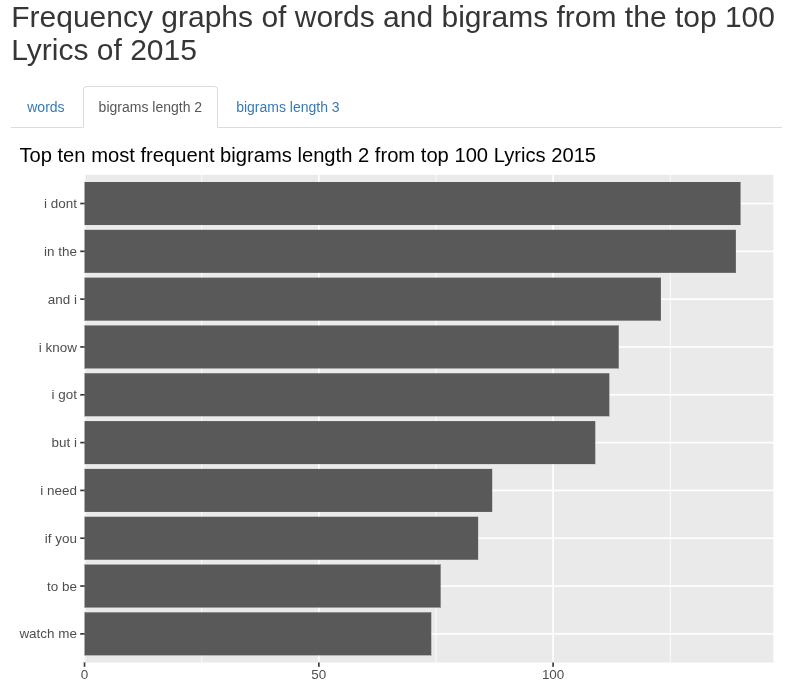
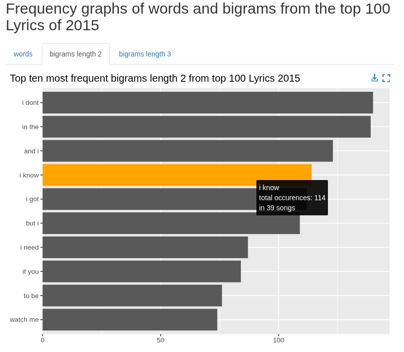
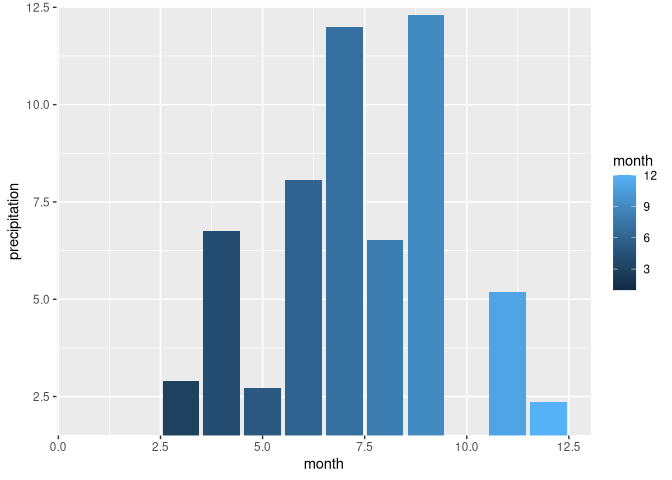
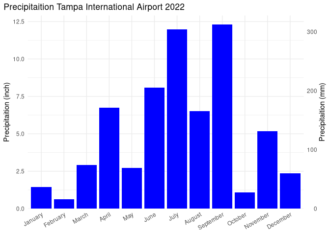

# Data Visualization

> Per Sander.

## Mini-Project 3

In this project, I explored the 2022 data from the FSU Florida Climate Center and the text of the lyrics of the top 100 songs from 2015. The purpose of this project was to explore different types of graphs and to perform a text analysis using bigrams.

The report can be found in sander_project_03.html or sander_project_03.md (The md file on github does not display interactive graphs correctly)

### files

- All code for this project is in sander_project_03.Rmd
- The generated report is in sander_project_03.html (Interactive graphs work in this format)
- A github friendly version is also available in sander_project_03.md (However, this version does not support the interactive graphs in github)

### data files

The data files are in:

../data/

Used by this project:

- ../data/BB_top100_2015.csv
- ../data/tpa_weather_2022.csv


## 1 Interactive Chart

The following interactive barchart graph was created: *(check out sander_project_03.html for an interactive version)*



When hovering over the bars total occurrences and unique occurrences in songs are shown. Furthermore, the graph can be switched between showing the most common word, bigrams of length 2, or bigrams of length 3. Through these interactive graph, I noticed that the dataset is missing spaces in the song lyrics. (check out report for more info)



## 2 Accessibility

For accessibility fig.alt text were included for each graph, and colorblind safe colors and pallets were chosen.(various viridis color pallets used and other colors were tested using this tool <https://rgblind.com/color-blindness-simulator>)

The library ggigraph did not seem to include the fig.alt text. The following workaround was used:

``` r
library(htmltools)

browsable(
  tags$div(
    `aria-label` = "fig.alt text here ...",
    role = "img",
    interactive_graph
  )
)
```

This workaround puts the graph into a div container with text for screen readers.

## 3 bad chart redesign

For this project a bad chart was created on purpose.

### bad example



### reworked graph



The bad graph has multiple issues from aesthetics to miss use of ggplot. The months are not labeled correctly and are treated as a continuous variable rather then a discrete variable. This can be seen by both the color applied as a gradient as the well as the x axis legend. This is fixed by using x=as.factor(month) instead of x=month in aes. The next problem is that the axis labels still do not clearly indicate what is being displayed. For the x axis month names were used instead of numbers and unnecessary legends were removed. Besides non descriptive labels the range of the y axis is wrong and indicates wrongly that there was no precipitation for January, February, and October. The y axis was fixed by showing the range from 0 to 12.5 and by including descriptive labels for the inch value and adding of a mm axis on the right.
