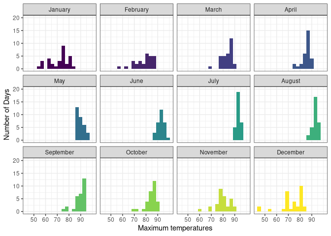
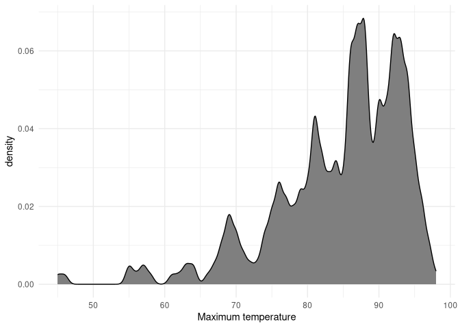
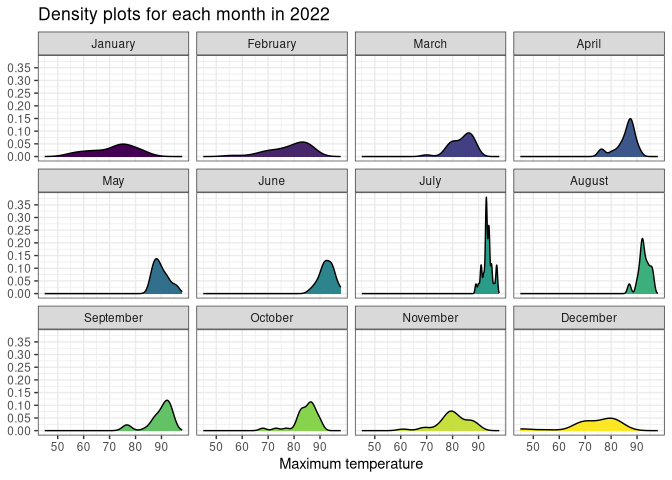
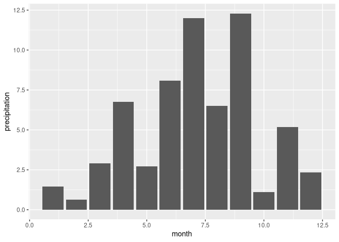

# Data Visualization Project 03


In this exercise you will explore methods to create different types of data visualizations (such as plotting text data, or exploring the distributions of continuous variables).


## PART 1: Density Plots

Using the dataset obtained from FSU's [Florida Climate Center](https://climatecenter.fsu.edu/climate-data-access-tools/downloadable-data), for a station at Tampa International Airport (TPA) for 2022, attempt to recreate the charts shown below which were generated using data from 2016. You can read the 2022 dataset using the code below: 


``` r
library(tidyverse)
weather_tpa <- read_csv("https://raw.githubusercontent.com/aalhamadani/datasets/master/tpa_weather_2022.csv")
# random sample 
sample_n(weather_tpa, 4)
```

```
## # A tibble: 4 × 7
##    year month   day precipitation max_temp min_temp ave_temp
##   <dbl> <dbl> <dbl>         <dbl>    <dbl>    <dbl>    <dbl>
## 1  2022    11     4          0          86       67     76.5
## 2  2022    12    28          0          75       48     61.5
## 3  2022     9    12          0.03       91       77     84  
## 4  2022     1     2          0          82       71     76.5
```

See Slides from Week 4 of Visualizing Relationships and Models (slide 10) for a reminder on how to use this type of dataset with the `lubridate` package for dates and times (example included in the slides uses data from 2016).

Using the 2022 data: 

(a) Create a plot like the one below:


``` r
months <- c("1"="January", "2"="February", "3"="March", "4"="April", "5"="May", "6"="June", 
            "7"="July", "8"="August", "9"="September", "10"="October", "11"="November", "12"="December")

int_to_month_str <- function(int_value) {
  months[int_value]
}

graph1a <- ggplot(data=weather_tpa, aes(x=max_temp, fill=month)) +
  scale_x_continuous(breaks=c(50, 60, 70, 80, 90)) +
  scale_y_continuous(breaks=c(0, 5, 10, 15, 20), limits=c(0,20)) +
  scale_fill_viridis_c() +
  geom_histogram(binwidth = 3) +
  theme_bw() +
  theme(legend.position = "none") +
  facet_wrap(vars(month), labeller = as_labeller(months)) +
  labs(x="Maximum temperatures", y="Number of Days", fill=NULL)

graph1a
```



Hint: the option `binwidth = 3` was used with the `geom_histogram()` function.

(b) Create a plot like the one below:


Hint: check the `kernel` parameter of the `geom_density()` function, and use `bw = 0.5`.


``` r
graph1b <- ggplot(data=weather_tpa, aes(x=max_temp)) +
  geom_density(bw=0.5, fill="#7f7f7f") +
  theme_minimal() +
  labs(x="Maximum temperature", y="density")
  

graph1b
```



(c) Create a plot like the one below:


Hint: default options for `geom_density()` were used. 


``` r
months <- c("1"="January", "2"="February", "3"="March", "4"="April", "5"="May", "6"="June", 
            "7"="July", "8"="August", "9"="September", "10"="October", "11"="November", "12"="December")


graph1b <- ggplot(data=weather_tpa, aes(x=max_temp, fill=month)) +
  scale_x_continuous(breaks=c(50, 60, 70, 80, 90)) +
  scale_y_continuous(breaks=c(0.00, 0.05, 0.10, 0.15, 0.20, 0.25, 0.3, 0.35)) +
  scale_fill_viridis_c() +
  geom_density() +
  facet_wrap(vars(month), labeller = as_labeller(months)) +
  theme_bw() +
  theme(legend.position = "none") +
  labs(x="Maximum temperature", y=NULL, fill=NULL, title = "Density plots for each month in 2022")
  

graph1b
```



(d) Generate a plot like the chart below:


Hint: use the`{ggridges}` package, and the `geom_density_ridges()` function paying close attention to the `quantile_lines` and `quantiles` parameters. The plot above uses the `plasma` option (color scale) for the _viridis_ palette.


``` r
library(ggridges)

months <- c("1"="January", "2"="February", "3"="March", "4"="April", "5"="May", "6"="June", 
            "7"="July", "8"="August", "9"="September", "10"="October", "11"="November", "12"="December")

graph1c <- ggplot(data=weather_tpa, aes(x=max_temp, y=as.factor(month), fill=..x..)) +
  scale_fill_viridis_c(option="plasma") +
  scale_x_continuous(breaks=c(40, 50, 60, 70, 80, 90, 100)) +
  scale_y_discrete(labels = months) +
  geom_density_ridges_gradient(quantile_lines = TRUE, quantiles = 0.5) +
  theme_minimal()+
  labs(y=NULL, x="Maximum temperature (in Fahrenheit degrees)", fill=NULL)

graph1c
```

```
## Warning: The dot-dot notation (`..x..`) was deprecated in ggplot2 3.4.0.
## ℹ Please use `after_stat(x)` instead.
## This warning is displayed once per session.
## Call `lifecycle::last_lifecycle_warnings()` to see where this warning was
## generated.
```

```
## Picking joint bandwidth of 1.93
```


(e) Create a plot of your choice that uses the attribute for precipitation _(values of -99.9 for temperature or -99.99 for precipitation represent missing data)_.

### bad graph example
This graph was created as a bad example for data visualization design. 

``` r
graph1e <- ggplot(data=weather_tpa, aes(x=month, y=precipitation)) +
  geom_col(aes(fill=month))

graph1e
```



### fixed graph *'bad graph example'*


``` r
graph1e <- ggplot(data=weather_tpa, fill="blue", aes(x=as.factor(month), y=precipitation)) +
  geom_col(fill="blue")+
  labs(x=NULL, y="Precipitaition (inch)", title = "Precipitaition Tampa International Airport 2022")+
  scale_x_discrete(labels = months)+
  scale_y_continuous(expand = expansion(mult = c(0, 0.05)), sec.axis = sec_axis(~ . * 25.4, name = "Precipitaition (mm)")) +
  theme_minimal() +
  theme(axis.text.x = element_text(angle = 30, vjust = 1, hjust = 1), axis.title.y.right = element_text(angle = 90), plot.title.position = "plot")
```

```
## Warning in fortify(data, ...): Arguments in `...` must be used.
## ✖ Problematic argument:
## • fill = "blue"
## ℹ Did you misspell an argument name?
```

``` r
graph1e
```


## PART 2 

### Option (A): Visualizing Text Data

### Dataset used for this part:
- [Billboard Top 100 Lyrics](https://raw.githubusercontent.com/aalhamadani/dataviz_final_project/main/data/BB_top100_2015.csv)

### data preparation for graphs

``` r
library(tidytext)


text_lyrics_top_100 <- read.csv("../data/BB_top100_2015.csv") %>%
  filter(!is.na(Lyrics))

place_holder_text_star <- "starwrongstar"

all_lyriscs <- text_lyrics_top_100 %>%
  pull(Lyrics)

all_lyriscs_text <- all_lyriscs %>%
  paste(collapse = " ") %>%
  str_replace_all("\\*", place_holder_text_star)

all_lyriscs_text <- tibble(text = all_lyriscs_text)

token_single_words <- unnest_tokens(all_lyriscs_text, output = word, input = text, token = "regex", pattern = " ") %>%
  mutate(word = str_replace_all(word, place_holder_text_star, "*")) %>%
  count(word, sort = TRUE)

token_bigrams_2_words <- all_lyriscs_text %>%
  unnest_tokens(bigram, text, token="ngrams", n=2) %>%
  count(bigram, sort=TRUE) %>%
  mutate(bigram = str_replace_all(bigram, place_holder_text_star, "*")) %>%
  separate(bigram, c("word1", "word2"), sep=" ", remove = FALSE)

token_bigrams_3_words <- all_lyriscs_text %>%
  unnest_tokens(bigram, text, token="ngrams", n=3) %>%
  count(bigram, sort=TRUE) %>%
  mutate(bigram = str_replace_all(bigram, place_holder_text_star, "*")) %>%
  separate(bigram, c("word1", "word2", "word3"), sep=" ", remove = FALSE)

#text_lyrics_top_100[1]['Lyrics'] %>%
#  unnest_tokens(output = word, input = text)
```
### code for graphs

``` r
library(ggiraph)
library(glue)
library(htmltools)

token_single_words_top_ten <- token_single_words %>%
  slice_max(order_by = n, n = 10) %>%
  rowwise() %>%
  mutate(
    unique_song_occurences = sum(str_detect(all_lyriscs, word), na.rm=TRUE)
  ) %>%
  ungroup()

graph2A1 <- ggplot(token_single_words_top_ten, aes(y=fct_reorder(word, n), x=n)) +
  geom_col_interactive(aes(data_id=word, tooltip=glue("{word}</br>total occurences: {n}</br>in {unique_song_occurences} songs"))) +
  labs(y=NULL, x=NULL, title="Top ten most frequent words from top 100 Lyrics 2015") +
  theme(plot.title.position = "plot") +
  scale_x_continuous(expand = expansion(mult = c(0, 0.05)))

token_bigrams_2_words_top_ten <- token_bigrams_2_words %>%
  slice_max(order_by = n, n = 10) %>%
  rowwise() %>%
  mutate(
    unique_song_occurences = sum(str_detect(all_lyriscs, bigram), na.rm=TRUE)
  ) %>%
  ungroup()

graph2A2 <- ggplot(token_bigrams_2_words_top_ten, aes(y=fct_reorder(bigram, n), x=n)) +
  geom_col_interactive(aes(data_id=bigram, tooltip=glue("{bigram}</br>total occurences: {n}</br>in {unique_song_occurences} songs"))) +
  labs(y=NULL, x=NULL, title="Top ten most frequent bigrams length 2 from top 100 Lyrics 2015") +
  theme(plot.title.position = "plot") +
  scale_x_continuous(expand = expansion(mult = c(0, 0.05)))

token_bigrams_3_words_top_ten <- token_bigrams_3_words %>%
  slice_max(order_by = n, n = 10) %>%
  rowwise() %>%
  mutate(
    unique_song_occurences = sum(str_detect(all_lyriscs, bigram), na.rm=TRUE)
  ) %>%
  ungroup()

graph2A3 <- ggplot(token_bigrams_3_words_top_ten, aes(y=fct_reorder(bigram, n), x=n)) +
  geom_col_interactive(aes(data_id=bigram, tooltip=glue("{bigram}</br>total occurences: {n}</br>in {unique_song_occurences} songs"))) +
  labs(y=NULL, x=NULL, title="Top ten most frequent bigrams length 3 from top 100 Lyrics 2015") +
  theme(plot.title.position = "plot") +
  scale_x_continuous(expand = expansion(mult = c(0, 0.05)))
```

## Frequency graphs of words and bigrams from the top 100 Lyrics of 2015
{.tabset}
-------------------------------------

### words

```{=html}
<div aria-label="Bar chart of the top 10 most frequent words from the top 100 Lyrics of 2015" role="img">
<div class="girafe html-widget html-fill-item" id="htmlwidget-513507929b8ff78dab3d" style="width:960px;height:500px;"></div>
<script type="application/json" data-for="htmlwidget-513507929b8ff78dab3d">{"x":{"html":"<?xml version=\"1.0\" encoding=\"UTF-8\"?>\n<svg xmlns='http://www.w3.org/2000/svg' xmlns:xlink='http://www.w3.org/1999/xlink' class='ggiraph-svg' role='graphics-document' id='svg_3c2e2bda6e2493c6' viewBox='0 0 504 360'>\n <defs id='svg_3c2e2bda6e2493c6_defs'>\n  <clipPath id='svg_3c2e2bda6e2493c6_c1'>\n   <rect x='0' y='0' width='504' height='360'/>\n  <\/clipPath>\n  <clipPath id='svg_3c2e2bda6e2493c6_c2'>\n   <rect x='25.1' y='22.77' width='473.42' height='318.94'/>\n  <\/clipPath>\n <\/defs>\n <g id='svg_3c2e2bda6e2493c6_rootg' class='ggiraph-svg-rootg'>\n  <g clip-path='url(#svg_3c2e2bda6e2493c6_c1)'>\n   <rect x='0' y='0' width='504' height='360' fill='#FFFFFF' fill-opacity='1' stroke='#FFFFFF' stroke-opacity='1' stroke-width='0.75' stroke-linejoin='round' stroke-linecap='round' class='ggiraph-svg-bg'/>\n   <rect x='0' y='0' width='504' height='360' fill='#FFFFFF' fill-opacity='1' stroke='#FFFFFF' stroke-opacity='1' stroke-width='1.07' stroke-linejoin='round' stroke-linecap='round'/>\n  <\/g>\n  <g clip-path='url(#svg_3c2e2bda6e2493c6_c2)'>\n   <rect x='25.1' y='22.77' width='473.42' height='318.94' fill='#EBEBEB' fill-opacity='1' stroke='none'/>\n   <polyline points='80.94,341.71 80.94,22.77' fill='none' stroke='#FFFFFF' stroke-opacity='1' stroke-width='0.53' stroke-linejoin='round' stroke-linecap='butt'/>\n   <polyline points='192.61,341.71 192.61,22.77' fill='none' stroke='#FFFFFF' stroke-opacity='1' stroke-width='0.53' stroke-linejoin='round' stroke-linecap='butt'/>\n   <polyline points='304.28,341.71 304.28,22.77' fill='none' stroke='#FFFFFF' stroke-opacity='1' stroke-width='0.53' stroke-linejoin='round' stroke-linecap='butt'/>\n   <polyline points='415.95,341.71 415.95,22.77' fill='none' stroke='#FFFFFF' stroke-opacity='1' stroke-width='0.53' stroke-linejoin='round' stroke-linecap='butt'/>\n   <polyline points='25.10,322.94 498.52,322.94' fill='none' stroke='#FFFFFF' stroke-opacity='1' stroke-width='1.07' stroke-linejoin='round' stroke-linecap='butt'/>\n   <polyline points='25.10,291.68 498.52,291.68' fill='none' stroke='#FFFFFF' stroke-opacity='1' stroke-width='1.07' stroke-linejoin='round' stroke-linecap='butt'/>\n   <polyline points='25.10,260.41 498.52,260.41' fill='none' stroke='#FFFFFF' stroke-opacity='1' stroke-width='1.07' stroke-linejoin='round' stroke-linecap='butt'/>\n   <polyline points='25.10,229.14 498.52,229.14' fill='none' stroke='#FFFFFF' stroke-opacity='1' stroke-width='1.07' stroke-linejoin='round' stroke-linecap='butt'/>\n   <polyline points='25.10,197.87 498.52,197.87' fill='none' stroke='#FFFFFF' stroke-opacity='1' stroke-width='1.07' stroke-linejoin='round' stroke-linecap='butt'/>\n   <polyline points='25.10,166.60 498.52,166.60' fill='none' stroke='#FFFFFF' stroke-opacity='1' stroke-width='1.07' stroke-linejoin='round' stroke-linecap='butt'/>\n   <polyline points='25.10,135.33 498.52,135.33' fill='none' stroke='#FFFFFF' stroke-opacity='1' stroke-width='1.07' stroke-linejoin='round' stroke-linecap='butt'/>\n   <polyline points='25.10,104.06 498.52,104.06' fill='none' stroke='#FFFFFF' stroke-opacity='1' stroke-width='1.07' stroke-linejoin='round' stroke-linecap='butt'/>\n   <polyline points='25.10,72.80 498.52,72.80' fill='none' stroke='#FFFFFF' stroke-opacity='1' stroke-width='1.07' stroke-linejoin='round' stroke-linecap='butt'/>\n   <polyline points='25.10,41.53 498.52,41.53' fill='none' stroke='#FFFFFF' stroke-opacity='1' stroke-width='1.07' stroke-linejoin='round' stroke-linecap='butt'/>\n   <polyline points='25.10,341.71 25.10,22.77' fill='none' stroke='#FFFFFF' stroke-opacity='1' stroke-width='1.07' stroke-linejoin='round' stroke-linecap='butt'/>\n   <polyline points='136.77,341.71 136.77,22.77' fill='none' stroke='#FFFFFF' stroke-opacity='1' stroke-width='1.07' stroke-linejoin='round' stroke-linecap='butt'/>\n   <polyline points='248.44,341.71 248.44,22.77' fill='none' stroke='#FFFFFF' stroke-opacity='1' stroke-width='1.07' stroke-linejoin='round' stroke-linecap='butt'/>\n   <polyline points='360.12,341.71 360.12,22.77' fill='none' stroke='#FFFFFF' stroke-opacity='1' stroke-width='1.07' stroke-linejoin='round' stroke-linecap='butt'/>\n   <polyline points='471.79,341.71 471.79,22.77' fill='none' stroke='#FFFFFF' stroke-opacity='1' stroke-width='1.07' stroke-linejoin='round' stroke-linecap='butt'/>\n   <rect id='svg_3c2e2bda6e2493c6_e1' x='25.1' y='27.46' width='450.88' height='28.14' fill='#595959' fill-opacity='1' stroke='none' data-id='i' title='i&amp;lt;/br&amp;gt;total occurences: 1615&amp;lt;/br&amp;gt;in 98 songs'/>\n   <rect id='svg_3c2e2bda6e2493c6_e2' x='25.1' y='58.73' width='446.41' height='28.14' fill='#595959' fill-opacity='1' stroke='none' data-id='you' title='you&amp;lt;/br&amp;gt;total occurences: 1599&amp;lt;/br&amp;gt;in 96 songs'/>\n   <rect id='svg_3c2e2bda6e2493c6_e3' x='25.1' y='89.99' width='319.66' height='28.14' fill='#595959' fill-opacity='1' stroke='none' data-id='the' title='the&amp;lt;/br&amp;gt;total occurences: 1145&amp;lt;/br&amp;gt;in 97 songs'/>\n   <rect id='svg_3c2e2bda6e2493c6_e4' x='25.1' y='121.26' width='264.11' height='28.14' fill='#595959' fill-opacity='1' stroke='none' data-id='me' title='me&amp;lt;/br&amp;gt;total occurences: 946&amp;lt;/br&amp;gt;in 96 songs'/>\n   <rect id='svg_3c2e2bda6e2493c6_e5' x='25.1' y='152.53' width='219.72' height='28.14' fill='#595959' fill-opacity='1' stroke='none' data-id='it' title='it&amp;lt;/br&amp;gt;total occurences: 787&amp;lt;/br&amp;gt;in 96 songs'/>\n   <rect id='svg_3c2e2bda6e2493c6_e6' x='25.1' y='183.8' width='199.06' height='28.14' fill='#595959' fill-opacity='1' stroke='none' data-id='and' title='and&amp;lt;/br&amp;gt;total occurences: 713&amp;lt;/br&amp;gt;in 93 songs'/>\n   <rect id='svg_3c2e2bda6e2493c6_e7' x='25.1' y='215.07' width='194.31' height='28.14' fill='#595959' fill-opacity='1' stroke='none' data-id='to' title='to&amp;lt;/br&amp;gt;total occurences: 696&amp;lt;/br&amp;gt;in 96 songs'/>\n   <rect id='svg_3c2e2bda6e2493c6_e8' x='25.1' y='246.34' width='187.05' height='28.14' fill='#595959' fill-opacity='1' stroke='none' data-id='a' title='a&amp;lt;/br&amp;gt;total occurences: 670&amp;lt;/br&amp;gt;in 98 songs'/>\n   <rect id='svg_3c2e2bda6e2493c6_e9' x='25.1' y='277.6' width='177.28' height='28.14' fill='#595959' fill-opacity='1' stroke='none' data-id='my' title='my&amp;lt;/br&amp;gt;total occurences: 635&amp;lt;/br&amp;gt;in 87 songs'/>\n   <rect id='svg_3c2e2bda6e2493c6_e10' x='25.1' y='308.87' width='152.99' height='28.14' fill='#595959' fill-opacity='1' stroke='none' data-id='im' title='im&amp;lt;/br&amp;gt;total occurences: 548&amp;lt;/br&amp;gt;in 84 songs'/>\n  <\/g>\n  <g clip-path='url(#svg_3c2e2bda6e2493c6_c1)'>\n   <text x='10.89' y='325.97' font-size='6.6pt' font-family='Liberation Sans' fill='#4D4D4D' fill-opacity='1'>im<\/text>\n   <text x='8.44' y='294.7' font-size='6.6pt' font-family='Liberation Sans' fill='#4D4D4D' fill-opacity='1'>my<\/text>\n   <text x='15.27' y='263.43' font-size='6.6pt' font-family='Liberation Sans' fill='#4D4D4D' fill-opacity='1'>a<\/text>\n   <text x='12.82' y='232.17' font-size='6.6pt' font-family='Liberation Sans' fill='#4D4D4D' fill-opacity='1'>to<\/text>\n   <text x='5.48' y='200.9' font-size='6.6pt' font-family='Liberation Sans' fill='#4D4D4D' fill-opacity='1'>and<\/text>\n   <text x='15.77' y='169.63' font-size='6.6pt' font-family='Liberation Sans' fill='#4D4D4D' fill-opacity='1'>it<\/text>\n   <text x='7.94' y='138.36' font-size='6.6pt' font-family='Liberation Sans' fill='#4D4D4D' fill-opacity='1'>me<\/text>\n   <text x='7.93' y='107.09' font-size='6.6pt' font-family='Liberation Sans' fill='#4D4D4D' fill-opacity='1'>the<\/text>\n   <text x='5.98' y='75.82' font-size='6.6pt' font-family='Liberation Sans' fill='#4D4D4D' fill-opacity='1'>you<\/text>\n   <text x='18.22' y='44.56' font-size='6.6pt' font-family='Liberation Sans' fill='#4D4D4D' fill-opacity='1'>i<\/text>\n   <polyline points='22.36,322.94 25.10,322.94' fill='none' stroke='#333333' stroke-opacity='1' stroke-width='1.07' stroke-linejoin='round' stroke-linecap='butt'/>\n   <polyline points='22.36,291.68 25.10,291.68' fill='none' stroke='#333333' stroke-opacity='1' stroke-width='1.07' stroke-linejoin='round' stroke-linecap='butt'/>\n   <polyline points='22.36,260.41 25.10,260.41' fill='none' stroke='#333333' stroke-opacity='1' stroke-width='1.07' stroke-linejoin='round' stroke-linecap='butt'/>\n   <polyline points='22.36,229.14 25.10,229.14' fill='none' stroke='#333333' stroke-opacity='1' stroke-width='1.07' stroke-linejoin='round' stroke-linecap='butt'/>\n   <polyline points='22.36,197.87 25.10,197.87' fill='none' stroke='#333333' stroke-opacity='1' stroke-width='1.07' stroke-linejoin='round' stroke-linecap='butt'/>\n   <polyline points='22.36,166.60 25.10,166.60' fill='none' stroke='#333333' stroke-opacity='1' stroke-width='1.07' stroke-linejoin='round' stroke-linecap='butt'/>\n   <polyline points='22.36,135.33 25.10,135.33' fill='none' stroke='#333333' stroke-opacity='1' stroke-width='1.07' stroke-linejoin='round' stroke-linecap='butt'/>\n   <polyline points='22.36,104.06 25.10,104.06' fill='none' stroke='#333333' stroke-opacity='1' stroke-width='1.07' stroke-linejoin='round' stroke-linecap='butt'/>\n   <polyline points='22.36,72.80 25.10,72.80' fill='none' stroke='#333333' stroke-opacity='1' stroke-width='1.07' stroke-linejoin='round' stroke-linecap='butt'/>\n   <polyline points='22.36,41.53 25.10,41.53' fill='none' stroke='#333333' stroke-opacity='1' stroke-width='1.07' stroke-linejoin='round' stroke-linecap='butt'/>\n   <polyline points='25.10,344.44 25.10,341.71' fill='none' stroke='#333333' stroke-opacity='1' stroke-width='1.07' stroke-linejoin='round' stroke-linecap='butt'/>\n   <polyline points='136.77,344.44 136.77,341.71' fill='none' stroke='#333333' stroke-opacity='1' stroke-width='1.07' stroke-linejoin='round' stroke-linecap='butt'/>\n   <polyline points='248.44,344.44 248.44,341.71' fill='none' stroke='#333333' stroke-opacity='1' stroke-width='1.07' stroke-linejoin='round' stroke-linecap='butt'/>\n   <polyline points='360.12,344.44 360.12,341.71' fill='none' stroke='#333333' stroke-opacity='1' stroke-width='1.07' stroke-linejoin='round' stroke-linecap='butt'/>\n   <polyline points='471.79,344.44 471.79,341.71' fill='none' stroke='#333333' stroke-opacity='1' stroke-width='1.07' stroke-linejoin='round' stroke-linecap='butt'/>\n   <text x='22.65' y='352.69' font-size='6.6pt' font-family='Liberation Sans' fill='#4D4D4D' fill-opacity='1'>0<\/text>\n   <text x='129.43' y='352.69' font-size='6.6pt' font-family='Liberation Sans' fill='#4D4D4D' fill-opacity='1'>400<\/text>\n   <text x='241.1' y='352.69' font-size='6.6pt' font-family='Liberation Sans' fill='#4D4D4D' fill-opacity='1'>800<\/text>\n   <text x='350.32' y='352.69' font-size='6.6pt' font-family='Liberation Sans' fill='#4D4D4D' fill-opacity='1'>1200<\/text>\n   <text x='462' y='352.69' font-size='6.6pt' font-family='Liberation Sans' fill='#4D4D4D' fill-opacity='1'>1600<\/text>\n   <text x='5.48' y='14.55' font-size='9.9pt' font-family='Liberation Sans'>Top ten most frequent words from top 100 Lyrics 2015<\/text>\n  <\/g>\n <\/g>\n<\/svg>","js":null,"uid":"svg_3c2e2bda6e2493c6","ratio":1.4,"settings":{"tooltip":{"css":".tooltip_SVGID_ { padding:5px;background:black;color:white;border-radius:2px;text-align:left; ; position:absolute;pointer-events:none;z-index:9999;}","placement":"doc","opacity":0.9,"offx":10,"offy":10,"use_cursor_pos":true,"use_fill":false,"use_stroke":false,"delay_over":200,"delay_out":500},"hover":{"css":".hover_data_SVGID_ { fill:orange;stroke:black;cursor:pointer; }\ntext.hover_data_SVGID_ { stroke:none;fill:orange; }\ncircle.hover_data_SVGID_ { fill:orange;stroke:black; }\nline.hover_data_SVGID_, polyline.hover_data_SVGID_ { fill:none;stroke:orange; }\nrect.hover_data_SVGID_, polygon.hover_data_SVGID_, path.hover_data_SVGID_ { fill:orange;stroke:none; }\nimage.hover_data_SVGID_ { stroke:orange; }","reactive":true,"nearest_distance":null,"linked":false},"hover_inv":{"css":""},"hover_key":{"css":".hover_key_SVGID_ { fill:orange;stroke:black;cursor:pointer; }\ntext.hover_key_SVGID_ { stroke:none;fill:orange; }\ncircle.hover_key_SVGID_ { fill:orange;stroke:black; }\nline.hover_key_SVGID_, polyline.hover_key_SVGID_ { fill:none;stroke:orange; }\nrect.hover_key_SVGID_, polygon.hover_key_SVGID_, path.hover_key_SVGID_ { fill:orange;stroke:none; }\nimage.hover_key_SVGID_ { stroke:orange; }","reactive":true},"hover_theme":{"css":".hover_theme_SVGID_ { fill:orange;stroke:black;cursor:pointer; }\ntext.hover_theme_SVGID_ { stroke:none;fill:orange; }\ncircle.hover_theme_SVGID_ { fill:orange;stroke:black; }\nline.hover_theme_SVGID_, polyline.hover_theme_SVGID_ { fill:none;stroke:orange; }\nrect.hover_theme_SVGID_, polygon.hover_theme_SVGID_, path.hover_theme_SVGID_ { fill:orange;stroke:none; }\nimage.hover_theme_SVGID_ { stroke:orange; }","reactive":true},"select":{"css":".select_data_SVGID_ { fill:red;stroke:black;cursor:pointer; }\ntext.select_data_SVGID_ { stroke:none;fill:red; }\ncircle.select_data_SVGID_ { fill:red;stroke:black; }\nline.select_data_SVGID_, polyline.select_data_SVGID_ { fill:none;stroke:red; }\nrect.select_data_SVGID_, polygon.select_data_SVGID_, path.select_data_SVGID_ { fill:red;stroke:none; }\nimage.select_data_SVGID_ { stroke:red; }","type":"multiple","only_shiny":true,"selected":[],"linked":false},"select_inv":{"css":""},"select_key":{"css":".select_key_SVGID_ { fill:red;stroke:black;cursor:pointer; }\ntext.select_key_SVGID_ { stroke:none;fill:red; }\ncircle.select_key_SVGID_ { fill:red;stroke:black; }\nline.select_key_SVGID_, polyline.select_key_SVGID_ { fill:none;stroke:red; }\nrect.select_key_SVGID_, polygon.select_key_SVGID_, path.select_key_SVGID_ { fill:red;stroke:none; }\nimage.select_key_SVGID_ { stroke:red; }","type":"single","only_shiny":true,"selected":[]},"select_theme":{"css":".select_theme_SVGID_ { fill:red;stroke:black;cursor:pointer; }\ntext.select_theme_SVGID_ { stroke:none;fill:red; }\ncircle.select_theme_SVGID_ { fill:red;stroke:black; }\nline.select_theme_SVGID_, polyline.select_theme_SVGID_ { fill:none;stroke:red; }\nrect.select_theme_SVGID_, polygon.select_theme_SVGID_, path.select_theme_SVGID_ { fill:red;stroke:none; }\nimage.select_theme_SVGID_ { stroke:red; }","type":"single","only_shiny":true,"selected":[]},"zoom":{"min":1,"max":1,"duration":300,"default_on":false},"toolbar":{"position":"topright","pngname":"diagram","tooltips":null,"fixed":false,"hidden":[],"delay_over":200,"delay_out":500},"sizing":{"rescale":true,"width":1}}},"evals":[],"jsHooks":[]}</script>
</div>
```

### bigrams length 2

```{=html}
<div aria-label="Bar chart of the top 10 most frequent bigrams length 2 from the top 100 Lyrics of 2015" role="img">
<div class="girafe html-widget html-fill-item" id="htmlwidget-dd14711dba6f778c9b8b" style="width:960px;height:500px;"></div>
<script type="application/json" data-for="htmlwidget-dd14711dba6f778c9b8b">{"x":{"html":"<?xml version=\"1.0\" encoding=\"UTF-8\"?>\n<svg xmlns='http://www.w3.org/2000/svg' xmlns:xlink='http://www.w3.org/1999/xlink' class='ggiraph-svg' role='graphics-document' id='svg_513507929b8ff78d' viewBox='0 0 504 360'>\n <defs id='svg_513507929b8ff78d_defs'>\n  <clipPath id='svg_513507929b8ff78d_c1'>\n   <rect x='0' y='0' width='504' height='360'/>\n  <\/clipPath>\n  <clipPath id='svg_513507929b8ff78d_c2'>\n   <rect x='48.07' y='22.77' width='450.45' height='318.94'/>\n  <\/clipPath>\n <\/defs>\n <g id='svg_513507929b8ff78d_rootg' class='ggiraph-svg-rootg'>\n  <g clip-path='url(#svg_513507929b8ff78d_c1)'>\n   <rect x='0' y='0' width='504' height='360' fill='#FFFFFF' fill-opacity='1' stroke='#FFFFFF' stroke-opacity='1' stroke-width='0.75' stroke-linejoin='round' stroke-linecap='round' class='ggiraph-svg-bg'/>\n   <rect x='0' y='0' width='504' height='360' fill='#FFFFFF' fill-opacity='1' stroke='#FFFFFF' stroke-opacity='1' stroke-width='1.07' stroke-linejoin='round' stroke-linecap='round'/>\n  <\/g>\n  <g clip-path='url(#svg_513507929b8ff78d_c2)'>\n   <rect x='48.07' y='22.77' width='450.45' height='318.94' fill='#EBEBEB' fill-opacity='1' stroke='none'/>\n   <polyline points='124.68,341.71 124.68,22.77' fill='none' stroke='#FFFFFF' stroke-opacity='1' stroke-width='0.53' stroke-linejoin='round' stroke-linecap='butt'/>\n   <polyline points='277.89,341.71 277.89,22.77' fill='none' stroke='#FFFFFF' stroke-opacity='1' stroke-width='0.53' stroke-linejoin='round' stroke-linecap='butt'/>\n   <polyline points='431.11,341.71 431.11,22.77' fill='none' stroke='#FFFFFF' stroke-opacity='1' stroke-width='0.53' stroke-linejoin='round' stroke-linecap='butt'/>\n   <polyline points='48.07,322.94 498.52,322.94' fill='none' stroke='#FFFFFF' stroke-opacity='1' stroke-width='1.07' stroke-linejoin='round' stroke-linecap='butt'/>\n   <polyline points='48.07,291.68 498.52,291.68' fill='none' stroke='#FFFFFF' stroke-opacity='1' stroke-width='1.07' stroke-linejoin='round' stroke-linecap='butt'/>\n   <polyline points='48.07,260.41 498.52,260.41' fill='none' stroke='#FFFFFF' stroke-opacity='1' stroke-width='1.07' stroke-linejoin='round' stroke-linecap='butt'/>\n   <polyline points='48.07,229.14 498.52,229.14' fill='none' stroke='#FFFFFF' stroke-opacity='1' stroke-width='1.07' stroke-linejoin='round' stroke-linecap='butt'/>\n   <polyline points='48.07,197.87 498.52,197.87' fill='none' stroke='#FFFFFF' stroke-opacity='1' stroke-width='1.07' stroke-linejoin='round' stroke-linecap='butt'/>\n   <polyline points='48.07,166.60 498.52,166.60' fill='none' stroke='#FFFFFF' stroke-opacity='1' stroke-width='1.07' stroke-linejoin='round' stroke-linecap='butt'/>\n   <polyline points='48.07,135.33 498.52,135.33' fill='none' stroke='#FFFFFF' stroke-opacity='1' stroke-width='1.07' stroke-linejoin='round' stroke-linecap='butt'/>\n   <polyline points='48.07,104.06 498.52,104.06' fill='none' stroke='#FFFFFF' stroke-opacity='1' stroke-width='1.07' stroke-linejoin='round' stroke-linecap='butt'/>\n   <polyline points='48.07,72.80 498.52,72.80' fill='none' stroke='#FFFFFF' stroke-opacity='1' stroke-width='1.07' stroke-linejoin='round' stroke-linecap='butt'/>\n   <polyline points='48.07,41.53 498.52,41.53' fill='none' stroke='#FFFFFF' stroke-opacity='1' stroke-width='1.07' stroke-linejoin='round' stroke-linecap='butt'/>\n   <polyline points='48.07,341.71 48.07,22.77' fill='none' stroke='#FFFFFF' stroke-opacity='1' stroke-width='1.07' stroke-linejoin='round' stroke-linecap='butt'/>\n   <polyline points='201.29,341.71 201.29,22.77' fill='none' stroke='#FFFFFF' stroke-opacity='1' stroke-width='1.07' stroke-linejoin='round' stroke-linecap='butt'/>\n   <polyline points='354.50,341.71 354.50,22.77' fill='none' stroke='#FFFFFF' stroke-opacity='1' stroke-width='1.07' stroke-linejoin='round' stroke-linecap='butt'/>\n   <rect id='svg_513507929b8ff78d_e1' x='48.07' y='27.46' width='429' height='28.14' fill='#595959' fill-opacity='1' stroke='none' data-id='i dont' title='i dont&amp;lt;/br&amp;gt;total occurences: 140&amp;lt;/br&amp;gt;in 37 songs'/>\n   <rect id='svg_513507929b8ff78d_e2' x='48.07' y='58.73' width='425.93' height='28.14' fill='#595959' fill-opacity='1' stroke='none' data-id='in the' title='in the&amp;lt;/br&amp;gt;total occurences: 139&amp;lt;/br&amp;gt;in 47 songs'/>\n   <rect id='svg_513507929b8ff78d_e3' x='48.07' y='89.99' width='376.9' height='28.14' fill='#595959' fill-opacity='1' stroke='none' data-id='and i' title='and i&amp;lt;/br&amp;gt;total occurences: 123&amp;lt;/br&amp;gt;in 68 songs'/>\n   <rect id='svg_513507929b8ff78d_e4' x='48.07' y='121.26' width='349.33' height='28.14' fill='#595959' fill-opacity='1' stroke='none' data-id='i know' title='i know&amp;lt;/br&amp;gt;total occurences: 114&amp;lt;/br&amp;gt;in 39 songs'/>\n   <rect id='svg_513507929b8ff78d_e5' x='48.07' y='152.53' width='343.2' height='28.14' fill='#595959' fill-opacity='1' stroke='none' data-id='i got' title='i got&amp;lt;/br&amp;gt;total occurences: 112&amp;lt;/br&amp;gt;in 33 songs'/>\n   <rect id='svg_513507929b8ff78d_e6' x='48.07' y='183.8' width='334' height='28.14' fill='#595959' fill-opacity='1' stroke='none' data-id='but i' title='but i&amp;lt;/br&amp;gt;total occurences: 109&amp;lt;/br&amp;gt;in 42 songs'/>\n   <rect id='svg_513507929b8ff78d_e7' x='48.07' y='215.07' width='266.59' height='28.14' fill='#595959' fill-opacity='1' stroke='none' data-id='i need' title='i need&amp;lt;/br&amp;gt;total occurences: 87&amp;lt;/br&amp;gt;in 12 songs'/>\n   <rect id='svg_513507929b8ff78d_e8' x='48.07' y='246.34' width='257.4' height='28.14' fill='#595959' fill-opacity='1' stroke='none' data-id='if you' title='if you&amp;lt;/br&amp;gt;total occurences: 84&amp;lt;/br&amp;gt;in 37 songs'/>\n   <rect id='svg_513507929b8ff78d_e9' x='48.07' y='277.6' width='232.88' height='28.14' fill='#595959' fill-opacity='1' stroke='none' data-id='to be' title='to be&amp;lt;/br&amp;gt;total occurences: 76&amp;lt;/br&amp;gt;in 26 songs'/>\n   <rect id='svg_513507929b8ff78d_e10' x='48.07' y='308.87' width='226.76' height='28.14' fill='#595959' fill-opacity='1' stroke='none' data-id='watch me' title='watch me&amp;lt;/br&amp;gt;total occurences: 74&amp;lt;/br&amp;gt;in 3 songs'/>\n  <\/g>\n  <g clip-path='url(#svg_513507929b8ff78d_c1)'>\n   <text x='5.48' y='325.97' font-size='6.6pt' font-family='Liberation Sans' fill='#4D4D4D' fill-opacity='1'>watch me<\/text>\n   <text x='23.56' y='294.7' font-size='6.6pt' font-family='Liberation Sans' fill='#4D4D4D' fill-opacity='1'>to be<\/text>\n   <text x='22.1' y='263.43' font-size='6.6pt' font-family='Liberation Sans' fill='#4D4D4D' fill-opacity='1'>if you<\/text>\n   <text x='19.16' y='232.17' font-size='6.6pt' font-family='Liberation Sans' fill='#4D4D4D' fill-opacity='1'>i need<\/text>\n   <text x='26.5' y='200.9' font-size='6.6pt' font-family='Liberation Sans' fill='#4D4D4D' fill-opacity='1'>but i<\/text>\n   <text x='26.5' y='169.63' font-size='6.6pt' font-family='Liberation Sans' fill='#4D4D4D' fill-opacity='1'>i got<\/text>\n   <text x='18.2' y='138.36' font-size='6.6pt' font-family='Liberation Sans' fill='#4D4D4D' fill-opacity='1'>i know<\/text>\n   <text x='24.06' y='107.09' font-size='6.6pt' font-family='Liberation Sans' fill='#4D4D4D' fill-opacity='1'>and i<\/text>\n   <text x='21.61' y='75.82' font-size='6.6pt' font-family='Liberation Sans' fill='#4D4D4D' fill-opacity='1'>in the<\/text>\n   <text x='21.61' y='44.56' font-size='6.6pt' font-family='Liberation Sans' fill='#4D4D4D' fill-opacity='1'>i dont<\/text>\n   <polyline points='45.33,322.94 48.07,322.94' fill='none' stroke='#333333' stroke-opacity='1' stroke-width='1.07' stroke-linejoin='round' stroke-linecap='butt'/>\n   <polyline points='45.33,291.68 48.07,291.68' fill='none' stroke='#333333' stroke-opacity='1' stroke-width='1.07' stroke-linejoin='round' stroke-linecap='butt'/>\n   <polyline points='45.33,260.41 48.07,260.41' fill='none' stroke='#333333' stroke-opacity='1' stroke-width='1.07' stroke-linejoin='round' stroke-linecap='butt'/>\n   <polyline points='45.33,229.14 48.07,229.14' fill='none' stroke='#333333' stroke-opacity='1' stroke-width='1.07' stroke-linejoin='round' stroke-linecap='butt'/>\n   <polyline points='45.33,197.87 48.07,197.87' fill='none' stroke='#333333' stroke-opacity='1' stroke-width='1.07' stroke-linejoin='round' stroke-linecap='butt'/>\n   <polyline points='45.33,166.60 48.07,166.60' fill='none' stroke='#333333' stroke-opacity='1' stroke-width='1.07' stroke-linejoin='round' stroke-linecap='butt'/>\n   <polyline points='45.33,135.33 48.07,135.33' fill='none' stroke='#333333' stroke-opacity='1' stroke-width='1.07' stroke-linejoin='round' stroke-linecap='butt'/>\n   <polyline points='45.33,104.06 48.07,104.06' fill='none' stroke='#333333' stroke-opacity='1' stroke-width='1.07' stroke-linejoin='round' stroke-linecap='butt'/>\n   <polyline points='45.33,72.80 48.07,72.80' fill='none' stroke='#333333' stroke-opacity='1' stroke-width='1.07' stroke-linejoin='round' stroke-linecap='butt'/>\n   <polyline points='45.33,41.53 48.07,41.53' fill='none' stroke='#333333' stroke-opacity='1' stroke-width='1.07' stroke-linejoin='round' stroke-linecap='butt'/>\n   <polyline points='48.07,344.44 48.07,341.71' fill='none' stroke='#333333' stroke-opacity='1' stroke-width='1.07' stroke-linejoin='round' stroke-linecap='butt'/>\n   <polyline points='201.29,344.44 201.29,341.71' fill='none' stroke='#333333' stroke-opacity='1' stroke-width='1.07' stroke-linejoin='round' stroke-linecap='butt'/>\n   <polyline points='354.50,344.44 354.50,341.71' fill='none' stroke='#333333' stroke-opacity='1' stroke-width='1.07' stroke-linejoin='round' stroke-linecap='butt'/>\n   <text x='45.63' y='352.69' font-size='6.6pt' font-family='Liberation Sans' fill='#4D4D4D' fill-opacity='1'>0<\/text>\n   <text x='196.39' y='352.69' font-size='6.6pt' font-family='Liberation Sans' fill='#4D4D4D' fill-opacity='1'>50<\/text>\n   <text x='347.16' y='352.69' font-size='6.6pt' font-family='Liberation Sans' fill='#4D4D4D' fill-opacity='1'>100<\/text>\n   <text x='5.48' y='14.55' font-size='9.9pt' font-family='Liberation Sans'>Top ten most frequent bigrams length 2 from top 100 Lyrics 2015<\/text>\n  <\/g>\n <\/g>\n<\/svg>","js":null,"uid":"svg_513507929b8ff78d","ratio":1.4,"settings":{"tooltip":{"css":".tooltip_SVGID_ { padding:5px;background:black;color:white;border-radius:2px;text-align:left; ; position:absolute;pointer-events:none;z-index:9999;}","placement":"doc","opacity":0.9,"offx":10,"offy":10,"use_cursor_pos":true,"use_fill":false,"use_stroke":false,"delay_over":200,"delay_out":500},"hover":{"css":".hover_data_SVGID_ { fill:orange;stroke:black;cursor:pointer; }\ntext.hover_data_SVGID_ { stroke:none;fill:orange; }\ncircle.hover_data_SVGID_ { fill:orange;stroke:black; }\nline.hover_data_SVGID_, polyline.hover_data_SVGID_ { fill:none;stroke:orange; }\nrect.hover_data_SVGID_, polygon.hover_data_SVGID_, path.hover_data_SVGID_ { fill:orange;stroke:none; }\nimage.hover_data_SVGID_ { stroke:orange; }","reactive":true,"nearest_distance":null,"linked":false},"hover_inv":{"css":""},"hover_key":{"css":".hover_key_SVGID_ { fill:orange;stroke:black;cursor:pointer; }\ntext.hover_key_SVGID_ { stroke:none;fill:orange; }\ncircle.hover_key_SVGID_ { fill:orange;stroke:black; }\nline.hover_key_SVGID_, polyline.hover_key_SVGID_ { fill:none;stroke:orange; }\nrect.hover_key_SVGID_, polygon.hover_key_SVGID_, path.hover_key_SVGID_ { fill:orange;stroke:none; }\nimage.hover_key_SVGID_ { stroke:orange; }","reactive":true},"hover_theme":{"css":".hover_theme_SVGID_ { fill:orange;stroke:black;cursor:pointer; }\ntext.hover_theme_SVGID_ { stroke:none;fill:orange; }\ncircle.hover_theme_SVGID_ { fill:orange;stroke:black; }\nline.hover_theme_SVGID_, polyline.hover_theme_SVGID_ { fill:none;stroke:orange; }\nrect.hover_theme_SVGID_, polygon.hover_theme_SVGID_, path.hover_theme_SVGID_ { fill:orange;stroke:none; }\nimage.hover_theme_SVGID_ { stroke:orange; }","reactive":true},"select":{"css":".select_data_SVGID_ { fill:red;stroke:black;cursor:pointer; }\ntext.select_data_SVGID_ { stroke:none;fill:red; }\ncircle.select_data_SVGID_ { fill:red;stroke:black; }\nline.select_data_SVGID_, polyline.select_data_SVGID_ { fill:none;stroke:red; }\nrect.select_data_SVGID_, polygon.select_data_SVGID_, path.select_data_SVGID_ { fill:red;stroke:none; }\nimage.select_data_SVGID_ { stroke:red; }","type":"multiple","only_shiny":true,"selected":[],"linked":false},"select_inv":{"css":""},"select_key":{"css":".select_key_SVGID_ { fill:red;stroke:black;cursor:pointer; }\ntext.select_key_SVGID_ { stroke:none;fill:red; }\ncircle.select_key_SVGID_ { fill:red;stroke:black; }\nline.select_key_SVGID_, polyline.select_key_SVGID_ { fill:none;stroke:red; }\nrect.select_key_SVGID_, polygon.select_key_SVGID_, path.select_key_SVGID_ { fill:red;stroke:none; }\nimage.select_key_SVGID_ { stroke:red; }","type":"single","only_shiny":true,"selected":[]},"select_theme":{"css":".select_theme_SVGID_ { fill:red;stroke:black;cursor:pointer; }\ntext.select_theme_SVGID_ { stroke:none;fill:red; }\ncircle.select_theme_SVGID_ { fill:red;stroke:black; }\nline.select_theme_SVGID_, polyline.select_theme_SVGID_ { fill:none;stroke:red; }\nrect.select_theme_SVGID_, polygon.select_theme_SVGID_, path.select_theme_SVGID_ { fill:red;stroke:none; }\nimage.select_theme_SVGID_ { stroke:red; }","type":"single","only_shiny":true,"selected":[]},"zoom":{"min":1,"max":1,"duration":300,"default_on":false},"toolbar":{"position":"topright","pngname":"diagram","tooltips":null,"fixed":false,"hidden":[],"delay_over":200,"delay_out":500},"sizing":{"rescale":true,"width":1}}},"evals":[],"jsHooks":[]}</script>
</div>
```

### bigrams length 3

```{=html}
<div aria-label="Bar chart of the top 10 most frequent bigrams length 3 from the top 100 Lyrics of 2015" role="img">
<div class="girafe html-widget html-fill-item" id="htmlwidget-9b58d0264451a4f0ebd7" style="width:960px;height:500px;"></div>
<script type="application/json" data-for="htmlwidget-9b58d0264451a4f0ebd7">{"x":{"html":"<?xml version=\"1.0\" encoding=\"UTF-8\"?>\n<svg xmlns='http://www.w3.org/2000/svg' xmlns:xlink='http://www.w3.org/1999/xlink' class='ggiraph-svg' role='graphics-document' id='svg_ab3ddd14711dba6f' viewBox='0 0 504 360'>\n <defs id='svg_ab3ddd14711dba6f_defs'>\n  <clipPath id='svg_ab3ddd14711dba6f_c1'>\n   <rect x='0' y='0' width='504' height='360'/>\n  <\/clipPath>\n  <clipPath id='svg_ab3ddd14711dba6f_c2'>\n   <rect x='65.72' y='22.77' width='432.8' height='318.94'/>\n  <\/clipPath>\n <\/defs>\n <g id='svg_ab3ddd14711dba6f_rootg' class='ggiraph-svg-rootg'>\n  <g clip-path='url(#svg_ab3ddd14711dba6f_c1)'>\n   <rect x='0' y='0' width='504' height='360' fill='#FFFFFF' fill-opacity='1' stroke='#FFFFFF' stroke-opacity='1' stroke-width='0.75' stroke-linejoin='round' stroke-linecap='round' class='ggiraph-svg-bg'/>\n   <rect x='0' y='0' width='504' height='360' fill='#FFFFFF' fill-opacity='1' stroke='#FFFFFF' stroke-opacity='1' stroke-width='1.07' stroke-linejoin='round' stroke-linecap='round'/>\n  <\/g>\n  <g clip-path='url(#svg_ab3ddd14711dba6f_c2)'>\n   <rect x='65.72' y='22.77' width='432.8' height='318.94' fill='#EBEBEB' fill-opacity='1' stroke='none'/>\n   <polyline points='122.97,341.71 122.97,22.77' fill='none' stroke='#FFFFFF' stroke-opacity='1' stroke-width='0.53' stroke-linejoin='round' stroke-linecap='butt'/>\n   <polyline points='237.47,341.71 237.47,22.77' fill='none' stroke='#FFFFFF' stroke-opacity='1' stroke-width='0.53' stroke-linejoin='round' stroke-linecap='butt'/>\n   <polyline points='351.96,341.71 351.96,22.77' fill='none' stroke='#FFFFFF' stroke-opacity='1' stroke-width='0.53' stroke-linejoin='round' stroke-linecap='butt'/>\n   <polyline points='466.46,341.71 466.46,22.77' fill='none' stroke='#FFFFFF' stroke-opacity='1' stroke-width='0.53' stroke-linejoin='round' stroke-linecap='butt'/>\n   <polyline points='65.72,322.94 498.52,322.94' fill='none' stroke='#FFFFFF' stroke-opacity='1' stroke-width='1.07' stroke-linejoin='round' stroke-linecap='butt'/>\n   <polyline points='65.72,291.68 498.52,291.68' fill='none' stroke='#FFFFFF' stroke-opacity='1' stroke-width='1.07' stroke-linejoin='round' stroke-linecap='butt'/>\n   <polyline points='65.72,260.41 498.52,260.41' fill='none' stroke='#FFFFFF' stroke-opacity='1' stroke-width='1.07' stroke-linejoin='round' stroke-linecap='butt'/>\n   <polyline points='65.72,229.14 498.52,229.14' fill='none' stroke='#FFFFFF' stroke-opacity='1' stroke-width='1.07' stroke-linejoin='round' stroke-linecap='butt'/>\n   <polyline points='65.72,197.87 498.52,197.87' fill='none' stroke='#FFFFFF' stroke-opacity='1' stroke-width='1.07' stroke-linejoin='round' stroke-linecap='butt'/>\n   <polyline points='65.72,166.60 498.52,166.60' fill='none' stroke='#FFFFFF' stroke-opacity='1' stroke-width='1.07' stroke-linejoin='round' stroke-linecap='butt'/>\n   <polyline points='65.72,135.33 498.52,135.33' fill='none' stroke='#FFFFFF' stroke-opacity='1' stroke-width='1.07' stroke-linejoin='round' stroke-linecap='butt'/>\n   <polyline points='65.72,104.06 498.52,104.06' fill='none' stroke='#FFFFFF' stroke-opacity='1' stroke-width='1.07' stroke-linejoin='round' stroke-linecap='butt'/>\n   <polyline points='65.72,72.80 498.52,72.80' fill='none' stroke='#FFFFFF' stroke-opacity='1' stroke-width='1.07' stroke-linejoin='round' stroke-linecap='butt'/>\n   <polyline points='65.72,41.53 498.52,41.53' fill='none' stroke='#FFFFFF' stroke-opacity='1' stroke-width='1.07' stroke-linejoin='round' stroke-linecap='butt'/>\n   <polyline points='65.72,341.71 65.72,22.77' fill='none' stroke='#FFFFFF' stroke-opacity='1' stroke-width='1.07' stroke-linejoin='round' stroke-linecap='butt'/>\n   <polyline points='180.22,341.71 180.22,22.77' fill='none' stroke='#FFFFFF' stroke-opacity='1' stroke-width='1.07' stroke-linejoin='round' stroke-linecap='butt'/>\n   <polyline points='294.72,341.71 294.72,22.77' fill='none' stroke='#FFFFFF' stroke-opacity='1' stroke-width='1.07' stroke-linejoin='round' stroke-linecap='butt'/>\n   <polyline points='409.21,341.71 409.21,22.77' fill='none' stroke='#FFFFFF' stroke-opacity='1' stroke-width='1.07' stroke-linejoin='round' stroke-linecap='butt'/>\n   <rect id='svg_ab3ddd14711dba6f_e1' x='65.72' y='27.46' width='412.19' height='28.14' fill='#595959' fill-opacity='1' stroke='none' data-id='i shake it' title='i shake it&amp;lt;/br&amp;gt;total occurences: 36&amp;lt;/br&amp;gt;in 1 songs'/>\n   <rect id='svg_ab3ddd14711dba6f_e2' x='65.72' y='58.73' width='389.29' height='28.14' fill='#595959' fill-opacity='1' stroke='none' data-id='deep is your' title='deep is your&amp;lt;/br&amp;gt;total occurences: 34&amp;lt;/br&amp;gt;in 1 songs'/>\n   <rect id='svg_ab3ddd14711dba6f_e3' x='65.72' y='121.26' width='377.84' height='28.14' fill='#595959' fill-opacity='1' stroke='none' data-id='i need you' title='i need you&amp;lt;/br&amp;gt;total occurences: 33&amp;lt;/br&amp;gt;in 3 songs'/>\n   <rect id='svg_ab3ddd14711dba6f_e4' x='65.72' y='89.99' width='377.84' height='28.14' fill='#595959' fill-opacity='1' stroke='none' data-id='like you do' title='like you do&amp;lt;/br&amp;gt;total occurences: 33&amp;lt;/br&amp;gt;in 2 songs'/>\n   <rect id='svg_ab3ddd14711dba6f_e5' x='65.72' y='246.34' width='366.39' height='28.14' fill='#595959' fill-opacity='1' stroke='none' data-id='how deep is' title='how deep is&amp;lt;/br&amp;gt;total occurences: 32&amp;lt;/br&amp;gt;in 1 songs'/>\n   <rect id='svg_ab3ddd14711dba6f_e6' x='65.72' y='215.07' width='366.39' height='28.14' fill='#595959' fill-opacity='1' stroke='none' data-id='is your love' title='is your love&amp;lt;/br&amp;gt;total occurences: 32&amp;lt;/br&amp;gt;in 1 songs'/>\n   <rect id='svg_ab3ddd14711dba6f_e7' x='65.72' y='183.8' width='366.39' height='28.14' fill='#595959' fill-opacity='1' stroke='none' data-id='me like you' title='me like you&amp;lt;/br&amp;gt;total occurences: 32&amp;lt;/br&amp;gt;in 3 songs'/>\n   <rect id='svg_ab3ddd14711dba6f_e8' x='65.72' y='152.53' width='366.39' height='28.14' fill='#595959' fill-opacity='1' stroke='none' data-id='shake it off' title='shake it off&amp;lt;/br&amp;gt;total occurences: 32&amp;lt;/br&amp;gt;in 1 songs'/>\n   <rect id='svg_ab3ddd14711dba6f_e9' x='65.72' y='308.87' width='354.94' height='28.14' fill='#595959' fill-opacity='1' stroke='none' data-id='bout that bass' title='bout that bass&amp;lt;/br&amp;gt;total occurences: 31&amp;lt;/br&amp;gt;in 1 songs'/>\n   <rect id='svg_ab3ddd14711dba6f_e10' x='65.72' y='277.6' width='354.94' height='28.14' fill='#595959' fill-opacity='1' stroke='none' data-id='oh oh oh' title='oh oh oh&amp;lt;/br&amp;gt;total occurences: 31&amp;lt;/br&amp;gt;in 4 songs'/>\n  <\/g>\n  <g clip-path='url(#svg_ab3ddd14711dba6f_c1)'>\n   <text x='5.48' y='325.97' font-size='6.6pt' font-family='Liberation Sans' fill='#4D4D4D' fill-opacity='1'>bout that bass<\/text>\n   <text x='26.52' y='294.7' font-size='6.6pt' font-family='Liberation Sans' fill='#4D4D4D' fill-opacity='1'>oh oh oh<\/text>\n   <text x='13.82' y='263.43' font-size='6.6pt' font-family='Liberation Sans' fill='#4D4D4D' fill-opacity='1'>how deep is<\/text>\n   <text x='16.28' y='232.17' font-size='6.6pt' font-family='Liberation Sans' fill='#4D4D4D' fill-opacity='1'>is your love<\/text>\n   <text x='16.28' y='200.9' font-size='6.6pt' font-family='Liberation Sans' fill='#4D4D4D' fill-opacity='1'>me like you<\/text>\n   <text x='18.37' y='169.63' font-size='6.6pt' font-family='Liberation Sans' fill='#4D4D4D' fill-opacity='1'>shake it off<\/text>\n   <text x='20.17' y='138.36' font-size='6.6pt' font-family='Liberation Sans' fill='#4D4D4D' fill-opacity='1'>i need you<\/text>\n   <text x='18.71' y='107.09' font-size='6.6pt' font-family='Liberation Sans' fill='#4D4D4D' fill-opacity='1'>like you do<\/text>\n   <text x='12.84' y='75.82' font-size='6.6pt' font-family='Liberation Sans' fill='#4D4D4D' fill-opacity='1'>deep is your<\/text>\n   <text x='26.06' y='44.56' font-size='6.6pt' font-family='Liberation Sans' fill='#4D4D4D' fill-opacity='1'>i shake it<\/text>\n   <polyline points='62.98,322.94 65.72,322.94' fill='none' stroke='#333333' stroke-opacity='1' stroke-width='1.07' stroke-linejoin='round' stroke-linecap='butt'/>\n   <polyline points='62.98,291.68 65.72,291.68' fill='none' stroke='#333333' stroke-opacity='1' stroke-width='1.07' stroke-linejoin='round' stroke-linecap='butt'/>\n   <polyline points='62.98,260.41 65.72,260.41' fill='none' stroke='#333333' stroke-opacity='1' stroke-width='1.07' stroke-linejoin='round' stroke-linecap='butt'/>\n   <polyline points='62.98,229.14 65.72,229.14' fill='none' stroke='#333333' stroke-opacity='1' stroke-width='1.07' stroke-linejoin='round' stroke-linecap='butt'/>\n   <polyline points='62.98,197.87 65.72,197.87' fill='none' stroke='#333333' stroke-opacity='1' stroke-width='1.07' stroke-linejoin='round' stroke-linecap='butt'/>\n   <polyline points='62.98,166.60 65.72,166.60' fill='none' stroke='#333333' stroke-opacity='1' stroke-width='1.07' stroke-linejoin='round' stroke-linecap='butt'/>\n   <polyline points='62.98,135.33 65.72,135.33' fill='none' stroke='#333333' stroke-opacity='1' stroke-width='1.07' stroke-linejoin='round' stroke-linecap='butt'/>\n   <polyline points='62.98,104.06 65.72,104.06' fill='none' stroke='#333333' stroke-opacity='1' stroke-width='1.07' stroke-linejoin='round' stroke-linecap='butt'/>\n   <polyline points='62.98,72.80 65.72,72.80' fill='none' stroke='#333333' stroke-opacity='1' stroke-width='1.07' stroke-linejoin='round' stroke-linecap='butt'/>\n   <polyline points='62.98,41.53 65.72,41.53' fill='none' stroke='#333333' stroke-opacity='1' stroke-width='1.07' stroke-linejoin='round' stroke-linecap='butt'/>\n   <polyline points='65.72,344.44 65.72,341.71' fill='none' stroke='#333333' stroke-opacity='1' stroke-width='1.07' stroke-linejoin='round' stroke-linecap='butt'/>\n   <polyline points='180.22,344.44 180.22,341.71' fill='none' stroke='#333333' stroke-opacity='1' stroke-width='1.07' stroke-linejoin='round' stroke-linecap='butt'/>\n   <polyline points='294.72,344.44 294.72,341.71' fill='none' stroke='#333333' stroke-opacity='1' stroke-width='1.07' stroke-linejoin='round' stroke-linecap='butt'/>\n   <polyline points='409.21,344.44 409.21,341.71' fill='none' stroke='#333333' stroke-opacity='1' stroke-width='1.07' stroke-linejoin='round' stroke-linecap='butt'/>\n   <text x='63.27' y='352.69' font-size='6.6pt' font-family='Liberation Sans' fill='#4D4D4D' fill-opacity='1'>0<\/text>\n   <text x='175.32' y='352.69' font-size='6.6pt' font-family='Liberation Sans' fill='#4D4D4D' fill-opacity='1'>10<\/text>\n   <text x='289.82' y='352.69' font-size='6.6pt' font-family='Liberation Sans' fill='#4D4D4D' fill-opacity='1'>20<\/text>\n   <text x='404.32' y='352.69' font-size='6.6pt' font-family='Liberation Sans' fill='#4D4D4D' fill-opacity='1'>30<\/text>\n   <text x='5.48' y='14.55' font-size='9.9pt' font-family='Liberation Sans'>Top ten most frequent bigrams length 3 from top 100 Lyrics 2015<\/text>\n  <\/g>\n <\/g>\n<\/svg>","js":null,"uid":"svg_ab3ddd14711dba6f","ratio":1.4,"settings":{"tooltip":{"css":".tooltip_SVGID_ { padding:5px;background:black;color:white;border-radius:2px;text-align:left; ; position:absolute;pointer-events:none;z-index:9999;}","placement":"doc","opacity":0.9,"offx":10,"offy":10,"use_cursor_pos":true,"use_fill":false,"use_stroke":false,"delay_over":200,"delay_out":500},"hover":{"css":".hover_data_SVGID_ { fill:orange;stroke:black;cursor:pointer; }\ntext.hover_data_SVGID_ { stroke:none;fill:orange; }\ncircle.hover_data_SVGID_ { fill:orange;stroke:black; }\nline.hover_data_SVGID_, polyline.hover_data_SVGID_ { fill:none;stroke:orange; }\nrect.hover_data_SVGID_, polygon.hover_data_SVGID_, path.hover_data_SVGID_ { fill:orange;stroke:none; }\nimage.hover_data_SVGID_ { stroke:orange; }","reactive":true,"nearest_distance":null,"linked":false},"hover_inv":{"css":""},"hover_key":{"css":".hover_key_SVGID_ { fill:orange;stroke:black;cursor:pointer; }\ntext.hover_key_SVGID_ { stroke:none;fill:orange; }\ncircle.hover_key_SVGID_ { fill:orange;stroke:black; }\nline.hover_key_SVGID_, polyline.hover_key_SVGID_ { fill:none;stroke:orange; }\nrect.hover_key_SVGID_, polygon.hover_key_SVGID_, path.hover_key_SVGID_ { fill:orange;stroke:none; }\nimage.hover_key_SVGID_ { stroke:orange; }","reactive":true},"hover_theme":{"css":".hover_theme_SVGID_ { fill:orange;stroke:black;cursor:pointer; }\ntext.hover_theme_SVGID_ { stroke:none;fill:orange; }\ncircle.hover_theme_SVGID_ { fill:orange;stroke:black; }\nline.hover_theme_SVGID_, polyline.hover_theme_SVGID_ { fill:none;stroke:orange; }\nrect.hover_theme_SVGID_, polygon.hover_theme_SVGID_, path.hover_theme_SVGID_ { fill:orange;stroke:none; }\nimage.hover_theme_SVGID_ { stroke:orange; }","reactive":true},"select":{"css":".select_data_SVGID_ { fill:red;stroke:black;cursor:pointer; }\ntext.select_data_SVGID_ { stroke:none;fill:red; }\ncircle.select_data_SVGID_ { fill:red;stroke:black; }\nline.select_data_SVGID_, polyline.select_data_SVGID_ { fill:none;stroke:red; }\nrect.select_data_SVGID_, polygon.select_data_SVGID_, path.select_data_SVGID_ { fill:red;stroke:none; }\nimage.select_data_SVGID_ { stroke:red; }","type":"multiple","only_shiny":true,"selected":[],"linked":false},"select_inv":{"css":""},"select_key":{"css":".select_key_SVGID_ { fill:red;stroke:black;cursor:pointer; }\ntext.select_key_SVGID_ { stroke:none;fill:red; }\ncircle.select_key_SVGID_ { fill:red;stroke:black; }\nline.select_key_SVGID_, polyline.select_key_SVGID_ { fill:none;stroke:red; }\nrect.select_key_SVGID_, polygon.select_key_SVGID_, path.select_key_SVGID_ { fill:red;stroke:none; }\nimage.select_key_SVGID_ { stroke:red; }","type":"single","only_shiny":true,"selected":[]},"select_theme":{"css":".select_theme_SVGID_ { fill:red;stroke:black;cursor:pointer; }\ntext.select_theme_SVGID_ { stroke:none;fill:red; }\ncircle.select_theme_SVGID_ { fill:red;stroke:black; }\nline.select_theme_SVGID_, polyline.select_theme_SVGID_ { fill:none;stroke:red; }\nrect.select_theme_SVGID_, polygon.select_theme_SVGID_, path.select_theme_SVGID_ { fill:red;stroke:none; }\nimage.select_theme_SVGID_ { stroke:red; }","type":"single","only_shiny":true,"selected":[]},"zoom":{"min":1,"max":1,"duration":300,"default_on":false},"toolbar":{"position":"topright","pngname":"diagram","tooltips":null,"fixed":false,"hidden":[],"delay_over":200,"delay_out":500},"sizing":{"rescale":true,"width":1}}},"evals":[],"jsHooks":[]}</script>
</div>
```

The most common word is *"I"* with 1615 occurrences in 98 songs which means it is in every song in the dataset as only 98 of the 100 have lyrics in the dataset. Among top ten is one other word *"a"* which also occurred in every song. *"I dont"* is the most common bigram of length 2 with 140 occurrences in 37 songs. However, *"and i"* has 123 occurrences but does appear in 68 songs. The most common bigram of length 3 is "i shake it" occurring 36 times in the Taylor swift song *shake it off*. Within the top ten only 4 bigrams occurred in more then one song and those also only in 2 - 4 times. 


Interesting to note is that for bigrams length 3 "shake it off" has a frequency of 32 and "I shake it" has a frequency of 36. Both bigrams come from the sentence "I shake it off" in the Taylor swift song "shake it off". If they come from the same sentence within the same song how is there frequency different ? It turns out the dataset is missing some spaces "i shake it offhey hey" resulting in wrong bigram counts. The exact frequency of this issue can only be determined by checking each song individually.

